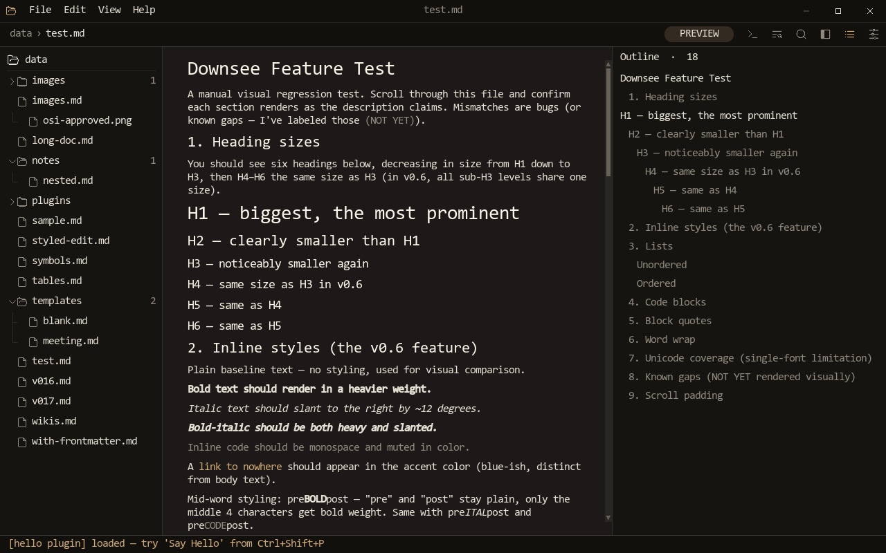
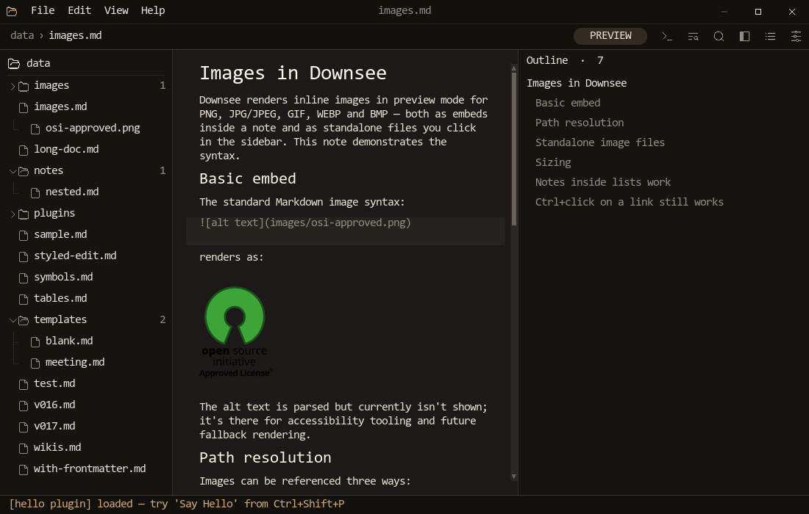
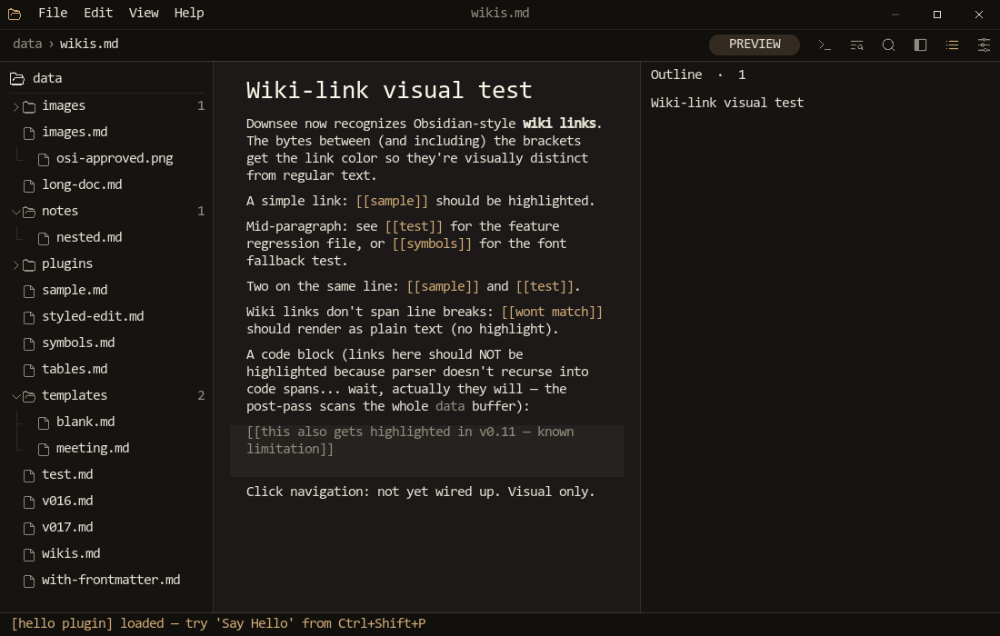
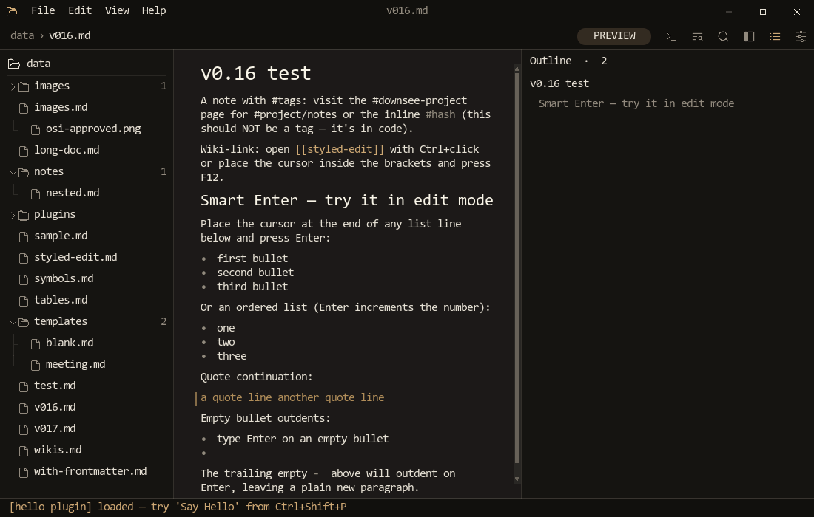

# Downsee

A keyboard-driven markdown editor in C, SDL2, and Lua. Aims at the
Obsidian / Lite XL ergonomics — vault sidebar, wiki links, full
preview rendering, plugin host — without the Electron tax.



---

## What works

- **Live preview** of CommonMark via [md4c](https://github.com/mity/md4c)
  — headings, lists, task lists, code fences, block quotes, tables,
  inline styles, links, soft and hard breaks.
- **Edit mode** with a real text buffer (undo/redo, multi-byte caret,
  selection, smart Enter for lists, auto-pairs, find/replace).
- **Vault sidebar** with collapsible folders, drag-and-drop reorder,
  right-click context menu, recents tracking, and **image files** that
  open straight into the preview pane.
- **Wiki links** `[[note name]]` resolve case-insensitively across the
  vault; backlinks panel shows every note that points at the current
  one.
- **Outline panel** auto-generated from headings, pinned or modal.
- **Find / Replace** with regex, case-insensitive, whole-word, live
  match count, caret-aware editing, click-to-position. Searches the
  raw source in edit mode and the rendered text in preview so the
  highlights line up in either view.
- **Vault-wide search** across every note with a results overlay.
- **Quick switcher** (Ctrl+P) — recents-first, fuzzy match.
- **Command palette** (Ctrl+Shift+P) — every action plus every
  Lua-registered plugin action with a category chip and bound
  shortcut.
- **Plugin host** — drop `*.lua` in `data/plugins/`, register actions
  with `downsee.register_action("name", fn)`, surface UI with
  `downsee.notify` and `downsee.dialog`. Plugins overlay lists every
  loaded file and the actions each registered, with a hot-reload
  button.
- **In-app modals** for Save / Save As / Rename / New File — no
  native Win32 dialogs, full keyboard nav, sidebar-style file
  browser.
- **Custom title bar** with File / Edit / View / Help menus, aero
  snap, drag-to-move, min/maximize/close, working under
  `SDL_WINDOW_BORDERLESS` via a WS_THICKFRAME + WM_NCCALCSIZE
  trick.
- **Live resize indicator** — a centered `W x H` badge plus a window
  outline render while the user drags an edge. The resize loop pumps
  through an SDL event watch so the indicator animates during the
  drag, not after.
- **Plugin actions, Ctrl+click external links, image preview,
  About dialog, settings persistence, theme picker, keybinding
  editor, daily-notes, HTML export, ASCII-art table aligner** ...

---

## Screenshots

### Image embeds in preview



### Wiki links and quote blocks



### Tags, lists, mid-line styling



---

## Stack

| Layer            | Library                                          |
|------------------|--------------------------------------------------|
| Language         | C11                                              |
| Window / input   | SDL2                                             |
| Glyph cache      | FreeType + HarfBuzz                              |
| Markdown parser  | [md4c](https://github.com/mity/md4c) (vendored)  |
| Scripting        | Lua 5.4 (vendored)                               |
| SVG icons / pills| [nanosvg](https://github.com/memononen/nanosvg) (vendored) |
| Image decode     | libpng, libjpeg                                  |
| Anti-aliasing    | custom analytic signed-distance-field pill rasterizer |
| Build            | CMake + Ninja                                    |

No GTK, no Qt, no web view, no JS runtime. The compiled binary is a
single `downsee.exe` plus its DLL dependencies (SDL2, FreeType,
HarfBuzz, libpng, libjpeg).

---

## Building

### Windows (MSYS2 MinGW-w64)

```sh
pacman -S mingw-w64-x86_64-{gcc,cmake,ninja,SDL2,freetype,harfbuzz,libpng,libjpeg-turbo}
cmake -G Ninja -B build
ninja -C build
./build/downsee.exe
```

### Linux

```sh
apt install build-essential cmake ninja-build libsdl2-dev libfreetype-dev libharfbuzz-dev libpng-dev libjpeg-dev
cmake -G Ninja -B build
ninja -C build
./build/downsee
```

The build copies `data/` next to the binary on each compile so plugins,
themes, and the sample vault travel with the executable.

---

## Layout

```
src/             - C sources (single-binary)
  main.c         - app loop, UI, every overlay
  buffer.c/h     - the gap-free text buffer + cursor/selection/undo
  markdown.c/h   - md4c wrapper, line/style/wiki/link extraction
  font.c/h       - FreeType+HarfBuzz glyph cache, fallback chain
  icons.c/h      - nanosvg icon raster + SDF pill rasterizer
  lua_host.c/h   - Lua state, plugin loader, action registry
  vault.c/h      - recursive directory scan + native dialogs
  image.c/h      - PNG/JPG decode -> SDL_Texture cache
  regex.c/h      - in-house regex engine (find/replace)
data/            - default vault: sample notes, init.lua, plugins/
vendor/          - lua 5.4, md4c, nanosvg
```

---

## Plugins

A plugin is any `.lua` file under `data/plugins/`. The host exposes a
tiny global table:

```lua
-- data/plugins/hello.lua
downsee.register_action("say_hello", function()
    downsee.dialog("Hello", "Hello from the plugin system!")
end)

downsee.notify("[hello plugin] loaded")
```

After a reload (Ctrl+Alt+P > Reload, or restart), the action shows up
in the command palette with a `Plugin` category chip and can be
invoked by name or bound to a key.

---

## Keyboard

A non-exhaustive list. Every binding is editable from `Settings >
Keybindings` and persists to `data/init-overrides.lua`.

| Action                | Shortcut          |
|-----------------------|-------------------|
| Toggle edit / preview | Ctrl+E            |
| Save                  | Ctrl+S            |
| Save As               | Ctrl+Shift+S      |
| New file              | Ctrl+N            |
| Rename                | F2                |
| Quick switcher        | Ctrl+P            |
| Command palette       | Ctrl+Shift+P      |
| Plugins overlay       | Ctrl+Alt+P        |
| Find                  | Ctrl+F            |
| Find / Replace        | Ctrl+H            |
| Vault search          | Ctrl+Shift+F      |
| Outline               | Ctrl+Shift+O      |
| Backlinks             | Ctrl+Shift+B      |
| Tags                  | Ctrl+Shift+G      |
| Daily note            | Ctrl+D            |
| Toggle sidebar        | Ctrl+B            |
| Help                  | F1                |
| Settings              | Ctrl+, or F10     |

---

## Author

[fezcode](mailto:samil.bulbul@gmail.com)
