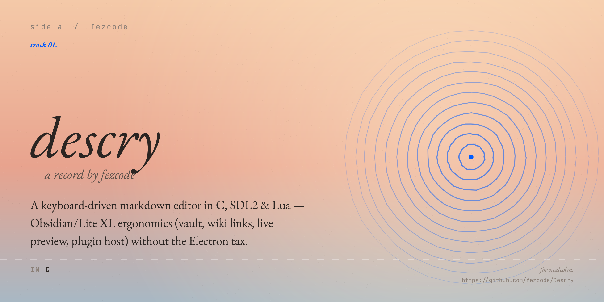

# Descry

A keyboard-driven markdown editor in C, SDL2, and Lua. Aims at the
Obsidian / Lite XL ergonomics — vault sidebar, wiki links, full
preview rendering, plugin host — without the Electron tax.


---

## What works

- **Live preview** of CommonMark via [md4c](https://github.com/mity/md4c)
  — headings, lists, task lists, code fences, block quotes, tables,
  inline styles, links, soft and hard breaks.
- **Edit mode** with a real text buffer (undo/redo, multi-byte caret,
  selection, smart Enter for lists, auto-pairs, find/replace). Soft
  word wrap on by default; toggle off (Alt+Z) for a horizontal
  scrollbar with arrow buttons.
- **Tabs** — several files open at once, lossless switching (each tab
  keeps its text, cursor, scroll, and undo), reopened on next launch.
  A toggleable **split live-preview** (Ctrl+\\) renders the active file
  source-left / preview-right.
- **Vault sidebar** with collapsible folders, drag-and-drop reorder,
  right-click context menu, recents tracking, and **image files** that
  open straight into the preview pane.
- **Wiki links** `[[note name]]` resolve case-insensitively across the
  vault; backlinks panel shows every note that points at the current
  one. Typing `[[` opens an auto-complete list of every note, each row
  showing its path relative to the vault root so two notes called
  "index" stay distinguishable.
- **Tags** `#tag` are the vault's other relation: where `[[…]]` points
  at one file, `#…` names a subject any number of notes can share.
  Highlighted in both edit and preview, clickable in preview to search
  the vault for them, and offered by an auto-complete list (with the
  same path column) when you type `#` mid-line. The tag panel
  (Ctrl+Shift+G) ranks every tag in the vault by use.
- **Outline panel** auto-generated from headings, pinned or modal.
- **Find / Replace** with regex, case-insensitive, whole-word, live
  match count, caret-aware editing, click-to-position. Searches the
  raw source in edit mode and the rendered text in preview so the
  highlights line up in either view.
- **Vault-wide search** across every note with a results overlay.
- **Quick switcher** (Ctrl+P) — recents-first, fuzzy match.
- **Command palette** (Ctrl+Shift+P) — every action plus every
  Lua-registered plugin action with a category chip and bound
  shortcut.
- **Plugin host** — drop `*.lua` in `data/plugins/`, register actions
  with `descry.register_action("name", fn)`, and do real work: read and
  edit the open document (`descry.buffer.*`), list/refresh/open vault
  notes (`descry.vault.*`, `descry.open`), run other actions
  (`descry.invoke`), and subscribe to `open` / `save` / `text_change` /
  `mode_change` / `vault_change` events (`descry.on`). Surface output
  with `descry.notify` / `descry.dialog`, ask with `descry.confirm` /
  `descry.prompt`. Declare typed settings with `descry.config(key,
  default, {type=…})` and they get a real editor: the Plugins overlay
  lists every loaded file, its actions, an on/off switch, a per-plugin
  **settings** modal (toggles, choices, validated numbers) and a
  hot-reload button.
- **LaTeX math** — inline `$…$` and display `$$…$$` spans render
  typographically: Greek letters, operators, `\frac{a}{b}`, roots, and
  simple super/subscripts become real Unicode glyphs (`$\sum_{i=1}^{n}
  x_i^2$` → `∑ᵢ₌₁ⁿ xᵢ²`). A typographic pass, not a full TeX engine.
- **Graph view** (Ctrl+Shift+M) — a force-directed map of the vault's
  relation graph: one node per note, one per `#tag`, an edge per wiki
  link and per tag mention. Node size scales with degree, the current
  note is highlighted; drag to pan, scroll to zoom, click a note to
  open it or a tag to search for it.
- **Navigation history** — every note you open and every deliberate
  jump (outline heading, Go to line, a followed link) is recorded, so
  Ctrl+[ walks back to where you were, caret and scroll included, and
  Ctrl+] returns. The Go menu gathers the rest: Go to File, Line,
  Heading and Tag, plus "Last edit" to hop back to where you were last
  typing.
- **Spell check** — opt-in (`spellcheck = true` in `settings.lua`),
  dictionary-driven red squiggles under unknown words in the editor.
  Points at a system word list or your own `dictionary_path`; "Add to
  dictionary" remembers words in `data/.dictionary_user`.
- **In-app modals** for Save / Save As / Rename / New File — no
  native Win32 dialogs, full keyboard nav, sidebar-style file
  browser.
- **Custom title bar** with File / Edit / View / Help menus, aero
  snap, drag-to-move, min/maximize/close, working under
  `SDL_WINDOW_BORDERLESS` via a WS_THICKFRAME + WM_NCCALCSIZE
  trick.
- **Hisashi menubar** (Windows) — opt-in in Settings; File/Edit/View/Help
  move into [Hisashi](https://github.com/fezcode/hisashi)'s macOS-style
  menubar and the in-app strip hides while connected.
- **Live resize indicator** — a centered `W x H` badge plus a window
  outline render while the user drags an edge. The resize loop pumps
  through an SDL event watch so the indicator animates during the
  drag, not after.
- **Plugin actions, Ctrl+click external links, image preview,
  About dialog, settings persistence, theme picker, keybinding
  editor, daily-notes, HTML export, ASCII-art table aligner** ...

---

## Screenshots

### Image embeds in preview


### Wiki links and quote blocks


### Tags, lists, mid-line styling


---

## Stack

| Layer            | Library                                          |
|------------------|--------------------------------------------------|
| Language         | C11                                              |
| Window / input   | SDL2                                             |
| Glyph cache      | FreeType + HarfBuzz                              |
| Markdown parser  | [md4c](https://github.com/mity/md4c) (vendored)  |
| Scripting        | Lua 5.4 (vendored)                               |
| SVG icons / pills| [nanosvg](https://github.com/memononen/nanosvg) (vendored) |
| Image decode     | libpng, libjpeg                                  |
| Anti-aliasing    | custom analytic signed-distance-field pill rasterizer |
| Build            | CMake + Ninja                                    |

No GTK, no Qt, no web view, no JS runtime. The compiled binary is a
single `descry.exe` plus its DLL dependencies (SDL2, FreeType,
HarfBuzz, libpng, libjpeg).

---

## Building

### Windows (MSYS2 MinGW-w64)

```sh
pacman -S mingw-w64-x86_64-{gcc,cmake,ninja,SDL2,freetype,harfbuzz,libpng,libjpeg-turbo}
cmake -G Ninja -B build
ninja -C build
./build/descry.exe
```

### macOS (Homebrew)

Apple Silicon and Intel both work; the app renders crisp on Retina and
falls back to system fonts (Menlo) automatically.

```sh
brew install cmake ninja pkg-config sdl2 freetype harfbuzz libpng jpeg
# Apple Silicon Homebrew lives under /opt/homebrew; on Intel use /usr/local.
# libjpeg is keg-only, so point pkg-config at it explicitly:
export PKG_CONFIG_PATH="/opt/homebrew/opt/jpeg/lib/pkgconfig:/opt/homebrew/lib/pkgconfig"
cmake -G Ninja -B build
ninja -C build
./build/descry
```

**Package as a double-clickable app.** To get a self-contained `Descry.app`
(SDL/FreeType/HarfBuzz dylibs bundled inside, HiDPI-aware, ad-hoc signed so it
launches locally) instead of running the binary from a terminal:

```sh
brew install dylibbundler      # bundles the dylibs into the app
./package_macos.sh             # -> build/Descry.app
./package_macos.sh --dmg       # also -> dist/Descry-<version>.dmg (drag to /Applications)
```

For distribution to other Macs, sign with a Developer ID
(`--sign "Developer ID Application: …"`) and notarize.

### Linux

```sh
apt install build-essential cmake ninja-build libsdl2-dev libfreetype-dev libharfbuzz-dev libpng-dev libjpeg-dev
cmake -G Ninja -B build
ninja -C build
./build/descry
```

On Windows the build pulls every transitive MinGW DLL next to the exe
via `file(GET_RUNTIME_DEPENDENCIES)` so the build dir is portable —
zip it and run anywhere without an MSYS2 install. The `data/` folder
is *not* copied; the exe loads `data/` from its own directory at
runtime, so put your vault wherever you like and point Descry at it.

The repo ships thin wrappers around the commands above: `build.ps1`
for Windows (MSYS2 MinGW-w64) and `build.sh` for macOS/Linux. Both
configure + build into `build/`; pass `-Run` / `--run` to launch
afterwards.

### macOS notes

- **Retina / HiDPI** renders at native pixel density — glyphs are
  rasterized at the display scale while layout stays in logical points,
  so text is sharp rather than upscaled. Crossing between a Retina and
  a non-Retina display re-rasterizes the fonts automatically.
- **Fonts** default to Menlo and fall back through Apple Symbols,
  PingFang and Apple Color Emoji for symbols / CJK / emoji. A
  `settings.lua` copied from another OS that points at a missing font
  is detected and swapped for the platform default instead of failing
  to start.
- **Cmd is the accelerator.** Every shortcut listed under
  [Keyboard](#keyboard) uses ⌘ here, shown that way in the menus, the
  command palette and the keybindings editor. Cmd+H is the system's
  "hide application" and never reaches an app, so Find & Replace also
  answers to the platform's own ⌥⌘F.
- **Reveal in Finder** uses `open -R`; external links and the log
  folder open via `open`.
- File dialogs use AppleScript (`osascript`); logs and settings live
  under `~/Library/Application Support/fezcode/Descry/`.

---

## Layout

```
src/             - C sources (single-binary)
  main.c         - app loop, UI, every overlay
  buffer.c/h     - the gap-free text buffer + cursor/selection/undo
  markdown.c/h   - md4c wrapper, line/style/wiki/link extraction
  font.c/h       - FreeType+HarfBuzz glyph cache, fallback chain
  icons.c/h      - nanosvg icon raster + SDF pill rasterizer
  lua_host.c/h   - Lua state, plugin loader, action registry, buffer/
                   vault/event bridge for plugins
  vault.c/h      - recursive directory scan + native dialogs
  image.c/h      - PNG/JPG decode -> SDL_Texture cache
  regex.c/h      - in-house regex engine (find/replace)
  mermaid.c/h    - mermaid diagram parse + layout
  graph.c/h      - force-directed wiki-link graph layout
  spell.c/h      - hash-set spell dictionary
  tabs.c/h       - open-file tab list + park/restore
data/            - default vault: sample notes, init.lua, plugins/
vendor/          - lua 5.4, md4c, nanosvg
```

---

## Plugins

A plugin is any `.lua` file under `data/plugins/`. The host exposes a
tiny global table:

```lua
-- data/plugins/hello.lua
descry.register_action("say_hello", function()
    descry.dialog("Hello", "Hello from the plugin system!")
end)

descry.notify("[hello plugin] loaded")
```

After a reload (Ctrl+Alt+P > Reload, or restart), the action shows up
in the command palette with a `Plugin` category chip and can be
invoked by name or bound to a key.

Full reference — every available API call, lifecycle, debugging,
and an honest list of what's *not* exposed yet — lives in
[docs/plugins.md](docs/plugins.md).

---

## Keyboard

A non-exhaustive list. Every binding is editable from `Settings >
Keybindings` and persists to `settings.lua` next to the exe.

**On macOS the accelerator is Cmd, not Ctrl** — read every `Ctrl+…`
below as `⌘…`. The bindings themselves are stored with the portable
`ctrl+` spelling, so a `settings.lua` moves between machines unchanged;
only the physical key differs. Control is left alone for the text
motions the platform reserves it for.

| Action                | Shortcut          |
|-----------------------|-------------------|
| Toggle edit / preview | Ctrl+E            |
| Save                  | Ctrl+S            |
| Save As               | Ctrl+Shift+S      |
| New file              | Ctrl+N            |
| Rename                | F2                |
| Quick switcher        | Ctrl+P            |
| Back / Forward        | Ctrl+[ / Ctrl+]   |
| Go to line            | Ctrl+G            |
| Command palette       | Ctrl+Shift+P      |
| Plugins overlay       | Ctrl+Alt+P        |
| Find                  | Ctrl+F            |
| Find / Replace        | Ctrl+H (Alt+Ctrl+F) |
| Vault search          | Ctrl+Shift+F      |
| Outline               | Ctrl+Shift+O      |
| Backlinks             | Ctrl+Shift+B      |
| Tags                  | Ctrl+Shift+G      |
| Graph view            | Ctrl+Shift+M      |
| Daily note            | Ctrl+D            |
| Toggle sidebar        | Ctrl+B            |
| Toggle word wrap      | Alt+Z             |
| Help & Keybindings    | F1                |
| Settings              | Ctrl+, or F10     |

When word wrap is off, long edit-mode lines extend past the viewport;
Shift+wheel pans, or use the horizontal scrollbar that appears at the
bottom of the editor. In preview, a table wider than the pane gets its
own horizontal scrollbar beneath it — drag the thumb, or hover the
table and use Shift+wheel or a horizontal swipe.

---

## Author

[fezcode](mailto:samil.bulbul@gmail.com)
