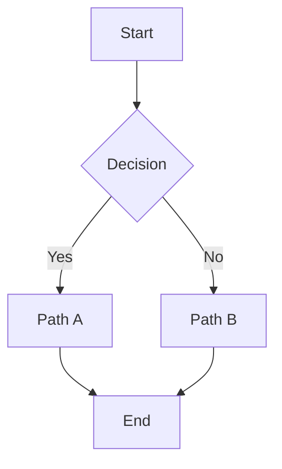
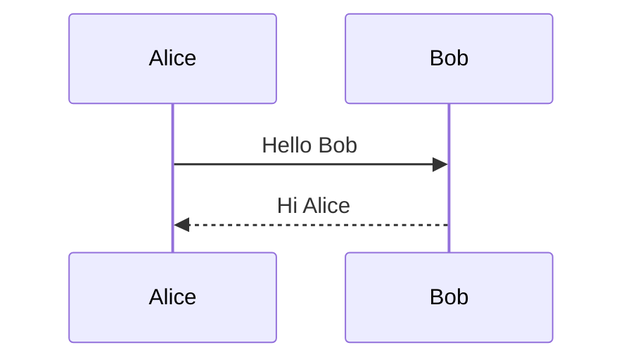

# The Complete Markdown Kitchen Sink

> A reference document exercising every markdown feature supported by CommonMark, GFM, and most extended flavors.

---

## Table of Contents

1. [Headings](#headings)
2. [Paragraphs and Line Breaks](#paragraphs-and-line-breaks)
3. [Emphasis](#emphasis)
4. [Lists](#lists)
5. [Links](#links)
6. [Images](#images)
7. [Code](#code)
8. [Blockquotes](#blockquotes)
9. [Horizontal Rules](#horizontal-rules)
10. [Tables](#tables)
11. [Task Lists](#task-lists)
12. [Footnotes](#footnotes)
13. [Definition Lists](#definition-lists)
14. [HTML](#html)
15. [Math](#math)
16. [Diagrams](#diagrams)
17. [Admonitions](#admonitions)
18. [Strikethrough and Highlight](#strikethrough-and-highlight)
19. [Subscript and Superscript](#subscript-and-superscript)
20. [Emoji](#emoji)
21. [Front Matter](#front-matter)
22. [Wiki Links](#wiki-links)
23. [Tags](#tags)

---

## Headings

# Heading level 1
## Heading level 2
### Heading level 3
#### Heading level 4
##### Heading level 5
###### Heading level 6

Alternate H1
============

Alternate H2
------------

---

## Paragraphs and Line Breaks

This is a regular paragraph. It can span multiple sentences and is just plain text. Markdown collapses single newlines into a single space when rendering.

This is the second paragraph, separated from the first by a blank line.

This line ends with two spaces
so this line appears on a new line in rendered output.

Use a backslash\
at the end of a line for a hard break too.

---

## Emphasis

*Italic with asterisks*, _italic with underscores_.
**Bold with double asterisks**, __bold with double underscores__.
***Bold and italic***, ___bold and italic___, **_mixed_**, *__mixed__*.

You can ~~strike through text~~ in GFM.

==Highlighted text== is supported in some flavors.

---

## Lists

### Unordered

- Apples
- Bananas
  - Cavendish
  - Plantain
    - Green
    - Ripe
- Cherries

* Star bullets work too
+ Plus bullets work too

### Ordered

1. First
2. Second
3. Third
   1. Nested item
   2. Another nested item
      1. Deeply nested
4. Fourth

### Mixed

1. Step one
   - Sub item
   - Another sub item
2. Step two
   1. Numbered sub item
   2. Another numbered sub item

### Loose vs tight

Tight list:
- one
- two
- three

Loose list:

- one

- two

- three

---

## Links

[Inline link](https://example.com)
[Inline link with title](https://example.com "Example title")
<https://autolink.example.com>
<user@example.com>

[Reference link][ref-id]
[Collapsed reference][]
[Shortcut reference]

[ref-id]: https://example.com/reference "Reference title"
[Collapsed reference]: https://example.com/collapsed
[Shortcut reference]: https://example.com/shortcut

[Relative link](./other-file.md)
[Anchor link](#headings)

---

## Images


![Reference image][img-ref]

[img-ref]: https://via.placeholder.com/200

Linked image:
[](https://example.com)

---

## Code

Inline `code` with backticks. Use `` ` `` to embed a backtick.

Indented code block (four spaces):

    function hello() {
        return "world";
    }

Fenced code block (no language):

```
plain text in a fenced block
```

Fenced code block with language:

```python
def fibonacci(n):
    if n < 2:
        return n
    return fibonacci(n - 1) + fibonacci(n - 2)

print([fibonacci(i) for i in range(10)])
```

```javascript
const greet = (name) => `Hello, ${name}!`;
console.log(greet("world"));
```

```c
#include <stdio.h>

int main(void) {
    printf("Hello, world!\n");
    return 0;
}
```

```rust
fn main() {
    let v: Vec<i32> = (0..10).collect();
    println!("{:?}", v);
}
```

```sql
SELECT id, name FROM users WHERE active = true ORDER BY name LIMIT 10;
```

```bash
#!/usr/bin/env bash
for i in {1..5}; do
    echo "iteration $i"
done
```

```json
{
    "name": "Downsee",
    "version": "0.71.0",
    "features": ["markdown", "lua", "plugins"]
}
```

```yaml
name: Downsee
version: 0.71.0
features:
  - markdown
  - lua
  - plugins
```

```diff
- old line removed
+ new line added
  unchanged line
```

---

## Blockquotes

> Single line blockquote.

> Multi-line blockquote
> spanning two lines.

> Nested blockquotes:
>
> > Inner quote
> >
> > > Even deeper

> ### Blockquote with heading
>
> And a paragraph.
>
> - And a list item
> - And another

---

## Horizontal Rules

---

***

___

- - -

* * *

---

## Tables

| Column A | Column B | Column C |
|----------|----------|----------|
| a1       | b1       | c1       |
| a2       | b2       | c2       |
| a3       | b3       | c3       |

Aligned columns:

| Left | Center | Right |
|:-----|:------:|------:|
| L    | C      | R     |
| 1    | 2      | 3     |
| foo  | bar    | baz   |

Inline formatting in tables:

| Feature | Example                       |
|---------|-------------------------------|
| Bold    | **bold text**                 |
| Italic  | *italic text*                 |
| Code    | `inline code`                 |
| Link    | [example](https://example.com)|

---

## Task Lists

- [x] Completed task
- [ ] Pending task
- [x] Another done one
  - [ ] Nested incomplete
  - [x] Nested complete
- [ ] Final pending task

---

## Footnotes

This sentence has a footnote.[^1] And this one has another.[^longnote]

[^1]: Short footnote text.
[^longnote]: A longer footnote with multiple paragraphs.

    The second paragraph of the footnote.

---

## Definition Lists

Term 1
:   Definition 1

Term 2
:   Definition 2a
:   Definition 2b

Markdown
:   A lightweight markup language with plain-text formatting syntax.

CommonMark
:   A strongly defined, highly compatible specification of Markdown.

---

## HTML

<p>Raw HTML <strong>paragraph</strong>.</p>

<details>
<summary>Click to expand</summary>

Hidden content with **markdown** inside.

</details>

<kbd>Ctrl</kbd>+<kbd>S</kbd> to save.

<mark>Highlighted via HTML</mark>.

<sub>subscript</sub> and <sup>superscript</sup>.

<div align="center">Centered text via HTML.</div>

---

## Math

Inline math: $E = mc^2$ and $a^2 + b^2 = c^2$.

Block math:

$$
\int_{-\infty}^{\infty} e^{-x^2} \, dx = \sqrt{\pi}
$$

$$
\begin{aligned}
f(x) &= ax^2 + bx + c \\
f'(x) &= 2ax + b
\end{aligned}
$$

---

## Diagrams





---

## Admonitions

> [!NOTE]
> Useful information that users should know.

> [!TIP]
> Helpful advice for doing things better.

> [!IMPORTANT]
> Key information users need to know.

> [!WARNING]
> Urgent info that needs immediate attention.

> [!CAUTION]
> Negative potential consequences of an action.

---

## Strikethrough and Highlight

This text is ~~struck through~~.
This text is ==highlighted== (extension).

---

## Subscript and Superscript

H~2~O and E = mc^2^ (extension syntax).

---

## Emoji

:smile: :rocket: :sparkles: :tada: :white_check_mark: :x: :warning: :memo:

---

## Front Matter

```
---
title: Example Document
date: 2026-05-16
tags: [markdown, example]
author: Downsee
---
```

---

## Wiki Links

[[Internal Page]]
[[Another Page|Display Text]]
[[Folder/Subpage]]

---

## Tags

#markdown #reference #example #downsee #kitchen-sink

---

## Long Form Content Sample

Lorem ipsum dolor sit amet, consectetur adipiscing elit. Sed do eiusmod tempor incididunt ut labore et dolore magna aliqua. Ut enim ad minim veniam, quis nostrud exercitation ullamco laboris nisi ut aliquip ex ea commodo consequat. Duis aute irure dolor in reprehenderit in voluptate velit esse cillum dolore eu fugiat nulla pariatur. Excepteur sint occaecat cupidatat non proident, sunt in culpa qui officia deserunt mollit anim id est laborum.

Sed ut perspiciatis unde omnis iste natus error sit voluptatem accusantium doloremque laudantium, totam rem aperiam, eaque ipsa quae ab illo inventore veritatis et quasi architecto beatae vitae dicta sunt explicabo. Nemo enim ipsam voluptatem quia voluptas sit aspernatur aut odit aut fugit, sed quia consequuntur magni dolores eos qui ratione voluptatem sequi nesciunt.

At vero eos et accusamus et iusto odio dignissimos ducimus qui blanditiis praesentium voluptatum deleniti atque corrupti quos dolores et quas molestias excepturi sint occaecati cupiditate non provident, similique sunt in culpa qui officia deserunt mollitia animi, id est laborum et dolorum fuga.

---

## Section 1

This is iteration **1** of the kitchen-sink content. Generated for stress-testing the Downsee markdown editor with very large documents.

> Iteration 1 block quote with *emphasis*, **strong**, ~~strikethrough~~, and `inline code`.

# The Complete Markdown Kitchen Sink

> A reference document exercising every markdown feature supported by CommonMark, GFM, and most extended flavors.

---

## Table of Contents

1. [Headings](#headings)
2. [Paragraphs and Line Breaks](#paragraphs-and-line-breaks)
3. [Emphasis](#emphasis)
4. [Lists](#lists)
5. [Links](#links)
6. [Images](#images)
7. [Code](#code)
8. [Blockquotes](#blockquotes)
9. [Horizontal Rules](#horizontal-rules)
10. [Tables](#tables)
11. [Task Lists](#task-lists)
12. [Footnotes](#footnotes)
13. [Definition Lists](#definition-lists)
14. [HTML](#html)
15. [Math](#math)
16. [Diagrams](#diagrams)
17. [Admonitions](#admonitions)
18. [Strikethrough and Highlight](#strikethrough-and-highlight)
19. [Subscript and Superscript](#subscript-and-superscript)
20. [Emoji](#emoji)
21. [Front Matter](#front-matter)
22. [Wiki Links](#wiki-links)
23. [Tags](#tags)

---

## Headings

# Heading level 1
## Heading level 2
### Heading level 3
#### Heading level 4
##### Heading level 5
###### Heading level 6

Alternate H1
============

Alternate H2
------------

---

## Paragraphs and Line Breaks

This is a regular paragraph. It can span multiple sentences and is just plain text. Markdown collapses single newlines into a single space when rendering.

This is the second paragraph, separated from the first by a blank line.

This line ends with two spaces
so this line appears on a new line in rendered output.

Use a backslash\
at the end of a line for a hard break too.

---

## Emphasis

*Italic with asterisks*, _italic with underscores_.
**Bold with double asterisks**, __bold with double underscores__.
***Bold and italic***, ___bold and italic___, **_mixed_**, *__mixed__*.

You can ~~strike through text~~ in GFM.

==Highlighted text== is supported in some flavors.

---

## Lists

### Unordered

- Apples
- Bananas
  - Cavendish
  - Plantain
    - Green
    - Ripe
- Cherries

* Star bullets work too
+ Plus bullets work too

### Ordered

1. First
2. Second
3. Third
   1. Nested item
   2. Another nested item
      1. Deeply nested
4. Fourth

### Mixed

1. Step one
   - Sub item
   - Another sub item
2. Step two
   1. Numbered sub item
   2. Another numbered sub item

### Loose vs tight

Tight list:
- one
- two
- three

Loose list:

- one

- two

- three

---

## Links

[Inline link](https://example.com)
[Inline link with title](https://example.com "Example title")
<https://autolink.example.com>
<user@example.com>

[Reference link][ref-id]
[Collapsed reference][]
[Shortcut reference]

[ref-id]: https://example.com/reference "Reference title"
[Collapsed reference]: https://example.com/collapsed
[Shortcut reference]: https://example.com/shortcut

[Relative link](./other-file.md)
[Anchor link](#headings)

---

## Images


![Reference image][img-ref]

[img-ref]: https://via.placeholder.com/200

Linked image:
[](https://example.com)

---

## Code

Inline `code` with backticks. Use `` ` `` to embed a backtick.

Indented code block (four spaces):

    function hello() {
        return "world";
    }

Fenced code block (no language):

```
plain text in a fenced block
```

Fenced code block with language:

```python
def fibonacci(n):
    if n < 2:
        return n
    return fibonacci(n - 1) + fibonacci(n - 2)

print([fibonacci(i) for i in range(10)])
```

```javascript
const greet = (name) => `Hello, ${name}!`;
console.log(greet("world"));
```

```c
#include <stdio.h>

int main(void) {
    printf("Hello, world!\n");
    return 0;
}
```

```rust
fn main() {
    let v: Vec<i32> = (0..10).collect();
    println!("{:?}", v);
}
```

```sql
SELECT id, name FROM users WHERE active = true ORDER BY name LIMIT 10;
```

```bash
#!/usr/bin/env bash
for i in {1..5}; do
    echo "iteration $i"
done
```

```json
{
    "name": "Downsee",
    "version": "0.71.0",
    "features": ["markdown", "lua", "plugins"]
}
```

```yaml
name: Downsee
version: 0.71.0
features:
  - markdown
  - lua
  - plugins
```

```diff
- old line removed
+ new line added
  unchanged line
```

---

## Blockquotes

> Single line blockquote.

> Multi-line blockquote
> spanning two lines.

> Nested blockquotes:
>
> > Inner quote
> >
> > > Even deeper

> ### Blockquote with heading
>
> And a paragraph.
>
> - And a list item
> - And another

---

## Horizontal Rules

---

***

___

- - -

* * *

---

## Tables

| Column A | Column B | Column C |
|----------|----------|----------|
| a1       | b1       | c1       |
| a2       | b2       | c2       |
| a3       | b3       | c3       |

Aligned columns:

| Left | Center | Right |
|:-----|:------:|------:|
| L    | C      | R     |
| 1    | 2      | 3     |
| foo  | bar    | baz   |

Inline formatting in tables:

| Feature | Example                       |
|---------|-------------------------------|
| Bold    | **bold text**                 |
| Italic  | *italic text*                 |
| Code    | `inline code`                 |
| Link    | [example](https://example.com)|

---

## Task Lists

- [x] Completed task
- [ ] Pending task
- [x] Another done one
  - [ ] Nested incomplete
  - [x] Nested complete
- [ ] Final pending task

---

## Footnotes

This sentence has a footnote.[^1] And this one has another.[^longnote]

[^1]: Short footnote text.
[^longnote]: A longer footnote with multiple paragraphs.

    The second paragraph of the footnote.

---

## Definition Lists

Term 1
:   Definition 1

Term 2
:   Definition 2a
:   Definition 2b

Markdown
:   A lightweight markup language with plain-text formatting syntax.

CommonMark
:   A strongly defined, highly compatible specification of Markdown.

---

## HTML

<p>Raw HTML <strong>paragraph</strong>.</p>

<details>
<summary>Click to expand</summary>

Hidden content with **markdown** inside.

</details>

<kbd>Ctrl</kbd>+<kbd>S</kbd> to save.

<mark>Highlighted via HTML</mark>.

<sub>subscript</sub> and <sup>superscript</sup>.

<div align="center">Centered text via HTML.</div>

---

## Math

Inline math: $E = mc^2$ and $a^2 + b^2 = c^2$.

Block math:

$$
\int_{-\infty}^{\infty} e^{-x^2} \, dx = \sqrt{\pi}
$$

$$
\begin{aligned}
f(x) &= ax^2 + bx + c \\
f'(x) &= 2ax + b
\end{aligned}
$$

---

## Diagrams


---

## Admonitions

> [!NOTE]
> Useful information that users should know.

> [!TIP]
> Helpful advice for doing things better.

> [!IMPORTANT]
> Key information users need to know.

> [!WARNING]
> Urgent info that needs immediate attention.

> [!CAUTION]
> Negative potential consequences of an action.

---

## Strikethrough and Highlight

This text is ~~struck through~~.
This text is ==highlighted== (extension).

---

## Subscript and Superscript

H~2~O and E = mc^2^ (extension syntax).

---

## Emoji

:smile: :rocket: :sparkles: :tada: :white_check_mark: :x: :warning: :memo:

---

## Front Matter

```
---
title: Example Document
date: 2026-05-16
tags: [markdown, example]
author: Downsee
---
```

---

## Wiki Links

[[Internal Page]]
[[Another Page|Display Text]]
[[Folder/Subpage]]

---

## Tags

#markdown #reference #example #downsee #kitchen-sink

---

## Long Form Content Sample

Lorem ipsum dolor sit amet, consectetur adipiscing elit. Sed do eiusmod tempor incididunt ut labore et dolore magna aliqua. Ut enim ad minim veniam, quis nostrud exercitation ullamco laboris nisi ut aliquip ex ea commodo consequat. Duis aute irure dolor in reprehenderit in voluptate velit esse cillum dolore eu fugiat nulla pariatur. Excepteur sint occaecat cupidatat non proident, sunt in culpa qui officia deserunt mollit anim id est laborum.

Sed ut perspiciatis unde omnis iste natus error sit voluptatem accusantium doloremque laudantium, totam rem aperiam, eaque ipsa quae ab illo inventore veritatis et quasi architecto beatae vitae dicta sunt explicabo. Nemo enim ipsam voluptatem quia voluptas sit aspernatur aut odit aut fugit, sed quia consequuntur magni dolores eos qui ratione voluptatem sequi nesciunt.

At vero eos et accusamus et iusto odio dignissimos ducimus qui blanditiis praesentium voluptatum deleniti atque corrupti quos dolores et quas molestias excepturi sint occaecati cupiditate non provident, similique sunt in culpa qui officia deserunt mollitia animi, id est laborum et dolorum fuga.

---

### Unique lines for iteration 1

- Item 0 in section 1 - lorem ipsum dolor sit amet, consectetur adipiscing elit, sed do eiusmod tempor incididunt ut labore et dolore magna aliqua.
- Item 1 in section 1 - lorem ipsum dolor sit amet, consectetur adipiscing elit, sed do eiusmod tempor incididunt ut labore et dolore magna aliqua.
- Item 2 in section 1 - lorem ipsum dolor sit amet, consectetur adipiscing elit, sed do eiusmod tempor incididunt ut labore et dolore magna aliqua.
- Item 3 in section 1 - lorem ipsum dolor sit amet, consectetur adipiscing elit, sed do eiusmod tempor incididunt ut labore et dolore magna aliqua.
- Item 4 in section 1 - lorem ipsum dolor sit amet, consectetur adipiscing elit, sed do eiusmod tempor incididunt ut labore et dolore magna aliqua.
- Item 5 in section 1 - lorem ipsum dolor sit amet, consectetur adipiscing elit, sed do eiusmod tempor incididunt ut labore et dolore magna aliqua.
- Item 6 in section 1 - lorem ipsum dolor sit amet, consectetur adipiscing elit, sed do eiusmod tempor incididunt ut labore et dolore magna aliqua.
- Item 7 in section 1 - lorem ipsum dolor sit amet, consectetur adipiscing elit, sed do eiusmod tempor incididunt ut labore et dolore magna aliqua.
- Item 8 in section 1 - lorem ipsum dolor sit amet, consectetur adipiscing elit, sed do eiusmod tempor incididunt ut labore et dolore magna aliqua.
- Item 9 in section 1 - lorem ipsum dolor sit amet, consectetur adipiscing elit, sed do eiusmod tempor incididunt ut labore et dolore magna aliqua.


## Section 2

This is iteration **2** of the kitchen-sink content. Generated for stress-testing the Downsee markdown editor with very large documents.

> Iteration 2 block quote with *emphasis*, **strong**, ~~strikethrough~~, and `inline code`.

# The Complete Markdown Kitchen Sink

> A reference document exercising every markdown feature supported by CommonMark, GFM, and most extended flavors.

---

## Table of Contents

1. [Headings](#headings)
2. [Paragraphs and Line Breaks](#paragraphs-and-line-breaks)
3. [Emphasis](#emphasis)
4. [Lists](#lists)
5. [Links](#links)
6. [Images](#images)
7. [Code](#code)
8. [Blockquotes](#blockquotes)
9. [Horizontal Rules](#horizontal-rules)
10. [Tables](#tables)
11. [Task Lists](#task-lists)
12. [Footnotes](#footnotes)
13. [Definition Lists](#definition-lists)
14. [HTML](#html)
15. [Math](#math)
16. [Diagrams](#diagrams)
17. [Admonitions](#admonitions)
18. [Strikethrough and Highlight](#strikethrough-and-highlight)
19. [Subscript and Superscript](#subscript-and-superscript)
20. [Emoji](#emoji)
21. [Front Matter](#front-matter)
22. [Wiki Links](#wiki-links)
23. [Tags](#tags)

---

## Headings

# Heading level 1
## Heading level 2
### Heading level 3
#### Heading level 4
##### Heading level 5
###### Heading level 6

Alternate H1
============

Alternate H2
------------

---

## Paragraphs and Line Breaks

This is a regular paragraph. It can span multiple sentences and is just plain text. Markdown collapses single newlines into a single space when rendering.

This is the second paragraph, separated from the first by a blank line.

This line ends with two spaces
so this line appears on a new line in rendered output.

Use a backslash\
at the end of a line for a hard break too.

---

## Emphasis

*Italic with asterisks*, _italic with underscores_.
**Bold with double asterisks**, __bold with double underscores__.
***Bold and italic***, ___bold and italic___, **_mixed_**, *__mixed__*.

You can ~~strike through text~~ in GFM.

==Highlighted text== is supported in some flavors.

---

## Lists

### Unordered

- Apples
- Bananas
  - Cavendish
  - Plantain
    - Green
    - Ripe
- Cherries

* Star bullets work too
+ Plus bullets work too

### Ordered

1. First
2. Second
3. Third
   1. Nested item
   2. Another nested item
      1. Deeply nested
4. Fourth

### Mixed

1. Step one
   - Sub item
   - Another sub item
2. Step two
   1. Numbered sub item
   2. Another numbered sub item

### Loose vs tight

Tight list:
- one
- two
- three

Loose list:

- one

- two

- three

---

## Links

[Inline link](https://example.com)
[Inline link with title](https://example.com "Example title")
<https://autolink.example.com>
<user@example.com>

[Reference link][ref-id]
[Collapsed reference][]
[Shortcut reference]

[ref-id]: https://example.com/reference "Reference title"
[Collapsed reference]: https://example.com/collapsed
[Shortcut reference]: https://example.com/shortcut

[Relative link](./other-file.md)
[Anchor link](#headings)

---

## Images


![Reference image][img-ref]

[img-ref]: https://via.placeholder.com/200

Linked image:
[](https://example.com)

---

## Code

Inline `code` with backticks. Use `` ` `` to embed a backtick.

Indented code block (four spaces):

    function hello() {
        return "world";
    }

Fenced code block (no language):

```
plain text in a fenced block
```

Fenced code block with language:

```python
def fibonacci(n):
    if n < 2:
        return n
    return fibonacci(n - 1) + fibonacci(n - 2)

print([fibonacci(i) for i in range(10)])
```

```javascript
const greet = (name) => `Hello, ${name}!`;
console.log(greet("world"));
```

```c
#include <stdio.h>

int main(void) {
    printf("Hello, world!\n");
    return 0;
}
```

```rust
fn main() {
    let v: Vec<i32> = (0..10).collect();
    println!("{:?}", v);
}
```

```sql
SELECT id, name FROM users WHERE active = true ORDER BY name LIMIT 10;
```

```bash
#!/usr/bin/env bash
for i in {1..5}; do
    echo "iteration $i"
done
```

```json
{
    "name": "Downsee",
    "version": "0.71.0",
    "features": ["markdown", "lua", "plugins"]
}
```

```yaml
name: Downsee
version: 0.71.0
features:
  - markdown
  - lua
  - plugins
```

```diff
- old line removed
+ new line added
  unchanged line
```

---

## Blockquotes

> Single line blockquote.

> Multi-line blockquote
> spanning two lines.

> Nested blockquotes:
>
> > Inner quote
> >
> > > Even deeper

> ### Blockquote with heading
>
> And a paragraph.
>
> - And a list item
> - And another

---

## Horizontal Rules

---

***

___

- - -

* * *

---

## Tables

| Column A | Column B | Column C |
|----------|----------|----------|
| a1       | b1       | c1       |
| a2       | b2       | c2       |
| a3       | b3       | c3       |

Aligned columns:

| Left | Center | Right |
|:-----|:------:|------:|
| L    | C      | R     |
| 1    | 2      | 3     |
| foo  | bar    | baz   |

Inline formatting in tables:

| Feature | Example                       |
|---------|-------------------------------|
| Bold    | **bold text**                 |
| Italic  | *italic text*                 |
| Code    | `inline code`                 |
| Link    | [example](https://example.com)|

---

## Task Lists

- [x] Completed task
- [ ] Pending task
- [x] Another done one
  - [ ] Nested incomplete
  - [x] Nested complete
- [ ] Final pending task

---

## Footnotes

This sentence has a footnote.[^1] And this one has another.[^longnote]

[^1]: Short footnote text.
[^longnote]: A longer footnote with multiple paragraphs.

    The second paragraph of the footnote.

---

## Definition Lists

Term 1
:   Definition 1

Term 2
:   Definition 2a
:   Definition 2b

Markdown
:   A lightweight markup language with plain-text formatting syntax.

CommonMark
:   A strongly defined, highly compatible specification of Markdown.

---

## HTML

<p>Raw HTML <strong>paragraph</strong>.</p>

<details>
<summary>Click to expand</summary>

Hidden content with **markdown** inside.

</details>

<kbd>Ctrl</kbd>+<kbd>S</kbd> to save.

<mark>Highlighted via HTML</mark>.

<sub>subscript</sub> and <sup>superscript</sup>.

<div align="center">Centered text via HTML.</div>

---

## Math

Inline math: $E = mc^2$ and $a^2 + b^2 = c^2$.

Block math:

$$
\int_{-\infty}^{\infty} e^{-x^2} \, dx = \sqrt{\pi}
$$

$$
\begin{aligned}
f(x) &= ax^2 + bx + c \\
f'(x) &= 2ax + b
\end{aligned}
$$

---

## Diagrams


---

## Admonitions

> [!NOTE]
> Useful information that users should know.

> [!TIP]
> Helpful advice for doing things better.

> [!IMPORTANT]
> Key information users need to know.

> [!WARNING]
> Urgent info that needs immediate attention.

> [!CAUTION]
> Negative potential consequences of an action.

---

## Strikethrough and Highlight

This text is ~~struck through~~.
This text is ==highlighted== (extension).

---

## Subscript and Superscript

H~2~O and E = mc^2^ (extension syntax).

---

## Emoji

:smile: :rocket: :sparkles: :tada: :white_check_mark: :x: :warning: :memo:

---

## Front Matter

```
---
title: Example Document
date: 2026-05-16
tags: [markdown, example]
author: Downsee
---
```

---

## Wiki Links

[[Internal Page]]
[[Another Page|Display Text]]
[[Folder/Subpage]]

---

## Tags

#markdown #reference #example #downsee #kitchen-sink

---

## Long Form Content Sample

Lorem ipsum dolor sit amet, consectetur adipiscing elit. Sed do eiusmod tempor incididunt ut labore et dolore magna aliqua. Ut enim ad minim veniam, quis nostrud exercitation ullamco laboris nisi ut aliquip ex ea commodo consequat. Duis aute irure dolor in reprehenderit in voluptate velit esse cillum dolore eu fugiat nulla pariatur. Excepteur sint occaecat cupidatat non proident, sunt in culpa qui officia deserunt mollit anim id est laborum.

Sed ut perspiciatis unde omnis iste natus error sit voluptatem accusantium doloremque laudantium, totam rem aperiam, eaque ipsa quae ab illo inventore veritatis et quasi architecto beatae vitae dicta sunt explicabo. Nemo enim ipsam voluptatem quia voluptas sit aspernatur aut odit aut fugit, sed quia consequuntur magni dolores eos qui ratione voluptatem sequi nesciunt.

At vero eos et accusamus et iusto odio dignissimos ducimus qui blanditiis praesentium voluptatum deleniti atque corrupti quos dolores et quas molestias excepturi sint occaecati cupiditate non provident, similique sunt in culpa qui officia deserunt mollitia animi, id est laborum et dolorum fuga.

---

### Unique lines for iteration 2

- Item 0 in section 2 - lorem ipsum dolor sit amet, consectetur adipiscing elit, sed do eiusmod tempor incididunt ut labore et dolore magna aliqua.
- Item 1 in section 2 - lorem ipsum dolor sit amet, consectetur adipiscing elit, sed do eiusmod tempor incididunt ut labore et dolore magna aliqua.
- Item 2 in section 2 - lorem ipsum dolor sit amet, consectetur adipiscing elit, sed do eiusmod tempor incididunt ut labore et dolore magna aliqua.
- Item 3 in section 2 - lorem ipsum dolor sit amet, consectetur adipiscing elit, sed do eiusmod tempor incididunt ut labore et dolore magna aliqua.
- Item 4 in section 2 - lorem ipsum dolor sit amet, consectetur adipiscing elit, sed do eiusmod tempor incididunt ut labore et dolore magna aliqua.
- Item 5 in section 2 - lorem ipsum dolor sit amet, consectetur adipiscing elit, sed do eiusmod tempor incididunt ut labore et dolore magna aliqua.
- Item 6 in section 2 - lorem ipsum dolor sit amet, consectetur adipiscing elit, sed do eiusmod tempor incididunt ut labore et dolore magna aliqua.
- Item 7 in section 2 - lorem ipsum dolor sit amet, consectetur adipiscing elit, sed do eiusmod tempor incididunt ut labore et dolore magna aliqua.
- Item 8 in section 2 - lorem ipsum dolor sit amet, consectetur adipiscing elit, sed do eiusmod tempor incididunt ut labore et dolore magna aliqua.
- Item 9 in section 2 - lorem ipsum dolor sit amet, consectetur adipiscing elit, sed do eiusmod tempor incididunt ut labore et dolore magna aliqua.


## Section 3

This is iteration **3** of the kitchen-sink content. Generated for stress-testing the Downsee markdown editor with very large documents.

> Iteration 3 block quote with *emphasis*, **strong**, ~~strikethrough~~, and `inline code`.

# The Complete Markdown Kitchen Sink

> A reference document exercising every markdown feature supported by CommonMark, GFM, and most extended flavors.

---

## Table of Contents

1. [Headings](#headings)
2. [Paragraphs and Line Breaks](#paragraphs-and-line-breaks)
3. [Emphasis](#emphasis)
4. [Lists](#lists)
5. [Links](#links)
6. [Images](#images)
7. [Code](#code)
8. [Blockquotes](#blockquotes)
9. [Horizontal Rules](#horizontal-rules)
10. [Tables](#tables)
11. [Task Lists](#task-lists)
12. [Footnotes](#footnotes)
13. [Definition Lists](#definition-lists)
14. [HTML](#html)
15. [Math](#math)
16. [Diagrams](#diagrams)
17. [Admonitions](#admonitions)
18. [Strikethrough and Highlight](#strikethrough-and-highlight)
19. [Subscript and Superscript](#subscript-and-superscript)
20. [Emoji](#emoji)
21. [Front Matter](#front-matter)
22. [Wiki Links](#wiki-links)
23. [Tags](#tags)

---

## Headings

# Heading level 1
## Heading level 2
### Heading level 3
#### Heading level 4
##### Heading level 5
###### Heading level 6

Alternate H1
============

Alternate H2
------------

---

## Paragraphs and Line Breaks

This is a regular paragraph. It can span multiple sentences and is just plain text. Markdown collapses single newlines into a single space when rendering.

This is the second paragraph, separated from the first by a blank line.

This line ends with two spaces
so this line appears on a new line in rendered output.

Use a backslash\
at the end of a line for a hard break too.

---

## Emphasis

*Italic with asterisks*, _italic with underscores_.
**Bold with double asterisks**, __bold with double underscores__.
***Bold and italic***, ___bold and italic___, **_mixed_**, *__mixed__*.

You can ~~strike through text~~ in GFM.

==Highlighted text== is supported in some flavors.

---

## Lists

### Unordered

- Apples
- Bananas
  - Cavendish
  - Plantain
    - Green
    - Ripe
- Cherries

* Star bullets work too
+ Plus bullets work too

### Ordered

1. First
2. Second
3. Third
   1. Nested item
   2. Another nested item
      1. Deeply nested
4. Fourth

### Mixed

1. Step one
   - Sub item
   - Another sub item
2. Step two
   1. Numbered sub item
   2. Another numbered sub item

### Loose vs tight

Tight list:
- one
- two
- three

Loose list:

- one

- two

- three

---

## Links

[Inline link](https://example.com)
[Inline link with title](https://example.com "Example title")
<https://autolink.example.com>
<user@example.com>

[Reference link][ref-id]
[Collapsed reference][]
[Shortcut reference]

[ref-id]: https://example.com/reference "Reference title"
[Collapsed reference]: https://example.com/collapsed
[Shortcut reference]: https://example.com/shortcut

[Relative link](./other-file.md)
[Anchor link](#headings)

---

## Images


![Reference image][img-ref]

[img-ref]: https://via.placeholder.com/200

Linked image:
[](https://example.com)

---

## Code

Inline `code` with backticks. Use `` ` `` to embed a backtick.

Indented code block (four spaces):

    function hello() {
        return "world";
    }

Fenced code block (no language):

```
plain text in a fenced block
```

Fenced code block with language:

```python
def fibonacci(n):
    if n < 2:
        return n
    return fibonacci(n - 1) + fibonacci(n - 2)

print([fibonacci(i) for i in range(10)])
```

```javascript
const greet = (name) => `Hello, ${name}!`;
console.log(greet("world"));
```

```c
#include <stdio.h>

int main(void) {
    printf("Hello, world!\n");
    return 0;
}
```

```rust
fn main() {
    let v: Vec<i32> = (0..10).collect();
    println!("{:?}", v);
}
```

```sql
SELECT id, name FROM users WHERE active = true ORDER BY name LIMIT 10;
```

```bash
#!/usr/bin/env bash
for i in {1..5}; do
    echo "iteration $i"
done
```

```json
{
    "name": "Downsee",
    "version": "0.71.0",
    "features": ["markdown", "lua", "plugins"]
}
```

```yaml
name: Downsee
version: 0.71.0
features:
  - markdown
  - lua
  - plugins
```

```diff
- old line removed
+ new line added
  unchanged line
```

---

## Blockquotes

> Single line blockquote.

> Multi-line blockquote
> spanning two lines.

> Nested blockquotes:
>
> > Inner quote
> >
> > > Even deeper

> ### Blockquote with heading
>
> And a paragraph.
>
> - And a list item
> - And another

---

## Horizontal Rules

---

***

___

- - -

* * *

---

## Tables

| Column A | Column B | Column C |
|----------|----------|----------|
| a1       | b1       | c1       |
| a2       | b2       | c2       |
| a3       | b3       | c3       |

Aligned columns:

| Left | Center | Right |
|:-----|:------:|------:|
| L    | C      | R     |
| 1    | 2      | 3     |
| foo  | bar    | baz   |

Inline formatting in tables:

| Feature | Example                       |
|---------|-------------------------------|
| Bold    | **bold text**                 |
| Italic  | *italic text*                 |
| Code    | `inline code`                 |
| Link    | [example](https://example.com)|

---

## Task Lists

- [x] Completed task
- [ ] Pending task
- [x] Another done one
  - [ ] Nested incomplete
  - [x] Nested complete
- [ ] Final pending task

---

## Footnotes

This sentence has a footnote.[^1] And this one has another.[^longnote]

[^1]: Short footnote text.
[^longnote]: A longer footnote with multiple paragraphs.

    The second paragraph of the footnote.

---

## Definition Lists

Term 1
:   Definition 1

Term 2
:   Definition 2a
:   Definition 2b

Markdown
:   A lightweight markup language with plain-text formatting syntax.

CommonMark
:   A strongly defined, highly compatible specification of Markdown.

---

## HTML

<p>Raw HTML <strong>paragraph</strong>.</p>

<details>
<summary>Click to expand</summary>

Hidden content with **markdown** inside.

</details>

<kbd>Ctrl</kbd>+<kbd>S</kbd> to save.

<mark>Highlighted via HTML</mark>.

<sub>subscript</sub> and <sup>superscript</sup>.

<div align="center">Centered text via HTML.</div>

---

## Math

Inline math: $E = mc^2$ and $a^2 + b^2 = c^2$.

Block math:

$$
\int_{-\infty}^{\infty} e^{-x^2} \, dx = \sqrt{\pi}
$$

$$
\begin{aligned}
f(x) &= ax^2 + bx + c \\
f'(x) &= 2ax + b
\end{aligned}
$$

---

## Diagrams


---

## Admonitions

> [!NOTE]
> Useful information that users should know.

> [!TIP]
> Helpful advice for doing things better.

> [!IMPORTANT]
> Key information users need to know.

> [!WARNING]
> Urgent info that needs immediate attention.

> [!CAUTION]
> Negative potential consequences of an action.

---

## Strikethrough and Highlight

This text is ~~struck through~~.
This text is ==highlighted== (extension).

---

## Subscript and Superscript

H~2~O and E = mc^2^ (extension syntax).

---

## Emoji

:smile: :rocket: :sparkles: :tada: :white_check_mark: :x: :warning: :memo:

---

## Front Matter

```
---
title: Example Document
date: 2026-05-16
tags: [markdown, example]
author: Downsee
---
```

---

## Wiki Links

[[Internal Page]]
[[Another Page|Display Text]]
[[Folder/Subpage]]

---

## Tags

#markdown #reference #example #downsee #kitchen-sink

---

## Long Form Content Sample

Lorem ipsum dolor sit amet, consectetur adipiscing elit. Sed do eiusmod tempor incididunt ut labore et dolore magna aliqua. Ut enim ad minim veniam, quis nostrud exercitation ullamco laboris nisi ut aliquip ex ea commodo consequat. Duis aute irure dolor in reprehenderit in voluptate velit esse cillum dolore eu fugiat nulla pariatur. Excepteur sint occaecat cupidatat non proident, sunt in culpa qui officia deserunt mollit anim id est laborum.

Sed ut perspiciatis unde omnis iste natus error sit voluptatem accusantium doloremque laudantium, totam rem aperiam, eaque ipsa quae ab illo inventore veritatis et quasi architecto beatae vitae dicta sunt explicabo. Nemo enim ipsam voluptatem quia voluptas sit aspernatur aut odit aut fugit, sed quia consequuntur magni dolores eos qui ratione voluptatem sequi nesciunt.

At vero eos et accusamus et iusto odio dignissimos ducimus qui blanditiis praesentium voluptatum deleniti atque corrupti quos dolores et quas molestias excepturi sint occaecati cupiditate non provident, similique sunt in culpa qui officia deserunt mollitia animi, id est laborum et dolorum fuga.

---

### Unique lines for iteration 3

- Item 0 in section 3 - lorem ipsum dolor sit amet, consectetur adipiscing elit, sed do eiusmod tempor incididunt ut labore et dolore magna aliqua.
- Item 1 in section 3 - lorem ipsum dolor sit amet, consectetur adipiscing elit, sed do eiusmod tempor incididunt ut labore et dolore magna aliqua.
- Item 2 in section 3 - lorem ipsum dolor sit amet, consectetur adipiscing elit, sed do eiusmod tempor incididunt ut labore et dolore magna aliqua.
- Item 3 in section 3 - lorem ipsum dolor sit amet, consectetur adipiscing elit, sed do eiusmod tempor incididunt ut labore et dolore magna aliqua.
- Item 4 in section 3 - lorem ipsum dolor sit amet, consectetur adipiscing elit, sed do eiusmod tempor incididunt ut labore et dolore magna aliqua.
- Item 5 in section 3 - lorem ipsum dolor sit amet, consectetur adipiscing elit, sed do eiusmod tempor incididunt ut labore et dolore magna aliqua.
- Item 6 in section 3 - lorem ipsum dolor sit amet, consectetur adipiscing elit, sed do eiusmod tempor incididunt ut labore et dolore magna aliqua.
- Item 7 in section 3 - lorem ipsum dolor sit amet, consectetur adipiscing elit, sed do eiusmod tempor incididunt ut labore et dolore magna aliqua.
- Item 8 in section 3 - lorem ipsum dolor sit amet, consectetur adipiscing elit, sed do eiusmod tempor incididunt ut labore et dolore magna aliqua.
- Item 9 in section 3 - lorem ipsum dolor sit amet, consectetur adipiscing elit, sed do eiusmod tempor incididunt ut labore et dolore magna aliqua.


## Section 4

This is iteration **4** of the kitchen-sink content. Generated for stress-testing the Downsee markdown editor with very large documents.

> Iteration 4 block quote with *emphasis*, **strong**, ~~strikethrough~~, and `inline code`.

# The Complete Markdown Kitchen Sink

> A reference document exercising every markdown feature supported by CommonMark, GFM, and most extended flavors.

---

## Table of Contents

1. [Headings](#headings)
2. [Paragraphs and Line Breaks](#paragraphs-and-line-breaks)
3. [Emphasis](#emphasis)
4. [Lists](#lists)
5. [Links](#links)
6. [Images](#images)
7. [Code](#code)
8. [Blockquotes](#blockquotes)
9. [Horizontal Rules](#horizontal-rules)
10. [Tables](#tables)
11. [Task Lists](#task-lists)
12. [Footnotes](#footnotes)
13. [Definition Lists](#definition-lists)
14. [HTML](#html)
15. [Math](#math)
16. [Diagrams](#diagrams)
17. [Admonitions](#admonitions)
18. [Strikethrough and Highlight](#strikethrough-and-highlight)
19. [Subscript and Superscript](#subscript-and-superscript)
20. [Emoji](#emoji)
21. [Front Matter](#front-matter)
22. [Wiki Links](#wiki-links)
23. [Tags](#tags)

---

## Headings

# Heading level 1
## Heading level 2
### Heading level 3
#### Heading level 4
##### Heading level 5
###### Heading level 6

Alternate H1
============

Alternate H2
------------

---

## Paragraphs and Line Breaks

This is a regular paragraph. It can span multiple sentences and is just plain text. Markdown collapses single newlines into a single space when rendering.

This is the second paragraph, separated from the first by a blank line.

This line ends with two spaces
so this line appears on a new line in rendered output.

Use a backslash\
at the end of a line for a hard break too.

---

## Emphasis

*Italic with asterisks*, _italic with underscores_.
**Bold with double asterisks**, __bold with double underscores__.
***Bold and italic***, ___bold and italic___, **_mixed_**, *__mixed__*.

You can ~~strike through text~~ in GFM.

==Highlighted text== is supported in some flavors.

---

## Lists

### Unordered

- Apples
- Bananas
  - Cavendish
  - Plantain
    - Green
    - Ripe
- Cherries

* Star bullets work too
+ Plus bullets work too

### Ordered

1. First
2. Second
3. Third
   1. Nested item
   2. Another nested item
      1. Deeply nested
4. Fourth

### Mixed

1. Step one
   - Sub item
   - Another sub item
2. Step two
   1. Numbered sub item
   2. Another numbered sub item

### Loose vs tight

Tight list:
- one
- two
- three

Loose list:

- one

- two

- three

---

## Links

[Inline link](https://example.com)
[Inline link with title](https://example.com "Example title")
<https://autolink.example.com>
<user@example.com>

[Reference link][ref-id]
[Collapsed reference][]
[Shortcut reference]

[ref-id]: https://example.com/reference "Reference title"
[Collapsed reference]: https://example.com/collapsed
[Shortcut reference]: https://example.com/shortcut

[Relative link](./other-file.md)
[Anchor link](#headings)

---

## Images


![Reference image][img-ref]

[img-ref]: https://via.placeholder.com/200

Linked image:
[](https://example.com)

---

## Code

Inline `code` with backticks. Use `` ` `` to embed a backtick.

Indented code block (four spaces):

    function hello() {
        return "world";
    }

Fenced code block (no language):

```
plain text in a fenced block
```

Fenced code block with language:

```python
def fibonacci(n):
    if n < 2:
        return n
    return fibonacci(n - 1) + fibonacci(n - 2)

print([fibonacci(i) for i in range(10)])
```

```javascript
const greet = (name) => `Hello, ${name}!`;
console.log(greet("world"));
```

```c
#include <stdio.h>

int main(void) {
    printf("Hello, world!\n");
    return 0;
}
```

```rust
fn main() {
    let v: Vec<i32> = (0..10).collect();
    println!("{:?}", v);
}
```

```sql
SELECT id, name FROM users WHERE active = true ORDER BY name LIMIT 10;
```

```bash
#!/usr/bin/env bash
for i in {1..5}; do
    echo "iteration $i"
done
```

```json
{
    "name": "Downsee",
    "version": "0.71.0",
    "features": ["markdown", "lua", "plugins"]
}
```

```yaml
name: Downsee
version: 0.71.0
features:
  - markdown
  - lua
  - plugins
```

```diff
- old line removed
+ new line added
  unchanged line
```

---

## Blockquotes

> Single line blockquote.

> Multi-line blockquote
> spanning two lines.

> Nested blockquotes:
>
> > Inner quote
> >
> > > Even deeper

> ### Blockquote with heading
>
> And a paragraph.
>
> - And a list item
> - And another

---

## Horizontal Rules

---

***

___

- - -

* * *

---

## Tables

| Column A | Column B | Column C |
|----------|----------|----------|
| a1       | b1       | c1       |
| a2       | b2       | c2       |
| a3       | b3       | c3       |

Aligned columns:

| Left | Center | Right |
|:-----|:------:|------:|
| L    | C      | R     |
| 1    | 2      | 3     |
| foo  | bar    | baz   |

Inline formatting in tables:

| Feature | Example                       |
|---------|-------------------------------|
| Bold    | **bold text**                 |
| Italic  | *italic text*                 |
| Code    | `inline code`                 |
| Link    | [example](https://example.com)|

---

## Task Lists

- [x] Completed task
- [ ] Pending task
- [x] Another done one
  - [ ] Nested incomplete
  - [x] Nested complete
- [ ] Final pending task

---

## Footnotes

This sentence has a footnote.[^1] And this one has another.[^longnote]

[^1]: Short footnote text.
[^longnote]: A longer footnote with multiple paragraphs.

    The second paragraph of the footnote.

---

## Definition Lists

Term 1
:   Definition 1

Term 2
:   Definition 2a
:   Definition 2b

Markdown
:   A lightweight markup language with plain-text formatting syntax.

CommonMark
:   A strongly defined, highly compatible specification of Markdown.

---

## HTML

<p>Raw HTML <strong>paragraph</strong>.</p>

<details>
<summary>Click to expand</summary>

Hidden content with **markdown** inside.

</details>

<kbd>Ctrl</kbd>+<kbd>S</kbd> to save.

<mark>Highlighted via HTML</mark>.

<sub>subscript</sub> and <sup>superscript</sup>.

<div align="center">Centered text via HTML.</div>

---

## Math

Inline math: $E = mc^2$ and $a^2 + b^2 = c^2$.

Block math:

$$
\int_{-\infty}^{\infty} e^{-x^2} \, dx = \sqrt{\pi}
$$

$$
\begin{aligned}
f(x) &= ax^2 + bx + c \\
f'(x) &= 2ax + b
\end{aligned}
$$

---

## Diagrams


---

## Admonitions

> [!NOTE]
> Useful information that users should know.

> [!TIP]
> Helpful advice for doing things better.

> [!IMPORTANT]
> Key information users need to know.

> [!WARNING]
> Urgent info that needs immediate attention.

> [!CAUTION]
> Negative potential consequences of an action.

---

## Strikethrough and Highlight

This text is ~~struck through~~.
This text is ==highlighted== (extension).

---

## Subscript and Superscript

H~2~O and E = mc^2^ (extension syntax).

---

## Emoji

:smile: :rocket: :sparkles: :tada: :white_check_mark: :x: :warning: :memo:

---

## Front Matter

```
---
title: Example Document
date: 2026-05-16
tags: [markdown, example]
author: Downsee
---
```

---

## Wiki Links

[[Internal Page]]
[[Another Page|Display Text]]
[[Folder/Subpage]]

---

## Tags

#markdown #reference #example #downsee #kitchen-sink

---

## Long Form Content Sample

Lorem ipsum dolor sit amet, consectetur adipiscing elit. Sed do eiusmod tempor incididunt ut labore et dolore magna aliqua. Ut enim ad minim veniam, quis nostrud exercitation ullamco laboris nisi ut aliquip ex ea commodo consequat. Duis aute irure dolor in reprehenderit in voluptate velit esse cillum dolore eu fugiat nulla pariatur. Excepteur sint occaecat cupidatat non proident, sunt in culpa qui officia deserunt mollit anim id est laborum.

Sed ut perspiciatis unde omnis iste natus error sit voluptatem accusantium doloremque laudantium, totam rem aperiam, eaque ipsa quae ab illo inventore veritatis et quasi architecto beatae vitae dicta sunt explicabo. Nemo enim ipsam voluptatem quia voluptas sit aspernatur aut odit aut fugit, sed quia consequuntur magni dolores eos qui ratione voluptatem sequi nesciunt.

At vero eos et accusamus et iusto odio dignissimos ducimus qui blanditiis praesentium voluptatum deleniti atque corrupti quos dolores et quas molestias excepturi sint occaecati cupiditate non provident, similique sunt in culpa qui officia deserunt mollitia animi, id est laborum et dolorum fuga.

---

### Unique lines for iteration 4

- Item 0 in section 4 - lorem ipsum dolor sit amet, consectetur adipiscing elit, sed do eiusmod tempor incididunt ut labore et dolore magna aliqua.
- Item 1 in section 4 - lorem ipsum dolor sit amet, consectetur adipiscing elit, sed do eiusmod tempor incididunt ut labore et dolore magna aliqua.
- Item 2 in section 4 - lorem ipsum dolor sit amet, consectetur adipiscing elit, sed do eiusmod tempor incididunt ut labore et dolore magna aliqua.
- Item 3 in section 4 - lorem ipsum dolor sit amet, consectetur adipiscing elit, sed do eiusmod tempor incididunt ut labore et dolore magna aliqua.
- Item 4 in section 4 - lorem ipsum dolor sit amet, consectetur adipiscing elit, sed do eiusmod tempor incididunt ut labore et dolore magna aliqua.
- Item 5 in section 4 - lorem ipsum dolor sit amet, consectetur adipiscing elit, sed do eiusmod tempor incididunt ut labore et dolore magna aliqua.
- Item 6 in section 4 - lorem ipsum dolor sit amet, consectetur adipiscing elit, sed do eiusmod tempor incididunt ut labore et dolore magna aliqua.
- Item 7 in section 4 - lorem ipsum dolor sit amet, consectetur adipiscing elit, sed do eiusmod tempor incididunt ut labore et dolore magna aliqua.
- Item 8 in section 4 - lorem ipsum dolor sit amet, consectetur adipiscing elit, sed do eiusmod tempor incididunt ut labore et dolore magna aliqua.
- Item 9 in section 4 - lorem ipsum dolor sit amet, consectetur adipiscing elit, sed do eiusmod tempor incididunt ut labore et dolore magna aliqua.


## Section 5

This is iteration **5** of the kitchen-sink content. Generated for stress-testing the Downsee markdown editor with very large documents.

> Iteration 5 block quote with *emphasis*, **strong**, ~~strikethrough~~, and `inline code`.

# The Complete Markdown Kitchen Sink

> A reference document exercising every markdown feature supported by CommonMark, GFM, and most extended flavors.

---

## Table of Contents

1. [Headings](#headings)
2. [Paragraphs and Line Breaks](#paragraphs-and-line-breaks)
3. [Emphasis](#emphasis)
4. [Lists](#lists)
5. [Links](#links)
6. [Images](#images)
7. [Code](#code)
8. [Blockquotes](#blockquotes)
9. [Horizontal Rules](#horizontal-rules)
10. [Tables](#tables)
11. [Task Lists](#task-lists)
12. [Footnotes](#footnotes)
13. [Definition Lists](#definition-lists)
14. [HTML](#html)
15. [Math](#math)
16. [Diagrams](#diagrams)
17. [Admonitions](#admonitions)
18. [Strikethrough and Highlight](#strikethrough-and-highlight)
19. [Subscript and Superscript](#subscript-and-superscript)
20. [Emoji](#emoji)
21. [Front Matter](#front-matter)
22. [Wiki Links](#wiki-links)
23. [Tags](#tags)

---

## Headings

# Heading level 1
## Heading level 2
### Heading level 3
#### Heading level 4
##### Heading level 5
###### Heading level 6

Alternate H1
============

Alternate H2
------------

---

## Paragraphs and Line Breaks

This is a regular paragraph. It can span multiple sentences and is just plain text. Markdown collapses single newlines into a single space when rendering.

This is the second paragraph, separated from the first by a blank line.

This line ends with two spaces
so this line appears on a new line in rendered output.

Use a backslash\
at the end of a line for a hard break too.

---

## Emphasis

*Italic with asterisks*, _italic with underscores_.
**Bold with double asterisks**, __bold with double underscores__.
***Bold and italic***, ___bold and italic___, **_mixed_**, *__mixed__*.

You can ~~strike through text~~ in GFM.

==Highlighted text== is supported in some flavors.

---

## Lists

### Unordered

- Apples
- Bananas
  - Cavendish
  - Plantain
    - Green
    - Ripe
- Cherries

* Star bullets work too
+ Plus bullets work too

### Ordered

1. First
2. Second
3. Third
   1. Nested item
   2. Another nested item
      1. Deeply nested
4. Fourth

### Mixed

1. Step one
   - Sub item
   - Another sub item
2. Step two
   1. Numbered sub item
   2. Another numbered sub item

### Loose vs tight

Tight list:
- one
- two
- three

Loose list:

- one

- two

- three

---

## Links

[Inline link](https://example.com)
[Inline link with title](https://example.com "Example title")
<https://autolink.example.com>
<user@example.com>

[Reference link][ref-id]
[Collapsed reference][]
[Shortcut reference]

[ref-id]: https://example.com/reference "Reference title"
[Collapsed reference]: https://example.com/collapsed
[Shortcut reference]: https://example.com/shortcut

[Relative link](./other-file.md)
[Anchor link](#headings)

---

## Images


![Reference image][img-ref]

[img-ref]: https://via.placeholder.com/200

Linked image:
[](https://example.com)

---

## Code

Inline `code` with backticks. Use `` ` `` to embed a backtick.

Indented code block (four spaces):

    function hello() {
        return "world";
    }

Fenced code block (no language):

```
plain text in a fenced block
```

Fenced code block with language:

```python
def fibonacci(n):
    if n < 2:
        return n
    return fibonacci(n - 1) + fibonacci(n - 2)

print([fibonacci(i) for i in range(10)])
```

```javascript
const greet = (name) => `Hello, ${name}!`;
console.log(greet("world"));
```

```c
#include <stdio.h>

int main(void) {
    printf("Hello, world!\n");
    return 0;
}
```

```rust
fn main() {
    let v: Vec<i32> = (0..10).collect();
    println!("{:?}", v);
}
```

```sql
SELECT id, name FROM users WHERE active = true ORDER BY name LIMIT 10;
```

```bash
#!/usr/bin/env bash
for i in {1..5}; do
    echo "iteration $i"
done
```

```json
{
    "name": "Downsee",
    "version": "0.71.0",
    "features": ["markdown", "lua", "plugins"]
}
```

```yaml
name: Downsee
version: 0.71.0
features:
  - markdown
  - lua
  - plugins
```

```diff
- old line removed
+ new line added
  unchanged line
```

---

## Blockquotes

> Single line blockquote.

> Multi-line blockquote
> spanning two lines.

> Nested blockquotes:
>
> > Inner quote
> >
> > > Even deeper

> ### Blockquote with heading
>
> And a paragraph.
>
> - And a list item
> - And another

---

## Horizontal Rules

---

***

___

- - -

* * *

---

## Tables

| Column A | Column B | Column C |
|----------|----------|----------|
| a1       | b1       | c1       |
| a2       | b2       | c2       |
| a3       | b3       | c3       |

Aligned columns:

| Left | Center | Right |
|:-----|:------:|------:|
| L    | C      | R     |
| 1    | 2      | 3     |
| foo  | bar    | baz   |

Inline formatting in tables:

| Feature | Example                       |
|---------|-------------------------------|
| Bold    | **bold text**                 |
| Italic  | *italic text*                 |
| Code    | `inline code`                 |
| Link    | [example](https://example.com)|

---

## Task Lists

- [x] Completed task
- [ ] Pending task
- [x] Another done one
  - [ ] Nested incomplete
  - [x] Nested complete
- [ ] Final pending task

---

## Footnotes

This sentence has a footnote.[^1] And this one has another.[^longnote]

[^1]: Short footnote text.
[^longnote]: A longer footnote with multiple paragraphs.

    The second paragraph of the footnote.

---

## Definition Lists

Term 1
:   Definition 1

Term 2
:   Definition 2a
:   Definition 2b

Markdown
:   A lightweight markup language with plain-text formatting syntax.

CommonMark
:   A strongly defined, highly compatible specification of Markdown.

---

## HTML

<p>Raw HTML <strong>paragraph</strong>.</p>

<details>
<summary>Click to expand</summary>

Hidden content with **markdown** inside.

</details>

<kbd>Ctrl</kbd>+<kbd>S</kbd> to save.

<mark>Highlighted via HTML</mark>.

<sub>subscript</sub> and <sup>superscript</sup>.

<div align="center">Centered text via HTML.</div>

---

## Math

Inline math: $E = mc^2$ and $a^2 + b^2 = c^2$.

Block math:

$$
\int_{-\infty}^{\infty} e^{-x^2} \, dx = \sqrt{\pi}
$$

$$
\begin{aligned}
f(x) &= ax^2 + bx + c \\
f'(x) &= 2ax + b
\end{aligned}
$$

---

## Diagrams


---

## Admonitions

> [!NOTE]
> Useful information that users should know.

> [!TIP]
> Helpful advice for doing things better.

> [!IMPORTANT]
> Key information users need to know.

> [!WARNING]
> Urgent info that needs immediate attention.

> [!CAUTION]
> Negative potential consequences of an action.

---

## Strikethrough and Highlight

This text is ~~struck through~~.
This text is ==highlighted== (extension).

---

## Subscript and Superscript

H~2~O and E = mc^2^ (extension syntax).

---

## Emoji

:smile: :rocket: :sparkles: :tada: :white_check_mark: :x: :warning: :memo:

---

## Front Matter

```
---
title: Example Document
date: 2026-05-16
tags: [markdown, example]
author: Downsee
---
```

---

## Wiki Links

[[Internal Page]]
[[Another Page|Display Text]]
[[Folder/Subpage]]

---

## Tags

#markdown #reference #example #downsee #kitchen-sink

---

## Long Form Content Sample

Lorem ipsum dolor sit amet, consectetur adipiscing elit. Sed do eiusmod tempor incididunt ut labore et dolore magna aliqua. Ut enim ad minim veniam, quis nostrud exercitation ullamco laboris nisi ut aliquip ex ea commodo consequat. Duis aute irure dolor in reprehenderit in voluptate velit esse cillum dolore eu fugiat nulla pariatur. Excepteur sint occaecat cupidatat non proident, sunt in culpa qui officia deserunt mollit anim id est laborum.

Sed ut perspiciatis unde omnis iste natus error sit voluptatem accusantium doloremque laudantium, totam rem aperiam, eaque ipsa quae ab illo inventore veritatis et quasi architecto beatae vitae dicta sunt explicabo. Nemo enim ipsam voluptatem quia voluptas sit aspernatur aut odit aut fugit, sed quia consequuntur magni dolores eos qui ratione voluptatem sequi nesciunt.

At vero eos et accusamus et iusto odio dignissimos ducimus qui blanditiis praesentium voluptatum deleniti atque corrupti quos dolores et quas molestias excepturi sint occaecati cupiditate non provident, similique sunt in culpa qui officia deserunt mollitia animi, id est laborum et dolorum fuga.

---

### Unique lines for iteration 5

- Item 0 in section 5 - lorem ipsum dolor sit amet, consectetur adipiscing elit, sed do eiusmod tempor incididunt ut labore et dolore magna aliqua.
- Item 1 in section 5 - lorem ipsum dolor sit amet, consectetur adipiscing elit, sed do eiusmod tempor incididunt ut labore et dolore magna aliqua.
- Item 2 in section 5 - lorem ipsum dolor sit amet, consectetur adipiscing elit, sed do eiusmod tempor incididunt ut labore et dolore magna aliqua.
- Item 3 in section 5 - lorem ipsum dolor sit amet, consectetur adipiscing elit, sed do eiusmod tempor incididunt ut labore et dolore magna aliqua.
- Item 4 in section 5 - lorem ipsum dolor sit amet, consectetur adipiscing elit, sed do eiusmod tempor incididunt ut labore et dolore magna aliqua.
- Item 5 in section 5 - lorem ipsum dolor sit amet, consectetur adipiscing elit, sed do eiusmod tempor incididunt ut labore et dolore magna aliqua.
- Item 6 in section 5 - lorem ipsum dolor sit amet, consectetur adipiscing elit, sed do eiusmod tempor incididunt ut labore et dolore magna aliqua.
- Item 7 in section 5 - lorem ipsum dolor sit amet, consectetur adipiscing elit, sed do eiusmod tempor incididunt ut labore et dolore magna aliqua.
- Item 8 in section 5 - lorem ipsum dolor sit amet, consectetur adipiscing elit, sed do eiusmod tempor incididunt ut labore et dolore magna aliqua.
- Item 9 in section 5 - lorem ipsum dolor sit amet, consectetur adipiscing elit, sed do eiusmod tempor incididunt ut labore et dolore magna aliqua.


## Section 6

This is iteration **6** of the kitchen-sink content. Generated for stress-testing the Downsee markdown editor with very large documents.

> Iteration 6 block quote with *emphasis*, **strong**, ~~strikethrough~~, and `inline code`.

# The Complete Markdown Kitchen Sink

> A reference document exercising every markdown feature supported by CommonMark, GFM, and most extended flavors.

---

## Table of Contents

1. [Headings](#headings)
2. [Paragraphs and Line Breaks](#paragraphs-and-line-breaks)
3. [Emphasis](#emphasis)
4. [Lists](#lists)
5. [Links](#links)
6. [Images](#images)
7. [Code](#code)
8. [Blockquotes](#blockquotes)
9. [Horizontal Rules](#horizontal-rules)
10. [Tables](#tables)
11. [Task Lists](#task-lists)
12. [Footnotes](#footnotes)
13. [Definition Lists](#definition-lists)
14. [HTML](#html)
15. [Math](#math)
16. [Diagrams](#diagrams)
17. [Admonitions](#admonitions)
18. [Strikethrough and Highlight](#strikethrough-and-highlight)
19. [Subscript and Superscript](#subscript-and-superscript)
20. [Emoji](#emoji)
21. [Front Matter](#front-matter)
22. [Wiki Links](#wiki-links)
23. [Tags](#tags)

---

## Headings

# Heading level 1
## Heading level 2
### Heading level 3
#### Heading level 4
##### Heading level 5
###### Heading level 6

Alternate H1
============

Alternate H2
------------

---

## Paragraphs and Line Breaks

This is a regular paragraph. It can span multiple sentences and is just plain text. Markdown collapses single newlines into a single space when rendering.

This is the second paragraph, separated from the first by a blank line.

This line ends with two spaces
so this line appears on a new line in rendered output.

Use a backslash\
at the end of a line for a hard break too.

---

## Emphasis

*Italic with asterisks*, _italic with underscores_.
**Bold with double asterisks**, __bold with double underscores__.
***Bold and italic***, ___bold and italic___, **_mixed_**, *__mixed__*.

You can ~~strike through text~~ in GFM.

==Highlighted text== is supported in some flavors.

---

## Lists

### Unordered

- Apples
- Bananas
  - Cavendish
  - Plantain
    - Green
    - Ripe
- Cherries

* Star bullets work too
+ Plus bullets work too

### Ordered

1. First
2. Second
3. Third
   1. Nested item
   2. Another nested item
      1. Deeply nested
4. Fourth

### Mixed

1. Step one
   - Sub item
   - Another sub item
2. Step two
   1. Numbered sub item
   2. Another numbered sub item

### Loose vs tight

Tight list:
- one
- two
- three

Loose list:

- one

- two

- three

---

## Links

[Inline link](https://example.com)
[Inline link with title](https://example.com "Example title")
<https://autolink.example.com>
<user@example.com>

[Reference link][ref-id]
[Collapsed reference][]
[Shortcut reference]

[ref-id]: https://example.com/reference "Reference title"
[Collapsed reference]: https://example.com/collapsed
[Shortcut reference]: https://example.com/shortcut

[Relative link](./other-file.md)
[Anchor link](#headings)

---

## Images


![Reference image][img-ref]

[img-ref]: https://via.placeholder.com/200

Linked image:
[](https://example.com)

---

## Code

Inline `code` with backticks. Use `` ` `` to embed a backtick.

Indented code block (four spaces):

    function hello() {
        return "world";
    }

Fenced code block (no language):

```
plain text in a fenced block
```

Fenced code block with language:

```python
def fibonacci(n):
    if n < 2:
        return n
    return fibonacci(n - 1) + fibonacci(n - 2)

print([fibonacci(i) for i in range(10)])
```

```javascript
const greet = (name) => `Hello, ${name}!`;
console.log(greet("world"));
```

```c
#include <stdio.h>

int main(void) {
    printf("Hello, world!\n");
    return 0;
}
```

```rust
fn main() {
    let v: Vec<i32> = (0..10).collect();
    println!("{:?}", v);
}
```

```sql
SELECT id, name FROM users WHERE active = true ORDER BY name LIMIT 10;
```

```bash
#!/usr/bin/env bash
for i in {1..5}; do
    echo "iteration $i"
done
```

```json
{
    "name": "Downsee",
    "version": "0.71.0",
    "features": ["markdown", "lua", "plugins"]
}
```

```yaml
name: Downsee
version: 0.71.0
features:
  - markdown
  - lua
  - plugins
```

```diff
- old line removed
+ new line added
  unchanged line
```

---

## Blockquotes

> Single line blockquote.

> Multi-line blockquote
> spanning two lines.

> Nested blockquotes:
>
> > Inner quote
> >
> > > Even deeper

> ### Blockquote with heading
>
> And a paragraph.
>
> - And a list item
> - And another

---

## Horizontal Rules

---

***

___

- - -

* * *

---

## Tables

| Column A | Column B | Column C |
|----------|----------|----------|
| a1       | b1       | c1       |
| a2       | b2       | c2       |
| a3       | b3       | c3       |

Aligned columns:

| Left | Center | Right |
|:-----|:------:|------:|
| L    | C      | R     |
| 1    | 2      | 3     |
| foo  | bar    | baz   |

Inline formatting in tables:

| Feature | Example                       |
|---------|-------------------------------|
| Bold    | **bold text**                 |
| Italic  | *italic text*                 |
| Code    | `inline code`                 |
| Link    | [example](https://example.com)|

---

## Task Lists

- [x] Completed task
- [ ] Pending task
- [x] Another done one
  - [ ] Nested incomplete
  - [x] Nested complete
- [ ] Final pending task

---

## Footnotes

This sentence has a footnote.[^1] And this one has another.[^longnote]

[^1]: Short footnote text.
[^longnote]: A longer footnote with multiple paragraphs.

    The second paragraph of the footnote.

---

## Definition Lists

Term 1
:   Definition 1

Term 2
:   Definition 2a
:   Definition 2b

Markdown
:   A lightweight markup language with plain-text formatting syntax.

CommonMark
:   A strongly defined, highly compatible specification of Markdown.

---

## HTML

<p>Raw HTML <strong>paragraph</strong>.</p>

<details>
<summary>Click to expand</summary>

Hidden content with **markdown** inside.

</details>

<kbd>Ctrl</kbd>+<kbd>S</kbd> to save.

<mark>Highlighted via HTML</mark>.

<sub>subscript</sub> and <sup>superscript</sup>.

<div align="center">Centered text via HTML.</div>

---

## Math

Inline math: $E = mc^2$ and $a^2 + b^2 = c^2$.

Block math:

$$
\int_{-\infty}^{\infty} e^{-x^2} \, dx = \sqrt{\pi}
$$

$$
\begin{aligned}
f(x) &= ax^2 + bx + c \\
f'(x) &= 2ax + b
\end{aligned}
$$

---

## Diagrams


---

## Admonitions

> [!NOTE]
> Useful information that users should know.

> [!TIP]
> Helpful advice for doing things better.

> [!IMPORTANT]
> Key information users need to know.

> [!WARNING]
> Urgent info that needs immediate attention.

> [!CAUTION]
> Negative potential consequences of an action.

---

## Strikethrough and Highlight

This text is ~~struck through~~.
This text is ==highlighted== (extension).

---

## Subscript and Superscript

H~2~O and E = mc^2^ (extension syntax).

---

## Emoji

:smile: :rocket: :sparkles: :tada: :white_check_mark: :x: :warning: :memo:

---

## Front Matter

```
---
title: Example Document
date: 2026-05-16
tags: [markdown, example]
author: Downsee
---
```

---

## Wiki Links

[[Internal Page]]
[[Another Page|Display Text]]
[[Folder/Subpage]]

---

## Tags

#markdown #reference #example #downsee #kitchen-sink

---

## Long Form Content Sample

Lorem ipsum dolor sit amet, consectetur adipiscing elit. Sed do eiusmod tempor incididunt ut labore et dolore magna aliqua. Ut enim ad minim veniam, quis nostrud exercitation ullamco laboris nisi ut aliquip ex ea commodo consequat. Duis aute irure dolor in reprehenderit in voluptate velit esse cillum dolore eu fugiat nulla pariatur. Excepteur sint occaecat cupidatat non proident, sunt in culpa qui officia deserunt mollit anim id est laborum.

Sed ut perspiciatis unde omnis iste natus error sit voluptatem accusantium doloremque laudantium, totam rem aperiam, eaque ipsa quae ab illo inventore veritatis et quasi architecto beatae vitae dicta sunt explicabo. Nemo enim ipsam voluptatem quia voluptas sit aspernatur aut odit aut fugit, sed quia consequuntur magni dolores eos qui ratione voluptatem sequi nesciunt.

At vero eos et accusamus et iusto odio dignissimos ducimus qui blanditiis praesentium voluptatum deleniti atque corrupti quos dolores et quas molestias excepturi sint occaecati cupiditate non provident, similique sunt in culpa qui officia deserunt mollitia animi, id est laborum et dolorum fuga.

---

### Unique lines for iteration 6

- Item 0 in section 6 - lorem ipsum dolor sit amet, consectetur adipiscing elit, sed do eiusmod tempor incididunt ut labore et dolore magna aliqua.
- Item 1 in section 6 - lorem ipsum dolor sit amet, consectetur adipiscing elit, sed do eiusmod tempor incididunt ut labore et dolore magna aliqua.
- Item 2 in section 6 - lorem ipsum dolor sit amet, consectetur adipiscing elit, sed do eiusmod tempor incididunt ut labore et dolore magna aliqua.
- Item 3 in section 6 - lorem ipsum dolor sit amet, consectetur adipiscing elit, sed do eiusmod tempor incididunt ut labore et dolore magna aliqua.
- Item 4 in section 6 - lorem ipsum dolor sit amet, consectetur adipiscing elit, sed do eiusmod tempor incididunt ut labore et dolore magna aliqua.
- Item 5 in section 6 - lorem ipsum dolor sit amet, consectetur adipiscing elit, sed do eiusmod tempor incididunt ut labore et dolore magna aliqua.
- Item 6 in section 6 - lorem ipsum dolor sit amet, consectetur adipiscing elit, sed do eiusmod tempor incididunt ut labore et dolore magna aliqua.
- Item 7 in section 6 - lorem ipsum dolor sit amet, consectetur adipiscing elit, sed do eiusmod tempor incididunt ut labore et dolore magna aliqua.
- Item 8 in section 6 - lorem ipsum dolor sit amet, consectetur adipiscing elit, sed do eiusmod tempor incididunt ut labore et dolore magna aliqua.
- Item 9 in section 6 - lorem ipsum dolor sit amet, consectetur adipiscing elit, sed do eiusmod tempor incididunt ut labore et dolore magna aliqua.


## Section 7

This is iteration **7** of the kitchen-sink content. Generated for stress-testing the Downsee markdown editor with very large documents.

> Iteration 7 block quote with *emphasis*, **strong**, ~~strikethrough~~, and `inline code`.

# The Complete Markdown Kitchen Sink

> A reference document exercising every markdown feature supported by CommonMark, GFM, and most extended flavors.

---

## Table of Contents

1. [Headings](#headings)
2. [Paragraphs and Line Breaks](#paragraphs-and-line-breaks)
3. [Emphasis](#emphasis)
4. [Lists](#lists)
5. [Links](#links)
6. [Images](#images)
7. [Code](#code)
8. [Blockquotes](#blockquotes)
9. [Horizontal Rules](#horizontal-rules)
10. [Tables](#tables)
11. [Task Lists](#task-lists)
12. [Footnotes](#footnotes)
13. [Definition Lists](#definition-lists)
14. [HTML](#html)
15. [Math](#math)
16. [Diagrams](#diagrams)
17. [Admonitions](#admonitions)
18. [Strikethrough and Highlight](#strikethrough-and-highlight)
19. [Subscript and Superscript](#subscript-and-superscript)
20. [Emoji](#emoji)
21. [Front Matter](#front-matter)
22. [Wiki Links](#wiki-links)
23. [Tags](#tags)

---

## Headings

# Heading level 1
## Heading level 2
### Heading level 3
#### Heading level 4
##### Heading level 5
###### Heading level 6

Alternate H1
============

Alternate H2
------------

---

## Paragraphs and Line Breaks

This is a regular paragraph. It can span multiple sentences and is just plain text. Markdown collapses single newlines into a single space when rendering.

This is the second paragraph, separated from the first by a blank line.

This line ends with two spaces
so this line appears on a new line in rendered output.

Use a backslash\
at the end of a line for a hard break too.

---

## Emphasis

*Italic with asterisks*, _italic with underscores_.
**Bold with double asterisks**, __bold with double underscores__.
***Bold and italic***, ___bold and italic___, **_mixed_**, *__mixed__*.

You can ~~strike through text~~ in GFM.

==Highlighted text== is supported in some flavors.

---

## Lists

### Unordered

- Apples
- Bananas
  - Cavendish
  - Plantain
    - Green
    - Ripe
- Cherries

* Star bullets work too
+ Plus bullets work too

### Ordered

1. First
2. Second
3. Third
   1. Nested item
   2. Another nested item
      1. Deeply nested
4. Fourth

### Mixed

1. Step one
   - Sub item
   - Another sub item
2. Step two
   1. Numbered sub item
   2. Another numbered sub item

### Loose vs tight

Tight list:
- one
- two
- three

Loose list:

- one

- two

- three

---

## Links

[Inline link](https://example.com)
[Inline link with title](https://example.com "Example title")
<https://autolink.example.com>
<user@example.com>

[Reference link][ref-id]
[Collapsed reference][]
[Shortcut reference]

[ref-id]: https://example.com/reference "Reference title"
[Collapsed reference]: https://example.com/collapsed
[Shortcut reference]: https://example.com/shortcut

[Relative link](./other-file.md)
[Anchor link](#headings)

---

## Images


![Reference image][img-ref]

[img-ref]: https://via.placeholder.com/200

Linked image:
[](https://example.com)

---

## Code

Inline `code` with backticks. Use `` ` `` to embed a backtick.

Indented code block (four spaces):

    function hello() {
        return "world";
    }

Fenced code block (no language):

```
plain text in a fenced block
```

Fenced code block with language:

```python
def fibonacci(n):
    if n < 2:
        return n
    return fibonacci(n - 1) + fibonacci(n - 2)

print([fibonacci(i) for i in range(10)])
```

```javascript
const greet = (name) => `Hello, ${name}!`;
console.log(greet("world"));
```

```c
#include <stdio.h>

int main(void) {
    printf("Hello, world!\n");
    return 0;
}
```

```rust
fn main() {
    let v: Vec<i32> = (0..10).collect();
    println!("{:?}", v);
}
```

```sql
SELECT id, name FROM users WHERE active = true ORDER BY name LIMIT 10;
```

```bash
#!/usr/bin/env bash
for i in {1..5}; do
    echo "iteration $i"
done
```

```json
{
    "name": "Downsee",
    "version": "0.71.0",
    "features": ["markdown", "lua", "plugins"]
}
```

```yaml
name: Downsee
version: 0.71.0
features:
  - markdown
  - lua
  - plugins
```

```diff
- old line removed
+ new line added
  unchanged line
```

---

## Blockquotes

> Single line blockquote.

> Multi-line blockquote
> spanning two lines.

> Nested blockquotes:
>
> > Inner quote
> >
> > > Even deeper

> ### Blockquote with heading
>
> And a paragraph.
>
> - And a list item
> - And another

---

## Horizontal Rules

---

***

___

- - -

* * *

---

## Tables

| Column A | Column B | Column C |
|----------|----------|----------|
| a1       | b1       | c1       |
| a2       | b2       | c2       |
| a3       | b3       | c3       |

Aligned columns:

| Left | Center | Right |
|:-----|:------:|------:|
| L    | C      | R     |
| 1    | 2      | 3     |
| foo  | bar    | baz   |

Inline formatting in tables:

| Feature | Example                       |
|---------|-------------------------------|
| Bold    | **bold text**                 |
| Italic  | *italic text*                 |
| Code    | `inline code`                 |
| Link    | [example](https://example.com)|

---

## Task Lists

- [x] Completed task
- [ ] Pending task
- [x] Another done one
  - [ ] Nested incomplete
  - [x] Nested complete
- [ ] Final pending task

---

## Footnotes

This sentence has a footnote.[^1] And this one has another.[^longnote]

[^1]: Short footnote text.
[^longnote]: A longer footnote with multiple paragraphs.

    The second paragraph of the footnote.

---

## Definition Lists

Term 1
:   Definition 1

Term 2
:   Definition 2a
:   Definition 2b

Markdown
:   A lightweight markup language with plain-text formatting syntax.

CommonMark
:   A strongly defined, highly compatible specification of Markdown.

---

## HTML

<p>Raw HTML <strong>paragraph</strong>.</p>

<details>
<summary>Click to expand</summary>

Hidden content with **markdown** inside.

</details>

<kbd>Ctrl</kbd>+<kbd>S</kbd> to save.

<mark>Highlighted via HTML</mark>.

<sub>subscript</sub> and <sup>superscript</sup>.

<div align="center">Centered text via HTML.</div>

---

## Math

Inline math: $E = mc^2$ and $a^2 + b^2 = c^2$.

Block math:

$$
\int_{-\infty}^{\infty} e^{-x^2} \, dx = \sqrt{\pi}
$$

$$
\begin{aligned}
f(x) &= ax^2 + bx + c \\
f'(x) &= 2ax + b
\end{aligned}
$$

---

## Diagrams


---

## Admonitions

> [!NOTE]
> Useful information that users should know.

> [!TIP]
> Helpful advice for doing things better.

> [!IMPORTANT]
> Key information users need to know.

> [!WARNING]
> Urgent info that needs immediate attention.

> [!CAUTION]
> Negative potential consequences of an action.

---

## Strikethrough and Highlight

This text is ~~struck through~~.
This text is ==highlighted== (extension).

---

## Subscript and Superscript

H~2~O and E = mc^2^ (extension syntax).

---

## Emoji

:smile: :rocket: :sparkles: :tada: :white_check_mark: :x: :warning: :memo:

---

## Front Matter

```
---
title: Example Document
date: 2026-05-16
tags: [markdown, example]
author: Downsee
---
```

---

## Wiki Links

[[Internal Page]]
[[Another Page|Display Text]]
[[Folder/Subpage]]

---

## Tags

#markdown #reference #example #downsee #kitchen-sink

---

## Long Form Content Sample

Lorem ipsum dolor sit amet, consectetur adipiscing elit. Sed do eiusmod tempor incididunt ut labore et dolore magna aliqua. Ut enim ad minim veniam, quis nostrud exercitation ullamco laboris nisi ut aliquip ex ea commodo consequat. Duis aute irure dolor in reprehenderit in voluptate velit esse cillum dolore eu fugiat nulla pariatur. Excepteur sint occaecat cupidatat non proident, sunt in culpa qui officia deserunt mollit anim id est laborum.

Sed ut perspiciatis unde omnis iste natus error sit voluptatem accusantium doloremque laudantium, totam rem aperiam, eaque ipsa quae ab illo inventore veritatis et quasi architecto beatae vitae dicta sunt explicabo. Nemo enim ipsam voluptatem quia voluptas sit aspernatur aut odit aut fugit, sed quia consequuntur magni dolores eos qui ratione voluptatem sequi nesciunt.

At vero eos et accusamus et iusto odio dignissimos ducimus qui blanditiis praesentium voluptatum deleniti atque corrupti quos dolores et quas molestias excepturi sint occaecati cupiditate non provident, similique sunt in culpa qui officia deserunt mollitia animi, id est laborum et dolorum fuga.

---

### Unique lines for iteration 7

- Item 0 in section 7 - lorem ipsum dolor sit amet, consectetur adipiscing elit, sed do eiusmod tempor incididunt ut labore et dolore magna aliqua.
- Item 1 in section 7 - lorem ipsum dolor sit amet, consectetur adipiscing elit, sed do eiusmod tempor incididunt ut labore et dolore magna aliqua.
- Item 2 in section 7 - lorem ipsum dolor sit amet, consectetur adipiscing elit, sed do eiusmod tempor incididunt ut labore et dolore magna aliqua.
- Item 3 in section 7 - lorem ipsum dolor sit amet, consectetur adipiscing elit, sed do eiusmod tempor incididunt ut labore et dolore magna aliqua.
- Item 4 in section 7 - lorem ipsum dolor sit amet, consectetur adipiscing elit, sed do eiusmod tempor incididunt ut labore et dolore magna aliqua.
- Item 5 in section 7 - lorem ipsum dolor sit amet, consectetur adipiscing elit, sed do eiusmod tempor incididunt ut labore et dolore magna aliqua.
- Item 6 in section 7 - lorem ipsum dolor sit amet, consectetur adipiscing elit, sed do eiusmod tempor incididunt ut labore et dolore magna aliqua.
- Item 7 in section 7 - lorem ipsum dolor sit amet, consectetur adipiscing elit, sed do eiusmod tempor incididunt ut labore et dolore magna aliqua.
- Item 8 in section 7 - lorem ipsum dolor sit amet, consectetur adipiscing elit, sed do eiusmod tempor incididunt ut labore et dolore magna aliqua.
- Item 9 in section 7 - lorem ipsum dolor sit amet, consectetur adipiscing elit, sed do eiusmod tempor incididunt ut labore et dolore magna aliqua.


## Section 8

This is iteration **8** of the kitchen-sink content. Generated for stress-testing the Downsee markdown editor with very large documents.

> Iteration 8 block quote with *emphasis*, **strong**, ~~strikethrough~~, and `inline code`.

# The Complete Markdown Kitchen Sink

> A reference document exercising every markdown feature supported by CommonMark, GFM, and most extended flavors.

---

## Table of Contents

1. [Headings](#headings)
2. [Paragraphs and Line Breaks](#paragraphs-and-line-breaks)
3. [Emphasis](#emphasis)
4. [Lists](#lists)
5. [Links](#links)
6. [Images](#images)
7. [Code](#code)
8. [Blockquotes](#blockquotes)
9. [Horizontal Rules](#horizontal-rules)
10. [Tables](#tables)
11. [Task Lists](#task-lists)
12. [Footnotes](#footnotes)
13. [Definition Lists](#definition-lists)
14. [HTML](#html)
15. [Math](#math)
16. [Diagrams](#diagrams)
17. [Admonitions](#admonitions)
18. [Strikethrough and Highlight](#strikethrough-and-highlight)
19. [Subscript and Superscript](#subscript-and-superscript)
20. [Emoji](#emoji)
21. [Front Matter](#front-matter)
22. [Wiki Links](#wiki-links)
23. [Tags](#tags)

---

## Headings

# Heading level 1
## Heading level 2
### Heading level 3
#### Heading level 4
##### Heading level 5
###### Heading level 6

Alternate H1
============

Alternate H2
------------

---

## Paragraphs and Line Breaks

This is a regular paragraph. It can span multiple sentences and is just plain text. Markdown collapses single newlines into a single space when rendering.

This is the second paragraph, separated from the first by a blank line.

This line ends with two spaces
so this line appears on a new line in rendered output.

Use a backslash\
at the end of a line for a hard break too.

---

## Emphasis

*Italic with asterisks*, _italic with underscores_.
**Bold with double asterisks**, __bold with double underscores__.
***Bold and italic***, ___bold and italic___, **_mixed_**, *__mixed__*.

You can ~~strike through text~~ in GFM.

==Highlighted text== is supported in some flavors.

---

## Lists

### Unordered

- Apples
- Bananas
  - Cavendish
  - Plantain
    - Green
    - Ripe
- Cherries

* Star bullets work too
+ Plus bullets work too

### Ordered

1. First
2. Second
3. Third
   1. Nested item
   2. Another nested item
      1. Deeply nested
4. Fourth

### Mixed

1. Step one
   - Sub item
   - Another sub item
2. Step two
   1. Numbered sub item
   2. Another numbered sub item

### Loose vs tight

Tight list:
- one
- two
- three

Loose list:

- one

- two

- three

---

## Links

[Inline link](https://example.com)
[Inline link with title](https://example.com "Example title")
<https://autolink.example.com>
<user@example.com>

[Reference link][ref-id]
[Collapsed reference][]
[Shortcut reference]

[ref-id]: https://example.com/reference "Reference title"
[Collapsed reference]: https://example.com/collapsed
[Shortcut reference]: https://example.com/shortcut

[Relative link](./other-file.md)
[Anchor link](#headings)

---

## Images


![Reference image][img-ref]

[img-ref]: https://via.placeholder.com/200

Linked image:
[](https://example.com)

---

## Code

Inline `code` with backticks. Use `` ` `` to embed a backtick.

Indented code block (four spaces):

    function hello() {
        return "world";
    }

Fenced code block (no language):

```
plain text in a fenced block
```

Fenced code block with language:

```python
def fibonacci(n):
    if n < 2:
        return n
    return fibonacci(n - 1) + fibonacci(n - 2)

print([fibonacci(i) for i in range(10)])
```

```javascript
const greet = (name) => `Hello, ${name}!`;
console.log(greet("world"));
```

```c
#include <stdio.h>

int main(void) {
    printf("Hello, world!\n");
    return 0;
}
```

```rust
fn main() {
    let v: Vec<i32> = (0..10).collect();
    println!("{:?}", v);
}
```

```sql
SELECT id, name FROM users WHERE active = true ORDER BY name LIMIT 10;
```

```bash
#!/usr/bin/env bash
for i in {1..5}; do
    echo "iteration $i"
done
```

```json
{
    "name": "Downsee",
    "version": "0.71.0",
    "features": ["markdown", "lua", "plugins"]
}
```

```yaml
name: Downsee
version: 0.71.0
features:
  - markdown
  - lua
  - plugins
```

```diff
- old line removed
+ new line added
  unchanged line
```

---

## Blockquotes

> Single line blockquote.

> Multi-line blockquote
> spanning two lines.

> Nested blockquotes:
>
> > Inner quote
> >
> > > Even deeper

> ### Blockquote with heading
>
> And a paragraph.
>
> - And a list item
> - And another

---

## Horizontal Rules

---

***

___

- - -

* * *

---

## Tables

| Column A | Column B | Column C |
|----------|----------|----------|
| a1       | b1       | c1       |
| a2       | b2       | c2       |
| a3       | b3       | c3       |

Aligned columns:

| Left | Center | Right |
|:-----|:------:|------:|
| L    | C      | R     |
| 1    | 2      | 3     |
| foo  | bar    | baz   |

Inline formatting in tables:

| Feature | Example                       |
|---------|-------------------------------|
| Bold    | **bold text**                 |
| Italic  | *italic text*                 |
| Code    | `inline code`                 |
| Link    | [example](https://example.com)|

---

## Task Lists

- [x] Completed task
- [ ] Pending task
- [x] Another done one
  - [ ] Nested incomplete
  - [x] Nested complete
- [ ] Final pending task

---

## Footnotes

This sentence has a footnote.[^1] And this one has another.[^longnote]

[^1]: Short footnote text.
[^longnote]: A longer footnote with multiple paragraphs.

    The second paragraph of the footnote.

---

## Definition Lists

Term 1
:   Definition 1

Term 2
:   Definition 2a
:   Definition 2b

Markdown
:   A lightweight markup language with plain-text formatting syntax.

CommonMark
:   A strongly defined, highly compatible specification of Markdown.

---

## HTML

<p>Raw HTML <strong>paragraph</strong>.</p>

<details>
<summary>Click to expand</summary>

Hidden content with **markdown** inside.

</details>

<kbd>Ctrl</kbd>+<kbd>S</kbd> to save.

<mark>Highlighted via HTML</mark>.

<sub>subscript</sub> and <sup>superscript</sup>.

<div align="center">Centered text via HTML.</div>

---

## Math

Inline math: $E = mc^2$ and $a^2 + b^2 = c^2$.

Block math:

$$
\int_{-\infty}^{\infty} e^{-x^2} \, dx = \sqrt{\pi}
$$

$$
\begin{aligned}
f(x) &= ax^2 + bx + c \\
f'(x) &= 2ax + b
\end{aligned}
$$

---

## Diagrams


---

## Admonitions

> [!NOTE]
> Useful information that users should know.

> [!TIP]
> Helpful advice for doing things better.

> [!IMPORTANT]
> Key information users need to know.

> [!WARNING]
> Urgent info that needs immediate attention.

> [!CAUTION]
> Negative potential consequences of an action.

---

## Strikethrough and Highlight

This text is ~~struck through~~.
This text is ==highlighted== (extension).

---

## Subscript and Superscript

H~2~O and E = mc^2^ (extension syntax).

---

## Emoji

:smile: :rocket: :sparkles: :tada: :white_check_mark: :x: :warning: :memo:

---

## Front Matter

```
---
title: Example Document
date: 2026-05-16
tags: [markdown, example]
author: Downsee
---
```

---

## Wiki Links

[[Internal Page]]
[[Another Page|Display Text]]
[[Folder/Subpage]]

---

## Tags

#markdown #reference #example #downsee #kitchen-sink

---

## Long Form Content Sample

Lorem ipsum dolor sit amet, consectetur adipiscing elit. Sed do eiusmod tempor incididunt ut labore et dolore magna aliqua. Ut enim ad minim veniam, quis nostrud exercitation ullamco laboris nisi ut aliquip ex ea commodo consequat. Duis aute irure dolor in reprehenderit in voluptate velit esse cillum dolore eu fugiat nulla pariatur. Excepteur sint occaecat cupidatat non proident, sunt in culpa qui officia deserunt mollit anim id est laborum.

Sed ut perspiciatis unde omnis iste natus error sit voluptatem accusantium doloremque laudantium, totam rem aperiam, eaque ipsa quae ab illo inventore veritatis et quasi architecto beatae vitae dicta sunt explicabo. Nemo enim ipsam voluptatem quia voluptas sit aspernatur aut odit aut fugit, sed quia consequuntur magni dolores eos qui ratione voluptatem sequi nesciunt.

At vero eos et accusamus et iusto odio dignissimos ducimus qui blanditiis praesentium voluptatum deleniti atque corrupti quos dolores et quas molestias excepturi sint occaecati cupiditate non provident, similique sunt in culpa qui officia deserunt mollitia animi, id est laborum et dolorum fuga.

---

### Unique lines for iteration 8

- Item 0 in section 8 - lorem ipsum dolor sit amet, consectetur adipiscing elit, sed do eiusmod tempor incididunt ut labore et dolore magna aliqua.
- Item 1 in section 8 - lorem ipsum dolor sit amet, consectetur adipiscing elit, sed do eiusmod tempor incididunt ut labore et dolore magna aliqua.
- Item 2 in section 8 - lorem ipsum dolor sit amet, consectetur adipiscing elit, sed do eiusmod tempor incididunt ut labore et dolore magna aliqua.
- Item 3 in section 8 - lorem ipsum dolor sit amet, consectetur adipiscing elit, sed do eiusmod tempor incididunt ut labore et dolore magna aliqua.
- Item 4 in section 8 - lorem ipsum dolor sit amet, consectetur adipiscing elit, sed do eiusmod tempor incididunt ut labore et dolore magna aliqua.
- Item 5 in section 8 - lorem ipsum dolor sit amet, consectetur adipiscing elit, sed do eiusmod tempor incididunt ut labore et dolore magna aliqua.
- Item 6 in section 8 - lorem ipsum dolor sit amet, consectetur adipiscing elit, sed do eiusmod tempor incididunt ut labore et dolore magna aliqua.
- Item 7 in section 8 - lorem ipsum dolor sit amet, consectetur adipiscing elit, sed do eiusmod tempor incididunt ut labore et dolore magna aliqua.
- Item 8 in section 8 - lorem ipsum dolor sit amet, consectetur adipiscing elit, sed do eiusmod tempor incididunt ut labore et dolore magna aliqua.
- Item 9 in section 8 - lorem ipsum dolor sit amet, consectetur adipiscing elit, sed do eiusmod tempor incididunt ut labore et dolore magna aliqua.


## Section 9

This is iteration **9** of the kitchen-sink content. Generated for stress-testing the Downsee markdown editor with very large documents.

> Iteration 9 block quote with *emphasis*, **strong**, ~~strikethrough~~, and `inline code`.

# The Complete Markdown Kitchen Sink

> A reference document exercising every markdown feature supported by CommonMark, GFM, and most extended flavors.

---

## Table of Contents

1. [Headings](#headings)
2. [Paragraphs and Line Breaks](#paragraphs-and-line-breaks)
3. [Emphasis](#emphasis)
4. [Lists](#lists)
5. [Links](#links)
6. [Images](#images)
7. [Code](#code)
8. [Blockquotes](#blockquotes)
9. [Horizontal Rules](#horizontal-rules)
10. [Tables](#tables)
11. [Task Lists](#task-lists)
12. [Footnotes](#footnotes)
13. [Definition Lists](#definition-lists)
14. [HTML](#html)
15. [Math](#math)
16. [Diagrams](#diagrams)
17. [Admonitions](#admonitions)
18. [Strikethrough and Highlight](#strikethrough-and-highlight)
19. [Subscript and Superscript](#subscript-and-superscript)
20. [Emoji](#emoji)
21. [Front Matter](#front-matter)
22. [Wiki Links](#wiki-links)
23. [Tags](#tags)

---

## Headings

# Heading level 1
## Heading level 2
### Heading level 3
#### Heading level 4
##### Heading level 5
###### Heading level 6

Alternate H1
============

Alternate H2
------------

---

## Paragraphs and Line Breaks

This is a regular paragraph. It can span multiple sentences and is just plain text. Markdown collapses single newlines into a single space when rendering.

This is the second paragraph, separated from the first by a blank line.

This line ends with two spaces
so this line appears on a new line in rendered output.

Use a backslash\
at the end of a line for a hard break too.

---

## Emphasis

*Italic with asterisks*, _italic with underscores_.
**Bold with double asterisks**, __bold with double underscores__.
***Bold and italic***, ___bold and italic___, **_mixed_**, *__mixed__*.

You can ~~strike through text~~ in GFM.

==Highlighted text== is supported in some flavors.

---

## Lists

### Unordered

- Apples
- Bananas
  - Cavendish
  - Plantain
    - Green
    - Ripe
- Cherries

* Star bullets work too
+ Plus bullets work too

### Ordered

1. First
2. Second
3. Third
   1. Nested item
   2. Another nested item
      1. Deeply nested
4. Fourth

### Mixed

1. Step one
   - Sub item
   - Another sub item
2. Step two
   1. Numbered sub item
   2. Another numbered sub item

### Loose vs tight

Tight list:
- one
- two
- three

Loose list:

- one

- two

- three

---

## Links

[Inline link](https://example.com)
[Inline link with title](https://example.com "Example title")
<https://autolink.example.com>
<user@example.com>

[Reference link][ref-id]
[Collapsed reference][]
[Shortcut reference]

[ref-id]: https://example.com/reference "Reference title"
[Collapsed reference]: https://example.com/collapsed
[Shortcut reference]: https://example.com/shortcut

[Relative link](./other-file.md)
[Anchor link](#headings)

---

## Images


![Reference image][img-ref]

[img-ref]: https://via.placeholder.com/200

Linked image:
[](https://example.com)

---

## Code

Inline `code` with backticks. Use `` ` `` to embed a backtick.

Indented code block (four spaces):

    function hello() {
        return "world";
    }

Fenced code block (no language):

```
plain text in a fenced block
```

Fenced code block with language:

```python
def fibonacci(n):
    if n < 2:
        return n
    return fibonacci(n - 1) + fibonacci(n - 2)

print([fibonacci(i) for i in range(10)])
```

```javascript
const greet = (name) => `Hello, ${name}!`;
console.log(greet("world"));
```

```c
#include <stdio.h>

int main(void) {
    printf("Hello, world!\n");
    return 0;
}
```

```rust
fn main() {
    let v: Vec<i32> = (0..10).collect();
    println!("{:?}", v);
}
```

```sql
SELECT id, name FROM users WHERE active = true ORDER BY name LIMIT 10;
```

```bash
#!/usr/bin/env bash
for i in {1..5}; do
    echo "iteration $i"
done
```

```json
{
    "name": "Downsee",
    "version": "0.71.0",
    "features": ["markdown", "lua", "plugins"]
}
```

```yaml
name: Downsee
version: 0.71.0
features:
  - markdown
  - lua
  - plugins
```

```diff
- old line removed
+ new line added
  unchanged line
```

---

## Blockquotes

> Single line blockquote.

> Multi-line blockquote
> spanning two lines.

> Nested blockquotes:
>
> > Inner quote
> >
> > > Even deeper

> ### Blockquote with heading
>
> And a paragraph.
>
> - And a list item
> - And another

---

## Horizontal Rules

---

***

___

- - -

* * *

---

## Tables

| Column A | Column B | Column C |
|----------|----------|----------|
| a1       | b1       | c1       |
| a2       | b2       | c2       |
| a3       | b3       | c3       |

Aligned columns:

| Left | Center | Right |
|:-----|:------:|------:|
| L    | C      | R     |
| 1    | 2      | 3     |
| foo  | bar    | baz   |

Inline formatting in tables:

| Feature | Example                       |
|---------|-------------------------------|
| Bold    | **bold text**                 |
| Italic  | *italic text*                 |
| Code    | `inline code`                 |
| Link    | [example](https://example.com)|

---

## Task Lists

- [x] Completed task
- [ ] Pending task
- [x] Another done one
  - [ ] Nested incomplete
  - [x] Nested complete
- [ ] Final pending task

---

## Footnotes

This sentence has a footnote.[^1] And this one has another.[^longnote]

[^1]: Short footnote text.
[^longnote]: A longer footnote with multiple paragraphs.

    The second paragraph of the footnote.

---

## Definition Lists

Term 1
:   Definition 1

Term 2
:   Definition 2a
:   Definition 2b

Markdown
:   A lightweight markup language with plain-text formatting syntax.

CommonMark
:   A strongly defined, highly compatible specification of Markdown.

---

## HTML

<p>Raw HTML <strong>paragraph</strong>.</p>

<details>
<summary>Click to expand</summary>

Hidden content with **markdown** inside.

</details>

<kbd>Ctrl</kbd>+<kbd>S</kbd> to save.

<mark>Highlighted via HTML</mark>.

<sub>subscript</sub> and <sup>superscript</sup>.

<div align="center">Centered text via HTML.</div>

---

## Math

Inline math: $E = mc^2$ and $a^2 + b^2 = c^2$.

Block math:

$$
\int_{-\infty}^{\infty} e^{-x^2} \, dx = \sqrt{\pi}
$$

$$
\begin{aligned}
f(x) &= ax^2 + bx + c \\
f'(x) &= 2ax + b
\end{aligned}
$$

---

## Diagrams


---

## Admonitions

> [!NOTE]
> Useful information that users should know.

> [!TIP]
> Helpful advice for doing things better.

> [!IMPORTANT]
> Key information users need to know.

> [!WARNING]
> Urgent info that needs immediate attention.

> [!CAUTION]
> Negative potential consequences of an action.

---

## Strikethrough and Highlight

This text is ~~struck through~~.
This text is ==highlighted== (extension).

---

## Subscript and Superscript

H~2~O and E = mc^2^ (extension syntax).

---

## Emoji

:smile: :rocket: :sparkles: :tada: :white_check_mark: :x: :warning: :memo:

---

## Front Matter

```
---
title: Example Document
date: 2026-05-16
tags: [markdown, example]
author: Downsee
---
```

---

## Wiki Links

[[Internal Page]]
[[Another Page|Display Text]]
[[Folder/Subpage]]

---

## Tags

#markdown #reference #example #downsee #kitchen-sink

---

## Long Form Content Sample

Lorem ipsum dolor sit amet, consectetur adipiscing elit. Sed do eiusmod tempor incididunt ut labore et dolore magna aliqua. Ut enim ad minim veniam, quis nostrud exercitation ullamco laboris nisi ut aliquip ex ea commodo consequat. Duis aute irure dolor in reprehenderit in voluptate velit esse cillum dolore eu fugiat nulla pariatur. Excepteur sint occaecat cupidatat non proident, sunt in culpa qui officia deserunt mollit anim id est laborum.

Sed ut perspiciatis unde omnis iste natus error sit voluptatem accusantium doloremque laudantium, totam rem aperiam, eaque ipsa quae ab illo inventore veritatis et quasi architecto beatae vitae dicta sunt explicabo. Nemo enim ipsam voluptatem quia voluptas sit aspernatur aut odit aut fugit, sed quia consequuntur magni dolores eos qui ratione voluptatem sequi nesciunt.

At vero eos et accusamus et iusto odio dignissimos ducimus qui blanditiis praesentium voluptatum deleniti atque corrupti quos dolores et quas molestias excepturi sint occaecati cupiditate non provident, similique sunt in culpa qui officia deserunt mollitia animi, id est laborum et dolorum fuga.

---

### Unique lines for iteration 9

- Item 0 in section 9 - lorem ipsum dolor sit amet, consectetur adipiscing elit, sed do eiusmod tempor incididunt ut labore et dolore magna aliqua.
- Item 1 in section 9 - lorem ipsum dolor sit amet, consectetur adipiscing elit, sed do eiusmod tempor incididunt ut labore et dolore magna aliqua.
- Item 2 in section 9 - lorem ipsum dolor sit amet, consectetur adipiscing elit, sed do eiusmod tempor incididunt ut labore et dolore magna aliqua.
- Item 3 in section 9 - lorem ipsum dolor sit amet, consectetur adipiscing elit, sed do eiusmod tempor incididunt ut labore et dolore magna aliqua.
- Item 4 in section 9 - lorem ipsum dolor sit amet, consectetur adipiscing elit, sed do eiusmod tempor incididunt ut labore et dolore magna aliqua.
- Item 5 in section 9 - lorem ipsum dolor sit amet, consectetur adipiscing elit, sed do eiusmod tempor incididunt ut labore et dolore magna aliqua.
- Item 6 in section 9 - lorem ipsum dolor sit amet, consectetur adipiscing elit, sed do eiusmod tempor incididunt ut labore et dolore magna aliqua.
- Item 7 in section 9 - lorem ipsum dolor sit amet, consectetur adipiscing elit, sed do eiusmod tempor incididunt ut labore et dolore magna aliqua.
- Item 8 in section 9 - lorem ipsum dolor sit amet, consectetur adipiscing elit, sed do eiusmod tempor incididunt ut labore et dolore magna aliqua.
- Item 9 in section 9 - lorem ipsum dolor sit amet, consectetur adipiscing elit, sed do eiusmod tempor incididunt ut labore et dolore magna aliqua.


## Section 10

This is iteration **10** of the kitchen-sink content. Generated for stress-testing the Downsee markdown editor with very large documents.

> Iteration 10 block quote with *emphasis*, **strong**, ~~strikethrough~~, and `inline code`.

# The Complete Markdown Kitchen Sink

> A reference document exercising every markdown feature supported by CommonMark, GFM, and most extended flavors.

---

## Table of Contents

1. [Headings](#headings)
2. [Paragraphs and Line Breaks](#paragraphs-and-line-breaks)
3. [Emphasis](#emphasis)
4. [Lists](#lists)
5. [Links](#links)
6. [Images](#images)
7. [Code](#code)
8. [Blockquotes](#blockquotes)
9. [Horizontal Rules](#horizontal-rules)
10. [Tables](#tables)
11. [Task Lists](#task-lists)
12. [Footnotes](#footnotes)
13. [Definition Lists](#definition-lists)
14. [HTML](#html)
15. [Math](#math)
16. [Diagrams](#diagrams)
17. [Admonitions](#admonitions)
18. [Strikethrough and Highlight](#strikethrough-and-highlight)
19. [Subscript and Superscript](#subscript-and-superscript)
20. [Emoji](#emoji)
21. [Front Matter](#front-matter)
22. [Wiki Links](#wiki-links)
23. [Tags](#tags)

---

## Headings

# Heading level 1
## Heading level 2
### Heading level 3
#### Heading level 4
##### Heading level 5
###### Heading level 6

Alternate H1
============

Alternate H2
------------

---

## Paragraphs and Line Breaks

This is a regular paragraph. It can span multiple sentences and is just plain text. Markdown collapses single newlines into a single space when rendering.

This is the second paragraph, separated from the first by a blank line.

This line ends with two spaces
so this line appears on a new line in rendered output.

Use a backslash\
at the end of a line for a hard break too.

---

## Emphasis

*Italic with asterisks*, _italic with underscores_.
**Bold with double asterisks**, __bold with double underscores__.
***Bold and italic***, ___bold and italic___, **_mixed_**, *__mixed__*.

You can ~~strike through text~~ in GFM.

==Highlighted text== is supported in some flavors.

---

## Lists

### Unordered

- Apples
- Bananas
  - Cavendish
  - Plantain
    - Green
    - Ripe
- Cherries

* Star bullets work too
+ Plus bullets work too

### Ordered

1. First
2. Second
3. Third
   1. Nested item
   2. Another nested item
      1. Deeply nested
4. Fourth

### Mixed

1. Step one
   - Sub item
   - Another sub item
2. Step two
   1. Numbered sub item
   2. Another numbered sub item

### Loose vs tight

Tight list:
- one
- two
- three

Loose list:

- one

- two

- three

---

## Links

[Inline link](https://example.com)
[Inline link with title](https://example.com "Example title")
<https://autolink.example.com>
<user@example.com>

[Reference link][ref-id]
[Collapsed reference][]
[Shortcut reference]

[ref-id]: https://example.com/reference "Reference title"
[Collapsed reference]: https://example.com/collapsed
[Shortcut reference]: https://example.com/shortcut

[Relative link](./other-file.md)
[Anchor link](#headings)

---

## Images


![Reference image][img-ref]

[img-ref]: https://via.placeholder.com/200

Linked image:
[](https://example.com)

---

## Code

Inline `code` with backticks. Use `` ` `` to embed a backtick.

Indented code block (four spaces):

    function hello() {
        return "world";
    }

Fenced code block (no language):

```
plain text in a fenced block
```

Fenced code block with language:

```python
def fibonacci(n):
    if n < 2:
        return n
    return fibonacci(n - 1) + fibonacci(n - 2)

print([fibonacci(i) for i in range(10)])
```

```javascript
const greet = (name) => `Hello, ${name}!`;
console.log(greet("world"));
```

```c
#include <stdio.h>

int main(void) {
    printf("Hello, world!\n");
    return 0;
}
```

```rust
fn main() {
    let v: Vec<i32> = (0..10).collect();
    println!("{:?}", v);
}
```

```sql
SELECT id, name FROM users WHERE active = true ORDER BY name LIMIT 10;
```

```bash
#!/usr/bin/env bash
for i in {1..5}; do
    echo "iteration $i"
done
```

```json
{
    "name": "Downsee",
    "version": "0.71.0",
    "features": ["markdown", "lua", "plugins"]
}
```

```yaml
name: Downsee
version: 0.71.0
features:
  - markdown
  - lua
  - plugins
```

```diff
- old line removed
+ new line added
  unchanged line
```

---

## Blockquotes

> Single line blockquote.

> Multi-line blockquote
> spanning two lines.

> Nested blockquotes:
>
> > Inner quote
> >
> > > Even deeper

> ### Blockquote with heading
>
> And a paragraph.
>
> - And a list item
> - And another

---

## Horizontal Rules

---

***

___

- - -

* * *

---

## Tables

| Column A | Column B | Column C |
|----------|----------|----------|
| a1       | b1       | c1       |
| a2       | b2       | c2       |
| a3       | b3       | c3       |

Aligned columns:

| Left | Center | Right |
|:-----|:------:|------:|
| L    | C      | R     |
| 1    | 2      | 3     |
| foo  | bar    | baz   |

Inline formatting in tables:

| Feature | Example                       |
|---------|-------------------------------|
| Bold    | **bold text**                 |
| Italic  | *italic text*                 |
| Code    | `inline code`                 |
| Link    | [example](https://example.com)|

---

## Task Lists

- [x] Completed task
- [ ] Pending task
- [x] Another done one
  - [ ] Nested incomplete
  - [x] Nested complete
- [ ] Final pending task

---

## Footnotes

This sentence has a footnote.[^1] And this one has another.[^longnote]

[^1]: Short footnote text.
[^longnote]: A longer footnote with multiple paragraphs.

    The second paragraph of the footnote.

---

## Definition Lists

Term 1
:   Definition 1

Term 2
:   Definition 2a
:   Definition 2b

Markdown
:   A lightweight markup language with plain-text formatting syntax.

CommonMark
:   A strongly defined, highly compatible specification of Markdown.

---

## HTML

<p>Raw HTML <strong>paragraph</strong>.</p>

<details>
<summary>Click to expand</summary>

Hidden content with **markdown** inside.

</details>

<kbd>Ctrl</kbd>+<kbd>S</kbd> to save.

<mark>Highlighted via HTML</mark>.

<sub>subscript</sub> and <sup>superscript</sup>.

<div align="center">Centered text via HTML.</div>

---

## Math

Inline math: $E = mc^2$ and $a^2 + b^2 = c^2$.

Block math:

$$
\int_{-\infty}^{\infty} e^{-x^2} \, dx = \sqrt{\pi}
$$

$$
\begin{aligned}
f(x) &= ax^2 + bx + c \\
f'(x) &= 2ax + b
\end{aligned}
$$

---

## Diagrams

```mermaid
graph TD
    A[Start] --> B{Decision}
    B -->|Yes| C[Path A]
    B -->|No| D[Path B]
    C --> E[End]
    D --> E
```

```mermaid
sequenceDiagram
    Alice->>Bob: Hello Bob
    Bob-->>Alice: Hi Alice
```

---

## Admonitions

> [!NOTE]
> Useful information that users should know.

> [!TIP]
> Helpful advice for doing things better.

> [!IMPORTANT]
> Key information users need to know.

> [!WARNING]
> Urgent info that needs immediate attention.

> [!CAUTION]
> Negative potential consequences of an action.

---

## Strikethrough and Highlight

This text is ~~struck through~~.
This text is ==highlighted== (extension).

---

## Subscript and Superscript

H~2~O and E = mc^2^ (extension syntax).

---

## Emoji

:smile: :rocket: :sparkles: :tada: :white_check_mark: :x: :warning: :memo:

---

## Front Matter

```
---
title: Example Document
date: 2026-05-16
tags: [markdown, example]
author: Downsee
---
```

---

## Wiki Links

[[Internal Page]]
[[Another Page|Display Text]]
[[Folder/Subpage]]

---

## Tags

#markdown #reference #example #downsee #kitchen-sink

---

## Long Form Content Sample

Lorem ipsum dolor sit amet, consectetur adipiscing elit. Sed do eiusmod tempor incididunt ut labore et dolore magna aliqua. Ut enim ad minim veniam, quis nostrud exercitation ullamco laboris nisi ut aliquip ex ea commodo consequat. Duis aute irure dolor in reprehenderit in voluptate velit esse cillum dolore eu fugiat nulla pariatur. Excepteur sint occaecat cupidatat non proident, sunt in culpa qui officia deserunt mollit anim id est laborum.

Sed ut perspiciatis unde omnis iste natus error sit voluptatem accusantium doloremque laudantium, totam rem aperiam, eaque ipsa quae ab illo inventore veritatis et quasi architecto beatae vitae dicta sunt explicabo. Nemo enim ipsam voluptatem quia voluptas sit aspernatur aut odit aut fugit, sed quia consequuntur magni dolores eos qui ratione voluptatem sequi nesciunt.

At vero eos et accusamus et iusto odio dignissimos ducimus qui blanditiis praesentium voluptatum deleniti atque corrupti quos dolores et quas molestias excepturi sint occaecati cupiditate non provident, similique sunt in culpa qui officia deserunt mollitia animi, id est laborum et dolorum fuga.

---

### Unique lines for iteration 10

- Item 0 in section 10 - lorem ipsum dolor sit amet, consectetur adipiscing elit, sed do eiusmod tempor incididunt ut labore et dolore magna aliqua.
- Item 1 in section 10 - lorem ipsum dolor sit amet, consectetur adipiscing elit, sed do eiusmod tempor incididunt ut labore et dolore magna aliqua.
- Item 2 in section 10 - lorem ipsum dolor sit amet, consectetur adipiscing elit, sed do eiusmod tempor incididunt ut labore et dolore magna aliqua.
- Item 3 in section 10 - lorem ipsum dolor sit amet, consectetur adipiscing elit, sed do eiusmod tempor incididunt ut labore et dolore magna aliqua.
- Item 4 in section 10 - lorem ipsum dolor sit amet, consectetur adipiscing elit, sed do eiusmod tempor incididunt ut labore et dolore magna aliqua.
- Item 5 in section 10 - lorem ipsum dolor sit amet, consectetur adipiscing elit, sed do eiusmod tempor incididunt ut labore et dolore magna aliqua.
- Item 6 in section 10 - lorem ipsum dolor sit amet, consectetur adipiscing elit, sed do eiusmod tempor incididunt ut labore et dolore magna aliqua.
- Item 7 in section 10 - lorem ipsum dolor sit amet, consectetur adipiscing elit, sed do eiusmod tempor incididunt ut labore et dolore magna aliqua.
- Item 8 in section 10 - lorem ipsum dolor sit amet, consectetur adipiscing elit, sed do eiusmod tempor incididunt ut labore et dolore magna aliqua.
- Item 9 in section 10 - lorem ipsum dolor sit amet, consectetur adipiscing elit, sed do eiusmod tempor incididunt ut labore et dolore magna aliqua.


## Section 11

This is iteration **11** of the kitchen-sink content. Generated for stress-testing the Downsee markdown editor with very large documents.

> Iteration 11 block quote with *emphasis*, **strong**, ~~strikethrough~~, and `inline code`.

# The Complete Markdown Kitchen Sink

> A reference document exercising every markdown feature supported by CommonMark, GFM, and most extended flavors.

---

## Table of Contents

1. [Headings](#headings)
2. [Paragraphs and Line Breaks](#paragraphs-and-line-breaks)
3. [Emphasis](#emphasis)
4. [Lists](#lists)
5. [Links](#links)
6. [Images](#images)
7. [Code](#code)
8. [Blockquotes](#blockquotes)
9. [Horizontal Rules](#horizontal-rules)
10. [Tables](#tables)
11. [Task Lists](#task-lists)
12. [Footnotes](#footnotes)
13. [Definition Lists](#definition-lists)
14. [HTML](#html)
15. [Math](#math)
16. [Diagrams](#diagrams)
17. [Admonitions](#admonitions)
18. [Strikethrough and Highlight](#strikethrough-and-highlight)
19. [Subscript and Superscript](#subscript-and-superscript)
20. [Emoji](#emoji)
21. [Front Matter](#front-matter)
22. [Wiki Links](#wiki-links)
23. [Tags](#tags)

---

## Headings

# Heading level 1
## Heading level 2
### Heading level 3
#### Heading level 4
##### Heading level 5
###### Heading level 6

Alternate H1
============

Alternate H2
------------

---

## Paragraphs and Line Breaks

This is a regular paragraph. It can span multiple sentences and is just plain text. Markdown collapses single newlines into a single space when rendering.

This is the second paragraph, separated from the first by a blank line.

This line ends with two spaces
so this line appears on a new line in rendered output.

Use a backslash\
at the end of a line for a hard break too.

---

## Emphasis

*Italic with asterisks*, _italic with underscores_.
**Bold with double asterisks**, __bold with double underscores__.
***Bold and italic***, ___bold and italic___, **_mixed_**, *__mixed__*.

You can ~~strike through text~~ in GFM.

==Highlighted text== is supported in some flavors.

---

## Lists

### Unordered

- Apples
- Bananas
  - Cavendish
  - Plantain
    - Green
    - Ripe
- Cherries

* Star bullets work too
+ Plus bullets work too

### Ordered

1. First
2. Second
3. Third
   1. Nested item
   2. Another nested item
      1. Deeply nested
4. Fourth

### Mixed

1. Step one
   - Sub item
   - Another sub item
2. Step two
   1. Numbered sub item
   2. Another numbered sub item

### Loose vs tight

Tight list:
- one
- two
- three

Loose list:

- one

- two

- three

---

## Links

[Inline link](https://example.com)
[Inline link with title](https://example.com "Example title")
<https://autolink.example.com>
<user@example.com>

[Reference link][ref-id]
[Collapsed reference][]
[Shortcut reference]

[ref-id]: https://example.com/reference "Reference title"
[Collapsed reference]: https://example.com/collapsed
[Shortcut reference]: https://example.com/shortcut

[Relative link](./other-file.md)
[Anchor link](#headings)

---

## Images


![Reference image][img-ref]

[img-ref]: https://via.placeholder.com/200

Linked image:
[](https://example.com)

---

## Code

Inline `code` with backticks. Use `` ` `` to embed a backtick.

Indented code block (four spaces):

    function hello() {
        return "world";
    }

Fenced code block (no language):

```
plain text in a fenced block
```

Fenced code block with language:

```python
def fibonacci(n):
    if n < 2:
        return n
    return fibonacci(n - 1) + fibonacci(n - 2)

print([fibonacci(i) for i in range(10)])
```

```javascript
const greet = (name) => `Hello, ${name}!`;
console.log(greet("world"));
```

```c
#include <stdio.h>

int main(void) {
    printf("Hello, world!\n");
    return 0;
}
```

```rust
fn main() {
    let v: Vec<i32> = (0..10).collect();
    println!("{:?}", v);
}
```

```sql
SELECT id, name FROM users WHERE active = true ORDER BY name LIMIT 10;
```

```bash
#!/usr/bin/env bash
for i in {1..5}; do
    echo "iteration $i"
done
```

```json
{
    "name": "Downsee",
    "version": "0.71.0",
    "features": ["markdown", "lua", "plugins"]
}
```

```yaml
name: Downsee
version: 0.71.0
features:
  - markdown
  - lua
  - plugins
```

```diff
- old line removed
+ new line added
  unchanged line
```

---

## Blockquotes

> Single line blockquote.

> Multi-line blockquote
> spanning two lines.

> Nested blockquotes:
>
> > Inner quote
> >
> > > Even deeper

> ### Blockquote with heading
>
> And a paragraph.
>
> - And a list item
> - And another

---

## Horizontal Rules

---

***

___

- - -

* * *

---

## Tables

| Column A | Column B | Column C |
|----------|----------|----------|
| a1       | b1       | c1       |
| a2       | b2       | c2       |
| a3       | b3       | c3       |

Aligned columns:

| Left | Center | Right |
|:-----|:------:|------:|
| L    | C      | R     |
| 1    | 2      | 3     |
| foo  | bar    | baz   |

Inline formatting in tables:

| Feature | Example                       |
|---------|-------------------------------|
| Bold    | **bold text**                 |
| Italic  | *italic text*                 |
| Code    | `inline code`                 |
| Link    | [example](https://example.com)|

---

## Task Lists

- [x] Completed task
- [ ] Pending task
- [x] Another done one
  - [ ] Nested incomplete
  - [x] Nested complete
- [ ] Final pending task

---

## Footnotes

This sentence has a footnote.[^1] And this one has another.[^longnote]

[^1]: Short footnote text.
[^longnote]: A longer footnote with multiple paragraphs.

    The second paragraph of the footnote.

---

## Definition Lists

Term 1
:   Definition 1

Term 2
:   Definition 2a
:   Definition 2b

Markdown
:   A lightweight markup language with plain-text formatting syntax.

CommonMark
:   A strongly defined, highly compatible specification of Markdown.

---

## HTML

<p>Raw HTML <strong>paragraph</strong>.</p>

<details>
<summary>Click to expand</summary>

Hidden content with **markdown** inside.

</details>

<kbd>Ctrl</kbd>+<kbd>S</kbd> to save.

<mark>Highlighted via HTML</mark>.

<sub>subscript</sub> and <sup>superscript</sup>.

<div align="center">Centered text via HTML.</div>

---

## Math

Inline math: $E = mc^2$ and $a^2 + b^2 = c^2$.

Block math:

$$
\int_{-\infty}^{\infty} e^{-x^2} \, dx = \sqrt{\pi}
$$

$$
\begin{aligned}
f(x) &= ax^2 + bx + c \\
f'(x) &= 2ax + b
\end{aligned}
$$

---

## Diagrams

```mermaid
graph TD
    A[Start] --> B{Decision}
    B -->|Yes| C[Path A]
    B -->|No| D[Path B]
    C --> E[End]
    D --> E
```

```mermaid
sequenceDiagram
    Alice->>Bob: Hello Bob
    Bob-->>Alice: Hi Alice
```

---

## Admonitions

> [!NOTE]
> Useful information that users should know.

> [!TIP]
> Helpful advice for doing things better.

> [!IMPORTANT]
> Key information users need to know.

> [!WARNING]
> Urgent info that needs immediate attention.

> [!CAUTION]
> Negative potential consequences of an action.

---

## Strikethrough and Highlight

This text is ~~struck through~~.
This text is ==highlighted== (extension).

---

## Subscript and Superscript

H~2~O and E = mc^2^ (extension syntax).

---

## Emoji

:smile: :rocket: :sparkles: :tada: :white_check_mark: :x: :warning: :memo:

---

## Front Matter

```
---
title: Example Document
date: 2026-05-16
tags: [markdown, example]
author: Downsee
---
```

---

## Wiki Links

[[Internal Page]]
[[Another Page|Display Text]]
[[Folder/Subpage]]

---

## Tags

#markdown #reference #example #downsee #kitchen-sink

---

## Long Form Content Sample

Lorem ipsum dolor sit amet, consectetur adipiscing elit. Sed do eiusmod tempor incididunt ut labore et dolore magna aliqua. Ut enim ad minim veniam, quis nostrud exercitation ullamco laboris nisi ut aliquip ex ea commodo consequat. Duis aute irure dolor in reprehenderit in voluptate velit esse cillum dolore eu fugiat nulla pariatur. Excepteur sint occaecat cupidatat non proident, sunt in culpa qui officia deserunt mollit anim id est laborum.

Sed ut perspiciatis unde omnis iste natus error sit voluptatem accusantium doloremque laudantium, totam rem aperiam, eaque ipsa quae ab illo inventore veritatis et quasi architecto beatae vitae dicta sunt explicabo. Nemo enim ipsam voluptatem quia voluptas sit aspernatur aut odit aut fugit, sed quia consequuntur magni dolores eos qui ratione voluptatem sequi nesciunt.

At vero eos et accusamus et iusto odio dignissimos ducimus qui blanditiis praesentium voluptatum deleniti atque corrupti quos dolores et quas molestias excepturi sint occaecati cupiditate non provident, similique sunt in culpa qui officia deserunt mollitia animi, id est laborum et dolorum fuga.

---

### Unique lines for iteration 11

- Item 0 in section 11 - lorem ipsum dolor sit amet, consectetur adipiscing elit, sed do eiusmod tempor incididunt ut labore et dolore magna aliqua.
- Item 1 in section 11 - lorem ipsum dolor sit amet, consectetur adipiscing elit, sed do eiusmod tempor incididunt ut labore et dolore magna aliqua.
- Item 2 in section 11 - lorem ipsum dolor sit amet, consectetur adipiscing elit, sed do eiusmod tempor incididunt ut labore et dolore magna aliqua.
- Item 3 in section 11 - lorem ipsum dolor sit amet, consectetur adipiscing elit, sed do eiusmod tempor incididunt ut labore et dolore magna aliqua.
- Item 4 in section 11 - lorem ipsum dolor sit amet, consectetur adipiscing elit, sed do eiusmod tempor incididunt ut labore et dolore magna aliqua.
- Item 5 in section 11 - lorem ipsum dolor sit amet, consectetur adipiscing elit, sed do eiusmod tempor incididunt ut labore et dolore magna aliqua.
- Item 6 in section 11 - lorem ipsum dolor sit amet, consectetur adipiscing elit, sed do eiusmod tempor incididunt ut labore et dolore magna aliqua.
- Item 7 in section 11 - lorem ipsum dolor sit amet, consectetur adipiscing elit, sed do eiusmod tempor incididunt ut labore et dolore magna aliqua.
- Item 8 in section 11 - lorem ipsum dolor sit amet, consectetur adipiscing elit, sed do eiusmod tempor incididunt ut labore et dolore magna aliqua.
- Item 9 in section 11 - lorem ipsum dolor sit amet, consectetur adipiscing elit, sed do eiusmod tempor incididunt ut labore et dolore magna aliqua.


## Section 12

This is iteration **12** of the kitchen-sink content. Generated for stress-testing the Downsee markdown editor with very large documents.

> Iteration 12 block quote with *emphasis*, **strong**, ~~strikethrough~~, and `inline code`.

# The Complete Markdown Kitchen Sink

> A reference document exercising every markdown feature supported by CommonMark, GFM, and most extended flavors.

---

## Table of Contents

1. [Headings](#headings)
2. [Paragraphs and Line Breaks](#paragraphs-and-line-breaks)
3. [Emphasis](#emphasis)
4. [Lists](#lists)
5. [Links](#links)
6. [Images](#images)
7. [Code](#code)
8. [Blockquotes](#blockquotes)
9. [Horizontal Rules](#horizontal-rules)
10. [Tables](#tables)
11. [Task Lists](#task-lists)
12. [Footnotes](#footnotes)
13. [Definition Lists](#definition-lists)
14. [HTML](#html)
15. [Math](#math)
16. [Diagrams](#diagrams)
17. [Admonitions](#admonitions)
18. [Strikethrough and Highlight](#strikethrough-and-highlight)
19. [Subscript and Superscript](#subscript-and-superscript)
20. [Emoji](#emoji)
21. [Front Matter](#front-matter)
22. [Wiki Links](#wiki-links)
23. [Tags](#tags)

---

## Headings

# Heading level 1
## Heading level 2
### Heading level 3
#### Heading level 4
##### Heading level 5
###### Heading level 6

Alternate H1
============

Alternate H2
------------

---

## Paragraphs and Line Breaks

This is a regular paragraph. It can span multiple sentences and is just plain text. Markdown collapses single newlines into a single space when rendering.

This is the second paragraph, separated from the first by a blank line.

This line ends with two spaces
so this line appears on a new line in rendered output.

Use a backslash\
at the end of a line for a hard break too.

---

## Emphasis

*Italic with asterisks*, _italic with underscores_.
**Bold with double asterisks**, __bold with double underscores__.
***Bold and italic***, ___bold and italic___, **_mixed_**, *__mixed__*.

You can ~~strike through text~~ in GFM.

==Highlighted text== is supported in some flavors.

---

## Lists

### Unordered

- Apples
- Bananas
  - Cavendish
  - Plantain
    - Green
    - Ripe
- Cherries

* Star bullets work too
+ Plus bullets work too

### Ordered

1. First
2. Second
3. Third
   1. Nested item
   2. Another nested item
      1. Deeply nested
4. Fourth

### Mixed

1. Step one
   - Sub item
   - Another sub item
2. Step two
   1. Numbered sub item
   2. Another numbered sub item

### Loose vs tight

Tight list:
- one
- two
- three

Loose list:

- one

- two

- three

---

## Links

[Inline link](https://example.com)
[Inline link with title](https://example.com "Example title")
<https://autolink.example.com>
<user@example.com>

[Reference link][ref-id]
[Collapsed reference][]
[Shortcut reference]

[ref-id]: https://example.com/reference "Reference title"
[Collapsed reference]: https://example.com/collapsed
[Shortcut reference]: https://example.com/shortcut

[Relative link](./other-file.md)
[Anchor link](#headings)

---

## Images


![Reference image][img-ref]

[img-ref]: https://via.placeholder.com/200

Linked image:
[](https://example.com)

---

## Code

Inline `code` with backticks. Use `` ` `` to embed a backtick.

Indented code block (four spaces):

    function hello() {
        return "world";
    }

Fenced code block (no language):

```
plain text in a fenced block
```

Fenced code block with language:

```python
def fibonacci(n):
    if n < 2:
        return n
    return fibonacci(n - 1) + fibonacci(n - 2)

print([fibonacci(i) for i in range(10)])
```

```javascript
const greet = (name) => `Hello, ${name}!`;
console.log(greet("world"));
```

```c
#include <stdio.h>

int main(void) {
    printf("Hello, world!\n");
    return 0;
}
```

```rust
fn main() {
    let v: Vec<i32> = (0..10).collect();
    println!("{:?}", v);
}
```

```sql
SELECT id, name FROM users WHERE active = true ORDER BY name LIMIT 10;
```

```bash
#!/usr/bin/env bash
for i in {1..5}; do
    echo "iteration $i"
done
```

```json
{
    "name": "Downsee",
    "version": "0.71.0",
    "features": ["markdown", "lua", "plugins"]
}
```

```yaml
name: Downsee
version: 0.71.0
features:
  - markdown
  - lua
  - plugins
```

```diff
- old line removed
+ new line added
  unchanged line
```

---

## Blockquotes

> Single line blockquote.

> Multi-line blockquote
> spanning two lines.

> Nested blockquotes:
>
> > Inner quote
> >
> > > Even deeper

> ### Blockquote with heading
>
> And a paragraph.
>
> - And a list item
> - And another

---

## Horizontal Rules

---

***

___

- - -

* * *

---

## Tables

| Column A | Column B | Column C |
|----------|----------|----------|
| a1       | b1       | c1       |
| a2       | b2       | c2       |
| a3       | b3       | c3       |

Aligned columns:

| Left | Center | Right |
|:-----|:------:|------:|
| L    | C      | R     |
| 1    | 2      | 3     |
| foo  | bar    | baz   |

Inline formatting in tables:

| Feature | Example                       |
|---------|-------------------------------|
| Bold    | **bold text**                 |
| Italic  | *italic text*                 |
| Code    | `inline code`                 |
| Link    | [example](https://example.com)|

---

## Task Lists

- [x] Completed task
- [ ] Pending task
- [x] Another done one
  - [ ] Nested incomplete
  - [x] Nested complete
- [ ] Final pending task

---

## Footnotes

This sentence has a footnote.[^1] And this one has another.[^longnote]

[^1]: Short footnote text.
[^longnote]: A longer footnote with multiple paragraphs.

    The second paragraph of the footnote.

---

## Definition Lists

Term 1
:   Definition 1

Term 2
:   Definition 2a
:   Definition 2b

Markdown
:   A lightweight markup language with plain-text formatting syntax.

CommonMark
:   A strongly defined, highly compatible specification of Markdown.

---

## HTML

<p>Raw HTML <strong>paragraph</strong>.</p>

<details>
<summary>Click to expand</summary>

Hidden content with **markdown** inside.

</details>

<kbd>Ctrl</kbd>+<kbd>S</kbd> to save.

<mark>Highlighted via HTML</mark>.

<sub>subscript</sub> and <sup>superscript</sup>.

<div align="center">Centered text via HTML.</div>

---

## Math

Inline math: $E = mc^2$ and $a^2 + b^2 = c^2$.

Block math:

$$
\int_{-\infty}^{\infty} e^{-x^2} \, dx = \sqrt{\pi}
$$

$$
\begin{aligned}
f(x) &= ax^2 + bx + c \\
f'(x) &= 2ax + b
\end{aligned}
$$

---

## Diagrams

```mermaid
graph TD
    A[Start] --> B{Decision}
    B -->|Yes| C[Path A]
    B -->|No| D[Path B]
    C --> E[End]
    D --> E
```

```mermaid
sequenceDiagram
    Alice->>Bob: Hello Bob
    Bob-->>Alice: Hi Alice
```

---

## Admonitions

> [!NOTE]
> Useful information that users should know.

> [!TIP]
> Helpful advice for doing things better.

> [!IMPORTANT]
> Key information users need to know.

> [!WARNING]
> Urgent info that needs immediate attention.

> [!CAUTION]
> Negative potential consequences of an action.

---

## Strikethrough and Highlight

This text is ~~struck through~~.
This text is ==highlighted== (extension).

---

## Subscript and Superscript

H~2~O and E = mc^2^ (extension syntax).

---

## Emoji

:smile: :rocket: :sparkles: :tada: :white_check_mark: :x: :warning: :memo:

---

## Front Matter

```
---
title: Example Document
date: 2026-05-16
tags: [markdown, example]
author: Downsee
---
```

---

## Wiki Links

[[Internal Page]]
[[Another Page|Display Text]]
[[Folder/Subpage]]

---

## Tags

#markdown #reference #example #downsee #kitchen-sink

---

## Long Form Content Sample

Lorem ipsum dolor sit amet, consectetur adipiscing elit. Sed do eiusmod tempor incididunt ut labore et dolore magna aliqua. Ut enim ad minim veniam, quis nostrud exercitation ullamco laboris nisi ut aliquip ex ea commodo consequat. Duis aute irure dolor in reprehenderit in voluptate velit esse cillum dolore eu fugiat nulla pariatur. Excepteur sint occaecat cupidatat non proident, sunt in culpa qui officia deserunt mollit anim id est laborum.

Sed ut perspiciatis unde omnis iste natus error sit voluptatem accusantium doloremque laudantium, totam rem aperiam, eaque ipsa quae ab illo inventore veritatis et quasi architecto beatae vitae dicta sunt explicabo. Nemo enim ipsam voluptatem quia voluptas sit aspernatur aut odit aut fugit, sed quia consequuntur magni dolores eos qui ratione voluptatem sequi nesciunt.

At vero eos et accusamus et iusto odio dignissimos ducimus qui blanditiis praesentium voluptatum deleniti atque corrupti quos dolores et quas molestias excepturi sint occaecati cupiditate non provident, similique sunt in culpa qui officia deserunt mollitia animi, id est laborum et dolorum fuga.

---

### Unique lines for iteration 12

- Item 0 in section 12 - lorem ipsum dolor sit amet, consectetur adipiscing elit, sed do eiusmod tempor incididunt ut labore et dolore magna aliqua.
- Item 1 in section 12 - lorem ipsum dolor sit amet, consectetur adipiscing elit, sed do eiusmod tempor incididunt ut labore et dolore magna aliqua.
- Item 2 in section 12 - lorem ipsum dolor sit amet, consectetur adipiscing elit, sed do eiusmod tempor incididunt ut labore et dolore magna aliqua.
- Item 3 in section 12 - lorem ipsum dolor sit amet, consectetur adipiscing elit, sed do eiusmod tempor incididunt ut labore et dolore magna aliqua.
- Item 4 in section 12 - lorem ipsum dolor sit amet, consectetur adipiscing elit, sed do eiusmod tempor incididunt ut labore et dolore magna aliqua.
- Item 5 in section 12 - lorem ipsum dolor sit amet, consectetur adipiscing elit, sed do eiusmod tempor incididunt ut labore et dolore magna aliqua.
- Item 6 in section 12 - lorem ipsum dolor sit amet, consectetur adipiscing elit, sed do eiusmod tempor incididunt ut labore et dolore magna aliqua.
- Item 7 in section 12 - lorem ipsum dolor sit amet, consectetur adipiscing elit, sed do eiusmod tempor incididunt ut labore et dolore magna aliqua.
- Item 8 in section 12 - lorem ipsum dolor sit amet, consectetur adipiscing elit, sed do eiusmod tempor incididunt ut labore et dolore magna aliqua.
- Item 9 in section 12 - lorem ipsum dolor sit amet, consectetur adipiscing elit, sed do eiusmod tempor incididunt ut labore et dolore magna aliqua.


## Section 13

This is iteration **13** of the kitchen-sink content. Generated for stress-testing the Downsee markdown editor with very large documents.

> Iteration 13 block quote with *emphasis*, **strong**, ~~strikethrough~~, and `inline code`.

# The Complete Markdown Kitchen Sink

> A reference document exercising every markdown feature supported by CommonMark, GFM, and most extended flavors.

---

## Table of Contents

1. [Headings](#headings)
2. [Paragraphs and Line Breaks](#paragraphs-and-line-breaks)
3. [Emphasis](#emphasis)
4. [Lists](#lists)
5. [Links](#links)
6. [Images](#images)
7. [Code](#code)
8. [Blockquotes](#blockquotes)
9. [Horizontal Rules](#horizontal-rules)
10. [Tables](#tables)
11. [Task Lists](#task-lists)
12. [Footnotes](#footnotes)
13. [Definition Lists](#definition-lists)
14. [HTML](#html)
15. [Math](#math)
16. [Diagrams](#diagrams)
17. [Admonitions](#admonitions)
18. [Strikethrough and Highlight](#strikethrough-and-highlight)
19. [Subscript and Superscript](#subscript-and-superscript)
20. [Emoji](#emoji)
21. [Front Matter](#front-matter)
22. [Wiki Links](#wiki-links)
23. [Tags](#tags)

---

## Headings

# Heading level 1
## Heading level 2
### Heading level 3
#### Heading level 4
##### Heading level 5
###### Heading level 6

Alternate H1
============

Alternate H2
------------

---

## Paragraphs and Line Breaks

This is a regular paragraph. It can span multiple sentences and is just plain text. Markdown collapses single newlines into a single space when rendering.

This is the second paragraph, separated from the first by a blank line.

This line ends with two spaces
so this line appears on a new line in rendered output.

Use a backslash\
at the end of a line for a hard break too.

---

## Emphasis

*Italic with asterisks*, _italic with underscores_.
**Bold with double asterisks**, __bold with double underscores__.
***Bold and italic***, ___bold and italic___, **_mixed_**, *__mixed__*.

You can ~~strike through text~~ in GFM.

==Highlighted text== is supported in some flavors.

---

## Lists

### Unordered

- Apples
- Bananas
  - Cavendish
  - Plantain
    - Green
    - Ripe
- Cherries

* Star bullets work too
+ Plus bullets work too

### Ordered

1. First
2. Second
3. Third
   1. Nested item
   2. Another nested item
      1. Deeply nested
4. Fourth

### Mixed

1. Step one
   - Sub item
   - Another sub item
2. Step two
   1. Numbered sub item
   2. Another numbered sub item

### Loose vs tight

Tight list:
- one
- two
- three

Loose list:

- one

- two

- three

---

## Links

[Inline link](https://example.com)
[Inline link with title](https://example.com "Example title")
<https://autolink.example.com>
<user@example.com>

[Reference link][ref-id]
[Collapsed reference][]
[Shortcut reference]

[ref-id]: https://example.com/reference "Reference title"
[Collapsed reference]: https://example.com/collapsed
[Shortcut reference]: https://example.com/shortcut

[Relative link](./other-file.md)
[Anchor link](#headings)

---

## Images


![Reference image][img-ref]

[img-ref]: https://via.placeholder.com/200

Linked image:
[](https://example.com)

---

## Code

Inline `code` with backticks. Use `` ` `` to embed a backtick.

Indented code block (four spaces):

    function hello() {
        return "world";
    }

Fenced code block (no language):

```
plain text in a fenced block
```

Fenced code block with language:

```python
def fibonacci(n):
    if n < 2:
        return n
    return fibonacci(n - 1) + fibonacci(n - 2)

print([fibonacci(i) for i in range(10)])
```

```javascript
const greet = (name) => `Hello, ${name}!`;
console.log(greet("world"));
```

```c
#include <stdio.h>

int main(void) {
    printf("Hello, world!\n");
    return 0;
}
```

```rust
fn main() {
    let v: Vec<i32> = (0..10).collect();
    println!("{:?}", v);
}
```

```sql
SELECT id, name FROM users WHERE active = true ORDER BY name LIMIT 10;
```

```bash
#!/usr/bin/env bash
for i in {1..5}; do
    echo "iteration $i"
done
```

```json
{
    "name": "Downsee",
    "version": "0.71.0",
    "features": ["markdown", "lua", "plugins"]
}
```

```yaml
name: Downsee
version: 0.71.0
features:
  - markdown
  - lua
  - plugins
```

```diff
- old line removed
+ new line added
  unchanged line
```

---

## Blockquotes

> Single line blockquote.

> Multi-line blockquote
> spanning two lines.

> Nested blockquotes:
>
> > Inner quote
> >
> > > Even deeper

> ### Blockquote with heading
>
> And a paragraph.
>
> - And a list item
> - And another

---

## Horizontal Rules

---

***

___

- - -

* * *

---

## Tables

| Column A | Column B | Column C |
|----------|----------|----------|
| a1       | b1       | c1       |
| a2       | b2       | c2       |
| a3       | b3       | c3       |

Aligned columns:

| Left | Center | Right |
|:-----|:------:|------:|
| L    | C      | R     |
| 1    | 2      | 3     |
| foo  | bar    | baz   |

Inline formatting in tables:

| Feature | Example                       |
|---------|-------------------------------|
| Bold    | **bold text**                 |
| Italic  | *italic text*                 |
| Code    | `inline code`                 |
| Link    | [example](https://example.com)|

---

## Task Lists

- [x] Completed task
- [ ] Pending task
- [x] Another done one
  - [ ] Nested incomplete
  - [x] Nested complete
- [ ] Final pending task

---

## Footnotes

This sentence has a footnote.[^1] And this one has another.[^longnote]

[^1]: Short footnote text.
[^longnote]: A longer footnote with multiple paragraphs.

    The second paragraph of the footnote.

---

## Definition Lists

Term 1
:   Definition 1

Term 2
:   Definition 2a
:   Definition 2b

Markdown
:   A lightweight markup language with plain-text formatting syntax.

CommonMark
:   A strongly defined, highly compatible specification of Markdown.

---

## HTML

<p>Raw HTML <strong>paragraph</strong>.</p>

<details>
<summary>Click to expand</summary>

Hidden content with **markdown** inside.

</details>

<kbd>Ctrl</kbd>+<kbd>S</kbd> to save.

<mark>Highlighted via HTML</mark>.

<sub>subscript</sub> and <sup>superscript</sup>.

<div align="center">Centered text via HTML.</div>

---

## Math

Inline math: $E = mc^2$ and $a^2 + b^2 = c^2$.

Block math:

$$
\int_{-\infty}^{\infty} e^{-x^2} \, dx = \sqrt{\pi}
$$

$$
\begin{aligned}
f(x) &= ax^2 + bx + c \\
f'(x) &= 2ax + b
\end{aligned}
$$

---

## Diagrams

```mermaid
graph TD
    A[Start] --> B{Decision}
    B -->|Yes| C[Path A]
    B -->|No| D[Path B]
    C --> E[End]
    D --> E
```

```mermaid
sequenceDiagram
    Alice->>Bob: Hello Bob
    Bob-->>Alice: Hi Alice
```

---

## Admonitions

> [!NOTE]
> Useful information that users should know.

> [!TIP]
> Helpful advice for doing things better.

> [!IMPORTANT]
> Key information users need to know.

> [!WARNING]
> Urgent info that needs immediate attention.

> [!CAUTION]
> Negative potential consequences of an action.

---

## Strikethrough and Highlight

This text is ~~struck through~~.
This text is ==highlighted== (extension).

---

## Subscript and Superscript

H~2~O and E = mc^2^ (extension syntax).

---

## Emoji

:smile: :rocket: :sparkles: :tada: :white_check_mark: :x: :warning: :memo:

---

## Front Matter

```
---
title: Example Document
date: 2026-05-16
tags: [markdown, example]
author: Downsee
---
```

---

## Wiki Links

[[Internal Page]]
[[Another Page|Display Text]]
[[Folder/Subpage]]

---

## Tags

#markdown #reference #example #downsee #kitchen-sink

---

## Long Form Content Sample

Lorem ipsum dolor sit amet, consectetur adipiscing elit. Sed do eiusmod tempor incididunt ut labore et dolore magna aliqua. Ut enim ad minim veniam, quis nostrud exercitation ullamco laboris nisi ut aliquip ex ea commodo consequat. Duis aute irure dolor in reprehenderit in voluptate velit esse cillum dolore eu fugiat nulla pariatur. Excepteur sint occaecat cupidatat non proident, sunt in culpa qui officia deserunt mollit anim id est laborum.

Sed ut perspiciatis unde omnis iste natus error sit voluptatem accusantium doloremque laudantium, totam rem aperiam, eaque ipsa quae ab illo inventore veritatis et quasi architecto beatae vitae dicta sunt explicabo. Nemo enim ipsam voluptatem quia voluptas sit aspernatur aut odit aut fugit, sed quia consequuntur magni dolores eos qui ratione voluptatem sequi nesciunt.

At vero eos et accusamus et iusto odio dignissimos ducimus qui blanditiis praesentium voluptatum deleniti atque corrupti quos dolores et quas molestias excepturi sint occaecati cupiditate non provident, similique sunt in culpa qui officia deserunt mollitia animi, id est laborum et dolorum fuga.

---

### Unique lines for iteration 13

- Item 0 in section 13 - lorem ipsum dolor sit amet, consectetur adipiscing elit, sed do eiusmod tempor incididunt ut labore et dolore magna aliqua.
- Item 1 in section 13 - lorem ipsum dolor sit amet, consectetur adipiscing elit, sed do eiusmod tempor incididunt ut labore et dolore magna aliqua.
- Item 2 in section 13 - lorem ipsum dolor sit amet, consectetur adipiscing elit, sed do eiusmod tempor incididunt ut labore et dolore magna aliqua.
- Item 3 in section 13 - lorem ipsum dolor sit amet, consectetur adipiscing elit, sed do eiusmod tempor incididunt ut labore et dolore magna aliqua.
- Item 4 in section 13 - lorem ipsum dolor sit amet, consectetur adipiscing elit, sed do eiusmod tempor incididunt ut labore et dolore magna aliqua.
- Item 5 in section 13 - lorem ipsum dolor sit amet, consectetur adipiscing elit, sed do eiusmod tempor incididunt ut labore et dolore magna aliqua.
- Item 6 in section 13 - lorem ipsum dolor sit amet, consectetur adipiscing elit, sed do eiusmod tempor incididunt ut labore et dolore magna aliqua.
- Item 7 in section 13 - lorem ipsum dolor sit amet, consectetur adipiscing elit, sed do eiusmod tempor incididunt ut labore et dolore magna aliqua.
- Item 8 in section 13 - lorem ipsum dolor sit amet, consectetur adipiscing elit, sed do eiusmod tempor incididunt ut labore et dolore magna aliqua.
- Item 9 in section 13 - lorem ipsum dolor sit amet, consectetur adipiscing elit, sed do eiusmod tempor incididunt ut labore et dolore magna aliqua.


## Section 14

This is iteration **14** of the kitchen-sink content. Generated for stress-testing the Downsee markdown editor with very large documents.

> Iteration 14 block quote with *emphasis*, **strong**, ~~strikethrough~~, and `inline code`.

# The Complete Markdown Kitchen Sink

> A reference document exercising every markdown feature supported by CommonMark, GFM, and most extended flavors.

---

## Table of Contents

1. [Headings](#headings)
2. [Paragraphs and Line Breaks](#paragraphs-and-line-breaks)
3. [Emphasis](#emphasis)
4. [Lists](#lists)
5. [Links](#links)
6. [Images](#images)
7. [Code](#code)
8. [Blockquotes](#blockquotes)
9. [Horizontal Rules](#horizontal-rules)
10. [Tables](#tables)
11. [Task Lists](#task-lists)
12. [Footnotes](#footnotes)
13. [Definition Lists](#definition-lists)
14. [HTML](#html)
15. [Math](#math)
16. [Diagrams](#diagrams)
17. [Admonitions](#admonitions)
18. [Strikethrough and Highlight](#strikethrough-and-highlight)
19. [Subscript and Superscript](#subscript-and-superscript)
20. [Emoji](#emoji)
21. [Front Matter](#front-matter)
22. [Wiki Links](#wiki-links)
23. [Tags](#tags)

---

## Headings

# Heading level 1
## Heading level 2
### Heading level 3
#### Heading level 4
##### Heading level 5
###### Heading level 6

Alternate H1
============

Alternate H2
------------

---

## Paragraphs and Line Breaks

This is a regular paragraph. It can span multiple sentences and is just plain text. Markdown collapses single newlines into a single space when rendering.

This is the second paragraph, separated from the first by a blank line.

This line ends with two spaces
so this line appears on a new line in rendered output.

Use a backslash\
at the end of a line for a hard break too.

---

## Emphasis

*Italic with asterisks*, _italic with underscores_.
**Bold with double asterisks**, __bold with double underscores__.
***Bold and italic***, ___bold and italic___, **_mixed_**, *__mixed__*.

You can ~~strike through text~~ in GFM.

==Highlighted text== is supported in some flavors.

---

## Lists

### Unordered

- Apples
- Bananas
  - Cavendish
  - Plantain
    - Green
    - Ripe
- Cherries

* Star bullets work too
+ Plus bullets work too

### Ordered

1. First
2. Second
3. Third
   1. Nested item
   2. Another nested item
      1. Deeply nested
4. Fourth

### Mixed

1. Step one
   - Sub item
   - Another sub item
2. Step two
   1. Numbered sub item
   2. Another numbered sub item

### Loose vs tight

Tight list:
- one
- two
- three

Loose list:

- one

- two

- three

---

## Links

[Inline link](https://example.com)
[Inline link with title](https://example.com "Example title")
<https://autolink.example.com>
<user@example.com>

[Reference link][ref-id]
[Collapsed reference][]
[Shortcut reference]

[ref-id]: https://example.com/reference "Reference title"
[Collapsed reference]: https://example.com/collapsed
[Shortcut reference]: https://example.com/shortcut

[Relative link](./other-file.md)
[Anchor link](#headings)

---

## Images


![Reference image][img-ref]

[img-ref]: https://via.placeholder.com/200

Linked image:
[](https://example.com)

---

## Code

Inline `code` with backticks. Use `` ` `` to embed a backtick.

Indented code block (four spaces):

    function hello() {
        return "world";
    }

Fenced code block (no language):

```
plain text in a fenced block
```

Fenced code block with language:

```python
def fibonacci(n):
    if n < 2:
        return n
    return fibonacci(n - 1) + fibonacci(n - 2)

print([fibonacci(i) for i in range(10)])
```

```javascript
const greet = (name) => `Hello, ${name}!`;
console.log(greet("world"));
```

```c
#include <stdio.h>

int main(void) {
    printf("Hello, world!\n");
    return 0;
}
```

```rust
fn main() {
    let v: Vec<i32> = (0..10).collect();
    println!("{:?}", v);
}
```

```sql
SELECT id, name FROM users WHERE active = true ORDER BY name LIMIT 10;
```

```bash
#!/usr/bin/env bash
for i in {1..5}; do
    echo "iteration $i"
done
```

```json
{
    "name": "Downsee",
    "version": "0.71.0",
    "features": ["markdown", "lua", "plugins"]
}
```

```yaml
name: Downsee
version: 0.71.0
features:
  - markdown
  - lua
  - plugins
```

```diff
- old line removed
+ new line added
  unchanged line
```

---

## Blockquotes

> Single line blockquote.

> Multi-line blockquote
> spanning two lines.

> Nested blockquotes:
>
> > Inner quote
> >
> > > Even deeper

> ### Blockquote with heading
>
> And a paragraph.
>
> - And a list item
> - And another

---

## Horizontal Rules

---

***

___

- - -

* * *

---

## Tables

| Column A | Column B | Column C |
|----------|----------|----------|
| a1       | b1       | c1       |
| a2       | b2       | c2       |
| a3       | b3       | c3       |

Aligned columns:

| Left | Center | Right |
|:-----|:------:|------:|
| L    | C      | R     |
| 1    | 2      | 3     |
| foo  | bar    | baz   |

Inline formatting in tables:

| Feature | Example                       |
|---------|-------------------------------|
| Bold    | **bold text**                 |
| Italic  | *italic text*                 |
| Code    | `inline code`                 |
| Link    | [example](https://example.com)|

---

## Task Lists

- [x] Completed task
- [ ] Pending task
- [x] Another done one
  - [ ] Nested incomplete
  - [x] Nested complete
- [ ] Final pending task

---

## Footnotes

This sentence has a footnote.[^1] And this one has another.[^longnote]

[^1]: Short footnote text.
[^longnote]: A longer footnote with multiple paragraphs.

    The second paragraph of the footnote.

---

## Definition Lists

Term 1
:   Definition 1

Term 2
:   Definition 2a
:   Definition 2b

Markdown
:   A lightweight markup language with plain-text formatting syntax.

CommonMark
:   A strongly defined, highly compatible specification of Markdown.

---

## HTML

<p>Raw HTML <strong>paragraph</strong>.</p>

<details>
<summary>Click to expand</summary>

Hidden content with **markdown** inside.

</details>

<kbd>Ctrl</kbd>+<kbd>S</kbd> to save.

<mark>Highlighted via HTML</mark>.

<sub>subscript</sub> and <sup>superscript</sup>.

<div align="center">Centered text via HTML.</div>

---

## Math

Inline math: $E = mc^2$ and $a^2 + b^2 = c^2$.

Block math:

$$
\int_{-\infty}^{\infty} e^{-x^2} \, dx = \sqrt{\pi}
$$

$$
\begin{aligned}
f(x) &= ax^2 + bx + c \\
f'(x) &= 2ax + b
\end{aligned}
$$

---

## Diagrams

```mermaid
graph TD
    A[Start] --> B{Decision}
    B -->|Yes| C[Path A]
    B -->|No| D[Path B]
    C --> E[End]
    D --> E
```

```mermaid
sequenceDiagram
    Alice->>Bob: Hello Bob
    Bob-->>Alice: Hi Alice
```

---

## Admonitions

> [!NOTE]
> Useful information that users should know.

> [!TIP]
> Helpful advice for doing things better.

> [!IMPORTANT]
> Key information users need to know.

> [!WARNING]
> Urgent info that needs immediate attention.

> [!CAUTION]
> Negative potential consequences of an action.

---

## Strikethrough and Highlight

This text is ~~struck through~~.
This text is ==highlighted== (extension).

---

## Subscript and Superscript

H~2~O and E = mc^2^ (extension syntax).

---

## Emoji

:smile: :rocket: :sparkles: :tada: :white_check_mark: :x: :warning: :memo:

---

## Front Matter

```
---
title: Example Document
date: 2026-05-16
tags: [markdown, example]
author: Downsee
---
```

---

## Wiki Links

[[Internal Page]]
[[Another Page|Display Text]]
[[Folder/Subpage]]

---

## Tags

#markdown #reference #example #downsee #kitchen-sink

---

## Long Form Content Sample

Lorem ipsum dolor sit amet, consectetur adipiscing elit. Sed do eiusmod tempor incididunt ut labore et dolore magna aliqua. Ut enim ad minim veniam, quis nostrud exercitation ullamco laboris nisi ut aliquip ex ea commodo consequat. Duis aute irure dolor in reprehenderit in voluptate velit esse cillum dolore eu fugiat nulla pariatur. Excepteur sint occaecat cupidatat non proident, sunt in culpa qui officia deserunt mollit anim id est laborum.

Sed ut perspiciatis unde omnis iste natus error sit voluptatem accusantium doloremque laudantium, totam rem aperiam, eaque ipsa quae ab illo inventore veritatis et quasi architecto beatae vitae dicta sunt explicabo. Nemo enim ipsam voluptatem quia voluptas sit aspernatur aut odit aut fugit, sed quia consequuntur magni dolores eos qui ratione voluptatem sequi nesciunt.

At vero eos et accusamus et iusto odio dignissimos ducimus qui blanditiis praesentium voluptatum deleniti atque corrupti quos dolores et quas molestias excepturi sint occaecati cupiditate non provident, similique sunt in culpa qui officia deserunt mollitia animi, id est laborum et dolorum fuga.

---

### Unique lines for iteration 14

- Item 0 in section 14 - lorem ipsum dolor sit amet, consectetur adipiscing elit, sed do eiusmod tempor incididunt ut labore et dolore magna aliqua.
- Item 1 in section 14 - lorem ipsum dolor sit amet, consectetur adipiscing elit, sed do eiusmod tempor incididunt ut labore et dolore magna aliqua.
- Item 2 in section 14 - lorem ipsum dolor sit amet, consectetur adipiscing elit, sed do eiusmod tempor incididunt ut labore et dolore magna aliqua.
- Item 3 in section 14 - lorem ipsum dolor sit amet, consectetur adipiscing elit, sed do eiusmod tempor incididunt ut labore et dolore magna aliqua.
- Item 4 in section 14 - lorem ipsum dolor sit amet, consectetur adipiscing elit, sed do eiusmod tempor incididunt ut labore et dolore magna aliqua.
- Item 5 in section 14 - lorem ipsum dolor sit amet, consectetur adipiscing elit, sed do eiusmod tempor incididunt ut labore et dolore magna aliqua.
- Item 6 in section 14 - lorem ipsum dolor sit amet, consectetur adipiscing elit, sed do eiusmod tempor incididunt ut labore et dolore magna aliqua.
- Item 7 in section 14 - lorem ipsum dolor sit amet, consectetur adipiscing elit, sed do eiusmod tempor incididunt ut labore et dolore magna aliqua.
- Item 8 in section 14 - lorem ipsum dolor sit amet, consectetur adipiscing elit, sed do eiusmod tempor incididunt ut labore et dolore magna aliqua.
- Item 9 in section 14 - lorem ipsum dolor sit amet, consectetur adipiscing elit, sed do eiusmod tempor incididunt ut labore et dolore magna aliqua.


## Section 15

This is iteration **15** of the kitchen-sink content. Generated for stress-testing the Downsee markdown editor with very large documents.

> Iteration 15 block quote with *emphasis*, **strong**, ~~strikethrough~~, and `inline code`.

# The Complete Markdown Kitchen Sink

> A reference document exercising every markdown feature supported by CommonMark, GFM, and most extended flavors.

---

## Table of Contents

1. [Headings](#headings)
2. [Paragraphs and Line Breaks](#paragraphs-and-line-breaks)
3. [Emphasis](#emphasis)
4. [Lists](#lists)
5. [Links](#links)
6. [Images](#images)
7. [Code](#code)
8. [Blockquotes](#blockquotes)
9. [Horizontal Rules](#horizontal-rules)
10. [Tables](#tables)
11. [Task Lists](#task-lists)
12. [Footnotes](#footnotes)
13. [Definition Lists](#definition-lists)
14. [HTML](#html)
15. [Math](#math)
16. [Diagrams](#diagrams)
17. [Admonitions](#admonitions)
18. [Strikethrough and Highlight](#strikethrough-and-highlight)
19. [Subscript and Superscript](#subscript-and-superscript)
20. [Emoji](#emoji)
21. [Front Matter](#front-matter)
22. [Wiki Links](#wiki-links)
23. [Tags](#tags)

---

## Headings

# Heading level 1
## Heading level 2
### Heading level 3
#### Heading level 4
##### Heading level 5
###### Heading level 6

Alternate H1
============

Alternate H2
------------

---

## Paragraphs and Line Breaks

This is a regular paragraph. It can span multiple sentences and is just plain text. Markdown collapses single newlines into a single space when rendering.

This is the second paragraph, separated from the first by a blank line.

This line ends with two spaces
so this line appears on a new line in rendered output.

Use a backslash\
at the end of a line for a hard break too.

---

## Emphasis

*Italic with asterisks*, _italic with underscores_.
**Bold with double asterisks**, __bold with double underscores__.
***Bold and italic***, ___bold and italic___, **_mixed_**, *__mixed__*.

You can ~~strike through text~~ in GFM.

==Highlighted text== is supported in some flavors.

---

## Lists

### Unordered

- Apples
- Bananas
  - Cavendish
  - Plantain
    - Green
    - Ripe
- Cherries

* Star bullets work too
+ Plus bullets work too

### Ordered

1. First
2. Second
3. Third
   1. Nested item
   2. Another nested item
      1. Deeply nested
4. Fourth

### Mixed

1. Step one
   - Sub item
   - Another sub item
2. Step two
   1. Numbered sub item
   2. Another numbered sub item

### Loose vs tight

Tight list:
- one
- two
- three

Loose list:

- one

- two

- three

---

## Links

[Inline link](https://example.com)
[Inline link with title](https://example.com "Example title")
<https://autolink.example.com>
<user@example.com>

[Reference link][ref-id]
[Collapsed reference][]
[Shortcut reference]

[ref-id]: https://example.com/reference "Reference title"
[Collapsed reference]: https://example.com/collapsed
[Shortcut reference]: https://example.com/shortcut

[Relative link](./other-file.md)
[Anchor link](#headings)

---

## Images


![Reference image][img-ref]

[img-ref]: https://via.placeholder.com/200

Linked image:
[](https://example.com)

---

## Code

Inline `code` with backticks. Use `` ` `` to embed a backtick.

Indented code block (four spaces):

    function hello() {
        return "world";
    }

Fenced code block (no language):

```
plain text in a fenced block
```

Fenced code block with language:

```python
def fibonacci(n):
    if n < 2:
        return n
    return fibonacci(n - 1) + fibonacci(n - 2)

print([fibonacci(i) for i in range(10)])
```

```javascript
const greet = (name) => `Hello, ${name}!`;
console.log(greet("world"));
```

```c
#include <stdio.h>

int main(void) {
    printf("Hello, world!\n");
    return 0;
}
```

```rust
fn main() {
    let v: Vec<i32> = (0..10).collect();
    println!("{:?}", v);
}
```

```sql
SELECT id, name FROM users WHERE active = true ORDER BY name LIMIT 10;
```

```bash
#!/usr/bin/env bash
for i in {1..5}; do
    echo "iteration $i"
done
```

```json
{
    "name": "Downsee",
    "version": "0.71.0",
    "features": ["markdown", "lua", "plugins"]
}
```

```yaml
name: Downsee
version: 0.71.0
features:
  - markdown
  - lua
  - plugins
```

```diff
- old line removed
+ new line added
  unchanged line
```

---

## Blockquotes

> Single line blockquote.

> Multi-line blockquote
> spanning two lines.

> Nested blockquotes:
>
> > Inner quote
> >
> > > Even deeper

> ### Blockquote with heading
>
> And a paragraph.
>
> - And a list item
> - And another

---

## Horizontal Rules

---

***

___

- - -

* * *

---

## Tables

| Column A | Column B | Column C |
|----------|----------|----------|
| a1       | b1       | c1       |
| a2       | b2       | c2       |
| a3       | b3       | c3       |

Aligned columns:

| Left | Center | Right |
|:-----|:------:|------:|
| L    | C      | R     |
| 1    | 2      | 3     |
| foo  | bar    | baz   |

Inline formatting in tables:

| Feature | Example                       |
|---------|-------------------------------|
| Bold    | **bold text**                 |
| Italic  | *italic text*                 |
| Code    | `inline code`                 |
| Link    | [example](https://example.com)|

---

## Task Lists

- [x] Completed task
- [ ] Pending task
- [x] Another done one
  - [ ] Nested incomplete
  - [x] Nested complete
- [ ] Final pending task

---

## Footnotes

This sentence has a footnote.[^1] And this one has another.[^longnote]

[^1]: Short footnote text.
[^longnote]: A longer footnote with multiple paragraphs.

    The second paragraph of the footnote.

---

## Definition Lists

Term 1
:   Definition 1

Term 2
:   Definition 2a
:   Definition 2b

Markdown
:   A lightweight markup language with plain-text formatting syntax.

CommonMark
:   A strongly defined, highly compatible specification of Markdown.

---

## HTML

<p>Raw HTML <strong>paragraph</strong>.</p>

<details>
<summary>Click to expand</summary>

Hidden content with **markdown** inside.

</details>

<kbd>Ctrl</kbd>+<kbd>S</kbd> to save.

<mark>Highlighted via HTML</mark>.

<sub>subscript</sub> and <sup>superscript</sup>.

<div align="center">Centered text via HTML.</div>

---

## Math

Inline math: $E = mc^2$ and $a^2 + b^2 = c^2$.

Block math:

$$
\int_{-\infty}^{\infty} e^{-x^2} \, dx = \sqrt{\pi}
$$

$$
\begin{aligned}
f(x) &= ax^2 + bx + c \\
f'(x) &= 2ax + b
\end{aligned}
$$

---

## Diagrams

```mermaid
graph TD
    A[Start] --> B{Decision}
    B -->|Yes| C[Path A]
    B -->|No| D[Path B]
    C --> E[End]
    D --> E
```

```mermaid
sequenceDiagram
    Alice->>Bob: Hello Bob
    Bob-->>Alice: Hi Alice
```

---

## Admonitions

> [!NOTE]
> Useful information that users should know.

> [!TIP]
> Helpful advice for doing things better.

> [!IMPORTANT]
> Key information users need to know.

> [!WARNING]
> Urgent info that needs immediate attention.

> [!CAUTION]
> Negative potential consequences of an action.

---

## Strikethrough and Highlight

This text is ~~struck through~~.
This text is ==highlighted== (extension).

---

## Subscript and Superscript

H~2~O and E = mc^2^ (extension syntax).

---

## Emoji

:smile: :rocket: :sparkles: :tada: :white_check_mark: :x: :warning: :memo:

---

## Front Matter

```
---
title: Example Document
date: 2026-05-16
tags: [markdown, example]
author: Downsee
---
```

---

## Wiki Links

[[Internal Page]]
[[Another Page|Display Text]]
[[Folder/Subpage]]

---

## Tags

#markdown #reference #example #downsee #kitchen-sink

---

## Long Form Content Sample

Lorem ipsum dolor sit amet, consectetur adipiscing elit. Sed do eiusmod tempor incididunt ut labore et dolore magna aliqua. Ut enim ad minim veniam, quis nostrud exercitation ullamco laboris nisi ut aliquip ex ea commodo consequat. Duis aute irure dolor in reprehenderit in voluptate velit esse cillum dolore eu fugiat nulla pariatur. Excepteur sint occaecat cupidatat non proident, sunt in culpa qui officia deserunt mollit anim id est laborum.

Sed ut perspiciatis unde omnis iste natus error sit voluptatem accusantium doloremque laudantium, totam rem aperiam, eaque ipsa quae ab illo inventore veritatis et quasi architecto beatae vitae dicta sunt explicabo. Nemo enim ipsam voluptatem quia voluptas sit aspernatur aut odit aut fugit, sed quia consequuntur magni dolores eos qui ratione voluptatem sequi nesciunt.

At vero eos et accusamus et iusto odio dignissimos ducimus qui blanditiis praesentium voluptatum deleniti atque corrupti quos dolores et quas molestias excepturi sint occaecati cupiditate non provident, similique sunt in culpa qui officia deserunt mollitia animi, id est laborum et dolorum fuga.

---

### Unique lines for iteration 15

- Item 0 in section 15 - lorem ipsum dolor sit amet, consectetur adipiscing elit, sed do eiusmod tempor incididunt ut labore et dolore magna aliqua.
- Item 1 in section 15 - lorem ipsum dolor sit amet, consectetur adipiscing elit, sed do eiusmod tempor incididunt ut labore et dolore magna aliqua.
- Item 2 in section 15 - lorem ipsum dolor sit amet, consectetur adipiscing elit, sed do eiusmod tempor incididunt ut labore et dolore magna aliqua.
- Item 3 in section 15 - lorem ipsum dolor sit amet, consectetur adipiscing elit, sed do eiusmod tempor incididunt ut labore et dolore magna aliqua.
- Item 4 in section 15 - lorem ipsum dolor sit amet, consectetur adipiscing elit, sed do eiusmod tempor incididunt ut labore et dolore magna aliqua.
- Item 5 in section 15 - lorem ipsum dolor sit amet, consectetur adipiscing elit, sed do eiusmod tempor incididunt ut labore et dolore magna aliqua.
- Item 6 in section 15 - lorem ipsum dolor sit amet, consectetur adipiscing elit, sed do eiusmod tempor incididunt ut labore et dolore magna aliqua.
- Item 7 in section 15 - lorem ipsum dolor sit amet, consectetur adipiscing elit, sed do eiusmod tempor incididunt ut labore et dolore magna aliqua.
- Item 8 in section 15 - lorem ipsum dolor sit amet, consectetur adipiscing elit, sed do eiusmod tempor incididunt ut labore et dolore magna aliqua.
- Item 9 in section 15 - lorem ipsum dolor sit amet, consectetur adipiscing elit, sed do eiusmod tempor incididunt ut labore et dolore magna aliqua.


## Section 16

This is iteration **16** of the kitchen-sink content. Generated for stress-testing the Downsee markdown editor with very large documents.

> Iteration 16 block quote with *emphasis*, **strong**, ~~strikethrough~~, and `inline code`.

# The Complete Markdown Kitchen Sink

> A reference document exercising every markdown feature supported by CommonMark, GFM, and most extended flavors.

---

## Table of Contents

1. [Headings](#headings)
2. [Paragraphs and Line Breaks](#paragraphs-and-line-breaks)
3. [Emphasis](#emphasis)
4. [Lists](#lists)
5. [Links](#links)
6. [Images](#images)
7. [Code](#code)
8. [Blockquotes](#blockquotes)
9. [Horizontal Rules](#horizontal-rules)
10. [Tables](#tables)
11. [Task Lists](#task-lists)
12. [Footnotes](#footnotes)
13. [Definition Lists](#definition-lists)
14. [HTML](#html)
15. [Math](#math)
16. [Diagrams](#diagrams)
17. [Admonitions](#admonitions)
18. [Strikethrough and Highlight](#strikethrough-and-highlight)
19. [Subscript and Superscript](#subscript-and-superscript)
20. [Emoji](#emoji)
21. [Front Matter](#front-matter)
22. [Wiki Links](#wiki-links)
23. [Tags](#tags)

---

## Headings

# Heading level 1
## Heading level 2
### Heading level 3
#### Heading level 4
##### Heading level 5
###### Heading level 6

Alternate H1
============

Alternate H2
------------

---

## Paragraphs and Line Breaks

This is a regular paragraph. It can span multiple sentences and is just plain text. Markdown collapses single newlines into a single space when rendering.

This is the second paragraph, separated from the first by a blank line.

This line ends with two spaces
so this line appears on a new line in rendered output.

Use a backslash\
at the end of a line for a hard break too.

---

## Emphasis

*Italic with asterisks*, _italic with underscores_.
**Bold with double asterisks**, __bold with double underscores__.
***Bold and italic***, ___bold and italic___, **_mixed_**, *__mixed__*.

You can ~~strike through text~~ in GFM.

==Highlighted text== is supported in some flavors.

---

## Lists

### Unordered

- Apples
- Bananas
  - Cavendish
  - Plantain
    - Green
    - Ripe
- Cherries

* Star bullets work too
+ Plus bullets work too

### Ordered

1. First
2. Second
3. Third
   1. Nested item
   2. Another nested item
      1. Deeply nested
4. Fourth

### Mixed

1. Step one
   - Sub item
   - Another sub item
2. Step two
   1. Numbered sub item
   2. Another numbered sub item

### Loose vs tight

Tight list:
- one
- two
- three

Loose list:

- one

- two

- three

---

## Links

[Inline link](https://example.com)
[Inline link with title](https://example.com "Example title")
<https://autolink.example.com>
<user@example.com>

[Reference link][ref-id]
[Collapsed reference][]
[Shortcut reference]

[ref-id]: https://example.com/reference "Reference title"
[Collapsed reference]: https://example.com/collapsed
[Shortcut reference]: https://example.com/shortcut

[Relative link](./other-file.md)
[Anchor link](#headings)

---

## Images


![Reference image][img-ref]

[img-ref]: https://via.placeholder.com/200

Linked image:
[](https://example.com)

---

## Code

Inline `code` with backticks. Use `` ` `` to embed a backtick.

Indented code block (four spaces):

    function hello() {
        return "world";
    }

Fenced code block (no language):

```
plain text in a fenced block
```

Fenced code block with language:

```python
def fibonacci(n):
    if n < 2:
        return n
    return fibonacci(n - 1) + fibonacci(n - 2)

print([fibonacci(i) for i in range(10)])
```

```javascript
const greet = (name) => `Hello, ${name}!`;
console.log(greet("world"));
```

```c
#include <stdio.h>

int main(void) {
    printf("Hello, world!\n");
    return 0;
}
```

```rust
fn main() {
    let v: Vec<i32> = (0..10).collect();
    println!("{:?}", v);
}
```

```sql
SELECT id, name FROM users WHERE active = true ORDER BY name LIMIT 10;
```

```bash
#!/usr/bin/env bash
for i in {1..5}; do
    echo "iteration $i"
done
```

```json
{
    "name": "Downsee",
    "version": "0.71.0",
    "features": ["markdown", "lua", "plugins"]
}
```

```yaml
name: Downsee
version: 0.71.0
features:
  - markdown
  - lua
  - plugins
```

```diff
- old line removed
+ new line added
  unchanged line
```

---

## Blockquotes

> Single line blockquote.

> Multi-line blockquote
> spanning two lines.

> Nested blockquotes:
>
> > Inner quote
> >
> > > Even deeper

> ### Blockquote with heading
>
> And a paragraph.
>
> - And a list item
> - And another

---

## Horizontal Rules

---

***

___

- - -

* * *

---

## Tables

| Column A | Column B | Column C |
|----------|----------|----------|
| a1       | b1       | c1       |
| a2       | b2       | c2       |
| a3       | b3       | c3       |

Aligned columns:

| Left | Center | Right |
|:-----|:------:|------:|
| L    | C      | R     |
| 1    | 2      | 3     |
| foo  | bar    | baz   |

Inline formatting in tables:

| Feature | Example                       |
|---------|-------------------------------|
| Bold    | **bold text**                 |
| Italic  | *italic text*                 |
| Code    | `inline code`                 |
| Link    | [example](https://example.com)|

---

## Task Lists

- [x] Completed task
- [ ] Pending task
- [x] Another done one
  - [ ] Nested incomplete
  - [x] Nested complete
- [ ] Final pending task

---

## Footnotes

This sentence has a footnote.[^1] And this one has another.[^longnote]

[^1]: Short footnote text.
[^longnote]: A longer footnote with multiple paragraphs.

    The second paragraph of the footnote.

---

## Definition Lists

Term 1
:   Definition 1

Term 2
:   Definition 2a
:   Definition 2b

Markdown
:   A lightweight markup language with plain-text formatting syntax.

CommonMark
:   A strongly defined, highly compatible specification of Markdown.

---

## HTML

<p>Raw HTML <strong>paragraph</strong>.</p>

<details>
<summary>Click to expand</summary>

Hidden content with **markdown** inside.

</details>

<kbd>Ctrl</kbd>+<kbd>S</kbd> to save.

<mark>Highlighted via HTML</mark>.

<sub>subscript</sub> and <sup>superscript</sup>.

<div align="center">Centered text via HTML.</div>

---

## Math

Inline math: $E = mc^2$ and $a^2 + b^2 = c^2$.

Block math:

$$
\int_{-\infty}^{\infty} e^{-x^2} \, dx = \sqrt{\pi}
$$

$$
\begin{aligned}
f(x) &= ax^2 + bx + c \\
f'(x) &= 2ax + b
\end{aligned}
$$

---

## Diagrams

```mermaid
graph TD
    A[Start] --> B{Decision}
    B -->|Yes| C[Path A]
    B -->|No| D[Path B]
    C --> E[End]
    D --> E
```

```mermaid
sequenceDiagram
    Alice->>Bob: Hello Bob
    Bob-->>Alice: Hi Alice
```

---

## Admonitions

> [!NOTE]
> Useful information that users should know.

> [!TIP]
> Helpful advice for doing things better.

> [!IMPORTANT]
> Key information users need to know.

> [!WARNING]
> Urgent info that needs immediate attention.

> [!CAUTION]
> Negative potential consequences of an action.

---

## Strikethrough and Highlight

This text is ~~struck through~~.
This text is ==highlighted== (extension).

---

## Subscript and Superscript

H~2~O and E = mc^2^ (extension syntax).

---

## Emoji

:smile: :rocket: :sparkles: :tada: :white_check_mark: :x: :warning: :memo:

---

## Front Matter

```
---
title: Example Document
date: 2026-05-16
tags: [markdown, example]
author: Downsee
---
```

---

## Wiki Links

[[Internal Page]]
[[Another Page|Display Text]]
[[Folder/Subpage]]

---

## Tags

#markdown #reference #example #downsee #kitchen-sink

---

## Long Form Content Sample

Lorem ipsum dolor sit amet, consectetur adipiscing elit. Sed do eiusmod tempor incididunt ut labore et dolore magna aliqua. Ut enim ad minim veniam, quis nostrud exercitation ullamco laboris nisi ut aliquip ex ea commodo consequat. Duis aute irure dolor in reprehenderit in voluptate velit esse cillum dolore eu fugiat nulla pariatur. Excepteur sint occaecat cupidatat non proident, sunt in culpa qui officia deserunt mollit anim id est laborum.

Sed ut perspiciatis unde omnis iste natus error sit voluptatem accusantium doloremque laudantium, totam rem aperiam, eaque ipsa quae ab illo inventore veritatis et quasi architecto beatae vitae dicta sunt explicabo. Nemo enim ipsam voluptatem quia voluptas sit aspernatur aut odit aut fugit, sed quia consequuntur magni dolores eos qui ratione voluptatem sequi nesciunt.

At vero eos et accusamus et iusto odio dignissimos ducimus qui blanditiis praesentium voluptatum deleniti atque corrupti quos dolores et quas molestias excepturi sint occaecati cupiditate non provident, similique sunt in culpa qui officia deserunt mollitia animi, id est laborum et dolorum fuga.

---

### Unique lines for iteration 16

- Item 0 in section 16 - lorem ipsum dolor sit amet, consectetur adipiscing elit, sed do eiusmod tempor incididunt ut labore et dolore magna aliqua.
- Item 1 in section 16 - lorem ipsum dolor sit amet, consectetur adipiscing elit, sed do eiusmod tempor incididunt ut labore et dolore magna aliqua.
- Item 2 in section 16 - lorem ipsum dolor sit amet, consectetur adipiscing elit, sed do eiusmod tempor incididunt ut labore et dolore magna aliqua.
- Item 3 in section 16 - lorem ipsum dolor sit amet, consectetur adipiscing elit, sed do eiusmod tempor incididunt ut labore et dolore magna aliqua.
- Item 4 in section 16 - lorem ipsum dolor sit amet, consectetur adipiscing elit, sed do eiusmod tempor incididunt ut labore et dolore magna aliqua.
- Item 5 in section 16 - lorem ipsum dolor sit amet, consectetur adipiscing elit, sed do eiusmod tempor incididunt ut labore et dolore magna aliqua.
- Item 6 in section 16 - lorem ipsum dolor sit amet, consectetur adipiscing elit, sed do eiusmod tempor incididunt ut labore et dolore magna aliqua.
- Item 7 in section 16 - lorem ipsum dolor sit amet, consectetur adipiscing elit, sed do eiusmod tempor incididunt ut labore et dolore magna aliqua.
- Item 8 in section 16 - lorem ipsum dolor sit amet, consectetur adipiscing elit, sed do eiusmod tempor incididunt ut labore et dolore magna aliqua.
- Item 9 in section 16 - lorem ipsum dolor sit amet, consectetur adipiscing elit, sed do eiusmod tempor incididunt ut labore et dolore magna aliqua.


## Section 17

This is iteration **17** of the kitchen-sink content. Generated for stress-testing the Downsee markdown editor with very large documents.

> Iteration 17 block quote with *emphasis*, **strong**, ~~strikethrough~~, and `inline code`.

# The Complete Markdown Kitchen Sink

> A reference document exercising every markdown feature supported by CommonMark, GFM, and most extended flavors.

---

## Table of Contents

1. [Headings](#headings)
2. [Paragraphs and Line Breaks](#paragraphs-and-line-breaks)
3. [Emphasis](#emphasis)
4. [Lists](#lists)
5. [Links](#links)
6. [Images](#images)
7. [Code](#code)
8. [Blockquotes](#blockquotes)
9. [Horizontal Rules](#horizontal-rules)
10. [Tables](#tables)
11. [Task Lists](#task-lists)
12. [Footnotes](#footnotes)
13. [Definition Lists](#definition-lists)
14. [HTML](#html)
15. [Math](#math)
16. [Diagrams](#diagrams)
17. [Admonitions](#admonitions)
18. [Strikethrough and Highlight](#strikethrough-and-highlight)
19. [Subscript and Superscript](#subscript-and-superscript)
20. [Emoji](#emoji)
21. [Front Matter](#front-matter)
22. [Wiki Links](#wiki-links)
23. [Tags](#tags)

---

## Headings

# Heading level 1
## Heading level 2
### Heading level 3
#### Heading level 4
##### Heading level 5
###### Heading level 6

Alternate H1
============

Alternate H2
------------

---

## Paragraphs and Line Breaks

This is a regular paragraph. It can span multiple sentences and is just plain text. Markdown collapses single newlines into a single space when rendering.

This is the second paragraph, separated from the first by a blank line.

This line ends with two spaces
so this line appears on a new line in rendered output.

Use a backslash\
at the end of a line for a hard break too.

---

## Emphasis

*Italic with asterisks*, _italic with underscores_.
**Bold with double asterisks**, __bold with double underscores__.
***Bold and italic***, ___bold and italic___, **_mixed_**, *__mixed__*.

You can ~~strike through text~~ in GFM.

==Highlighted text== is supported in some flavors.

---

## Lists

### Unordered

- Apples
- Bananas
  - Cavendish
  - Plantain
    - Green
    - Ripe
- Cherries

* Star bullets work too
+ Plus bullets work too

### Ordered

1. First
2. Second
3. Third
   1. Nested item
   2. Another nested item
      1. Deeply nested
4. Fourth

### Mixed

1. Step one
   - Sub item
   - Another sub item
2. Step two
   1. Numbered sub item
   2. Another numbered sub item

### Loose vs tight

Tight list:
- one
- two
- three

Loose list:

- one

- two

- three

---

## Links

[Inline link](https://example.com)
[Inline link with title](https://example.com "Example title")
<https://autolink.example.com>
<user@example.com>

[Reference link][ref-id]
[Collapsed reference][]
[Shortcut reference]

[ref-id]: https://example.com/reference "Reference title"
[Collapsed reference]: https://example.com/collapsed
[Shortcut reference]: https://example.com/shortcut

[Relative link](./other-file.md)
[Anchor link](#headings)

---

## Images


![Reference image][img-ref]

[img-ref]: https://via.placeholder.com/200

Linked image:
[](https://example.com)

---

## Code

Inline `code` with backticks. Use `` ` `` to embed a backtick.

Indented code block (four spaces):

    function hello() {
        return "world";
    }

Fenced code block (no language):

```
plain text in a fenced block
```

Fenced code block with language:

```python
def fibonacci(n):
    if n < 2:
        return n
    return fibonacci(n - 1) + fibonacci(n - 2)

print([fibonacci(i) for i in range(10)])
```

```javascript
const greet = (name) => `Hello, ${name}!`;
console.log(greet("world"));
```

```c
#include <stdio.h>

int main(void) {
    printf("Hello, world!\n");
    return 0;
}
```

```rust
fn main() {
    let v: Vec<i32> = (0..10).collect();
    println!("{:?}", v);
}
```

```sql
SELECT id, name FROM users WHERE active = true ORDER BY name LIMIT 10;
```

```bash
#!/usr/bin/env bash
for i in {1..5}; do
    echo "iteration $i"
done
```

```json
{
    "name": "Downsee",
    "version": "0.71.0",
    "features": ["markdown", "lua", "plugins"]
}
```

```yaml
name: Downsee
version: 0.71.0
features:
  - markdown
  - lua
  - plugins
```

```diff
- old line removed
+ new line added
  unchanged line
```

---

## Blockquotes

> Single line blockquote.

> Multi-line blockquote
> spanning two lines.

> Nested blockquotes:
>
> > Inner quote
> >
> > > Even deeper

> ### Blockquote with heading
>
> And a paragraph.
>
> - And a list item
> - And another

---

## Horizontal Rules

---

***

___

- - -

* * *

---

## Tables

| Column A | Column B | Column C |
|----------|----------|----------|
| a1       | b1       | c1       |
| a2       | b2       | c2       |
| a3       | b3       | c3       |

Aligned columns:

| Left | Center | Right |
|:-----|:------:|------:|
| L    | C      | R     |
| 1    | 2      | 3     |
| foo  | bar    | baz   |

Inline formatting in tables:

| Feature | Example                       |
|---------|-------------------------------|
| Bold    | **bold text**                 |
| Italic  | *italic text*                 |
| Code    | `inline code`                 |
| Link    | [example](https://example.com)|

---

## Task Lists

- [x] Completed task
- [ ] Pending task
- [x] Another done one
  - [ ] Nested incomplete
  - [x] Nested complete
- [ ] Final pending task

---

## Footnotes

This sentence has a footnote.[^1] And this one has another.[^longnote]

[^1]: Short footnote text.
[^longnote]: A longer footnote with multiple paragraphs.

    The second paragraph of the footnote.

---

## Definition Lists

Term 1
:   Definition 1

Term 2
:   Definition 2a
:   Definition 2b

Markdown
:   A lightweight markup language with plain-text formatting syntax.

CommonMark
:   A strongly defined, highly compatible specification of Markdown.

---

## HTML

<p>Raw HTML <strong>paragraph</strong>.</p>

<details>
<summary>Click to expand</summary>

Hidden content with **markdown** inside.

</details>

<kbd>Ctrl</kbd>+<kbd>S</kbd> to save.

<mark>Highlighted via HTML</mark>.

<sub>subscript</sub> and <sup>superscript</sup>.

<div align="center">Centered text via HTML.</div>

---

## Math

Inline math: $E = mc^2$ and $a^2 + b^2 = c^2$.

Block math:

$$
\int_{-\infty}^{\infty} e^{-x^2} \, dx = \sqrt{\pi}
$$

$$
\begin{aligned}
f(x) &= ax^2 + bx + c \\
f'(x) &= 2ax + b
\end{aligned}
$$

---

## Diagrams

```mermaid
graph TD
    A[Start] --> B{Decision}
    B -->|Yes| C[Path A]
    B -->|No| D[Path B]
    C --> E[End]
    D --> E
```

```mermaid
sequenceDiagram
    Alice->>Bob: Hello Bob
    Bob-->>Alice: Hi Alice
```

---

## Admonitions

> [!NOTE]
> Useful information that users should know.

> [!TIP]
> Helpful advice for doing things better.

> [!IMPORTANT]
> Key information users need to know.

> [!WARNING]
> Urgent info that needs immediate attention.

> [!CAUTION]
> Negative potential consequences of an action.

---

## Strikethrough and Highlight

This text is ~~struck through~~.
This text is ==highlighted== (extension).

---

## Subscript and Superscript

H~2~O and E = mc^2^ (extension syntax).

---

## Emoji

:smile: :rocket: :sparkles: :tada: :white_check_mark: :x: :warning: :memo:

---

## Front Matter

```
---
title: Example Document
date: 2026-05-16
tags: [markdown, example]
author: Downsee
---
```

---

## Wiki Links

[[Internal Page]]
[[Another Page|Display Text]]
[[Folder/Subpage]]

---

## Tags

#markdown #reference #example #downsee #kitchen-sink

---

## Long Form Content Sample

Lorem ipsum dolor sit amet, consectetur adipiscing elit. Sed do eiusmod tempor incididunt ut labore et dolore magna aliqua. Ut enim ad minim veniam, quis nostrud exercitation ullamco laboris nisi ut aliquip ex ea commodo consequat. Duis aute irure dolor in reprehenderit in voluptate velit esse cillum dolore eu fugiat nulla pariatur. Excepteur sint occaecat cupidatat non proident, sunt in culpa qui officia deserunt mollit anim id est laborum.

Sed ut perspiciatis unde omnis iste natus error sit voluptatem accusantium doloremque laudantium, totam rem aperiam, eaque ipsa quae ab illo inventore veritatis et quasi architecto beatae vitae dicta sunt explicabo. Nemo enim ipsam voluptatem quia voluptas sit aspernatur aut odit aut fugit, sed quia consequuntur magni dolores eos qui ratione voluptatem sequi nesciunt.

At vero eos et accusamus et iusto odio dignissimos ducimus qui blanditiis praesentium voluptatum deleniti atque corrupti quos dolores et quas molestias excepturi sint occaecati cupiditate non provident, similique sunt in culpa qui officia deserunt mollitia animi, id est laborum et dolorum fuga.

---

### Unique lines for iteration 17

- Item 0 in section 17 - lorem ipsum dolor sit amet, consectetur adipiscing elit, sed do eiusmod tempor incididunt ut labore et dolore magna aliqua.
- Item 1 in section 17 - lorem ipsum dolor sit amet, consectetur adipiscing elit, sed do eiusmod tempor incididunt ut labore et dolore magna aliqua.
- Item 2 in section 17 - lorem ipsum dolor sit amet, consectetur adipiscing elit, sed do eiusmod tempor incididunt ut labore et dolore magna aliqua.
- Item 3 in section 17 - lorem ipsum dolor sit amet, consectetur adipiscing elit, sed do eiusmod tempor incididunt ut labore et dolore magna aliqua.
- Item 4 in section 17 - lorem ipsum dolor sit amet, consectetur adipiscing elit, sed do eiusmod tempor incididunt ut labore et dolore magna aliqua.
- Item 5 in section 17 - lorem ipsum dolor sit amet, consectetur adipiscing elit, sed do eiusmod tempor incididunt ut labore et dolore magna aliqua.
- Item 6 in section 17 - lorem ipsum dolor sit amet, consectetur adipiscing elit, sed do eiusmod tempor incididunt ut labore et dolore magna aliqua.
- Item 7 in section 17 - lorem ipsum dolor sit amet, consectetur adipiscing elit, sed do eiusmod tempor incididunt ut labore et dolore magna aliqua.
- Item 8 in section 17 - lorem ipsum dolor sit amet, consectetur adipiscing elit, sed do eiusmod tempor incididunt ut labore et dolore magna aliqua.
- Item 9 in section 17 - lorem ipsum dolor sit amet, consectetur adipiscing elit, sed do eiusmod tempor incididunt ut labore et dolore magna aliqua.


## Section 18

This is iteration **18** of the kitchen-sink content. Generated for stress-testing the Downsee markdown editor with very large documents.

> Iteration 18 block quote with *emphasis*, **strong**, ~~strikethrough~~, and `inline code`.

# The Complete Markdown Kitchen Sink

> A reference document exercising every markdown feature supported by CommonMark, GFM, and most extended flavors.

---

## Table of Contents

1. [Headings](#headings)
2. [Paragraphs and Line Breaks](#paragraphs-and-line-breaks)
3. [Emphasis](#emphasis)
4. [Lists](#lists)
5. [Links](#links)
6. [Images](#images)
7. [Code](#code)
8. [Blockquotes](#blockquotes)
9. [Horizontal Rules](#horizontal-rules)
10. [Tables](#tables)
11. [Task Lists](#task-lists)
12. [Footnotes](#footnotes)
13. [Definition Lists](#definition-lists)
14. [HTML](#html)
15. [Math](#math)
16. [Diagrams](#diagrams)
17. [Admonitions](#admonitions)
18. [Strikethrough and Highlight](#strikethrough-and-highlight)
19. [Subscript and Superscript](#subscript-and-superscript)
20. [Emoji](#emoji)
21. [Front Matter](#front-matter)
22. [Wiki Links](#wiki-links)
23. [Tags](#tags)

---

## Headings

# Heading level 1
## Heading level 2
### Heading level 3
#### Heading level 4
##### Heading level 5
###### Heading level 6

Alternate H1
============

Alternate H2
------------

---

## Paragraphs and Line Breaks

This is a regular paragraph. It can span multiple sentences and is just plain text. Markdown collapses single newlines into a single space when rendering.

This is the second paragraph, separated from the first by a blank line.

This line ends with two spaces
so this line appears on a new line in rendered output.

Use a backslash\
at the end of a line for a hard break too.

---

## Emphasis

*Italic with asterisks*, _italic with underscores_.
**Bold with double asterisks**, __bold with double underscores__.
***Bold and italic***, ___bold and italic___, **_mixed_**, *__mixed__*.

You can ~~strike through text~~ in GFM.

==Highlighted text== is supported in some flavors.

---

## Lists

### Unordered

- Apples
- Bananas
  - Cavendish
  - Plantain
    - Green
    - Ripe
- Cherries

* Star bullets work too
+ Plus bullets work too

### Ordered

1. First
2. Second
3. Third
   1. Nested item
   2. Another nested item
      1. Deeply nested
4. Fourth

### Mixed

1. Step one
   - Sub item
   - Another sub item
2. Step two
   1. Numbered sub item
   2. Another numbered sub item

### Loose vs tight

Tight list:
- one
- two
- three

Loose list:

- one

- two

- three

---

## Links

[Inline link](https://example.com)
[Inline link with title](https://example.com "Example title")
<https://autolink.example.com>
<user@example.com>

[Reference link][ref-id]
[Collapsed reference][]
[Shortcut reference]

[ref-id]: https://example.com/reference "Reference title"
[Collapsed reference]: https://example.com/collapsed
[Shortcut reference]: https://example.com/shortcut

[Relative link](./other-file.md)
[Anchor link](#headings)

---

## Images


![Reference image][img-ref]

[img-ref]: https://via.placeholder.com/200

Linked image:
[](https://example.com)

---

## Code

Inline `code` with backticks. Use `` ` `` to embed a backtick.

Indented code block (four spaces):

    function hello() {
        return "world";
    }

Fenced code block (no language):

```
plain text in a fenced block
```

Fenced code block with language:

```python
def fibonacci(n):
    if n < 2:
        return n
    return fibonacci(n - 1) + fibonacci(n - 2)

print([fibonacci(i) for i in range(10)])
```

```javascript
const greet = (name) => `Hello, ${name}!`;
console.log(greet("world"));
```

```c
#include <stdio.h>

int main(void) {
    printf("Hello, world!\n");
    return 0;
}
```

```rust
fn main() {
    let v: Vec<i32> = (0..10).collect();
    println!("{:?}", v);
}
```

```sql
SELECT id, name FROM users WHERE active = true ORDER BY name LIMIT 10;
```

```bash
#!/usr/bin/env bash
for i in {1..5}; do
    echo "iteration $i"
done
```

```json
{
    "name": "Downsee",
    "version": "0.71.0",
    "features": ["markdown", "lua", "plugins"]
}
```

```yaml
name: Downsee
version: 0.71.0
features:
  - markdown
  - lua
  - plugins
```

```diff
- old line removed
+ new line added
  unchanged line
```

---

## Blockquotes

> Single line blockquote.

> Multi-line blockquote
> spanning two lines.

> Nested blockquotes:
>
> > Inner quote
> >
> > > Even deeper

> ### Blockquote with heading
>
> And a paragraph.
>
> - And a list item
> - And another

---

## Horizontal Rules

---

***

___

- - -

* * *

---

## Tables

| Column A | Column B | Column C |
|----------|----------|----------|
| a1       | b1       | c1       |
| a2       | b2       | c2       |
| a3       | b3       | c3       |

Aligned columns:

| Left | Center | Right |
|:-----|:------:|------:|
| L    | C      | R     |
| 1    | 2      | 3     |
| foo  | bar    | baz   |

Inline formatting in tables:

| Feature | Example                       |
|---------|-------------------------------|
| Bold    | **bold text**                 |
| Italic  | *italic text*                 |
| Code    | `inline code`                 |
| Link    | [example](https://example.com)|

---

## Task Lists

- [x] Completed task
- [ ] Pending task
- [x] Another done one
  - [ ] Nested incomplete
  - [x] Nested complete
- [ ] Final pending task

---

## Footnotes

This sentence has a footnote.[^1] And this one has another.[^longnote]

[^1]: Short footnote text.
[^longnote]: A longer footnote with multiple paragraphs.

    The second paragraph of the footnote.

---

## Definition Lists

Term 1
:   Definition 1

Term 2
:   Definition 2a
:   Definition 2b

Markdown
:   A lightweight markup language with plain-text formatting syntax.

CommonMark
:   A strongly defined, highly compatible specification of Markdown.

---

## HTML

<p>Raw HTML <strong>paragraph</strong>.</p>

<details>
<summary>Click to expand</summary>

Hidden content with **markdown** inside.

</details>

<kbd>Ctrl</kbd>+<kbd>S</kbd> to save.

<mark>Highlighted via HTML</mark>.

<sub>subscript</sub> and <sup>superscript</sup>.

<div align="center">Centered text via HTML.</div>

---

## Math

Inline math: $E = mc^2$ and $a^2 + b^2 = c^2$.

Block math:

$$
\int_{-\infty}^{\infty} e^{-x^2} \, dx = \sqrt{\pi}
$$

$$
\begin{aligned}
f(x) &= ax^2 + bx + c \\
f'(x) &= 2ax + b
\end{aligned}
$$

---

## Diagrams

```mermaid
graph TD
    A[Start] --> B{Decision}
    B -->|Yes| C[Path A]
    B -->|No| D[Path B]
    C --> E[End]
    D --> E
```

```mermaid
sequenceDiagram
    Alice->>Bob: Hello Bob
    Bob-->>Alice: Hi Alice
```

---

## Admonitions

> [!NOTE]
> Useful information that users should know.

> [!TIP]
> Helpful advice for doing things better.

> [!IMPORTANT]
> Key information users need to know.

> [!WARNING]
> Urgent info that needs immediate attention.

> [!CAUTION]
> Negative potential consequences of an action.

---

## Strikethrough and Highlight

This text is ~~struck through~~.
This text is ==highlighted== (extension).

---

## Subscript and Superscript

H~2~O and E = mc^2^ (extension syntax).

---

## Emoji

:smile: :rocket: :sparkles: :tada: :white_check_mark: :x: :warning: :memo:

---

## Front Matter

```
---
title: Example Document
date: 2026-05-16
tags: [markdown, example]
author: Downsee
---
```

---

## Wiki Links

[[Internal Page]]
[[Another Page|Display Text]]
[[Folder/Subpage]]

---

## Tags

#markdown #reference #example #downsee #kitchen-sink

---

## Long Form Content Sample

Lorem ipsum dolor sit amet, consectetur adipiscing elit. Sed do eiusmod tempor incididunt ut labore et dolore magna aliqua. Ut enim ad minim veniam, quis nostrud exercitation ullamco laboris nisi ut aliquip ex ea commodo consequat. Duis aute irure dolor in reprehenderit in voluptate velit esse cillum dolore eu fugiat nulla pariatur. Excepteur sint occaecat cupidatat non proident, sunt in culpa qui officia deserunt mollit anim id est laborum.

Sed ut perspiciatis unde omnis iste natus error sit voluptatem accusantium doloremque laudantium, totam rem aperiam, eaque ipsa quae ab illo inventore veritatis et quasi architecto beatae vitae dicta sunt explicabo. Nemo enim ipsam voluptatem quia voluptas sit aspernatur aut odit aut fugit, sed quia consequuntur magni dolores eos qui ratione voluptatem sequi nesciunt.

At vero eos et accusamus et iusto odio dignissimos ducimus qui blanditiis praesentium voluptatum deleniti atque corrupti quos dolores et quas molestias excepturi sint occaecati cupiditate non provident, similique sunt in culpa qui officia deserunt mollitia animi, id est laborum et dolorum fuga.

---

### Unique lines for iteration 18

- Item 0 in section 18 - lorem ipsum dolor sit amet, consectetur adipiscing elit, sed do eiusmod tempor incididunt ut labore et dolore magna aliqua.
- Item 1 in section 18 - lorem ipsum dolor sit amet, consectetur adipiscing elit, sed do eiusmod tempor incididunt ut labore et dolore magna aliqua.
- Item 2 in section 18 - lorem ipsum dolor sit amet, consectetur adipiscing elit, sed do eiusmod tempor incididunt ut labore et dolore magna aliqua.
- Item 3 in section 18 - lorem ipsum dolor sit amet, consectetur adipiscing elit, sed do eiusmod tempor incididunt ut labore et dolore magna aliqua.
- Item 4 in section 18 - lorem ipsum dolor sit amet, consectetur adipiscing elit, sed do eiusmod tempor incididunt ut labore et dolore magna aliqua.
- Item 5 in section 18 - lorem ipsum dolor sit amet, consectetur adipiscing elit, sed do eiusmod tempor incididunt ut labore et dolore magna aliqua.
- Item 6 in section 18 - lorem ipsum dolor sit amet, consectetur adipiscing elit, sed do eiusmod tempor incididunt ut labore et dolore magna aliqua.
- Item 7 in section 18 - lorem ipsum dolor sit amet, consectetur adipiscing elit, sed do eiusmod tempor incididunt ut labore et dolore magna aliqua.
- Item 8 in section 18 - lorem ipsum dolor sit amet, consectetur adipiscing elit, sed do eiusmod tempor incididunt ut labore et dolore magna aliqua.
- Item 9 in section 18 - lorem ipsum dolor sit amet, consectetur adipiscing elit, sed do eiusmod tempor incididunt ut labore et dolore magna aliqua.


## Section 19

This is iteration **19** of the kitchen-sink content. Generated for stress-testing the Downsee markdown editor with very large documents.

> Iteration 19 block quote with *emphasis*, **strong**, ~~strikethrough~~, and `inline code`.

# The Complete Markdown Kitchen Sink

> A reference document exercising every markdown feature supported by CommonMark, GFM, and most extended flavors.

---

## Table of Contents

1. [Headings](#headings)
2. [Paragraphs and Line Breaks](#paragraphs-and-line-breaks)
3. [Emphasis](#emphasis)
4. [Lists](#lists)
5. [Links](#links)
6. [Images](#images)
7. [Code](#code)
8. [Blockquotes](#blockquotes)
9. [Horizontal Rules](#horizontal-rules)
10. [Tables](#tables)
11. [Task Lists](#task-lists)
12. [Footnotes](#footnotes)
13. [Definition Lists](#definition-lists)
14. [HTML](#html)
15. [Math](#math)
16. [Diagrams](#diagrams)
17. [Admonitions](#admonitions)
18. [Strikethrough and Highlight](#strikethrough-and-highlight)
19. [Subscript and Superscript](#subscript-and-superscript)
20. [Emoji](#emoji)
21. [Front Matter](#front-matter)
22. [Wiki Links](#wiki-links)
23. [Tags](#tags)

---

## Headings

# Heading level 1
## Heading level 2
### Heading level 3
#### Heading level 4
##### Heading level 5
###### Heading level 6

Alternate H1
============

Alternate H2
------------

---

## Paragraphs and Line Breaks

This is a regular paragraph. It can span multiple sentences and is just plain text. Markdown collapses single newlines into a single space when rendering.

This is the second paragraph, separated from the first by a blank line.

This line ends with two spaces
so this line appears on a new line in rendered output.

Use a backslash\
at the end of a line for a hard break too.

---

## Emphasis

*Italic with asterisks*, _italic with underscores_.
**Bold with double asterisks**, __bold with double underscores__.
***Bold and italic***, ___bold and italic___, **_mixed_**, *__mixed__*.

You can ~~strike through text~~ in GFM.

==Highlighted text== is supported in some flavors.

---

## Lists

### Unordered

- Apples
- Bananas
  - Cavendish
  - Plantain
    - Green
    - Ripe
- Cherries

* Star bullets work too
+ Plus bullets work too

### Ordered

1. First
2. Second
3. Third
   1. Nested item
   2. Another nested item
      1. Deeply nested
4. Fourth

### Mixed

1. Step one
   - Sub item
   - Another sub item
2. Step two
   1. Numbered sub item
   2. Another numbered sub item

### Loose vs tight

Tight list:
- one
- two
- three

Loose list:

- one

- two

- three

---

## Links

[Inline link](https://example.com)
[Inline link with title](https://example.com "Example title")
<https://autolink.example.com>
<user@example.com>

[Reference link][ref-id]
[Collapsed reference][]
[Shortcut reference]

[ref-id]: https://example.com/reference "Reference title"
[Collapsed reference]: https://example.com/collapsed
[Shortcut reference]: https://example.com/shortcut

[Relative link](./other-file.md)
[Anchor link](#headings)

---

## Images


![Reference image][img-ref]

[img-ref]: https://via.placeholder.com/200

Linked image:
[](https://example.com)

---

## Code

Inline `code` with backticks. Use `` ` `` to embed a backtick.

Indented code block (four spaces):

    function hello() {
        return "world";
    }

Fenced code block (no language):

```
plain text in a fenced block
```

Fenced code block with language:

```python
def fibonacci(n):
    if n < 2:
        return n
    return fibonacci(n - 1) + fibonacci(n - 2)

print([fibonacci(i) for i in range(10)])
```

```javascript
const greet = (name) => `Hello, ${name}!`;
console.log(greet("world"));
```

```c
#include <stdio.h>

int main(void) {
    printf("Hello, world!\n");
    return 0;
}
```

```rust
fn main() {
    let v: Vec<i32> = (0..10).collect();
    println!("{:?}", v);
}
```

```sql
SELECT id, name FROM users WHERE active = true ORDER BY name LIMIT 10;
```

```bash
#!/usr/bin/env bash
for i in {1..5}; do
    echo "iteration $i"
done
```

```json
{
    "name": "Downsee",
    "version": "0.71.0",
    "features": ["markdown", "lua", "plugins"]
}
```

```yaml
name: Downsee
version: 0.71.0
features:
  - markdown
  - lua
  - plugins
```

```diff
- old line removed
+ new line added
  unchanged line
```

---

## Blockquotes

> Single line blockquote.

> Multi-line blockquote
> spanning two lines.

> Nested blockquotes:
>
> > Inner quote
> >
> > > Even deeper

> ### Blockquote with heading
>
> And a paragraph.
>
> - And a list item
> - And another

---

## Horizontal Rules

---

***

___

- - -

* * *

---

## Tables

| Column A | Column B | Column C |
|----------|----------|----------|
| a1       | b1       | c1       |
| a2       | b2       | c2       |
| a3       | b3       | c3       |

Aligned columns:

| Left | Center | Right |
|:-----|:------:|------:|
| L    | C      | R     |
| 1    | 2      | 3     |
| foo  | bar    | baz   |

Inline formatting in tables:

| Feature | Example                       |
|---------|-------------------------------|
| Bold    | **bold text**                 |
| Italic  | *italic text*                 |
| Code    | `inline code`                 |
| Link    | [example](https://example.com)|

---

## Task Lists

- [x] Completed task
- [ ] Pending task
- [x] Another done one
  - [ ] Nested incomplete
  - [x] Nested complete
- [ ] Final pending task

---

## Footnotes

This sentence has a footnote.[^1] And this one has another.[^longnote]

[^1]: Short footnote text.
[^longnote]: A longer footnote with multiple paragraphs.

    The second paragraph of the footnote.

---

## Definition Lists

Term 1
:   Definition 1

Term 2
:   Definition 2a
:   Definition 2b

Markdown
:   A lightweight markup language with plain-text formatting syntax.

CommonMark
:   A strongly defined, highly compatible specification of Markdown.

---

## HTML

<p>Raw HTML <strong>paragraph</strong>.</p>

<details>
<summary>Click to expand</summary>

Hidden content with **markdown** inside.

</details>

<kbd>Ctrl</kbd>+<kbd>S</kbd> to save.

<mark>Highlighted via HTML</mark>.

<sub>subscript</sub> and <sup>superscript</sup>.

<div align="center">Centered text via HTML.</div>

---

## Math

Inline math: $E = mc^2$ and $a^2 + b^2 = c^2$.

Block math:

$$
\int_{-\infty}^{\infty} e^{-x^2} \, dx = \sqrt{\pi}
$$

$$
\begin{aligned}
f(x) &= ax^2 + bx + c \\
f'(x) &= 2ax + b
\end{aligned}
$$

---

## Diagrams

```mermaid
graph TD
    A[Start] --> B{Decision}
    B -->|Yes| C[Path A]
    B -->|No| D[Path B]
    C --> E[End]
    D --> E
```

```mermaid
sequenceDiagram
    Alice->>Bob: Hello Bob
    Bob-->>Alice: Hi Alice
```

---

## Admonitions

> [!NOTE]
> Useful information that users should know.

> [!TIP]
> Helpful advice for doing things better.

> [!IMPORTANT]
> Key information users need to know.

> [!WARNING]
> Urgent info that needs immediate attention.

> [!CAUTION]
> Negative potential consequences of an action.

---

## Strikethrough and Highlight

This text is ~~struck through~~.
This text is ==highlighted== (extension).

---

## Subscript and Superscript

H~2~O and E = mc^2^ (extension syntax).

---

## Emoji

:smile: :rocket: :sparkles: :tada: :white_check_mark: :x: :warning: :memo:

---

## Front Matter

```
---
title: Example Document
date: 2026-05-16
tags: [markdown, example]
author: Downsee
---
```

---

## Wiki Links

[[Internal Page]]
[[Another Page|Display Text]]
[[Folder/Subpage]]

---

## Tags

#markdown #reference #example #downsee #kitchen-sink

---

## Long Form Content Sample

Lorem ipsum dolor sit amet, consectetur adipiscing elit. Sed do eiusmod tempor incididunt ut labore et dolore magna aliqua. Ut enim ad minim veniam, quis nostrud exercitation ullamco laboris nisi ut aliquip ex ea commodo consequat. Duis aute irure dolor in reprehenderit in voluptate velit esse cillum dolore eu fugiat nulla pariatur. Excepteur sint occaecat cupidatat non proident, sunt in culpa qui officia deserunt mollit anim id est laborum.

Sed ut perspiciatis unde omnis iste natus error sit voluptatem accusantium doloremque laudantium, totam rem aperiam, eaque ipsa quae ab illo inventore veritatis et quasi architecto beatae vitae dicta sunt explicabo. Nemo enim ipsam voluptatem quia voluptas sit aspernatur aut odit aut fugit, sed quia consequuntur magni dolores eos qui ratione voluptatem sequi nesciunt.

At vero eos et accusamus et iusto odio dignissimos ducimus qui blanditiis praesentium voluptatum deleniti atque corrupti quos dolores et quas molestias excepturi sint occaecati cupiditate non provident, similique sunt in culpa qui officia deserunt mollitia animi, id est laborum et dolorum fuga.

---

### Unique lines for iteration 19

- Item 0 in section 19 - lorem ipsum dolor sit amet, consectetur adipiscing elit, sed do eiusmod tempor incididunt ut labore et dolore magna aliqua.
- Item 1 in section 19 - lorem ipsum dolor sit amet, consectetur adipiscing elit, sed do eiusmod tempor incididunt ut labore et dolore magna aliqua.
- Item 2 in section 19 - lorem ipsum dolor sit amet, consectetur adipiscing elit, sed do eiusmod tempor incididunt ut labore et dolore magna aliqua.
- Item 3 in section 19 - lorem ipsum dolor sit amet, consectetur adipiscing elit, sed do eiusmod tempor incididunt ut labore et dolore magna aliqua.
- Item 4 in section 19 - lorem ipsum dolor sit amet, consectetur adipiscing elit, sed do eiusmod tempor incididunt ut labore et dolore magna aliqua.
- Item 5 in section 19 - lorem ipsum dolor sit amet, consectetur adipiscing elit, sed do eiusmod tempor incididunt ut labore et dolore magna aliqua.
- Item 6 in section 19 - lorem ipsum dolor sit amet, consectetur adipiscing elit, sed do eiusmod tempor incididunt ut labore et dolore magna aliqua.
- Item 7 in section 19 - lorem ipsum dolor sit amet, consectetur adipiscing elit, sed do eiusmod tempor incididunt ut labore et dolore magna aliqua.
- Item 8 in section 19 - lorem ipsum dolor sit amet, consectetur adipiscing elit, sed do eiusmod tempor incididunt ut labore et dolore magna aliqua.
- Item 9 in section 19 - lorem ipsum dolor sit amet, consectetur adipiscing elit, sed do eiusmod tempor incididunt ut labore et dolore magna aliqua.


## Section 20

This is iteration **20** of the kitchen-sink content. Generated for stress-testing the Downsee markdown editor with very large documents.

> Iteration 20 block quote with *emphasis*, **strong**, ~~strikethrough~~, and `inline code`.

# The Complete Markdown Kitchen Sink

> A reference document exercising every markdown feature supported by CommonMark, GFM, and most extended flavors.

---

## Table of Contents

1. [Headings](#headings)
2. [Paragraphs and Line Breaks](#paragraphs-and-line-breaks)
3. [Emphasis](#emphasis)
4. [Lists](#lists)
5. [Links](#links)
6. [Images](#images)
7. [Code](#code)
8. [Blockquotes](#blockquotes)
9. [Horizontal Rules](#horizontal-rules)
10. [Tables](#tables)
11. [Task Lists](#task-lists)
12. [Footnotes](#footnotes)
13. [Definition Lists](#definition-lists)
14. [HTML](#html)
15. [Math](#math)
16. [Diagrams](#diagrams)
17. [Admonitions](#admonitions)
18. [Strikethrough and Highlight](#strikethrough-and-highlight)
19. [Subscript and Superscript](#subscript-and-superscript)
20. [Emoji](#emoji)
21. [Front Matter](#front-matter)
22. [Wiki Links](#wiki-links)
23. [Tags](#tags)

---

## Headings

# Heading level 1
## Heading level 2
### Heading level 3
#### Heading level 4
##### Heading level 5
###### Heading level 6

Alternate H1
============

Alternate H2
------------

---

## Paragraphs and Line Breaks

This is a regular paragraph. It can span multiple sentences and is just plain text. Markdown collapses single newlines into a single space when rendering.

This is the second paragraph, separated from the first by a blank line.

This line ends with two spaces
so this line appears on a new line in rendered output.

Use a backslash\
at the end of a line for a hard break too.

---

## Emphasis

*Italic with asterisks*, _italic with underscores_.
**Bold with double asterisks**, __bold with double underscores__.
***Bold and italic***, ___bold and italic___, **_mixed_**, *__mixed__*.

You can ~~strike through text~~ in GFM.

==Highlighted text== is supported in some flavors.

---

## Lists

### Unordered

- Apples
- Bananas
  - Cavendish
  - Plantain
    - Green
    - Ripe
- Cherries

* Star bullets work too
+ Plus bullets work too

### Ordered

1. First
2. Second
3. Third
   1. Nested item
   2. Another nested item
      1. Deeply nested
4. Fourth

### Mixed

1. Step one
   - Sub item
   - Another sub item
2. Step two
   1. Numbered sub item
   2. Another numbered sub item

### Loose vs tight

Tight list:
- one
- two
- three

Loose list:

- one

- two

- three

---

## Links

[Inline link](https://example.com)
[Inline link with title](https://example.com "Example title")
<https://autolink.example.com>
<user@example.com>

[Reference link][ref-id]
[Collapsed reference][]
[Shortcut reference]

[ref-id]: https://example.com/reference "Reference title"
[Collapsed reference]: https://example.com/collapsed
[Shortcut reference]: https://example.com/shortcut

[Relative link](./other-file.md)
[Anchor link](#headings)

---

## Images


![Reference image][img-ref]

[img-ref]: https://via.placeholder.com/200

Linked image:
[](https://example.com)

---

## Code

Inline `code` with backticks. Use `` ` `` to embed a backtick.

Indented code block (four spaces):

    function hello() {
        return "world";
    }

Fenced code block (no language):

```
plain text in a fenced block
```

Fenced code block with language:

```python
def fibonacci(n):
    if n < 2:
        return n
    return fibonacci(n - 1) + fibonacci(n - 2)

print([fibonacci(i) for i in range(10)])
```

```javascript
const greet = (name) => `Hello, ${name}!`;
console.log(greet("world"));
```

```c
#include <stdio.h>

int main(void) {
    printf("Hello, world!\n");
    return 0;
}
```

```rust
fn main() {
    let v: Vec<i32> = (0..10).collect();
    println!("{:?}", v);
}
```

```sql
SELECT id, name FROM users WHERE active = true ORDER BY name LIMIT 10;
```

```bash
#!/usr/bin/env bash
for i in {1..5}; do
    echo "iteration $i"
done
```

```json
{
    "name": "Downsee",
    "version": "0.71.0",
    "features": ["markdown", "lua", "plugins"]
}
```

```yaml
name: Downsee
version: 0.71.0
features:
  - markdown
  - lua
  - plugins
```

```diff
- old line removed
+ new line added
  unchanged line
```

---

## Blockquotes

> Single line blockquote.

> Multi-line blockquote
> spanning two lines.

> Nested blockquotes:
>
> > Inner quote
> >
> > > Even deeper

> ### Blockquote with heading
>
> And a paragraph.
>
> - And a list item
> - And another

---

## Horizontal Rules

---

***

___

- - -

* * *

---

## Tables

| Column A | Column B | Column C |
|----------|----------|----------|
| a1       | b1       | c1       |
| a2       | b2       | c2       |
| a3       | b3       | c3       |

Aligned columns:

| Left | Center | Right |
|:-----|:------:|------:|
| L    | C      | R     |
| 1    | 2      | 3     |
| foo  | bar    | baz   |

Inline formatting in tables:

| Feature | Example                       |
|---------|-------------------------------|
| Bold    | **bold text**                 |
| Italic  | *italic text*                 |
| Code    | `inline code`                 |
| Link    | [example](https://example.com)|

---

## Task Lists

- [x] Completed task
- [ ] Pending task
- [x] Another done one
  - [ ] Nested incomplete
  - [x] Nested complete
- [ ] Final pending task

---

## Footnotes

This sentence has a footnote.[^1] And this one has another.[^longnote]

[^1]: Short footnote text.
[^longnote]: A longer footnote with multiple paragraphs.

    The second paragraph of the footnote.

---

## Definition Lists

Term 1
:   Definition 1

Term 2
:   Definition 2a
:   Definition 2b

Markdown
:   A lightweight markup language with plain-text formatting syntax.

CommonMark
:   A strongly defined, highly compatible specification of Markdown.

---

## HTML

<p>Raw HTML <strong>paragraph</strong>.</p>

<details>
<summary>Click to expand</summary>

Hidden content with **markdown** inside.

</details>

<kbd>Ctrl</kbd>+<kbd>S</kbd> to save.

<mark>Highlighted via HTML</mark>.

<sub>subscript</sub> and <sup>superscript</sup>.

<div align="center">Centered text via HTML.</div>

---

## Math

Inline math: $E = mc^2$ and $a^2 + b^2 = c^2$.

Block math:

$$
\int_{-\infty}^{\infty} e^{-x^2} \, dx = \sqrt{\pi}
$$

$$
\begin{aligned}
f(x) &= ax^2 + bx + c \\
f'(x) &= 2ax + b
\end{aligned}
$$

---

## Diagrams

```mermaid
graph TD
    A[Start] --> B{Decision}
    B -->|Yes| C[Path A]
    B -->|No| D[Path B]
    C --> E[End]
    D --> E
```

```mermaid
sequenceDiagram
    Alice->>Bob: Hello Bob
    Bob-->>Alice: Hi Alice
```

---

## Admonitions

> [!NOTE]
> Useful information that users should know.

> [!TIP]
> Helpful advice for doing things better.

> [!IMPORTANT]
> Key information users need to know.

> [!WARNING]
> Urgent info that needs immediate attention.

> [!CAUTION]
> Negative potential consequences of an action.

---

## Strikethrough and Highlight

This text is ~~struck through~~.
This text is ==highlighted== (extension).

---

## Subscript and Superscript

H~2~O and E = mc^2^ (extension syntax).

---

## Emoji

:smile: :rocket: :sparkles: :tada: :white_check_mark: :x: :warning: :memo:

---

## Front Matter

```
---
title: Example Document
date: 2026-05-16
tags: [markdown, example]
author: Downsee
---
```

---

## Wiki Links

[[Internal Page]]
[[Another Page|Display Text]]
[[Folder/Subpage]]

---

## Tags

#markdown #reference #example #downsee #kitchen-sink

---

## Long Form Content Sample

Lorem ipsum dolor sit amet, consectetur adipiscing elit. Sed do eiusmod tempor incididunt ut labore et dolore magna aliqua. Ut enim ad minim veniam, quis nostrud exercitation ullamco laboris nisi ut aliquip ex ea commodo consequat. Duis aute irure dolor in reprehenderit in voluptate velit esse cillum dolore eu fugiat nulla pariatur. Excepteur sint occaecat cupidatat non proident, sunt in culpa qui officia deserunt mollit anim id est laborum.

Sed ut perspiciatis unde omnis iste natus error sit voluptatem accusantium doloremque laudantium, totam rem aperiam, eaque ipsa quae ab illo inventore veritatis et quasi architecto beatae vitae dicta sunt explicabo. Nemo enim ipsam voluptatem quia voluptas sit aspernatur aut odit aut fugit, sed quia consequuntur magni dolores eos qui ratione voluptatem sequi nesciunt.

At vero eos et accusamus et iusto odio dignissimos ducimus qui blanditiis praesentium voluptatum deleniti atque corrupti quos dolores et quas molestias excepturi sint occaecati cupiditate non provident, similique sunt in culpa qui officia deserunt mollitia animi, id est laborum et dolorum fuga.

---

### Unique lines for iteration 20

- Item 0 in section 20 - lorem ipsum dolor sit amet, consectetur adipiscing elit, sed do eiusmod tempor incididunt ut labore et dolore magna aliqua.
- Item 1 in section 20 - lorem ipsum dolor sit amet, consectetur adipiscing elit, sed do eiusmod tempor incididunt ut labore et dolore magna aliqua.
- Item 2 in section 20 - lorem ipsum dolor sit amet, consectetur adipiscing elit, sed do eiusmod tempor incididunt ut labore et dolore magna aliqua.
- Item 3 in section 20 - lorem ipsum dolor sit amet, consectetur adipiscing elit, sed do eiusmod tempor incididunt ut labore et dolore magna aliqua.
- Item 4 in section 20 - lorem ipsum dolor sit amet, consectetur adipiscing elit, sed do eiusmod tempor incididunt ut labore et dolore magna aliqua.
- Item 5 in section 20 - lorem ipsum dolor sit amet, consectetur adipiscing elit, sed do eiusmod tempor incididunt ut labore et dolore magna aliqua.
- Item 6 in section 20 - lorem ipsum dolor sit amet, consectetur adipiscing elit, sed do eiusmod tempor incididunt ut labore et dolore magna aliqua.
- Item 7 in section 20 - lorem ipsum dolor sit amet, consectetur adipiscing elit, sed do eiusmod tempor incididunt ut labore et dolore magna aliqua.
- Item 8 in section 20 - lorem ipsum dolor sit amet, consectetur adipiscing elit, sed do eiusmod tempor incididunt ut labore et dolore magna aliqua.
- Item 9 in section 20 - lorem ipsum dolor sit amet, consectetur adipiscing elit, sed do eiusmod tempor incididunt ut labore et dolore magna aliqua.


## Section 21

This is iteration **21** of the kitchen-sink content. Generated for stress-testing the Downsee markdown editor with very large documents.

> Iteration 21 block quote with *emphasis*, **strong**, ~~strikethrough~~, and `inline code`.

# The Complete Markdown Kitchen Sink

> A reference document exercising every markdown feature supported by CommonMark, GFM, and most extended flavors.

---

## Table of Contents

1. [Headings](#headings)
2. [Paragraphs and Line Breaks](#paragraphs-and-line-breaks)
3. [Emphasis](#emphasis)
4. [Lists](#lists)
5. [Links](#links)
6. [Images](#images)
7. [Code](#code)
8. [Blockquotes](#blockquotes)
9. [Horizontal Rules](#horizontal-rules)
10. [Tables](#tables)
11. [Task Lists](#task-lists)
12. [Footnotes](#footnotes)
13. [Definition Lists](#definition-lists)
14. [HTML](#html)
15. [Math](#math)
16. [Diagrams](#diagrams)
17. [Admonitions](#admonitions)
18. [Strikethrough and Highlight](#strikethrough-and-highlight)
19. [Subscript and Superscript](#subscript-and-superscript)
20. [Emoji](#emoji)
21. [Front Matter](#front-matter)
22. [Wiki Links](#wiki-links)
23. [Tags](#tags)

---

## Headings

# Heading level 1
## Heading level 2
### Heading level 3
#### Heading level 4
##### Heading level 5
###### Heading level 6

Alternate H1
============

Alternate H2
------------

---

## Paragraphs and Line Breaks

This is a regular paragraph. It can span multiple sentences and is just plain text. Markdown collapses single newlines into a single space when rendering.

This is the second paragraph, separated from the first by a blank line.

This line ends with two spaces
so this line appears on a new line in rendered output.

Use a backslash\
at the end of a line for a hard break too.

---

## Emphasis

*Italic with asterisks*, _italic with underscores_.
**Bold with double asterisks**, __bold with double underscores__.
***Bold and italic***, ___bold and italic___, **_mixed_**, *__mixed__*.

You can ~~strike through text~~ in GFM.

==Highlighted text== is supported in some flavors.

---

## Lists

### Unordered

- Apples
- Bananas
  - Cavendish
  - Plantain
    - Green
    - Ripe
- Cherries

* Star bullets work too
+ Plus bullets work too

### Ordered

1. First
2. Second
3. Third
   1. Nested item
   2. Another nested item
      1. Deeply nested
4. Fourth

### Mixed

1. Step one
   - Sub item
   - Another sub item
2. Step two
   1. Numbered sub item
   2. Another numbered sub item

### Loose vs tight

Tight list:
- one
- two
- three

Loose list:

- one

- two

- three

---

## Links

[Inline link](https://example.com)
[Inline link with title](https://example.com "Example title")
<https://autolink.example.com>
<user@example.com>

[Reference link][ref-id]
[Collapsed reference][]
[Shortcut reference]

[ref-id]: https://example.com/reference "Reference title"
[Collapsed reference]: https://example.com/collapsed
[Shortcut reference]: https://example.com/shortcut

[Relative link](./other-file.md)
[Anchor link](#headings)

---

## Images


![Reference image][img-ref]

[img-ref]: https://via.placeholder.com/200

Linked image:
[](https://example.com)

---

## Code

Inline `code` with backticks. Use `` ` `` to embed a backtick.

Indented code block (four spaces):

    function hello() {
        return "world";
    }

Fenced code block (no language):

```
plain text in a fenced block
```

Fenced code block with language:

```python
def fibonacci(n):
    if n < 2:
        return n
    return fibonacci(n - 1) + fibonacci(n - 2)

print([fibonacci(i) for i in range(10)])
```

```javascript
const greet = (name) => `Hello, ${name}!`;
console.log(greet("world"));
```

```c
#include <stdio.h>

int main(void) {
    printf("Hello, world!\n");
    return 0;
}
```

```rust
fn main() {
    let v: Vec<i32> = (0..10).collect();
    println!("{:?}", v);
}
```

```sql
SELECT id, name FROM users WHERE active = true ORDER BY name LIMIT 10;
```

```bash
#!/usr/bin/env bash
for i in {1..5}; do
    echo "iteration $i"
done
```

```json
{
    "name": "Downsee",
    "version": "0.71.0",
    "features": ["markdown", "lua", "plugins"]
}
```

```yaml
name: Downsee
version: 0.71.0
features:
  - markdown
  - lua
  - plugins
```

```diff
- old line removed
+ new line added
  unchanged line
```

---

## Blockquotes

> Single line blockquote.

> Multi-line blockquote
> spanning two lines.

> Nested blockquotes:
>
> > Inner quote
> >
> > > Even deeper

> ### Blockquote with heading
>
> And a paragraph.
>
> - And a list item
> - And another

---

## Horizontal Rules

---

***

___

- - -

* * *

---

## Tables

| Column A | Column B | Column C |
|----------|----------|----------|
| a1       | b1       | c1       |
| a2       | b2       | c2       |
| a3       | b3       | c3       |

Aligned columns:

| Left | Center | Right |
|:-----|:------:|------:|
| L    | C      | R     |
| 1    | 2      | 3     |
| foo  | bar    | baz   |

Inline formatting in tables:

| Feature | Example                       |
|---------|-------------------------------|
| Bold    | **bold text**                 |
| Italic  | *italic text*                 |
| Code    | `inline code`                 |
| Link    | [example](https://example.com)|

---

## Task Lists

- [x] Completed task
- [ ] Pending task
- [x] Another done one
  - [ ] Nested incomplete
  - [x] Nested complete
- [ ] Final pending task

---

## Footnotes

This sentence has a footnote.[^1] And this one has another.[^longnote]

[^1]: Short footnote text.
[^longnote]: A longer footnote with multiple paragraphs.

    The second paragraph of the footnote.

---

## Definition Lists

Term 1
:   Definition 1

Term 2
:   Definition 2a
:   Definition 2b

Markdown
:   A lightweight markup language with plain-text formatting syntax.

CommonMark
:   A strongly defined, highly compatible specification of Markdown.

---

## HTML

<p>Raw HTML <strong>paragraph</strong>.</p>

<details>
<summary>Click to expand</summary>

Hidden content with **markdown** inside.

</details>

<kbd>Ctrl</kbd>+<kbd>S</kbd> to save.

<mark>Highlighted via HTML</mark>.

<sub>subscript</sub> and <sup>superscript</sup>.

<div align="center">Centered text via HTML.</div>

---

## Math

Inline math: $E = mc^2$ and $a^2 + b^2 = c^2$.

Block math:

$$
\int_{-\infty}^{\infty} e^{-x^2} \, dx = \sqrt{\pi}
$$

$$
\begin{aligned}
f(x) &= ax^2 + bx + c \\
f'(x) &= 2ax + b
\end{aligned}
$$

---

## Diagrams

```mermaid
graph TD
    A[Start] --> B{Decision}
    B -->|Yes| C[Path A]
    B -->|No| D[Path B]
    C --> E[End]
    D --> E
```

```mermaid
sequenceDiagram
    Alice->>Bob: Hello Bob
    Bob-->>Alice: Hi Alice
```

---

## Admonitions

> [!NOTE]
> Useful information that users should know.

> [!TIP]
> Helpful advice for doing things better.

> [!IMPORTANT]
> Key information users need to know.

> [!WARNING]
> Urgent info that needs immediate attention.

> [!CAUTION]
> Negative potential consequences of an action.

---

## Strikethrough and Highlight

This text is ~~struck through~~.
This text is ==highlighted== (extension).

---

## Subscript and Superscript

H~2~O and E = mc^2^ (extension syntax).

---

## Emoji

:smile: :rocket: :sparkles: :tada: :white_check_mark: :x: :warning: :memo:

---

## Front Matter

```
---
title: Example Document
date: 2026-05-16
tags: [markdown, example]
author: Downsee
---
```

---

## Wiki Links

[[Internal Page]]
[[Another Page|Display Text]]
[[Folder/Subpage]]

---

## Tags

#markdown #reference #example #downsee #kitchen-sink

---

## Long Form Content Sample

Lorem ipsum dolor sit amet, consectetur adipiscing elit. Sed do eiusmod tempor incididunt ut labore et dolore magna aliqua. Ut enim ad minim veniam, quis nostrud exercitation ullamco laboris nisi ut aliquip ex ea commodo consequat. Duis aute irure dolor in reprehenderit in voluptate velit esse cillum dolore eu fugiat nulla pariatur. Excepteur sint occaecat cupidatat non proident, sunt in culpa qui officia deserunt mollit anim id est laborum.

Sed ut perspiciatis unde omnis iste natus error sit voluptatem accusantium doloremque laudantium, totam rem aperiam, eaque ipsa quae ab illo inventore veritatis et quasi architecto beatae vitae dicta sunt explicabo. Nemo enim ipsam voluptatem quia voluptas sit aspernatur aut odit aut fugit, sed quia consequuntur magni dolores eos qui ratione voluptatem sequi nesciunt.

At vero eos et accusamus et iusto odio dignissimos ducimus qui blanditiis praesentium voluptatum deleniti atque corrupti quos dolores et quas molestias excepturi sint occaecati cupiditate non provident, similique sunt in culpa qui officia deserunt mollitia animi, id est laborum et dolorum fuga.

---

### Unique lines for iteration 21

- Item 0 in section 21 - lorem ipsum dolor sit amet, consectetur adipiscing elit, sed do eiusmod tempor incididunt ut labore et dolore magna aliqua.
- Item 1 in section 21 - lorem ipsum dolor sit amet, consectetur adipiscing elit, sed do eiusmod tempor incididunt ut labore et dolore magna aliqua.
- Item 2 in section 21 - lorem ipsum dolor sit amet, consectetur adipiscing elit, sed do eiusmod tempor incididunt ut labore et dolore magna aliqua.
- Item 3 in section 21 - lorem ipsum dolor sit amet, consectetur adipiscing elit, sed do eiusmod tempor incididunt ut labore et dolore magna aliqua.
- Item 4 in section 21 - lorem ipsum dolor sit amet, consectetur adipiscing elit, sed do eiusmod tempor incididunt ut labore et dolore magna aliqua.
- Item 5 in section 21 - lorem ipsum dolor sit amet, consectetur adipiscing elit, sed do eiusmod tempor incididunt ut labore et dolore magna aliqua.
- Item 6 in section 21 - lorem ipsum dolor sit amet, consectetur adipiscing elit, sed do eiusmod tempor incididunt ut labore et dolore magna aliqua.
- Item 7 in section 21 - lorem ipsum dolor sit amet, consectetur adipiscing elit, sed do eiusmod tempor incididunt ut labore et dolore magna aliqua.
- Item 8 in section 21 - lorem ipsum dolor sit amet, consectetur adipiscing elit, sed do eiusmod tempor incididunt ut labore et dolore magna aliqua.
- Item 9 in section 21 - lorem ipsum dolor sit amet, consectetur adipiscing elit, sed do eiusmod tempor incididunt ut labore et dolore magna aliqua.


## Section 22

This is iteration **22** of the kitchen-sink content. Generated for stress-testing the Downsee markdown editor with very large documents.

> Iteration 22 block quote with *emphasis*, **strong**, ~~strikethrough~~, and `inline code`.

# The Complete Markdown Kitchen Sink

> A reference document exercising every markdown feature supported by CommonMark, GFM, and most extended flavors.

---

## Table of Contents

1. [Headings](#headings)
2. [Paragraphs and Line Breaks](#paragraphs-and-line-breaks)
3. [Emphasis](#emphasis)
4. [Lists](#lists)
5. [Links](#links)
6. [Images](#images)
7. [Code](#code)
8. [Blockquotes](#blockquotes)
9. [Horizontal Rules](#horizontal-rules)
10. [Tables](#tables)
11. [Task Lists](#task-lists)
12. [Footnotes](#footnotes)
13. [Definition Lists](#definition-lists)
14. [HTML](#html)
15. [Math](#math)
16. [Diagrams](#diagrams)
17. [Admonitions](#admonitions)
18. [Strikethrough and Highlight](#strikethrough-and-highlight)
19. [Subscript and Superscript](#subscript-and-superscript)
20. [Emoji](#emoji)
21. [Front Matter](#front-matter)
22. [Wiki Links](#wiki-links)
23. [Tags](#tags)

---

## Headings

# Heading level 1
## Heading level 2
### Heading level 3
#### Heading level 4
##### Heading level 5
###### Heading level 6

Alternate H1
============

Alternate H2
------------

---

## Paragraphs and Line Breaks

This is a regular paragraph. It can span multiple sentences and is just plain text. Markdown collapses single newlines into a single space when rendering.

This is the second paragraph, separated from the first by a blank line.

This line ends with two spaces
so this line appears on a new line in rendered output.

Use a backslash\
at the end of a line for a hard break too.

---

## Emphasis

*Italic with asterisks*, _italic with underscores_.
**Bold with double asterisks**, __bold with double underscores__.
***Bold and italic***, ___bold and italic___, **_mixed_**, *__mixed__*.

You can ~~strike through text~~ in GFM.

==Highlighted text== is supported in some flavors.

---

## Lists

### Unordered

- Apples
- Bananas
  - Cavendish
  - Plantain
    - Green
    - Ripe
- Cherries

* Star bullets work too
+ Plus bullets work too

### Ordered

1. First
2. Second
3. Third
   1. Nested item
   2. Another nested item
      1. Deeply nested
4. Fourth

### Mixed

1. Step one
   - Sub item
   - Another sub item
2. Step two
   1. Numbered sub item
   2. Another numbered sub item

### Loose vs tight

Tight list:
- one
- two
- three

Loose list:

- one

- two

- three

---

## Links

[Inline link](https://example.com)
[Inline link with title](https://example.com "Example title")
<https://autolink.example.com>
<user@example.com>

[Reference link][ref-id]
[Collapsed reference][]
[Shortcut reference]

[ref-id]: https://example.com/reference "Reference title"
[Collapsed reference]: https://example.com/collapsed
[Shortcut reference]: https://example.com/shortcut

[Relative link](./other-file.md)
[Anchor link](#headings)

---

## Images


![Reference image][img-ref]

[img-ref]: https://via.placeholder.com/200

Linked image:
[](https://example.com)

---

## Code

Inline `code` with backticks. Use `` ` `` to embed a backtick.

Indented code block (four spaces):

    function hello() {
        return "world";
    }

Fenced code block (no language):

```
plain text in a fenced block
```

Fenced code block with language:

```python
def fibonacci(n):
    if n < 2:
        return n
    return fibonacci(n - 1) + fibonacci(n - 2)

print([fibonacci(i) for i in range(10)])
```

```javascript
const greet = (name) => `Hello, ${name}!`;
console.log(greet("world"));
```

```c
#include <stdio.h>

int main(void) {
    printf("Hello, world!\n");
    return 0;
}
```

```rust
fn main() {
    let v: Vec<i32> = (0..10).collect();
    println!("{:?}", v);
}
```

```sql
SELECT id, name FROM users WHERE active = true ORDER BY name LIMIT 10;
```

```bash
#!/usr/bin/env bash
for i in {1..5}; do
    echo "iteration $i"
done
```

```json
{
    "name": "Downsee",
    "version": "0.71.0",
    "features": ["markdown", "lua", "plugins"]
}
```

```yaml
name: Downsee
version: 0.71.0
features:
  - markdown
  - lua
  - plugins
```

```diff
- old line removed
+ new line added
  unchanged line
```

---

## Blockquotes

> Single line blockquote.

> Multi-line blockquote
> spanning two lines.

> Nested blockquotes:
>
> > Inner quote
> >
> > > Even deeper

> ### Blockquote with heading
>
> And a paragraph.
>
> - And a list item
> - And another

---

## Horizontal Rules

---

***

___

- - -

* * *

---

## Tables

| Column A | Column B | Column C |
|----------|----------|----------|
| a1       | b1       | c1       |
| a2       | b2       | c2       |
| a3       | b3       | c3       |

Aligned columns:

| Left | Center | Right |
|:-----|:------:|------:|
| L    | C      | R     |
| 1    | 2      | 3     |
| foo  | bar    | baz   |

Inline formatting in tables:

| Feature | Example                       |
|---------|-------------------------------|
| Bold    | **bold text**                 |
| Italic  | *italic text*                 |
| Code    | `inline code`                 |
| Link    | [example](https://example.com)|

---

## Task Lists

- [x] Completed task
- [ ] Pending task
- [x] Another done one
  - [ ] Nested incomplete
  - [x] Nested complete
- [ ] Final pending task

---

## Footnotes

This sentence has a footnote.[^1] And this one has another.[^longnote]

[^1]: Short footnote text.
[^longnote]: A longer footnote with multiple paragraphs.

    The second paragraph of the footnote.

---

## Definition Lists

Term 1
:   Definition 1

Term 2
:   Definition 2a
:   Definition 2b

Markdown
:   A lightweight markup language with plain-text formatting syntax.

CommonMark
:   A strongly defined, highly compatible specification of Markdown.

---

## HTML

<p>Raw HTML <strong>paragraph</strong>.</p>

<details>
<summary>Click to expand</summary>

Hidden content with **markdown** inside.

</details>

<kbd>Ctrl</kbd>+<kbd>S</kbd> to save.

<mark>Highlighted via HTML</mark>.

<sub>subscript</sub> and <sup>superscript</sup>.

<div align="center">Centered text via HTML.</div>

---

## Math

Inline math: $E = mc^2$ and $a^2 + b^2 = c^2$.

Block math:

$$
\int_{-\infty}^{\infty} e^{-x^2} \, dx = \sqrt{\pi}
$$

$$
\begin{aligned}
f(x) &= ax^2 + bx + c \\
f'(x) &= 2ax + b
\end{aligned}
$$

---

## Diagrams

```mermaid
graph TD
    A[Start] --> B{Decision}
    B -->|Yes| C[Path A]
    B -->|No| D[Path B]
    C --> E[End]
    D --> E
```

```mermaid
sequenceDiagram
    Alice->>Bob: Hello Bob
    Bob-->>Alice: Hi Alice
```

---

## Admonitions

> [!NOTE]
> Useful information that users should know.

> [!TIP]
> Helpful advice for doing things better.

> [!IMPORTANT]
> Key information users need to know.

> [!WARNING]
> Urgent info that needs immediate attention.

> [!CAUTION]
> Negative potential consequences of an action.

---

## Strikethrough and Highlight

This text is ~~struck through~~.
This text is ==highlighted== (extension).

---

## Subscript and Superscript

H~2~O and E = mc^2^ (extension syntax).

---

## Emoji

:smile: :rocket: :sparkles: :tada: :white_check_mark: :x: :warning: :memo:

---

## Front Matter

```
---
title: Example Document
date: 2026-05-16
tags: [markdown, example]
author: Downsee
---
```

---

## Wiki Links

[[Internal Page]]
[[Another Page|Display Text]]
[[Folder/Subpage]]

---

## Tags

#markdown #reference #example #downsee #kitchen-sink

---

## Long Form Content Sample

Lorem ipsum dolor sit amet, consectetur adipiscing elit. Sed do eiusmod tempor incididunt ut labore et dolore magna aliqua. Ut enim ad minim veniam, quis nostrud exercitation ullamco laboris nisi ut aliquip ex ea commodo consequat. Duis aute irure dolor in reprehenderit in voluptate velit esse cillum dolore eu fugiat nulla pariatur. Excepteur sint occaecat cupidatat non proident, sunt in culpa qui officia deserunt mollit anim id est laborum.

Sed ut perspiciatis unde omnis iste natus error sit voluptatem accusantium doloremque laudantium, totam rem aperiam, eaque ipsa quae ab illo inventore veritatis et quasi architecto beatae vitae dicta sunt explicabo. Nemo enim ipsam voluptatem quia voluptas sit aspernatur aut odit aut fugit, sed quia consequuntur magni dolores eos qui ratione voluptatem sequi nesciunt.

At vero eos et accusamus et iusto odio dignissimos ducimus qui blanditiis praesentium voluptatum deleniti atque corrupti quos dolores et quas molestias excepturi sint occaecati cupiditate non provident, similique sunt in culpa qui officia deserunt mollitia animi, id est laborum et dolorum fuga.

---

### Unique lines for iteration 22

- Item 0 in section 22 - lorem ipsum dolor sit amet, consectetur adipiscing elit, sed do eiusmod tempor incididunt ut labore et dolore magna aliqua.
- Item 1 in section 22 - lorem ipsum dolor sit amet, consectetur adipiscing elit, sed do eiusmod tempor incididunt ut labore et dolore magna aliqua.
- Item 2 in section 22 - lorem ipsum dolor sit amet, consectetur adipiscing elit, sed do eiusmod tempor incididunt ut labore et dolore magna aliqua.
- Item 3 in section 22 - lorem ipsum dolor sit amet, consectetur adipiscing elit, sed do eiusmod tempor incididunt ut labore et dolore magna aliqua.
- Item 4 in section 22 - lorem ipsum dolor sit amet, consectetur adipiscing elit, sed do eiusmod tempor incididunt ut labore et dolore magna aliqua.
- Item 5 in section 22 - lorem ipsum dolor sit amet, consectetur adipiscing elit, sed do eiusmod tempor incididunt ut labore et dolore magna aliqua.
- Item 6 in section 22 - lorem ipsum dolor sit amet, consectetur adipiscing elit, sed do eiusmod tempor incididunt ut labore et dolore magna aliqua.
- Item 7 in section 22 - lorem ipsum dolor sit amet, consectetur adipiscing elit, sed do eiusmod tempor incididunt ut labore et dolore magna aliqua.
- Item 8 in section 22 - lorem ipsum dolor sit amet, consectetur adipiscing elit, sed do eiusmod tempor incididunt ut labore et dolore magna aliqua.
- Item 9 in section 22 - lorem ipsum dolor sit amet, consectetur adipiscing elit, sed do eiusmod tempor incididunt ut labore et dolore magna aliqua.


## Section 23

This is iteration **23** of the kitchen-sink content. Generated for stress-testing the Downsee markdown editor with very large documents.

> Iteration 23 block quote with *emphasis*, **strong**, ~~strikethrough~~, and `inline code`.

# The Complete Markdown Kitchen Sink

> A reference document exercising every markdown feature supported by CommonMark, GFM, and most extended flavors.

---

## Table of Contents

1. [Headings](#headings)
2. [Paragraphs and Line Breaks](#paragraphs-and-line-breaks)
3. [Emphasis](#emphasis)
4. [Lists](#lists)
5. [Links](#links)
6. [Images](#images)
7. [Code](#code)
8. [Blockquotes](#blockquotes)
9. [Horizontal Rules](#horizontal-rules)
10. [Tables](#tables)
11. [Task Lists](#task-lists)
12. [Footnotes](#footnotes)
13. [Definition Lists](#definition-lists)
14. [HTML](#html)
15. [Math](#math)
16. [Diagrams](#diagrams)
17. [Admonitions](#admonitions)
18. [Strikethrough and Highlight](#strikethrough-and-highlight)
19. [Subscript and Superscript](#subscript-and-superscript)
20. [Emoji](#emoji)
21. [Front Matter](#front-matter)
22. [Wiki Links](#wiki-links)
23. [Tags](#tags)

---

## Headings

# Heading level 1
## Heading level 2
### Heading level 3
#### Heading level 4
##### Heading level 5
###### Heading level 6

Alternate H1
============

Alternate H2
------------

---

## Paragraphs and Line Breaks

This is a regular paragraph. It can span multiple sentences and is just plain text. Markdown collapses single newlines into a single space when rendering.

This is the second paragraph, separated from the first by a blank line.

This line ends with two spaces
so this line appears on a new line in rendered output.

Use a backslash\
at the end of a line for a hard break too.

---

## Emphasis

*Italic with asterisks*, _italic with underscores_.
**Bold with double asterisks**, __bold with double underscores__.
***Bold and italic***, ___bold and italic___, **_mixed_**, *__mixed__*.

You can ~~strike through text~~ in GFM.

==Highlighted text== is supported in some flavors.

---

## Lists

### Unordered

- Apples
- Bananas
  - Cavendish
  - Plantain
    - Green
    - Ripe
- Cherries

* Star bullets work too
+ Plus bullets work too

### Ordered

1. First
2. Second
3. Third
   1. Nested item
   2. Another nested item
      1. Deeply nested
4. Fourth

### Mixed

1. Step one
   - Sub item
   - Another sub item
2. Step two
   1. Numbered sub item
   2. Another numbered sub item

### Loose vs tight

Tight list:
- one
- two
- three

Loose list:

- one

- two

- three

---

## Links

[Inline link](https://example.com)
[Inline link with title](https://example.com "Example title")
<https://autolink.example.com>
<user@example.com>

[Reference link][ref-id]
[Collapsed reference][]
[Shortcut reference]

[ref-id]: https://example.com/reference "Reference title"
[Collapsed reference]: https://example.com/collapsed
[Shortcut reference]: https://example.com/shortcut

[Relative link](./other-file.md)
[Anchor link](#headings)

---

## Images


![Reference image][img-ref]

[img-ref]: https://via.placeholder.com/200

Linked image:
[](https://example.com)

---

## Code

Inline `code` with backticks. Use `` ` `` to embed a backtick.

Indented code block (four spaces):

    function hello() {
        return "world";
    }

Fenced code block (no language):

```
plain text in a fenced block
```

Fenced code block with language:

```python
def fibonacci(n):
    if n < 2:
        return n
    return fibonacci(n - 1) + fibonacci(n - 2)

print([fibonacci(i) for i in range(10)])
```

```javascript
const greet = (name) => `Hello, ${name}!`;
console.log(greet("world"));
```

```c
#include <stdio.h>

int main(void) {
    printf("Hello, world!\n");
    return 0;
}
```

```rust
fn main() {
    let v: Vec<i32> = (0..10).collect();
    println!("{:?}", v);
}
```

```sql
SELECT id, name FROM users WHERE active = true ORDER BY name LIMIT 10;
```

```bash
#!/usr/bin/env bash
for i in {1..5}; do
    echo "iteration $i"
done
```

```json
{
    "name": "Downsee",
    "version": "0.71.0",
    "features": ["markdown", "lua", "plugins"]
}
```

```yaml
name: Downsee
version: 0.71.0
features:
  - markdown
  - lua
  - plugins
```

```diff
- old line removed
+ new line added
  unchanged line
```

---

## Blockquotes

> Single line blockquote.

> Multi-line blockquote
> spanning two lines.

> Nested blockquotes:
>
> > Inner quote
> >
> > > Even deeper

> ### Blockquote with heading
>
> And a paragraph.
>
> - And a list item
> - And another

---

## Horizontal Rules

---

***

___

- - -

* * *

---

## Tables

| Column A | Column B | Column C |
|----------|----------|----------|
| a1       | b1       | c1       |
| a2       | b2       | c2       |
| a3       | b3       | c3       |

Aligned columns:

| Left | Center | Right |
|:-----|:------:|------:|
| L    | C      | R     |
| 1    | 2      | 3     |
| foo  | bar    | baz   |

Inline formatting in tables:

| Feature | Example                       |
|---------|-------------------------------|
| Bold    | **bold text**                 |
| Italic  | *italic text*                 |
| Code    | `inline code`                 |
| Link    | [example](https://example.com)|

---

## Task Lists

- [x] Completed task
- [ ] Pending task
- [x] Another done one
  - [ ] Nested incomplete
  - [x] Nested complete
- [ ] Final pending task

---

## Footnotes

This sentence has a footnote.[^1] And this one has another.[^longnote]

[^1]: Short footnote text.
[^longnote]: A longer footnote with multiple paragraphs.

    The second paragraph of the footnote.

---

## Definition Lists

Term 1
:   Definition 1

Term 2
:   Definition 2a
:   Definition 2b

Markdown
:   A lightweight markup language with plain-text formatting syntax.

CommonMark
:   A strongly defined, highly compatible specification of Markdown.

---

## HTML

<p>Raw HTML <strong>paragraph</strong>.</p>

<details>
<summary>Click to expand</summary>

Hidden content with **markdown** inside.

</details>

<kbd>Ctrl</kbd>+<kbd>S</kbd> to save.

<mark>Highlighted via HTML</mark>.

<sub>subscript</sub> and <sup>superscript</sup>.

<div align="center">Centered text via HTML.</div>

---

## Math

Inline math: $E = mc^2$ and $a^2 + b^2 = c^2$.

Block math:

$$
\int_{-\infty}^{\infty} e^{-x^2} \, dx = \sqrt{\pi}
$$

$$
\begin{aligned}
f(x) &= ax^2 + bx + c \\
f'(x) &= 2ax + b
\end{aligned}
$$

---

## Diagrams

```mermaid
graph TD
    A[Start] --> B{Decision}
    B -->|Yes| C[Path A]
    B -->|No| D[Path B]
    C --> E[End]
    D --> E
```

```mermaid
sequenceDiagram
    Alice->>Bob: Hello Bob
    Bob-->>Alice: Hi Alice
```

---

## Admonitions

> [!NOTE]
> Useful information that users should know.

> [!TIP]
> Helpful advice for doing things better.

> [!IMPORTANT]
> Key information users need to know.

> [!WARNING]
> Urgent info that needs immediate attention.

> [!CAUTION]
> Negative potential consequences of an action.

---

## Strikethrough and Highlight

This text is ~~struck through~~.
This text is ==highlighted== (extension).

---

## Subscript and Superscript

H~2~O and E = mc^2^ (extension syntax).

---

## Emoji

:smile: :rocket: :sparkles: :tada: :white_check_mark: :x: :warning: :memo:

---

## Front Matter

```
---
title: Example Document
date: 2026-05-16
tags: [markdown, example]
author: Downsee
---
```

---

## Wiki Links

[[Internal Page]]
[[Another Page|Display Text]]
[[Folder/Subpage]]

---

## Tags

#markdown #reference #example #downsee #kitchen-sink

---

## Long Form Content Sample

Lorem ipsum dolor sit amet, consectetur adipiscing elit. Sed do eiusmod tempor incididunt ut labore et dolore magna aliqua. Ut enim ad minim veniam, quis nostrud exercitation ullamco laboris nisi ut aliquip ex ea commodo consequat. Duis aute irure dolor in reprehenderit in voluptate velit esse cillum dolore eu fugiat nulla pariatur. Excepteur sint occaecat cupidatat non proident, sunt in culpa qui officia deserunt mollit anim id est laborum.

Sed ut perspiciatis unde omnis iste natus error sit voluptatem accusantium doloremque laudantium, totam rem aperiam, eaque ipsa quae ab illo inventore veritatis et quasi architecto beatae vitae dicta sunt explicabo. Nemo enim ipsam voluptatem quia voluptas sit aspernatur aut odit aut fugit, sed quia consequuntur magni dolores eos qui ratione voluptatem sequi nesciunt.

At vero eos et accusamus et iusto odio dignissimos ducimus qui blanditiis praesentium voluptatum deleniti atque corrupti quos dolores et quas molestias excepturi sint occaecati cupiditate non provident, similique sunt in culpa qui officia deserunt mollitia animi, id est laborum et dolorum fuga.

---

### Unique lines for iteration 23

- Item 0 in section 23 - lorem ipsum dolor sit amet, consectetur adipiscing elit, sed do eiusmod tempor incididunt ut labore et dolore magna aliqua.
- Item 1 in section 23 - lorem ipsum dolor sit amet, consectetur adipiscing elit, sed do eiusmod tempor incididunt ut labore et dolore magna aliqua.
- Item 2 in section 23 - lorem ipsum dolor sit amet, consectetur adipiscing elit, sed do eiusmod tempor incididunt ut labore et dolore magna aliqua.
- Item 3 in section 23 - lorem ipsum dolor sit amet, consectetur adipiscing elit, sed do eiusmod tempor incididunt ut labore et dolore magna aliqua.
- Item 4 in section 23 - lorem ipsum dolor sit amet, consectetur adipiscing elit, sed do eiusmod tempor incididunt ut labore et dolore magna aliqua.
- Item 5 in section 23 - lorem ipsum dolor sit amet, consectetur adipiscing elit, sed do eiusmod tempor incididunt ut labore et dolore magna aliqua.
- Item 6 in section 23 - lorem ipsum dolor sit amet, consectetur adipiscing elit, sed do eiusmod tempor incididunt ut labore et dolore magna aliqua.
- Item 7 in section 23 - lorem ipsum dolor sit amet, consectetur adipiscing elit, sed do eiusmod tempor incididunt ut labore et dolore magna aliqua.
- Item 8 in section 23 - lorem ipsum dolor sit amet, consectetur adipiscing elit, sed do eiusmod tempor incididunt ut labore et dolore magna aliqua.
- Item 9 in section 23 - lorem ipsum dolor sit amet, consectetur adipiscing elit, sed do eiusmod tempor incididunt ut labore et dolore magna aliqua.


## Section 24

This is iteration **24** of the kitchen-sink content. Generated for stress-testing the Downsee markdown editor with very large documents.

> Iteration 24 block quote with *emphasis*, **strong**, ~~strikethrough~~, and `inline code`.

# The Complete Markdown Kitchen Sink

> A reference document exercising every markdown feature supported by CommonMark, GFM, and most extended flavors.

---

## Table of Contents

1. [Headings](#headings)
2. [Paragraphs and Line Breaks](#paragraphs-and-line-breaks)
3. [Emphasis](#emphasis)
4. [Lists](#lists)
5. [Links](#links)
6. [Images](#images)
7. [Code](#code)
8. [Blockquotes](#blockquotes)
9. [Horizontal Rules](#horizontal-rules)
10. [Tables](#tables)
11. [Task Lists](#task-lists)
12. [Footnotes](#footnotes)
13. [Definition Lists](#definition-lists)
14. [HTML](#html)
15. [Math](#math)
16. [Diagrams](#diagrams)
17. [Admonitions](#admonitions)
18. [Strikethrough and Highlight](#strikethrough-and-highlight)
19. [Subscript and Superscript](#subscript-and-superscript)
20. [Emoji](#emoji)
21. [Front Matter](#front-matter)
22. [Wiki Links](#wiki-links)
23. [Tags](#tags)

---

## Headings

# Heading level 1
## Heading level 2
### Heading level 3
#### Heading level 4
##### Heading level 5
###### Heading level 6

Alternate H1
============

Alternate H2
------------

---

## Paragraphs and Line Breaks

This is a regular paragraph. It can span multiple sentences and is just plain text. Markdown collapses single newlines into a single space when rendering.

This is the second paragraph, separated from the first by a blank line.

This line ends with two spaces
so this line appears on a new line in rendered output.

Use a backslash\
at the end of a line for a hard break too.

---

## Emphasis

*Italic with asterisks*, _italic with underscores_.
**Bold with double asterisks**, __bold with double underscores__.
***Bold and italic***, ___bold and italic___, **_mixed_**, *__mixed__*.

You can ~~strike through text~~ in GFM.

==Highlighted text== is supported in some flavors.

---

## Lists

### Unordered

- Apples
- Bananas
  - Cavendish
  - Plantain
    - Green
    - Ripe
- Cherries

* Star bullets work too
+ Plus bullets work too

### Ordered

1. First
2. Second
3. Third
   1. Nested item
   2. Another nested item
      1. Deeply nested
4. Fourth

### Mixed

1. Step one
   - Sub item
   - Another sub item
2. Step two
   1. Numbered sub item
   2. Another numbered sub item

### Loose vs tight

Tight list:
- one
- two
- three

Loose list:

- one

- two

- three

---

## Links

[Inline link](https://example.com)
[Inline link with title](https://example.com "Example title")
<https://autolink.example.com>
<user@example.com>

[Reference link][ref-id]
[Collapsed reference][]
[Shortcut reference]

[ref-id]: https://example.com/reference "Reference title"
[Collapsed reference]: https://example.com/collapsed
[Shortcut reference]: https://example.com/shortcut

[Relative link](./other-file.md)
[Anchor link](#headings)

---

## Images


![Reference image][img-ref]

[img-ref]: https://via.placeholder.com/200

Linked image:
[](https://example.com)

---

## Code

Inline `code` with backticks. Use `` ` `` to embed a backtick.

Indented code block (four spaces):

    function hello() {
        return "world";
    }

Fenced code block (no language):

```
plain text in a fenced block
```

Fenced code block with language:

```python
def fibonacci(n):
    if n < 2:
        return n
    return fibonacci(n - 1) + fibonacci(n - 2)

print([fibonacci(i) for i in range(10)])
```

```javascript
const greet = (name) => `Hello, ${name}!`;
console.log(greet("world"));
```

```c
#include <stdio.h>

int main(void) {
    printf("Hello, world!\n");
    return 0;
}
```

```rust
fn main() {
    let v: Vec<i32> = (0..10).collect();
    println!("{:?}", v);
}
```

```sql
SELECT id, name FROM users WHERE active = true ORDER BY name LIMIT 10;
```

```bash
#!/usr/bin/env bash
for i in {1..5}; do
    echo "iteration $i"
done
```

```json
{
    "name": "Downsee",
    "version": "0.71.0",
    "features": ["markdown", "lua", "plugins"]
}
```

```yaml
name: Downsee
version: 0.71.0
features:
  - markdown
  - lua
  - plugins
```

```diff
- old line removed
+ new line added
  unchanged line
```

---

## Blockquotes

> Single line blockquote.

> Multi-line blockquote
> spanning two lines.

> Nested blockquotes:
>
> > Inner quote
> >
> > > Even deeper

> ### Blockquote with heading
>
> And a paragraph.
>
> - And a list item
> - And another

---

## Horizontal Rules

---

***

___

- - -

* * *

---

## Tables

| Column A | Column B | Column C |
|----------|----------|----------|
| a1       | b1       | c1       |
| a2       | b2       | c2       |
| a3       | b3       | c3       |

Aligned columns:

| Left | Center | Right |
|:-----|:------:|------:|
| L    | C      | R     |
| 1    | 2      | 3     |
| foo  | bar    | baz   |

Inline formatting in tables:

| Feature | Example                       |
|---------|-------------------------------|
| Bold    | **bold text**                 |
| Italic  | *italic text*                 |
| Code    | `inline code`                 |
| Link    | [example](https://example.com)|

---

## Task Lists

- [x] Completed task
- [ ] Pending task
- [x] Another done one
  - [ ] Nested incomplete
  - [x] Nested complete
- [ ] Final pending task

---

## Footnotes

This sentence has a footnote.[^1] And this one has another.[^longnote]

[^1]: Short footnote text.
[^longnote]: A longer footnote with multiple paragraphs.

    The second paragraph of the footnote.

---

## Definition Lists

Term 1
:   Definition 1

Term 2
:   Definition 2a
:   Definition 2b

Markdown
:   A lightweight markup language with plain-text formatting syntax.

CommonMark
:   A strongly defined, highly compatible specification of Markdown.

---

## HTML

<p>Raw HTML <strong>paragraph</strong>.</p>

<details>
<summary>Click to expand</summary>

Hidden content with **markdown** inside.

</details>

<kbd>Ctrl</kbd>+<kbd>S</kbd> to save.

<mark>Highlighted via HTML</mark>.

<sub>subscript</sub> and <sup>superscript</sup>.

<div align="center">Centered text via HTML.</div>

---

## Math

Inline math: $E = mc^2$ and $a^2 + b^2 = c^2$.

Block math:

$$
\int_{-\infty}^{\infty} e^{-x^2} \, dx = \sqrt{\pi}
$$

$$
\begin{aligned}
f(x) &= ax^2 + bx + c \\
f'(x) &= 2ax + b
\end{aligned}
$$

---

## Diagrams

```mermaid
graph TD
    A[Start] --> B{Decision}
    B -->|Yes| C[Path A]
    B -->|No| D[Path B]
    C --> E[End]
    D --> E
```

```mermaid
sequenceDiagram
    Alice->>Bob: Hello Bob
    Bob-->>Alice: Hi Alice
```

---

## Admonitions

> [!NOTE]
> Useful information that users should know.

> [!TIP]
> Helpful advice for doing things better.

> [!IMPORTANT]
> Key information users need to know.

> [!WARNING]
> Urgent info that needs immediate attention.

> [!CAUTION]
> Negative potential consequences of an action.

---

## Strikethrough and Highlight

This text is ~~struck through~~.
This text is ==highlighted== (extension).

---

## Subscript and Superscript

H~2~O and E = mc^2^ (extension syntax).

---

## Emoji

:smile: :rocket: :sparkles: :tada: :white_check_mark: :x: :warning: :memo:

---

## Front Matter

```
---
title: Example Document
date: 2026-05-16
tags: [markdown, example]
author: Downsee
---
```

---

## Wiki Links

[[Internal Page]]
[[Another Page|Display Text]]
[[Folder/Subpage]]

---

## Tags

#markdown #reference #example #downsee #kitchen-sink

---

## Long Form Content Sample

Lorem ipsum dolor sit amet, consectetur adipiscing elit. Sed do eiusmod tempor incididunt ut labore et dolore magna aliqua. Ut enim ad minim veniam, quis nostrud exercitation ullamco laboris nisi ut aliquip ex ea commodo consequat. Duis aute irure dolor in reprehenderit in voluptate velit esse cillum dolore eu fugiat nulla pariatur. Excepteur sint occaecat cupidatat non proident, sunt in culpa qui officia deserunt mollit anim id est laborum.

Sed ut perspiciatis unde omnis iste natus error sit voluptatem accusantium doloremque laudantium, totam rem aperiam, eaque ipsa quae ab illo inventore veritatis et quasi architecto beatae vitae dicta sunt explicabo. Nemo enim ipsam voluptatem quia voluptas sit aspernatur aut odit aut fugit, sed quia consequuntur magni dolores eos qui ratione voluptatem sequi nesciunt.

At vero eos et accusamus et iusto odio dignissimos ducimus qui blanditiis praesentium voluptatum deleniti atque corrupti quos dolores et quas molestias excepturi sint occaecati cupiditate non provident, similique sunt in culpa qui officia deserunt mollitia animi, id est laborum et dolorum fuga.

---

### Unique lines for iteration 24

- Item 0 in section 24 - lorem ipsum dolor sit amet, consectetur adipiscing elit, sed do eiusmod tempor incididunt ut labore et dolore magna aliqua.
- Item 1 in section 24 - lorem ipsum dolor sit amet, consectetur adipiscing elit, sed do eiusmod tempor incididunt ut labore et dolore magna aliqua.
- Item 2 in section 24 - lorem ipsum dolor sit amet, consectetur adipiscing elit, sed do eiusmod tempor incididunt ut labore et dolore magna aliqua.
- Item 3 in section 24 - lorem ipsum dolor sit amet, consectetur adipiscing elit, sed do eiusmod tempor incididunt ut labore et dolore magna aliqua.
- Item 4 in section 24 - lorem ipsum dolor sit amet, consectetur adipiscing elit, sed do eiusmod tempor incididunt ut labore et dolore magna aliqua.
- Item 5 in section 24 - lorem ipsum dolor sit amet, consectetur adipiscing elit, sed do eiusmod tempor incididunt ut labore et dolore magna aliqua.
- Item 6 in section 24 - lorem ipsum dolor sit amet, consectetur adipiscing elit, sed do eiusmod tempor incididunt ut labore et dolore magna aliqua.
- Item 7 in section 24 - lorem ipsum dolor sit amet, consectetur adipiscing elit, sed do eiusmod tempor incididunt ut labore et dolore magna aliqua.
- Item 8 in section 24 - lorem ipsum dolor sit amet, consectetur adipiscing elit, sed do eiusmod tempor incididunt ut labore et dolore magna aliqua.
- Item 9 in section 24 - lorem ipsum dolor sit amet, consectetur adipiscing elit, sed do eiusmod tempor incididunt ut labore et dolore magna aliqua.


## Section 25

This is iteration **25** of the kitchen-sink content. Generated for stress-testing the Downsee markdown editor with very large documents.

> Iteration 25 block quote with *emphasis*, **strong**, ~~strikethrough~~, and `inline code`.

# The Complete Markdown Kitchen Sink

> A reference document exercising every markdown feature supported by CommonMark, GFM, and most extended flavors.

---

## Table of Contents

1. [Headings](#headings)
2. [Paragraphs and Line Breaks](#paragraphs-and-line-breaks)
3. [Emphasis](#emphasis)
4. [Lists](#lists)
5. [Links](#links)
6. [Images](#images)
7. [Code](#code)
8. [Blockquotes](#blockquotes)
9. [Horizontal Rules](#horizontal-rules)
10. [Tables](#tables)
11. [Task Lists](#task-lists)
12. [Footnotes](#footnotes)
13. [Definition Lists](#definition-lists)
14. [HTML](#html)
15. [Math](#math)
16. [Diagrams](#diagrams)
17. [Admonitions](#admonitions)
18. [Strikethrough and Highlight](#strikethrough-and-highlight)
19. [Subscript and Superscript](#subscript-and-superscript)
20. [Emoji](#emoji)
21. [Front Matter](#front-matter)
22. [Wiki Links](#wiki-links)
23. [Tags](#tags)

---

## Headings

# Heading level 1
## Heading level 2
### Heading level 3
#### Heading level 4
##### Heading level 5
###### Heading level 6

Alternate H1
============

Alternate H2
------------

---

## Paragraphs and Line Breaks

This is a regular paragraph. It can span multiple sentences and is just plain text. Markdown collapses single newlines into a single space when rendering.

This is the second paragraph, separated from the first by a blank line.

This line ends with two spaces
so this line appears on a new line in rendered output.

Use a backslash\
at the end of a line for a hard break too.

---

## Emphasis

*Italic with asterisks*, _italic with underscores_.
**Bold with double asterisks**, __bold with double underscores__.
***Bold and italic***, ___bold and italic___, **_mixed_**, *__mixed__*.

You can ~~strike through text~~ in GFM.

==Highlighted text== is supported in some flavors.

---

## Lists

### Unordered

- Apples
- Bananas
  - Cavendish
  - Plantain
    - Green
    - Ripe
- Cherries

* Star bullets work too
+ Plus bullets work too

### Ordered

1. First
2. Second
3. Third
   1. Nested item
   2. Another nested item
      1. Deeply nested
4. Fourth

### Mixed

1. Step one
   - Sub item
   - Another sub item
2. Step two
   1. Numbered sub item
   2. Another numbered sub item

### Loose vs tight

Tight list:
- one
- two
- three

Loose list:

- one

- two

- three

---

## Links

[Inline link](https://example.com)
[Inline link with title](https://example.com "Example title")
<https://autolink.example.com>
<user@example.com>

[Reference link][ref-id]
[Collapsed reference][]
[Shortcut reference]

[ref-id]: https://example.com/reference "Reference title"
[Collapsed reference]: https://example.com/collapsed
[Shortcut reference]: https://example.com/shortcut

[Relative link](./other-file.md)
[Anchor link](#headings)

---

## Images


![Reference image][img-ref]

[img-ref]: https://via.placeholder.com/200

Linked image:
[](https://example.com)

---

## Code

Inline `code` with backticks. Use `` ` `` to embed a backtick.

Indented code block (four spaces):

    function hello() {
        return "world";
    }

Fenced code block (no language):

```
plain text in a fenced block
```

Fenced code block with language:

```python
def fibonacci(n):
    if n < 2:
        return n
    return fibonacci(n - 1) + fibonacci(n - 2)

print([fibonacci(i) for i in range(10)])
```

```javascript
const greet = (name) => `Hello, ${name}!`;
console.log(greet("world"));
```

```c
#include <stdio.h>

int main(void) {
    printf("Hello, world!\n");
    return 0;
}
```

```rust
fn main() {
    let v: Vec<i32> = (0..10).collect();
    println!("{:?}", v);
}
```

```sql
SELECT id, name FROM users WHERE active = true ORDER BY name LIMIT 10;
```

```bash
#!/usr/bin/env bash
for i in {1..5}; do
    echo "iteration $i"
done
```

```json
{
    "name": "Downsee",
    "version": "0.71.0",
    "features": ["markdown", "lua", "plugins"]
}
```

```yaml
name: Downsee
version: 0.71.0
features:
  - markdown
  - lua
  - plugins
```

```diff
- old line removed
+ new line added
  unchanged line
```

---

## Blockquotes

> Single line blockquote.

> Multi-line blockquote
> spanning two lines.

> Nested blockquotes:
>
> > Inner quote
> >
> > > Even deeper

> ### Blockquote with heading
>
> And a paragraph.
>
> - And a list item
> - And another

---

## Horizontal Rules

---

***

___

- - -

* * *

---

## Tables

| Column A | Column B | Column C |
|----------|----------|----------|
| a1       | b1       | c1       |
| a2       | b2       | c2       |
| a3       | b3       | c3       |

Aligned columns:

| Left | Center | Right |
|:-----|:------:|------:|
| L    | C      | R     |
| 1    | 2      | 3     |
| foo  | bar    | baz   |

Inline formatting in tables:

| Feature | Example                       |
|---------|-------------------------------|
| Bold    | **bold text**                 |
| Italic  | *italic text*                 |
| Code    | `inline code`                 |
| Link    | [example](https://example.com)|

---

## Task Lists

- [x] Completed task
- [ ] Pending task
- [x] Another done one
  - [ ] Nested incomplete
  - [x] Nested complete
- [ ] Final pending task

---

## Footnotes

This sentence has a footnote.[^1] And this one has another.[^longnote]

[^1]: Short footnote text.
[^longnote]: A longer footnote with multiple paragraphs.

    The second paragraph of the footnote.

---

## Definition Lists

Term 1
:   Definition 1

Term 2
:   Definition 2a
:   Definition 2b

Markdown
:   A lightweight markup language with plain-text formatting syntax.

CommonMark
:   A strongly defined, highly compatible specification of Markdown.

---

## HTML

<p>Raw HTML <strong>paragraph</strong>.</p>

<details>
<summary>Click to expand</summary>

Hidden content with **markdown** inside.

</details>

<kbd>Ctrl</kbd>+<kbd>S</kbd> to save.

<mark>Highlighted via HTML</mark>.

<sub>subscript</sub> and <sup>superscript</sup>.

<div align="center">Centered text via HTML.</div>

---

## Math

Inline math: $E = mc^2$ and $a^2 + b^2 = c^2$.

Block math:

$$
\int_{-\infty}^{\infty} e^{-x^2} \, dx = \sqrt{\pi}
$$

$$
\begin{aligned}
f(x) &= ax^2 + bx + c \\
f'(x) &= 2ax + b
\end{aligned}
$$

---

## Diagrams

```mermaid
graph TD
    A[Start] --> B{Decision}
    B -->|Yes| C[Path A]
    B -->|No| D[Path B]
    C --> E[End]
    D --> E
```

```mermaid
sequenceDiagram
    Alice->>Bob: Hello Bob
    Bob-->>Alice: Hi Alice
```

---

## Admonitions

> [!NOTE]
> Useful information that users should know.

> [!TIP]
> Helpful advice for doing things better.

> [!IMPORTANT]
> Key information users need to know.

> [!WARNING]
> Urgent info that needs immediate attention.

> [!CAUTION]
> Negative potential consequences of an action.

---

## Strikethrough and Highlight

This text is ~~struck through~~.
This text is ==highlighted== (extension).

---

## Subscript and Superscript

H~2~O and E = mc^2^ (extension syntax).

---

## Emoji

:smile: :rocket: :sparkles: :tada: :white_check_mark: :x: :warning: :memo:

---

## Front Matter

```
---
title: Example Document
date: 2026-05-16
tags: [markdown, example]
author: Downsee
---
```

---

## Wiki Links

[[Internal Page]]
[[Another Page|Display Text]]
[[Folder/Subpage]]

---

## Tags

#markdown #reference #example #downsee #kitchen-sink

---

## Long Form Content Sample

Lorem ipsum dolor sit amet, consectetur adipiscing elit. Sed do eiusmod tempor incididunt ut labore et dolore magna aliqua. Ut enim ad minim veniam, quis nostrud exercitation ullamco laboris nisi ut aliquip ex ea commodo consequat. Duis aute irure dolor in reprehenderit in voluptate velit esse cillum dolore eu fugiat nulla pariatur. Excepteur sint occaecat cupidatat non proident, sunt in culpa qui officia deserunt mollit anim id est laborum.

Sed ut perspiciatis unde omnis iste natus error sit voluptatem accusantium doloremque laudantium, totam rem aperiam, eaque ipsa quae ab illo inventore veritatis et quasi architecto beatae vitae dicta sunt explicabo. Nemo enim ipsam voluptatem quia voluptas sit aspernatur aut odit aut fugit, sed quia consequuntur magni dolores eos qui ratione voluptatem sequi nesciunt.

At vero eos et accusamus et iusto odio dignissimos ducimus qui blanditiis praesentium voluptatum deleniti atque corrupti quos dolores et quas molestias excepturi sint occaecati cupiditate non provident, similique sunt in culpa qui officia deserunt mollitia animi, id est laborum et dolorum fuga.

---

### Unique lines for iteration 25

- Item 0 in section 25 - lorem ipsum dolor sit amet, consectetur adipiscing elit, sed do eiusmod tempor incididunt ut labore et dolore magna aliqua.
- Item 1 in section 25 - lorem ipsum dolor sit amet, consectetur adipiscing elit, sed do eiusmod tempor incididunt ut labore et dolore magna aliqua.
- Item 2 in section 25 - lorem ipsum dolor sit amet, consectetur adipiscing elit, sed do eiusmod tempor incididunt ut labore et dolore magna aliqua.
- Item 3 in section 25 - lorem ipsum dolor sit amet, consectetur adipiscing elit, sed do eiusmod tempor incididunt ut labore et dolore magna aliqua.
- Item 4 in section 25 - lorem ipsum dolor sit amet, consectetur adipiscing elit, sed do eiusmod tempor incididunt ut labore et dolore magna aliqua.
- Item 5 in section 25 - lorem ipsum dolor sit amet, consectetur adipiscing elit, sed do eiusmod tempor incididunt ut labore et dolore magna aliqua.
- Item 6 in section 25 - lorem ipsum dolor sit amet, consectetur adipiscing elit, sed do eiusmod tempor incididunt ut labore et dolore magna aliqua.
- Item 7 in section 25 - lorem ipsum dolor sit amet, consectetur adipiscing elit, sed do eiusmod tempor incididunt ut labore et dolore magna aliqua.
- Item 8 in section 25 - lorem ipsum dolor sit amet, consectetur adipiscing elit, sed do eiusmod tempor incididunt ut labore et dolore magna aliqua.
- Item 9 in section 25 - lorem ipsum dolor sit amet, consectetur adipiscing elit, sed do eiusmod tempor incididunt ut labore et dolore magna aliqua.


## Section 26

This is iteration **26** of the kitchen-sink content. Generated for stress-testing the Downsee markdown editor with very large documents.

> Iteration 26 block quote with *emphasis*, **strong**, ~~strikethrough~~, and `inline code`.

# The Complete Markdown Kitchen Sink

> A reference document exercising every markdown feature supported by CommonMark, GFM, and most extended flavors.

---

## Table of Contents

1. [Headings](#headings)
2. [Paragraphs and Line Breaks](#paragraphs-and-line-breaks)
3. [Emphasis](#emphasis)
4. [Lists](#lists)
5. [Links](#links)
6. [Images](#images)
7. [Code](#code)
8. [Blockquotes](#blockquotes)
9. [Horizontal Rules](#horizontal-rules)
10. [Tables](#tables)
11. [Task Lists](#task-lists)
12. [Footnotes](#footnotes)
13. [Definition Lists](#definition-lists)
14. [HTML](#html)
15. [Math](#math)
16. [Diagrams](#diagrams)
17. [Admonitions](#admonitions)
18. [Strikethrough and Highlight](#strikethrough-and-highlight)
19. [Subscript and Superscript](#subscript-and-superscript)
20. [Emoji](#emoji)
21. [Front Matter](#front-matter)
22. [Wiki Links](#wiki-links)
23. [Tags](#tags)

---

## Headings

# Heading level 1
## Heading level 2
### Heading level 3
#### Heading level 4
##### Heading level 5
###### Heading level 6

Alternate H1
============

Alternate H2
------------

---

## Paragraphs and Line Breaks

This is a regular paragraph. It can span multiple sentences and is just plain text. Markdown collapses single newlines into a single space when rendering.

This is the second paragraph, separated from the first by a blank line.

This line ends with two spaces
so this line appears on a new line in rendered output.

Use a backslash\
at the end of a line for a hard break too.

---

## Emphasis

*Italic with asterisks*, _italic with underscores_.
**Bold with double asterisks**, __bold with double underscores__.
***Bold and italic***, ___bold and italic___, **_mixed_**, *__mixed__*.

You can ~~strike through text~~ in GFM.

==Highlighted text== is supported in some flavors.

---

## Lists

### Unordered

- Apples
- Bananas
  - Cavendish
  - Plantain
    - Green
    - Ripe
- Cherries

* Star bullets work too
+ Plus bullets work too

### Ordered

1. First
2. Second
3. Third
   1. Nested item
   2. Another nested item
      1. Deeply nested
4. Fourth

### Mixed

1. Step one
   - Sub item
   - Another sub item
2. Step two
   1. Numbered sub item
   2. Another numbered sub item

### Loose vs tight

Tight list:
- one
- two
- three

Loose list:

- one

- two

- three

---

## Links

[Inline link](https://example.com)
[Inline link with title](https://example.com "Example title")
<https://autolink.example.com>
<user@example.com>

[Reference link][ref-id]
[Collapsed reference][]
[Shortcut reference]

[ref-id]: https://example.com/reference "Reference title"
[Collapsed reference]: https://example.com/collapsed
[Shortcut reference]: https://example.com/shortcut

[Relative link](./other-file.md)
[Anchor link](#headings)

---

## Images


![Reference image][img-ref]

[img-ref]: https://via.placeholder.com/200

Linked image:
[](https://example.com)

---

## Code

Inline `code` with backticks. Use `` ` `` to embed a backtick.

Indented code block (four spaces):

    function hello() {
        return "world";
    }

Fenced code block (no language):

```
plain text in a fenced block
```

Fenced code block with language:

```python
def fibonacci(n):
    if n < 2:
        return n
    return fibonacci(n - 1) + fibonacci(n - 2)

print([fibonacci(i) for i in range(10)])
```

```javascript
const greet = (name) => `Hello, ${name}!`;
console.log(greet("world"));
```

```c
#include <stdio.h>

int main(void) {
    printf("Hello, world!\n");
    return 0;
}
```

```rust
fn main() {
    let v: Vec<i32> = (0..10).collect();
    println!("{:?}", v);
}
```

```sql
SELECT id, name FROM users WHERE active = true ORDER BY name LIMIT 10;
```

```bash
#!/usr/bin/env bash
for i in {1..5}; do
    echo "iteration $i"
done
```

```json
{
    "name": "Downsee",
    "version": "0.71.0",
    "features": ["markdown", "lua", "plugins"]
}
```

```yaml
name: Downsee
version: 0.71.0
features:
  - markdown
  - lua
  - plugins
```

```diff
- old line removed
+ new line added
  unchanged line
```

---

## Blockquotes

> Single line blockquote.

> Multi-line blockquote
> spanning two lines.

> Nested blockquotes:
>
> > Inner quote
> >
> > > Even deeper

> ### Blockquote with heading
>
> And a paragraph.
>
> - And a list item
> - And another

---

## Horizontal Rules

---

***

___

- - -

* * *

---

## Tables

| Column A | Column B | Column C |
|----------|----------|----------|
| a1       | b1       | c1       |
| a2       | b2       | c2       |
| a3       | b3       | c3       |

Aligned columns:

| Left | Center | Right |
|:-----|:------:|------:|
| L    | C      | R     |
| 1    | 2      | 3     |
| foo  | bar    | baz   |

Inline formatting in tables:

| Feature | Example                       |
|---------|-------------------------------|
| Bold    | **bold text**                 |
| Italic  | *italic text*                 |
| Code    | `inline code`                 |
| Link    | [example](https://example.com)|

---

## Task Lists

- [x] Completed task
- [ ] Pending task
- [x] Another done one
  - [ ] Nested incomplete
  - [x] Nested complete
- [ ] Final pending task

---

## Footnotes

This sentence has a footnote.[^1] And this one has another.[^longnote]

[^1]: Short footnote text.
[^longnote]: A longer footnote with multiple paragraphs.

    The second paragraph of the footnote.

---

## Definition Lists

Term 1
:   Definition 1

Term 2
:   Definition 2a
:   Definition 2b

Markdown
:   A lightweight markup language with plain-text formatting syntax.

CommonMark
:   A strongly defined, highly compatible specification of Markdown.

---

## HTML

<p>Raw HTML <strong>paragraph</strong>.</p>

<details>
<summary>Click to expand</summary>

Hidden content with **markdown** inside.

</details>

<kbd>Ctrl</kbd>+<kbd>S</kbd> to save.

<mark>Highlighted via HTML</mark>.

<sub>subscript</sub> and <sup>superscript</sup>.

<div align="center">Centered text via HTML.</div>

---

## Math

Inline math: $E = mc^2$ and $a^2 + b^2 = c^2$.

Block math:

$$
\int_{-\infty}^{\infty} e^{-x^2} \, dx = \sqrt{\pi}
$$

$$
\begin{aligned}
f(x) &= ax^2 + bx + c \\
f'(x) &= 2ax + b
\end{aligned}
$$

---

## Diagrams

```mermaid
graph TD
    A[Start] --> B{Decision}
    B -->|Yes| C[Path A]
    B -->|No| D[Path B]
    C --> E[End]
    D --> E
```

```mermaid
sequenceDiagram
    Alice->>Bob: Hello Bob
    Bob-->>Alice: Hi Alice
```

---

## Admonitions

> [!NOTE]
> Useful information that users should know.

> [!TIP]
> Helpful advice for doing things better.

> [!IMPORTANT]
> Key information users need to know.

> [!WARNING]
> Urgent info that needs immediate attention.

> [!CAUTION]
> Negative potential consequences of an action.

---

## Strikethrough and Highlight

This text is ~~struck through~~.
This text is ==highlighted== (extension).

---

## Subscript and Superscript

H~2~O and E = mc^2^ (extension syntax).

---

## Emoji

:smile: :rocket: :sparkles: :tada: :white_check_mark: :x: :warning: :memo:

---

## Front Matter

```
---
title: Example Document
date: 2026-05-16
tags: [markdown, example]
author: Downsee
---
```

---

## Wiki Links

[[Internal Page]]
[[Another Page|Display Text]]
[[Folder/Subpage]]

---

## Tags

#markdown #reference #example #downsee #kitchen-sink

---

## Long Form Content Sample

Lorem ipsum dolor sit amet, consectetur adipiscing elit. Sed do eiusmod tempor incididunt ut labore et dolore magna aliqua. Ut enim ad minim veniam, quis nostrud exercitation ullamco laboris nisi ut aliquip ex ea commodo consequat. Duis aute irure dolor in reprehenderit in voluptate velit esse cillum dolore eu fugiat nulla pariatur. Excepteur sint occaecat cupidatat non proident, sunt in culpa qui officia deserunt mollit anim id est laborum.

Sed ut perspiciatis unde omnis iste natus error sit voluptatem accusantium doloremque laudantium, totam rem aperiam, eaque ipsa quae ab illo inventore veritatis et quasi architecto beatae vitae dicta sunt explicabo. Nemo enim ipsam voluptatem quia voluptas sit aspernatur aut odit aut fugit, sed quia consequuntur magni dolores eos qui ratione voluptatem sequi nesciunt.

At vero eos et accusamus et iusto odio dignissimos ducimus qui blanditiis praesentium voluptatum deleniti atque corrupti quos dolores et quas molestias excepturi sint occaecati cupiditate non provident, similique sunt in culpa qui officia deserunt mollitia animi, id est laborum et dolorum fuga.

---

### Unique lines for iteration 26

- Item 0 in section 26 - lorem ipsum dolor sit amet, consectetur adipiscing elit, sed do eiusmod tempor incididunt ut labore et dolore magna aliqua.
- Item 1 in section 26 - lorem ipsum dolor sit amet, consectetur adipiscing elit, sed do eiusmod tempor incididunt ut labore et dolore magna aliqua.
- Item 2 in section 26 - lorem ipsum dolor sit amet, consectetur adipiscing elit, sed do eiusmod tempor incididunt ut labore et dolore magna aliqua.
- Item 3 in section 26 - lorem ipsum dolor sit amet, consectetur adipiscing elit, sed do eiusmod tempor incididunt ut labore et dolore magna aliqua.
- Item 4 in section 26 - lorem ipsum dolor sit amet, consectetur adipiscing elit, sed do eiusmod tempor incididunt ut labore et dolore magna aliqua.
- Item 5 in section 26 - lorem ipsum dolor sit amet, consectetur adipiscing elit, sed do eiusmod tempor incididunt ut labore et dolore magna aliqua.
- Item 6 in section 26 - lorem ipsum dolor sit amet, consectetur adipiscing elit, sed do eiusmod tempor incididunt ut labore et dolore magna aliqua.
- Item 7 in section 26 - lorem ipsum dolor sit amet, consectetur adipiscing elit, sed do eiusmod tempor incididunt ut labore et dolore magna aliqua.
- Item 8 in section 26 - lorem ipsum dolor sit amet, consectetur adipiscing elit, sed do eiusmod tempor incididunt ut labore et dolore magna aliqua.
- Item 9 in section 26 - lorem ipsum dolor sit amet, consectetur adipiscing elit, sed do eiusmod tempor incididunt ut labore et dolore magna aliqua.


## Section 27

This is iteration **27** of the kitchen-sink content. Generated for stress-testing the Downsee markdown editor with very large documents.

> Iteration 27 block quote with *emphasis*, **strong**, ~~strikethrough~~, and `inline code`.

# The Complete Markdown Kitchen Sink

> A reference document exercising every markdown feature supported by CommonMark, GFM, and most extended flavors.

---

## Table of Contents

1. [Headings](#headings)
2. [Paragraphs and Line Breaks](#paragraphs-and-line-breaks)
3. [Emphasis](#emphasis)
4. [Lists](#lists)
5. [Links](#links)
6. [Images](#images)
7. [Code](#code)
8. [Blockquotes](#blockquotes)
9. [Horizontal Rules](#horizontal-rules)
10. [Tables](#tables)
11. [Task Lists](#task-lists)
12. [Footnotes](#footnotes)
13. [Definition Lists](#definition-lists)
14. [HTML](#html)
15. [Math](#math)
16. [Diagrams](#diagrams)
17. [Admonitions](#admonitions)
18. [Strikethrough and Highlight](#strikethrough-and-highlight)
19. [Subscript and Superscript](#subscript-and-superscript)
20. [Emoji](#emoji)
21. [Front Matter](#front-matter)
22. [Wiki Links](#wiki-links)
23. [Tags](#tags)

---

## Headings

# Heading level 1
## Heading level 2
### Heading level 3
#### Heading level 4
##### Heading level 5
###### Heading level 6

Alternate H1
============

Alternate H2
------------

---

## Paragraphs and Line Breaks

This is a regular paragraph. It can span multiple sentences and is just plain text. Markdown collapses single newlines into a single space when rendering.

This is the second paragraph, separated from the first by a blank line.

This line ends with two spaces
so this line appears on a new line in rendered output.

Use a backslash\
at the end of a line for a hard break too.

---

## Emphasis

*Italic with asterisks*, _italic with underscores_.
**Bold with double asterisks**, __bold with double underscores__.
***Bold and italic***, ___bold and italic___, **_mixed_**, *__mixed__*.

You can ~~strike through text~~ in GFM.

==Highlighted text== is supported in some flavors.

---

## Lists

### Unordered

- Apples
- Bananas
  - Cavendish
  - Plantain
    - Green
    - Ripe
- Cherries

* Star bullets work too
+ Plus bullets work too

### Ordered

1. First
2. Second
3. Third
   1. Nested item
   2. Another nested item
      1. Deeply nested
4. Fourth

### Mixed

1. Step one
   - Sub item
   - Another sub item
2. Step two
   1. Numbered sub item
   2. Another numbered sub item

### Loose vs tight

Tight list:
- one
- two
- three

Loose list:

- one

- two

- three

---

## Links

[Inline link](https://example.com)
[Inline link with title](https://example.com "Example title")
<https://autolink.example.com>
<user@example.com>

[Reference link][ref-id]
[Collapsed reference][]
[Shortcut reference]

[ref-id]: https://example.com/reference "Reference title"
[Collapsed reference]: https://example.com/collapsed
[Shortcut reference]: https://example.com/shortcut

[Relative link](./other-file.md)
[Anchor link](#headings)

---

## Images


![Reference image][img-ref]

[img-ref]: https://via.placeholder.com/200

Linked image:
[](https://example.com)

---

## Code

Inline `code` with backticks. Use `` ` `` to embed a backtick.

Indented code block (four spaces):

    function hello() {
        return "world";
    }

Fenced code block (no language):

```
plain text in a fenced block
```

Fenced code block with language:

```python
def fibonacci(n):
    if n < 2:
        return n
    return fibonacci(n - 1) + fibonacci(n - 2)

print([fibonacci(i) for i in range(10)])
```

```javascript
const greet = (name) => `Hello, ${name}!`;
console.log(greet("world"));
```

```c
#include <stdio.h>

int main(void) {
    printf("Hello, world!\n");
    return 0;
}
```

```rust
fn main() {
    let v: Vec<i32> = (0..10).collect();
    println!("{:?}", v);
}
```

```sql
SELECT id, name FROM users WHERE active = true ORDER BY name LIMIT 10;
```

```bash
#!/usr/bin/env bash
for i in {1..5}; do
    echo "iteration $i"
done
```

```json
{
    "name": "Downsee",
    "version": "0.71.0",
    "features": ["markdown", "lua", "plugins"]
}
```

```yaml
name: Downsee
version: 0.71.0
features:
  - markdown
  - lua
  - plugins
```

```diff
- old line removed
+ new line added
  unchanged line
```

---

## Blockquotes

> Single line blockquote.

> Multi-line blockquote
> spanning two lines.

> Nested blockquotes:
>
> > Inner quote
> >
> > > Even deeper

> ### Blockquote with heading
>
> And a paragraph.
>
> - And a list item
> - And another

---

## Horizontal Rules

---

***

___

- - -

* * *

---

## Tables

| Column A | Column B | Column C |
|----------|----------|----------|
| a1       | b1       | c1       |
| a2       | b2       | c2       |
| a3       | b3       | c3       |

Aligned columns:

| Left | Center | Right |
|:-----|:------:|------:|
| L    | C      | R     |
| 1    | 2      | 3     |
| foo  | bar    | baz   |

Inline formatting in tables:

| Feature | Example                       |
|---------|-------------------------------|
| Bold    | **bold text**                 |
| Italic  | *italic text*                 |
| Code    | `inline code`                 |
| Link    | [example](https://example.com)|

---

## Task Lists

- [x] Completed task
- [ ] Pending task
- [x] Another done one
  - [ ] Nested incomplete
  - [x] Nested complete
- [ ] Final pending task

---

## Footnotes

This sentence has a footnote.[^1] And this one has another.[^longnote]

[^1]: Short footnote text.
[^longnote]: A longer footnote with multiple paragraphs.

    The second paragraph of the footnote.

---

## Definition Lists

Term 1
:   Definition 1

Term 2
:   Definition 2a
:   Definition 2b

Markdown
:   A lightweight markup language with plain-text formatting syntax.

CommonMark
:   A strongly defined, highly compatible specification of Markdown.

---

## HTML

<p>Raw HTML <strong>paragraph</strong>.</p>

<details>
<summary>Click to expand</summary>

Hidden content with **markdown** inside.

</details>

<kbd>Ctrl</kbd>+<kbd>S</kbd> to save.

<mark>Highlighted via HTML</mark>.

<sub>subscript</sub> and <sup>superscript</sup>.

<div align="center">Centered text via HTML.</div>

---

## Math

Inline math: $E = mc^2$ and $a^2 + b^2 = c^2$.

Block math:

$$
\int_{-\infty}^{\infty} e^{-x^2} \, dx = \sqrt{\pi}
$$

$$
\begin{aligned}
f(x) &= ax^2 + bx + c \\
f'(x) &= 2ax + b
\end{aligned}
$$

---

## Diagrams

```mermaid
graph TD
    A[Start] --> B{Decision}
    B -->|Yes| C[Path A]
    B -->|No| D[Path B]
    C --> E[End]
    D --> E
```

```mermaid
sequenceDiagram
    Alice->>Bob: Hello Bob
    Bob-->>Alice: Hi Alice
```

---

## Admonitions

> [!NOTE]
> Useful information that users should know.

> [!TIP]
> Helpful advice for doing things better.

> [!IMPORTANT]
> Key information users need to know.

> [!WARNING]
> Urgent info that needs immediate attention.

> [!CAUTION]
> Negative potential consequences of an action.

---

## Strikethrough and Highlight

This text is ~~struck through~~.
This text is ==highlighted== (extension).

---

## Subscript and Superscript

H~2~O and E = mc^2^ (extension syntax).

---

## Emoji

:smile: :rocket: :sparkles: :tada: :white_check_mark: :x: :warning: :memo:

---

## Front Matter

```
---
title: Example Document
date: 2026-05-16
tags: [markdown, example]
author: Downsee
---
```

---

## Wiki Links

[[Internal Page]]
[[Another Page|Display Text]]
[[Folder/Subpage]]

---

## Tags

#markdown #reference #example #downsee #kitchen-sink

---

## Long Form Content Sample

Lorem ipsum dolor sit amet, consectetur adipiscing elit. Sed do eiusmod tempor incididunt ut labore et dolore magna aliqua. Ut enim ad minim veniam, quis nostrud exercitation ullamco laboris nisi ut aliquip ex ea commodo consequat. Duis aute irure dolor in reprehenderit in voluptate velit esse cillum dolore eu fugiat nulla pariatur. Excepteur sint occaecat cupidatat non proident, sunt in culpa qui officia deserunt mollit anim id est laborum.

Sed ut perspiciatis unde omnis iste natus error sit voluptatem accusantium doloremque laudantium, totam rem aperiam, eaque ipsa quae ab illo inventore veritatis et quasi architecto beatae vitae dicta sunt explicabo. Nemo enim ipsam voluptatem quia voluptas sit aspernatur aut odit aut fugit, sed quia consequuntur magni dolores eos qui ratione voluptatem sequi nesciunt.

At vero eos et accusamus et iusto odio dignissimos ducimus qui blanditiis praesentium voluptatum deleniti atque corrupti quos dolores et quas molestias excepturi sint occaecati cupiditate non provident, similique sunt in culpa qui officia deserunt mollitia animi, id est laborum et dolorum fuga.

---

### Unique lines for iteration 27

- Item 0 in section 27 - lorem ipsum dolor sit amet, consectetur adipiscing elit, sed do eiusmod tempor incididunt ut labore et dolore magna aliqua.
- Item 1 in section 27 - lorem ipsum dolor sit amet, consectetur adipiscing elit, sed do eiusmod tempor incididunt ut labore et dolore magna aliqua.
- Item 2 in section 27 - lorem ipsum dolor sit amet, consectetur adipiscing elit, sed do eiusmod tempor incididunt ut labore et dolore magna aliqua.
- Item 3 in section 27 - lorem ipsum dolor sit amet, consectetur adipiscing elit, sed do eiusmod tempor incididunt ut labore et dolore magna aliqua.
- Item 4 in section 27 - lorem ipsum dolor sit amet, consectetur adipiscing elit, sed do eiusmod tempor incididunt ut labore et dolore magna aliqua.
- Item 5 in section 27 - lorem ipsum dolor sit amet, consectetur adipiscing elit, sed do eiusmod tempor incididunt ut labore et dolore magna aliqua.
- Item 6 in section 27 - lorem ipsum dolor sit amet, consectetur adipiscing elit, sed do eiusmod tempor incididunt ut labore et dolore magna aliqua.
- Item 7 in section 27 - lorem ipsum dolor sit amet, consectetur adipiscing elit, sed do eiusmod tempor incididunt ut labore et dolore magna aliqua.
- Item 8 in section 27 - lorem ipsum dolor sit amet, consectetur adipiscing elit, sed do eiusmod tempor incididunt ut labore et dolore magna aliqua.
- Item 9 in section 27 - lorem ipsum dolor sit amet, consectetur adipiscing elit, sed do eiusmod tempor incididunt ut labore et dolore magna aliqua.


## Section 28

This is iteration **28** of the kitchen-sink content. Generated for stress-testing the Downsee markdown editor with very large documents.

> Iteration 28 block quote with *emphasis*, **strong**, ~~strikethrough~~, and `inline code`.

# The Complete Markdown Kitchen Sink

> A reference document exercising every markdown feature supported by CommonMark, GFM, and most extended flavors.

---

## Table of Contents

1. [Headings](#headings)
2. [Paragraphs and Line Breaks](#paragraphs-and-line-breaks)
3. [Emphasis](#emphasis)
4. [Lists](#lists)
5. [Links](#links)
6. [Images](#images)
7. [Code](#code)
8. [Blockquotes](#blockquotes)
9. [Horizontal Rules](#horizontal-rules)
10. [Tables](#tables)
11. [Task Lists](#task-lists)
12. [Footnotes](#footnotes)
13. [Definition Lists](#definition-lists)
14. [HTML](#html)
15. [Math](#math)
16. [Diagrams](#diagrams)
17. [Admonitions](#admonitions)
18. [Strikethrough and Highlight](#strikethrough-and-highlight)
19. [Subscript and Superscript](#subscript-and-superscript)
20. [Emoji](#emoji)
21. [Front Matter](#front-matter)
22. [Wiki Links](#wiki-links)
23. [Tags](#tags)

---

## Headings

# Heading level 1
## Heading level 2
### Heading level 3
#### Heading level 4
##### Heading level 5
###### Heading level 6

Alternate H1
============

Alternate H2
------------

---

## Paragraphs and Line Breaks

This is a regular paragraph. It can span multiple sentences and is just plain text. Markdown collapses single newlines into a single space when rendering.

This is the second paragraph, separated from the first by a blank line.

This line ends with two spaces
so this line appears on a new line in rendered output.

Use a backslash\
at the end of a line for a hard break too.

---

## Emphasis

*Italic with asterisks*, _italic with underscores_.
**Bold with double asterisks**, __bold with double underscores__.
***Bold and italic***, ___bold and italic___, **_mixed_**, *__mixed__*.

You can ~~strike through text~~ in GFM.

==Highlighted text== is supported in some flavors.

---

## Lists

### Unordered

- Apples
- Bananas
  - Cavendish
  - Plantain
    - Green
    - Ripe
- Cherries

* Star bullets work too
+ Plus bullets work too

### Ordered

1. First
2. Second
3. Third
   1. Nested item
   2. Another nested item
      1. Deeply nested
4. Fourth

### Mixed

1. Step one
   - Sub item
   - Another sub item
2. Step two
   1. Numbered sub item
   2. Another numbered sub item

### Loose vs tight

Tight list:
- one
- two
- three

Loose list:

- one

- two

- three

---

## Links

[Inline link](https://example.com)
[Inline link with title](https://example.com "Example title")
<https://autolink.example.com>
<user@example.com>

[Reference link][ref-id]
[Collapsed reference][]
[Shortcut reference]

[ref-id]: https://example.com/reference "Reference title"
[Collapsed reference]: https://example.com/collapsed
[Shortcut reference]: https://example.com/shortcut

[Relative link](./other-file.md)
[Anchor link](#headings)

---

## Images


![Reference image][img-ref]

[img-ref]: https://via.placeholder.com/200

Linked image:
[](https://example.com)

---

## Code

Inline `code` with backticks. Use `` ` `` to embed a backtick.

Indented code block (four spaces):

    function hello() {
        return "world";
    }

Fenced code block (no language):

```
plain text in a fenced block
```

Fenced code block with language:

```python
def fibonacci(n):
    if n < 2:
        return n
    return fibonacci(n - 1) + fibonacci(n - 2)

print([fibonacci(i) for i in range(10)])
```

```javascript
const greet = (name) => `Hello, ${name}!`;
console.log(greet("world"));
```

```c
#include <stdio.h>

int main(void) {
    printf("Hello, world!\n");
    return 0;
}
```

```rust
fn main() {
    let v: Vec<i32> = (0..10).collect();
    println!("{:?}", v);
}
```

```sql
SELECT id, name FROM users WHERE active = true ORDER BY name LIMIT 10;
```

```bash
#!/usr/bin/env bash
for i in {1..5}; do
    echo "iteration $i"
done
```

```json
{
    "name": "Downsee",
    "version": "0.71.0",
    "features": ["markdown", "lua", "plugins"]
}
```

```yaml
name: Downsee
version: 0.71.0
features:
  - markdown
  - lua
  - plugins
```

```diff
- old line removed
+ new line added
  unchanged line
```

---

## Blockquotes

> Single line blockquote.

> Multi-line blockquote
> spanning two lines.

> Nested blockquotes:
>
> > Inner quote
> >
> > > Even deeper

> ### Blockquote with heading
>
> And a paragraph.
>
> - And a list item
> - And another

---

## Horizontal Rules

---

***

___

- - -

* * *

---

## Tables

| Column A | Column B | Column C |
|----------|----------|----------|
| a1       | b1       | c1       |
| a2       | b2       | c2       |
| a3       | b3       | c3       |

Aligned columns:

| Left | Center | Right |
|:-----|:------:|------:|
| L    | C      | R     |
| 1    | 2      | 3     |
| foo  | bar    | baz   |

Inline formatting in tables:

| Feature | Example                       |
|---------|-------------------------------|
| Bold    | **bold text**                 |
| Italic  | *italic text*                 |
| Code    | `inline code`                 |
| Link    | [example](https://example.com)|

---

## Task Lists

- [x] Completed task
- [ ] Pending task
- [x] Another done one
  - [ ] Nested incomplete
  - [x] Nested complete
- [ ] Final pending task

---

## Footnotes

This sentence has a footnote.[^1] And this one has another.[^longnote]

[^1]: Short footnote text.
[^longnote]: A longer footnote with multiple paragraphs.

    The second paragraph of the footnote.

---

## Definition Lists

Term 1
:   Definition 1

Term 2
:   Definition 2a
:   Definition 2b

Markdown
:   A lightweight markup language with plain-text formatting syntax.

CommonMark
:   A strongly defined, highly compatible specification of Markdown.

---

## HTML

<p>Raw HTML <strong>paragraph</strong>.</p>

<details>
<summary>Click to expand</summary>

Hidden content with **markdown** inside.

</details>

<kbd>Ctrl</kbd>+<kbd>S</kbd> to save.

<mark>Highlighted via HTML</mark>.

<sub>subscript</sub> and <sup>superscript</sup>.

<div align="center">Centered text via HTML.</div>

---

## Math

Inline math: $E = mc^2$ and $a^2 + b^2 = c^2$.

Block math:

$$
\int_{-\infty}^{\infty} e^{-x^2} \, dx = \sqrt{\pi}
$$

$$
\begin{aligned}
f(x) &= ax^2 + bx + c \\
f'(x) &= 2ax + b
\end{aligned}
$$

---

## Diagrams

```mermaid
graph TD
    A[Start] --> B{Decision}
    B -->|Yes| C[Path A]
    B -->|No| D[Path B]
    C --> E[End]
    D --> E
```

```mermaid
sequenceDiagram
    Alice->>Bob: Hello Bob
    Bob-->>Alice: Hi Alice
```

---

## Admonitions

> [!NOTE]
> Useful information that users should know.

> [!TIP]
> Helpful advice for doing things better.

> [!IMPORTANT]
> Key information users need to know.

> [!WARNING]
> Urgent info that needs immediate attention.

> [!CAUTION]
> Negative potential consequences of an action.

---

## Strikethrough and Highlight

This text is ~~struck through~~.
This text is ==highlighted== (extension).

---

## Subscript and Superscript

H~2~O and E = mc^2^ (extension syntax).

---

## Emoji

:smile: :rocket: :sparkles: :tada: :white_check_mark: :x: :warning: :memo:

---

## Front Matter

```
---
title: Example Document
date: 2026-05-16
tags: [markdown, example]
author: Downsee
---
```

---

## Wiki Links

[[Internal Page]]
[[Another Page|Display Text]]
[[Folder/Subpage]]

---

## Tags

#markdown #reference #example #downsee #kitchen-sink

---

## Long Form Content Sample

Lorem ipsum dolor sit amet, consectetur adipiscing elit. Sed do eiusmod tempor incididunt ut labore et dolore magna aliqua. Ut enim ad minim veniam, quis nostrud exercitation ullamco laboris nisi ut aliquip ex ea commodo consequat. Duis aute irure dolor in reprehenderit in voluptate velit esse cillum dolore eu fugiat nulla pariatur. Excepteur sint occaecat cupidatat non proident, sunt in culpa qui officia deserunt mollit anim id est laborum.

Sed ut perspiciatis unde omnis iste natus error sit voluptatem accusantium doloremque laudantium, totam rem aperiam, eaque ipsa quae ab illo inventore veritatis et quasi architecto beatae vitae dicta sunt explicabo. Nemo enim ipsam voluptatem quia voluptas sit aspernatur aut odit aut fugit, sed quia consequuntur magni dolores eos qui ratione voluptatem sequi nesciunt.

At vero eos et accusamus et iusto odio dignissimos ducimus qui blanditiis praesentium voluptatum deleniti atque corrupti quos dolores et quas molestias excepturi sint occaecati cupiditate non provident, similique sunt in culpa qui officia deserunt mollitia animi, id est laborum et dolorum fuga.

---

### Unique lines for iteration 28

- Item 0 in section 28 - lorem ipsum dolor sit amet, consectetur adipiscing elit, sed do eiusmod tempor incididunt ut labore et dolore magna aliqua.
- Item 1 in section 28 - lorem ipsum dolor sit amet, consectetur adipiscing elit, sed do eiusmod tempor incididunt ut labore et dolore magna aliqua.
- Item 2 in section 28 - lorem ipsum dolor sit amet, consectetur adipiscing elit, sed do eiusmod tempor incididunt ut labore et dolore magna aliqua.
- Item 3 in section 28 - lorem ipsum dolor sit amet, consectetur adipiscing elit, sed do eiusmod tempor incididunt ut labore et dolore magna aliqua.
- Item 4 in section 28 - lorem ipsum dolor sit amet, consectetur adipiscing elit, sed do eiusmod tempor incididunt ut labore et dolore magna aliqua.
- Item 5 in section 28 - lorem ipsum dolor sit amet, consectetur adipiscing elit, sed do eiusmod tempor incididunt ut labore et dolore magna aliqua.
- Item 6 in section 28 - lorem ipsum dolor sit amet, consectetur adipiscing elit, sed do eiusmod tempor incididunt ut labore et dolore magna aliqua.
- Item 7 in section 28 - lorem ipsum dolor sit amet, consectetur adipiscing elit, sed do eiusmod tempor incididunt ut labore et dolore magna aliqua.
- Item 8 in section 28 - lorem ipsum dolor sit amet, consectetur adipiscing elit, sed do eiusmod tempor incididunt ut labore et dolore magna aliqua.
- Item 9 in section 28 - lorem ipsum dolor sit amet, consectetur adipiscing elit, sed do eiusmod tempor incididunt ut labore et dolore magna aliqua.


## Section 29

This is iteration **29** of the kitchen-sink content. Generated for stress-testing the Downsee markdown editor with very large documents.

> Iteration 29 block quote with *emphasis*, **strong**, ~~strikethrough~~, and `inline code`.

# The Complete Markdown Kitchen Sink

> A reference document exercising every markdown feature supported by CommonMark, GFM, and most extended flavors.

---

## Table of Contents

1. [Headings](#headings)
2. [Paragraphs and Line Breaks](#paragraphs-and-line-breaks)
3. [Emphasis](#emphasis)
4. [Lists](#lists)
5. [Links](#links)
6. [Images](#images)
7. [Code](#code)
8. [Blockquotes](#blockquotes)
9. [Horizontal Rules](#horizontal-rules)
10. [Tables](#tables)
11. [Task Lists](#task-lists)
12. [Footnotes](#footnotes)
13. [Definition Lists](#definition-lists)
14. [HTML](#html)
15. [Math](#math)
16. [Diagrams](#diagrams)
17. [Admonitions](#admonitions)
18. [Strikethrough and Highlight](#strikethrough-and-highlight)
19. [Subscript and Superscript](#subscript-and-superscript)
20. [Emoji](#emoji)
21. [Front Matter](#front-matter)
22. [Wiki Links](#wiki-links)
23. [Tags](#tags)

---

## Headings

# Heading level 1
## Heading level 2
### Heading level 3
#### Heading level 4
##### Heading level 5
###### Heading level 6

Alternate H1
============

Alternate H2
------------

---

## Paragraphs and Line Breaks

This is a regular paragraph. It can span multiple sentences and is just plain text. Markdown collapses single newlines into a single space when rendering.

This is the second paragraph, separated from the first by a blank line.

This line ends with two spaces
so this line appears on a new line in rendered output.

Use a backslash\
at the end of a line for a hard break too.

---

## Emphasis

*Italic with asterisks*, _italic with underscores_.
**Bold with double asterisks**, __bold with double underscores__.
***Bold and italic***, ___bold and italic___, **_mixed_**, *__mixed__*.

You can ~~strike through text~~ in GFM.

==Highlighted text== is supported in some flavors.

---

## Lists

### Unordered

- Apples
- Bananas
  - Cavendish
  - Plantain
    - Green
    - Ripe
- Cherries

* Star bullets work too
+ Plus bullets work too

### Ordered

1. First
2. Second
3. Third
   1. Nested item
   2. Another nested item
      1. Deeply nested
4. Fourth

### Mixed

1. Step one
   - Sub item
   - Another sub item
2. Step two
   1. Numbered sub item
   2. Another numbered sub item

### Loose vs tight

Tight list:
- one
- two
- three

Loose list:

- one

- two

- three

---

## Links

[Inline link](https://example.com)
[Inline link with title](https://example.com "Example title")
<https://autolink.example.com>
<user@example.com>

[Reference link][ref-id]
[Collapsed reference][]
[Shortcut reference]

[ref-id]: https://example.com/reference "Reference title"
[Collapsed reference]: https://example.com/collapsed
[Shortcut reference]: https://example.com/shortcut

[Relative link](./other-file.md)
[Anchor link](#headings)

---

## Images


![Reference image][img-ref]

[img-ref]: https://via.placeholder.com/200

Linked image:
[](https://example.com)

---

## Code

Inline `code` with backticks. Use `` ` `` to embed a backtick.

Indented code block (four spaces):

    function hello() {
        return "world";
    }

Fenced code block (no language):

```
plain text in a fenced block
```

Fenced code block with language:

```python
def fibonacci(n):
    if n < 2:
        return n
    return fibonacci(n - 1) + fibonacci(n - 2)

print([fibonacci(i) for i in range(10)])
```

```javascript
const greet = (name) => `Hello, ${name}!`;
console.log(greet("world"));
```

```c
#include <stdio.h>

int main(void) {
    printf("Hello, world!\n");
    return 0;
}
```

```rust
fn main() {
    let v: Vec<i32> = (0..10).collect();
    println!("{:?}", v);
}
```

```sql
SELECT id, name FROM users WHERE active = true ORDER BY name LIMIT 10;
```

```bash
#!/usr/bin/env bash
for i in {1..5}; do
    echo "iteration $i"
done
```

```json
{
    "name": "Downsee",
    "version": "0.71.0",
    "features": ["markdown", "lua", "plugins"]
}
```

```yaml
name: Downsee
version: 0.71.0
features:
  - markdown
  - lua
  - plugins
```

```diff
- old line removed
+ new line added
  unchanged line
```

---

## Blockquotes

> Single line blockquote.

> Multi-line blockquote
> spanning two lines.

> Nested blockquotes:
>
> > Inner quote
> >
> > > Even deeper

> ### Blockquote with heading
>
> And a paragraph.
>
> - And a list item
> - And another

---

## Horizontal Rules

---

***

___

- - -

* * *

---

## Tables

| Column A | Column B | Column C |
|----------|----------|----------|
| a1       | b1       | c1       |
| a2       | b2       | c2       |
| a3       | b3       | c3       |

Aligned columns:

| Left | Center | Right |
|:-----|:------:|------:|
| L    | C      | R     |
| 1    | 2      | 3     |
| foo  | bar    | baz   |

Inline formatting in tables:

| Feature | Example                       |
|---------|-------------------------------|
| Bold    | **bold text**                 |
| Italic  | *italic text*                 |
| Code    | `inline code`                 |
| Link    | [example](https://example.com)|

---

## Task Lists

- [x] Completed task
- [ ] Pending task
- [x] Another done one
  - [ ] Nested incomplete
  - [x] Nested complete
- [ ] Final pending task

---

## Footnotes

This sentence has a footnote.[^1] And this one has another.[^longnote]

[^1]: Short footnote text.
[^longnote]: A longer footnote with multiple paragraphs.

    The second paragraph of the footnote.

---

## Definition Lists

Term 1
:   Definition 1

Term 2
:   Definition 2a
:   Definition 2b

Markdown
:   A lightweight markup language with plain-text formatting syntax.

CommonMark
:   A strongly defined, highly compatible specification of Markdown.

---

## HTML

<p>Raw HTML <strong>paragraph</strong>.</p>

<details>
<summary>Click to expand</summary>

Hidden content with **markdown** inside.

</details>

<kbd>Ctrl</kbd>+<kbd>S</kbd> to save.

<mark>Highlighted via HTML</mark>.

<sub>subscript</sub> and <sup>superscript</sup>.

<div align="center">Centered text via HTML.</div>

---

## Math

Inline math: $E = mc^2$ and $a^2 + b^2 = c^2$.

Block math:

$$
\int_{-\infty}^{\infty} e^{-x^2} \, dx = \sqrt{\pi}
$$

$$
\begin{aligned}
f(x) &= ax^2 + bx + c \\
f'(x) &= 2ax + b
\end{aligned}
$$

---

## Diagrams

```mermaid
graph TD
    A[Start] --> B{Decision}
    B -->|Yes| C[Path A]
    B -->|No| D[Path B]
    C --> E[End]
    D --> E
```

```mermaid
sequenceDiagram
    Alice->>Bob: Hello Bob
    Bob-->>Alice: Hi Alice
```

---

## Admonitions

> [!NOTE]
> Useful information that users should know.

> [!TIP]
> Helpful advice for doing things better.

> [!IMPORTANT]
> Key information users need to know.

> [!WARNING]
> Urgent info that needs immediate attention.

> [!CAUTION]
> Negative potential consequences of an action.

---

## Strikethrough and Highlight

This text is ~~struck through~~.
This text is ==highlighted== (extension).

---

## Subscript and Superscript

H~2~O and E = mc^2^ (extension syntax).

---

## Emoji

:smile: :rocket: :sparkles: :tada: :white_check_mark: :x: :warning: :memo:

---

## Front Matter

```
---
title: Example Document
date: 2026-05-16
tags: [markdown, example]
author: Downsee
---
```

---

## Wiki Links

[[Internal Page]]
[[Another Page|Display Text]]
[[Folder/Subpage]]

---

## Tags

#markdown #reference #example #downsee #kitchen-sink

---

## Long Form Content Sample

Lorem ipsum dolor sit amet, consectetur adipiscing elit. Sed do eiusmod tempor incididunt ut labore et dolore magna aliqua. Ut enim ad minim veniam, quis nostrud exercitation ullamco laboris nisi ut aliquip ex ea commodo consequat. Duis aute irure dolor in reprehenderit in voluptate velit esse cillum dolore eu fugiat nulla pariatur. Excepteur sint occaecat cupidatat non proident, sunt in culpa qui officia deserunt mollit anim id est laborum.

Sed ut perspiciatis unde omnis iste natus error sit voluptatem accusantium doloremque laudantium, totam rem aperiam, eaque ipsa quae ab illo inventore veritatis et quasi architecto beatae vitae dicta sunt explicabo. Nemo enim ipsam voluptatem quia voluptas sit aspernatur aut odit aut fugit, sed quia consequuntur magni dolores eos qui ratione voluptatem sequi nesciunt.

At vero eos et accusamus et iusto odio dignissimos ducimus qui blanditiis praesentium voluptatum deleniti atque corrupti quos dolores et quas molestias excepturi sint occaecati cupiditate non provident, similique sunt in culpa qui officia deserunt mollitia animi, id est laborum et dolorum fuga.

---

### Unique lines for iteration 29

- Item 0 in section 29 - lorem ipsum dolor sit amet, consectetur adipiscing elit, sed do eiusmod tempor incididunt ut labore et dolore magna aliqua.
- Item 1 in section 29 - lorem ipsum dolor sit amet, consectetur adipiscing elit, sed do eiusmod tempor incididunt ut labore et dolore magna aliqua.
- Item 2 in section 29 - lorem ipsum dolor sit amet, consectetur adipiscing elit, sed do eiusmod tempor incididunt ut labore et dolore magna aliqua.
- Item 3 in section 29 - lorem ipsum dolor sit amet, consectetur adipiscing elit, sed do eiusmod tempor incididunt ut labore et dolore magna aliqua.
- Item 4 in section 29 - lorem ipsum dolor sit amet, consectetur adipiscing elit, sed do eiusmod tempor incididunt ut labore et dolore magna aliqua.
- Item 5 in section 29 - lorem ipsum dolor sit amet, consectetur adipiscing elit, sed do eiusmod tempor incididunt ut labore et dolore magna aliqua.
- Item 6 in section 29 - lorem ipsum dolor sit amet, consectetur adipiscing elit, sed do eiusmod tempor incididunt ut labore et dolore magna aliqua.
- Item 7 in section 29 - lorem ipsum dolor sit amet, consectetur adipiscing elit, sed do eiusmod tempor incididunt ut labore et dolore magna aliqua.
- Item 8 in section 29 - lorem ipsum dolor sit amet, consectetur adipiscing elit, sed do eiusmod tempor incididunt ut labore et dolore magna aliqua.
- Item 9 in section 29 - lorem ipsum dolor sit amet, consectetur adipiscing elit, sed do eiusmod tempor incididunt ut labore et dolore magna aliqua.


## Section 30

This is iteration **30** of the kitchen-sink content. Generated for stress-testing the Downsee markdown editor with very large documents.

> Iteration 30 block quote with *emphasis*, **strong**, ~~strikethrough~~, and `inline code`.

# The Complete Markdown Kitchen Sink

> A reference document exercising every markdown feature supported by CommonMark, GFM, and most extended flavors.

---

## Table of Contents

1. [Headings](#headings)
2. [Paragraphs and Line Breaks](#paragraphs-and-line-breaks)
3. [Emphasis](#emphasis)
4. [Lists](#lists)
5. [Links](#links)
6. [Images](#images)
7. [Code](#code)
8. [Blockquotes](#blockquotes)
9. [Horizontal Rules](#horizontal-rules)
10. [Tables](#tables)
11. [Task Lists](#task-lists)
12. [Footnotes](#footnotes)
13. [Definition Lists](#definition-lists)
14. [HTML](#html)
15. [Math](#math)
16. [Diagrams](#diagrams)
17. [Admonitions](#admonitions)
18. [Strikethrough and Highlight](#strikethrough-and-highlight)
19. [Subscript and Superscript](#subscript-and-superscript)
20. [Emoji](#emoji)
21. [Front Matter](#front-matter)
22. [Wiki Links](#wiki-links)
23. [Tags](#tags)

---

## Headings

# Heading level 1
## Heading level 2
### Heading level 3
#### Heading level 4
##### Heading level 5
###### Heading level 6

Alternate H1
============

Alternate H2
------------

---

## Paragraphs and Line Breaks

This is a regular paragraph. It can span multiple sentences and is just plain text. Markdown collapses single newlines into a single space when rendering.

This is the second paragraph, separated from the first by a blank line.

This line ends with two spaces
so this line appears on a new line in rendered output.

Use a backslash\
at the end of a line for a hard break too.

---

## Emphasis

*Italic with asterisks*, _italic with underscores_.
**Bold with double asterisks**, __bold with double underscores__.
***Bold and italic***, ___bold and italic___, **_mixed_**, *__mixed__*.

You can ~~strike through text~~ in GFM.

==Highlighted text== is supported in some flavors.

---

## Lists

### Unordered

- Apples
- Bananas
  - Cavendish
  - Plantain
    - Green
    - Ripe
- Cherries

* Star bullets work too
+ Plus bullets work too

### Ordered

1. First
2. Second
3. Third
   1. Nested item
   2. Another nested item
      1. Deeply nested
4. Fourth

### Mixed

1. Step one
   - Sub item
   - Another sub item
2. Step two
   1. Numbered sub item
   2. Another numbered sub item

### Loose vs tight

Tight list:
- one
- two
- three

Loose list:

- one

- two

- three

---

## Links

[Inline link](https://example.com)
[Inline link with title](https://example.com "Example title")
<https://autolink.example.com>
<user@example.com>

[Reference link][ref-id]
[Collapsed reference][]
[Shortcut reference]

[ref-id]: https://example.com/reference "Reference title"
[Collapsed reference]: https://example.com/collapsed
[Shortcut reference]: https://example.com/shortcut

[Relative link](./other-file.md)
[Anchor link](#headings)

---

## Images


![Reference image][img-ref]

[img-ref]: https://via.placeholder.com/200

Linked image:
[](https://example.com)

---

## Code

Inline `code` with backticks. Use `` ` `` to embed a backtick.

Indented code block (four spaces):

    function hello() {
        return "world";
    }

Fenced code block (no language):

```
plain text in a fenced block
```

Fenced code block with language:

```python
def fibonacci(n):
    if n < 2:
        return n
    return fibonacci(n - 1) + fibonacci(n - 2)

print([fibonacci(i) for i in range(10)])
```

```javascript
const greet = (name) => `Hello, ${name}!`;
console.log(greet("world"));
```

```c
#include <stdio.h>

int main(void) {
    printf("Hello, world!\n");
    return 0;
}
```

```rust
fn main() {
    let v: Vec<i32> = (0..10).collect();
    println!("{:?}", v);
}
```

```sql
SELECT id, name FROM users WHERE active = true ORDER BY name LIMIT 10;
```

```bash
#!/usr/bin/env bash
for i in {1..5}; do
    echo "iteration $i"
done
```

```json
{
    "name": "Downsee",
    "version": "0.71.0",
    "features": ["markdown", "lua", "plugins"]
}
```

```yaml
name: Downsee
version: 0.71.0
features:
  - markdown
  - lua
  - plugins
```

```diff
- old line removed
+ new line added
  unchanged line
```

---

## Blockquotes

> Single line blockquote.

> Multi-line blockquote
> spanning two lines.

> Nested blockquotes:
>
> > Inner quote
> >
> > > Even deeper

> ### Blockquote with heading
>
> And a paragraph.
>
> - And a list item
> - And another

---

## Horizontal Rules

---

***

___

- - -

* * *

---

## Tables

| Column A | Column B | Column C |
|----------|----------|----------|
| a1       | b1       | c1       |
| a2       | b2       | c2       |
| a3       | b3       | c3       |

Aligned columns:

| Left | Center | Right |
|:-----|:------:|------:|
| L    | C      | R     |
| 1    | 2      | 3     |
| foo  | bar    | baz   |

Inline formatting in tables:

| Feature | Example                       |
|---------|-------------------------------|
| Bold    | **bold text**                 |
| Italic  | *italic text*                 |
| Code    | `inline code`                 |
| Link    | [example](https://example.com)|

---

## Task Lists

- [x] Completed task
- [ ] Pending task
- [x] Another done one
  - [ ] Nested incomplete
  - [x] Nested complete
- [ ] Final pending task

---

## Footnotes

This sentence has a footnote.[^1] And this one has another.[^longnote]

[^1]: Short footnote text.
[^longnote]: A longer footnote with multiple paragraphs.

    The second paragraph of the footnote.

---

## Definition Lists

Term 1
:   Definition 1

Term 2
:   Definition 2a
:   Definition 2b

Markdown
:   A lightweight markup language with plain-text formatting syntax.

CommonMark
:   A strongly defined, highly compatible specification of Markdown.

---

## HTML

<p>Raw HTML <strong>paragraph</strong>.</p>

<details>
<summary>Click to expand</summary>

Hidden content with **markdown** inside.

</details>

<kbd>Ctrl</kbd>+<kbd>S</kbd> to save.

<mark>Highlighted via HTML</mark>.

<sub>subscript</sub> and <sup>superscript</sup>.

<div align="center">Centered text via HTML.</div>

---

## Math

Inline math: $E = mc^2$ and $a^2 + b^2 = c^2$.

Block math:

$$
\int_{-\infty}^{\infty} e^{-x^2} \, dx = \sqrt{\pi}
$$

$$
\begin{aligned}
f(x) &= ax^2 + bx + c \\
f'(x) &= 2ax + b
\end{aligned}
$$

---

## Diagrams

```mermaid
graph TD
    A[Start] --> B{Decision}
    B -->|Yes| C[Path A]
    B -->|No| D[Path B]
    C --> E[End]
    D --> E
```

```mermaid
sequenceDiagram
    Alice->>Bob: Hello Bob
    Bob-->>Alice: Hi Alice
```

---

## Admonitions

> [!NOTE]
> Useful information that users should know.

> [!TIP]
> Helpful advice for doing things better.

> [!IMPORTANT]
> Key information users need to know.

> [!WARNING]
> Urgent info that needs immediate attention.

> [!CAUTION]
> Negative potential consequences of an action.

---

## Strikethrough and Highlight

This text is ~~struck through~~.
This text is ==highlighted== (extension).

---

## Subscript and Superscript

H~2~O and E = mc^2^ (extension syntax).

---

## Emoji

:smile: :rocket: :sparkles: :tada: :white_check_mark: :x: :warning: :memo:

---

## Front Matter

```
---
title: Example Document
date: 2026-05-16
tags: [markdown, example]
author: Downsee
---
```

---

## Wiki Links

[[Internal Page]]
[[Another Page|Display Text]]
[[Folder/Subpage]]

---

## Tags

#markdown #reference #example #downsee #kitchen-sink

---

## Long Form Content Sample

Lorem ipsum dolor sit amet, consectetur adipiscing elit. Sed do eiusmod tempor incididunt ut labore et dolore magna aliqua. Ut enim ad minim veniam, quis nostrud exercitation ullamco laboris nisi ut aliquip ex ea commodo consequat. Duis aute irure dolor in reprehenderit in voluptate velit esse cillum dolore eu fugiat nulla pariatur. Excepteur sint occaecat cupidatat non proident, sunt in culpa qui officia deserunt mollit anim id est laborum.

Sed ut perspiciatis unde omnis iste natus error sit voluptatem accusantium doloremque laudantium, totam rem aperiam, eaque ipsa quae ab illo inventore veritatis et quasi architecto beatae vitae dicta sunt explicabo. Nemo enim ipsam voluptatem quia voluptas sit aspernatur aut odit aut fugit, sed quia consequuntur magni dolores eos qui ratione voluptatem sequi nesciunt.

At vero eos et accusamus et iusto odio dignissimos ducimus qui blanditiis praesentium voluptatum deleniti atque corrupti quos dolores et quas molestias excepturi sint occaecati cupiditate non provident, similique sunt in culpa qui officia deserunt mollitia animi, id est laborum et dolorum fuga.

---

### Unique lines for iteration 30

- Item 0 in section 30 - lorem ipsum dolor sit amet, consectetur adipiscing elit, sed do eiusmod tempor incididunt ut labore et dolore magna aliqua.
- Item 1 in section 30 - lorem ipsum dolor sit amet, consectetur adipiscing elit, sed do eiusmod tempor incididunt ut labore et dolore magna aliqua.
- Item 2 in section 30 - lorem ipsum dolor sit amet, consectetur adipiscing elit, sed do eiusmod tempor incididunt ut labore et dolore magna aliqua.
- Item 3 in section 30 - lorem ipsum dolor sit amet, consectetur adipiscing elit, sed do eiusmod tempor incididunt ut labore et dolore magna aliqua.
- Item 4 in section 30 - lorem ipsum dolor sit amet, consectetur adipiscing elit, sed do eiusmod tempor incididunt ut labore et dolore magna aliqua.
- Item 5 in section 30 - lorem ipsum dolor sit amet, consectetur adipiscing elit, sed do eiusmod tempor incididunt ut labore et dolore magna aliqua.
- Item 6 in section 30 - lorem ipsum dolor sit amet, consectetur adipiscing elit, sed do eiusmod tempor incididunt ut labore et dolore magna aliqua.
- Item 7 in section 30 - lorem ipsum dolor sit amet, consectetur adipiscing elit, sed do eiusmod tempor incididunt ut labore et dolore magna aliqua.
- Item 8 in section 30 - lorem ipsum dolor sit amet, consectetur adipiscing elit, sed do eiusmod tempor incididunt ut labore et dolore magna aliqua.
- Item 9 in section 30 - lorem ipsum dolor sit amet, consectetur adipiscing elit, sed do eiusmod tempor incididunt ut labore et dolore magna aliqua.


## Section 31

This is iteration **31** of the kitchen-sink content. Generated for stress-testing the Downsee markdown editor with very large documents.

> Iteration 31 block quote with *emphasis*, **strong**, ~~strikethrough~~, and `inline code`.

# The Complete Markdown Kitchen Sink

> A reference document exercising every markdown feature supported by CommonMark, GFM, and most extended flavors.

---

## Table of Contents

1. [Headings](#headings)
2. [Paragraphs and Line Breaks](#paragraphs-and-line-breaks)
3. [Emphasis](#emphasis)
4. [Lists](#lists)
5. [Links](#links)
6. [Images](#images)
7. [Code](#code)
8. [Blockquotes](#blockquotes)
9. [Horizontal Rules](#horizontal-rules)
10. [Tables](#tables)
11. [Task Lists](#task-lists)
12. [Footnotes](#footnotes)
13. [Definition Lists](#definition-lists)
14. [HTML](#html)
15. [Math](#math)
16. [Diagrams](#diagrams)
17. [Admonitions](#admonitions)
18. [Strikethrough and Highlight](#strikethrough-and-highlight)
19. [Subscript and Superscript](#subscript-and-superscript)
20. [Emoji](#emoji)
21. [Front Matter](#front-matter)
22. [Wiki Links](#wiki-links)
23. [Tags](#tags)

---

## Headings

# Heading level 1
## Heading level 2
### Heading level 3
#### Heading level 4
##### Heading level 5
###### Heading level 6

Alternate H1
============

Alternate H2
------------

---

## Paragraphs and Line Breaks

This is a regular paragraph. It can span multiple sentences and is just plain text. Markdown collapses single newlines into a single space when rendering.

This is the second paragraph, separated from the first by a blank line.

This line ends with two spaces
so this line appears on a new line in rendered output.

Use a backslash\
at the end of a line for a hard break too.

---

## Emphasis

*Italic with asterisks*, _italic with underscores_.
**Bold with double asterisks**, __bold with double underscores__.
***Bold and italic***, ___bold and italic___, **_mixed_**, *__mixed__*.

You can ~~strike through text~~ in GFM.

==Highlighted text== is supported in some flavors.

---

## Lists

### Unordered

- Apples
- Bananas
  - Cavendish
  - Plantain
    - Green
    - Ripe
- Cherries

* Star bullets work too
+ Plus bullets work too

### Ordered

1. First
2. Second
3. Third
   1. Nested item
   2. Another nested item
      1. Deeply nested
4. Fourth

### Mixed

1. Step one
   - Sub item
   - Another sub item
2. Step two
   1. Numbered sub item
   2. Another numbered sub item

### Loose vs tight

Tight list:
- one
- two
- three

Loose list:

- one

- two

- three

---

## Links

[Inline link](https://example.com)
[Inline link with title](https://example.com "Example title")
<https://autolink.example.com>
<user@example.com>

[Reference link][ref-id]
[Collapsed reference][]
[Shortcut reference]

[ref-id]: https://example.com/reference "Reference title"
[Collapsed reference]: https://example.com/collapsed
[Shortcut reference]: https://example.com/shortcut

[Relative link](./other-file.md)
[Anchor link](#headings)

---

## Images


![Reference image][img-ref]

[img-ref]: https://via.placeholder.com/200

Linked image:
[](https://example.com)

---

## Code

Inline `code` with backticks. Use `` ` `` to embed a backtick.

Indented code block (four spaces):

    function hello() {
        return "world";
    }

Fenced code block (no language):

```
plain text in a fenced block
```

Fenced code block with language:

```python
def fibonacci(n):
    if n < 2:
        return n
    return fibonacci(n - 1) + fibonacci(n - 2)

print([fibonacci(i) for i in range(10)])
```

```javascript
const greet = (name) => `Hello, ${name}!`;
console.log(greet("world"));
```

```c
#include <stdio.h>

int main(void) {
    printf("Hello, world!\n");
    return 0;
}
```

```rust
fn main() {
    let v: Vec<i32> = (0..10).collect();
    println!("{:?}", v);
}
```

```sql
SELECT id, name FROM users WHERE active = true ORDER BY name LIMIT 10;
```

```bash
#!/usr/bin/env bash
for i in {1..5}; do
    echo "iteration $i"
done
```

```json
{
    "name": "Downsee",
    "version": "0.71.0",
    "features": ["markdown", "lua", "plugins"]
}
```

```yaml
name: Downsee
version: 0.71.0
features:
  - markdown
  - lua
  - plugins
```

```diff
- old line removed
+ new line added
  unchanged line
```

---

## Blockquotes

> Single line blockquote.

> Multi-line blockquote
> spanning two lines.

> Nested blockquotes:
>
> > Inner quote
> >
> > > Even deeper

> ### Blockquote with heading
>
> And a paragraph.
>
> - And a list item
> - And another

---

## Horizontal Rules

---

***

___

- - -

* * *

---

## Tables

| Column A | Column B | Column C |
|----------|----------|----------|
| a1       | b1       | c1       |
| a2       | b2       | c2       |
| a3       | b3       | c3       |

Aligned columns:

| Left | Center | Right |
|:-----|:------:|------:|
| L    | C      | R     |
| 1    | 2      | 3     |
| foo  | bar    | baz   |

Inline formatting in tables:

| Feature | Example                       |
|---------|-------------------------------|
| Bold    | **bold text**                 |
| Italic  | *italic text*                 |
| Code    | `inline code`                 |
| Link    | [example](https://example.com)|

---

## Task Lists

- [x] Completed task
- [ ] Pending task
- [x] Another done one
  - [ ] Nested incomplete
  - [x] Nested complete
- [ ] Final pending task

---

## Footnotes

This sentence has a footnote.[^1] And this one has another.[^longnote]

[^1]: Short footnote text.
[^longnote]: A longer footnote with multiple paragraphs.

    The second paragraph of the footnote.

---

## Definition Lists

Term 1
:   Definition 1

Term 2
:   Definition 2a
:   Definition 2b

Markdown
:   A lightweight markup language with plain-text formatting syntax.

CommonMark
:   A strongly defined, highly compatible specification of Markdown.

---

## HTML

<p>Raw HTML <strong>paragraph</strong>.</p>

<details>
<summary>Click to expand</summary>

Hidden content with **markdown** inside.

</details>

<kbd>Ctrl</kbd>+<kbd>S</kbd> to save.

<mark>Highlighted via HTML</mark>.

<sub>subscript</sub> and <sup>superscript</sup>.

<div align="center">Centered text via HTML.</div>

---

## Math

Inline math: $E = mc^2$ and $a^2 + b^2 = c^2$.

Block math:

$$
\int_{-\infty}^{\infty} e^{-x^2} \, dx = \sqrt{\pi}
$$

$$
\begin{aligned}
f(x) &= ax^2 + bx + c \\
f'(x) &= 2ax + b
\end{aligned}
$$

---

## Diagrams

```mermaid
graph TD
    A[Start] --> B{Decision}
    B -->|Yes| C[Path A]
    B -->|No| D[Path B]
    C --> E[End]
    D --> E
```

```mermaid
sequenceDiagram
    Alice->>Bob: Hello Bob
    Bob-->>Alice: Hi Alice
```

---

## Admonitions

> [!NOTE]
> Useful information that users should know.

> [!TIP]
> Helpful advice for doing things better.

> [!IMPORTANT]
> Key information users need to know.

> [!WARNING]
> Urgent info that needs immediate attention.

> [!CAUTION]
> Negative potential consequences of an action.

---

## Strikethrough and Highlight

This text is ~~struck through~~.
This text is ==highlighted== (extension).

---

## Subscript and Superscript

H~2~O and E = mc^2^ (extension syntax).

---

## Emoji

:smile: :rocket: :sparkles: :tada: :white_check_mark: :x: :warning: :memo:

---

## Front Matter

```
---
title: Example Document
date: 2026-05-16
tags: [markdown, example]
author: Downsee
---
```

---

## Wiki Links

[[Internal Page]]
[[Another Page|Display Text]]
[[Folder/Subpage]]

---

## Tags

#markdown #reference #example #downsee #kitchen-sink

---

## Long Form Content Sample

Lorem ipsum dolor sit amet, consectetur adipiscing elit. Sed do eiusmod tempor incididunt ut labore et dolore magna aliqua. Ut enim ad minim veniam, quis nostrud exercitation ullamco laboris nisi ut aliquip ex ea commodo consequat. Duis aute irure dolor in reprehenderit in voluptate velit esse cillum dolore eu fugiat nulla pariatur. Excepteur sint occaecat cupidatat non proident, sunt in culpa qui officia deserunt mollit anim id est laborum.

Sed ut perspiciatis unde omnis iste natus error sit voluptatem accusantium doloremque laudantium, totam rem aperiam, eaque ipsa quae ab illo inventore veritatis et quasi architecto beatae vitae dicta sunt explicabo. Nemo enim ipsam voluptatem quia voluptas sit aspernatur aut odit aut fugit, sed quia consequuntur magni dolores eos qui ratione voluptatem sequi nesciunt.

At vero eos et accusamus et iusto odio dignissimos ducimus qui blanditiis praesentium voluptatum deleniti atque corrupti quos dolores et quas molestias excepturi sint occaecati cupiditate non provident, similique sunt in culpa qui officia deserunt mollitia animi, id est laborum et dolorum fuga.

---

### Unique lines for iteration 31

- Item 0 in section 31 - lorem ipsum dolor sit amet, consectetur adipiscing elit, sed do eiusmod tempor incididunt ut labore et dolore magna aliqua.
- Item 1 in section 31 - lorem ipsum dolor sit amet, consectetur adipiscing elit, sed do eiusmod tempor incididunt ut labore et dolore magna aliqua.
- Item 2 in section 31 - lorem ipsum dolor sit amet, consectetur adipiscing elit, sed do eiusmod tempor incididunt ut labore et dolore magna aliqua.
- Item 3 in section 31 - lorem ipsum dolor sit amet, consectetur adipiscing elit, sed do eiusmod tempor incididunt ut labore et dolore magna aliqua.
- Item 4 in section 31 - lorem ipsum dolor sit amet, consectetur adipiscing elit, sed do eiusmod tempor incididunt ut labore et dolore magna aliqua.
- Item 5 in section 31 - lorem ipsum dolor sit amet, consectetur adipiscing elit, sed do eiusmod tempor incididunt ut labore et dolore magna aliqua.
- Item 6 in section 31 - lorem ipsum dolor sit amet, consectetur adipiscing elit, sed do eiusmod tempor incididunt ut labore et dolore magna aliqua.
- Item 7 in section 31 - lorem ipsum dolor sit amet, consectetur adipiscing elit, sed do eiusmod tempor incididunt ut labore et dolore magna aliqua.
- Item 8 in section 31 - lorem ipsum dolor sit amet, consectetur adipiscing elit, sed do eiusmod tempor incididunt ut labore et dolore magna aliqua.
- Item 9 in section 31 - lorem ipsum dolor sit amet, consectetur adipiscing elit, sed do eiusmod tempor incididunt ut labore et dolore magna aliqua.


## Section 32

This is iteration **32** of the kitchen-sink content. Generated for stress-testing the Downsee markdown editor with very large documents.

> Iteration 32 block quote with *emphasis*, **strong**, ~~strikethrough~~, and `inline code`.

# The Complete Markdown Kitchen Sink

> A reference document exercising every markdown feature supported by CommonMark, GFM, and most extended flavors.

---

## Table of Contents

1. [Headings](#headings)
2. [Paragraphs and Line Breaks](#paragraphs-and-line-breaks)
3. [Emphasis](#emphasis)
4. [Lists](#lists)
5. [Links](#links)
6. [Images](#images)
7. [Code](#code)
8. [Blockquotes](#blockquotes)
9. [Horizontal Rules](#horizontal-rules)
10. [Tables](#tables)
11. [Task Lists](#task-lists)
12. [Footnotes](#footnotes)
13. [Definition Lists](#definition-lists)
14. [HTML](#html)
15. [Math](#math)
16. [Diagrams](#diagrams)
17. [Admonitions](#admonitions)
18. [Strikethrough and Highlight](#strikethrough-and-highlight)
19. [Subscript and Superscript](#subscript-and-superscript)
20. [Emoji](#emoji)
21. [Front Matter](#front-matter)
22. [Wiki Links](#wiki-links)
23. [Tags](#tags)

---

## Headings

# Heading level 1
## Heading level 2
### Heading level 3
#### Heading level 4
##### Heading level 5
###### Heading level 6

Alternate H1
============

Alternate H2
------------

---

## Paragraphs and Line Breaks

This is a regular paragraph. It can span multiple sentences and is just plain text. Markdown collapses single newlines into a single space when rendering.

This is the second paragraph, separated from the first by a blank line.

This line ends with two spaces
so this line appears on a new line in rendered output.

Use a backslash\
at the end of a line for a hard break too.

---

## Emphasis

*Italic with asterisks*, _italic with underscores_.
**Bold with double asterisks**, __bold with double underscores__.
***Bold and italic***, ___bold and italic___, **_mixed_**, *__mixed__*.

You can ~~strike through text~~ in GFM.

==Highlighted text== is supported in some flavors.

---

## Lists

### Unordered

- Apples
- Bananas
  - Cavendish
  - Plantain
    - Green
    - Ripe
- Cherries

* Star bullets work too
+ Plus bullets work too

### Ordered

1. First
2. Second
3. Third
   1. Nested item
   2. Another nested item
      1. Deeply nested
4. Fourth

### Mixed

1. Step one
   - Sub item
   - Another sub item
2. Step two
   1. Numbered sub item
   2. Another numbered sub item

### Loose vs tight

Tight list:
- one
- two
- three

Loose list:

- one

- two

- three

---

## Links

[Inline link](https://example.com)
[Inline link with title](https://example.com "Example title")
<https://autolink.example.com>
<user@example.com>

[Reference link][ref-id]
[Collapsed reference][]
[Shortcut reference]

[ref-id]: https://example.com/reference "Reference title"
[Collapsed reference]: https://example.com/collapsed
[Shortcut reference]: https://example.com/shortcut

[Relative link](./other-file.md)
[Anchor link](#headings)

---

## Images


![Reference image][img-ref]

[img-ref]: https://via.placeholder.com/200

Linked image:
[](https://example.com)

---

## Code

Inline `code` with backticks. Use `` ` `` to embed a backtick.

Indented code block (four spaces):

    function hello() {
        return "world";
    }

Fenced code block (no language):

```
plain text in a fenced block
```

Fenced code block with language:

```python
def fibonacci(n):
    if n < 2:
        return n
    return fibonacci(n - 1) + fibonacci(n - 2)

print([fibonacci(i) for i in range(10)])
```

```javascript
const greet = (name) => `Hello, ${name}!`;
console.log(greet("world"));
```

```c
#include <stdio.h>

int main(void) {
    printf("Hello, world!\n");
    return 0;
}
```

```rust
fn main() {
    let v: Vec<i32> = (0..10).collect();
    println!("{:?}", v);
}
```

```sql
SELECT id, name FROM users WHERE active = true ORDER BY name LIMIT 10;
```

```bash
#!/usr/bin/env bash
for i in {1..5}; do
    echo "iteration $i"
done
```

```json
{
    "name": "Downsee",
    "version": "0.71.0",
    "features": ["markdown", "lua", "plugins"]
}
```

```yaml
name: Downsee
version: 0.71.0
features:
  - markdown
  - lua
  - plugins
```

```diff
- old line removed
+ new line added
  unchanged line
```

---

## Blockquotes

> Single line blockquote.

> Multi-line blockquote
> spanning two lines.

> Nested blockquotes:
>
> > Inner quote
> >
> > > Even deeper

> ### Blockquote with heading
>
> And a paragraph.
>
> - And a list item
> - And another

---

## Horizontal Rules

---

***

___

- - -

* * *

---

## Tables

| Column A | Column B | Column C |
|----------|----------|----------|
| a1       | b1       | c1       |
| a2       | b2       | c2       |
| a3       | b3       | c3       |

Aligned columns:

| Left | Center | Right |
|:-----|:------:|------:|
| L    | C      | R     |
| 1    | 2      | 3     |
| foo  | bar    | baz   |

Inline formatting in tables:

| Feature | Example                       |
|---------|-------------------------------|
| Bold    | **bold text**                 |
| Italic  | *italic text*                 |
| Code    | `inline code`                 |
| Link    | [example](https://example.com)|

---

## Task Lists

- [x] Completed task
- [ ] Pending task
- [x] Another done one
  - [ ] Nested incomplete
  - [x] Nested complete
- [ ] Final pending task

---

## Footnotes

This sentence has a footnote.[^1] And this one has another.[^longnote]

[^1]: Short footnote text.
[^longnote]: A longer footnote with multiple paragraphs.

    The second paragraph of the footnote.

---

## Definition Lists

Term 1
:   Definition 1

Term 2
:   Definition 2a
:   Definition 2b

Markdown
:   A lightweight markup language with plain-text formatting syntax.

CommonMark
:   A strongly defined, highly compatible specification of Markdown.

---

## HTML

<p>Raw HTML <strong>paragraph</strong>.</p>

<details>
<summary>Click to expand</summary>

Hidden content with **markdown** inside.

</details>

<kbd>Ctrl</kbd>+<kbd>S</kbd> to save.

<mark>Highlighted via HTML</mark>.

<sub>subscript</sub> and <sup>superscript</sup>.

<div align="center">Centered text via HTML.</div>

---

## Math

Inline math: $E = mc^2$ and $a^2 + b^2 = c^2$.

Block math:

$$
\int_{-\infty}^{\infty} e^{-x^2} \, dx = \sqrt{\pi}
$$

$$
\begin{aligned}
f(x) &= ax^2 + bx + c \\
f'(x) &= 2ax + b
\end{aligned}
$$

---

## Diagrams

```mermaid
graph TD
    A[Start] --> B{Decision}
    B -->|Yes| C[Path A]
    B -->|No| D[Path B]
    C --> E[End]
    D --> E
```

```mermaid
sequenceDiagram
    Alice->>Bob: Hello Bob
    Bob-->>Alice: Hi Alice
```

---

## Admonitions

> [!NOTE]
> Useful information that users should know.

> [!TIP]
> Helpful advice for doing things better.

> [!IMPORTANT]
> Key information users need to know.

> [!WARNING]
> Urgent info that needs immediate attention.

> [!CAUTION]
> Negative potential consequences of an action.

---

## Strikethrough and Highlight

This text is ~~struck through~~.
This text is ==highlighted== (extension).

---

## Subscript and Superscript

H~2~O and E = mc^2^ (extension syntax).

---

## Emoji

:smile: :rocket: :sparkles: :tada: :white_check_mark: :x: :warning: :memo:

---

## Front Matter

```
---
title: Example Document
date: 2026-05-16
tags: [markdown, example]
author: Downsee
---
```

---

## Wiki Links

[[Internal Page]]
[[Another Page|Display Text]]
[[Folder/Subpage]]

---

## Tags

#markdown #reference #example #downsee #kitchen-sink

---

## Long Form Content Sample

Lorem ipsum dolor sit amet, consectetur adipiscing elit. Sed do eiusmod tempor incididunt ut labore et dolore magna aliqua. Ut enim ad minim veniam, quis nostrud exercitation ullamco laboris nisi ut aliquip ex ea commodo consequat. Duis aute irure dolor in reprehenderit in voluptate velit esse cillum dolore eu fugiat nulla pariatur. Excepteur sint occaecat cupidatat non proident, sunt in culpa qui officia deserunt mollit anim id est laborum.

Sed ut perspiciatis unde omnis iste natus error sit voluptatem accusantium doloremque laudantium, totam rem aperiam, eaque ipsa quae ab illo inventore veritatis et quasi architecto beatae vitae dicta sunt explicabo. Nemo enim ipsam voluptatem quia voluptas sit aspernatur aut odit aut fugit, sed quia consequuntur magni dolores eos qui ratione voluptatem sequi nesciunt.

At vero eos et accusamus et iusto odio dignissimos ducimus qui blanditiis praesentium voluptatum deleniti atque corrupti quos dolores et quas molestias excepturi sint occaecati cupiditate non provident, similique sunt in culpa qui officia deserunt mollitia animi, id est laborum et dolorum fuga.

---

### Unique lines for iteration 32

- Item 0 in section 32 - lorem ipsum dolor sit amet, consectetur adipiscing elit, sed do eiusmod tempor incididunt ut labore et dolore magna aliqua.
- Item 1 in section 32 - lorem ipsum dolor sit amet, consectetur adipiscing elit, sed do eiusmod tempor incididunt ut labore et dolore magna aliqua.
- Item 2 in section 32 - lorem ipsum dolor sit amet, consectetur adipiscing elit, sed do eiusmod tempor incididunt ut labore et dolore magna aliqua.
- Item 3 in section 32 - lorem ipsum dolor sit amet, consectetur adipiscing elit, sed do eiusmod tempor incididunt ut labore et dolore magna aliqua.
- Item 4 in section 32 - lorem ipsum dolor sit amet, consectetur adipiscing elit, sed do eiusmod tempor incididunt ut labore et dolore magna aliqua.
- Item 5 in section 32 - lorem ipsum dolor sit amet, consectetur adipiscing elit, sed do eiusmod tempor incididunt ut labore et dolore magna aliqua.
- Item 6 in section 32 - lorem ipsum dolor sit amet, consectetur adipiscing elit, sed do eiusmod tempor incididunt ut labore et dolore magna aliqua.
- Item 7 in section 32 - lorem ipsum dolor sit amet, consectetur adipiscing elit, sed do eiusmod tempor incididunt ut labore et dolore magna aliqua.
- Item 8 in section 32 - lorem ipsum dolor sit amet, consectetur adipiscing elit, sed do eiusmod tempor incididunt ut labore et dolore magna aliqua.
- Item 9 in section 32 - lorem ipsum dolor sit amet, consectetur adipiscing elit, sed do eiusmod tempor incididunt ut labore et dolore magna aliqua.


## Section 33

This is iteration **33** of the kitchen-sink content. Generated for stress-testing the Downsee markdown editor with very large documents.

> Iteration 33 block quote with *emphasis*, **strong**, ~~strikethrough~~, and `inline code`.

# The Complete Markdown Kitchen Sink

> A reference document exercising every markdown feature supported by CommonMark, GFM, and most extended flavors.

---

## Table of Contents

1. [Headings](#headings)
2. [Paragraphs and Line Breaks](#paragraphs-and-line-breaks)
3. [Emphasis](#emphasis)
4. [Lists](#lists)
5. [Links](#links)
6. [Images](#images)
7. [Code](#code)
8. [Blockquotes](#blockquotes)
9. [Horizontal Rules](#horizontal-rules)
10. [Tables](#tables)
11. [Task Lists](#task-lists)
12. [Footnotes](#footnotes)
13. [Definition Lists](#definition-lists)
14. [HTML](#html)
15. [Math](#math)
16. [Diagrams](#diagrams)
17. [Admonitions](#admonitions)
18. [Strikethrough and Highlight](#strikethrough-and-highlight)
19. [Subscript and Superscript](#subscript-and-superscript)
20. [Emoji](#emoji)
21. [Front Matter](#front-matter)
22. [Wiki Links](#wiki-links)
23. [Tags](#tags)

---

## Headings

# Heading level 1
## Heading level 2
### Heading level 3
#### Heading level 4
##### Heading level 5
###### Heading level 6

Alternate H1
============

Alternate H2
------------

---

## Paragraphs and Line Breaks

This is a regular paragraph. It can span multiple sentences and is just plain text. Markdown collapses single newlines into a single space when rendering.

This is the second paragraph, separated from the first by a blank line.

This line ends with two spaces
so this line appears on a new line in rendered output.

Use a backslash\
at the end of a line for a hard break too.

---

## Emphasis

*Italic with asterisks*, _italic with underscores_.
**Bold with double asterisks**, __bold with double underscores__.
***Bold and italic***, ___bold and italic___, **_mixed_**, *__mixed__*.

You can ~~strike through text~~ in GFM.

==Highlighted text== is supported in some flavors.

---

## Lists

### Unordered

- Apples
- Bananas
  - Cavendish
  - Plantain
    - Green
    - Ripe
- Cherries

* Star bullets work too
+ Plus bullets work too

### Ordered

1. First
2. Second
3. Third
   1. Nested item
   2. Another nested item
      1. Deeply nested
4. Fourth

### Mixed

1. Step one
   - Sub item
   - Another sub item
2. Step two
   1. Numbered sub item
   2. Another numbered sub item

### Loose vs tight

Tight list:
- one
- two
- three

Loose list:

- one

- two

- three

---

## Links

[Inline link](https://example.com)
[Inline link with title](https://example.com "Example title")
<https://autolink.example.com>
<user@example.com>

[Reference link][ref-id]
[Collapsed reference][]
[Shortcut reference]

[ref-id]: https://example.com/reference "Reference title"
[Collapsed reference]: https://example.com/collapsed
[Shortcut reference]: https://example.com/shortcut

[Relative link](./other-file.md)
[Anchor link](#headings)

---

## Images


![Reference image][img-ref]

[img-ref]: https://via.placeholder.com/200

Linked image:
[](https://example.com)

---

## Code

Inline `code` with backticks. Use `` ` `` to embed a backtick.

Indented code block (four spaces):

    function hello() {
        return "world";
    }

Fenced code block (no language):

```
plain text in a fenced block
```

Fenced code block with language:

```python
def fibonacci(n):
    if n < 2:
        return n
    return fibonacci(n - 1) + fibonacci(n - 2)

print([fibonacci(i) for i in range(10)])
```

```javascript
const greet = (name) => `Hello, ${name}!`;
console.log(greet("world"));
```

```c
#include <stdio.h>

int main(void) {
    printf("Hello, world!\n");
    return 0;
}
```

```rust
fn main() {
    let v: Vec<i32> = (0..10).collect();
    println!("{:?}", v);
}
```

```sql
SELECT id, name FROM users WHERE active = true ORDER BY name LIMIT 10;
```

```bash
#!/usr/bin/env bash
for i in {1..5}; do
    echo "iteration $i"
done
```

```json
{
    "name": "Downsee",
    "version": "0.71.0",
    "features": ["markdown", "lua", "plugins"]
}
```

```yaml
name: Downsee
version: 0.71.0
features:
  - markdown
  - lua
  - plugins
```

```diff
- old line removed
+ new line added
  unchanged line
```

---

## Blockquotes

> Single line blockquote.

> Multi-line blockquote
> spanning two lines.

> Nested blockquotes:
>
> > Inner quote
> >
> > > Even deeper

> ### Blockquote with heading
>
> And a paragraph.
>
> - And a list item
> - And another

---

## Horizontal Rules

---

***

___

- - -

* * *

---

## Tables

| Column A | Column B | Column C |
|----------|----------|----------|
| a1       | b1       | c1       |
| a2       | b2       | c2       |
| a3       | b3       | c3       |

Aligned columns:

| Left | Center | Right |
|:-----|:------:|------:|
| L    | C      | R     |
| 1    | 2      | 3     |
| foo  | bar    | baz   |

Inline formatting in tables:

| Feature | Example                       |
|---------|-------------------------------|
| Bold    | **bold text**                 |
| Italic  | *italic text*                 |
| Code    | `inline code`                 |
| Link    | [example](https://example.com)|

---

## Task Lists

- [x] Completed task
- [ ] Pending task
- [x] Another done one
  - [ ] Nested incomplete
  - [x] Nested complete
- [ ] Final pending task

---

## Footnotes

This sentence has a footnote.[^1] And this one has another.[^longnote]

[^1]: Short footnote text.
[^longnote]: A longer footnote with multiple paragraphs.

    The second paragraph of the footnote.

---

## Definition Lists

Term 1
:   Definition 1

Term 2
:   Definition 2a
:   Definition 2b

Markdown
:   A lightweight markup language with plain-text formatting syntax.

CommonMark
:   A strongly defined, highly compatible specification of Markdown.

---

## HTML

<p>Raw HTML <strong>paragraph</strong>.</p>

<details>
<summary>Click to expand</summary>

Hidden content with **markdown** inside.

</details>

<kbd>Ctrl</kbd>+<kbd>S</kbd> to save.

<mark>Highlighted via HTML</mark>.

<sub>subscript</sub> and <sup>superscript</sup>.

<div align="center">Centered text via HTML.</div>

---

## Math

Inline math: $E = mc^2$ and $a^2 + b^2 = c^2$.

Block math:

$$
\int_{-\infty}^{\infty} e^{-x^2} \, dx = \sqrt{\pi}
$$

$$
\begin{aligned}
f(x) &= ax^2 + bx + c \\
f'(x) &= 2ax + b
\end{aligned}
$$

---

## Diagrams

```mermaid
graph TD
    A[Start] --> B{Decision}
    B -->|Yes| C[Path A]
    B -->|No| D[Path B]
    C --> E[End]
    D --> E
```

```mermaid
sequenceDiagram
    Alice->>Bob: Hello Bob
    Bob-->>Alice: Hi Alice
```

---

## Admonitions

> [!NOTE]
> Useful information that users should know.

> [!TIP]
> Helpful advice for doing things better.

> [!IMPORTANT]
> Key information users need to know.

> [!WARNING]
> Urgent info that needs immediate attention.

> [!CAUTION]
> Negative potential consequences of an action.

---

## Strikethrough and Highlight

This text is ~~struck through~~.
This text is ==highlighted== (extension).

---

## Subscript and Superscript

H~2~O and E = mc^2^ (extension syntax).

---

## Emoji

:smile: :rocket: :sparkles: :tada: :white_check_mark: :x: :warning: :memo:

---

## Front Matter

```
---
title: Example Document
date: 2026-05-16
tags: [markdown, example]
author: Downsee
---
```

---

## Wiki Links

[[Internal Page]]
[[Another Page|Display Text]]
[[Folder/Subpage]]

---

## Tags

#markdown #reference #example #downsee #kitchen-sink

---

## Long Form Content Sample

Lorem ipsum dolor sit amet, consectetur adipiscing elit. Sed do eiusmod tempor incididunt ut labore et dolore magna aliqua. Ut enim ad minim veniam, quis nostrud exercitation ullamco laboris nisi ut aliquip ex ea commodo consequat. Duis aute irure dolor in reprehenderit in voluptate velit esse cillum dolore eu fugiat nulla pariatur. Excepteur sint occaecat cupidatat non proident, sunt in culpa qui officia deserunt mollit anim id est laborum.

Sed ut perspiciatis unde omnis iste natus error sit voluptatem accusantium doloremque laudantium, totam rem aperiam, eaque ipsa quae ab illo inventore veritatis et quasi architecto beatae vitae dicta sunt explicabo. Nemo enim ipsam voluptatem quia voluptas sit aspernatur aut odit aut fugit, sed quia consequuntur magni dolores eos qui ratione voluptatem sequi nesciunt.

At vero eos et accusamus et iusto odio dignissimos ducimus qui blanditiis praesentium voluptatum deleniti atque corrupti quos dolores et quas molestias excepturi sint occaecati cupiditate non provident, similique sunt in culpa qui officia deserunt mollitia animi, id est laborum et dolorum fuga.

---

### Unique lines for iteration 33

- Item 0 in section 33 - lorem ipsum dolor sit amet, consectetur adipiscing elit, sed do eiusmod tempor incididunt ut labore et dolore magna aliqua.
- Item 1 in section 33 - lorem ipsum dolor sit amet, consectetur adipiscing elit, sed do eiusmod tempor incididunt ut labore et dolore magna aliqua.
- Item 2 in section 33 - lorem ipsum dolor sit amet, consectetur adipiscing elit, sed do eiusmod tempor incididunt ut labore et dolore magna aliqua.
- Item 3 in section 33 - lorem ipsum dolor sit amet, consectetur adipiscing elit, sed do eiusmod tempor incididunt ut labore et dolore magna aliqua.
- Item 4 in section 33 - lorem ipsum dolor sit amet, consectetur adipiscing elit, sed do eiusmod tempor incididunt ut labore et dolore magna aliqua.
- Item 5 in section 33 - lorem ipsum dolor sit amet, consectetur adipiscing elit, sed do eiusmod tempor incididunt ut labore et dolore magna aliqua.
- Item 6 in section 33 - lorem ipsum dolor sit amet, consectetur adipiscing elit, sed do eiusmod tempor incididunt ut labore et dolore magna aliqua.
- Item 7 in section 33 - lorem ipsum dolor sit amet, consectetur adipiscing elit, sed do eiusmod tempor incididunt ut labore et dolore magna aliqua.
- Item 8 in section 33 - lorem ipsum dolor sit amet, consectetur adipiscing elit, sed do eiusmod tempor incididunt ut labore et dolore magna aliqua.
- Item 9 in section 33 - lorem ipsum dolor sit amet, consectetur adipiscing elit, sed do eiusmod tempor incididunt ut labore et dolore magna aliqua.


## Section 34

This is iteration **34** of the kitchen-sink content. Generated for stress-testing the Downsee markdown editor with very large documents.

> Iteration 34 block quote with *emphasis*, **strong**, ~~strikethrough~~, and `inline code`.

# The Complete Markdown Kitchen Sink

> A reference document exercising every markdown feature supported by CommonMark, GFM, and most extended flavors.

---

## Table of Contents

1. [Headings](#headings)
2. [Paragraphs and Line Breaks](#paragraphs-and-line-breaks)
3. [Emphasis](#emphasis)
4. [Lists](#lists)
5. [Links](#links)
6. [Images](#images)
7. [Code](#code)
8. [Blockquotes](#blockquotes)
9. [Horizontal Rules](#horizontal-rules)
10. [Tables](#tables)
11. [Task Lists](#task-lists)
12. [Footnotes](#footnotes)
13. [Definition Lists](#definition-lists)
14. [HTML](#html)
15. [Math](#math)
16. [Diagrams](#diagrams)
17. [Admonitions](#admonitions)
18. [Strikethrough and Highlight](#strikethrough-and-highlight)
19. [Subscript and Superscript](#subscript-and-superscript)
20. [Emoji](#emoji)
21. [Front Matter](#front-matter)
22. [Wiki Links](#wiki-links)
23. [Tags](#tags)

---

## Headings

# Heading level 1
## Heading level 2
### Heading level 3
#### Heading level 4
##### Heading level 5
###### Heading level 6

Alternate H1
============

Alternate H2
------------

---

## Paragraphs and Line Breaks

This is a regular paragraph. It can span multiple sentences and is just plain text. Markdown collapses single newlines into a single space when rendering.

This is the second paragraph, separated from the first by a blank line.

This line ends with two spaces
so this line appears on a new line in rendered output.

Use a backslash\
at the end of a line for a hard break too.

---

## Emphasis

*Italic with asterisks*, _italic with underscores_.
**Bold with double asterisks**, __bold with double underscores__.
***Bold and italic***, ___bold and italic___, **_mixed_**, *__mixed__*.

You can ~~strike through text~~ in GFM.

==Highlighted text== is supported in some flavors.

---

## Lists

### Unordered

- Apples
- Bananas
  - Cavendish
  - Plantain
    - Green
    - Ripe
- Cherries

* Star bullets work too
+ Plus bullets work too

### Ordered

1. First
2. Second
3. Third
   1. Nested item
   2. Another nested item
      1. Deeply nested
4. Fourth

### Mixed

1. Step one
   - Sub item
   - Another sub item
2. Step two
   1. Numbered sub item
   2. Another numbered sub item

### Loose vs tight

Tight list:
- one
- two
- three

Loose list:

- one

- two

- three

---

## Links

[Inline link](https://example.com)
[Inline link with title](https://example.com "Example title")
<https://autolink.example.com>
<user@example.com>

[Reference link][ref-id]
[Collapsed reference][]
[Shortcut reference]

[ref-id]: https://example.com/reference "Reference title"
[Collapsed reference]: https://example.com/collapsed
[Shortcut reference]: https://example.com/shortcut

[Relative link](./other-file.md)
[Anchor link](#headings)

---

## Images


![Reference image][img-ref]

[img-ref]: https://via.placeholder.com/200

Linked image:
[](https://example.com)

---

## Code

Inline `code` with backticks. Use `` ` `` to embed a backtick.

Indented code block (four spaces):

    function hello() {
        return "world";
    }

Fenced code block (no language):

```
plain text in a fenced block
```

Fenced code block with language:

```python
def fibonacci(n):
    if n < 2:
        return n
    return fibonacci(n - 1) + fibonacci(n - 2)

print([fibonacci(i) for i in range(10)])
```

```javascript
const greet = (name) => `Hello, ${name}!`;
console.log(greet("world"));
```

```c
#include <stdio.h>

int main(void) {
    printf("Hello, world!\n");
    return 0;
}
```

```rust
fn main() {
    let v: Vec<i32> = (0..10).collect();
    println!("{:?}", v);
}
```

```sql
SELECT id, name FROM users WHERE active = true ORDER BY name LIMIT 10;
```

```bash
#!/usr/bin/env bash
for i in {1..5}; do
    echo "iteration $i"
done
```

```json
{
    "name": "Downsee",
    "version": "0.71.0",
    "features": ["markdown", "lua", "plugins"]
}
```

```yaml
name: Downsee
version: 0.71.0
features:
  - markdown
  - lua
  - plugins
```

```diff
- old line removed
+ new line added
  unchanged line
```

---

## Blockquotes

> Single line blockquote.

> Multi-line blockquote
> spanning two lines.

> Nested blockquotes:
>
> > Inner quote
> >
> > > Even deeper

> ### Blockquote with heading
>
> And a paragraph.
>
> - And a list item
> - And another

---

## Horizontal Rules

---

***

___

- - -

* * *

---

## Tables

| Column A | Column B | Column C |
|----------|----------|----------|
| a1       | b1       | c1       |
| a2       | b2       | c2       |
| a3       | b3       | c3       |

Aligned columns:

| Left | Center | Right |
|:-----|:------:|------:|
| L    | C      | R     |
| 1    | 2      | 3     |
| foo  | bar    | baz   |

Inline formatting in tables:

| Feature | Example                       |
|---------|-------------------------------|
| Bold    | **bold text**                 |
| Italic  | *italic text*                 |
| Code    | `inline code`                 |
| Link    | [example](https://example.com)|

---

## Task Lists

- [x] Completed task
- [ ] Pending task
- [x] Another done one
  - [ ] Nested incomplete
  - [x] Nested complete
- [ ] Final pending task

---

## Footnotes

This sentence has a footnote.[^1] And this one has another.[^longnote]

[^1]: Short footnote text.
[^longnote]: A longer footnote with multiple paragraphs.

    The second paragraph of the footnote.

---

## Definition Lists

Term 1
:   Definition 1

Term 2
:   Definition 2a
:   Definition 2b

Markdown
:   A lightweight markup language with plain-text formatting syntax.

CommonMark
:   A strongly defined, highly compatible specification of Markdown.

---

## HTML

<p>Raw HTML <strong>paragraph</strong>.</p>

<details>
<summary>Click to expand</summary>

Hidden content with **markdown** inside.

</details>

<kbd>Ctrl</kbd>+<kbd>S</kbd> to save.

<mark>Highlighted via HTML</mark>.

<sub>subscript</sub> and <sup>superscript</sup>.

<div align="center">Centered text via HTML.</div>

---

## Math

Inline math: $E = mc^2$ and $a^2 + b^2 = c^2$.

Block math:

$$
\int_{-\infty}^{\infty} e^{-x^2} \, dx = \sqrt{\pi}
$$

$$
\begin{aligned}
f(x) &= ax^2 + bx + c \\
f'(x) &= 2ax + b
\end{aligned}
$$

---

## Diagrams

```mermaid
graph TD
    A[Start] --> B{Decision}
    B -->|Yes| C[Path A]
    B -->|No| D[Path B]
    C --> E[End]
    D --> E
```

```mermaid
sequenceDiagram
    Alice->>Bob: Hello Bob
    Bob-->>Alice: Hi Alice
```

---

## Admonitions

> [!NOTE]
> Useful information that users should know.

> [!TIP]
> Helpful advice for doing things better.

> [!IMPORTANT]
> Key information users need to know.

> [!WARNING]
> Urgent info that needs immediate attention.

> [!CAUTION]
> Negative potential consequences of an action.

---

## Strikethrough and Highlight

This text is ~~struck through~~.
This text is ==highlighted== (extension).

---

## Subscript and Superscript

H~2~O and E = mc^2^ (extension syntax).

---

## Emoji

:smile: :rocket: :sparkles: :tada: :white_check_mark: :x: :warning: :memo:

---

## Front Matter

```
---
title: Example Document
date: 2026-05-16
tags: [markdown, example]
author: Downsee
---
```

---

## Wiki Links

[[Internal Page]]
[[Another Page|Display Text]]
[[Folder/Subpage]]

---

## Tags

#markdown #reference #example #downsee #kitchen-sink

---

## Long Form Content Sample

Lorem ipsum dolor sit amet, consectetur adipiscing elit. Sed do eiusmod tempor incididunt ut labore et dolore magna aliqua. Ut enim ad minim veniam, quis nostrud exercitation ullamco laboris nisi ut aliquip ex ea commodo consequat. Duis aute irure dolor in reprehenderit in voluptate velit esse cillum dolore eu fugiat nulla pariatur. Excepteur sint occaecat cupidatat non proident, sunt in culpa qui officia deserunt mollit anim id est laborum.

Sed ut perspiciatis unde omnis iste natus error sit voluptatem accusantium doloremque laudantium, totam rem aperiam, eaque ipsa quae ab illo inventore veritatis et quasi architecto beatae vitae dicta sunt explicabo. Nemo enim ipsam voluptatem quia voluptas sit aspernatur aut odit aut fugit, sed quia consequuntur magni dolores eos qui ratione voluptatem sequi nesciunt.

At vero eos et accusamus et iusto odio dignissimos ducimus qui blanditiis praesentium voluptatum deleniti atque corrupti quos dolores et quas molestias excepturi sint occaecati cupiditate non provident, similique sunt in culpa qui officia deserunt mollitia animi, id est laborum et dolorum fuga.

---

### Unique lines for iteration 34

- Item 0 in section 34 - lorem ipsum dolor sit amet, consectetur adipiscing elit, sed do eiusmod tempor incididunt ut labore et dolore magna aliqua.
- Item 1 in section 34 - lorem ipsum dolor sit amet, consectetur adipiscing elit, sed do eiusmod tempor incididunt ut labore et dolore magna aliqua.
- Item 2 in section 34 - lorem ipsum dolor sit amet, consectetur adipiscing elit, sed do eiusmod tempor incididunt ut labore et dolore magna aliqua.
- Item 3 in section 34 - lorem ipsum dolor sit amet, consectetur adipiscing elit, sed do eiusmod tempor incididunt ut labore et dolore magna aliqua.
- Item 4 in section 34 - lorem ipsum dolor sit amet, consectetur adipiscing elit, sed do eiusmod tempor incididunt ut labore et dolore magna aliqua.
- Item 5 in section 34 - lorem ipsum dolor sit amet, consectetur adipiscing elit, sed do eiusmod tempor incididunt ut labore et dolore magna aliqua.
- Item 6 in section 34 - lorem ipsum dolor sit amet, consectetur adipiscing elit, sed do eiusmod tempor incididunt ut labore et dolore magna aliqua.
- Item 7 in section 34 - lorem ipsum dolor sit amet, consectetur adipiscing elit, sed do eiusmod tempor incididunt ut labore et dolore magna aliqua.
- Item 8 in section 34 - lorem ipsum dolor sit amet, consectetur adipiscing elit, sed do eiusmod tempor incididunt ut labore et dolore magna aliqua.
- Item 9 in section 34 - lorem ipsum dolor sit amet, consectetur adipiscing elit, sed do eiusmod tempor incididunt ut labore et dolore magna aliqua.


## Section 35

This is iteration **35** of the kitchen-sink content. Generated for stress-testing the Downsee markdown editor with very large documents.

> Iteration 35 block quote with *emphasis*, **strong**, ~~strikethrough~~, and `inline code`.

# The Complete Markdown Kitchen Sink

> A reference document exercising every markdown feature supported by CommonMark, GFM, and most extended flavors.

---

## Table of Contents

1. [Headings](#headings)
2. [Paragraphs and Line Breaks](#paragraphs-and-line-breaks)
3. [Emphasis](#emphasis)
4. [Lists](#lists)
5. [Links](#links)
6. [Images](#images)
7. [Code](#code)
8. [Blockquotes](#blockquotes)
9. [Horizontal Rules](#horizontal-rules)
10. [Tables](#tables)
11. [Task Lists](#task-lists)
12. [Footnotes](#footnotes)
13. [Definition Lists](#definition-lists)
14. [HTML](#html)
15. [Math](#math)
16. [Diagrams](#diagrams)
17. [Admonitions](#admonitions)
18. [Strikethrough and Highlight](#strikethrough-and-highlight)
19. [Subscript and Superscript](#subscript-and-superscript)
20. [Emoji](#emoji)
21. [Front Matter](#front-matter)
22. [Wiki Links](#wiki-links)
23. [Tags](#tags)

---

## Headings

# Heading level 1
## Heading level 2
### Heading level 3
#### Heading level 4
##### Heading level 5
###### Heading level 6

Alternate H1
============

Alternate H2
------------

---

## Paragraphs and Line Breaks

This is a regular paragraph. It can span multiple sentences and is just plain text. Markdown collapses single newlines into a single space when rendering.

This is the second paragraph, separated from the first by a blank line.

This line ends with two spaces
so this line appears on a new line in rendered output.

Use a backslash\
at the end of a line for a hard break too.

---

## Emphasis

*Italic with asterisks*, _italic with underscores_.
**Bold with double asterisks**, __bold with double underscores__.
***Bold and italic***, ___bold and italic___, **_mixed_**, *__mixed__*.

You can ~~strike through text~~ in GFM.

==Highlighted text== is supported in some flavors.

---

## Lists

### Unordered

- Apples
- Bananas
  - Cavendish
  - Plantain
    - Green
    - Ripe
- Cherries

* Star bullets work too
+ Plus bullets work too

### Ordered

1. First
2. Second
3. Third
   1. Nested item
   2. Another nested item
      1. Deeply nested
4. Fourth

### Mixed

1. Step one
   - Sub item
   - Another sub item
2. Step two
   1. Numbered sub item
   2. Another numbered sub item

### Loose vs tight

Tight list:
- one
- two
- three

Loose list:

- one

- two

- three

---

## Links

[Inline link](https://example.com)
[Inline link with title](https://example.com "Example title")
<https://autolink.example.com>
<user@example.com>

[Reference link][ref-id]
[Collapsed reference][]
[Shortcut reference]

[ref-id]: https://example.com/reference "Reference title"
[Collapsed reference]: https://example.com/collapsed
[Shortcut reference]: https://example.com/shortcut

[Relative link](./other-file.md)
[Anchor link](#headings)

---

## Images


![Reference image][img-ref]

[img-ref]: https://via.placeholder.com/200

Linked image:
[](https://example.com)

---

## Code

Inline `code` with backticks. Use `` ` `` to embed a backtick.

Indented code block (four spaces):

    function hello() {
        return "world";
    }

Fenced code block (no language):

```
plain text in a fenced block
```

Fenced code block with language:

```python
def fibonacci(n):
    if n < 2:
        return n
    return fibonacci(n - 1) + fibonacci(n - 2)

print([fibonacci(i) for i in range(10)])
```

```javascript
const greet = (name) => `Hello, ${name}!`;
console.log(greet("world"));
```

```c
#include <stdio.h>

int main(void) {
    printf("Hello, world!\n");
    return 0;
}
```

```rust
fn main() {
    let v: Vec<i32> = (0..10).collect();
    println!("{:?}", v);
}
```

```sql
SELECT id, name FROM users WHERE active = true ORDER BY name LIMIT 10;
```

```bash
#!/usr/bin/env bash
for i in {1..5}; do
    echo "iteration $i"
done
```

```json
{
    "name": "Downsee",
    "version": "0.71.0",
    "features": ["markdown", "lua", "plugins"]
}
```

```yaml
name: Downsee
version: 0.71.0
features:
  - markdown
  - lua
  - plugins
```

```diff
- old line removed
+ new line added
  unchanged line
```

---

## Blockquotes

> Single line blockquote.

> Multi-line blockquote
> spanning two lines.

> Nested blockquotes:
>
> > Inner quote
> >
> > > Even deeper

> ### Blockquote with heading
>
> And a paragraph.
>
> - And a list item
> - And another

---

## Horizontal Rules

---

***

___

- - -

* * *

---

## Tables

| Column A | Column B | Column C |
|----------|----------|----------|
| a1       | b1       | c1       |
| a2       | b2       | c2       |
| a3       | b3       | c3       |

Aligned columns:

| Left | Center | Right |
|:-----|:------:|------:|
| L    | C      | R     |
| 1    | 2      | 3     |
| foo  | bar    | baz   |

Inline formatting in tables:

| Feature | Example                       |
|---------|-------------------------------|
| Bold    | **bold text**                 |
| Italic  | *italic text*                 |
| Code    | `inline code`                 |
| Link    | [example](https://example.com)|

---

## Task Lists

- [x] Completed task
- [ ] Pending task
- [x] Another done one
  - [ ] Nested incomplete
  - [x] Nested complete
- [ ] Final pending task

---

## Footnotes

This sentence has a footnote.[^1] And this one has another.[^longnote]

[^1]: Short footnote text.
[^longnote]: A longer footnote with multiple paragraphs.

    The second paragraph of the footnote.

---

## Definition Lists

Term 1
:   Definition 1

Term 2
:   Definition 2a
:   Definition 2b

Markdown
:   A lightweight markup language with plain-text formatting syntax.

CommonMark
:   A strongly defined, highly compatible specification of Markdown.

---

## HTML

<p>Raw HTML <strong>paragraph</strong>.</p>

<details>
<summary>Click to expand</summary>

Hidden content with **markdown** inside.

</details>

<kbd>Ctrl</kbd>+<kbd>S</kbd> to save.

<mark>Highlighted via HTML</mark>.

<sub>subscript</sub> and <sup>superscript</sup>.

<div align="center">Centered text via HTML.</div>

---

## Math

Inline math: $E = mc^2$ and $a^2 + b^2 = c^2$.

Block math:

$$
\int_{-\infty}^{\infty} e^{-x^2} \, dx = \sqrt{\pi}
$$

$$
\begin{aligned}
f(x) &= ax^2 + bx + c \\
f'(x) &= 2ax + b
\end{aligned}
$$

---

## Diagrams

```mermaid
graph TD
    A[Start] --> B{Decision}
    B -->|Yes| C[Path A]
    B -->|No| D[Path B]
    C --> E[End]
    D --> E
```

```mermaid
sequenceDiagram
    Alice->>Bob: Hello Bob
    Bob-->>Alice: Hi Alice
```

---

## Admonitions

> [!NOTE]
> Useful information that users should know.

> [!TIP]
> Helpful advice for doing things better.

> [!IMPORTANT]
> Key information users need to know.

> [!WARNING]
> Urgent info that needs immediate attention.

> [!CAUTION]
> Negative potential consequences of an action.

---

## Strikethrough and Highlight

This text is ~~struck through~~.
This text is ==highlighted== (extension).

---

## Subscript and Superscript

H~2~O and E = mc^2^ (extension syntax).

---

## Emoji

:smile: :rocket: :sparkles: :tada: :white_check_mark: :x: :warning: :memo:

---

## Front Matter

```
---
title: Example Document
date: 2026-05-16
tags: [markdown, example]
author: Downsee
---
```

---

## Wiki Links

[[Internal Page]]
[[Another Page|Display Text]]
[[Folder/Subpage]]

---

## Tags

#markdown #reference #example #downsee #kitchen-sink

---

## Long Form Content Sample

Lorem ipsum dolor sit amet, consectetur adipiscing elit. Sed do eiusmod tempor incididunt ut labore et dolore magna aliqua. Ut enim ad minim veniam, quis nostrud exercitation ullamco laboris nisi ut aliquip ex ea commodo consequat. Duis aute irure dolor in reprehenderit in voluptate velit esse cillum dolore eu fugiat nulla pariatur. Excepteur sint occaecat cupidatat non proident, sunt in culpa qui officia deserunt mollit anim id est laborum.

Sed ut perspiciatis unde omnis iste natus error sit voluptatem accusantium doloremque laudantium, totam rem aperiam, eaque ipsa quae ab illo inventore veritatis et quasi architecto beatae vitae dicta sunt explicabo. Nemo enim ipsam voluptatem quia voluptas sit aspernatur aut odit aut fugit, sed quia consequuntur magni dolores eos qui ratione voluptatem sequi nesciunt.

At vero eos et accusamus et iusto odio dignissimos ducimus qui blanditiis praesentium voluptatum deleniti atque corrupti quos dolores et quas molestias excepturi sint occaecati cupiditate non provident, similique sunt in culpa qui officia deserunt mollitia animi, id est laborum et dolorum fuga.

---

### Unique lines for iteration 35

- Item 0 in section 35 - lorem ipsum dolor sit amet, consectetur adipiscing elit, sed do eiusmod tempor incididunt ut labore et dolore magna aliqua.
- Item 1 in section 35 - lorem ipsum dolor sit amet, consectetur adipiscing elit, sed do eiusmod tempor incididunt ut labore et dolore magna aliqua.
- Item 2 in section 35 - lorem ipsum dolor sit amet, consectetur adipiscing elit, sed do eiusmod tempor incididunt ut labore et dolore magna aliqua.
- Item 3 in section 35 - lorem ipsum dolor sit amet, consectetur adipiscing elit, sed do eiusmod tempor incididunt ut labore et dolore magna aliqua.
- Item 4 in section 35 - lorem ipsum dolor sit amet, consectetur adipiscing elit, sed do eiusmod tempor incididunt ut labore et dolore magna aliqua.
- Item 5 in section 35 - lorem ipsum dolor sit amet, consectetur adipiscing elit, sed do eiusmod tempor incididunt ut labore et dolore magna aliqua.
- Item 6 in section 35 - lorem ipsum dolor sit amet, consectetur adipiscing elit, sed do eiusmod tempor incididunt ut labore et dolore magna aliqua.
- Item 7 in section 35 - lorem ipsum dolor sit amet, consectetur adipiscing elit, sed do eiusmod tempor incididunt ut labore et dolore magna aliqua.
- Item 8 in section 35 - lorem ipsum dolor sit amet, consectetur adipiscing elit, sed do eiusmod tempor incididunt ut labore et dolore magna aliqua.
- Item 9 in section 35 - lorem ipsum dolor sit amet, consectetur adipiscing elit, sed do eiusmod tempor incididunt ut labore et dolore magna aliqua.


## Section 36

This is iteration **36** of the kitchen-sink content. Generated for stress-testing the Downsee markdown editor with very large documents.

> Iteration 36 block quote with *emphasis*, **strong**, ~~strikethrough~~, and `inline code`.

# The Complete Markdown Kitchen Sink

> A reference document exercising every markdown feature supported by CommonMark, GFM, and most extended flavors.

---

## Table of Contents

1. [Headings](#headings)
2. [Paragraphs and Line Breaks](#paragraphs-and-line-breaks)
3. [Emphasis](#emphasis)
4. [Lists](#lists)
5. [Links](#links)
6. [Images](#images)
7. [Code](#code)
8. [Blockquotes](#blockquotes)
9. [Horizontal Rules](#horizontal-rules)
10. [Tables](#tables)
11. [Task Lists](#task-lists)
12. [Footnotes](#footnotes)
13. [Definition Lists](#definition-lists)
14. [HTML](#html)
15. [Math](#math)
16. [Diagrams](#diagrams)
17. [Admonitions](#admonitions)
18. [Strikethrough and Highlight](#strikethrough-and-highlight)
19. [Subscript and Superscript](#subscript-and-superscript)
20. [Emoji](#emoji)
21. [Front Matter](#front-matter)
22. [Wiki Links](#wiki-links)
23. [Tags](#tags)

---

## Headings

# Heading level 1
## Heading level 2
### Heading level 3
#### Heading level 4
##### Heading level 5
###### Heading level 6

Alternate H1
============

Alternate H2
------------

---

## Paragraphs and Line Breaks

This is a regular paragraph. It can span multiple sentences and is just plain text. Markdown collapses single newlines into a single space when rendering.

This is the second paragraph, separated from the first by a blank line.

This line ends with two spaces
so this line appears on a new line in rendered output.

Use a backslash\
at the end of a line for a hard break too.

---

## Emphasis

*Italic with asterisks*, _italic with underscores_.
**Bold with double asterisks**, __bold with double underscores__.
***Bold and italic***, ___bold and italic___, **_mixed_**, *__mixed__*.

You can ~~strike through text~~ in GFM.

==Highlighted text== is supported in some flavors.

---

## Lists

### Unordered

- Apples
- Bananas
  - Cavendish
  - Plantain
    - Green
    - Ripe
- Cherries

* Star bullets work too
+ Plus bullets work too

### Ordered

1. First
2. Second
3. Third
   1. Nested item
   2. Another nested item
      1. Deeply nested
4. Fourth

### Mixed

1. Step one
   - Sub item
   - Another sub item
2. Step two
   1. Numbered sub item
   2. Another numbered sub item

### Loose vs tight

Tight list:
- one
- two
- three

Loose list:

- one

- two

- three

---

## Links

[Inline link](https://example.com)
[Inline link with title](https://example.com "Example title")
<https://autolink.example.com>
<user@example.com>

[Reference link][ref-id]
[Collapsed reference][]
[Shortcut reference]

[ref-id]: https://example.com/reference "Reference title"
[Collapsed reference]: https://example.com/collapsed
[Shortcut reference]: https://example.com/shortcut

[Relative link](./other-file.md)
[Anchor link](#headings)

---

## Images


![Reference image][img-ref]

[img-ref]: https://via.placeholder.com/200

Linked image:
[](https://example.com)

---

## Code

Inline `code` with backticks. Use `` ` `` to embed a backtick.

Indented code block (four spaces):

    function hello() {
        return "world";
    }

Fenced code block (no language):

```
plain text in a fenced block
```

Fenced code block with language:

```python
def fibonacci(n):
    if n < 2:
        return n
    return fibonacci(n - 1) + fibonacci(n - 2)

print([fibonacci(i) for i in range(10)])
```

```javascript
const greet = (name) => `Hello, ${name}!`;
console.log(greet("world"));
```

```c
#include <stdio.h>

int main(void) {
    printf("Hello, world!\n");
    return 0;
}
```

```rust
fn main() {
    let v: Vec<i32> = (0..10).collect();
    println!("{:?}", v);
}
```

```sql
SELECT id, name FROM users WHERE active = true ORDER BY name LIMIT 10;
```

```bash
#!/usr/bin/env bash
for i in {1..5}; do
    echo "iteration $i"
done
```

```json
{
    "name": "Downsee",
    "version": "0.71.0",
    "features": ["markdown", "lua", "plugins"]
}
```

```yaml
name: Downsee
version: 0.71.0
features:
  - markdown
  - lua
  - plugins
```

```diff
- old line removed
+ new line added
  unchanged line
```

---

## Blockquotes

> Single line blockquote.

> Multi-line blockquote
> spanning two lines.

> Nested blockquotes:
>
> > Inner quote
> >
> > > Even deeper

> ### Blockquote with heading
>
> And a paragraph.
>
> - And a list item
> - And another

---

## Horizontal Rules

---

***

___

- - -

* * *

---

## Tables

| Column A | Column B | Column C |
|----------|----------|----------|
| a1       | b1       | c1       |
| a2       | b2       | c2       |
| a3       | b3       | c3       |

Aligned columns:

| Left | Center | Right |
|:-----|:------:|------:|
| L    | C      | R     |
| 1    | 2      | 3     |
| foo  | bar    | baz   |

Inline formatting in tables:

| Feature | Example                       |
|---------|-------------------------------|
| Bold    | **bold text**                 |
| Italic  | *italic text*                 |
| Code    | `inline code`                 |
| Link    | [example](https://example.com)|

---

## Task Lists

- [x] Completed task
- [ ] Pending task
- [x] Another done one
  - [ ] Nested incomplete
  - [x] Nested complete
- [ ] Final pending task

---

## Footnotes

This sentence has a footnote.[^1] And this one has another.[^longnote]

[^1]: Short footnote text.
[^longnote]: A longer footnote with multiple paragraphs.

    The second paragraph of the footnote.

---

## Definition Lists

Term 1
:   Definition 1

Term 2
:   Definition 2a
:   Definition 2b

Markdown
:   A lightweight markup language with plain-text formatting syntax.

CommonMark
:   A strongly defined, highly compatible specification of Markdown.

---

## HTML

<p>Raw HTML <strong>paragraph</strong>.</p>

<details>
<summary>Click to expand</summary>

Hidden content with **markdown** inside.

</details>

<kbd>Ctrl</kbd>+<kbd>S</kbd> to save.

<mark>Highlighted via HTML</mark>.

<sub>subscript</sub> and <sup>superscript</sup>.

<div align="center">Centered text via HTML.</div>

---

## Math

Inline math: $E = mc^2$ and $a^2 + b^2 = c^2$.

Block math:

$$
\int_{-\infty}^{\infty} e^{-x^2} \, dx = \sqrt{\pi}
$$

$$
\begin{aligned}
f(x) &= ax^2 + bx + c \\
f'(x) &= 2ax + b
\end{aligned}
$$

---

## Diagrams

```mermaid
graph TD
    A[Start] --> B{Decision}
    B -->|Yes| C[Path A]
    B -->|No| D[Path B]
    C --> E[End]
    D --> E
```

```mermaid
sequenceDiagram
    Alice->>Bob: Hello Bob
    Bob-->>Alice: Hi Alice
```

---

## Admonitions

> [!NOTE]
> Useful information that users should know.

> [!TIP]
> Helpful advice for doing things better.

> [!IMPORTANT]
> Key information users need to know.

> [!WARNING]
> Urgent info that needs immediate attention.

> [!CAUTION]
> Negative potential consequences of an action.

---

## Strikethrough and Highlight

This text is ~~struck through~~.
This text is ==highlighted== (extension).

---

## Subscript and Superscript

H~2~O and E = mc^2^ (extension syntax).

---

## Emoji

:smile: :rocket: :sparkles: :tada: :white_check_mark: :x: :warning: :memo:

---

## Front Matter

```
---
title: Example Document
date: 2026-05-16
tags: [markdown, example]
author: Downsee
---
```

---

## Wiki Links

[[Internal Page]]
[[Another Page|Display Text]]
[[Folder/Subpage]]

---

## Tags

#markdown #reference #example #downsee #kitchen-sink

---

## Long Form Content Sample

Lorem ipsum dolor sit amet, consectetur adipiscing elit. Sed do eiusmod tempor incididunt ut labore et dolore magna aliqua. Ut enim ad minim veniam, quis nostrud exercitation ullamco laboris nisi ut aliquip ex ea commodo consequat. Duis aute irure dolor in reprehenderit in voluptate velit esse cillum dolore eu fugiat nulla pariatur. Excepteur sint occaecat cupidatat non proident, sunt in culpa qui officia deserunt mollit anim id est laborum.

Sed ut perspiciatis unde omnis iste natus error sit voluptatem accusantium doloremque laudantium, totam rem aperiam, eaque ipsa quae ab illo inventore veritatis et quasi architecto beatae vitae dicta sunt explicabo. Nemo enim ipsam voluptatem quia voluptas sit aspernatur aut odit aut fugit, sed quia consequuntur magni dolores eos qui ratione voluptatem sequi nesciunt.

At vero eos et accusamus et iusto odio dignissimos ducimus qui blanditiis praesentium voluptatum deleniti atque corrupti quos dolores et quas molestias excepturi sint occaecati cupiditate non provident, similique sunt in culpa qui officia deserunt mollitia animi, id est laborum et dolorum fuga.

---

### Unique lines for iteration 36

- Item 0 in section 36 - lorem ipsum dolor sit amet, consectetur adipiscing elit, sed do eiusmod tempor incididunt ut labore et dolore magna aliqua.
- Item 1 in section 36 - lorem ipsum dolor sit amet, consectetur adipiscing elit, sed do eiusmod tempor incididunt ut labore et dolore magna aliqua.
- Item 2 in section 36 - lorem ipsum dolor sit amet, consectetur adipiscing elit, sed do eiusmod tempor incididunt ut labore et dolore magna aliqua.
- Item 3 in section 36 - lorem ipsum dolor sit amet, consectetur adipiscing elit, sed do eiusmod tempor incididunt ut labore et dolore magna aliqua.
- Item 4 in section 36 - lorem ipsum dolor sit amet, consectetur adipiscing elit, sed do eiusmod tempor incididunt ut labore et dolore magna aliqua.
- Item 5 in section 36 - lorem ipsum dolor sit amet, consectetur adipiscing elit, sed do eiusmod tempor incididunt ut labore et dolore magna aliqua.
- Item 6 in section 36 - lorem ipsum dolor sit amet, consectetur adipiscing elit, sed do eiusmod tempor incididunt ut labore et dolore magna aliqua.
- Item 7 in section 36 - lorem ipsum dolor sit amet, consectetur adipiscing elit, sed do eiusmod tempor incididunt ut labore et dolore magna aliqua.
- Item 8 in section 36 - lorem ipsum dolor sit amet, consectetur adipiscing elit, sed do eiusmod tempor incididunt ut labore et dolore magna aliqua.
- Item 9 in section 36 - lorem ipsum dolor sit amet, consectetur adipiscing elit, sed do eiusmod tempor incididunt ut labore et dolore magna aliqua.


## Section 37

This is iteration **37** of the kitchen-sink content. Generated for stress-testing the Downsee markdown editor with very large documents.

> Iteration 37 block quote with *emphasis*, **strong**, ~~strikethrough~~, and `inline code`.

# The Complete Markdown Kitchen Sink

> A reference document exercising every markdown feature supported by CommonMark, GFM, and most extended flavors.

---

## Table of Contents

1. [Headings](#headings)
2. [Paragraphs and Line Breaks](#paragraphs-and-line-breaks)
3. [Emphasis](#emphasis)
4. [Lists](#lists)
5. [Links](#links)
6. [Images](#images)
7. [Code](#code)
8. [Blockquotes](#blockquotes)
9. [Horizontal Rules](#horizontal-rules)
10. [Tables](#tables)
11. [Task Lists](#task-lists)
12. [Footnotes](#footnotes)
13. [Definition Lists](#definition-lists)
14. [HTML](#html)
15. [Math](#math)
16. [Diagrams](#diagrams)
17. [Admonitions](#admonitions)
18. [Strikethrough and Highlight](#strikethrough-and-highlight)
19. [Subscript and Superscript](#subscript-and-superscript)
20. [Emoji](#emoji)
21. [Front Matter](#front-matter)
22. [Wiki Links](#wiki-links)
23. [Tags](#tags)

---

## Headings

# Heading level 1
## Heading level 2
### Heading level 3
#### Heading level 4
##### Heading level 5
###### Heading level 6

Alternate H1
============

Alternate H2
------------

---

## Paragraphs and Line Breaks

This is a regular paragraph. It can span multiple sentences and is just plain text. Markdown collapses single newlines into a single space when rendering.

This is the second paragraph, separated from the first by a blank line.

This line ends with two spaces
so this line appears on a new line in rendered output.

Use a backslash\
at the end of a line for a hard break too.

---

## Emphasis

*Italic with asterisks*, _italic with underscores_.
**Bold with double asterisks**, __bold with double underscores__.
***Bold and italic***, ___bold and italic___, **_mixed_**, *__mixed__*.

You can ~~strike through text~~ in GFM.

==Highlighted text== is supported in some flavors.

---

## Lists

### Unordered

- Apples
- Bananas
  - Cavendish
  - Plantain
    - Green
    - Ripe
- Cherries

* Star bullets work too
+ Plus bullets work too

### Ordered

1. First
2. Second
3. Third
   1. Nested item
   2. Another nested item
      1. Deeply nested
4. Fourth

### Mixed

1. Step one
   - Sub item
   - Another sub item
2. Step two
   1. Numbered sub item
   2. Another numbered sub item

### Loose vs tight

Tight list:
- one
- two
- three

Loose list:

- one

- two

- three

---

## Links

[Inline link](https://example.com)
[Inline link with title](https://example.com "Example title")
<https://autolink.example.com>
<user@example.com>

[Reference link][ref-id]
[Collapsed reference][]
[Shortcut reference]

[ref-id]: https://example.com/reference "Reference title"
[Collapsed reference]: https://example.com/collapsed
[Shortcut reference]: https://example.com/shortcut

[Relative link](./other-file.md)
[Anchor link](#headings)

---

## Images


![Reference image][img-ref]

[img-ref]: https://via.placeholder.com/200

Linked image:
[](https://example.com)

---

## Code

Inline `code` with backticks. Use `` ` `` to embed a backtick.

Indented code block (four spaces):

    function hello() {
        return "world";
    }

Fenced code block (no language):

```
plain text in a fenced block
```

Fenced code block with language:

```python
def fibonacci(n):
    if n < 2:
        return n
    return fibonacci(n - 1) + fibonacci(n - 2)

print([fibonacci(i) for i in range(10)])
```

```javascript
const greet = (name) => `Hello, ${name}!`;
console.log(greet("world"));
```

```c
#include <stdio.h>

int main(void) {
    printf("Hello, world!\n");
    return 0;
}
```

```rust
fn main() {
    let v: Vec<i32> = (0..10).collect();
    println!("{:?}", v);
}
```

```sql
SELECT id, name FROM users WHERE active = true ORDER BY name LIMIT 10;
```

```bash
#!/usr/bin/env bash
for i in {1..5}; do
    echo "iteration $i"
done
```

```json
{
    "name": "Downsee",
    "version": "0.71.0",
    "features": ["markdown", "lua", "plugins"]
}
```

```yaml
name: Downsee
version: 0.71.0
features:
  - markdown
  - lua
  - plugins
```

```diff
- old line removed
+ new line added
  unchanged line
```

---

## Blockquotes

> Single line blockquote.

> Multi-line blockquote
> spanning two lines.

> Nested blockquotes:
>
> > Inner quote
> >
> > > Even deeper

> ### Blockquote with heading
>
> And a paragraph.
>
> - And a list item
> - And another

---

## Horizontal Rules

---

***

___

- - -

* * *

---

## Tables

| Column A | Column B | Column C |
|----------|----------|----------|
| a1       | b1       | c1       |
| a2       | b2       | c2       |
| a3       | b3       | c3       |

Aligned columns:

| Left | Center | Right |
|:-----|:------:|------:|
| L    | C      | R     |
| 1    | 2      | 3     |
| foo  | bar    | baz   |

Inline formatting in tables:

| Feature | Example                       |
|---------|-------------------------------|
| Bold    | **bold text**                 |
| Italic  | *italic text*                 |
| Code    | `inline code`                 |
| Link    | [example](https://example.com)|

---

## Task Lists

- [x] Completed task
- [ ] Pending task
- [x] Another done one
  - [ ] Nested incomplete
  - [x] Nested complete
- [ ] Final pending task

---

## Footnotes

This sentence has a footnote.[^1] And this one has another.[^longnote]

[^1]: Short footnote text.
[^longnote]: A longer footnote with multiple paragraphs.

    The second paragraph of the footnote.

---

## Definition Lists

Term 1
:   Definition 1

Term 2
:   Definition 2a
:   Definition 2b

Markdown
:   A lightweight markup language with plain-text formatting syntax.

CommonMark
:   A strongly defined, highly compatible specification of Markdown.

---

## HTML

<p>Raw HTML <strong>paragraph</strong>.</p>

<details>
<summary>Click to expand</summary>

Hidden content with **markdown** inside.

</details>

<kbd>Ctrl</kbd>+<kbd>S</kbd> to save.

<mark>Highlighted via HTML</mark>.

<sub>subscript</sub> and <sup>superscript</sup>.

<div align="center">Centered text via HTML.</div>

---

## Math

Inline math: $E = mc^2$ and $a^2 + b^2 = c^2$.

Block math:

$$
\int_{-\infty}^{\infty} e^{-x^2} \, dx = \sqrt{\pi}
$$

$$
\begin{aligned}
f(x) &= ax^2 + bx + c \\
f'(x) &= 2ax + b
\end{aligned}
$$

---

## Diagrams

```mermaid
graph TD
    A[Start] --> B{Decision}
    B -->|Yes| C[Path A]
    B -->|No| D[Path B]
    C --> E[End]
    D --> E
```

```mermaid
sequenceDiagram
    Alice->>Bob: Hello Bob
    Bob-->>Alice: Hi Alice
```

---

## Admonitions

> [!NOTE]
> Useful information that users should know.

> [!TIP]
> Helpful advice for doing things better.

> [!IMPORTANT]
> Key information users need to know.

> [!WARNING]
> Urgent info that needs immediate attention.

> [!CAUTION]
> Negative potential consequences of an action.

---

## Strikethrough and Highlight

This text is ~~struck through~~.
This text is ==highlighted== (extension).

---

## Subscript and Superscript

H~2~O and E = mc^2^ (extension syntax).

---

## Emoji

:smile: :rocket: :sparkles: :tada: :white_check_mark: :x: :warning: :memo:

---

## Front Matter

```
---
title: Example Document
date: 2026-05-16
tags: [markdown, example]
author: Downsee
---
```

---

## Wiki Links

[[Internal Page]]
[[Another Page|Display Text]]
[[Folder/Subpage]]

---

## Tags

#markdown #reference #example #downsee #kitchen-sink

---

## Long Form Content Sample

Lorem ipsum dolor sit amet, consectetur adipiscing elit. Sed do eiusmod tempor incididunt ut labore et dolore magna aliqua. Ut enim ad minim veniam, quis nostrud exercitation ullamco laboris nisi ut aliquip ex ea commodo consequat. Duis aute irure dolor in reprehenderit in voluptate velit esse cillum dolore eu fugiat nulla pariatur. Excepteur sint occaecat cupidatat non proident, sunt in culpa qui officia deserunt mollit anim id est laborum.

Sed ut perspiciatis unde omnis iste natus error sit voluptatem accusantium doloremque laudantium, totam rem aperiam, eaque ipsa quae ab illo inventore veritatis et quasi architecto beatae vitae dicta sunt explicabo. Nemo enim ipsam voluptatem quia voluptas sit aspernatur aut odit aut fugit, sed quia consequuntur magni dolores eos qui ratione voluptatem sequi nesciunt.

At vero eos et accusamus et iusto odio dignissimos ducimus qui blanditiis praesentium voluptatum deleniti atque corrupti quos dolores et quas molestias excepturi sint occaecati cupiditate non provident, similique sunt in culpa qui officia deserunt mollitia animi, id est laborum et dolorum fuga.

---

### Unique lines for iteration 37

- Item 0 in section 37 - lorem ipsum dolor sit amet, consectetur adipiscing elit, sed do eiusmod tempor incididunt ut labore et dolore magna aliqua.
- Item 1 in section 37 - lorem ipsum dolor sit amet, consectetur adipiscing elit, sed do eiusmod tempor incididunt ut labore et dolore magna aliqua.
- Item 2 in section 37 - lorem ipsum dolor sit amet, consectetur adipiscing elit, sed do eiusmod tempor incididunt ut labore et dolore magna aliqua.
- Item 3 in section 37 - lorem ipsum dolor sit amet, consectetur adipiscing elit, sed do eiusmod tempor incididunt ut labore et dolore magna aliqua.
- Item 4 in section 37 - lorem ipsum dolor sit amet, consectetur adipiscing elit, sed do eiusmod tempor incididunt ut labore et dolore magna aliqua.
- Item 5 in section 37 - lorem ipsum dolor sit amet, consectetur adipiscing elit, sed do eiusmod tempor incididunt ut labore et dolore magna aliqua.
- Item 6 in section 37 - lorem ipsum dolor sit amet, consectetur adipiscing elit, sed do eiusmod tempor incididunt ut labore et dolore magna aliqua.
- Item 7 in section 37 - lorem ipsum dolor sit amet, consectetur adipiscing elit, sed do eiusmod tempor incididunt ut labore et dolore magna aliqua.
- Item 8 in section 37 - lorem ipsum dolor sit amet, consectetur adipiscing elit, sed do eiusmod tempor incididunt ut labore et dolore magna aliqua.
- Item 9 in section 37 - lorem ipsum dolor sit amet, consectetur adipiscing elit, sed do eiusmod tempor incididunt ut labore et dolore magna aliqua.


## Section 38

This is iteration **38** of the kitchen-sink content. Generated for stress-testing the Downsee markdown editor with very large documents.

> Iteration 38 block quote with *emphasis*, **strong**, ~~strikethrough~~, and `inline code`.

# The Complete Markdown Kitchen Sink

> A reference document exercising every markdown feature supported by CommonMark, GFM, and most extended flavors.

---

## Table of Contents

1. [Headings](#headings)
2. [Paragraphs and Line Breaks](#paragraphs-and-line-breaks)
3. [Emphasis](#emphasis)
4. [Lists](#lists)
5. [Links](#links)
6. [Images](#images)
7. [Code](#code)
8. [Blockquotes](#blockquotes)
9. [Horizontal Rules](#horizontal-rules)
10. [Tables](#tables)
11. [Task Lists](#task-lists)
12. [Footnotes](#footnotes)
13. [Definition Lists](#definition-lists)
14. [HTML](#html)
15. [Math](#math)
16. [Diagrams](#diagrams)
17. [Admonitions](#admonitions)
18. [Strikethrough and Highlight](#strikethrough-and-highlight)
19. [Subscript and Superscript](#subscript-and-superscript)
20. [Emoji](#emoji)
21. [Front Matter](#front-matter)
22. [Wiki Links](#wiki-links)
23. [Tags](#tags)

---

## Headings

# Heading level 1
## Heading level 2
### Heading level 3
#### Heading level 4
##### Heading level 5
###### Heading level 6

Alternate H1
============

Alternate H2
------------

---

## Paragraphs and Line Breaks

This is a regular paragraph. It can span multiple sentences and is just plain text. Markdown collapses single newlines into a single space when rendering.

This is the second paragraph, separated from the first by a blank line.

This line ends with two spaces
so this line appears on a new line in rendered output.

Use a backslash\
at the end of a line for a hard break too.

---

## Emphasis

*Italic with asterisks*, _italic with underscores_.
**Bold with double asterisks**, __bold with double underscores__.
***Bold and italic***, ___bold and italic___, **_mixed_**, *__mixed__*.

You can ~~strike through text~~ in GFM.

==Highlighted text== is supported in some flavors.

---

## Lists

### Unordered

- Apples
- Bananas
  - Cavendish
  - Plantain
    - Green
    - Ripe
- Cherries

* Star bullets work too
+ Plus bullets work too

### Ordered

1. First
2. Second
3. Third
   1. Nested item
   2. Another nested item
      1. Deeply nested
4. Fourth

### Mixed

1. Step one
   - Sub item
   - Another sub item
2. Step two
   1. Numbered sub item
   2. Another numbered sub item

### Loose vs tight

Tight list:
- one
- two
- three

Loose list:

- one

- two

- three

---

## Links

[Inline link](https://example.com)
[Inline link with title](https://example.com "Example title")
<https://autolink.example.com>
<user@example.com>

[Reference link][ref-id]
[Collapsed reference][]
[Shortcut reference]

[ref-id]: https://example.com/reference "Reference title"
[Collapsed reference]: https://example.com/collapsed
[Shortcut reference]: https://example.com/shortcut

[Relative link](./other-file.md)
[Anchor link](#headings)

---

## Images


![Reference image][img-ref]

[img-ref]: https://via.placeholder.com/200

Linked image:
[](https://example.com)

---

## Code

Inline `code` with backticks. Use `` ` `` to embed a backtick.

Indented code block (four spaces):

    function hello() {
        return "world";
    }

Fenced code block (no language):

```
plain text in a fenced block
```

Fenced code block with language:

```python
def fibonacci(n):
    if n < 2:
        return n
    return fibonacci(n - 1) + fibonacci(n - 2)

print([fibonacci(i) for i in range(10)])
```

```javascript
const greet = (name) => `Hello, ${name}!`;
console.log(greet("world"));
```

```c
#include <stdio.h>

int main(void) {
    printf("Hello, world!\n");
    return 0;
}
```

```rust
fn main() {
    let v: Vec<i32> = (0..10).collect();
    println!("{:?}", v);
}
```

```sql
SELECT id, name FROM users WHERE active = true ORDER BY name LIMIT 10;
```

```bash
#!/usr/bin/env bash
for i in {1..5}; do
    echo "iteration $i"
done
```

```json
{
    "name": "Downsee",
    "version": "0.71.0",
    "features": ["markdown", "lua", "plugins"]
}
```

```yaml
name: Downsee
version: 0.71.0
features:
  - markdown
  - lua
  - plugins
```

```diff
- old line removed
+ new line added
  unchanged line
```

---

## Blockquotes

> Single line blockquote.

> Multi-line blockquote
> spanning two lines.

> Nested blockquotes:
>
> > Inner quote
> >
> > > Even deeper

> ### Blockquote with heading
>
> And a paragraph.
>
> - And a list item
> - And another

---

## Horizontal Rules

---

***

___

- - -

* * *

---

## Tables

| Column A | Column B | Column C |
|----------|----------|----------|
| a1       | b1       | c1       |
| a2       | b2       | c2       |
| a3       | b3       | c3       |

Aligned columns:

| Left | Center | Right |
|:-----|:------:|------:|
| L    | C      | R     |
| 1    | 2      | 3     |
| foo  | bar    | baz   |

Inline formatting in tables:

| Feature | Example                       |
|---------|-------------------------------|
| Bold    | **bold text**                 |
| Italic  | *italic text*                 |
| Code    | `inline code`                 |
| Link    | [example](https://example.com)|

---

## Task Lists

- [x] Completed task
- [ ] Pending task
- [x] Another done one
  - [ ] Nested incomplete
  - [x] Nested complete
- [ ] Final pending task

---

## Footnotes

This sentence has a footnote.[^1] And this one has another.[^longnote]

[^1]: Short footnote text.
[^longnote]: A longer footnote with multiple paragraphs.

    The second paragraph of the footnote.

---

## Definition Lists

Term 1
:   Definition 1

Term 2
:   Definition 2a
:   Definition 2b

Markdown
:   A lightweight markup language with plain-text formatting syntax.

CommonMark
:   A strongly defined, highly compatible specification of Markdown.

---

## HTML

<p>Raw HTML <strong>paragraph</strong>.</p>

<details>
<summary>Click to expand</summary>

Hidden content with **markdown** inside.

</details>

<kbd>Ctrl</kbd>+<kbd>S</kbd> to save.

<mark>Highlighted via HTML</mark>.

<sub>subscript</sub> and <sup>superscript</sup>.

<div align="center">Centered text via HTML.</div>

---

## Math

Inline math: $E = mc^2$ and $a^2 + b^2 = c^2$.

Block math:

$$
\int_{-\infty}^{\infty} e^{-x^2} \, dx = \sqrt{\pi}
$$

$$
\begin{aligned}
f(x) &= ax^2 + bx + c \\
f'(x) &= 2ax + b
\end{aligned}
$$

---

## Diagrams

```mermaid
graph TD
    A[Start] --> B{Decision}
    B -->|Yes| C[Path A]
    B -->|No| D[Path B]
    C --> E[End]
    D --> E
```

```mermaid
sequenceDiagram
    Alice->>Bob: Hello Bob
    Bob-->>Alice: Hi Alice
```

---

## Admonitions

> [!NOTE]
> Useful information that users should know.

> [!TIP]
> Helpful advice for doing things better.

> [!IMPORTANT]
> Key information users need to know.

> [!WARNING]
> Urgent info that needs immediate attention.

> [!CAUTION]
> Negative potential consequences of an action.

---

## Strikethrough and Highlight

This text is ~~struck through~~.
This text is ==highlighted== (extension).

---

## Subscript and Superscript

H~2~O and E = mc^2^ (extension syntax).

---

## Emoji

:smile: :rocket: :sparkles: :tada: :white_check_mark: :x: :warning: :memo:

---

## Front Matter

```
---
title: Example Document
date: 2026-05-16
tags: [markdown, example]
author: Downsee
---
```

---

## Wiki Links

[[Internal Page]]
[[Another Page|Display Text]]
[[Folder/Subpage]]

---

## Tags

#markdown #reference #example #downsee #kitchen-sink

---

## Long Form Content Sample

Lorem ipsum dolor sit amet, consectetur adipiscing elit. Sed do eiusmod tempor incididunt ut labore et dolore magna aliqua. Ut enim ad minim veniam, quis nostrud exercitation ullamco laboris nisi ut aliquip ex ea commodo consequat. Duis aute irure dolor in reprehenderit in voluptate velit esse cillum dolore eu fugiat nulla pariatur. Excepteur sint occaecat cupidatat non proident, sunt in culpa qui officia deserunt mollit anim id est laborum.

Sed ut perspiciatis unde omnis iste natus error sit voluptatem accusantium doloremque laudantium, totam rem aperiam, eaque ipsa quae ab illo inventore veritatis et quasi architecto beatae vitae dicta sunt explicabo. Nemo enim ipsam voluptatem quia voluptas sit aspernatur aut odit aut fugit, sed quia consequuntur magni dolores eos qui ratione voluptatem sequi nesciunt.

At vero eos et accusamus et iusto odio dignissimos ducimus qui blanditiis praesentium voluptatum deleniti atque corrupti quos dolores et quas molestias excepturi sint occaecati cupiditate non provident, similique sunt in culpa qui officia deserunt mollitia animi, id est laborum et dolorum fuga.

---

### Unique lines for iteration 38

- Item 0 in section 38 - lorem ipsum dolor sit amet, consectetur adipiscing elit, sed do eiusmod tempor incididunt ut labore et dolore magna aliqua.
- Item 1 in section 38 - lorem ipsum dolor sit amet, consectetur adipiscing elit, sed do eiusmod tempor incididunt ut labore et dolore magna aliqua.
- Item 2 in section 38 - lorem ipsum dolor sit amet, consectetur adipiscing elit, sed do eiusmod tempor incididunt ut labore et dolore magna aliqua.
- Item 3 in section 38 - lorem ipsum dolor sit amet, consectetur adipiscing elit, sed do eiusmod tempor incididunt ut labore et dolore magna aliqua.
- Item 4 in section 38 - lorem ipsum dolor sit amet, consectetur adipiscing elit, sed do eiusmod tempor incididunt ut labore et dolore magna aliqua.
- Item 5 in section 38 - lorem ipsum dolor sit amet, consectetur adipiscing elit, sed do eiusmod tempor incididunt ut labore et dolore magna aliqua.
- Item 6 in section 38 - lorem ipsum dolor sit amet, consectetur adipiscing elit, sed do eiusmod tempor incididunt ut labore et dolore magna aliqua.
- Item 7 in section 38 - lorem ipsum dolor sit amet, consectetur adipiscing elit, sed do eiusmod tempor incididunt ut labore et dolore magna aliqua.
- Item 8 in section 38 - lorem ipsum dolor sit amet, consectetur adipiscing elit, sed do eiusmod tempor incididunt ut labore et dolore magna aliqua.
- Item 9 in section 38 - lorem ipsum dolor sit amet, consectetur adipiscing elit, sed do eiusmod tempor incididunt ut labore et dolore magna aliqua.


## Section 39

This is iteration **39** of the kitchen-sink content. Generated for stress-testing the Downsee markdown editor with very large documents.

> Iteration 39 block quote with *emphasis*, **strong**, ~~strikethrough~~, and `inline code`.

# The Complete Markdown Kitchen Sink

> A reference document exercising every markdown feature supported by CommonMark, GFM, and most extended flavors.

---

## Table of Contents

1. [Headings](#headings)
2. [Paragraphs and Line Breaks](#paragraphs-and-line-breaks)
3. [Emphasis](#emphasis)
4. [Lists](#lists)
5. [Links](#links)
6. [Images](#images)
7. [Code](#code)
8. [Blockquotes](#blockquotes)
9. [Horizontal Rules](#horizontal-rules)
10. [Tables](#tables)
11. [Task Lists](#task-lists)
12. [Footnotes](#footnotes)
13. [Definition Lists](#definition-lists)
14. [HTML](#html)
15. [Math](#math)
16. [Diagrams](#diagrams)
17. [Admonitions](#admonitions)
18. [Strikethrough and Highlight](#strikethrough-and-highlight)
19. [Subscript and Superscript](#subscript-and-superscript)
20. [Emoji](#emoji)
21. [Front Matter](#front-matter)
22. [Wiki Links](#wiki-links)
23. [Tags](#tags)

---

## Headings

# Heading level 1
## Heading level 2
### Heading level 3
#### Heading level 4
##### Heading level 5
###### Heading level 6

Alternate H1
============

Alternate H2
------------

---

## Paragraphs and Line Breaks

This is a regular paragraph. It can span multiple sentences and is just plain text. Markdown collapses single newlines into a single space when rendering.

This is the second paragraph, separated from the first by a blank line.

This line ends with two spaces
so this line appears on a new line in rendered output.

Use a backslash\
at the end of a line for a hard break too.

---

## Emphasis

*Italic with asterisks*, _italic with underscores_.
**Bold with double asterisks**, __bold with double underscores__.
***Bold and italic***, ___bold and italic___, **_mixed_**, *__mixed__*.

You can ~~strike through text~~ in GFM.

==Highlighted text== is supported in some flavors.

---

## Lists

### Unordered

- Apples
- Bananas
  - Cavendish
  - Plantain
    - Green
    - Ripe
- Cherries

* Star bullets work too
+ Plus bullets work too

### Ordered

1. First
2. Second
3. Third
   1. Nested item
   2. Another nested item
      1. Deeply nested
4. Fourth

### Mixed

1. Step one
   - Sub item
   - Another sub item
2. Step two
   1. Numbered sub item
   2. Another numbered sub item

### Loose vs tight

Tight list:
- one
- two
- three

Loose list:

- one

- two

- three

---

## Links

[Inline link](https://example.com)
[Inline link with title](https://example.com "Example title")
<https://autolink.example.com>
<user@example.com>

[Reference link][ref-id]
[Collapsed reference][]
[Shortcut reference]

[ref-id]: https://example.com/reference "Reference title"
[Collapsed reference]: https://example.com/collapsed
[Shortcut reference]: https://example.com/shortcut

[Relative link](./other-file.md)
[Anchor link](#headings)

---

## Images


![Reference image][img-ref]

[img-ref]: https://via.placeholder.com/200

Linked image:
[](https://example.com)

---

## Code

Inline `code` with backticks. Use `` ` `` to embed a backtick.

Indented code block (four spaces):

    function hello() {
        return "world";
    }

Fenced code block (no language):

```
plain text in a fenced block
```

Fenced code block with language:

```python
def fibonacci(n):
    if n < 2:
        return n
    return fibonacci(n - 1) + fibonacci(n - 2)

print([fibonacci(i) for i in range(10)])
```

```javascript
const greet = (name) => `Hello, ${name}!`;
console.log(greet("world"));
```

```c
#include <stdio.h>

int main(void) {
    printf("Hello, world!\n");
    return 0;
}
```

```rust
fn main() {
    let v: Vec<i32> = (0..10).collect();
    println!("{:?}", v);
}
```

```sql
SELECT id, name FROM users WHERE active = true ORDER BY name LIMIT 10;
```

```bash
#!/usr/bin/env bash
for i in {1..5}; do
    echo "iteration $i"
done
```

```json
{
    "name": "Downsee",
    "version": "0.71.0",
    "features": ["markdown", "lua", "plugins"]
}
```

```yaml
name: Downsee
version: 0.71.0
features:
  - markdown
  - lua
  - plugins
```

```diff
- old line removed
+ new line added
  unchanged line
```

---

## Blockquotes

> Single line blockquote.

> Multi-line blockquote
> spanning two lines.

> Nested blockquotes:
>
> > Inner quote
> >
> > > Even deeper

> ### Blockquote with heading
>
> And a paragraph.
>
> - And a list item
> - And another

---

## Horizontal Rules

---

***

___

- - -

* * *

---

## Tables

| Column A | Column B | Column C |
|----------|----------|----------|
| a1       | b1       | c1       |
| a2       | b2       | c2       |
| a3       | b3       | c3       |

Aligned columns:

| Left | Center | Right |
|:-----|:------:|------:|
| L    | C      | R     |
| 1    | 2      | 3     |
| foo  | bar    | baz   |

Inline formatting in tables:

| Feature | Example                       |
|---------|-------------------------------|
| Bold    | **bold text**                 |
| Italic  | *italic text*                 |
| Code    | `inline code`                 |
| Link    | [example](https://example.com)|

---

## Task Lists

- [x] Completed task
- [ ] Pending task
- [x] Another done one
  - [ ] Nested incomplete
  - [x] Nested complete
- [ ] Final pending task

---

## Footnotes

This sentence has a footnote.[^1] And this one has another.[^longnote]

[^1]: Short footnote text.
[^longnote]: A longer footnote with multiple paragraphs.

    The second paragraph of the footnote.

---

## Definition Lists

Term 1
:   Definition 1

Term 2
:   Definition 2a
:   Definition 2b

Markdown
:   A lightweight markup language with plain-text formatting syntax.

CommonMark
:   A strongly defined, highly compatible specification of Markdown.

---

## HTML

<p>Raw HTML <strong>paragraph</strong>.</p>

<details>
<summary>Click to expand</summary>

Hidden content with **markdown** inside.

</details>

<kbd>Ctrl</kbd>+<kbd>S</kbd> to save.

<mark>Highlighted via HTML</mark>.

<sub>subscript</sub> and <sup>superscript</sup>.

<div align="center">Centered text via HTML.</div>

---

## Math

Inline math: $E = mc^2$ and $a^2 + b^2 = c^2$.

Block math:

$$
\int_{-\infty}^{\infty} e^{-x^2} \, dx = \sqrt{\pi}
$$

$$
\begin{aligned}
f(x) &= ax^2 + bx + c \\
f'(x) &= 2ax + b
\end{aligned}
$$

---

## Diagrams

```mermaid
graph TD
    A[Start] --> B{Decision}
    B -->|Yes| C[Path A]
    B -->|No| D[Path B]
    C --> E[End]
    D --> E
```

```mermaid
sequenceDiagram
    Alice->>Bob: Hello Bob
    Bob-->>Alice: Hi Alice
```

---

## Admonitions

> [!NOTE]
> Useful information that users should know.

> [!TIP]
> Helpful advice for doing things better.

> [!IMPORTANT]
> Key information users need to know.

> [!WARNING]
> Urgent info that needs immediate attention.

> [!CAUTION]
> Negative potential consequences of an action.

---

## Strikethrough and Highlight

This text is ~~struck through~~.
This text is ==highlighted== (extension).

---

## Subscript and Superscript

H~2~O and E = mc^2^ (extension syntax).

---

## Emoji

:smile: :rocket: :sparkles: :tada: :white_check_mark: :x: :warning: :memo:

---

## Front Matter

```
---
title: Example Document
date: 2026-05-16
tags: [markdown, example]
author: Downsee
---
```

---

## Wiki Links

[[Internal Page]]
[[Another Page|Display Text]]
[[Folder/Subpage]]

---

## Tags

#markdown #reference #example #downsee #kitchen-sink

---

## Long Form Content Sample

Lorem ipsum dolor sit amet, consectetur adipiscing elit. Sed do eiusmod tempor incididunt ut labore et dolore magna aliqua. Ut enim ad minim veniam, quis nostrud exercitation ullamco laboris nisi ut aliquip ex ea commodo consequat. Duis aute irure dolor in reprehenderit in voluptate velit esse cillum dolore eu fugiat nulla pariatur. Excepteur sint occaecat cupidatat non proident, sunt in culpa qui officia deserunt mollit anim id est laborum.

Sed ut perspiciatis unde omnis iste natus error sit voluptatem accusantium doloremque laudantium, totam rem aperiam, eaque ipsa quae ab illo inventore veritatis et quasi architecto beatae vitae dicta sunt explicabo. Nemo enim ipsam voluptatem quia voluptas sit aspernatur aut odit aut fugit, sed quia consequuntur magni dolores eos qui ratione voluptatem sequi nesciunt.

At vero eos et accusamus et iusto odio dignissimos ducimus qui blanditiis praesentium voluptatum deleniti atque corrupti quos dolores et quas molestias excepturi sint occaecati cupiditate non provident, similique sunt in culpa qui officia deserunt mollitia animi, id est laborum et dolorum fuga.

---

### Unique lines for iteration 39

- Item 0 in section 39 - lorem ipsum dolor sit amet, consectetur adipiscing elit, sed do eiusmod tempor incididunt ut labore et dolore magna aliqua.
- Item 1 in section 39 - lorem ipsum dolor sit amet, consectetur adipiscing elit, sed do eiusmod tempor incididunt ut labore et dolore magna aliqua.
- Item 2 in section 39 - lorem ipsum dolor sit amet, consectetur adipiscing elit, sed do eiusmod tempor incididunt ut labore et dolore magna aliqua.
- Item 3 in section 39 - lorem ipsum dolor sit amet, consectetur adipiscing elit, sed do eiusmod tempor incididunt ut labore et dolore magna aliqua.
- Item 4 in section 39 - lorem ipsum dolor sit amet, consectetur adipiscing elit, sed do eiusmod tempor incididunt ut labore et dolore magna aliqua.
- Item 5 in section 39 - lorem ipsum dolor sit amet, consectetur adipiscing elit, sed do eiusmod tempor incididunt ut labore et dolore magna aliqua.
- Item 6 in section 39 - lorem ipsum dolor sit amet, consectetur adipiscing elit, sed do eiusmod tempor incididunt ut labore et dolore magna aliqua.
- Item 7 in section 39 - lorem ipsum dolor sit amet, consectetur adipiscing elit, sed do eiusmod tempor incididunt ut labore et dolore magna aliqua.
- Item 8 in section 39 - lorem ipsum dolor sit amet, consectetur adipiscing elit, sed do eiusmod tempor incididunt ut labore et dolore magna aliqua.
- Item 9 in section 39 - lorem ipsum dolor sit amet, consectetur adipiscing elit, sed do eiusmod tempor incididunt ut labore et dolore magna aliqua.


## Section 40

This is iteration **40** of the kitchen-sink content. Generated for stress-testing the Downsee markdown editor with very large documents.

> Iteration 40 block quote with *emphasis*, **strong**, ~~strikethrough~~, and `inline code`.

# The Complete Markdown Kitchen Sink

> A reference document exercising every markdown feature supported by CommonMark, GFM, and most extended flavors.

---

## Table of Contents

1. [Headings](#headings)
2. [Paragraphs and Line Breaks](#paragraphs-and-line-breaks)
3. [Emphasis](#emphasis)
4. [Lists](#lists)
5. [Links](#links)
6. [Images](#images)
7. [Code](#code)
8. [Blockquotes](#blockquotes)
9. [Horizontal Rules](#horizontal-rules)
10. [Tables](#tables)
11. [Task Lists](#task-lists)
12. [Footnotes](#footnotes)
13. [Definition Lists](#definition-lists)
14. [HTML](#html)
15. [Math](#math)
16. [Diagrams](#diagrams)
17. [Admonitions](#admonitions)
18. [Strikethrough and Highlight](#strikethrough-and-highlight)
19. [Subscript and Superscript](#subscript-and-superscript)
20. [Emoji](#emoji)
21. [Front Matter](#front-matter)
22. [Wiki Links](#wiki-links)
23. [Tags](#tags)

---

## Headings

# Heading level 1
## Heading level 2
### Heading level 3
#### Heading level 4
##### Heading level 5
###### Heading level 6

Alternate H1
============

Alternate H2
------------

---

## Paragraphs and Line Breaks

This is a regular paragraph. It can span multiple sentences and is just plain text. Markdown collapses single newlines into a single space when rendering.

This is the second paragraph, separated from the first by a blank line.

This line ends with two spaces
so this line appears on a new line in rendered output.

Use a backslash\
at the end of a line for a hard break too.

---

## Emphasis

*Italic with asterisks*, _italic with underscores_.
**Bold with double asterisks**, __bold with double underscores__.
***Bold and italic***, ___bold and italic___, **_mixed_**, *__mixed__*.

You can ~~strike through text~~ in GFM.

==Highlighted text== is supported in some flavors.

---

## Lists

### Unordered

- Apples
- Bananas
  - Cavendish
  - Plantain
    - Green
    - Ripe
- Cherries

* Star bullets work too
+ Plus bullets work too

### Ordered

1. First
2. Second
3. Third
   1. Nested item
   2. Another nested item
      1. Deeply nested
4. Fourth

### Mixed

1. Step one
   - Sub item
   - Another sub item
2. Step two
   1. Numbered sub item
   2. Another numbered sub item

### Loose vs tight

Tight list:
- one
- two
- three

Loose list:

- one

- two

- three

---

## Links

[Inline link](https://example.com)
[Inline link with title](https://example.com "Example title")
<https://autolink.example.com>
<user@example.com>

[Reference link][ref-id]
[Collapsed reference][]
[Shortcut reference]

[ref-id]: https://example.com/reference "Reference title"
[Collapsed reference]: https://example.com/collapsed
[Shortcut reference]: https://example.com/shortcut

[Relative link](./other-file.md)
[Anchor link](#headings)

---

## Images


![Reference image][img-ref]

[img-ref]: https://via.placeholder.com/200

Linked image:
[](https://example.com)

---

## Code

Inline `code` with backticks. Use `` ` `` to embed a backtick.

Indented code block (four spaces):

    function hello() {
        return "world";
    }

Fenced code block (no language):

```
plain text in a fenced block
```

Fenced code block with language:

```python
def fibonacci(n):
    if n < 2:
        return n
    return fibonacci(n - 1) + fibonacci(n - 2)

print([fibonacci(i) for i in range(10)])
```

```javascript
const greet = (name) => `Hello, ${name}!`;
console.log(greet("world"));
```

```c
#include <stdio.h>

int main(void) {
    printf("Hello, world!\n");
    return 0;
}
```

```rust
fn main() {
    let v: Vec<i32> = (0..10).collect();
    println!("{:?}", v);
}
```

```sql
SELECT id, name FROM users WHERE active = true ORDER BY name LIMIT 10;
```

```bash
#!/usr/bin/env bash
for i in {1..5}; do
    echo "iteration $i"
done
```

```json
{
    "name": "Downsee",
    "version": "0.71.0",
    "features": ["markdown", "lua", "plugins"]
}
```

```yaml
name: Downsee
version: 0.71.0
features:
  - markdown
  - lua
  - plugins
```

```diff
- old line removed
+ new line added
  unchanged line
```

---

## Blockquotes

> Single line blockquote.

> Multi-line blockquote
> spanning two lines.

> Nested blockquotes:
>
> > Inner quote
> >
> > > Even deeper

> ### Blockquote with heading
>
> And a paragraph.
>
> - And a list item
> - And another

---

## Horizontal Rules

---

***

___

- - -

* * *

---

## Tables

| Column A | Column B | Column C |
|----------|----------|----------|
| a1       | b1       | c1       |
| a2       | b2       | c2       |
| a3       | b3       | c3       |

Aligned columns:

| Left | Center | Right |
|:-----|:------:|------:|
| L    | C      | R     |
| 1    | 2      | 3     |
| foo  | bar    | baz   |

Inline formatting in tables:

| Feature | Example                       |
|---------|-------------------------------|
| Bold    | **bold text**                 |
| Italic  | *italic text*                 |
| Code    | `inline code`                 |
| Link    | [example](https://example.com)|

---

## Task Lists

- [x] Completed task
- [ ] Pending task
- [x] Another done one
  - [ ] Nested incomplete
  - [x] Nested complete
- [ ] Final pending task

---

## Footnotes

This sentence has a footnote.[^1] And this one has another.[^longnote]

[^1]: Short footnote text.
[^longnote]: A longer footnote with multiple paragraphs.

    The second paragraph of the footnote.

---

## Definition Lists

Term 1
:   Definition 1

Term 2
:   Definition 2a
:   Definition 2b

Markdown
:   A lightweight markup language with plain-text formatting syntax.

CommonMark
:   A strongly defined, highly compatible specification of Markdown.

---

## HTML

<p>Raw HTML <strong>paragraph</strong>.</p>

<details>
<summary>Click to expand</summary>

Hidden content with **markdown** inside.

</details>

<kbd>Ctrl</kbd>+<kbd>S</kbd> to save.

<mark>Highlighted via HTML</mark>.

<sub>subscript</sub> and <sup>superscript</sup>.

<div align="center">Centered text via HTML.</div>

---

## Math

Inline math: $E = mc^2$ and $a^2 + b^2 = c^2$.

Block math:

$$
\int_{-\infty}^{\infty} e^{-x^2} \, dx = \sqrt{\pi}
$$

$$
\begin{aligned}
f(x) &= ax^2 + bx + c \\
f'(x) &= 2ax + b
\end{aligned}
$$

---

## Diagrams

```mermaid
graph TD
    A[Start] --> B{Decision}
    B -->|Yes| C[Path A]
    B -->|No| D[Path B]
    C --> E[End]
    D --> E
```

```mermaid
sequenceDiagram
    Alice->>Bob: Hello Bob
    Bob-->>Alice: Hi Alice
```

---

## Admonitions

> [!NOTE]
> Useful information that users should know.

> [!TIP]
> Helpful advice for doing things better.

> [!IMPORTANT]
> Key information users need to know.

> [!WARNING]
> Urgent info that needs immediate attention.

> [!CAUTION]
> Negative potential consequences of an action.

---

## Strikethrough and Highlight

This text is ~~struck through~~.
This text is ==highlighted== (extension).

---

## Subscript and Superscript

H~2~O and E = mc^2^ (extension syntax).

---

## Emoji

:smile: :rocket: :sparkles: :tada: :white_check_mark: :x: :warning: :memo:

---

## Front Matter

```
---
title: Example Document
date: 2026-05-16
tags: [markdown, example]
author: Downsee
---
```

---

## Wiki Links

[[Internal Page]]
[[Another Page|Display Text]]
[[Folder/Subpage]]

---

## Tags

#markdown #reference #example #downsee #kitchen-sink

---

## Long Form Content Sample

Lorem ipsum dolor sit amet, consectetur adipiscing elit. Sed do eiusmod tempor incididunt ut labore et dolore magna aliqua. Ut enim ad minim veniam, quis nostrud exercitation ullamco laboris nisi ut aliquip ex ea commodo consequat. Duis aute irure dolor in reprehenderit in voluptate velit esse cillum dolore eu fugiat nulla pariatur. Excepteur sint occaecat cupidatat non proident, sunt in culpa qui officia deserunt mollit anim id est laborum.

Sed ut perspiciatis unde omnis iste natus error sit voluptatem accusantium doloremque laudantium, totam rem aperiam, eaque ipsa quae ab illo inventore veritatis et quasi architecto beatae vitae dicta sunt explicabo. Nemo enim ipsam voluptatem quia voluptas sit aspernatur aut odit aut fugit, sed quia consequuntur magni dolores eos qui ratione voluptatem sequi nesciunt.

At vero eos et accusamus et iusto odio dignissimos ducimus qui blanditiis praesentium voluptatum deleniti atque corrupti quos dolores et quas molestias excepturi sint occaecati cupiditate non provident, similique sunt in culpa qui officia deserunt mollitia animi, id est laborum et dolorum fuga.

---

### Unique lines for iteration 40

- Item 0 in section 40 - lorem ipsum dolor sit amet, consectetur adipiscing elit, sed do eiusmod tempor incididunt ut labore et dolore magna aliqua.
- Item 1 in section 40 - lorem ipsum dolor sit amet, consectetur adipiscing elit, sed do eiusmod tempor incididunt ut labore et dolore magna aliqua.
- Item 2 in section 40 - lorem ipsum dolor sit amet, consectetur adipiscing elit, sed do eiusmod tempor incididunt ut labore et dolore magna aliqua.
- Item 3 in section 40 - lorem ipsum dolor sit amet, consectetur adipiscing elit, sed do eiusmod tempor incididunt ut labore et dolore magna aliqua.
- Item 4 in section 40 - lorem ipsum dolor sit amet, consectetur adipiscing elit, sed do eiusmod tempor incididunt ut labore et dolore magna aliqua.
- Item 5 in section 40 - lorem ipsum dolor sit amet, consectetur adipiscing elit, sed do eiusmod tempor incididunt ut labore et dolore magna aliqua.
- Item 6 in section 40 - lorem ipsum dolor sit amet, consectetur adipiscing elit, sed do eiusmod tempor incididunt ut labore et dolore magna aliqua.
- Item 7 in section 40 - lorem ipsum dolor sit amet, consectetur adipiscing elit, sed do eiusmod tempor incididunt ut labore et dolore magna aliqua.
- Item 8 in section 40 - lorem ipsum dolor sit amet, consectetur adipiscing elit, sed do eiusmod tempor incididunt ut labore et dolore magna aliqua.
- Item 9 in section 40 - lorem ipsum dolor sit amet, consectetur adipiscing elit, sed do eiusmod tempor incididunt ut labore et dolore magna aliqua.


## Section 41

This is iteration **41** of the kitchen-sink content. Generated for stress-testing the Downsee markdown editor with very large documents.

> Iteration 41 block quote with *emphasis*, **strong**, ~~strikethrough~~, and `inline code`.

# The Complete Markdown Kitchen Sink

> A reference document exercising every markdown feature supported by CommonMark, GFM, and most extended flavors.

---

## Table of Contents

1. [Headings](#headings)
2. [Paragraphs and Line Breaks](#paragraphs-and-line-breaks)
3. [Emphasis](#emphasis)
4. [Lists](#lists)
5. [Links](#links)
6. [Images](#images)
7. [Code](#code)
8. [Blockquotes](#blockquotes)
9. [Horizontal Rules](#horizontal-rules)
10. [Tables](#tables)
11. [Task Lists](#task-lists)
12. [Footnotes](#footnotes)
13. [Definition Lists](#definition-lists)
14. [HTML](#html)
15. [Math](#math)
16. [Diagrams](#diagrams)
17. [Admonitions](#admonitions)
18. [Strikethrough and Highlight](#strikethrough-and-highlight)
19. [Subscript and Superscript](#subscript-and-superscript)
20. [Emoji](#emoji)
21. [Front Matter](#front-matter)
22. [Wiki Links](#wiki-links)
23. [Tags](#tags)

---

## Headings

# Heading level 1
## Heading level 2
### Heading level 3
#### Heading level 4
##### Heading level 5
###### Heading level 6

Alternate H1
============

Alternate H2
------------

---

## Paragraphs and Line Breaks

This is a regular paragraph. It can span multiple sentences and is just plain text. Markdown collapses single newlines into a single space when rendering.

This is the second paragraph, separated from the first by a blank line.

This line ends with two spaces
so this line appears on a new line in rendered output.

Use a backslash\
at the end of a line for a hard break too.

---

## Emphasis

*Italic with asterisks*, _italic with underscores_.
**Bold with double asterisks**, __bold with double underscores__.
***Bold and italic***, ___bold and italic___, **_mixed_**, *__mixed__*.

You can ~~strike through text~~ in GFM.

==Highlighted text== is supported in some flavors.

---

## Lists

### Unordered

- Apples
- Bananas
  - Cavendish
  - Plantain
    - Green
    - Ripe
- Cherries

* Star bullets work too
+ Plus bullets work too

### Ordered

1. First
2. Second
3. Third
   1. Nested item
   2. Another nested item
      1. Deeply nested
4. Fourth

### Mixed

1. Step one
   - Sub item
   - Another sub item
2. Step two
   1. Numbered sub item
   2. Another numbered sub item

### Loose vs tight

Tight list:
- one
- two
- three

Loose list:

- one

- two

- three

---

## Links

[Inline link](https://example.com)
[Inline link with title](https://example.com "Example title")
<https://autolink.example.com>
<user@example.com>

[Reference link][ref-id]
[Collapsed reference][]
[Shortcut reference]

[ref-id]: https://example.com/reference "Reference title"
[Collapsed reference]: https://example.com/collapsed
[Shortcut reference]: https://example.com/shortcut

[Relative link](./other-file.md)
[Anchor link](#headings)

---

## Images


![Reference image][img-ref]

[img-ref]: https://via.placeholder.com/200

Linked image:
[](https://example.com)

---

## Code

Inline `code` with backticks. Use `` ` `` to embed a backtick.

Indented code block (four spaces):

    function hello() {
        return "world";
    }

Fenced code block (no language):

```
plain text in a fenced block
```

Fenced code block with language:

```python
def fibonacci(n):
    if n < 2:
        return n
    return fibonacci(n - 1) + fibonacci(n - 2)

print([fibonacci(i) for i in range(10)])
```

```javascript
const greet = (name) => `Hello, ${name}!`;
console.log(greet("world"));
```

```c
#include <stdio.h>

int main(void) {
    printf("Hello, world!\n");
    return 0;
}
```

```rust
fn main() {
    let v: Vec<i32> = (0..10).collect();
    println!("{:?}", v);
}
```

```sql
SELECT id, name FROM users WHERE active = true ORDER BY name LIMIT 10;
```

```bash
#!/usr/bin/env bash
for i in {1..5}; do
    echo "iteration $i"
done
```

```json
{
    "name": "Downsee",
    "version": "0.71.0",
    "features": ["markdown", "lua", "plugins"]
}
```

```yaml
name: Downsee
version: 0.71.0
features:
  - markdown
  - lua
  - plugins
```

```diff
- old line removed
+ new line added
  unchanged line
```

---

## Blockquotes

> Single line blockquote.

> Multi-line blockquote
> spanning two lines.

> Nested blockquotes:
>
> > Inner quote
> >
> > > Even deeper

> ### Blockquote with heading
>
> And a paragraph.
>
> - And a list item
> - And another

---

## Horizontal Rules

---

***

___

- - -

* * *

---

## Tables

| Column A | Column B | Column C |
|----------|----------|----------|
| a1       | b1       | c1       |
| a2       | b2       | c2       |
| a3       | b3       | c3       |

Aligned columns:

| Left | Center | Right |
|:-----|:------:|------:|
| L    | C      | R     |
| 1    | 2      | 3     |
| foo  | bar    | baz   |

Inline formatting in tables:

| Feature | Example                       |
|---------|-------------------------------|
| Bold    | **bold text**                 |
| Italic  | *italic text*                 |
| Code    | `inline code`                 |
| Link    | [example](https://example.com)|

---

## Task Lists

- [x] Completed task
- [ ] Pending task
- [x] Another done one
  - [ ] Nested incomplete
  - [x] Nested complete
- [ ] Final pending task

---

## Footnotes

This sentence has a footnote.[^1] And this one has another.[^longnote]

[^1]: Short footnote text.
[^longnote]: A longer footnote with multiple paragraphs.

    The second paragraph of the footnote.

---

## Definition Lists

Term 1
:   Definition 1

Term 2
:   Definition 2a
:   Definition 2b

Markdown
:   A lightweight markup language with plain-text formatting syntax.

CommonMark
:   A strongly defined, highly compatible specification of Markdown.

---

## HTML

<p>Raw HTML <strong>paragraph</strong>.</p>

<details>
<summary>Click to expand</summary>

Hidden content with **markdown** inside.

</details>

<kbd>Ctrl</kbd>+<kbd>S</kbd> to save.

<mark>Highlighted via HTML</mark>.

<sub>subscript</sub> and <sup>superscript</sup>.

<div align="center">Centered text via HTML.</div>

---

## Math

Inline math: $E = mc^2$ and $a^2 + b^2 = c^2$.

Block math:

$$
\int_{-\infty}^{\infty} e^{-x^2} \, dx = \sqrt{\pi}
$$

$$
\begin{aligned}
f(x) &= ax^2 + bx + c \\
f'(x) &= 2ax + b
\end{aligned}
$$

---

## Diagrams

```mermaid
graph TD
    A[Start] --> B{Decision}
    B -->|Yes| C[Path A]
    B -->|No| D[Path B]
    C --> E[End]
    D --> E
```

```mermaid
sequenceDiagram
    Alice->>Bob: Hello Bob
    Bob-->>Alice: Hi Alice
```

---

## Admonitions

> [!NOTE]
> Useful information that users should know.

> [!TIP]
> Helpful advice for doing things better.

> [!IMPORTANT]
> Key information users need to know.

> [!WARNING]
> Urgent info that needs immediate attention.

> [!CAUTION]
> Negative potential consequences of an action.

---

## Strikethrough and Highlight

This text is ~~struck through~~.
This text is ==highlighted== (extension).

---

## Subscript and Superscript

H~2~O and E = mc^2^ (extension syntax).

---

## Emoji

:smile: :rocket: :sparkles: :tada: :white_check_mark: :x: :warning: :memo:

---

## Front Matter

```
---
title: Example Document
date: 2026-05-16
tags: [markdown, example]
author: Downsee
---
```

---

## Wiki Links

[[Internal Page]]
[[Another Page|Display Text]]
[[Folder/Subpage]]

---

## Tags

#markdown #reference #example #downsee #kitchen-sink

---

## Long Form Content Sample

Lorem ipsum dolor sit amet, consectetur adipiscing elit. Sed do eiusmod tempor incididunt ut labore et dolore magna aliqua. Ut enim ad minim veniam, quis nostrud exercitation ullamco laboris nisi ut aliquip ex ea commodo consequat. Duis aute irure dolor in reprehenderit in voluptate velit esse cillum dolore eu fugiat nulla pariatur. Excepteur sint occaecat cupidatat non proident, sunt in culpa qui officia deserunt mollit anim id est laborum.

Sed ut perspiciatis unde omnis iste natus error sit voluptatem accusantium doloremque laudantium, totam rem aperiam, eaque ipsa quae ab illo inventore veritatis et quasi architecto beatae vitae dicta sunt explicabo. Nemo enim ipsam voluptatem quia voluptas sit aspernatur aut odit aut fugit, sed quia consequuntur magni dolores eos qui ratione voluptatem sequi nesciunt.

At vero eos et accusamus et iusto odio dignissimos ducimus qui blanditiis praesentium voluptatum deleniti atque corrupti quos dolores et quas molestias excepturi sint occaecati cupiditate non provident, similique sunt in culpa qui officia deserunt mollitia animi, id est laborum et dolorum fuga.

---

### Unique lines for iteration 41

- Item 0 in section 41 - lorem ipsum dolor sit amet, consectetur adipiscing elit, sed do eiusmod tempor incididunt ut labore et dolore magna aliqua.
- Item 1 in section 41 - lorem ipsum dolor sit amet, consectetur adipiscing elit, sed do eiusmod tempor incididunt ut labore et dolore magna aliqua.
- Item 2 in section 41 - lorem ipsum dolor sit amet, consectetur adipiscing elit, sed do eiusmod tempor incididunt ut labore et dolore magna aliqua.
- Item 3 in section 41 - lorem ipsum dolor sit amet, consectetur adipiscing elit, sed do eiusmod tempor incididunt ut labore et dolore magna aliqua.
- Item 4 in section 41 - lorem ipsum dolor sit amet, consectetur adipiscing elit, sed do eiusmod tempor incididunt ut labore et dolore magna aliqua.
- Item 5 in section 41 - lorem ipsum dolor sit amet, consectetur adipiscing elit, sed do eiusmod tempor incididunt ut labore et dolore magna aliqua.
- Item 6 in section 41 - lorem ipsum dolor sit amet, consectetur adipiscing elit, sed do eiusmod tempor incididunt ut labore et dolore magna aliqua.
- Item 7 in section 41 - lorem ipsum dolor sit amet, consectetur adipiscing elit, sed do eiusmod tempor incididunt ut labore et dolore magna aliqua.
- Item 8 in section 41 - lorem ipsum dolor sit amet, consectetur adipiscing elit, sed do eiusmod tempor incididunt ut labore et dolore magna aliqua.
- Item 9 in section 41 - lorem ipsum dolor sit amet, consectetur adipiscing elit, sed do eiusmod tempor incididunt ut labore et dolore magna aliqua.


## Section 42

This is iteration **42** of the kitchen-sink content. Generated for stress-testing the Downsee markdown editor with very large documents.

> Iteration 42 block quote with *emphasis*, **strong**, ~~strikethrough~~, and `inline code`.

# The Complete Markdown Kitchen Sink

> A reference document exercising every markdown feature supported by CommonMark, GFM, and most extended flavors.

---

## Table of Contents

1. [Headings](#headings)
2. [Paragraphs and Line Breaks](#paragraphs-and-line-breaks)
3. [Emphasis](#emphasis)
4. [Lists](#lists)
5. [Links](#links)
6. [Images](#images)
7. [Code](#code)
8. [Blockquotes](#blockquotes)
9. [Horizontal Rules](#horizontal-rules)
10. [Tables](#tables)
11. [Task Lists](#task-lists)
12. [Footnotes](#footnotes)
13. [Definition Lists](#definition-lists)
14. [HTML](#html)
15. [Math](#math)
16. [Diagrams](#diagrams)
17. [Admonitions](#admonitions)
18. [Strikethrough and Highlight](#strikethrough-and-highlight)
19. [Subscript and Superscript](#subscript-and-superscript)
20. [Emoji](#emoji)
21. [Front Matter](#front-matter)
22. [Wiki Links](#wiki-links)
23. [Tags](#tags)

---

## Headings

# Heading level 1
## Heading level 2
### Heading level 3
#### Heading level 4
##### Heading level 5
###### Heading level 6

Alternate H1
============

Alternate H2
------------

---

## Paragraphs and Line Breaks

This is a regular paragraph. It can span multiple sentences and is just plain text. Markdown collapses single newlines into a single space when rendering.

This is the second paragraph, separated from the first by a blank line.

This line ends with two spaces
so this line appears on a new line in rendered output.

Use a backslash\
at the end of a line for a hard break too.

---

## Emphasis

*Italic with asterisks*, _italic with underscores_.
**Bold with double asterisks**, __bold with double underscores__.
***Bold and italic***, ___bold and italic___, **_mixed_**, *__mixed__*.

You can ~~strike through text~~ in GFM.

==Highlighted text== is supported in some flavors.

---

## Lists

### Unordered

- Apples
- Bananas
  - Cavendish
  - Plantain
    - Green
    - Ripe
- Cherries

* Star bullets work too
+ Plus bullets work too

### Ordered

1. First
2. Second
3. Third
   1. Nested item
   2. Another nested item
      1. Deeply nested
4. Fourth

### Mixed

1. Step one
   - Sub item
   - Another sub item
2. Step two
   1. Numbered sub item
   2. Another numbered sub item

### Loose vs tight

Tight list:
- one
- two
- three

Loose list:

- one

- two

- three

---

## Links

[Inline link](https://example.com)
[Inline link with title](https://example.com "Example title")
<https://autolink.example.com>
<user@example.com>

[Reference link][ref-id]
[Collapsed reference][]
[Shortcut reference]

[ref-id]: https://example.com/reference "Reference title"
[Collapsed reference]: https://example.com/collapsed
[Shortcut reference]: https://example.com/shortcut

[Relative link](./other-file.md)
[Anchor link](#headings)

---

## Images


![Reference image][img-ref]

[img-ref]: https://via.placeholder.com/200

Linked image:
[](https://example.com)

---

## Code

Inline `code` with backticks. Use `` ` `` to embed a backtick.

Indented code block (four spaces):

    function hello() {
        return "world";
    }

Fenced code block (no language):

```
plain text in a fenced block
```

Fenced code block with language:

```python
def fibonacci(n):
    if n < 2:
        return n
    return fibonacci(n - 1) + fibonacci(n - 2)

print([fibonacci(i) for i in range(10)])
```

```javascript
const greet = (name) => `Hello, ${name}!`;
console.log(greet("world"));
```

```c
#include <stdio.h>

int main(void) {
    printf("Hello, world!\n");
    return 0;
}
```

```rust
fn main() {
    let v: Vec<i32> = (0..10).collect();
    println!("{:?}", v);
}
```

```sql
SELECT id, name FROM users WHERE active = true ORDER BY name LIMIT 10;
```

```bash
#!/usr/bin/env bash
for i in {1..5}; do
    echo "iteration $i"
done
```

```json
{
    "name": "Downsee",
    "version": "0.71.0",
    "features": ["markdown", "lua", "plugins"]
}
```

```yaml
name: Downsee
version: 0.71.0
features:
  - markdown
  - lua
  - plugins
```

```diff
- old line removed
+ new line added
  unchanged line
```

---

## Blockquotes

> Single line blockquote.

> Multi-line blockquote
> spanning two lines.

> Nested blockquotes:
>
> > Inner quote
> >
> > > Even deeper

> ### Blockquote with heading
>
> And a paragraph.
>
> - And a list item
> - And another

---

## Horizontal Rules

---

***

___

- - -

* * *

---

## Tables

| Column A | Column B | Column C |
|----------|----------|----------|
| a1       | b1       | c1       |
| a2       | b2       | c2       |
| a3       | b3       | c3       |

Aligned columns:

| Left | Center | Right |
|:-----|:------:|------:|
| L    | C      | R     |
| 1    | 2      | 3     |
| foo  | bar    | baz   |

Inline formatting in tables:

| Feature | Example                       |
|---------|-------------------------------|
| Bold    | **bold text**                 |
| Italic  | *italic text*                 |
| Code    | `inline code`                 |
| Link    | [example](https://example.com)|

---

## Task Lists

- [x] Completed task
- [ ] Pending task
- [x] Another done one
  - [ ] Nested incomplete
  - [x] Nested complete
- [ ] Final pending task

---

## Footnotes

This sentence has a footnote.[^1] And this one has another.[^longnote]

[^1]: Short footnote text.
[^longnote]: A longer footnote with multiple paragraphs.

    The second paragraph of the footnote.

---

## Definition Lists

Term 1
:   Definition 1

Term 2
:   Definition 2a
:   Definition 2b

Markdown
:   A lightweight markup language with plain-text formatting syntax.

CommonMark
:   A strongly defined, highly compatible specification of Markdown.

---

## HTML

<p>Raw HTML <strong>paragraph</strong>.</p>

<details>
<summary>Click to expand</summary>

Hidden content with **markdown** inside.

</details>

<kbd>Ctrl</kbd>+<kbd>S</kbd> to save.

<mark>Highlighted via HTML</mark>.

<sub>subscript</sub> and <sup>superscript</sup>.

<div align="center">Centered text via HTML.</div>

---

## Math

Inline math: $E = mc^2$ and $a^2 + b^2 = c^2$.

Block math:

$$
\int_{-\infty}^{\infty} e^{-x^2} \, dx = \sqrt{\pi}
$$

$$
\begin{aligned}
f(x) &= ax^2 + bx + c \\
f'(x) &= 2ax + b
\end{aligned}
$$

---

## Diagrams

```mermaid
graph TD
    A[Start] --> B{Decision}
    B -->|Yes| C[Path A]
    B -->|No| D[Path B]
    C --> E[End]
    D --> E
```

```mermaid
sequenceDiagram
    Alice->>Bob: Hello Bob
    Bob-->>Alice: Hi Alice
```

---

## Admonitions

> [!NOTE]
> Useful information that users should know.

> [!TIP]
> Helpful advice for doing things better.

> [!IMPORTANT]
> Key information users need to know.

> [!WARNING]
> Urgent info that needs immediate attention.

> [!CAUTION]
> Negative potential consequences of an action.

---

## Strikethrough and Highlight

This text is ~~struck through~~.
This text is ==highlighted== (extension).

---

## Subscript and Superscript

H~2~O and E = mc^2^ (extension syntax).

---

## Emoji

:smile: :rocket: :sparkles: :tada: :white_check_mark: :x: :warning: :memo:

---

## Front Matter

```
---
title: Example Document
date: 2026-05-16
tags: [markdown, example]
author: Downsee
---
```

---

## Wiki Links

[[Internal Page]]
[[Another Page|Display Text]]
[[Folder/Subpage]]

---

## Tags

#markdown #reference #example #downsee #kitchen-sink

---

## Long Form Content Sample

Lorem ipsum dolor sit amet, consectetur adipiscing elit. Sed do eiusmod tempor incididunt ut labore et dolore magna aliqua. Ut enim ad minim veniam, quis nostrud exercitation ullamco laboris nisi ut aliquip ex ea commodo consequat. Duis aute irure dolor in reprehenderit in voluptate velit esse cillum dolore eu fugiat nulla pariatur. Excepteur sint occaecat cupidatat non proident, sunt in culpa qui officia deserunt mollit anim id est laborum.

Sed ut perspiciatis unde omnis iste natus error sit voluptatem accusantium doloremque laudantium, totam rem aperiam, eaque ipsa quae ab illo inventore veritatis et quasi architecto beatae vitae dicta sunt explicabo. Nemo enim ipsam voluptatem quia voluptas sit aspernatur aut odit aut fugit, sed quia consequuntur magni dolores eos qui ratione voluptatem sequi nesciunt.

At vero eos et accusamus et iusto odio dignissimos ducimus qui blanditiis praesentium voluptatum deleniti atque corrupti quos dolores et quas molestias excepturi sint occaecati cupiditate non provident, similique sunt in culpa qui officia deserunt mollitia animi, id est laborum et dolorum fuga.

---

### Unique lines for iteration 42

- Item 0 in section 42 - lorem ipsum dolor sit amet, consectetur adipiscing elit, sed do eiusmod tempor incididunt ut labore et dolore magna aliqua.
- Item 1 in section 42 - lorem ipsum dolor sit amet, consectetur adipiscing elit, sed do eiusmod tempor incididunt ut labore et dolore magna aliqua.
- Item 2 in section 42 - lorem ipsum dolor sit amet, consectetur adipiscing elit, sed do eiusmod tempor incididunt ut labore et dolore magna aliqua.
- Item 3 in section 42 - lorem ipsum dolor sit amet, consectetur adipiscing elit, sed do eiusmod tempor incididunt ut labore et dolore magna aliqua.
- Item 4 in section 42 - lorem ipsum dolor sit amet, consectetur adipiscing elit, sed do eiusmod tempor incididunt ut labore et dolore magna aliqua.
- Item 5 in section 42 - lorem ipsum dolor sit amet, consectetur adipiscing elit, sed do eiusmod tempor incididunt ut labore et dolore magna aliqua.
- Item 6 in section 42 - lorem ipsum dolor sit amet, consectetur adipiscing elit, sed do eiusmod tempor incididunt ut labore et dolore magna aliqua.
- Item 7 in section 42 - lorem ipsum dolor sit amet, consectetur adipiscing elit, sed do eiusmod tempor incididunt ut labore et dolore magna aliqua.
- Item 8 in section 42 - lorem ipsum dolor sit amet, consectetur adipiscing elit, sed do eiusmod tempor incididunt ut labore et dolore magna aliqua.
- Item 9 in section 42 - lorem ipsum dolor sit amet, consectetur adipiscing elit, sed do eiusmod tempor incididunt ut labore et dolore magna aliqua.


## Section 43

This is iteration **43** of the kitchen-sink content. Generated for stress-testing the Downsee markdown editor with very large documents.

> Iteration 43 block quote with *emphasis*, **strong**, ~~strikethrough~~, and `inline code`.

# The Complete Markdown Kitchen Sink

> A reference document exercising every markdown feature supported by CommonMark, GFM, and most extended flavors.

---

## Table of Contents

1. [Headings](#headings)
2. [Paragraphs and Line Breaks](#paragraphs-and-line-breaks)
3. [Emphasis](#emphasis)
4. [Lists](#lists)
5. [Links](#links)
6. [Images](#images)
7. [Code](#code)
8. [Blockquotes](#blockquotes)
9. [Horizontal Rules](#horizontal-rules)
10. [Tables](#tables)
11. [Task Lists](#task-lists)
12. [Footnotes](#footnotes)
13. [Definition Lists](#definition-lists)
14. [HTML](#html)
15. [Math](#math)
16. [Diagrams](#diagrams)
17. [Admonitions](#admonitions)
18. [Strikethrough and Highlight](#strikethrough-and-highlight)
19. [Subscript and Superscript](#subscript-and-superscript)
20. [Emoji](#emoji)
21. [Front Matter](#front-matter)
22. [Wiki Links](#wiki-links)
23. [Tags](#tags)

---

## Headings

# Heading level 1
## Heading level 2
### Heading level 3
#### Heading level 4
##### Heading level 5
###### Heading level 6

Alternate H1
============

Alternate H2
------------

---

## Paragraphs and Line Breaks

This is a regular paragraph. It can span multiple sentences and is just plain text. Markdown collapses single newlines into a single space when rendering.

This is the second paragraph, separated from the first by a blank line.

This line ends with two spaces
so this line appears on a new line in rendered output.

Use a backslash\
at the end of a line for a hard break too.

---

## Emphasis

*Italic with asterisks*, _italic with underscores_.
**Bold with double asterisks**, __bold with double underscores__.
***Bold and italic***, ___bold and italic___, **_mixed_**, *__mixed__*.

You can ~~strike through text~~ in GFM.

==Highlighted text== is supported in some flavors.

---

## Lists

### Unordered

- Apples
- Bananas
  - Cavendish
  - Plantain
    - Green
    - Ripe
- Cherries

* Star bullets work too
+ Plus bullets work too

### Ordered

1. First
2. Second
3. Third
   1. Nested item
   2. Another nested item
      1. Deeply nested
4. Fourth

### Mixed

1. Step one
   - Sub item
   - Another sub item
2. Step two
   1. Numbered sub item
   2. Another numbered sub item

### Loose vs tight

Tight list:
- one
- two
- three

Loose list:

- one

- two

- three

---

## Links

[Inline link](https://example.com)
[Inline link with title](https://example.com "Example title")
<https://autolink.example.com>
<user@example.com>

[Reference link][ref-id]
[Collapsed reference][]
[Shortcut reference]

[ref-id]: https://example.com/reference "Reference title"
[Collapsed reference]: https://example.com/collapsed
[Shortcut reference]: https://example.com/shortcut

[Relative link](./other-file.md)
[Anchor link](#headings)

---

## Images


![Reference image][img-ref]

[img-ref]: https://via.placeholder.com/200

Linked image:
[](https://example.com)

---

## Code

Inline `code` with backticks. Use `` ` `` to embed a backtick.

Indented code block (four spaces):

    function hello() {
        return "world";
    }

Fenced code block (no language):

```
plain text in a fenced block
```

Fenced code block with language:

```python
def fibonacci(n):
    if n < 2:
        return n
    return fibonacci(n - 1) + fibonacci(n - 2)

print([fibonacci(i) for i in range(10)])
```

```javascript
const greet = (name) => `Hello, ${name}!`;
console.log(greet("world"));
```

```c
#include <stdio.h>

int main(void) {
    printf("Hello, world!\n");
    return 0;
}
```

```rust
fn main() {
    let v: Vec<i32> = (0..10).collect();
    println!("{:?}", v);
}
```

```sql
SELECT id, name FROM users WHERE active = true ORDER BY name LIMIT 10;
```

```bash
#!/usr/bin/env bash
for i in {1..5}; do
    echo "iteration $i"
done
```

```json
{
    "name": "Downsee",
    "version": "0.71.0",
    "features": ["markdown", "lua", "plugins"]
}
```

```yaml
name: Downsee
version: 0.71.0
features:
  - markdown
  - lua
  - plugins
```

```diff
- old line removed
+ new line added
  unchanged line
```

---

## Blockquotes

> Single line blockquote.

> Multi-line blockquote
> spanning two lines.

> Nested blockquotes:
>
> > Inner quote
> >
> > > Even deeper

> ### Blockquote with heading
>
> And a paragraph.
>
> - And a list item
> - And another

---

## Horizontal Rules

---

***

___

- - -

* * *

---

## Tables

| Column A | Column B | Column C |
|----------|----------|----------|
| a1       | b1       | c1       |
| a2       | b2       | c2       |
| a3       | b3       | c3       |

Aligned columns:

| Left | Center | Right |
|:-----|:------:|------:|
| L    | C      | R     |
| 1    | 2      | 3     |
| foo  | bar    | baz   |

Inline formatting in tables:

| Feature | Example                       |
|---------|-------------------------------|
| Bold    | **bold text**                 |
| Italic  | *italic text*                 |
| Code    | `inline code`                 |
| Link    | [example](https://example.com)|

---

## Task Lists

- [x] Completed task
- [ ] Pending task
- [x] Another done one
  - [ ] Nested incomplete
  - [x] Nested complete
- [ ] Final pending task

---

## Footnotes

This sentence has a footnote.[^1] And this one has another.[^longnote]

[^1]: Short footnote text.
[^longnote]: A longer footnote with multiple paragraphs.

    The second paragraph of the footnote.

---

## Definition Lists

Term 1
:   Definition 1

Term 2
:   Definition 2a
:   Definition 2b

Markdown
:   A lightweight markup language with plain-text formatting syntax.

CommonMark
:   A strongly defined, highly compatible specification of Markdown.

---

## HTML

<p>Raw HTML <strong>paragraph</strong>.</p>

<details>
<summary>Click to expand</summary>

Hidden content with **markdown** inside.

</details>

<kbd>Ctrl</kbd>+<kbd>S</kbd> to save.

<mark>Highlighted via HTML</mark>.

<sub>subscript</sub> and <sup>superscript</sup>.

<div align="center">Centered text via HTML.</div>

---

## Math

Inline math: $E = mc^2$ and $a^2 + b^2 = c^2$.

Block math:

$$
\int_{-\infty}^{\infty} e^{-x^2} \, dx = \sqrt{\pi}
$$

$$
\begin{aligned}
f(x) &= ax^2 + bx + c \\
f'(x) &= 2ax + b
\end{aligned}
$$

---

## Diagrams

```mermaid
graph TD
    A[Start] --> B{Decision}
    B -->|Yes| C[Path A]
    B -->|No| D[Path B]
    C --> E[End]
    D --> E
```

```mermaid
sequenceDiagram
    Alice->>Bob: Hello Bob
    Bob-->>Alice: Hi Alice
```

---

## Admonitions

> [!NOTE]
> Useful information that users should know.

> [!TIP]
> Helpful advice for doing things better.

> [!IMPORTANT]
> Key information users need to know.

> [!WARNING]
> Urgent info that needs immediate attention.

> [!CAUTION]
> Negative potential consequences of an action.

---

## Strikethrough and Highlight

This text is ~~struck through~~.
This text is ==highlighted== (extension).

---

## Subscript and Superscript

H~2~O and E = mc^2^ (extension syntax).

---

## Emoji

:smile: :rocket: :sparkles: :tada: :white_check_mark: :x: :warning: :memo:

---

## Front Matter

```
---
title: Example Document
date: 2026-05-16
tags: [markdown, example]
author: Downsee
---
```

---

## Wiki Links

[[Internal Page]]
[[Another Page|Display Text]]
[[Folder/Subpage]]

---

## Tags

#markdown #reference #example #downsee #kitchen-sink

---

## Long Form Content Sample

Lorem ipsum dolor sit amet, consectetur adipiscing elit. Sed do eiusmod tempor incididunt ut labore et dolore magna aliqua. Ut enim ad minim veniam, quis nostrud exercitation ullamco laboris nisi ut aliquip ex ea commodo consequat. Duis aute irure dolor in reprehenderit in voluptate velit esse cillum dolore eu fugiat nulla pariatur. Excepteur sint occaecat cupidatat non proident, sunt in culpa qui officia deserunt mollit anim id est laborum.

Sed ut perspiciatis unde omnis iste natus error sit voluptatem accusantium doloremque laudantium, totam rem aperiam, eaque ipsa quae ab illo inventore veritatis et quasi architecto beatae vitae dicta sunt explicabo. Nemo enim ipsam voluptatem quia voluptas sit aspernatur aut odit aut fugit, sed quia consequuntur magni dolores eos qui ratione voluptatem sequi nesciunt.

At vero eos et accusamus et iusto odio dignissimos ducimus qui blanditiis praesentium voluptatum deleniti atque corrupti quos dolores et quas molestias excepturi sint occaecati cupiditate non provident, similique sunt in culpa qui officia deserunt mollitia animi, id est laborum et dolorum fuga.

---

### Unique lines for iteration 43

- Item 0 in section 43 - lorem ipsum dolor sit amet, consectetur adipiscing elit, sed do eiusmod tempor incididunt ut labore et dolore magna aliqua.
- Item 1 in section 43 - lorem ipsum dolor sit amet, consectetur adipiscing elit, sed do eiusmod tempor incididunt ut labore et dolore magna aliqua.
- Item 2 in section 43 - lorem ipsum dolor sit amet, consectetur adipiscing elit, sed do eiusmod tempor incididunt ut labore et dolore magna aliqua.
- Item 3 in section 43 - lorem ipsum dolor sit amet, consectetur adipiscing elit, sed do eiusmod tempor incididunt ut labore et dolore magna aliqua.
- Item 4 in section 43 - lorem ipsum dolor sit amet, consectetur adipiscing elit, sed do eiusmod tempor incididunt ut labore et dolore magna aliqua.
- Item 5 in section 43 - lorem ipsum dolor sit amet, consectetur adipiscing elit, sed do eiusmod tempor incididunt ut labore et dolore magna aliqua.
- Item 6 in section 43 - lorem ipsum dolor sit amet, consectetur adipiscing elit, sed do eiusmod tempor incididunt ut labore et dolore magna aliqua.
- Item 7 in section 43 - lorem ipsum dolor sit amet, consectetur adipiscing elit, sed do eiusmod tempor incididunt ut labore et dolore magna aliqua.
- Item 8 in section 43 - lorem ipsum dolor sit amet, consectetur adipiscing elit, sed do eiusmod tempor incididunt ut labore et dolore magna aliqua.
- Item 9 in section 43 - lorem ipsum dolor sit amet, consectetur adipiscing elit, sed do eiusmod tempor incididunt ut labore et dolore magna aliqua.


## Section 44

This is iteration **44** of the kitchen-sink content. Generated for stress-testing the Downsee markdown editor with very large documents.

> Iteration 44 block quote with *emphasis*, **strong**, ~~strikethrough~~, and `inline code`.

# The Complete Markdown Kitchen Sink

> A reference document exercising every markdown feature supported by CommonMark, GFM, and most extended flavors.

---

## Table of Contents

1. [Headings](#headings)
2. [Paragraphs and Line Breaks](#paragraphs-and-line-breaks)
3. [Emphasis](#emphasis)
4. [Lists](#lists)
5. [Links](#links)
6. [Images](#images)
7. [Code](#code)
8. [Blockquotes](#blockquotes)
9. [Horizontal Rules](#horizontal-rules)
10. [Tables](#tables)
11. [Task Lists](#task-lists)
12. [Footnotes](#footnotes)
13. [Definition Lists](#definition-lists)
14. [HTML](#html)
15. [Math](#math)
16. [Diagrams](#diagrams)
17. [Admonitions](#admonitions)
18. [Strikethrough and Highlight](#strikethrough-and-highlight)
19. [Subscript and Superscript](#subscript-and-superscript)
20. [Emoji](#emoji)
21. [Front Matter](#front-matter)
22. [Wiki Links](#wiki-links)
23. [Tags](#tags)

---

## Headings

# Heading level 1
## Heading level 2
### Heading level 3
#### Heading level 4
##### Heading level 5
###### Heading level 6

Alternate H1
============

Alternate H2
------------

---

## Paragraphs and Line Breaks

This is a regular paragraph. It can span multiple sentences and is just plain text. Markdown collapses single newlines into a single space when rendering.

This is the second paragraph, separated from the first by a blank line.

This line ends with two spaces
so this line appears on a new line in rendered output.

Use a backslash\
at the end of a line for a hard break too.

---

## Emphasis

*Italic with asterisks*, _italic with underscores_.
**Bold with double asterisks**, __bold with double underscores__.
***Bold and italic***, ___bold and italic___, **_mixed_**, *__mixed__*.

You can ~~strike through text~~ in GFM.

==Highlighted text== is supported in some flavors.

---

## Lists

### Unordered

- Apples
- Bananas
  - Cavendish
  - Plantain
    - Green
    - Ripe
- Cherries

* Star bullets work too
+ Plus bullets work too

### Ordered

1. First
2. Second
3. Third
   1. Nested item
   2. Another nested item
      1. Deeply nested
4. Fourth

### Mixed

1. Step one
   - Sub item
   - Another sub item
2. Step two
   1. Numbered sub item
   2. Another numbered sub item

### Loose vs tight

Tight list:
- one
- two
- three

Loose list:

- one

- two

- three

---

## Links

[Inline link](https://example.com)
[Inline link with title](https://example.com "Example title")
<https://autolink.example.com>
<user@example.com>

[Reference link][ref-id]
[Collapsed reference][]
[Shortcut reference]

[ref-id]: https://example.com/reference "Reference title"
[Collapsed reference]: https://example.com/collapsed
[Shortcut reference]: https://example.com/shortcut

[Relative link](./other-file.md)
[Anchor link](#headings)

---

## Images


![Reference image][img-ref]

[img-ref]: https://via.placeholder.com/200

Linked image:
[](https://example.com)

---

## Code

Inline `code` with backticks. Use `` ` `` to embed a backtick.

Indented code block (four spaces):

    function hello() {
        return "world";
    }

Fenced code block (no language):

```
plain text in a fenced block
```

Fenced code block with language:

```python
def fibonacci(n):
    if n < 2:
        return n
    return fibonacci(n - 1) + fibonacci(n - 2)

print([fibonacci(i) for i in range(10)])
```

```javascript
const greet = (name) => `Hello, ${name}!`;
console.log(greet("world"));
```

```c
#include <stdio.h>

int main(void) {
    printf("Hello, world!\n");
    return 0;
}
```

```rust
fn main() {
    let v: Vec<i32> = (0..10).collect();
    println!("{:?}", v);
}
```

```sql
SELECT id, name FROM users WHERE active = true ORDER BY name LIMIT 10;
```

```bash
#!/usr/bin/env bash
for i in {1..5}; do
    echo "iteration $i"
done
```

```json
{
    "name": "Downsee",
    "version": "0.71.0",
    "features": ["markdown", "lua", "plugins"]
}
```

```yaml
name: Downsee
version: 0.71.0
features:
  - markdown
  - lua
  - plugins
```

```diff
- old line removed
+ new line added
  unchanged line
```

---

## Blockquotes

> Single line blockquote.

> Multi-line blockquote
> spanning two lines.

> Nested blockquotes:
>
> > Inner quote
> >
> > > Even deeper

> ### Blockquote with heading
>
> And a paragraph.
>
> - And a list item
> - And another

---

## Horizontal Rules

---

***

___

- - -

* * *

---

## Tables

| Column A | Column B | Column C |
|----------|----------|----------|
| a1       | b1       | c1       |
| a2       | b2       | c2       |
| a3       | b3       | c3       |

Aligned columns:

| Left | Center | Right |
|:-----|:------:|------:|
| L    | C      | R     |
| 1    | 2      | 3     |
| foo  | bar    | baz   |

Inline formatting in tables:

| Feature | Example                       |
|---------|-------------------------------|
| Bold    | **bold text**                 |
| Italic  | *italic text*                 |
| Code    | `inline code`                 |
| Link    | [example](https://example.com)|

---

## Task Lists

- [x] Completed task
- [ ] Pending task
- [x] Another done one
  - [ ] Nested incomplete
  - [x] Nested complete
- [ ] Final pending task

---

## Footnotes

This sentence has a footnote.[^1] And this one has another.[^longnote]

[^1]: Short footnote text.
[^longnote]: A longer footnote with multiple paragraphs.

    The second paragraph of the footnote.

---

## Definition Lists

Term 1
:   Definition 1

Term 2
:   Definition 2a
:   Definition 2b

Markdown
:   A lightweight markup language with plain-text formatting syntax.

CommonMark
:   A strongly defined, highly compatible specification of Markdown.

---

## HTML

<p>Raw HTML <strong>paragraph</strong>.</p>

<details>
<summary>Click to expand</summary>

Hidden content with **markdown** inside.

</details>

<kbd>Ctrl</kbd>+<kbd>S</kbd> to save.

<mark>Highlighted via HTML</mark>.

<sub>subscript</sub> and <sup>superscript</sup>.

<div align="center">Centered text via HTML.</div>

---

## Math

Inline math: $E = mc^2$ and $a^2 + b^2 = c^2$.

Block math:

$$
\int_{-\infty}^{\infty} e^{-x^2} \, dx = \sqrt{\pi}
$$

$$
\begin{aligned}
f(x) &= ax^2 + bx + c \\
f'(x) &= 2ax + b
\end{aligned}
$$

---

## Diagrams

```mermaid
graph TD
    A[Start] --> B{Decision}
    B -->|Yes| C[Path A]
    B -->|No| D[Path B]
    C --> E[End]
    D --> E
```

```mermaid
sequenceDiagram
    Alice->>Bob: Hello Bob
    Bob-->>Alice: Hi Alice
```

---

## Admonitions

> [!NOTE]
> Useful information that users should know.

> [!TIP]
> Helpful advice for doing things better.

> [!IMPORTANT]
> Key information users need to know.

> [!WARNING]
> Urgent info that needs immediate attention.

> [!CAUTION]
> Negative potential consequences of an action.

---

## Strikethrough and Highlight

This text is ~~struck through~~.
This text is ==highlighted== (extension).

---

## Subscript and Superscript

H~2~O and E = mc^2^ (extension syntax).

---

## Emoji

:smile: :rocket: :sparkles: :tada: :white_check_mark: :x: :warning: :memo:

---

## Front Matter

```
---
title: Example Document
date: 2026-05-16
tags: [markdown, example]
author: Downsee
---
```

---

## Wiki Links

[[Internal Page]]
[[Another Page|Display Text]]
[[Folder/Subpage]]

---

## Tags

#markdown #reference #example #downsee #kitchen-sink

---

## Long Form Content Sample

Lorem ipsum dolor sit amet, consectetur adipiscing elit. Sed do eiusmod tempor incididunt ut labore et dolore magna aliqua. Ut enim ad minim veniam, quis nostrud exercitation ullamco laboris nisi ut aliquip ex ea commodo consequat. Duis aute irure dolor in reprehenderit in voluptate velit esse cillum dolore eu fugiat nulla pariatur. Excepteur sint occaecat cupidatat non proident, sunt in culpa qui officia deserunt mollit anim id est laborum.

Sed ut perspiciatis unde omnis iste natus error sit voluptatem accusantium doloremque laudantium, totam rem aperiam, eaque ipsa quae ab illo inventore veritatis et quasi architecto beatae vitae dicta sunt explicabo. Nemo enim ipsam voluptatem quia voluptas sit aspernatur aut odit aut fugit, sed quia consequuntur magni dolores eos qui ratione voluptatem sequi nesciunt.

At vero eos et accusamus et iusto odio dignissimos ducimus qui blanditiis praesentium voluptatum deleniti atque corrupti quos dolores et quas molestias excepturi sint occaecati cupiditate non provident, similique sunt in culpa qui officia deserunt mollitia animi, id est laborum et dolorum fuga.

---

### Unique lines for iteration 44

- Item 0 in section 44 - lorem ipsum dolor sit amet, consectetur adipiscing elit, sed do eiusmod tempor incididunt ut labore et dolore magna aliqua.
- Item 1 in section 44 - lorem ipsum dolor sit amet, consectetur adipiscing elit, sed do eiusmod tempor incididunt ut labore et dolore magna aliqua.
- Item 2 in section 44 - lorem ipsum dolor sit amet, consectetur adipiscing elit, sed do eiusmod tempor incididunt ut labore et dolore magna aliqua.
- Item 3 in section 44 - lorem ipsum dolor sit amet, consectetur adipiscing elit, sed do eiusmod tempor incididunt ut labore et dolore magna aliqua.
- Item 4 in section 44 - lorem ipsum dolor sit amet, consectetur adipiscing elit, sed do eiusmod tempor incididunt ut labore et dolore magna aliqua.
- Item 5 in section 44 - lorem ipsum dolor sit amet, consectetur adipiscing elit, sed do eiusmod tempor incididunt ut labore et dolore magna aliqua.
- Item 6 in section 44 - lorem ipsum dolor sit amet, consectetur adipiscing elit, sed do eiusmod tempor incididunt ut labore et dolore magna aliqua.
- Item 7 in section 44 - lorem ipsum dolor sit amet, consectetur adipiscing elit, sed do eiusmod tempor incididunt ut labore et dolore magna aliqua.
- Item 8 in section 44 - lorem ipsum dolor sit amet, consectetur adipiscing elit, sed do eiusmod tempor incididunt ut labore et dolore magna aliqua.
- Item 9 in section 44 - lorem ipsum dolor sit amet, consectetur adipiscing elit, sed do eiusmod tempor incididunt ut labore et dolore magna aliqua.


## Section 45

This is iteration **45** of the kitchen-sink content. Generated for stress-testing the Downsee markdown editor with very large documents.

> Iteration 45 block quote with *emphasis*, **strong**, ~~strikethrough~~, and `inline code`.

# The Complete Markdown Kitchen Sink

> A reference document exercising every markdown feature supported by CommonMark, GFM, and most extended flavors.

---

## Table of Contents

1. [Headings](#headings)
2. [Paragraphs and Line Breaks](#paragraphs-and-line-breaks)
3. [Emphasis](#emphasis)
4. [Lists](#lists)
5. [Links](#links)
6. [Images](#images)
7. [Code](#code)
8. [Blockquotes](#blockquotes)
9. [Horizontal Rules](#horizontal-rules)
10. [Tables](#tables)
11. [Task Lists](#task-lists)
12. [Footnotes](#footnotes)
13. [Definition Lists](#definition-lists)
14. [HTML](#html)
15. [Math](#math)
16. [Diagrams](#diagrams)
17. [Admonitions](#admonitions)
18. [Strikethrough and Highlight](#strikethrough-and-highlight)
19. [Subscript and Superscript](#subscript-and-superscript)
20. [Emoji](#emoji)
21. [Front Matter](#front-matter)
22. [Wiki Links](#wiki-links)
23. [Tags](#tags)

---

## Headings

# Heading level 1
## Heading level 2
### Heading level 3
#### Heading level 4
##### Heading level 5
###### Heading level 6

Alternate H1
============

Alternate H2
------------

---

## Paragraphs and Line Breaks

This is a regular paragraph. It can span multiple sentences and is just plain text. Markdown collapses single newlines into a single space when rendering.

This is the second paragraph, separated from the first by a blank line.

This line ends with two spaces
so this line appears on a new line in rendered output.

Use a backslash\
at the end of a line for a hard break too.

---

## Emphasis

*Italic with asterisks*, _italic with underscores_.
**Bold with double asterisks**, __bold with double underscores__.
***Bold and italic***, ___bold and italic___, **_mixed_**, *__mixed__*.

You can ~~strike through text~~ in GFM.

==Highlighted text== is supported in some flavors.

---

## Lists

### Unordered

- Apples
- Bananas
  - Cavendish
  - Plantain
    - Green
    - Ripe
- Cherries

* Star bullets work too
+ Plus bullets work too

### Ordered

1. First
2. Second
3. Third
   1. Nested item
   2. Another nested item
      1. Deeply nested
4. Fourth

### Mixed

1. Step one
   - Sub item
   - Another sub item
2. Step two
   1. Numbered sub item
   2. Another numbered sub item

### Loose vs tight

Tight list:
- one
- two
- three

Loose list:

- one

- two

- three

---

## Links

[Inline link](https://example.com)
[Inline link with title](https://example.com "Example title")
<https://autolink.example.com>
<user@example.com>

[Reference link][ref-id]
[Collapsed reference][]
[Shortcut reference]

[ref-id]: https://example.com/reference "Reference title"
[Collapsed reference]: https://example.com/collapsed
[Shortcut reference]: https://example.com/shortcut

[Relative link](./other-file.md)
[Anchor link](#headings)

---

## Images


![Reference image][img-ref]

[img-ref]: https://via.placeholder.com/200

Linked image:
[](https://example.com)

---

## Code

Inline `code` with backticks. Use `` ` `` to embed a backtick.

Indented code block (four spaces):

    function hello() {
        return "world";
    }

Fenced code block (no language):

```
plain text in a fenced block
```

Fenced code block with language:

```python
def fibonacci(n):
    if n < 2:
        return n
    return fibonacci(n - 1) + fibonacci(n - 2)

print([fibonacci(i) for i in range(10)])
```

```javascript
const greet = (name) => `Hello, ${name}!`;
console.log(greet("world"));
```

```c
#include <stdio.h>

int main(void) {
    printf("Hello, world!\n");
    return 0;
}
```

```rust
fn main() {
    let v: Vec<i32> = (0..10).collect();
    println!("{:?}", v);
}
```

```sql
SELECT id, name FROM users WHERE active = true ORDER BY name LIMIT 10;
```

```bash
#!/usr/bin/env bash
for i in {1..5}; do
    echo "iteration $i"
done
```

```json
{
    "name": "Downsee",
    "version": "0.71.0",
    "features": ["markdown", "lua", "plugins"]
}
```

```yaml
name: Downsee
version: 0.71.0
features:
  - markdown
  - lua
  - plugins
```

```diff
- old line removed
+ new line added
  unchanged line
```

---

## Blockquotes

> Single line blockquote.

> Multi-line blockquote
> spanning two lines.

> Nested blockquotes:
>
> > Inner quote
> >
> > > Even deeper

> ### Blockquote with heading
>
> And a paragraph.
>
> - And a list item
> - And another

---

## Horizontal Rules

---

***

___

- - -

* * *

---

## Tables

| Column A | Column B | Column C |
|----------|----------|----------|
| a1       | b1       | c1       |
| a2       | b2       | c2       |
| a3       | b3       | c3       |

Aligned columns:

| Left | Center | Right |
|:-----|:------:|------:|
| L    | C      | R     |
| 1    | 2      | 3     |
| foo  | bar    | baz   |

Inline formatting in tables:

| Feature | Example                       |
|---------|-------------------------------|
| Bold    | **bold text**                 |
| Italic  | *italic text*                 |
| Code    | `inline code`                 |
| Link    | [example](https://example.com)|

---

## Task Lists

- [x] Completed task
- [ ] Pending task
- [x] Another done one
  - [ ] Nested incomplete
  - [x] Nested complete
- [ ] Final pending task

---

## Footnotes

This sentence has a footnote.[^1] And this one has another.[^longnote]

[^1]: Short footnote text.
[^longnote]: A longer footnote with multiple paragraphs.

    The second paragraph of the footnote.

---

## Definition Lists

Term 1
:   Definition 1

Term 2
:   Definition 2a
:   Definition 2b

Markdown
:   A lightweight markup language with plain-text formatting syntax.

CommonMark
:   A strongly defined, highly compatible specification of Markdown.

---

## HTML

<p>Raw HTML <strong>paragraph</strong>.</p>

<details>
<summary>Click to expand</summary>

Hidden content with **markdown** inside.

</details>

<kbd>Ctrl</kbd>+<kbd>S</kbd> to save.

<mark>Highlighted via HTML</mark>.

<sub>subscript</sub> and <sup>superscript</sup>.

<div align="center">Centered text via HTML.</div>

---

## Math

Inline math: $E = mc^2$ and $a^2 + b^2 = c^2$.

Block math:

$$
\int_{-\infty}^{\infty} e^{-x^2} \, dx = \sqrt{\pi}
$$

$$
\begin{aligned}
f(x) &= ax^2 + bx + c \\
f'(x) &= 2ax + b
\end{aligned}
$$

---

## Diagrams

```mermaid
graph TD
    A[Start] --> B{Decision}
    B -->|Yes| C[Path A]
    B -->|No| D[Path B]
    C --> E[End]
    D --> E
```

```mermaid
sequenceDiagram
    Alice->>Bob: Hello Bob
    Bob-->>Alice: Hi Alice
```

---

## Admonitions

> [!NOTE]
> Useful information that users should know.

> [!TIP]
> Helpful advice for doing things better.

> [!IMPORTANT]
> Key information users need to know.

> [!WARNING]
> Urgent info that needs immediate attention.

> [!CAUTION]
> Negative potential consequences of an action.

---

## Strikethrough and Highlight

This text is ~~struck through~~.
This text is ==highlighted== (extension).

---

## Subscript and Superscript

H~2~O and E = mc^2^ (extension syntax).

---

## Emoji

:smile: :rocket: :sparkles: :tada: :white_check_mark: :x: :warning: :memo:

---

## Front Matter

```
---
title: Example Document
date: 2026-05-16
tags: [markdown, example]
author: Downsee
---
```

---

## Wiki Links

[[Internal Page]]
[[Another Page|Display Text]]
[[Folder/Subpage]]

---

## Tags

#markdown #reference #example #downsee #kitchen-sink

---

## Long Form Content Sample

Lorem ipsum dolor sit amet, consectetur adipiscing elit. Sed do eiusmod tempor incididunt ut labore et dolore magna aliqua. Ut enim ad minim veniam, quis nostrud exercitation ullamco laboris nisi ut aliquip ex ea commodo consequat. Duis aute irure dolor in reprehenderit in voluptate velit esse cillum dolore eu fugiat nulla pariatur. Excepteur sint occaecat cupidatat non proident, sunt in culpa qui officia deserunt mollit anim id est laborum.

Sed ut perspiciatis unde omnis iste natus error sit voluptatem accusantium doloremque laudantium, totam rem aperiam, eaque ipsa quae ab illo inventore veritatis et quasi architecto beatae vitae dicta sunt explicabo. Nemo enim ipsam voluptatem quia voluptas sit aspernatur aut odit aut fugit, sed quia consequuntur magni dolores eos qui ratione voluptatem sequi nesciunt.

At vero eos et accusamus et iusto odio dignissimos ducimus qui blanditiis praesentium voluptatum deleniti atque corrupti quos dolores et quas molestias excepturi sint occaecati cupiditate non provident, similique sunt in culpa qui officia deserunt mollitia animi, id est laborum et dolorum fuga.

---

### Unique lines for iteration 45

- Item 0 in section 45 - lorem ipsum dolor sit amet, consectetur adipiscing elit, sed do eiusmod tempor incididunt ut labore et dolore magna aliqua.
- Item 1 in section 45 - lorem ipsum dolor sit amet, consectetur adipiscing elit, sed do eiusmod tempor incididunt ut labore et dolore magna aliqua.
- Item 2 in section 45 - lorem ipsum dolor sit amet, consectetur adipiscing elit, sed do eiusmod tempor incididunt ut labore et dolore magna aliqua.
- Item 3 in section 45 - lorem ipsum dolor sit amet, consectetur adipiscing elit, sed do eiusmod tempor incididunt ut labore et dolore magna aliqua.
- Item 4 in section 45 - lorem ipsum dolor sit amet, consectetur adipiscing elit, sed do eiusmod tempor incididunt ut labore et dolore magna aliqua.
- Item 5 in section 45 - lorem ipsum dolor sit amet, consectetur adipiscing elit, sed do eiusmod tempor incididunt ut labore et dolore magna aliqua.
- Item 6 in section 45 - lorem ipsum dolor sit amet, consectetur adipiscing elit, sed do eiusmod tempor incididunt ut labore et dolore magna aliqua.
- Item 7 in section 45 - lorem ipsum dolor sit amet, consectetur adipiscing elit, sed do eiusmod tempor incididunt ut labore et dolore magna aliqua.
- Item 8 in section 45 - lorem ipsum dolor sit amet, consectetur adipiscing elit, sed do eiusmod tempor incididunt ut labore et dolore magna aliqua.
- Item 9 in section 45 - lorem ipsum dolor sit amet, consectetur adipiscing elit, sed do eiusmod tempor incididunt ut labore et dolore magna aliqua.


## Section 46

This is iteration **46** of the kitchen-sink content. Generated for stress-testing the Downsee markdown editor with very large documents.

> Iteration 46 block quote with *emphasis*, **strong**, ~~strikethrough~~, and `inline code`.

# The Complete Markdown Kitchen Sink

> A reference document exercising every markdown feature supported by CommonMark, GFM, and most extended flavors.

---

## Table of Contents

1. [Headings](#headings)
2. [Paragraphs and Line Breaks](#paragraphs-and-line-breaks)
3. [Emphasis](#emphasis)
4. [Lists](#lists)
5. [Links](#links)
6. [Images](#images)
7. [Code](#code)
8. [Blockquotes](#blockquotes)
9. [Horizontal Rules](#horizontal-rules)
10. [Tables](#tables)
11. [Task Lists](#task-lists)
12. [Footnotes](#footnotes)
13. [Definition Lists](#definition-lists)
14. [HTML](#html)
15. [Math](#math)
16. [Diagrams](#diagrams)
17. [Admonitions](#admonitions)
18. [Strikethrough and Highlight](#strikethrough-and-highlight)
19. [Subscript and Superscript](#subscript-and-superscript)
20. [Emoji](#emoji)
21. [Front Matter](#front-matter)
22. [Wiki Links](#wiki-links)
23. [Tags](#tags)

---

## Headings

# Heading level 1
## Heading level 2
### Heading level 3
#### Heading level 4
##### Heading level 5
###### Heading level 6

Alternate H1
============

Alternate H2
------------

---

## Paragraphs and Line Breaks

This is a regular paragraph. It can span multiple sentences and is just plain text. Markdown collapses single newlines into a single space when rendering.

This is the second paragraph, separated from the first by a blank line.

This line ends with two spaces
so this line appears on a new line in rendered output.

Use a backslash\
at the end of a line for a hard break too.

---

## Emphasis

*Italic with asterisks*, _italic with underscores_.
**Bold with double asterisks**, __bold with double underscores__.
***Bold and italic***, ___bold and italic___, **_mixed_**, *__mixed__*.

You can ~~strike through text~~ in GFM.

==Highlighted text== is supported in some flavors.

---

## Lists

### Unordered

- Apples
- Bananas
  - Cavendish
  - Plantain
    - Green
    - Ripe
- Cherries

* Star bullets work too
+ Plus bullets work too

### Ordered

1. First
2. Second
3. Third
   1. Nested item
   2. Another nested item
      1. Deeply nested
4. Fourth

### Mixed

1. Step one
   - Sub item
   - Another sub item
2. Step two
   1. Numbered sub item
   2. Another numbered sub item

### Loose vs tight

Tight list:
- one
- two
- three

Loose list:

- one

- two

- three

---

## Links

[Inline link](https://example.com)
[Inline link with title](https://example.com "Example title")
<https://autolink.example.com>
<user@example.com>

[Reference link][ref-id]
[Collapsed reference][]
[Shortcut reference]

[ref-id]: https://example.com/reference "Reference title"
[Collapsed reference]: https://example.com/collapsed
[Shortcut reference]: https://example.com/shortcut

[Relative link](./other-file.md)
[Anchor link](#headings)

---

## Images


![Reference image][img-ref]

[img-ref]: https://via.placeholder.com/200

Linked image:
[](https://example.com)

---

## Code

Inline `code` with backticks. Use `` ` `` to embed a backtick.

Indented code block (four spaces):

    function hello() {
        return "world";
    }

Fenced code block (no language):

```
plain text in a fenced block
```

Fenced code block with language:

```python
def fibonacci(n):
    if n < 2:
        return n
    return fibonacci(n - 1) + fibonacci(n - 2)

print([fibonacci(i) for i in range(10)])
```

```javascript
const greet = (name) => `Hello, ${name}!`;
console.log(greet("world"));
```

```c
#include <stdio.h>

int main(void) {
    printf("Hello, world!\n");
    return 0;
}
```

```rust
fn main() {
    let v: Vec<i32> = (0..10).collect();
    println!("{:?}", v);
}
```

```sql
SELECT id, name FROM users WHERE active = true ORDER BY name LIMIT 10;
```

```bash
#!/usr/bin/env bash
for i in {1..5}; do
    echo "iteration $i"
done
```

```json
{
    "name": "Downsee",
    "version": "0.71.0",
    "features": ["markdown", "lua", "plugins"]
}
```

```yaml
name: Downsee
version: 0.71.0
features:
  - markdown
  - lua
  - plugins
```

```diff
- old line removed
+ new line added
  unchanged line
```

---

## Blockquotes

> Single line blockquote.

> Multi-line blockquote
> spanning two lines.

> Nested blockquotes:
>
> > Inner quote
> >
> > > Even deeper

> ### Blockquote with heading
>
> And a paragraph.
>
> - And a list item
> - And another

---

## Horizontal Rules

---

***

___

- - -

* * *

---

## Tables

| Column A | Column B | Column C |
|----------|----------|----------|
| a1       | b1       | c1       |
| a2       | b2       | c2       |
| a3       | b3       | c3       |

Aligned columns:

| Left | Center | Right |
|:-----|:------:|------:|
| L    | C      | R     |
| 1    | 2      | 3     |
| foo  | bar    | baz   |

Inline formatting in tables:

| Feature | Example                       |
|---------|-------------------------------|
| Bold    | **bold text**                 |
| Italic  | *italic text*                 |
| Code    | `inline code`                 |
| Link    | [example](https://example.com)|

---

## Task Lists

- [x] Completed task
- [ ] Pending task
- [x] Another done one
  - [ ] Nested incomplete
  - [x] Nested complete
- [ ] Final pending task

---

## Footnotes

This sentence has a footnote.[^1] And this one has another.[^longnote]

[^1]: Short footnote text.
[^longnote]: A longer footnote with multiple paragraphs.

    The second paragraph of the footnote.

---

## Definition Lists

Term 1
:   Definition 1

Term 2
:   Definition 2a
:   Definition 2b

Markdown
:   A lightweight markup language with plain-text formatting syntax.

CommonMark
:   A strongly defined, highly compatible specification of Markdown.

---

## HTML

<p>Raw HTML <strong>paragraph</strong>.</p>

<details>
<summary>Click to expand</summary>

Hidden content with **markdown** inside.

</details>

<kbd>Ctrl</kbd>+<kbd>S</kbd> to save.

<mark>Highlighted via HTML</mark>.

<sub>subscript</sub> and <sup>superscript</sup>.

<div align="center">Centered text via HTML.</div>

---

## Math

Inline math: $E = mc^2$ and $a^2 + b^2 = c^2$.

Block math:

$$
\int_{-\infty}^{\infty} e^{-x^2} \, dx = \sqrt{\pi}
$$

$$
\begin{aligned}
f(x) &= ax^2 + bx + c \\
f'(x) &= 2ax + b
\end{aligned}
$$

---

## Diagrams

```mermaid
graph TD
    A[Start] --> B{Decision}
    B -->|Yes| C[Path A]
    B -->|No| D[Path B]
    C --> E[End]
    D --> E
```

```mermaid
sequenceDiagram
    Alice->>Bob: Hello Bob
    Bob-->>Alice: Hi Alice
```

---

## Admonitions

> [!NOTE]
> Useful information that users should know.

> [!TIP]
> Helpful advice for doing things better.

> [!IMPORTANT]
> Key information users need to know.

> [!WARNING]
> Urgent info that needs immediate attention.

> [!CAUTION]
> Negative potential consequences of an action.

---

## Strikethrough and Highlight

This text is ~~struck through~~.
This text is ==highlighted== (extension).

---

## Subscript and Superscript

H~2~O and E = mc^2^ (extension syntax).

---

## Emoji

:smile: :rocket: :sparkles: :tada: :white_check_mark: :x: :warning: :memo:

---

## Front Matter

```
---
title: Example Document
date: 2026-05-16
tags: [markdown, example]
author: Downsee
---
```

---

## Wiki Links

[[Internal Page]]
[[Another Page|Display Text]]
[[Folder/Subpage]]

---

## Tags

#markdown #reference #example #downsee #kitchen-sink

---

## Long Form Content Sample

Lorem ipsum dolor sit amet, consectetur adipiscing elit. Sed do eiusmod tempor incididunt ut labore et dolore magna aliqua. Ut enim ad minim veniam, quis nostrud exercitation ullamco laboris nisi ut aliquip ex ea commodo consequat. Duis aute irure dolor in reprehenderit in voluptate velit esse cillum dolore eu fugiat nulla pariatur. Excepteur sint occaecat cupidatat non proident, sunt in culpa qui officia deserunt mollit anim id est laborum.

Sed ut perspiciatis unde omnis iste natus error sit voluptatem accusantium doloremque laudantium, totam rem aperiam, eaque ipsa quae ab illo inventore veritatis et quasi architecto beatae vitae dicta sunt explicabo. Nemo enim ipsam voluptatem quia voluptas sit aspernatur aut odit aut fugit, sed quia consequuntur magni dolores eos qui ratione voluptatem sequi nesciunt.

At vero eos et accusamus et iusto odio dignissimos ducimus qui blanditiis praesentium voluptatum deleniti atque corrupti quos dolores et quas molestias excepturi sint occaecati cupiditate non provident, similique sunt in culpa qui officia deserunt mollitia animi, id est laborum et dolorum fuga.

---

### Unique lines for iteration 46

- Item 0 in section 46 - lorem ipsum dolor sit amet, consectetur adipiscing elit, sed do eiusmod tempor incididunt ut labore et dolore magna aliqua.
- Item 1 in section 46 - lorem ipsum dolor sit amet, consectetur adipiscing elit, sed do eiusmod tempor incididunt ut labore et dolore magna aliqua.
- Item 2 in section 46 - lorem ipsum dolor sit amet, consectetur adipiscing elit, sed do eiusmod tempor incididunt ut labore et dolore magna aliqua.
- Item 3 in section 46 - lorem ipsum dolor sit amet, consectetur adipiscing elit, sed do eiusmod tempor incididunt ut labore et dolore magna aliqua.
- Item 4 in section 46 - lorem ipsum dolor sit amet, consectetur adipiscing elit, sed do eiusmod tempor incididunt ut labore et dolore magna aliqua.
- Item 5 in section 46 - lorem ipsum dolor sit amet, consectetur adipiscing elit, sed do eiusmod tempor incididunt ut labore et dolore magna aliqua.
- Item 6 in section 46 - lorem ipsum dolor sit amet, consectetur adipiscing elit, sed do eiusmod tempor incididunt ut labore et dolore magna aliqua.
- Item 7 in section 46 - lorem ipsum dolor sit amet, consectetur adipiscing elit, sed do eiusmod tempor incididunt ut labore et dolore magna aliqua.
- Item 8 in section 46 - lorem ipsum dolor sit amet, consectetur adipiscing elit, sed do eiusmod tempor incididunt ut labore et dolore magna aliqua.
- Item 9 in section 46 - lorem ipsum dolor sit amet, consectetur adipiscing elit, sed do eiusmod tempor incididunt ut labore et dolore magna aliqua.


## Section 47

This is iteration **47** of the kitchen-sink content. Generated for stress-testing the Downsee markdown editor with very large documents.

> Iteration 47 block quote with *emphasis*, **strong**, ~~strikethrough~~, and `inline code`.

# The Complete Markdown Kitchen Sink

> A reference document exercising every markdown feature supported by CommonMark, GFM, and most extended flavors.

---

## Table of Contents

1. [Headings](#headings)
2. [Paragraphs and Line Breaks](#paragraphs-and-line-breaks)
3. [Emphasis](#emphasis)
4. [Lists](#lists)
5. [Links](#links)
6. [Images](#images)
7. [Code](#code)
8. [Blockquotes](#blockquotes)
9. [Horizontal Rules](#horizontal-rules)
10. [Tables](#tables)
11. [Task Lists](#task-lists)
12. [Footnotes](#footnotes)
13. [Definition Lists](#definition-lists)
14. [HTML](#html)
15. [Math](#math)
16. [Diagrams](#diagrams)
17. [Admonitions](#admonitions)
18. [Strikethrough and Highlight](#strikethrough-and-highlight)
19. [Subscript and Superscript](#subscript-and-superscript)
20. [Emoji](#emoji)
21. [Front Matter](#front-matter)
22. [Wiki Links](#wiki-links)
23. [Tags](#tags)

---

## Headings

# Heading level 1
## Heading level 2
### Heading level 3
#### Heading level 4
##### Heading level 5
###### Heading level 6

Alternate H1
============

Alternate H2
------------

---

## Paragraphs and Line Breaks

This is a regular paragraph. It can span multiple sentences and is just plain text. Markdown collapses single newlines into a single space when rendering.

This is the second paragraph, separated from the first by a blank line.

This line ends with two spaces
so this line appears on a new line in rendered output.

Use a backslash\
at the end of a line for a hard break too.

---

## Emphasis

*Italic with asterisks*, _italic with underscores_.
**Bold with double asterisks**, __bold with double underscores__.
***Bold and italic***, ___bold and italic___, **_mixed_**, *__mixed__*.

You can ~~strike through text~~ in GFM.

==Highlighted text== is supported in some flavors.

---

## Lists

### Unordered

- Apples
- Bananas
  - Cavendish
  - Plantain
    - Green
    - Ripe
- Cherries

* Star bullets work too
+ Plus bullets work too

### Ordered

1. First
2. Second
3. Third
   1. Nested item
   2. Another nested item
      1. Deeply nested
4. Fourth

### Mixed

1. Step one
   - Sub item
   - Another sub item
2. Step two
   1. Numbered sub item
   2. Another numbered sub item

### Loose vs tight

Tight list:
- one
- two
- three

Loose list:

- one

- two

- three

---

## Links

[Inline link](https://example.com)
[Inline link with title](https://example.com "Example title")
<https://autolink.example.com>
<user@example.com>

[Reference link][ref-id]
[Collapsed reference][]
[Shortcut reference]

[ref-id]: https://example.com/reference "Reference title"
[Collapsed reference]: https://example.com/collapsed
[Shortcut reference]: https://example.com/shortcut

[Relative link](./other-file.md)
[Anchor link](#headings)

---

## Images


![Reference image][img-ref]

[img-ref]: https://via.placeholder.com/200

Linked image:
[](https://example.com)

---

## Code

Inline `code` with backticks. Use `` ` `` to embed a backtick.

Indented code block (four spaces):

    function hello() {
        return "world";
    }

Fenced code block (no language):

```
plain text in a fenced block
```

Fenced code block with language:

```python
def fibonacci(n):
    if n < 2:
        return n
    return fibonacci(n - 1) + fibonacci(n - 2)

print([fibonacci(i) for i in range(10)])
```

```javascript
const greet = (name) => `Hello, ${name}!`;
console.log(greet("world"));
```

```c
#include <stdio.h>

int main(void) {
    printf("Hello, world!\n");
    return 0;
}
```

```rust
fn main() {
    let v: Vec<i32> = (0..10).collect();
    println!("{:?}", v);
}
```

```sql
SELECT id, name FROM users WHERE active = true ORDER BY name LIMIT 10;
```

```bash
#!/usr/bin/env bash
for i in {1..5}; do
    echo "iteration $i"
done
```

```json
{
    "name": "Downsee",
    "version": "0.71.0",
    "features": ["markdown", "lua", "plugins"]
}
```

```yaml
name: Downsee
version: 0.71.0
features:
  - markdown
  - lua
  - plugins
```

```diff
- old line removed
+ new line added
  unchanged line
```

---

## Blockquotes

> Single line blockquote.

> Multi-line blockquote
> spanning two lines.

> Nested blockquotes:
>
> > Inner quote
> >
> > > Even deeper

> ### Blockquote with heading
>
> And a paragraph.
>
> - And a list item
> - And another

---

## Horizontal Rules

---

***

___

- - -

* * *

---

## Tables

| Column A | Column B | Column C |
|----------|----------|----------|
| a1       | b1       | c1       |
| a2       | b2       | c2       |
| a3       | b3       | c3       |

Aligned columns:

| Left | Center | Right |
|:-----|:------:|------:|
| L    | C      | R     |
| 1    | 2      | 3     |
| foo  | bar    | baz   |

Inline formatting in tables:

| Feature | Example                       |
|---------|-------------------------------|
| Bold    | **bold text**                 |
| Italic  | *italic text*                 |
| Code    | `inline code`                 |
| Link    | [example](https://example.com)|

---

## Task Lists

- [x] Completed task
- [ ] Pending task
- [x] Another done one
  - [ ] Nested incomplete
  - [x] Nested complete
- [ ] Final pending task

---

## Footnotes

This sentence has a footnote.[^1] And this one has another.[^longnote]

[^1]: Short footnote text.
[^longnote]: A longer footnote with multiple paragraphs.

    The second paragraph of the footnote.

---

## Definition Lists

Term 1
:   Definition 1

Term 2
:   Definition 2a
:   Definition 2b

Markdown
:   A lightweight markup language with plain-text formatting syntax.

CommonMark
:   A strongly defined, highly compatible specification of Markdown.

---

## HTML

<p>Raw HTML <strong>paragraph</strong>.</p>

<details>
<summary>Click to expand</summary>

Hidden content with **markdown** inside.

</details>

<kbd>Ctrl</kbd>+<kbd>S</kbd> to save.

<mark>Highlighted via HTML</mark>.

<sub>subscript</sub> and <sup>superscript</sup>.

<div align="center">Centered text via HTML.</div>

---

## Math

Inline math: $E = mc^2$ and $a^2 + b^2 = c^2$.

Block math:

$$
\int_{-\infty}^{\infty} e^{-x^2} \, dx = \sqrt{\pi}
$$

$$
\begin{aligned}
f(x) &= ax^2 + bx + c \\
f'(x) &= 2ax + b
\end{aligned}
$$

---

## Diagrams

```mermaid
graph TD
    A[Start] --> B{Decision}
    B -->|Yes| C[Path A]
    B -->|No| D[Path B]
    C --> E[End]
    D --> E
```

```mermaid
sequenceDiagram
    Alice->>Bob: Hello Bob
    Bob-->>Alice: Hi Alice
```

---

## Admonitions

> [!NOTE]
> Useful information that users should know.

> [!TIP]
> Helpful advice for doing things better.

> [!IMPORTANT]
> Key information users need to know.

> [!WARNING]
> Urgent info that needs immediate attention.

> [!CAUTION]
> Negative potential consequences of an action.

---

## Strikethrough and Highlight

This text is ~~struck through~~.
This text is ==highlighted== (extension).

---

## Subscript and Superscript

H~2~O and E = mc^2^ (extension syntax).

---

## Emoji

:smile: :rocket: :sparkles: :tada: :white_check_mark: :x: :warning: :memo:

---

## Front Matter

```
---
title: Example Document
date: 2026-05-16
tags: [markdown, example]
author: Downsee
---
```

---

## Wiki Links

[[Internal Page]]
[[Another Page|Display Text]]
[[Folder/Subpage]]

---

## Tags

#markdown #reference #example #downsee #kitchen-sink

---

## Long Form Content Sample

Lorem ipsum dolor sit amet, consectetur adipiscing elit. Sed do eiusmod tempor incididunt ut labore et dolore magna aliqua. Ut enim ad minim veniam, quis nostrud exercitation ullamco laboris nisi ut aliquip ex ea commodo consequat. Duis aute irure dolor in reprehenderit in voluptate velit esse cillum dolore eu fugiat nulla pariatur. Excepteur sint occaecat cupidatat non proident, sunt in culpa qui officia deserunt mollit anim id est laborum.

Sed ut perspiciatis unde omnis iste natus error sit voluptatem accusantium doloremque laudantium, totam rem aperiam, eaque ipsa quae ab illo inventore veritatis et quasi architecto beatae vitae dicta sunt explicabo. Nemo enim ipsam voluptatem quia voluptas sit aspernatur aut odit aut fugit, sed quia consequuntur magni dolores eos qui ratione voluptatem sequi nesciunt.

At vero eos et accusamus et iusto odio dignissimos ducimus qui blanditiis praesentium voluptatum deleniti atque corrupti quos dolores et quas molestias excepturi sint occaecati cupiditate non provident, similique sunt in culpa qui officia deserunt mollitia animi, id est laborum et dolorum fuga.

---

### Unique lines for iteration 47

- Item 0 in section 47 - lorem ipsum dolor sit amet, consectetur adipiscing elit, sed do eiusmod tempor incididunt ut labore et dolore magna aliqua.
- Item 1 in section 47 - lorem ipsum dolor sit amet, consectetur adipiscing elit, sed do eiusmod tempor incididunt ut labore et dolore magna aliqua.
- Item 2 in section 47 - lorem ipsum dolor sit amet, consectetur adipiscing elit, sed do eiusmod tempor incididunt ut labore et dolore magna aliqua.
- Item 3 in section 47 - lorem ipsum dolor sit amet, consectetur adipiscing elit, sed do eiusmod tempor incididunt ut labore et dolore magna aliqua.
- Item 4 in section 47 - lorem ipsum dolor sit amet, consectetur adipiscing elit, sed do eiusmod tempor incididunt ut labore et dolore magna aliqua.
- Item 5 in section 47 - lorem ipsum dolor sit amet, consectetur adipiscing elit, sed do eiusmod tempor incididunt ut labore et dolore magna aliqua.
- Item 6 in section 47 - lorem ipsum dolor sit amet, consectetur adipiscing elit, sed do eiusmod tempor incididunt ut labore et dolore magna aliqua.
- Item 7 in section 47 - lorem ipsum dolor sit amet, consectetur adipiscing elit, sed do eiusmod tempor incididunt ut labore et dolore magna aliqua.
- Item 8 in section 47 - lorem ipsum dolor sit amet, consectetur adipiscing elit, sed do eiusmod tempor incididunt ut labore et dolore magna aliqua.
- Item 9 in section 47 - lorem ipsum dolor sit amet, consectetur adipiscing elit, sed do eiusmod tempor incididunt ut labore et dolore magna aliqua.


## Section 48

This is iteration **48** of the kitchen-sink content. Generated for stress-testing the Downsee markdown editor with very large documents.

> Iteration 48 block quote with *emphasis*, **strong**, ~~strikethrough~~, and `inline code`.

# The Complete Markdown Kitchen Sink

> A reference document exercising every markdown feature supported by CommonMark, GFM, and most extended flavors.

---

## Table of Contents

1. [Headings](#headings)
2. [Paragraphs and Line Breaks](#paragraphs-and-line-breaks)
3. [Emphasis](#emphasis)
4. [Lists](#lists)
5. [Links](#links)
6. [Images](#images)
7. [Code](#code)
8. [Blockquotes](#blockquotes)
9. [Horizontal Rules](#horizontal-rules)
10. [Tables](#tables)
11. [Task Lists](#task-lists)
12. [Footnotes](#footnotes)
13. [Definition Lists](#definition-lists)
14. [HTML](#html)
15. [Math](#math)
16. [Diagrams](#diagrams)
17. [Admonitions](#admonitions)
18. [Strikethrough and Highlight](#strikethrough-and-highlight)
19. [Subscript and Superscript](#subscript-and-superscript)
20. [Emoji](#emoji)
21. [Front Matter](#front-matter)
22. [Wiki Links](#wiki-links)
23. [Tags](#tags)

---

## Headings

# Heading level 1
## Heading level 2
### Heading level 3
#### Heading level 4
##### Heading level 5
###### Heading level 6

Alternate H1
============

Alternate H2
------------

---

## Paragraphs and Line Breaks

This is a regular paragraph. It can span multiple sentences and is just plain text. Markdown collapses single newlines into a single space when rendering.

This is the second paragraph, separated from the first by a blank line.

This line ends with two spaces
so this line appears on a new line in rendered output.

Use a backslash\
at the end of a line for a hard break too.

---

## Emphasis

*Italic with asterisks*, _italic with underscores_.
**Bold with double asterisks**, __bold with double underscores__.
***Bold and italic***, ___bold and italic___, **_mixed_**, *__mixed__*.

You can ~~strike through text~~ in GFM.

==Highlighted text== is supported in some flavors.

---

## Lists

### Unordered

- Apples
- Bananas
  - Cavendish
  - Plantain
    - Green
    - Ripe
- Cherries

* Star bullets work too
+ Plus bullets work too

### Ordered

1. First
2. Second
3. Third
   1. Nested item
   2. Another nested item
      1. Deeply nested
4. Fourth

### Mixed

1. Step one
   - Sub item
   - Another sub item
2. Step two
   1. Numbered sub item
   2. Another numbered sub item

### Loose vs tight

Tight list:
- one
- two
- three

Loose list:

- one

- two

- three

---

## Links

[Inline link](https://example.com)
[Inline link with title](https://example.com "Example title")
<https://autolink.example.com>
<user@example.com>

[Reference link][ref-id]
[Collapsed reference][]
[Shortcut reference]

[ref-id]: https://example.com/reference "Reference title"
[Collapsed reference]: https://example.com/collapsed
[Shortcut reference]: https://example.com/shortcut

[Relative link](./other-file.md)
[Anchor link](#headings)

---

## Images


![Reference image][img-ref]

[img-ref]: https://via.placeholder.com/200

Linked image:
[](https://example.com)

---

## Code

Inline `code` with backticks. Use `` ` `` to embed a backtick.

Indented code block (four spaces):

    function hello() {
        return "world";
    }

Fenced code block (no language):

```
plain text in a fenced block
```

Fenced code block with language:

```python
def fibonacci(n):
    if n < 2:
        return n
    return fibonacci(n - 1) + fibonacci(n - 2)

print([fibonacci(i) for i in range(10)])
```

```javascript
const greet = (name) => `Hello, ${name}!`;
console.log(greet("world"));
```

```c
#include <stdio.h>

int main(void) {
    printf("Hello, world!\n");
    return 0;
}
```

```rust
fn main() {
    let v: Vec<i32> = (0..10).collect();
    println!("{:?}", v);
}
```

```sql
SELECT id, name FROM users WHERE active = true ORDER BY name LIMIT 10;
```

```bash
#!/usr/bin/env bash
for i in {1..5}; do
    echo "iteration $i"
done
```

```json
{
    "name": "Downsee",
    "version": "0.71.0",
    "features": ["markdown", "lua", "plugins"]
}
```

```yaml
name: Downsee
version: 0.71.0
features:
  - markdown
  - lua
  - plugins
```

```diff
- old line removed
+ new line added
  unchanged line
```

---

## Blockquotes

> Single line blockquote.

> Multi-line blockquote
> spanning two lines.

> Nested blockquotes:
>
> > Inner quote
> >
> > > Even deeper

> ### Blockquote with heading
>
> And a paragraph.
>
> - And a list item
> - And another

---

## Horizontal Rules

---

***

___

- - -

* * *

---

## Tables

| Column A | Column B | Column C |
|----------|----------|----------|
| a1       | b1       | c1       |
| a2       | b2       | c2       |
| a3       | b3       | c3       |

Aligned columns:

| Left | Center | Right |
|:-----|:------:|------:|
| L    | C      | R     |
| 1    | 2      | 3     |
| foo  | bar    | baz   |

Inline formatting in tables:

| Feature | Example                       |
|---------|-------------------------------|
| Bold    | **bold text**                 |
| Italic  | *italic text*                 |
| Code    | `inline code`                 |
| Link    | [example](https://example.com)|

---

## Task Lists

- [x] Completed task
- [ ] Pending task
- [x] Another done one
  - [ ] Nested incomplete
  - [x] Nested complete
- [ ] Final pending task

---

## Footnotes

This sentence has a footnote.[^1] And this one has another.[^longnote]

[^1]: Short footnote text.
[^longnote]: A longer footnote with multiple paragraphs.

    The second paragraph of the footnote.

---

## Definition Lists

Term 1
:   Definition 1

Term 2
:   Definition 2a
:   Definition 2b

Markdown
:   A lightweight markup language with plain-text formatting syntax.

CommonMark
:   A strongly defined, highly compatible specification of Markdown.

---

## HTML

<p>Raw HTML <strong>paragraph</strong>.</p>

<details>
<summary>Click to expand</summary>

Hidden content with **markdown** inside.

</details>

<kbd>Ctrl</kbd>+<kbd>S</kbd> to save.

<mark>Highlighted via HTML</mark>.

<sub>subscript</sub> and <sup>superscript</sup>.

<div align="center">Centered text via HTML.</div>

---

## Math

Inline math: $E = mc^2$ and $a^2 + b^2 = c^2$.

Block math:

$$
\int_{-\infty}^{\infty} e^{-x^2} \, dx = \sqrt{\pi}
$$

$$
\begin{aligned}
f(x) &= ax^2 + bx + c \\
f'(x) &= 2ax + b
\end{aligned}
$$

---

## Diagrams

```mermaid
graph TD
    A[Start] --> B{Decision}
    B -->|Yes| C[Path A]
    B -->|No| D[Path B]
    C --> E[End]
    D --> E
```

```mermaid
sequenceDiagram
    Alice->>Bob: Hello Bob
    Bob-->>Alice: Hi Alice
```

---

## Admonitions

> [!NOTE]
> Useful information that users should know.

> [!TIP]
> Helpful advice for doing things better.

> [!IMPORTANT]
> Key information users need to know.

> [!WARNING]
> Urgent info that needs immediate attention.

> [!CAUTION]
> Negative potential consequences of an action.

---

## Strikethrough and Highlight

This text is ~~struck through~~.
This text is ==highlighted== (extension).

---

## Subscript and Superscript

H~2~O and E = mc^2^ (extension syntax).

---

## Emoji

:smile: :rocket: :sparkles: :tada: :white_check_mark: :x: :warning: :memo:

---

## Front Matter

```
---
title: Example Document
date: 2026-05-16
tags: [markdown, example]
author: Downsee
---
```

---

## Wiki Links

[[Internal Page]]
[[Another Page|Display Text]]
[[Folder/Subpage]]

---

## Tags

#markdown #reference #example #downsee #kitchen-sink

---

## Long Form Content Sample

Lorem ipsum dolor sit amet, consectetur adipiscing elit. Sed do eiusmod tempor incididunt ut labore et dolore magna aliqua. Ut enim ad minim veniam, quis nostrud exercitation ullamco laboris nisi ut aliquip ex ea commodo consequat. Duis aute irure dolor in reprehenderit in voluptate velit esse cillum dolore eu fugiat nulla pariatur. Excepteur sint occaecat cupidatat non proident, sunt in culpa qui officia deserunt mollit anim id est laborum.

Sed ut perspiciatis unde omnis iste natus error sit voluptatem accusantium doloremque laudantium, totam rem aperiam, eaque ipsa quae ab illo inventore veritatis et quasi architecto beatae vitae dicta sunt explicabo. Nemo enim ipsam voluptatem quia voluptas sit aspernatur aut odit aut fugit, sed quia consequuntur magni dolores eos qui ratione voluptatem sequi nesciunt.

At vero eos et accusamus et iusto odio dignissimos ducimus qui blanditiis praesentium voluptatum deleniti atque corrupti quos dolores et quas molestias excepturi sint occaecati cupiditate non provident, similique sunt in culpa qui officia deserunt mollitia animi, id est laborum et dolorum fuga.

---

### Unique lines for iteration 48

- Item 0 in section 48 - lorem ipsum dolor sit amet, consectetur adipiscing elit, sed do eiusmod tempor incididunt ut labore et dolore magna aliqua.
- Item 1 in section 48 - lorem ipsum dolor sit amet, consectetur adipiscing elit, sed do eiusmod tempor incididunt ut labore et dolore magna aliqua.
- Item 2 in section 48 - lorem ipsum dolor sit amet, consectetur adipiscing elit, sed do eiusmod tempor incididunt ut labore et dolore magna aliqua.
- Item 3 in section 48 - lorem ipsum dolor sit amet, consectetur adipiscing elit, sed do eiusmod tempor incididunt ut labore et dolore magna aliqua.
- Item 4 in section 48 - lorem ipsum dolor sit amet, consectetur adipiscing elit, sed do eiusmod tempor incididunt ut labore et dolore magna aliqua.
- Item 5 in section 48 - lorem ipsum dolor sit amet, consectetur adipiscing elit, sed do eiusmod tempor incididunt ut labore et dolore magna aliqua.
- Item 6 in section 48 - lorem ipsum dolor sit amet, consectetur adipiscing elit, sed do eiusmod tempor incididunt ut labore et dolore magna aliqua.
- Item 7 in section 48 - lorem ipsum dolor sit amet, consectetur adipiscing elit, sed do eiusmod tempor incididunt ut labore et dolore magna aliqua.
- Item 8 in section 48 - lorem ipsum dolor sit amet, consectetur adipiscing elit, sed do eiusmod tempor incididunt ut labore et dolore magna aliqua.
- Item 9 in section 48 - lorem ipsum dolor sit amet, consectetur adipiscing elit, sed do eiusmod tempor incididunt ut labore et dolore magna aliqua.


## Section 49

This is iteration **49** of the kitchen-sink content. Generated for stress-testing the Downsee markdown editor with very large documents.

> Iteration 49 block quote with *emphasis*, **strong**, ~~strikethrough~~, and `inline code`.

# The Complete Markdown Kitchen Sink

> A reference document exercising every markdown feature supported by CommonMark, GFM, and most extended flavors.

---

## Table of Contents

1. [Headings](#headings)
2. [Paragraphs and Line Breaks](#paragraphs-and-line-breaks)
3. [Emphasis](#emphasis)
4. [Lists](#lists)
5. [Links](#links)
6. [Images](#images)
7. [Code](#code)
8. [Blockquotes](#blockquotes)
9. [Horizontal Rules](#horizontal-rules)
10. [Tables](#tables)
11. [Task Lists](#task-lists)
12. [Footnotes](#footnotes)
13. [Definition Lists](#definition-lists)
14. [HTML](#html)
15. [Math](#math)
16. [Diagrams](#diagrams)
17. [Admonitions](#admonitions)
18. [Strikethrough and Highlight](#strikethrough-and-highlight)
19. [Subscript and Superscript](#subscript-and-superscript)
20. [Emoji](#emoji)
21. [Front Matter](#front-matter)
22. [Wiki Links](#wiki-links)
23. [Tags](#tags)

---

## Headings

# Heading level 1
## Heading level 2
### Heading level 3
#### Heading level 4
##### Heading level 5
###### Heading level 6

Alternate H1
============

Alternate H2
------------

---

## Paragraphs and Line Breaks

This is a regular paragraph. It can span multiple sentences and is just plain text. Markdown collapses single newlines into a single space when rendering.

This is the second paragraph, separated from the first by a blank line.

This line ends with two spaces
so this line appears on a new line in rendered output.

Use a backslash\
at the end of a line for a hard break too.

---

## Emphasis

*Italic with asterisks*, _italic with underscores_.
**Bold with double asterisks**, __bold with double underscores__.
***Bold and italic***, ___bold and italic___, **_mixed_**, *__mixed__*.

You can ~~strike through text~~ in GFM.

==Highlighted text== is supported in some flavors.

---

## Lists

### Unordered

- Apples
- Bananas
  - Cavendish
  - Plantain
    - Green
    - Ripe
- Cherries

* Star bullets work too
+ Plus bullets work too

### Ordered

1. First
2. Second
3. Third
   1. Nested item
   2. Another nested item
      1. Deeply nested
4. Fourth

### Mixed

1. Step one
   - Sub item
   - Another sub item
2. Step two
   1. Numbered sub item
   2. Another numbered sub item

### Loose vs tight

Tight list:
- one
- two
- three

Loose list:

- one

- two

- three

---

## Links

[Inline link](https://example.com)
[Inline link with title](https://example.com "Example title")
<https://autolink.example.com>
<user@example.com>

[Reference link][ref-id]
[Collapsed reference][]
[Shortcut reference]

[ref-id]: https://example.com/reference "Reference title"
[Collapsed reference]: https://example.com/collapsed
[Shortcut reference]: https://example.com/shortcut

[Relative link](./other-file.md)
[Anchor link](#headings)

---

## Images


![Reference image][img-ref]

[img-ref]: https://via.placeholder.com/200

Linked image:
[](https://example.com)

---

## Code

Inline `code` with backticks. Use `` ` `` to embed a backtick.

Indented code block (four spaces):

    function hello() {
        return "world";
    }

Fenced code block (no language):

```
plain text in a fenced block
```

Fenced code block with language:

```python
def fibonacci(n):
    if n < 2:
        return n
    return fibonacci(n - 1) + fibonacci(n - 2)

print([fibonacci(i) for i in range(10)])
```

```javascript
const greet = (name) => `Hello, ${name}!`;
console.log(greet("world"));
```

```c
#include <stdio.h>

int main(void) {
    printf("Hello, world!\n");
    return 0;
}
```

```rust
fn main() {
    let v: Vec<i32> = (0..10).collect();
    println!("{:?}", v);
}
```

```sql
SELECT id, name FROM users WHERE active = true ORDER BY name LIMIT 10;
```

```bash
#!/usr/bin/env bash
for i in {1..5}; do
    echo "iteration $i"
done
```

```json
{
    "name": "Downsee",
    "version": "0.71.0",
    "features": ["markdown", "lua", "plugins"]
}
```

```yaml
name: Downsee
version: 0.71.0
features:
  - markdown
  - lua
  - plugins
```

```diff
- old line removed
+ new line added
  unchanged line
```

---

## Blockquotes

> Single line blockquote.

> Multi-line blockquote
> spanning two lines.

> Nested blockquotes:
>
> > Inner quote
> >
> > > Even deeper

> ### Blockquote with heading
>
> And a paragraph.
>
> - And a list item
> - And another

---

## Horizontal Rules

---

***

___

- - -

* * *

---

## Tables

| Column A | Column B | Column C |
|----------|----------|----------|
| a1       | b1       | c1       |
| a2       | b2       | c2       |
| a3       | b3       | c3       |

Aligned columns:

| Left | Center | Right |
|:-----|:------:|------:|
| L    | C      | R     |
| 1    | 2      | 3     |
| foo  | bar    | baz   |

Inline formatting in tables:

| Feature | Example                       |
|---------|-------------------------------|
| Bold    | **bold text**                 |
| Italic  | *italic text*                 |
| Code    | `inline code`                 |
| Link    | [example](https://example.com)|

---

## Task Lists

- [x] Completed task
- [ ] Pending task
- [x] Another done one
  - [ ] Nested incomplete
  - [x] Nested complete
- [ ] Final pending task

---

## Footnotes

This sentence has a footnote.[^1] And this one has another.[^longnote]

[^1]: Short footnote text.
[^longnote]: A longer footnote with multiple paragraphs.

    The second paragraph of the footnote.

---

## Definition Lists

Term 1
:   Definition 1

Term 2
:   Definition 2a
:   Definition 2b

Markdown
:   A lightweight markup language with plain-text formatting syntax.

CommonMark
:   A strongly defined, highly compatible specification of Markdown.

---

## HTML

<p>Raw HTML <strong>paragraph</strong>.</p>

<details>
<summary>Click to expand</summary>

Hidden content with **markdown** inside.

</details>

<kbd>Ctrl</kbd>+<kbd>S</kbd> to save.

<mark>Highlighted via HTML</mark>.

<sub>subscript</sub> and <sup>superscript</sup>.

<div align="center">Centered text via HTML.</div>

---

## Math

Inline math: $E = mc^2$ and $a^2 + b^2 = c^2$.

Block math:

$$
\int_{-\infty}^{\infty} e^{-x^2} \, dx = \sqrt{\pi}
$$

$$
\begin{aligned}
f(x) &= ax^2 + bx + c \\
f'(x) &= 2ax + b
\end{aligned}
$$

---

## Diagrams

```mermaid
graph TD
    A[Start] --> B{Decision}
    B -->|Yes| C[Path A]
    B -->|No| D[Path B]
    C --> E[End]
    D --> E
```

```mermaid
sequenceDiagram
    Alice->>Bob: Hello Bob
    Bob-->>Alice: Hi Alice
```

---

## Admonitions

> [!NOTE]
> Useful information that users should know.

> [!TIP]
> Helpful advice for doing things better.

> [!IMPORTANT]
> Key information users need to know.

> [!WARNING]
> Urgent info that needs immediate attention.

> [!CAUTION]
> Negative potential consequences of an action.

---

## Strikethrough and Highlight

This text is ~~struck through~~.
This text is ==highlighted== (extension).

---

## Subscript and Superscript

H~2~O and E = mc^2^ (extension syntax).

---

## Emoji

:smile: :rocket: :sparkles: :tada: :white_check_mark: :x: :warning: :memo:

---

## Front Matter

```
---
title: Example Document
date: 2026-05-16
tags: [markdown, example]
author: Downsee
---
```

---

## Wiki Links

[[Internal Page]]
[[Another Page|Display Text]]
[[Folder/Subpage]]

---

## Tags

#markdown #reference #example #downsee #kitchen-sink

---

## Long Form Content Sample

Lorem ipsum dolor sit amet, consectetur adipiscing elit. Sed do eiusmod tempor incididunt ut labore et dolore magna aliqua. Ut enim ad minim veniam, quis nostrud exercitation ullamco laboris nisi ut aliquip ex ea commodo consequat. Duis aute irure dolor in reprehenderit in voluptate velit esse cillum dolore eu fugiat nulla pariatur. Excepteur sint occaecat cupidatat non proident, sunt in culpa qui officia deserunt mollit anim id est laborum.

Sed ut perspiciatis unde omnis iste natus error sit voluptatem accusantium doloremque laudantium, totam rem aperiam, eaque ipsa quae ab illo inventore veritatis et quasi architecto beatae vitae dicta sunt explicabo. Nemo enim ipsam voluptatem quia voluptas sit aspernatur aut odit aut fugit, sed quia consequuntur magni dolores eos qui ratione voluptatem sequi nesciunt.

At vero eos et accusamus et iusto odio dignissimos ducimus qui blanditiis praesentium voluptatum deleniti atque corrupti quos dolores et quas molestias excepturi sint occaecati cupiditate non provident, similique sunt in culpa qui officia deserunt mollitia animi, id est laborum et dolorum fuga.

---

### Unique lines for iteration 49

- Item 0 in section 49 - lorem ipsum dolor sit amet, consectetur adipiscing elit, sed do eiusmod tempor incididunt ut labore et dolore magna aliqua.
- Item 1 in section 49 - lorem ipsum dolor sit amet, consectetur adipiscing elit, sed do eiusmod tempor incididunt ut labore et dolore magna aliqua.
- Item 2 in section 49 - lorem ipsum dolor sit amet, consectetur adipiscing elit, sed do eiusmod tempor incididunt ut labore et dolore magna aliqua.
- Item 3 in section 49 - lorem ipsum dolor sit amet, consectetur adipiscing elit, sed do eiusmod tempor incididunt ut labore et dolore magna aliqua.
- Item 4 in section 49 - lorem ipsum dolor sit amet, consectetur adipiscing elit, sed do eiusmod tempor incididunt ut labore et dolore magna aliqua.
- Item 5 in section 49 - lorem ipsum dolor sit amet, consectetur adipiscing elit, sed do eiusmod tempor incididunt ut labore et dolore magna aliqua.
- Item 6 in section 49 - lorem ipsum dolor sit amet, consectetur adipiscing elit, sed do eiusmod tempor incididunt ut labore et dolore magna aliqua.
- Item 7 in section 49 - lorem ipsum dolor sit amet, consectetur adipiscing elit, sed do eiusmod tempor incididunt ut labore et dolore magna aliqua.
- Item 8 in section 49 - lorem ipsum dolor sit amet, consectetur adipiscing elit, sed do eiusmod tempor incididunt ut labore et dolore magna aliqua.
- Item 9 in section 49 - lorem ipsum dolor sit amet, consectetur adipiscing elit, sed do eiusmod tempor incididunt ut labore et dolore magna aliqua.


## Section 50

This is iteration **50** of the kitchen-sink content. Generated for stress-testing the Downsee markdown editor with very large documents.

> Iteration 50 block quote with *emphasis*, **strong**, ~~strikethrough~~, and `inline code`.

# The Complete Markdown Kitchen Sink

> A reference document exercising every markdown feature supported by CommonMark, GFM, and most extended flavors.

---

## Table of Contents

1. [Headings](#headings)
2. [Paragraphs and Line Breaks](#paragraphs-and-line-breaks)
3. [Emphasis](#emphasis)
4. [Lists](#lists)
5. [Links](#links)
6. [Images](#images)
7. [Code](#code)
8. [Blockquotes](#blockquotes)
9. [Horizontal Rules](#horizontal-rules)
10. [Tables](#tables)
11. [Task Lists](#task-lists)
12. [Footnotes](#footnotes)
13. [Definition Lists](#definition-lists)
14. [HTML](#html)
15. [Math](#math)
16. [Diagrams](#diagrams)
17. [Admonitions](#admonitions)
18. [Strikethrough and Highlight](#strikethrough-and-highlight)
19. [Subscript and Superscript](#subscript-and-superscript)
20. [Emoji](#emoji)
21. [Front Matter](#front-matter)
22. [Wiki Links](#wiki-links)
23. [Tags](#tags)

---

## Headings

# Heading level 1
## Heading level 2
### Heading level 3
#### Heading level 4
##### Heading level 5
###### Heading level 6

Alternate H1
============

Alternate H2
------------

---

## Paragraphs and Line Breaks

This is a regular paragraph. It can span multiple sentences and is just plain text. Markdown collapses single newlines into a single space when rendering.

This is the second paragraph, separated from the first by a blank line.

This line ends with two spaces
so this line appears on a new line in rendered output.

Use a backslash\
at the end of a line for a hard break too.

---

## Emphasis

*Italic with asterisks*, _italic with underscores_.
**Bold with double asterisks**, __bold with double underscores__.
***Bold and italic***, ___bold and italic___, **_mixed_**, *__mixed__*.

You can ~~strike through text~~ in GFM.

==Highlighted text== is supported in some flavors.

---

## Lists

### Unordered

- Apples
- Bananas
  - Cavendish
  - Plantain
    - Green
    - Ripe
- Cherries

* Star bullets work too
+ Plus bullets work too

### Ordered

1. First
2. Second
3. Third
   1. Nested item
   2. Another nested item
      1. Deeply nested
4. Fourth

### Mixed

1. Step one
   - Sub item
   - Another sub item
2. Step two
   1. Numbered sub item
   2. Another numbered sub item

### Loose vs tight

Tight list:
- one
- two
- three

Loose list:

- one

- two

- three

---

## Links

[Inline link](https://example.com)
[Inline link with title](https://example.com "Example title")
<https://autolink.example.com>
<user@example.com>

[Reference link][ref-id]
[Collapsed reference][]
[Shortcut reference]

[ref-id]: https://example.com/reference "Reference title"
[Collapsed reference]: https://example.com/collapsed
[Shortcut reference]: https://example.com/shortcut

[Relative link](./other-file.md)
[Anchor link](#headings)

---

## Images


![Reference image][img-ref]

[img-ref]: https://via.placeholder.com/200

Linked image:
[](https://example.com)

---

## Code

Inline `code` with backticks. Use `` ` `` to embed a backtick.

Indented code block (four spaces):

    function hello() {
        return "world";
    }

Fenced code block (no language):

```
plain text in a fenced block
```

Fenced code block with language:

```python
def fibonacci(n):
    if n < 2:
        return n
    return fibonacci(n - 1) + fibonacci(n - 2)

print([fibonacci(i) for i in range(10)])
```

```javascript
const greet = (name) => `Hello, ${name}!`;
console.log(greet("world"));
```

```c
#include <stdio.h>

int main(void) {
    printf("Hello, world!\n");
    return 0;
}
```

```rust
fn main() {
    let v: Vec<i32> = (0..10).collect();
    println!("{:?}", v);
}
```

```sql
SELECT id, name FROM users WHERE active = true ORDER BY name LIMIT 10;
```

```bash
#!/usr/bin/env bash
for i in {1..5}; do
    echo "iteration $i"
done
```

```json
{
    "name": "Downsee",
    "version": "0.71.0",
    "features": ["markdown", "lua", "plugins"]
}
```

```yaml
name: Downsee
version: 0.71.0
features:
  - markdown
  - lua
  - plugins
```

```diff
- old line removed
+ new line added
  unchanged line
```

---

## Blockquotes

> Single line blockquote.

> Multi-line blockquote
> spanning two lines.

> Nested blockquotes:
>
> > Inner quote
> >
> > > Even deeper

> ### Blockquote with heading
>
> And a paragraph.
>
> - And a list item
> - And another

---

## Horizontal Rules

---

***

___

- - -

* * *

---

## Tables

| Column A | Column B | Column C |
|----------|----------|----------|
| a1       | b1       | c1       |
| a2       | b2       | c2       |
| a3       | b3       | c3       |

Aligned columns:

| Left | Center | Right |
|:-----|:------:|------:|
| L    | C      | R     |
| 1    | 2      | 3     |
| foo  | bar    | baz   |

Inline formatting in tables:

| Feature | Example                       |
|---------|-------------------------------|
| Bold    | **bold text**                 |
| Italic  | *italic text*                 |
| Code    | `inline code`                 |
| Link    | [example](https://example.com)|

---

## Task Lists

- [x] Completed task
- [ ] Pending task
- [x] Another done one
  - [ ] Nested incomplete
  - [x] Nested complete
- [ ] Final pending task

---

## Footnotes

This sentence has a footnote.[^1] And this one has another.[^longnote]

[^1]: Short footnote text.
[^longnote]: A longer footnote with multiple paragraphs.

    The second paragraph of the footnote.

---

## Definition Lists

Term 1
:   Definition 1

Term 2
:   Definition 2a
:   Definition 2b

Markdown
:   A lightweight markup language with plain-text formatting syntax.

CommonMark
:   A strongly defined, highly compatible specification of Markdown.

---

## HTML

<p>Raw HTML <strong>paragraph</strong>.</p>

<details>
<summary>Click to expand</summary>

Hidden content with **markdown** inside.

</details>

<kbd>Ctrl</kbd>+<kbd>S</kbd> to save.

<mark>Highlighted via HTML</mark>.

<sub>subscript</sub> and <sup>superscript</sup>.

<div align="center">Centered text via HTML.</div>

---

## Math

Inline math: $E = mc^2$ and $a^2 + b^2 = c^2$.

Block math:

$$
\int_{-\infty}^{\infty} e^{-x^2} \, dx = \sqrt{\pi}
$$

$$
\begin{aligned}
f(x) &= ax^2 + bx + c \\
f'(x) &= 2ax + b
\end{aligned}
$$

---

## Diagrams

```mermaid
graph TD
    A[Start] --> B{Decision}
    B -->|Yes| C[Path A]
    B -->|No| D[Path B]
    C --> E[End]
    D --> E
```

```mermaid
sequenceDiagram
    Alice->>Bob: Hello Bob
    Bob-->>Alice: Hi Alice
```

---

## Admonitions

> [!NOTE]
> Useful information that users should know.

> [!TIP]
> Helpful advice for doing things better.

> [!IMPORTANT]
> Key information users need to know.

> [!WARNING]
> Urgent info that needs immediate attention.

> [!CAUTION]
> Negative potential consequences of an action.

---

## Strikethrough and Highlight

This text is ~~struck through~~.
This text is ==highlighted== (extension).

---

## Subscript and Superscript

H~2~O and E = mc^2^ (extension syntax).

---

## Emoji

:smile: :rocket: :sparkles: :tada: :white_check_mark: :x: :warning: :memo:

---

## Front Matter

```
---
title: Example Document
date: 2026-05-16
tags: [markdown, example]
author: Downsee
---
```

---

## Wiki Links

[[Internal Page]]
[[Another Page|Display Text]]
[[Folder/Subpage]]

---

## Tags

#markdown #reference #example #downsee #kitchen-sink

---

## Long Form Content Sample

Lorem ipsum dolor sit amet, consectetur adipiscing elit. Sed do eiusmod tempor incididunt ut labore et dolore magna aliqua. Ut enim ad minim veniam, quis nostrud exercitation ullamco laboris nisi ut aliquip ex ea commodo consequat. Duis aute irure dolor in reprehenderit in voluptate velit esse cillum dolore eu fugiat nulla pariatur. Excepteur sint occaecat cupidatat non proident, sunt in culpa qui officia deserunt mollit anim id est laborum.

Sed ut perspiciatis unde omnis iste natus error sit voluptatem accusantium doloremque laudantium, totam rem aperiam, eaque ipsa quae ab illo inventore veritatis et quasi architecto beatae vitae dicta sunt explicabo. Nemo enim ipsam voluptatem quia voluptas sit aspernatur aut odit aut fugit, sed quia consequuntur magni dolores eos qui ratione voluptatem sequi nesciunt.

At vero eos et accusamus et iusto odio dignissimos ducimus qui blanditiis praesentium voluptatum deleniti atque corrupti quos dolores et quas molestias excepturi sint occaecati cupiditate non provident, similique sunt in culpa qui officia deserunt mollitia animi, id est laborum et dolorum fuga.

---

### Unique lines for iteration 50

- Item 0 in section 50 - lorem ipsum dolor sit amet, consectetur adipiscing elit, sed do eiusmod tempor incididunt ut labore et dolore magna aliqua.
- Item 1 in section 50 - lorem ipsum dolor sit amet, consectetur adipiscing elit, sed do eiusmod tempor incididunt ut labore et dolore magna aliqua.
- Item 2 in section 50 - lorem ipsum dolor sit amet, consectetur adipiscing elit, sed do eiusmod tempor incididunt ut labore et dolore magna aliqua.
- Item 3 in section 50 - lorem ipsum dolor sit amet, consectetur adipiscing elit, sed do eiusmod tempor incididunt ut labore et dolore magna aliqua.
- Item 4 in section 50 - lorem ipsum dolor sit amet, consectetur adipiscing elit, sed do eiusmod tempor incididunt ut labore et dolore magna aliqua.
- Item 5 in section 50 - lorem ipsum dolor sit amet, consectetur adipiscing elit, sed do eiusmod tempor incididunt ut labore et dolore magna aliqua.
- Item 6 in section 50 - lorem ipsum dolor sit amet, consectetur adipiscing elit, sed do eiusmod tempor incididunt ut labore et dolore magna aliqua.
- Item 7 in section 50 - lorem ipsum dolor sit amet, consectetur adipiscing elit, sed do eiusmod tempor incididunt ut labore et dolore magna aliqua.
- Item 8 in section 50 - lorem ipsum dolor sit amet, consectetur adipiscing elit, sed do eiusmod tempor incididunt ut labore et dolore magna aliqua.
- Item 9 in section 50 - lorem ipsum dolor sit amet, consectetur adipiscing elit, sed do eiusmod tempor incididunt ut labore et dolore magna aliqua.


## Section 51

This is iteration **51** of the kitchen-sink content. Generated for stress-testing the Downsee markdown editor with very large documents.

> Iteration 51 block quote with *emphasis*, **strong**, ~~strikethrough~~, and `inline code`.

# The Complete Markdown Kitchen Sink

> A reference document exercising every markdown feature supported by CommonMark, GFM, and most extended flavors.

---

## Table of Contents

1. [Headings](#headings)
2. [Paragraphs and Line Breaks](#paragraphs-and-line-breaks)
3. [Emphasis](#emphasis)
4. [Lists](#lists)
5. [Links](#links)
6. [Images](#images)
7. [Code](#code)
8. [Blockquotes](#blockquotes)
9. [Horizontal Rules](#horizontal-rules)
10. [Tables](#tables)
11. [Task Lists](#task-lists)
12. [Footnotes](#footnotes)
13. [Definition Lists](#definition-lists)
14. [HTML](#html)
15. [Math](#math)
16. [Diagrams](#diagrams)
17. [Admonitions](#admonitions)
18. [Strikethrough and Highlight](#strikethrough-and-highlight)
19. [Subscript and Superscript](#subscript-and-superscript)
20. [Emoji](#emoji)
21. [Front Matter](#front-matter)
22. [Wiki Links](#wiki-links)
23. [Tags](#tags)

---

## Headings

# Heading level 1
## Heading level 2
### Heading level 3
#### Heading level 4
##### Heading level 5
###### Heading level 6

Alternate H1
============

Alternate H2
------------

---

## Paragraphs and Line Breaks

This is a regular paragraph. It can span multiple sentences and is just plain text. Markdown collapses single newlines into a single space when rendering.

This is the second paragraph, separated from the first by a blank line.

This line ends with two spaces
so this line appears on a new line in rendered output.

Use a backslash\
at the end of a line for a hard break too.

---

## Emphasis

*Italic with asterisks*, _italic with underscores_.
**Bold with double asterisks**, __bold with double underscores__.
***Bold and italic***, ___bold and italic___, **_mixed_**, *__mixed__*.

You can ~~strike through text~~ in GFM.

==Highlighted text== is supported in some flavors.

---

## Lists

### Unordered

- Apples
- Bananas
  - Cavendish
  - Plantain
    - Green
    - Ripe
- Cherries

* Star bullets work too
+ Plus bullets work too

### Ordered

1. First
2. Second
3. Third
   1. Nested item
   2. Another nested item
      1. Deeply nested
4. Fourth

### Mixed

1. Step one
   - Sub item
   - Another sub item
2. Step two
   1. Numbered sub item
   2. Another numbered sub item

### Loose vs tight

Tight list:
- one
- two
- three

Loose list:

- one

- two

- three

---

## Links

[Inline link](https://example.com)
[Inline link with title](https://example.com "Example title")
<https://autolink.example.com>
<user@example.com>

[Reference link][ref-id]
[Collapsed reference][]
[Shortcut reference]

[ref-id]: https://example.com/reference "Reference title"
[Collapsed reference]: https://example.com/collapsed
[Shortcut reference]: https://example.com/shortcut

[Relative link](./other-file.md)
[Anchor link](#headings)

---

## Images


![Reference image][img-ref]

[img-ref]: https://via.placeholder.com/200

Linked image:
[](https://example.com)

---

## Code

Inline `code` with backticks. Use `` ` `` to embed a backtick.

Indented code block (four spaces):

    function hello() {
        return "world";
    }

Fenced code block (no language):

```
plain text in a fenced block
```

Fenced code block with language:

```python
def fibonacci(n):
    if n < 2:
        return n
    return fibonacci(n - 1) + fibonacci(n - 2)

print([fibonacci(i) for i in range(10)])
```

```javascript
const greet = (name) => `Hello, ${name}!`;
console.log(greet("world"));
```

```c
#include <stdio.h>

int main(void) {
    printf("Hello, world!\n");
    return 0;
}
```

```rust
fn main() {
    let v: Vec<i32> = (0..10).collect();
    println!("{:?}", v);
}
```

```sql
SELECT id, name FROM users WHERE active = true ORDER BY name LIMIT 10;
```

```bash
#!/usr/bin/env bash
for i in {1..5}; do
    echo "iteration $i"
done
```

```json
{
    "name": "Downsee",
    "version": "0.71.0",
    "features": ["markdown", "lua", "plugins"]
}
```

```yaml
name: Downsee
version: 0.71.0
features:
  - markdown
  - lua
  - plugins
```

```diff
- old line removed
+ new line added
  unchanged line
```

---

## Blockquotes

> Single line blockquote.

> Multi-line blockquote
> spanning two lines.

> Nested blockquotes:
>
> > Inner quote
> >
> > > Even deeper

> ### Blockquote with heading
>
> And a paragraph.
>
> - And a list item
> - And another

---

## Horizontal Rules

---

***

___

- - -

* * *

---

## Tables

| Column A | Column B | Column C |
|----------|----------|----------|
| a1       | b1       | c1       |
| a2       | b2       | c2       |
| a3       | b3       | c3       |

Aligned columns:

| Left | Center | Right |
|:-----|:------:|------:|
| L    | C      | R     |
| 1    | 2      | 3     |
| foo  | bar    | baz   |

Inline formatting in tables:

| Feature | Example                       |
|---------|-------------------------------|
| Bold    | **bold text**                 |
| Italic  | *italic text*                 |
| Code    | `inline code`                 |
| Link    | [example](https://example.com)|

---

## Task Lists

- [x] Completed task
- [ ] Pending task
- [x] Another done one
  - [ ] Nested incomplete
  - [x] Nested complete
- [ ] Final pending task

---

## Footnotes

This sentence has a footnote.[^1] And this one has another.[^longnote]

[^1]: Short footnote text.
[^longnote]: A longer footnote with multiple paragraphs.

    The second paragraph of the footnote.

---

## Definition Lists

Term 1
:   Definition 1

Term 2
:   Definition 2a
:   Definition 2b

Markdown
:   A lightweight markup language with plain-text formatting syntax.

CommonMark
:   A strongly defined, highly compatible specification of Markdown.

---

## HTML

<p>Raw HTML <strong>paragraph</strong>.</p>

<details>
<summary>Click to expand</summary>

Hidden content with **markdown** inside.

</details>

<kbd>Ctrl</kbd>+<kbd>S</kbd> to save.

<mark>Highlighted via HTML</mark>.

<sub>subscript</sub> and <sup>superscript</sup>.

<div align="center">Centered text via HTML.</div>

---

## Math

Inline math: $E = mc^2$ and $a^2 + b^2 = c^2$.

Block math:

$$
\int_{-\infty}^{\infty} e^{-x^2} \, dx = \sqrt{\pi}
$$

$$
\begin{aligned}
f(x) &= ax^2 + bx + c \\
f'(x) &= 2ax + b
\end{aligned}
$$

---

## Diagrams

```mermaid
graph TD
    A[Start] --> B{Decision}
    B -->|Yes| C[Path A]
    B -->|No| D[Path B]
    C --> E[End]
    D --> E
```

```mermaid
sequenceDiagram
    Alice->>Bob: Hello Bob
    Bob-->>Alice: Hi Alice
```

---

## Admonitions

> [!NOTE]
> Useful information that users should know.

> [!TIP]
> Helpful advice for doing things better.

> [!IMPORTANT]
> Key information users need to know.

> [!WARNING]
> Urgent info that needs immediate attention.

> [!CAUTION]
> Negative potential consequences of an action.

---

## Strikethrough and Highlight

This text is ~~struck through~~.
This text is ==highlighted== (extension).

---

## Subscript and Superscript

H~2~O and E = mc^2^ (extension syntax).

---

## Emoji

:smile: :rocket: :sparkles: :tada: :white_check_mark: :x: :warning: :memo:

---

## Front Matter

```
---
title: Example Document
date: 2026-05-16
tags: [markdown, example]
author: Downsee
---
```

---

## Wiki Links

[[Internal Page]]
[[Another Page|Display Text]]
[[Folder/Subpage]]

---

## Tags

#markdown #reference #example #downsee #kitchen-sink

---

## Long Form Content Sample

Lorem ipsum dolor sit amet, consectetur adipiscing elit. Sed do eiusmod tempor incididunt ut labore et dolore magna aliqua. Ut enim ad minim veniam, quis nostrud exercitation ullamco laboris nisi ut aliquip ex ea commodo consequat. Duis aute irure dolor in reprehenderit in voluptate velit esse cillum dolore eu fugiat nulla pariatur. Excepteur sint occaecat cupidatat non proident, sunt in culpa qui officia deserunt mollit anim id est laborum.

Sed ut perspiciatis unde omnis iste natus error sit voluptatem accusantium doloremque laudantium, totam rem aperiam, eaque ipsa quae ab illo inventore veritatis et quasi architecto beatae vitae dicta sunt explicabo. Nemo enim ipsam voluptatem quia voluptas sit aspernatur aut odit aut fugit, sed quia consequuntur magni dolores eos qui ratione voluptatem sequi nesciunt.

At vero eos et accusamus et iusto odio dignissimos ducimus qui blanditiis praesentium voluptatum deleniti atque corrupti quos dolores et quas molestias excepturi sint occaecati cupiditate non provident, similique sunt in culpa qui officia deserunt mollitia animi, id est laborum et dolorum fuga.

---

### Unique lines for iteration 51

- Item 0 in section 51 - lorem ipsum dolor sit amet, consectetur adipiscing elit, sed do eiusmod tempor incididunt ut labore et dolore magna aliqua.
- Item 1 in section 51 - lorem ipsum dolor sit amet, consectetur adipiscing elit, sed do eiusmod tempor incididunt ut labore et dolore magna aliqua.
- Item 2 in section 51 - lorem ipsum dolor sit amet, consectetur adipiscing elit, sed do eiusmod tempor incididunt ut labore et dolore magna aliqua.
- Item 3 in section 51 - lorem ipsum dolor sit amet, consectetur adipiscing elit, sed do eiusmod tempor incididunt ut labore et dolore magna aliqua.
- Item 4 in section 51 - lorem ipsum dolor sit amet, consectetur adipiscing elit, sed do eiusmod tempor incididunt ut labore et dolore magna aliqua.
- Item 5 in section 51 - lorem ipsum dolor sit amet, consectetur adipiscing elit, sed do eiusmod tempor incididunt ut labore et dolore magna aliqua.
- Item 6 in section 51 - lorem ipsum dolor sit amet, consectetur adipiscing elit, sed do eiusmod tempor incididunt ut labore et dolore magna aliqua.
- Item 7 in section 51 - lorem ipsum dolor sit amet, consectetur adipiscing elit, sed do eiusmod tempor incididunt ut labore et dolore magna aliqua.
- Item 8 in section 51 - lorem ipsum dolor sit amet, consectetur adipiscing elit, sed do eiusmod tempor incididunt ut labore et dolore magna aliqua.
- Item 9 in section 51 - lorem ipsum dolor sit amet, consectetur adipiscing elit, sed do eiusmod tempor incididunt ut labore et dolore magna aliqua.


## Section 52

This is iteration **52** of the kitchen-sink content. Generated for stress-testing the Downsee markdown editor with very large documents.

> Iteration 52 block quote with *emphasis*, **strong**, ~~strikethrough~~, and `inline code`.

# The Complete Markdown Kitchen Sink

> A reference document exercising every markdown feature supported by CommonMark, GFM, and most extended flavors.

---

## Table of Contents

1. [Headings](#headings)
2. [Paragraphs and Line Breaks](#paragraphs-and-line-breaks)
3. [Emphasis](#emphasis)
4. [Lists](#lists)
5. [Links](#links)
6. [Images](#images)
7. [Code](#code)
8. [Blockquotes](#blockquotes)
9. [Horizontal Rules](#horizontal-rules)
10. [Tables](#tables)
11. [Task Lists](#task-lists)
12. [Footnotes](#footnotes)
13. [Definition Lists](#definition-lists)
14. [HTML](#html)
15. [Math](#math)
16. [Diagrams](#diagrams)
17. [Admonitions](#admonitions)
18. [Strikethrough and Highlight](#strikethrough-and-highlight)
19. [Subscript and Superscript](#subscript-and-superscript)
20. [Emoji](#emoji)
21. [Front Matter](#front-matter)
22. [Wiki Links](#wiki-links)
23. [Tags](#tags)

---

## Headings

# Heading level 1
## Heading level 2
### Heading level 3
#### Heading level 4
##### Heading level 5
###### Heading level 6

Alternate H1
============

Alternate H2
------------

---

## Paragraphs and Line Breaks

This is a regular paragraph. It can span multiple sentences and is just plain text. Markdown collapses single newlines into a single space when rendering.

This is the second paragraph, separated from the first by a blank line.

This line ends with two spaces
so this line appears on a new line in rendered output.

Use a backslash\
at the end of a line for a hard break too.

---

## Emphasis

*Italic with asterisks*, _italic with underscores_.
**Bold with double asterisks**, __bold with double underscores__.
***Bold and italic***, ___bold and italic___, **_mixed_**, *__mixed__*.

You can ~~strike through text~~ in GFM.

==Highlighted text== is supported in some flavors.

---

## Lists

### Unordered

- Apples
- Bananas
  - Cavendish
  - Plantain
    - Green
    - Ripe
- Cherries

* Star bullets work too
+ Plus bullets work too

### Ordered

1. First
2. Second
3. Third
   1. Nested item
   2. Another nested item
      1. Deeply nested
4. Fourth

### Mixed

1. Step one
   - Sub item
   - Another sub item
2. Step two
   1. Numbered sub item
   2. Another numbered sub item

### Loose vs tight

Tight list:
- one
- two
- three

Loose list:

- one

- two

- three

---

## Links

[Inline link](https://example.com)
[Inline link with title](https://example.com "Example title")
<https://autolink.example.com>
<user@example.com>

[Reference link][ref-id]
[Collapsed reference][]
[Shortcut reference]

[ref-id]: https://example.com/reference "Reference title"
[Collapsed reference]: https://example.com/collapsed
[Shortcut reference]: https://example.com/shortcut

[Relative link](./other-file.md)
[Anchor link](#headings)

---

## Images


![Reference image][img-ref]

[img-ref]: https://via.placeholder.com/200

Linked image:
[](https://example.com)

---

## Code

Inline `code` with backticks. Use `` ` `` to embed a backtick.

Indented code block (four spaces):

    function hello() {
        return "world";
    }

Fenced code block (no language):

```
plain text in a fenced block
```

Fenced code block with language:

```python
def fibonacci(n):
    if n < 2:
        return n
    return fibonacci(n - 1) + fibonacci(n - 2)

print([fibonacci(i) for i in range(10)])
```

```javascript
const greet = (name) => `Hello, ${name}!`;
console.log(greet("world"));
```

```c
#include <stdio.h>

int main(void) {
    printf("Hello, world!\n");
    return 0;
}
```

```rust
fn main() {
    let v: Vec<i32> = (0..10).collect();
    println!("{:?}", v);
}
```

```sql
SELECT id, name FROM users WHERE active = true ORDER BY name LIMIT 10;
```

```bash
#!/usr/bin/env bash
for i in {1..5}; do
    echo "iteration $i"
done
```

```json
{
    "name": "Downsee",
    "version": "0.71.0",
    "features": ["markdown", "lua", "plugins"]
}
```

```yaml
name: Downsee
version: 0.71.0
features:
  - markdown
  - lua
  - plugins
```

```diff
- old line removed
+ new line added
  unchanged line
```

---

## Blockquotes

> Single line blockquote.

> Multi-line blockquote
> spanning two lines.

> Nested blockquotes:
>
> > Inner quote
> >
> > > Even deeper

> ### Blockquote with heading
>
> And a paragraph.
>
> - And a list item
> - And another

---

## Horizontal Rules

---

***

___

- - -

* * *

---

## Tables

| Column A | Column B | Column C |
|----------|----------|----------|
| a1       | b1       | c1       |
| a2       | b2       | c2       |
| a3       | b3       | c3       |

Aligned columns:

| Left | Center | Right |
|:-----|:------:|------:|
| L    | C      | R     |
| 1    | 2      | 3     |
| foo  | bar    | baz   |

Inline formatting in tables:

| Feature | Example                       |
|---------|-------------------------------|
| Bold    | **bold text**                 |
| Italic  | *italic text*                 |
| Code    | `inline code`                 |
| Link    | [example](https://example.com)|

---

## Task Lists

- [x] Completed task
- [ ] Pending task
- [x] Another done one
  - [ ] Nested incomplete
  - [x] Nested complete
- [ ] Final pending task

---

## Footnotes

This sentence has a footnote.[^1] And this one has another.[^longnote]

[^1]: Short footnote text.
[^longnote]: A longer footnote with multiple paragraphs.

    The second paragraph of the footnote.

---

## Definition Lists

Term 1
:   Definition 1

Term 2
:   Definition 2a
:   Definition 2b

Markdown
:   A lightweight markup language with plain-text formatting syntax.

CommonMark
:   A strongly defined, highly compatible specification of Markdown.

---

## HTML

<p>Raw HTML <strong>paragraph</strong>.</p>

<details>
<summary>Click to expand</summary>

Hidden content with **markdown** inside.

</details>

<kbd>Ctrl</kbd>+<kbd>S</kbd> to save.

<mark>Highlighted via HTML</mark>.

<sub>subscript</sub> and <sup>superscript</sup>.

<div align="center">Centered text via HTML.</div>

---

## Math

Inline math: $E = mc^2$ and $a^2 + b^2 = c^2$.

Block math:

$$
\int_{-\infty}^{\infty} e^{-x^2} \, dx = \sqrt{\pi}
$$

$$
\begin{aligned}
f(x) &= ax^2 + bx + c \\
f'(x) &= 2ax + b
\end{aligned}
$$

---

## Diagrams

```mermaid
graph TD
    A[Start] --> B{Decision}
    B -->|Yes| C[Path A]
    B -->|No| D[Path B]
    C --> E[End]
    D --> E
```

```mermaid
sequenceDiagram
    Alice->>Bob: Hello Bob
    Bob-->>Alice: Hi Alice
```

---

## Admonitions

> [!NOTE]
> Useful information that users should know.

> [!TIP]
> Helpful advice for doing things better.

> [!IMPORTANT]
> Key information users need to know.

> [!WARNING]
> Urgent info that needs immediate attention.

> [!CAUTION]
> Negative potential consequences of an action.

---

## Strikethrough and Highlight

This text is ~~struck through~~.
This text is ==highlighted== (extension).

---

## Subscript and Superscript

H~2~O and E = mc^2^ (extension syntax).

---

## Emoji

:smile: :rocket: :sparkles: :tada: :white_check_mark: :x: :warning: :memo:

---

## Front Matter

```
---
title: Example Document
date: 2026-05-16
tags: [markdown, example]
author: Downsee
---
```

---

## Wiki Links

[[Internal Page]]
[[Another Page|Display Text]]
[[Folder/Subpage]]

---

## Tags

#markdown #reference #example #downsee #kitchen-sink

---

## Long Form Content Sample

Lorem ipsum dolor sit amet, consectetur adipiscing elit. Sed do eiusmod tempor incididunt ut labore et dolore magna aliqua. Ut enim ad minim veniam, quis nostrud exercitation ullamco laboris nisi ut aliquip ex ea commodo consequat. Duis aute irure dolor in reprehenderit in voluptate velit esse cillum dolore eu fugiat nulla pariatur. Excepteur sint occaecat cupidatat non proident, sunt in culpa qui officia deserunt mollit anim id est laborum.

Sed ut perspiciatis unde omnis iste natus error sit voluptatem accusantium doloremque laudantium, totam rem aperiam, eaque ipsa quae ab illo inventore veritatis et quasi architecto beatae vitae dicta sunt explicabo. Nemo enim ipsam voluptatem quia voluptas sit aspernatur aut odit aut fugit, sed quia consequuntur magni dolores eos qui ratione voluptatem sequi nesciunt.

At vero eos et accusamus et iusto odio dignissimos ducimus qui blanditiis praesentium voluptatum deleniti atque corrupti quos dolores et quas molestias excepturi sint occaecati cupiditate non provident, similique sunt in culpa qui officia deserunt mollitia animi, id est laborum et dolorum fuga.

---

### Unique lines for iteration 52

- Item 0 in section 52 - lorem ipsum dolor sit amet, consectetur adipiscing elit, sed do eiusmod tempor incididunt ut labore et dolore magna aliqua.
- Item 1 in section 52 - lorem ipsum dolor sit amet, consectetur adipiscing elit, sed do eiusmod tempor incididunt ut labore et dolore magna aliqua.
- Item 2 in section 52 - lorem ipsum dolor sit amet, consectetur adipiscing elit, sed do eiusmod tempor incididunt ut labore et dolore magna aliqua.
- Item 3 in section 52 - lorem ipsum dolor sit amet, consectetur adipiscing elit, sed do eiusmod tempor incididunt ut labore et dolore magna aliqua.
- Item 4 in section 52 - lorem ipsum dolor sit amet, consectetur adipiscing elit, sed do eiusmod tempor incididunt ut labore et dolore magna aliqua.
- Item 5 in section 52 - lorem ipsum dolor sit amet, consectetur adipiscing elit, sed do eiusmod tempor incididunt ut labore et dolore magna aliqua.
- Item 6 in section 52 - lorem ipsum dolor sit amet, consectetur adipiscing elit, sed do eiusmod tempor incididunt ut labore et dolore magna aliqua.
- Item 7 in section 52 - lorem ipsum dolor sit amet, consectetur adipiscing elit, sed do eiusmod tempor incididunt ut labore et dolore magna aliqua.
- Item 8 in section 52 - lorem ipsum dolor sit amet, consectetur adipiscing elit, sed do eiusmod tempor incididunt ut labore et dolore magna aliqua.
- Item 9 in section 52 - lorem ipsum dolor sit amet, consectetur adipiscing elit, sed do eiusmod tempor incididunt ut labore et dolore magna aliqua.


## Section 53

This is iteration **53** of the kitchen-sink content. Generated for stress-testing the Downsee markdown editor with very large documents.

> Iteration 53 block quote with *emphasis*, **strong**, ~~strikethrough~~, and `inline code`.

# The Complete Markdown Kitchen Sink

> A reference document exercising every markdown feature supported by CommonMark, GFM, and most extended flavors.

---

## Table of Contents

1. [Headings](#headings)
2. [Paragraphs and Line Breaks](#paragraphs-and-line-breaks)
3. [Emphasis](#emphasis)
4. [Lists](#lists)
5. [Links](#links)
6. [Images](#images)
7. [Code](#code)
8. [Blockquotes](#blockquotes)
9. [Horizontal Rules](#horizontal-rules)
10. [Tables](#tables)
11. [Task Lists](#task-lists)
12. [Footnotes](#footnotes)
13. [Definition Lists](#definition-lists)
14. [HTML](#html)
15. [Math](#math)
16. [Diagrams](#diagrams)
17. [Admonitions](#admonitions)
18. [Strikethrough and Highlight](#strikethrough-and-highlight)
19. [Subscript and Superscript](#subscript-and-superscript)
20. [Emoji](#emoji)
21. [Front Matter](#front-matter)
22. [Wiki Links](#wiki-links)
23. [Tags](#tags)

---

## Headings

# Heading level 1
## Heading level 2
### Heading level 3
#### Heading level 4
##### Heading level 5
###### Heading level 6

Alternate H1
============

Alternate H2
------------

---

## Paragraphs and Line Breaks

This is a regular paragraph. It can span multiple sentences and is just plain text. Markdown collapses single newlines into a single space when rendering.

This is the second paragraph, separated from the first by a blank line.

This line ends with two spaces
so this line appears on a new line in rendered output.

Use a backslash\
at the end of a line for a hard break too.

---

## Emphasis

*Italic with asterisks*, _italic with underscores_.
**Bold with double asterisks**, __bold with double underscores__.
***Bold and italic***, ___bold and italic___, **_mixed_**, *__mixed__*.

You can ~~strike through text~~ in GFM.

==Highlighted text== is supported in some flavors.

---

## Lists

### Unordered

- Apples
- Bananas
  - Cavendish
  - Plantain
    - Green
    - Ripe
- Cherries

* Star bullets work too
+ Plus bullets work too

### Ordered

1. First
2. Second
3. Third
   1. Nested item
   2. Another nested item
      1. Deeply nested
4. Fourth

### Mixed

1. Step one
   - Sub item
   - Another sub item
2. Step two
   1. Numbered sub item
   2. Another numbered sub item

### Loose vs tight

Tight list:
- one
- two
- three

Loose list:

- one

- two

- three

---

## Links

[Inline link](https://example.com)
[Inline link with title](https://example.com "Example title")
<https://autolink.example.com>
<user@example.com>

[Reference link][ref-id]
[Collapsed reference][]
[Shortcut reference]

[ref-id]: https://example.com/reference "Reference title"
[Collapsed reference]: https://example.com/collapsed
[Shortcut reference]: https://example.com/shortcut

[Relative link](./other-file.md)
[Anchor link](#headings)

---

## Images


![Reference image][img-ref]

[img-ref]: https://via.placeholder.com/200

Linked image:
[](https://example.com)

---

## Code

Inline `code` with backticks. Use `` ` `` to embed a backtick.

Indented code block (four spaces):

    function hello() {
        return "world";
    }

Fenced code block (no language):

```
plain text in a fenced block
```

Fenced code block with language:

```python
def fibonacci(n):
    if n < 2:
        return n
    return fibonacci(n - 1) + fibonacci(n - 2)

print([fibonacci(i) for i in range(10)])
```

```javascript
const greet = (name) => `Hello, ${name}!`;
console.log(greet("world"));
```

```c
#include <stdio.h>

int main(void) {
    printf("Hello, world!\n");
    return 0;
}
```

```rust
fn main() {
    let v: Vec<i32> = (0..10).collect();
    println!("{:?}", v);
}
```

```sql
SELECT id, name FROM users WHERE active = true ORDER BY name LIMIT 10;
```

```bash
#!/usr/bin/env bash
for i in {1..5}; do
    echo "iteration $i"
done
```

```json
{
    "name": "Downsee",
    "version": "0.71.0",
    "features": ["markdown", "lua", "plugins"]
}
```

```yaml
name: Downsee
version: 0.71.0
features:
  - markdown
  - lua
  - plugins
```

```diff
- old line removed
+ new line added
  unchanged line
```

---

## Blockquotes

> Single line blockquote.

> Multi-line blockquote
> spanning two lines.

> Nested blockquotes:
>
> > Inner quote
> >
> > > Even deeper

> ### Blockquote with heading
>
> And a paragraph.
>
> - And a list item
> - And another

---

## Horizontal Rules

---

***

___

- - -

* * *

---

## Tables

| Column A | Column B | Column C |
|----------|----------|----------|
| a1       | b1       | c1       |
| a2       | b2       | c2       |
| a3       | b3       | c3       |

Aligned columns:

| Left | Center | Right |
|:-----|:------:|------:|
| L    | C      | R     |
| 1    | 2      | 3     |
| foo  | bar    | baz   |

Inline formatting in tables:

| Feature | Example                       |
|---------|-------------------------------|
| Bold    | **bold text**                 |
| Italic  | *italic text*                 |
| Code    | `inline code`                 |
| Link    | [example](https://example.com)|

---

## Task Lists

- [x] Completed task
- [ ] Pending task
- [x] Another done one
  - [ ] Nested incomplete
  - [x] Nested complete
- [ ] Final pending task

---

## Footnotes

This sentence has a footnote.[^1] And this one has another.[^longnote]

[^1]: Short footnote text.
[^longnote]: A longer footnote with multiple paragraphs.

    The second paragraph of the footnote.

---

## Definition Lists

Term 1
:   Definition 1

Term 2
:   Definition 2a
:   Definition 2b

Markdown
:   A lightweight markup language with plain-text formatting syntax.

CommonMark
:   A strongly defined, highly compatible specification of Markdown.

---

## HTML

<p>Raw HTML <strong>paragraph</strong>.</p>

<details>
<summary>Click to expand</summary>

Hidden content with **markdown** inside.

</details>

<kbd>Ctrl</kbd>+<kbd>S</kbd> to save.

<mark>Highlighted via HTML</mark>.

<sub>subscript</sub> and <sup>superscript</sup>.

<div align="center">Centered text via HTML.</div>

---

## Math

Inline math: $E = mc^2$ and $a^2 + b^2 = c^2$.

Block math:

$$
\int_{-\infty}^{\infty} e^{-x^2} \, dx = \sqrt{\pi}
$$

$$
\begin{aligned}
f(x) &= ax^2 + bx + c \\
f'(x) &= 2ax + b
\end{aligned}
$$

---

## Diagrams

```mermaid
graph TD
    A[Start] --> B{Decision}
    B -->|Yes| C[Path A]
    B -->|No| D[Path B]
    C --> E[End]
    D --> E
```

```mermaid
sequenceDiagram
    Alice->>Bob: Hello Bob
    Bob-->>Alice: Hi Alice
```

---

## Admonitions

> [!NOTE]
> Useful information that users should know.

> [!TIP]
> Helpful advice for doing things better.

> [!IMPORTANT]
> Key information users need to know.

> [!WARNING]
> Urgent info that needs immediate attention.

> [!CAUTION]
> Negative potential consequences of an action.

---

## Strikethrough and Highlight

This text is ~~struck through~~.
This text is ==highlighted== (extension).

---

## Subscript and Superscript

H~2~O and E = mc^2^ (extension syntax).

---

## Emoji

:smile: :rocket: :sparkles: :tada: :white_check_mark: :x: :warning: :memo:

---

## Front Matter

```
---
title: Example Document
date: 2026-05-16
tags: [markdown, example]
author: Downsee
---
```

---

## Wiki Links

[[Internal Page]]
[[Another Page|Display Text]]
[[Folder/Subpage]]

---

## Tags

#markdown #reference #example #downsee #kitchen-sink

---

## Long Form Content Sample

Lorem ipsum dolor sit amet, consectetur adipiscing elit. Sed do eiusmod tempor incididunt ut labore et dolore magna aliqua. Ut enim ad minim veniam, quis nostrud exercitation ullamco laboris nisi ut aliquip ex ea commodo consequat. Duis aute irure dolor in reprehenderit in voluptate velit esse cillum dolore eu fugiat nulla pariatur. Excepteur sint occaecat cupidatat non proident, sunt in culpa qui officia deserunt mollit anim id est laborum.

Sed ut perspiciatis unde omnis iste natus error sit voluptatem accusantium doloremque laudantium, totam rem aperiam, eaque ipsa quae ab illo inventore veritatis et quasi architecto beatae vitae dicta sunt explicabo. Nemo enim ipsam voluptatem quia voluptas sit aspernatur aut odit aut fugit, sed quia consequuntur magni dolores eos qui ratione voluptatem sequi nesciunt.

At vero eos et accusamus et iusto odio dignissimos ducimus qui blanditiis praesentium voluptatum deleniti atque corrupti quos dolores et quas molestias excepturi sint occaecati cupiditate non provident, similique sunt in culpa qui officia deserunt mollitia animi, id est laborum et dolorum fuga.

---

### Unique lines for iteration 53

- Item 0 in section 53 - lorem ipsum dolor sit amet, consectetur adipiscing elit, sed do eiusmod tempor incididunt ut labore et dolore magna aliqua.
- Item 1 in section 53 - lorem ipsum dolor sit amet, consectetur adipiscing elit, sed do eiusmod tempor incididunt ut labore et dolore magna aliqua.
- Item 2 in section 53 - lorem ipsum dolor sit amet, consectetur adipiscing elit, sed do eiusmod tempor incididunt ut labore et dolore magna aliqua.
- Item 3 in section 53 - lorem ipsum dolor sit amet, consectetur adipiscing elit, sed do eiusmod tempor incididunt ut labore et dolore magna aliqua.
- Item 4 in section 53 - lorem ipsum dolor sit amet, consectetur adipiscing elit, sed do eiusmod tempor incididunt ut labore et dolore magna aliqua.
- Item 5 in section 53 - lorem ipsum dolor sit amet, consectetur adipiscing elit, sed do eiusmod tempor incididunt ut labore et dolore magna aliqua.
- Item 6 in section 53 - lorem ipsum dolor sit amet, consectetur adipiscing elit, sed do eiusmod tempor incididunt ut labore et dolore magna aliqua.
- Item 7 in section 53 - lorem ipsum dolor sit amet, consectetur adipiscing elit, sed do eiusmod tempor incididunt ut labore et dolore magna aliqua.
- Item 8 in section 53 - lorem ipsum dolor sit amet, consectetur adipiscing elit, sed do eiusmod tempor incididunt ut labore et dolore magna aliqua.
- Item 9 in section 53 - lorem ipsum dolor sit amet, consectetur adipiscing elit, sed do eiusmod tempor incididunt ut labore et dolore magna aliqua.


## Section 54

This is iteration **54** of the kitchen-sink content. Generated for stress-testing the Downsee markdown editor with very large documents.

> Iteration 54 block quote with *emphasis*, **strong**, ~~strikethrough~~, and `inline code`.

# The Complete Markdown Kitchen Sink

> A reference document exercising every markdown feature supported by CommonMark, GFM, and most extended flavors.

---

## Table of Contents

1. [Headings](#headings)
2. [Paragraphs and Line Breaks](#paragraphs-and-line-breaks)
3. [Emphasis](#emphasis)
4. [Lists](#lists)
5. [Links](#links)
6. [Images](#images)
7. [Code](#code)
8. [Blockquotes](#blockquotes)
9. [Horizontal Rules](#horizontal-rules)
10. [Tables](#tables)
11. [Task Lists](#task-lists)
12. [Footnotes](#footnotes)
13. [Definition Lists](#definition-lists)
14. [HTML](#html)
15. [Math](#math)
16. [Diagrams](#diagrams)
17. [Admonitions](#admonitions)
18. [Strikethrough and Highlight](#strikethrough-and-highlight)
19. [Subscript and Superscript](#subscript-and-superscript)
20. [Emoji](#emoji)
21. [Front Matter](#front-matter)
22. [Wiki Links](#wiki-links)
23. [Tags](#tags)

---

## Headings

# Heading level 1
## Heading level 2
### Heading level 3
#### Heading level 4
##### Heading level 5
###### Heading level 6

Alternate H1
============

Alternate H2
------------

---

## Paragraphs and Line Breaks

This is a regular paragraph. It can span multiple sentences and is just plain text. Markdown collapses single newlines into a single space when rendering.

This is the second paragraph, separated from the first by a blank line.

This line ends with two spaces
so this line appears on a new line in rendered output.

Use a backslash\
at the end of a line for a hard break too.

---

## Emphasis

*Italic with asterisks*, _italic with underscores_.
**Bold with double asterisks**, __bold with double underscores__.
***Bold and italic***, ___bold and italic___, **_mixed_**, *__mixed__*.

You can ~~strike through text~~ in GFM.

==Highlighted text== is supported in some flavors.

---

## Lists

### Unordered

- Apples
- Bananas
  - Cavendish
  - Plantain
    - Green
    - Ripe
- Cherries

* Star bullets work too
+ Plus bullets work too

### Ordered

1. First
2. Second
3. Third
   1. Nested item
   2. Another nested item
      1. Deeply nested
4. Fourth

### Mixed

1. Step one
   - Sub item
   - Another sub item
2. Step two
   1. Numbered sub item
   2. Another numbered sub item

### Loose vs tight

Tight list:
- one
- two
- three

Loose list:

- one

- two

- three

---

## Links

[Inline link](https://example.com)
[Inline link with title](https://example.com "Example title")
<https://autolink.example.com>
<user@example.com>

[Reference link][ref-id]
[Collapsed reference][]
[Shortcut reference]

[ref-id]: https://example.com/reference "Reference title"
[Collapsed reference]: https://example.com/collapsed
[Shortcut reference]: https://example.com/shortcut

[Relative link](./other-file.md)
[Anchor link](#headings)

---

## Images


![Reference image][img-ref]

[img-ref]: https://via.placeholder.com/200

Linked image:
[](https://example.com)

---

## Code

Inline `code` with backticks. Use `` ` `` to embed a backtick.

Indented code block (four spaces):

    function hello() {
        return "world";
    }

Fenced code block (no language):

```
plain text in a fenced block
```

Fenced code block with language:

```python
def fibonacci(n):
    if n < 2:
        return n
    return fibonacci(n - 1) + fibonacci(n - 2)

print([fibonacci(i) for i in range(10)])
```

```javascript
const greet = (name) => `Hello, ${name}!`;
console.log(greet("world"));
```

```c
#include <stdio.h>

int main(void) {
    printf("Hello, world!\n");
    return 0;
}
```

```rust
fn main() {
    let v: Vec<i32> = (0..10).collect();
    println!("{:?}", v);
}
```

```sql
SELECT id, name FROM users WHERE active = true ORDER BY name LIMIT 10;
```

```bash
#!/usr/bin/env bash
for i in {1..5}; do
    echo "iteration $i"
done
```

```json
{
    "name": "Downsee",
    "version": "0.71.0",
    "features": ["markdown", "lua", "plugins"]
}
```

```yaml
name: Downsee
version: 0.71.0
features:
  - markdown
  - lua
  - plugins
```

```diff
- old line removed
+ new line added
  unchanged line
```

---

## Blockquotes

> Single line blockquote.

> Multi-line blockquote
> spanning two lines.

> Nested blockquotes:
>
> > Inner quote
> >
> > > Even deeper

> ### Blockquote with heading
>
> And a paragraph.
>
> - And a list item
> - And another

---

## Horizontal Rules

---

***

___

- - -

* * *

---

## Tables

| Column A | Column B | Column C |
|----------|----------|----------|
| a1       | b1       | c1       |
| a2       | b2       | c2       |
| a3       | b3       | c3       |

Aligned columns:

| Left | Center | Right |
|:-----|:------:|------:|
| L    | C      | R     |
| 1    | 2      | 3     |
| foo  | bar    | baz   |

Inline formatting in tables:

| Feature | Example                       |
|---------|-------------------------------|
| Bold    | **bold text**                 |
| Italic  | *italic text*                 |
| Code    | `inline code`                 |
| Link    | [example](https://example.com)|

---

## Task Lists

- [x] Completed task
- [ ] Pending task
- [x] Another done one
  - [ ] Nested incomplete
  - [x] Nested complete
- [ ] Final pending task

---

## Footnotes

This sentence has a footnote.[^1] And this one has another.[^longnote]

[^1]: Short footnote text.
[^longnote]: A longer footnote with multiple paragraphs.

    The second paragraph of the footnote.

---

## Definition Lists

Term 1
:   Definition 1

Term 2
:   Definition 2a
:   Definition 2b

Markdown
:   A lightweight markup language with plain-text formatting syntax.

CommonMark
:   A strongly defined, highly compatible specification of Markdown.

---

## HTML

<p>Raw HTML <strong>paragraph</strong>.</p>

<details>
<summary>Click to expand</summary>

Hidden content with **markdown** inside.

</details>

<kbd>Ctrl</kbd>+<kbd>S</kbd> to save.

<mark>Highlighted via HTML</mark>.

<sub>subscript</sub> and <sup>superscript</sup>.

<div align="center">Centered text via HTML.</div>

---

## Math

Inline math: $E = mc^2$ and $a^2 + b^2 = c^2$.

Block math:

$$
\int_{-\infty}^{\infty} e^{-x^2} \, dx = \sqrt{\pi}
$$

$$
\begin{aligned}
f(x) &= ax^2 + bx + c \\
f'(x) &= 2ax + b
\end{aligned}
$$

---

## Diagrams

```mermaid
graph TD
    A[Start] --> B{Decision}
    B -->|Yes| C[Path A]
    B -->|No| D[Path B]
    C --> E[End]
    D --> E
```

```mermaid
sequenceDiagram
    Alice->>Bob: Hello Bob
    Bob-->>Alice: Hi Alice
```

---

## Admonitions

> [!NOTE]
> Useful information that users should know.

> [!TIP]
> Helpful advice for doing things better.

> [!IMPORTANT]
> Key information users need to know.

> [!WARNING]
> Urgent info that needs immediate attention.

> [!CAUTION]
> Negative potential consequences of an action.

---

## Strikethrough and Highlight

This text is ~~struck through~~.
This text is ==highlighted== (extension).

---

## Subscript and Superscript

H~2~O and E = mc^2^ (extension syntax).

---

## Emoji

:smile: :rocket: :sparkles: :tada: :white_check_mark: :x: :warning: :memo:

---

## Front Matter

```
---
title: Example Document
date: 2026-05-16
tags: [markdown, example]
author: Downsee
---
```

---

## Wiki Links

[[Internal Page]]
[[Another Page|Display Text]]
[[Folder/Subpage]]

---

## Tags

#markdown #reference #example #downsee #kitchen-sink

---

## Long Form Content Sample

Lorem ipsum dolor sit amet, consectetur adipiscing elit. Sed do eiusmod tempor incididunt ut labore et dolore magna aliqua. Ut enim ad minim veniam, quis nostrud exercitation ullamco laboris nisi ut aliquip ex ea commodo consequat. Duis aute irure dolor in reprehenderit in voluptate velit esse cillum dolore eu fugiat nulla pariatur. Excepteur sint occaecat cupidatat non proident, sunt in culpa qui officia deserunt mollit anim id est laborum.

Sed ut perspiciatis unde omnis iste natus error sit voluptatem accusantium doloremque laudantium, totam rem aperiam, eaque ipsa quae ab illo inventore veritatis et quasi architecto beatae vitae dicta sunt explicabo. Nemo enim ipsam voluptatem quia voluptas sit aspernatur aut odit aut fugit, sed quia consequuntur magni dolores eos qui ratione voluptatem sequi nesciunt.

At vero eos et accusamus et iusto odio dignissimos ducimus qui blanditiis praesentium voluptatum deleniti atque corrupti quos dolores et quas molestias excepturi sint occaecati cupiditate non provident, similique sunt in culpa qui officia deserunt mollitia animi, id est laborum et dolorum fuga.

---

### Unique lines for iteration 54

- Item 0 in section 54 - lorem ipsum dolor sit amet, consectetur adipiscing elit, sed do eiusmod tempor incididunt ut labore et dolore magna aliqua.
- Item 1 in section 54 - lorem ipsum dolor sit amet, consectetur adipiscing elit, sed do eiusmod tempor incididunt ut labore et dolore magna aliqua.
- Item 2 in section 54 - lorem ipsum dolor sit amet, consectetur adipiscing elit, sed do eiusmod tempor incididunt ut labore et dolore magna aliqua.
- Item 3 in section 54 - lorem ipsum dolor sit amet, consectetur adipiscing elit, sed do eiusmod tempor incididunt ut labore et dolore magna aliqua.
- Item 4 in section 54 - lorem ipsum dolor sit amet, consectetur adipiscing elit, sed do eiusmod tempor incididunt ut labore et dolore magna aliqua.
- Item 5 in section 54 - lorem ipsum dolor sit amet, consectetur adipiscing elit, sed do eiusmod tempor incididunt ut labore et dolore magna aliqua.
- Item 6 in section 54 - lorem ipsum dolor sit amet, consectetur adipiscing elit, sed do eiusmod tempor incididunt ut labore et dolore magna aliqua.
- Item 7 in section 54 - lorem ipsum dolor sit amet, consectetur adipiscing elit, sed do eiusmod tempor incididunt ut labore et dolore magna aliqua.
- Item 8 in section 54 - lorem ipsum dolor sit amet, consectetur adipiscing elit, sed do eiusmod tempor incididunt ut labore et dolore magna aliqua.
- Item 9 in section 54 - lorem ipsum dolor sit amet, consectetur adipiscing elit, sed do eiusmod tempor incididunt ut labore et dolore magna aliqua.


## Section 55

This is iteration **55** of the kitchen-sink content. Generated for stress-testing the Downsee markdown editor with very large documents.

> Iteration 55 block quote with *emphasis*, **strong**, ~~strikethrough~~, and `inline code`.

# The Complete Markdown Kitchen Sink

> A reference document exercising every markdown feature supported by CommonMark, GFM, and most extended flavors.

---

## Table of Contents

1. [Headings](#headings)
2. [Paragraphs and Line Breaks](#paragraphs-and-line-breaks)
3. [Emphasis](#emphasis)
4. [Lists](#lists)
5. [Links](#links)
6. [Images](#images)
7. [Code](#code)
8. [Blockquotes](#blockquotes)
9. [Horizontal Rules](#horizontal-rules)
10. [Tables](#tables)
11. [Task Lists](#task-lists)
12. [Footnotes](#footnotes)
13. [Definition Lists](#definition-lists)
14. [HTML](#html)
15. [Math](#math)
16. [Diagrams](#diagrams)
17. [Admonitions](#admonitions)
18. [Strikethrough and Highlight](#strikethrough-and-highlight)
19. [Subscript and Superscript](#subscript-and-superscript)
20. [Emoji](#emoji)
21. [Front Matter](#front-matter)
22. [Wiki Links](#wiki-links)
23. [Tags](#tags)

---

## Headings

# Heading level 1
## Heading level 2
### Heading level 3
#### Heading level 4
##### Heading level 5
###### Heading level 6

Alternate H1
============

Alternate H2
------------

---

## Paragraphs and Line Breaks

This is a regular paragraph. It can span multiple sentences and is just plain text. Markdown collapses single newlines into a single space when rendering.

This is the second paragraph, separated from the first by a blank line.

This line ends with two spaces
so this line appears on a new line in rendered output.

Use a backslash\
at the end of a line for a hard break too.

---

## Emphasis

*Italic with asterisks*, _italic with underscores_.
**Bold with double asterisks**, __bold with double underscores__.
***Bold and italic***, ___bold and italic___, **_mixed_**, *__mixed__*.

You can ~~strike through text~~ in GFM.

==Highlighted text== is supported in some flavors.

---

## Lists

### Unordered

- Apples
- Bananas
  - Cavendish
  - Plantain
    - Green
    - Ripe
- Cherries

* Star bullets work too
+ Plus bullets work too

### Ordered

1. First
2. Second
3. Third
   1. Nested item
   2. Another nested item
      1. Deeply nested
4. Fourth

### Mixed

1. Step one
   - Sub item
   - Another sub item
2. Step two
   1. Numbered sub item
   2. Another numbered sub item

### Loose vs tight

Tight list:
- one
- two
- three

Loose list:

- one

- two

- three

---

## Links

[Inline link](https://example.com)
[Inline link with title](https://example.com "Example title")
<https://autolink.example.com>
<user@example.com>

[Reference link][ref-id]
[Collapsed reference][]
[Shortcut reference]

[ref-id]: https://example.com/reference "Reference title"
[Collapsed reference]: https://example.com/collapsed
[Shortcut reference]: https://example.com/shortcut

[Relative link](./other-file.md)
[Anchor link](#headings)

---

## Images


![Reference image][img-ref]

[img-ref]: https://via.placeholder.com/200

Linked image:
[](https://example.com)

---

## Code

Inline `code` with backticks. Use `` ` `` to embed a backtick.

Indented code block (four spaces):

    function hello() {
        return "world";
    }

Fenced code block (no language):

```
plain text in a fenced block
```

Fenced code block with language:

```python
def fibonacci(n):
    if n < 2:
        return n
    return fibonacci(n - 1) + fibonacci(n - 2)

print([fibonacci(i) for i in range(10)])
```

```javascript
const greet = (name) => `Hello, ${name}!`;
console.log(greet("world"));
```

```c
#include <stdio.h>

int main(void) {
    printf("Hello, world!\n");
    return 0;
}
```

```rust
fn main() {
    let v: Vec<i32> = (0..10).collect();
    println!("{:?}", v);
}
```

```sql
SELECT id, name FROM users WHERE active = true ORDER BY name LIMIT 10;
```

```bash
#!/usr/bin/env bash
for i in {1..5}; do
    echo "iteration $i"
done
```

```json
{
    "name": "Downsee",
    "version": "0.71.0",
    "features": ["markdown", "lua", "plugins"]
}
```

```yaml
name: Downsee
version: 0.71.0
features:
  - markdown
  - lua
  - plugins
```

```diff
- old line removed
+ new line added
  unchanged line
```

---

## Blockquotes

> Single line blockquote.

> Multi-line blockquote
> spanning two lines.

> Nested blockquotes:
>
> > Inner quote
> >
> > > Even deeper

> ### Blockquote with heading
>
> And a paragraph.
>
> - And a list item
> - And another

---

## Horizontal Rules

---

***

___

- - -

* * *

---

## Tables

| Column A | Column B | Column C |
|----------|----------|----------|
| a1       | b1       | c1       |
| a2       | b2       | c2       |
| a3       | b3       | c3       |

Aligned columns:

| Left | Center | Right |
|:-----|:------:|------:|
| L    | C      | R     |
| 1    | 2      | 3     |
| foo  | bar    | baz   |

Inline formatting in tables:

| Feature | Example                       |
|---------|-------------------------------|
| Bold    | **bold text**                 |
| Italic  | *italic text*                 |
| Code    | `inline code`                 |
| Link    | [example](https://example.com)|

---

## Task Lists

- [x] Completed task
- [ ] Pending task
- [x] Another done one
  - [ ] Nested incomplete
  - [x] Nested complete
- [ ] Final pending task

---

## Footnotes

This sentence has a footnote.[^1] And this one has another.[^longnote]

[^1]: Short footnote text.
[^longnote]: A longer footnote with multiple paragraphs.

    The second paragraph of the footnote.

---

## Definition Lists

Term 1
:   Definition 1

Term 2
:   Definition 2a
:   Definition 2b

Markdown
:   A lightweight markup language with plain-text formatting syntax.

CommonMark
:   A strongly defined, highly compatible specification of Markdown.

---

## HTML

<p>Raw HTML <strong>paragraph</strong>.</p>

<details>
<summary>Click to expand</summary>

Hidden content with **markdown** inside.

</details>

<kbd>Ctrl</kbd>+<kbd>S</kbd> to save.

<mark>Highlighted via HTML</mark>.

<sub>subscript</sub> and <sup>superscript</sup>.

<div align="center">Centered text via HTML.</div>

---

## Math

Inline math: $E = mc^2$ and $a^2 + b^2 = c^2$.

Block math:

$$
\int_{-\infty}^{\infty} e^{-x^2} \, dx = \sqrt{\pi}
$$

$$
\begin{aligned}
f(x) &= ax^2 + bx + c \\
f'(x) &= 2ax + b
\end{aligned}
$$

---

## Diagrams

```mermaid
graph TD
    A[Start] --> B{Decision}
    B -->|Yes| C[Path A]
    B -->|No| D[Path B]
    C --> E[End]
    D --> E
```

```mermaid
sequenceDiagram
    Alice->>Bob: Hello Bob
    Bob-->>Alice: Hi Alice
```

---

## Admonitions

> [!NOTE]
> Useful information that users should know.

> [!TIP]
> Helpful advice for doing things better.

> [!IMPORTANT]
> Key information users need to know.

> [!WARNING]
> Urgent info that needs immediate attention.

> [!CAUTION]
> Negative potential consequences of an action.

---

## Strikethrough and Highlight

This text is ~~struck through~~.
This text is ==highlighted== (extension).

---

## Subscript and Superscript

H~2~O and E = mc^2^ (extension syntax).

---

## Emoji

:smile: :rocket: :sparkles: :tada: :white_check_mark: :x: :warning: :memo:

---

## Front Matter

```
---
title: Example Document
date: 2026-05-16
tags: [markdown, example]
author: Downsee
---
```

---

## Wiki Links

[[Internal Page]]
[[Another Page|Display Text]]
[[Folder/Subpage]]

---

## Tags

#markdown #reference #example #downsee #kitchen-sink

---

## Long Form Content Sample

Lorem ipsum dolor sit amet, consectetur adipiscing elit. Sed do eiusmod tempor incididunt ut labore et dolore magna aliqua. Ut enim ad minim veniam, quis nostrud exercitation ullamco laboris nisi ut aliquip ex ea commodo consequat. Duis aute irure dolor in reprehenderit in voluptate velit esse cillum dolore eu fugiat nulla pariatur. Excepteur sint occaecat cupidatat non proident, sunt in culpa qui officia deserunt mollit anim id est laborum.

Sed ut perspiciatis unde omnis iste natus error sit voluptatem accusantium doloremque laudantium, totam rem aperiam, eaque ipsa quae ab illo inventore veritatis et quasi architecto beatae vitae dicta sunt explicabo. Nemo enim ipsam voluptatem quia voluptas sit aspernatur aut odit aut fugit, sed quia consequuntur magni dolores eos qui ratione voluptatem sequi nesciunt.

At vero eos et accusamus et iusto odio dignissimos ducimus qui blanditiis praesentium voluptatum deleniti atque corrupti quos dolores et quas molestias excepturi sint occaecati cupiditate non provident, similique sunt in culpa qui officia deserunt mollitia animi, id est laborum et dolorum fuga.

---

### Unique lines for iteration 55

- Item 0 in section 55 - lorem ipsum dolor sit amet, consectetur adipiscing elit, sed do eiusmod tempor incididunt ut labore et dolore magna aliqua.
- Item 1 in section 55 - lorem ipsum dolor sit amet, consectetur adipiscing elit, sed do eiusmod tempor incididunt ut labore et dolore magna aliqua.
- Item 2 in section 55 - lorem ipsum dolor sit amet, consectetur adipiscing elit, sed do eiusmod tempor incididunt ut labore et dolore magna aliqua.
- Item 3 in section 55 - lorem ipsum dolor sit amet, consectetur adipiscing elit, sed do eiusmod tempor incididunt ut labore et dolore magna aliqua.
- Item 4 in section 55 - lorem ipsum dolor sit amet, consectetur adipiscing elit, sed do eiusmod tempor incididunt ut labore et dolore magna aliqua.
- Item 5 in section 55 - lorem ipsum dolor sit amet, consectetur adipiscing elit, sed do eiusmod tempor incididunt ut labore et dolore magna aliqua.
- Item 6 in section 55 - lorem ipsum dolor sit amet, consectetur adipiscing elit, sed do eiusmod tempor incididunt ut labore et dolore magna aliqua.
- Item 7 in section 55 - lorem ipsum dolor sit amet, consectetur adipiscing elit, sed do eiusmod tempor incididunt ut labore et dolore magna aliqua.
- Item 8 in section 55 - lorem ipsum dolor sit amet, consectetur adipiscing elit, sed do eiusmod tempor incididunt ut labore et dolore magna aliqua.
- Item 9 in section 55 - lorem ipsum dolor sit amet, consectetur adipiscing elit, sed do eiusmod tempor incididunt ut labore et dolore magna aliqua.


## Section 56

This is iteration **56** of the kitchen-sink content. Generated for stress-testing the Downsee markdown editor with very large documents.

> Iteration 56 block quote with *emphasis*, **strong**, ~~strikethrough~~, and `inline code`.

# The Complete Markdown Kitchen Sink

> A reference document exercising every markdown feature supported by CommonMark, GFM, and most extended flavors.

---

## Table of Contents

1. [Headings](#headings)
2. [Paragraphs and Line Breaks](#paragraphs-and-line-breaks)
3. [Emphasis](#emphasis)
4. [Lists](#lists)
5. [Links](#links)
6. [Images](#images)
7. [Code](#code)
8. [Blockquotes](#blockquotes)
9. [Horizontal Rules](#horizontal-rules)
10. [Tables](#tables)
11. [Task Lists](#task-lists)
12. [Footnotes](#footnotes)
13. [Definition Lists](#definition-lists)
14. [HTML](#html)
15. [Math](#math)
16. [Diagrams](#diagrams)
17. [Admonitions](#admonitions)
18. [Strikethrough and Highlight](#strikethrough-and-highlight)
19. [Subscript and Superscript](#subscript-and-superscript)
20. [Emoji](#emoji)
21. [Front Matter](#front-matter)
22. [Wiki Links](#wiki-links)
23. [Tags](#tags)

---

## Headings

# Heading level 1
## Heading level 2
### Heading level 3
#### Heading level 4
##### Heading level 5
###### Heading level 6

Alternate H1
============

Alternate H2
------------

---

## Paragraphs and Line Breaks

This is a regular paragraph. It can span multiple sentences and is just plain text. Markdown collapses single newlines into a single space when rendering.

This is the second paragraph, separated from the first by a blank line.

This line ends with two spaces
so this line appears on a new line in rendered output.

Use a backslash\
at the end of a line for a hard break too.

---

## Emphasis

*Italic with asterisks*, _italic with underscores_.
**Bold with double asterisks**, __bold with double underscores__.
***Bold and italic***, ___bold and italic___, **_mixed_**, *__mixed__*.

You can ~~strike through text~~ in GFM.

==Highlighted text== is supported in some flavors.

---

## Lists

### Unordered

- Apples
- Bananas
  - Cavendish
  - Plantain
    - Green
    - Ripe
- Cherries

* Star bullets work too
+ Plus bullets work too

### Ordered

1. First
2. Second
3. Third
   1. Nested item
   2. Another nested item
      1. Deeply nested
4. Fourth

### Mixed

1. Step one
   - Sub item
   - Another sub item
2. Step two
   1. Numbered sub item
   2. Another numbered sub item

### Loose vs tight

Tight list:
- one
- two
- three

Loose list:

- one

- two

- three

---

## Links

[Inline link](https://example.com)
[Inline link with title](https://example.com "Example title")
<https://autolink.example.com>
<user@example.com>

[Reference link][ref-id]
[Collapsed reference][]
[Shortcut reference]

[ref-id]: https://example.com/reference "Reference title"
[Collapsed reference]: https://example.com/collapsed
[Shortcut reference]: https://example.com/shortcut

[Relative link](./other-file.md)
[Anchor link](#headings)

---

## Images


![Reference image][img-ref]

[img-ref]: https://via.placeholder.com/200

Linked image:
[](https://example.com)

---

## Code

Inline `code` with backticks. Use `` ` `` to embed a backtick.

Indented code block (four spaces):

    function hello() {
        return "world";
    }

Fenced code block (no language):

```
plain text in a fenced block
```

Fenced code block with language:

```python
def fibonacci(n):
    if n < 2:
        return n
    return fibonacci(n - 1) + fibonacci(n - 2)

print([fibonacci(i) for i in range(10)])
```

```javascript
const greet = (name) => `Hello, ${name}!`;
console.log(greet("world"));
```

```c
#include <stdio.h>

int main(void) {
    printf("Hello, world!\n");
    return 0;
}
```

```rust
fn main() {
    let v: Vec<i32> = (0..10).collect();
    println!("{:?}", v);
}
```

```sql
SELECT id, name FROM users WHERE active = true ORDER BY name LIMIT 10;
```

```bash
#!/usr/bin/env bash
for i in {1..5}; do
    echo "iteration $i"
done
```

```json
{
    "name": "Downsee",
    "version": "0.71.0",
    "features": ["markdown", "lua", "plugins"]
}
```

```yaml
name: Downsee
version: 0.71.0
features:
  - markdown
  - lua
  - plugins
```

```diff
- old line removed
+ new line added
  unchanged line
```

---

## Blockquotes

> Single line blockquote.

> Multi-line blockquote
> spanning two lines.

> Nested blockquotes:
>
> > Inner quote
> >
> > > Even deeper

> ### Blockquote with heading
>
> And a paragraph.
>
> - And a list item
> - And another

---

## Horizontal Rules

---

***

___

- - -

* * *

---

## Tables

| Column A | Column B | Column C |
|----------|----------|----------|
| a1       | b1       | c1       |
| a2       | b2       | c2       |
| a3       | b3       | c3       |

Aligned columns:

| Left | Center | Right |
|:-----|:------:|------:|
| L    | C      | R     |
| 1    | 2      | 3     |
| foo  | bar    | baz   |

Inline formatting in tables:

| Feature | Example                       |
|---------|-------------------------------|
| Bold    | **bold text**                 |
| Italic  | *italic text*                 |
| Code    | `inline code`                 |
| Link    | [example](https://example.com)|

---

## Task Lists

- [x] Completed task
- [ ] Pending task
- [x] Another done one
  - [ ] Nested incomplete
  - [x] Nested complete
- [ ] Final pending task

---

## Footnotes

This sentence has a footnote.[^1] And this one has another.[^longnote]

[^1]: Short footnote text.
[^longnote]: A longer footnote with multiple paragraphs.

    The second paragraph of the footnote.

---

## Definition Lists

Term 1
:   Definition 1

Term 2
:   Definition 2a
:   Definition 2b

Markdown
:   A lightweight markup language with plain-text formatting syntax.

CommonMark
:   A strongly defined, highly compatible specification of Markdown.

---

## HTML

<p>Raw HTML <strong>paragraph</strong>.</p>

<details>
<summary>Click to expand</summary>

Hidden content with **markdown** inside.

</details>

<kbd>Ctrl</kbd>+<kbd>S</kbd> to save.

<mark>Highlighted via HTML</mark>.

<sub>subscript</sub> and <sup>superscript</sup>.

<div align="center">Centered text via HTML.</div>

---

## Math

Inline math: $E = mc^2$ and $a^2 + b^2 = c^2$.

Block math:

$$
\int_{-\infty}^{\infty} e^{-x^2} \, dx = \sqrt{\pi}
$$

$$
\begin{aligned}
f(x) &= ax^2 + bx + c \\
f'(x) &= 2ax + b
\end{aligned}
$$

---

## Diagrams

```mermaid
graph TD
    A[Start] --> B{Decision}
    B -->|Yes| C[Path A]
    B -->|No| D[Path B]
    C --> E[End]
    D --> E
```

```mermaid
sequenceDiagram
    Alice->>Bob: Hello Bob
    Bob-->>Alice: Hi Alice
```

---

## Admonitions

> [!NOTE]
> Useful information that users should know.

> [!TIP]
> Helpful advice for doing things better.

> [!IMPORTANT]
> Key information users need to know.

> [!WARNING]
> Urgent info that needs immediate attention.

> [!CAUTION]
> Negative potential consequences of an action.

---

## Strikethrough and Highlight

This text is ~~struck through~~.
This text is ==highlighted== (extension).

---

## Subscript and Superscript

H~2~O and E = mc^2^ (extension syntax).

---

## Emoji

:smile: :rocket: :sparkles: :tada: :white_check_mark: :x: :warning: :memo:

---

## Front Matter

```
---
title: Example Document
date: 2026-05-16
tags: [markdown, example]
author: Downsee
---
```

---

## Wiki Links

[[Internal Page]]
[[Another Page|Display Text]]
[[Folder/Subpage]]

---

## Tags

#markdown #reference #example #downsee #kitchen-sink

---

## Long Form Content Sample

Lorem ipsum dolor sit amet, consectetur adipiscing elit. Sed do eiusmod tempor incididunt ut labore et dolore magna aliqua. Ut enim ad minim veniam, quis nostrud exercitation ullamco laboris nisi ut aliquip ex ea commodo consequat. Duis aute irure dolor in reprehenderit in voluptate velit esse cillum dolore eu fugiat nulla pariatur. Excepteur sint occaecat cupidatat non proident, sunt in culpa qui officia deserunt mollit anim id est laborum.

Sed ut perspiciatis unde omnis iste natus error sit voluptatem accusantium doloremque laudantium, totam rem aperiam, eaque ipsa quae ab illo inventore veritatis et quasi architecto beatae vitae dicta sunt explicabo. Nemo enim ipsam voluptatem quia voluptas sit aspernatur aut odit aut fugit, sed quia consequuntur magni dolores eos qui ratione voluptatem sequi nesciunt.

At vero eos et accusamus et iusto odio dignissimos ducimus qui blanditiis praesentium voluptatum deleniti atque corrupti quos dolores et quas molestias excepturi sint occaecati cupiditate non provident, similique sunt in culpa qui officia deserunt mollitia animi, id est laborum et dolorum fuga.

---

### Unique lines for iteration 56

- Item 0 in section 56 - lorem ipsum dolor sit amet, consectetur adipiscing elit, sed do eiusmod tempor incididunt ut labore et dolore magna aliqua.
- Item 1 in section 56 - lorem ipsum dolor sit amet, consectetur adipiscing elit, sed do eiusmod tempor incididunt ut labore et dolore magna aliqua.
- Item 2 in section 56 - lorem ipsum dolor sit amet, consectetur adipiscing elit, sed do eiusmod tempor incididunt ut labore et dolore magna aliqua.
- Item 3 in section 56 - lorem ipsum dolor sit amet, consectetur adipiscing elit, sed do eiusmod tempor incididunt ut labore et dolore magna aliqua.
- Item 4 in section 56 - lorem ipsum dolor sit amet, consectetur adipiscing elit, sed do eiusmod tempor incididunt ut labore et dolore magna aliqua.
- Item 5 in section 56 - lorem ipsum dolor sit amet, consectetur adipiscing elit, sed do eiusmod tempor incididunt ut labore et dolore magna aliqua.
- Item 6 in section 56 - lorem ipsum dolor sit amet, consectetur adipiscing elit, sed do eiusmod tempor incididunt ut labore et dolore magna aliqua.
- Item 7 in section 56 - lorem ipsum dolor sit amet, consectetur adipiscing elit, sed do eiusmod tempor incididunt ut labore et dolore magna aliqua.
- Item 8 in section 56 - lorem ipsum dolor sit amet, consectetur adipiscing elit, sed do eiusmod tempor incididunt ut labore et dolore magna aliqua.
- Item 9 in section 56 - lorem ipsum dolor sit amet, consectetur adipiscing elit, sed do eiusmod tempor incididunt ut labore et dolore magna aliqua.


## Section 57

This is iteration **57** of the kitchen-sink content. Generated for stress-testing the Downsee markdown editor with very large documents.

> Iteration 57 block quote with *emphasis*, **strong**, ~~strikethrough~~, and `inline code`.

# The Complete Markdown Kitchen Sink

> A reference document exercising every markdown feature supported by CommonMark, GFM, and most extended flavors.

---

## Table of Contents

1. [Headings](#headings)
2. [Paragraphs and Line Breaks](#paragraphs-and-line-breaks)
3. [Emphasis](#emphasis)
4. [Lists](#lists)
5. [Links](#links)
6. [Images](#images)
7. [Code](#code)
8. [Blockquotes](#blockquotes)
9. [Horizontal Rules](#horizontal-rules)
10. [Tables](#tables)
11. [Task Lists](#task-lists)
12. [Footnotes](#footnotes)
13. [Definition Lists](#definition-lists)
14. [HTML](#html)
15. [Math](#math)
16. [Diagrams](#diagrams)
17. [Admonitions](#admonitions)
18. [Strikethrough and Highlight](#strikethrough-and-highlight)
19. [Subscript and Superscript](#subscript-and-superscript)
20. [Emoji](#emoji)
21. [Front Matter](#front-matter)
22. [Wiki Links](#wiki-links)
23. [Tags](#tags)

---

## Headings

# Heading level 1
## Heading level 2
### Heading level 3
#### Heading level 4
##### Heading level 5
###### Heading level 6

Alternate H1
============

Alternate H2
------------

---

## Paragraphs and Line Breaks

This is a regular paragraph. It can span multiple sentences and is just plain text. Markdown collapses single newlines into a single space when rendering.

This is the second paragraph, separated from the first by a blank line.

This line ends with two spaces
so this line appears on a new line in rendered output.

Use a backslash\
at the end of a line for a hard break too.

---

## Emphasis

*Italic with asterisks*, _italic with underscores_.
**Bold with double asterisks**, __bold with double underscores__.
***Bold and italic***, ___bold and italic___, **_mixed_**, *__mixed__*.

You can ~~strike through text~~ in GFM.

==Highlighted text== is supported in some flavors.

---

## Lists

### Unordered

- Apples
- Bananas
  - Cavendish
  - Plantain
    - Green
    - Ripe
- Cherries

* Star bullets work too
+ Plus bullets work too

### Ordered

1. First
2. Second
3. Third
   1. Nested item
   2. Another nested item
      1. Deeply nested
4. Fourth

### Mixed

1. Step one
   - Sub item
   - Another sub item
2. Step two
   1. Numbered sub item
   2. Another numbered sub item

### Loose vs tight

Tight list:
- one
- two
- three

Loose list:

- one

- two

- three

---

## Links

[Inline link](https://example.com)
[Inline link with title](https://example.com "Example title")
<https://autolink.example.com>
<user@example.com>

[Reference link][ref-id]
[Collapsed reference][]
[Shortcut reference]

[ref-id]: https://example.com/reference "Reference title"
[Collapsed reference]: https://example.com/collapsed
[Shortcut reference]: https://example.com/shortcut

[Relative link](./other-file.md)
[Anchor link](#headings)

---

## Images


![Reference image][img-ref]

[img-ref]: https://via.placeholder.com/200

Linked image:
[](https://example.com)

---

## Code

Inline `code` with backticks. Use `` ` `` to embed a backtick.

Indented code block (four spaces):

    function hello() {
        return "world";
    }

Fenced code block (no language):

```
plain text in a fenced block
```

Fenced code block with language:

```python
def fibonacci(n):
    if n < 2:
        return n
    return fibonacci(n - 1) + fibonacci(n - 2)

print([fibonacci(i) for i in range(10)])
```

```javascript
const greet = (name) => `Hello, ${name}!`;
console.log(greet("world"));
```

```c
#include <stdio.h>

int main(void) {
    printf("Hello, world!\n");
    return 0;
}
```

```rust
fn main() {
    let v: Vec<i32> = (0..10).collect();
    println!("{:?}", v);
}
```

```sql
SELECT id, name FROM users WHERE active = true ORDER BY name LIMIT 10;
```

```bash
#!/usr/bin/env bash
for i in {1..5}; do
    echo "iteration $i"
done
```

```json
{
    "name": "Downsee",
    "version": "0.71.0",
    "features": ["markdown", "lua", "plugins"]
}
```

```yaml
name: Downsee
version: 0.71.0
features:
  - markdown
  - lua
  - plugins
```

```diff
- old line removed
+ new line added
  unchanged line
```

---

## Blockquotes

> Single line blockquote.

> Multi-line blockquote
> spanning two lines.

> Nested blockquotes:
>
> > Inner quote
> >
> > > Even deeper

> ### Blockquote with heading
>
> And a paragraph.
>
> - And a list item
> - And another

---

## Horizontal Rules

---

***

___

- - -

* * *

---

## Tables

| Column A | Column B | Column C |
|----------|----------|----------|
| a1       | b1       | c1       |
| a2       | b2       | c2       |
| a3       | b3       | c3       |

Aligned columns:

| Left | Center | Right |
|:-----|:------:|------:|
| L    | C      | R     |
| 1    | 2      | 3     |
| foo  | bar    | baz   |

Inline formatting in tables:

| Feature | Example                       |
|---------|-------------------------------|
| Bold    | **bold text**                 |
| Italic  | *italic text*                 |
| Code    | `inline code`                 |
| Link    | [example](https://example.com)|

---

## Task Lists

- [x] Completed task
- [ ] Pending task
- [x] Another done one
  - [ ] Nested incomplete
  - [x] Nested complete
- [ ] Final pending task

---

## Footnotes

This sentence has a footnote.[^1] And this one has another.[^longnote]

[^1]: Short footnote text.
[^longnote]: A longer footnote with multiple paragraphs.

    The second paragraph of the footnote.

---

## Definition Lists

Term 1
:   Definition 1

Term 2
:   Definition 2a
:   Definition 2b

Markdown
:   A lightweight markup language with plain-text formatting syntax.

CommonMark
:   A strongly defined, highly compatible specification of Markdown.

---

## HTML

<p>Raw HTML <strong>paragraph</strong>.</p>

<details>
<summary>Click to expand</summary>

Hidden content with **markdown** inside.

</details>

<kbd>Ctrl</kbd>+<kbd>S</kbd> to save.

<mark>Highlighted via HTML</mark>.

<sub>subscript</sub> and <sup>superscript</sup>.

<div align="center">Centered text via HTML.</div>

---

## Math

Inline math: $E = mc^2$ and $a^2 + b^2 = c^2$.

Block math:

$$
\int_{-\infty}^{\infty} e^{-x^2} \, dx = \sqrt{\pi}
$$

$$
\begin{aligned}
f(x) &= ax^2 + bx + c \\
f'(x) &= 2ax + b
\end{aligned}
$$

---

## Diagrams

```mermaid
graph TD
    A[Start] --> B{Decision}
    B -->|Yes| C[Path A]
    B -->|No| D[Path B]
    C --> E[End]
    D --> E
```

```mermaid
sequenceDiagram
    Alice->>Bob: Hello Bob
    Bob-->>Alice: Hi Alice
```

---

## Admonitions

> [!NOTE]
> Useful information that users should know.

> [!TIP]
> Helpful advice for doing things better.

> [!IMPORTANT]
> Key information users need to know.

> [!WARNING]
> Urgent info that needs immediate attention.

> [!CAUTION]
> Negative potential consequences of an action.

---

## Strikethrough and Highlight

This text is ~~struck through~~.
This text is ==highlighted== (extension).

---

## Subscript and Superscript

H~2~O and E = mc^2^ (extension syntax).

---

## Emoji

:smile: :rocket: :sparkles: :tada: :white_check_mark: :x: :warning: :memo:

---

## Front Matter

```
---
title: Example Document
date: 2026-05-16
tags: [markdown, example]
author: Downsee
---
```

---

## Wiki Links

[[Internal Page]]
[[Another Page|Display Text]]
[[Folder/Subpage]]

---

## Tags

#markdown #reference #example #downsee #kitchen-sink

---

## Long Form Content Sample

Lorem ipsum dolor sit amet, consectetur adipiscing elit. Sed do eiusmod tempor incididunt ut labore et dolore magna aliqua. Ut enim ad minim veniam, quis nostrud exercitation ullamco laboris nisi ut aliquip ex ea commodo consequat. Duis aute irure dolor in reprehenderit in voluptate velit esse cillum dolore eu fugiat nulla pariatur. Excepteur sint occaecat cupidatat non proident, sunt in culpa qui officia deserunt mollit anim id est laborum.

Sed ut perspiciatis unde omnis iste natus error sit voluptatem accusantium doloremque laudantium, totam rem aperiam, eaque ipsa quae ab illo inventore veritatis et quasi architecto beatae vitae dicta sunt explicabo. Nemo enim ipsam voluptatem quia voluptas sit aspernatur aut odit aut fugit, sed quia consequuntur magni dolores eos qui ratione voluptatem sequi nesciunt.

At vero eos et accusamus et iusto odio dignissimos ducimus qui blanditiis praesentium voluptatum deleniti atque corrupti quos dolores et quas molestias excepturi sint occaecati cupiditate non provident, similique sunt in culpa qui officia deserunt mollitia animi, id est laborum et dolorum fuga.

---

### Unique lines for iteration 57

- Item 0 in section 57 - lorem ipsum dolor sit amet, consectetur adipiscing elit, sed do eiusmod tempor incididunt ut labore et dolore magna aliqua.
- Item 1 in section 57 - lorem ipsum dolor sit amet, consectetur adipiscing elit, sed do eiusmod tempor incididunt ut labore et dolore magna aliqua.
- Item 2 in section 57 - lorem ipsum dolor sit amet, consectetur adipiscing elit, sed do eiusmod tempor incididunt ut labore et dolore magna aliqua.
- Item 3 in section 57 - lorem ipsum dolor sit amet, consectetur adipiscing elit, sed do eiusmod tempor incididunt ut labore et dolore magna aliqua.
- Item 4 in section 57 - lorem ipsum dolor sit amet, consectetur adipiscing elit, sed do eiusmod tempor incididunt ut labore et dolore magna aliqua.
- Item 5 in section 57 - lorem ipsum dolor sit amet, consectetur adipiscing elit, sed do eiusmod tempor incididunt ut labore et dolore magna aliqua.
- Item 6 in section 57 - lorem ipsum dolor sit amet, consectetur adipiscing elit, sed do eiusmod tempor incididunt ut labore et dolore magna aliqua.
- Item 7 in section 57 - lorem ipsum dolor sit amet, consectetur adipiscing elit, sed do eiusmod tempor incididunt ut labore et dolore magna aliqua.
- Item 8 in section 57 - lorem ipsum dolor sit amet, consectetur adipiscing elit, sed do eiusmod tempor incididunt ut labore et dolore magna aliqua.
- Item 9 in section 57 - lorem ipsum dolor sit amet, consectetur adipiscing elit, sed do eiusmod tempor incididunt ut labore et dolore magna aliqua.


## Section 58

This is iteration **58** of the kitchen-sink content. Generated for stress-testing the Downsee markdown editor with very large documents.

> Iteration 58 block quote with *emphasis*, **strong**, ~~strikethrough~~, and `inline code`.

# The Complete Markdown Kitchen Sink

> A reference document exercising every markdown feature supported by CommonMark, GFM, and most extended flavors.

---

## Table of Contents

1. [Headings](#headings)
2. [Paragraphs and Line Breaks](#paragraphs-and-line-breaks)
3. [Emphasis](#emphasis)
4. [Lists](#lists)
5. [Links](#links)
6. [Images](#images)
7. [Code](#code)
8. [Blockquotes](#blockquotes)
9. [Horizontal Rules](#horizontal-rules)
10. [Tables](#tables)
11. [Task Lists](#task-lists)
12. [Footnotes](#footnotes)
13. [Definition Lists](#definition-lists)
14. [HTML](#html)
15. [Math](#math)
16. [Diagrams](#diagrams)
17. [Admonitions](#admonitions)
18. [Strikethrough and Highlight](#strikethrough-and-highlight)
19. [Subscript and Superscript](#subscript-and-superscript)
20. [Emoji](#emoji)
21. [Front Matter](#front-matter)
22. [Wiki Links](#wiki-links)
23. [Tags](#tags)

---

## Headings

# Heading level 1
## Heading level 2
### Heading level 3
#### Heading level 4
##### Heading level 5
###### Heading level 6

Alternate H1
============

Alternate H2
------------

---

## Paragraphs and Line Breaks

This is a regular paragraph. It can span multiple sentences and is just plain text. Markdown collapses single newlines into a single space when rendering.

This is the second paragraph, separated from the first by a blank line.

This line ends with two spaces
so this line appears on a new line in rendered output.

Use a backslash\
at the end of a line for a hard break too.

---

## Emphasis

*Italic with asterisks*, _italic with underscores_.
**Bold with double asterisks**, __bold with double underscores__.
***Bold and italic***, ___bold and italic___, **_mixed_**, *__mixed__*.

You can ~~strike through text~~ in GFM.

==Highlighted text== is supported in some flavors.

---

## Lists

### Unordered

- Apples
- Bananas
  - Cavendish
  - Plantain
    - Green
    - Ripe
- Cherries

* Star bullets work too
+ Plus bullets work too

### Ordered

1. First
2. Second
3. Third
   1. Nested item
   2. Another nested item
      1. Deeply nested
4. Fourth

### Mixed

1. Step one
   - Sub item
   - Another sub item
2. Step two
   1. Numbered sub item
   2. Another numbered sub item

### Loose vs tight

Tight list:
- one
- two
- three

Loose list:

- one

- two

- three

---

## Links

[Inline link](https://example.com)
[Inline link with title](https://example.com "Example title")
<https://autolink.example.com>
<user@example.com>

[Reference link][ref-id]
[Collapsed reference][]
[Shortcut reference]

[ref-id]: https://example.com/reference "Reference title"
[Collapsed reference]: https://example.com/collapsed
[Shortcut reference]: https://example.com/shortcut

[Relative link](./other-file.md)
[Anchor link](#headings)

---

## Images


![Reference image][img-ref]

[img-ref]: https://via.placeholder.com/200

Linked image:
[](https://example.com)

---

## Code

Inline `code` with backticks. Use `` ` `` to embed a backtick.

Indented code block (four spaces):

    function hello() {
        return "world";
    }

Fenced code block (no language):

```
plain text in a fenced block
```

Fenced code block with language:

```python
def fibonacci(n):
    if n < 2:
        return n
    return fibonacci(n - 1) + fibonacci(n - 2)

print([fibonacci(i) for i in range(10)])
```

```javascript
const greet = (name) => `Hello, ${name}!`;
console.log(greet("world"));
```

```c
#include <stdio.h>

int main(void) {
    printf("Hello, world!\n");
    return 0;
}
```

```rust
fn main() {
    let v: Vec<i32> = (0..10).collect();
    println!("{:?}", v);
}
```

```sql
SELECT id, name FROM users WHERE active = true ORDER BY name LIMIT 10;
```

```bash
#!/usr/bin/env bash
for i in {1..5}; do
    echo "iteration $i"
done
```

```json
{
    "name": "Downsee",
    "version": "0.71.0",
    "features": ["markdown", "lua", "plugins"]
}
```

```yaml
name: Downsee
version: 0.71.0
features:
  - markdown
  - lua
  - plugins
```

```diff
- old line removed
+ new line added
  unchanged line
```

---

## Blockquotes

> Single line blockquote.

> Multi-line blockquote
> spanning two lines.

> Nested blockquotes:
>
> > Inner quote
> >
> > > Even deeper

> ### Blockquote with heading
>
> And a paragraph.
>
> - And a list item
> - And another

---

## Horizontal Rules

---

***

___

- - -

* * *

---

## Tables

| Column A | Column B | Column C |
|----------|----------|----------|
| a1       | b1       | c1       |
| a2       | b2       | c2       |
| a3       | b3       | c3       |

Aligned columns:

| Left | Center | Right |
|:-----|:------:|------:|
| L    | C      | R     |
| 1    | 2      | 3     |
| foo  | bar    | baz   |

Inline formatting in tables:

| Feature | Example                       |
|---------|-------------------------------|
| Bold    | **bold text**                 |
| Italic  | *italic text*                 |
| Code    | `inline code`                 |
| Link    | [example](https://example.com)|

---

## Task Lists

- [x] Completed task
- [ ] Pending task
- [x] Another done one
  - [ ] Nested incomplete
  - [x] Nested complete
- [ ] Final pending task

---

## Footnotes

This sentence has a footnote.[^1] And this one has another.[^longnote]

[^1]: Short footnote text.
[^longnote]: A longer footnote with multiple paragraphs.

    The second paragraph of the footnote.

---

## Definition Lists

Term 1
:   Definition 1

Term 2
:   Definition 2a
:   Definition 2b

Markdown
:   A lightweight markup language with plain-text formatting syntax.

CommonMark
:   A strongly defined, highly compatible specification of Markdown.

---

## HTML

<p>Raw HTML <strong>paragraph</strong>.</p>

<details>
<summary>Click to expand</summary>

Hidden content with **markdown** inside.

</details>

<kbd>Ctrl</kbd>+<kbd>S</kbd> to save.

<mark>Highlighted via HTML</mark>.

<sub>subscript</sub> and <sup>superscript</sup>.

<div align="center">Centered text via HTML.</div>

---

## Math

Inline math: $E = mc^2$ and $a^2 + b^2 = c^2$.

Block math:

$$
\int_{-\infty}^{\infty} e^{-x^2} \, dx = \sqrt{\pi}
$$

$$
\begin{aligned}
f(x) &= ax^2 + bx + c \\
f'(x) &= 2ax + b
\end{aligned}
$$

---

## Diagrams

```mermaid
graph TD
    A[Start] --> B{Decision}
    B -->|Yes| C[Path A]
    B -->|No| D[Path B]
    C --> E[End]
    D --> E
```

```mermaid
sequenceDiagram
    Alice->>Bob: Hello Bob
    Bob-->>Alice: Hi Alice
```

---

## Admonitions

> [!NOTE]
> Useful information that users should know.

> [!TIP]
> Helpful advice for doing things better.

> [!IMPORTANT]
> Key information users need to know.

> [!WARNING]
> Urgent info that needs immediate attention.

> [!CAUTION]
> Negative potential consequences of an action.

---

## Strikethrough and Highlight

This text is ~~struck through~~.
This text is ==highlighted== (extension).

---

## Subscript and Superscript

H~2~O and E = mc^2^ (extension syntax).

---

## Emoji

:smile: :rocket: :sparkles: :tada: :white_check_mark: :x: :warning: :memo:

---

## Front Matter

```
---
title: Example Document
date: 2026-05-16
tags: [markdown, example]
author: Downsee
---
```

---

## Wiki Links

[[Internal Page]]
[[Another Page|Display Text]]
[[Folder/Subpage]]

---

## Tags

#markdown #reference #example #downsee #kitchen-sink

---

## Long Form Content Sample

Lorem ipsum dolor sit amet, consectetur adipiscing elit. Sed do eiusmod tempor incididunt ut labore et dolore magna aliqua. Ut enim ad minim veniam, quis nostrud exercitation ullamco laboris nisi ut aliquip ex ea commodo consequat. Duis aute irure dolor in reprehenderit in voluptate velit esse cillum dolore eu fugiat nulla pariatur. Excepteur sint occaecat cupidatat non proident, sunt in culpa qui officia deserunt mollit anim id est laborum.

Sed ut perspiciatis unde omnis iste natus error sit voluptatem accusantium doloremque laudantium, totam rem aperiam, eaque ipsa quae ab illo inventore veritatis et quasi architecto beatae vitae dicta sunt explicabo. Nemo enim ipsam voluptatem quia voluptas sit aspernatur aut odit aut fugit, sed quia consequuntur magni dolores eos qui ratione voluptatem sequi nesciunt.

At vero eos et accusamus et iusto odio dignissimos ducimus qui blanditiis praesentium voluptatum deleniti atque corrupti quos dolores et quas molestias excepturi sint occaecati cupiditate non provident, similique sunt in culpa qui officia deserunt mollitia animi, id est laborum et dolorum fuga.

---

### Unique lines for iteration 58

- Item 0 in section 58 - lorem ipsum dolor sit amet, consectetur adipiscing elit, sed do eiusmod tempor incididunt ut labore et dolore magna aliqua.
- Item 1 in section 58 - lorem ipsum dolor sit amet, consectetur adipiscing elit, sed do eiusmod tempor incididunt ut labore et dolore magna aliqua.
- Item 2 in section 58 - lorem ipsum dolor sit amet, consectetur adipiscing elit, sed do eiusmod tempor incididunt ut labore et dolore magna aliqua.
- Item 3 in section 58 - lorem ipsum dolor sit amet, consectetur adipiscing elit, sed do eiusmod tempor incididunt ut labore et dolore magna aliqua.
- Item 4 in section 58 - lorem ipsum dolor sit amet, consectetur adipiscing elit, sed do eiusmod tempor incididunt ut labore et dolore magna aliqua.
- Item 5 in section 58 - lorem ipsum dolor sit amet, consectetur adipiscing elit, sed do eiusmod tempor incididunt ut labore et dolore magna aliqua.
- Item 6 in section 58 - lorem ipsum dolor sit amet, consectetur adipiscing elit, sed do eiusmod tempor incididunt ut labore et dolore magna aliqua.
- Item 7 in section 58 - lorem ipsum dolor sit amet, consectetur adipiscing elit, sed do eiusmod tempor incididunt ut labore et dolore magna aliqua.
- Item 8 in section 58 - lorem ipsum dolor sit amet, consectetur adipiscing elit, sed do eiusmod tempor incididunt ut labore et dolore magna aliqua.
- Item 9 in section 58 - lorem ipsum dolor sit amet, consectetur adipiscing elit, sed do eiusmod tempor incididunt ut labore et dolore magna aliqua.


## Section 59

This is iteration **59** of the kitchen-sink content. Generated for stress-testing the Downsee markdown editor with very large documents.

> Iteration 59 block quote with *emphasis*, **strong**, ~~strikethrough~~, and `inline code`.

# The Complete Markdown Kitchen Sink

> A reference document exercising every markdown feature supported by CommonMark, GFM, and most extended flavors.

---

## Table of Contents

1. [Headings](#headings)
2. [Paragraphs and Line Breaks](#paragraphs-and-line-breaks)
3. [Emphasis](#emphasis)
4. [Lists](#lists)
5. [Links](#links)
6. [Images](#images)
7. [Code](#code)
8. [Blockquotes](#blockquotes)
9. [Horizontal Rules](#horizontal-rules)
10. [Tables](#tables)
11. [Task Lists](#task-lists)
12. [Footnotes](#footnotes)
13. [Definition Lists](#definition-lists)
14. [HTML](#html)
15. [Math](#math)
16. [Diagrams](#diagrams)
17. [Admonitions](#admonitions)
18. [Strikethrough and Highlight](#strikethrough-and-highlight)
19. [Subscript and Superscript](#subscript-and-superscript)
20. [Emoji](#emoji)
21. [Front Matter](#front-matter)
22. [Wiki Links](#wiki-links)
23. [Tags](#tags)

---

## Headings

# Heading level 1
## Heading level 2
### Heading level 3
#### Heading level 4
##### Heading level 5
###### Heading level 6

Alternate H1
============

Alternate H2
------------

---

## Paragraphs and Line Breaks

This is a regular paragraph. It can span multiple sentences and is just plain text. Markdown collapses single newlines into a single space when rendering.

This is the second paragraph, separated from the first by a blank line.

This line ends with two spaces
so this line appears on a new line in rendered output.

Use a backslash\
at the end of a line for a hard break too.

---

## Emphasis

*Italic with asterisks*, _italic with underscores_.
**Bold with double asterisks**, __bold with double underscores__.
***Bold and italic***, ___bold and italic___, **_mixed_**, *__mixed__*.

You can ~~strike through text~~ in GFM.

==Highlighted text== is supported in some flavors.

---

## Lists

### Unordered

- Apples
- Bananas
  - Cavendish
  - Plantain
    - Green
    - Ripe
- Cherries

* Star bullets work too
+ Plus bullets work too

### Ordered

1. First
2. Second
3. Third
   1. Nested item
   2. Another nested item
      1. Deeply nested
4. Fourth

### Mixed

1. Step one
   - Sub item
   - Another sub item
2. Step two
   1. Numbered sub item
   2. Another numbered sub item

### Loose vs tight

Tight list:
- one
- two
- three

Loose list:

- one

- two

- three

---

## Links

[Inline link](https://example.com)
[Inline link with title](https://example.com "Example title")
<https://autolink.example.com>
<user@example.com>

[Reference link][ref-id]
[Collapsed reference][]
[Shortcut reference]

[ref-id]: https://example.com/reference "Reference title"
[Collapsed reference]: https://example.com/collapsed
[Shortcut reference]: https://example.com/shortcut

[Relative link](./other-file.md)
[Anchor link](#headings)

---

## Images


![Reference image][img-ref]

[img-ref]: https://via.placeholder.com/200

Linked image:
[](https://example.com)

---

## Code

Inline `code` with backticks. Use `` ` `` to embed a backtick.

Indented code block (four spaces):

    function hello() {
        return "world";
    }

Fenced code block (no language):

```
plain text in a fenced block
```

Fenced code block with language:

```python
def fibonacci(n):
    if n < 2:
        return n
    return fibonacci(n - 1) + fibonacci(n - 2)

print([fibonacci(i) for i in range(10)])
```

```javascript
const greet = (name) => `Hello, ${name}!`;
console.log(greet("world"));
```

```c
#include <stdio.h>

int main(void) {
    printf("Hello, world!\n");
    return 0;
}
```

```rust
fn main() {
    let v: Vec<i32> = (0..10).collect();
    println!("{:?}", v);
}
```

```sql
SELECT id, name FROM users WHERE active = true ORDER BY name LIMIT 10;
```

```bash
#!/usr/bin/env bash
for i in {1..5}; do
    echo "iteration $i"
done
```

```json
{
    "name": "Downsee",
    "version": "0.71.0",
    "features": ["markdown", "lua", "plugins"]
}
```

```yaml
name: Downsee
version: 0.71.0
features:
  - markdown
  - lua
  - plugins
```

```diff
- old line removed
+ new line added
  unchanged line
```

---

## Blockquotes

> Single line blockquote.

> Multi-line blockquote
> spanning two lines.

> Nested blockquotes:
>
> > Inner quote
> >
> > > Even deeper

> ### Blockquote with heading
>
> And a paragraph.
>
> - And a list item
> - And another

---

## Horizontal Rules

---

***

___

- - -

* * *

---

## Tables

| Column A | Column B | Column C |
|----------|----------|----------|
| a1       | b1       | c1       |
| a2       | b2       | c2       |
| a3       | b3       | c3       |

Aligned columns:

| Left | Center | Right |
|:-----|:------:|------:|
| L    | C      | R     |
| 1    | 2      | 3     |
| foo  | bar    | baz   |

Inline formatting in tables:

| Feature | Example                       |
|---------|-------------------------------|
| Bold    | **bold text**                 |
| Italic  | *italic text*                 |
| Code    | `inline code`                 |
| Link    | [example](https://example.com)|

---

## Task Lists

- [x] Completed task
- [ ] Pending task
- [x] Another done one
  - [ ] Nested incomplete
  - [x] Nested complete
- [ ] Final pending task

---

## Footnotes

This sentence has a footnote.[^1] And this one has another.[^longnote]

[^1]: Short footnote text.
[^longnote]: A longer footnote with multiple paragraphs.

    The second paragraph of the footnote.

---

## Definition Lists

Term 1
:   Definition 1

Term 2
:   Definition 2a
:   Definition 2b

Markdown
:   A lightweight markup language with plain-text formatting syntax.

CommonMark
:   A strongly defined, highly compatible specification of Markdown.

---

## HTML

<p>Raw HTML <strong>paragraph</strong>.</p>

<details>
<summary>Click to expand</summary>

Hidden content with **markdown** inside.

</details>

<kbd>Ctrl</kbd>+<kbd>S</kbd> to save.

<mark>Highlighted via HTML</mark>.

<sub>subscript</sub> and <sup>superscript</sup>.

<div align="center">Centered text via HTML.</div>

---

## Math

Inline math: $E = mc^2$ and $a^2 + b^2 = c^2$.

Block math:

$$
\int_{-\infty}^{\infty} e^{-x^2} \, dx = \sqrt{\pi}
$$

$$
\begin{aligned}
f(x) &= ax^2 + bx + c \\
f'(x) &= 2ax + b
\end{aligned}
$$

---

## Diagrams

```mermaid
graph TD
    A[Start] --> B{Decision}
    B -->|Yes| C[Path A]
    B -->|No| D[Path B]
    C --> E[End]
    D --> E
```

```mermaid
sequenceDiagram
    Alice->>Bob: Hello Bob
    Bob-->>Alice: Hi Alice
```

---

## Admonitions

> [!NOTE]
> Useful information that users should know.

> [!TIP]
> Helpful advice for doing things better.

> [!IMPORTANT]
> Key information users need to know.

> [!WARNING]
> Urgent info that needs immediate attention.

> [!CAUTION]
> Negative potential consequences of an action.

---

## Strikethrough and Highlight

This text is ~~struck through~~.
This text is ==highlighted== (extension).

---

## Subscript and Superscript

H~2~O and E = mc^2^ (extension syntax).

---

## Emoji

:smile: :rocket: :sparkles: :tada: :white_check_mark: :x: :warning: :memo:

---

## Front Matter

```
---
title: Example Document
date: 2026-05-16
tags: [markdown, example]
author: Downsee
---
```

---

## Wiki Links

[[Internal Page]]
[[Another Page|Display Text]]
[[Folder/Subpage]]

---

## Tags

#markdown #reference #example #downsee #kitchen-sink

---

## Long Form Content Sample

Lorem ipsum dolor sit amet, consectetur adipiscing elit. Sed do eiusmod tempor incididunt ut labore et dolore magna aliqua. Ut enim ad minim veniam, quis nostrud exercitation ullamco laboris nisi ut aliquip ex ea commodo consequat. Duis aute irure dolor in reprehenderit in voluptate velit esse cillum dolore eu fugiat nulla pariatur. Excepteur sint occaecat cupidatat non proident, sunt in culpa qui officia deserunt mollit anim id est laborum.

Sed ut perspiciatis unde omnis iste natus error sit voluptatem accusantium doloremque laudantium, totam rem aperiam, eaque ipsa quae ab illo inventore veritatis et quasi architecto beatae vitae dicta sunt explicabo. Nemo enim ipsam voluptatem quia voluptas sit aspernatur aut odit aut fugit, sed quia consequuntur magni dolores eos qui ratione voluptatem sequi nesciunt.

At vero eos et accusamus et iusto odio dignissimos ducimus qui blanditiis praesentium voluptatum deleniti atque corrupti quos dolores et quas molestias excepturi sint occaecati cupiditate non provident, similique sunt in culpa qui officia deserunt mollitia animi, id est laborum et dolorum fuga.

---

### Unique lines for iteration 59

- Item 0 in section 59 - lorem ipsum dolor sit amet, consectetur adipiscing elit, sed do eiusmod tempor incididunt ut labore et dolore magna aliqua.
- Item 1 in section 59 - lorem ipsum dolor sit amet, consectetur adipiscing elit, sed do eiusmod tempor incididunt ut labore et dolore magna aliqua.
- Item 2 in section 59 - lorem ipsum dolor sit amet, consectetur adipiscing elit, sed do eiusmod tempor incididunt ut labore et dolore magna aliqua.
- Item 3 in section 59 - lorem ipsum dolor sit amet, consectetur adipiscing elit, sed do eiusmod tempor incididunt ut labore et dolore magna aliqua.
- Item 4 in section 59 - lorem ipsum dolor sit amet, consectetur adipiscing elit, sed do eiusmod tempor incididunt ut labore et dolore magna aliqua.
- Item 5 in section 59 - lorem ipsum dolor sit amet, consectetur adipiscing elit, sed do eiusmod tempor incididunt ut labore et dolore magna aliqua.
- Item 6 in section 59 - lorem ipsum dolor sit amet, consectetur adipiscing elit, sed do eiusmod tempor incididunt ut labore et dolore magna aliqua.
- Item 7 in section 59 - lorem ipsum dolor sit amet, consectetur adipiscing elit, sed do eiusmod tempor incididunt ut labore et dolore magna aliqua.
- Item 8 in section 59 - lorem ipsum dolor sit amet, consectetur adipiscing elit, sed do eiusmod tempor incididunt ut labore et dolore magna aliqua.
- Item 9 in section 59 - lorem ipsum dolor sit amet, consectetur adipiscing elit, sed do eiusmod tempor incididunt ut labore et dolore magna aliqua.


## Section 60

This is iteration **60** of the kitchen-sink content. Generated for stress-testing the Downsee markdown editor with very large documents.

> Iteration 60 block quote with *emphasis*, **strong**, ~~strikethrough~~, and `inline code`.

# The Complete Markdown Kitchen Sink

> A reference document exercising every markdown feature supported by CommonMark, GFM, and most extended flavors.

---

## Table of Contents

1. [Headings](#headings)
2. [Paragraphs and Line Breaks](#paragraphs-and-line-breaks)
3. [Emphasis](#emphasis)
4. [Lists](#lists)
5. [Links](#links)
6. [Images](#images)
7. [Code](#code)
8. [Blockquotes](#blockquotes)
9. [Horizontal Rules](#horizontal-rules)
10. [Tables](#tables)
11. [Task Lists](#task-lists)
12. [Footnotes](#footnotes)
13. [Definition Lists](#definition-lists)
14. [HTML](#html)
15. [Math](#math)
16. [Diagrams](#diagrams)
17. [Admonitions](#admonitions)
18. [Strikethrough and Highlight](#strikethrough-and-highlight)
19. [Subscript and Superscript](#subscript-and-superscript)
20. [Emoji](#emoji)
21. [Front Matter](#front-matter)
22. [Wiki Links](#wiki-links)
23. [Tags](#tags)

---

## Headings

# Heading level 1
## Heading level 2
### Heading level 3
#### Heading level 4
##### Heading level 5
###### Heading level 6

Alternate H1
============

Alternate H2
------------

---

## Paragraphs and Line Breaks

This is a regular paragraph. It can span multiple sentences and is just plain text. Markdown collapses single newlines into a single space when rendering.

This is the second paragraph, separated from the first by a blank line.

This line ends with two spaces
so this line appears on a new line in rendered output.

Use a backslash\
at the end of a line for a hard break too.

---

## Emphasis

*Italic with asterisks*, _italic with underscores_.
**Bold with double asterisks**, __bold with double underscores__.
***Bold and italic***, ___bold and italic___, **_mixed_**, *__mixed__*.

You can ~~strike through text~~ in GFM.

==Highlighted text== is supported in some flavors.

---

## Lists

### Unordered

- Apples
- Bananas
  - Cavendish
  - Plantain
    - Green
    - Ripe
- Cherries

* Star bullets work too
+ Plus bullets work too

### Ordered

1. First
2. Second
3. Third
   1. Nested item
   2. Another nested item
      1. Deeply nested
4. Fourth

### Mixed

1. Step one
   - Sub item
   - Another sub item
2. Step two
   1. Numbered sub item
   2. Another numbered sub item

### Loose vs tight

Tight list:
- one
- two
- three

Loose list:

- one

- two

- three

---

## Links

[Inline link](https://example.com)
[Inline link with title](https://example.com "Example title")
<https://autolink.example.com>
<user@example.com>

[Reference link][ref-id]
[Collapsed reference][]
[Shortcut reference]

[ref-id]: https://example.com/reference "Reference title"
[Collapsed reference]: https://example.com/collapsed
[Shortcut reference]: https://example.com/shortcut

[Relative link](./other-file.md)
[Anchor link](#headings)

---

## Images


![Reference image][img-ref]

[img-ref]: https://via.placeholder.com/200

Linked image:
[](https://example.com)

---

## Code

Inline `code` with backticks. Use `` ` `` to embed a backtick.

Indented code block (four spaces):

    function hello() {
        return "world";
    }

Fenced code block (no language):

```
plain text in a fenced block
```

Fenced code block with language:

```python
def fibonacci(n):
    if n < 2:
        return n
    return fibonacci(n - 1) + fibonacci(n - 2)

print([fibonacci(i) for i in range(10)])
```

```javascript
const greet = (name) => `Hello, ${name}!`;
console.log(greet("world"));
```

```c
#include <stdio.h>

int main(void) {
    printf("Hello, world!\n");
    return 0;
}
```

```rust
fn main() {
    let v: Vec<i32> = (0..10).collect();
    println!("{:?}", v);
}
```

```sql
SELECT id, name FROM users WHERE active = true ORDER BY name LIMIT 10;
```

```bash
#!/usr/bin/env bash
for i in {1..5}; do
    echo "iteration $i"
done
```

```json
{
    "name": "Downsee",
    "version": "0.71.0",
    "features": ["markdown", "lua", "plugins"]
}
```

```yaml
name: Downsee
version: 0.71.0
features:
  - markdown
  - lua
  - plugins
```

```diff
- old line removed
+ new line added
  unchanged line
```

---

## Blockquotes

> Single line blockquote.

> Multi-line blockquote
> spanning two lines.

> Nested blockquotes:
>
> > Inner quote
> >
> > > Even deeper

> ### Blockquote with heading
>
> And a paragraph.
>
> - And a list item
> - And another

---

## Horizontal Rules

---

***

___

- - -

* * *

---

## Tables

| Column A | Column B | Column C |
|----------|----------|----------|
| a1       | b1       | c1       |
| a2       | b2       | c2       |
| a3       | b3       | c3       |

Aligned columns:

| Left | Center | Right |
|:-----|:------:|------:|
| L    | C      | R     |
| 1    | 2      | 3     |
| foo  | bar    | baz   |

Inline formatting in tables:

| Feature | Example                       |
|---------|-------------------------------|
| Bold    | **bold text**                 |
| Italic  | *italic text*                 |
| Code    | `inline code`                 |
| Link    | [example](https://example.com)|

---

## Task Lists

- [x] Completed task
- [ ] Pending task
- [x] Another done one
  - [ ] Nested incomplete
  - [x] Nested complete
- [ ] Final pending task

---

## Footnotes

This sentence has a footnote.[^1] And this one has another.[^longnote]

[^1]: Short footnote text.
[^longnote]: A longer footnote with multiple paragraphs.

    The second paragraph of the footnote.

---

## Definition Lists

Term 1
:   Definition 1

Term 2
:   Definition 2a
:   Definition 2b

Markdown
:   A lightweight markup language with plain-text formatting syntax.

CommonMark
:   A strongly defined, highly compatible specification of Markdown.

---

## HTML

<p>Raw HTML <strong>paragraph</strong>.</p>

<details>
<summary>Click to expand</summary>

Hidden content with **markdown** inside.

</details>

<kbd>Ctrl</kbd>+<kbd>S</kbd> to save.

<mark>Highlighted via HTML</mark>.

<sub>subscript</sub> and <sup>superscript</sup>.

<div align="center">Centered text via HTML.</div>

---

## Math

Inline math: $E = mc^2$ and $a^2 + b^2 = c^2$.

Block math:

$$
\int_{-\infty}^{\infty} e^{-x^2} \, dx = \sqrt{\pi}
$$

$$
\begin{aligned}
f(x) &= ax^2 + bx + c \\
f'(x) &= 2ax + b
\end{aligned}
$$

---

## Diagrams

```mermaid
graph TD
    A[Start] --> B{Decision}
    B -->|Yes| C[Path A]
    B -->|No| D[Path B]
    C --> E[End]
    D --> E
```

```mermaid
sequenceDiagram
    Alice->>Bob: Hello Bob
    Bob-->>Alice: Hi Alice
```

---

## Admonitions

> [!NOTE]
> Useful information that users should know.

> [!TIP]
> Helpful advice for doing things better.

> [!IMPORTANT]
> Key information users need to know.

> [!WARNING]
> Urgent info that needs immediate attention.

> [!CAUTION]
> Negative potential consequences of an action.

---

## Strikethrough and Highlight

This text is ~~struck through~~.
This text is ==highlighted== (extension).

---

## Subscript and Superscript

H~2~O and E = mc^2^ (extension syntax).

---

## Emoji

:smile: :rocket: :sparkles: :tada: :white_check_mark: :x: :warning: :memo:

---

## Front Matter

```
---
title: Example Document
date: 2026-05-16
tags: [markdown, example]
author: Downsee
---
```

---

## Wiki Links

[[Internal Page]]
[[Another Page|Display Text]]
[[Folder/Subpage]]

---

## Tags

#markdown #reference #example #downsee #kitchen-sink

---

## Long Form Content Sample

Lorem ipsum dolor sit amet, consectetur adipiscing elit. Sed do eiusmod tempor incididunt ut labore et dolore magna aliqua. Ut enim ad minim veniam, quis nostrud exercitation ullamco laboris nisi ut aliquip ex ea commodo consequat. Duis aute irure dolor in reprehenderit in voluptate velit esse cillum dolore eu fugiat nulla pariatur. Excepteur sint occaecat cupidatat non proident, sunt in culpa qui officia deserunt mollit anim id est laborum.

Sed ut perspiciatis unde omnis iste natus error sit voluptatem accusantium doloremque laudantium, totam rem aperiam, eaque ipsa quae ab illo inventore veritatis et quasi architecto beatae vitae dicta sunt explicabo. Nemo enim ipsam voluptatem quia voluptas sit aspernatur aut odit aut fugit, sed quia consequuntur magni dolores eos qui ratione voluptatem sequi nesciunt.

At vero eos et accusamus et iusto odio dignissimos ducimus qui blanditiis praesentium voluptatum deleniti atque corrupti quos dolores et quas molestias excepturi sint occaecati cupiditate non provident, similique sunt in culpa qui officia deserunt mollitia animi, id est laborum et dolorum fuga.

---

### Unique lines for iteration 60

- Item 0 in section 60 - lorem ipsum dolor sit amet, consectetur adipiscing elit, sed do eiusmod tempor incididunt ut labore et dolore magna aliqua.
- Item 1 in section 60 - lorem ipsum dolor sit amet, consectetur adipiscing elit, sed do eiusmod tempor incididunt ut labore et dolore magna aliqua.
- Item 2 in section 60 - lorem ipsum dolor sit amet, consectetur adipiscing elit, sed do eiusmod tempor incididunt ut labore et dolore magna aliqua.
- Item 3 in section 60 - lorem ipsum dolor sit amet, consectetur adipiscing elit, sed do eiusmod tempor incididunt ut labore et dolore magna aliqua.
- Item 4 in section 60 - lorem ipsum dolor sit amet, consectetur adipiscing elit, sed do eiusmod tempor incididunt ut labore et dolore magna aliqua.
- Item 5 in section 60 - lorem ipsum dolor sit amet, consectetur adipiscing elit, sed do eiusmod tempor incididunt ut labore et dolore magna aliqua.
- Item 6 in section 60 - lorem ipsum dolor sit amet, consectetur adipiscing elit, sed do eiusmod tempor incididunt ut labore et dolore magna aliqua.
- Item 7 in section 60 - lorem ipsum dolor sit amet, consectetur adipiscing elit, sed do eiusmod tempor incididunt ut labore et dolore magna aliqua.
- Item 8 in section 60 - lorem ipsum dolor sit amet, consectetur adipiscing elit, sed do eiusmod tempor incididunt ut labore et dolore magna aliqua.
- Item 9 in section 60 - lorem ipsum dolor sit amet, consectetur adipiscing elit, sed do eiusmod tempor incididunt ut labore et dolore magna aliqua.


## Section 61

This is iteration **61** of the kitchen-sink content. Generated for stress-testing the Downsee markdown editor with very large documents.

> Iteration 61 block quote with *emphasis*, **strong**, ~~strikethrough~~, and `inline code`.

# The Complete Markdown Kitchen Sink

> A reference document exercising every markdown feature supported by CommonMark, GFM, and most extended flavors.

---

## Table of Contents

1. [Headings](#headings)
2. [Paragraphs and Line Breaks](#paragraphs-and-line-breaks)
3. [Emphasis](#emphasis)
4. [Lists](#lists)
5. [Links](#links)
6. [Images](#images)
7. [Code](#code)
8. [Blockquotes](#blockquotes)
9. [Horizontal Rules](#horizontal-rules)
10. [Tables](#tables)
11. [Task Lists](#task-lists)
12. [Footnotes](#footnotes)
13. [Definition Lists](#definition-lists)
14. [HTML](#html)
15. [Math](#math)
16. [Diagrams](#diagrams)
17. [Admonitions](#admonitions)
18. [Strikethrough and Highlight](#strikethrough-and-highlight)
19. [Subscript and Superscript](#subscript-and-superscript)
20. [Emoji](#emoji)
21. [Front Matter](#front-matter)
22. [Wiki Links](#wiki-links)
23. [Tags](#tags)

---

## Headings

# Heading level 1
## Heading level 2
### Heading level 3
#### Heading level 4
##### Heading level 5
###### Heading level 6

Alternate H1
============

Alternate H2
------------

---

## Paragraphs and Line Breaks

This is a regular paragraph. It can span multiple sentences and is just plain text. Markdown collapses single newlines into a single space when rendering.

This is the second paragraph, separated from the first by a blank line.

This line ends with two spaces
so this line appears on a new line in rendered output.

Use a backslash\
at the end of a line for a hard break too.

---

## Emphasis

*Italic with asterisks*, _italic with underscores_.
**Bold with double asterisks**, __bold with double underscores__.
***Bold and italic***, ___bold and italic___, **_mixed_**, *__mixed__*.

You can ~~strike through text~~ in GFM.

==Highlighted text== is supported in some flavors.

---

## Lists

### Unordered

- Apples
- Bananas
  - Cavendish
  - Plantain
    - Green
    - Ripe
- Cherries

* Star bullets work too
+ Plus bullets work too

### Ordered

1. First
2. Second
3. Third
   1. Nested item
   2. Another nested item
      1. Deeply nested
4. Fourth

### Mixed

1. Step one
   - Sub item
   - Another sub item
2. Step two
   1. Numbered sub item
   2. Another numbered sub item

### Loose vs tight

Tight list:
- one
- two
- three

Loose list:

- one

- two

- three

---

## Links

[Inline link](https://example.com)
[Inline link with title](https://example.com "Example title")
<https://autolink.example.com>
<user@example.com>

[Reference link][ref-id]
[Collapsed reference][]
[Shortcut reference]

[ref-id]: https://example.com/reference "Reference title"
[Collapsed reference]: https://example.com/collapsed
[Shortcut reference]: https://example.com/shortcut

[Relative link](./other-file.md)
[Anchor link](#headings)

---

## Images


![Reference image][img-ref]

[img-ref]: https://via.placeholder.com/200

Linked image:
[](https://example.com)

---

## Code

Inline `code` with backticks. Use `` ` `` to embed a backtick.

Indented code block (four spaces):

    function hello() {
        return "world";
    }

Fenced code block (no language):

```
plain text in a fenced block
```

Fenced code block with language:

```python
def fibonacci(n):
    if n < 2:
        return n
    return fibonacci(n - 1) + fibonacci(n - 2)

print([fibonacci(i) for i in range(10)])
```

```javascript
const greet = (name) => `Hello, ${name}!`;
console.log(greet("world"));
```

```c
#include <stdio.h>

int main(void) {
    printf("Hello, world!\n");
    return 0;
}
```

```rust
fn main() {
    let v: Vec<i32> = (0..10).collect();
    println!("{:?}", v);
}
```

```sql
SELECT id, name FROM users WHERE active = true ORDER BY name LIMIT 10;
```

```bash
#!/usr/bin/env bash
for i in {1..5}; do
    echo "iteration $i"
done
```

```json
{
    "name": "Downsee",
    "version": "0.71.0",
    "features": ["markdown", "lua", "plugins"]
}
```

```yaml
name: Downsee
version: 0.71.0
features:
  - markdown
  - lua
  - plugins
```

```diff
- old line removed
+ new line added
  unchanged line
```

---

## Blockquotes

> Single line blockquote.

> Multi-line blockquote
> spanning two lines.

> Nested blockquotes:
>
> > Inner quote
> >
> > > Even deeper

> ### Blockquote with heading
>
> And a paragraph.
>
> - And a list item
> - And another

---

## Horizontal Rules

---

***

___

- - -

* * *

---

## Tables

| Column A | Column B | Column C |
|----------|----------|----------|
| a1       | b1       | c1       |
| a2       | b2       | c2       |
| a3       | b3       | c3       |

Aligned columns:

| Left | Center | Right |
|:-----|:------:|------:|
| L    | C      | R     |
| 1    | 2      | 3     |
| foo  | bar    | baz   |

Inline formatting in tables:

| Feature | Example                       |
|---------|-------------------------------|
| Bold    | **bold text**                 |
| Italic  | *italic text*                 |
| Code    | `inline code`                 |
| Link    | [example](https://example.com)|

---

## Task Lists

- [x] Completed task
- [ ] Pending task
- [x] Another done one
  - [ ] Nested incomplete
  - [x] Nested complete
- [ ] Final pending task

---

## Footnotes

This sentence has a footnote.[^1] And this one has another.[^longnote]

[^1]: Short footnote text.
[^longnote]: A longer footnote with multiple paragraphs.

    The second paragraph of the footnote.

---

## Definition Lists

Term 1
:   Definition 1

Term 2
:   Definition 2a
:   Definition 2b

Markdown
:   A lightweight markup language with plain-text formatting syntax.

CommonMark
:   A strongly defined, highly compatible specification of Markdown.

---

## HTML

<p>Raw HTML <strong>paragraph</strong>.</p>

<details>
<summary>Click to expand</summary>

Hidden content with **markdown** inside.

</details>

<kbd>Ctrl</kbd>+<kbd>S</kbd> to save.

<mark>Highlighted via HTML</mark>.

<sub>subscript</sub> and <sup>superscript</sup>.

<div align="center">Centered text via HTML.</div>

---

## Math

Inline math: $E = mc^2$ and $a^2 + b^2 = c^2$.

Block math:

$$
\int_{-\infty}^{\infty} e^{-x^2} \, dx = \sqrt{\pi}
$$

$$
\begin{aligned}
f(x) &= ax^2 + bx + c \\
f'(x) &= 2ax + b
\end{aligned}
$$

---

## Diagrams

```mermaid
graph TD
    A[Start] --> B{Decision}
    B -->|Yes| C[Path A]
    B -->|No| D[Path B]
    C --> E[End]
    D --> E
```

```mermaid
sequenceDiagram
    Alice->>Bob: Hello Bob
    Bob-->>Alice: Hi Alice
```

---

## Admonitions

> [!NOTE]
> Useful information that users should know.

> [!TIP]
> Helpful advice for doing things better.

> [!IMPORTANT]
> Key information users need to know.

> [!WARNING]
> Urgent info that needs immediate attention.

> [!CAUTION]
> Negative potential consequences of an action.

---

## Strikethrough and Highlight

This text is ~~struck through~~.
This text is ==highlighted== (extension).

---

## Subscript and Superscript

H~2~O and E = mc^2^ (extension syntax).

---

## Emoji

:smile: :rocket: :sparkles: :tada: :white_check_mark: :x: :warning: :memo:

---

## Front Matter

```
---
title: Example Document
date: 2026-05-16
tags: [markdown, example]
author: Downsee
---
```

---

## Wiki Links

[[Internal Page]]
[[Another Page|Display Text]]
[[Folder/Subpage]]

---

## Tags

#markdown #reference #example #downsee #kitchen-sink

---

## Long Form Content Sample

Lorem ipsum dolor sit amet, consectetur adipiscing elit. Sed do eiusmod tempor incididunt ut labore et dolore magna aliqua. Ut enim ad minim veniam, quis nostrud exercitation ullamco laboris nisi ut aliquip ex ea commodo consequat. Duis aute irure dolor in reprehenderit in voluptate velit esse cillum dolore eu fugiat nulla pariatur. Excepteur sint occaecat cupidatat non proident, sunt in culpa qui officia deserunt mollit anim id est laborum.

Sed ut perspiciatis unde omnis iste natus error sit voluptatem accusantium doloremque laudantium, totam rem aperiam, eaque ipsa quae ab illo inventore veritatis et quasi architecto beatae vitae dicta sunt explicabo. Nemo enim ipsam voluptatem quia voluptas sit aspernatur aut odit aut fugit, sed quia consequuntur magni dolores eos qui ratione voluptatem sequi nesciunt.

At vero eos et accusamus et iusto odio dignissimos ducimus qui blanditiis praesentium voluptatum deleniti atque corrupti quos dolores et quas molestias excepturi sint occaecati cupiditate non provident, similique sunt in culpa qui officia deserunt mollitia animi, id est laborum et dolorum fuga.

---

### Unique lines for iteration 61

- Item 0 in section 61 - lorem ipsum dolor sit amet, consectetur adipiscing elit, sed do eiusmod tempor incididunt ut labore et dolore magna aliqua.
- Item 1 in section 61 - lorem ipsum dolor sit amet, consectetur adipiscing elit, sed do eiusmod tempor incididunt ut labore et dolore magna aliqua.
- Item 2 in section 61 - lorem ipsum dolor sit amet, consectetur adipiscing elit, sed do eiusmod tempor incididunt ut labore et dolore magna aliqua.
- Item 3 in section 61 - lorem ipsum dolor sit amet, consectetur adipiscing elit, sed do eiusmod tempor incididunt ut labore et dolore magna aliqua.
- Item 4 in section 61 - lorem ipsum dolor sit amet, consectetur adipiscing elit, sed do eiusmod tempor incididunt ut labore et dolore magna aliqua.
- Item 5 in section 61 - lorem ipsum dolor sit amet, consectetur adipiscing elit, sed do eiusmod tempor incididunt ut labore et dolore magna aliqua.
- Item 6 in section 61 - lorem ipsum dolor sit amet, consectetur adipiscing elit, sed do eiusmod tempor incididunt ut labore et dolore magna aliqua.
- Item 7 in section 61 - lorem ipsum dolor sit amet, consectetur adipiscing elit, sed do eiusmod tempor incididunt ut labore et dolore magna aliqua.
- Item 8 in section 61 - lorem ipsum dolor sit amet, consectetur adipiscing elit, sed do eiusmod tempor incididunt ut labore et dolore magna aliqua.
- Item 9 in section 61 - lorem ipsum dolor sit amet, consectetur adipiscing elit, sed do eiusmod tempor incididunt ut labore et dolore magna aliqua.


## Section 62

This is iteration **62** of the kitchen-sink content. Generated for stress-testing the Downsee markdown editor with very large documents.

> Iteration 62 block quote with *emphasis*, **strong**, ~~strikethrough~~, and `inline code`.

# The Complete Markdown Kitchen Sink

> A reference document exercising every markdown feature supported by CommonMark, GFM, and most extended flavors.

---

## Table of Contents

1. [Headings](#headings)
2. [Paragraphs and Line Breaks](#paragraphs-and-line-breaks)
3. [Emphasis](#emphasis)
4. [Lists](#lists)
5. [Links](#links)
6. [Images](#images)
7. [Code](#code)
8. [Blockquotes](#blockquotes)
9. [Horizontal Rules](#horizontal-rules)
10. [Tables](#tables)
11. [Task Lists](#task-lists)
12. [Footnotes](#footnotes)
13. [Definition Lists](#definition-lists)
14. [HTML](#html)
15. [Math](#math)
16. [Diagrams](#diagrams)
17. [Admonitions](#admonitions)
18. [Strikethrough and Highlight](#strikethrough-and-highlight)
19. [Subscript and Superscript](#subscript-and-superscript)
20. [Emoji](#emoji)
21. [Front Matter](#front-matter)
22. [Wiki Links](#wiki-links)
23. [Tags](#tags)

---

## Headings

# Heading level 1
## Heading level 2
### Heading level 3
#### Heading level 4
##### Heading level 5
###### Heading level 6

Alternate H1
============

Alternate H2
------------

---

## Paragraphs and Line Breaks

This is a regular paragraph. It can span multiple sentences and is just plain text. Markdown collapses single newlines into a single space when rendering.

This is the second paragraph, separated from the first by a blank line.

This line ends with two spaces
so this line appears on a new line in rendered output.

Use a backslash\
at the end of a line for a hard break too.

---

## Emphasis

*Italic with asterisks*, _italic with underscores_.
**Bold with double asterisks**, __bold with double underscores__.
***Bold and italic***, ___bold and italic___, **_mixed_**, *__mixed__*.

You can ~~strike through text~~ in GFM.

==Highlighted text== is supported in some flavors.

---

## Lists

### Unordered

- Apples
- Bananas
  - Cavendish
  - Plantain
    - Green
    - Ripe
- Cherries

* Star bullets work too
+ Plus bullets work too

### Ordered

1. First
2. Second
3. Third
   1. Nested item
   2. Another nested item
      1. Deeply nested
4. Fourth

### Mixed

1. Step one
   - Sub item
   - Another sub item
2. Step two
   1. Numbered sub item
   2. Another numbered sub item

### Loose vs tight

Tight list:
- one
- two
- three

Loose list:

- one

- two

- three

---

## Links

[Inline link](https://example.com)
[Inline link with title](https://example.com "Example title")
<https://autolink.example.com>
<user@example.com>

[Reference link][ref-id]
[Collapsed reference][]
[Shortcut reference]

[ref-id]: https://example.com/reference "Reference title"
[Collapsed reference]: https://example.com/collapsed
[Shortcut reference]: https://example.com/shortcut

[Relative link](./other-file.md)
[Anchor link](#headings)

---

## Images


![Reference image][img-ref]

[img-ref]: https://via.placeholder.com/200

Linked image:
[](https://example.com)

---

## Code

Inline `code` with backticks. Use `` ` `` to embed a backtick.

Indented code block (four spaces):

    function hello() {
        return "world";
    }

Fenced code block (no language):

```
plain text in a fenced block
```

Fenced code block with language:

```python
def fibonacci(n):
    if n < 2:
        return n
    return fibonacci(n - 1) + fibonacci(n - 2)

print([fibonacci(i) for i in range(10)])
```

```javascript
const greet = (name) => `Hello, ${name}!`;
console.log(greet("world"));
```

```c
#include <stdio.h>

int main(void) {
    printf("Hello, world!\n");
    return 0;
}
```

```rust
fn main() {
    let v: Vec<i32> = (0..10).collect();
    println!("{:?}", v);
}
```

```sql
SELECT id, name FROM users WHERE active = true ORDER BY name LIMIT 10;
```

```bash
#!/usr/bin/env bash
for i in {1..5}; do
    echo "iteration $i"
done
```

```json
{
    "name": "Downsee",
    "version": "0.71.0",
    "features": ["markdown", "lua", "plugins"]
}
```

```yaml
name: Downsee
version: 0.71.0
features:
  - markdown
  - lua
  - plugins
```

```diff
- old line removed
+ new line added
  unchanged line
```

---

## Blockquotes

> Single line blockquote.

> Multi-line blockquote
> spanning two lines.

> Nested blockquotes:
>
> > Inner quote
> >
> > > Even deeper

> ### Blockquote with heading
>
> And a paragraph.
>
> - And a list item
> - And another

---

## Horizontal Rules

---

***

___

- - -

* * *

---

## Tables

| Column A | Column B | Column C |
|----------|----------|----------|
| a1       | b1       | c1       |
| a2       | b2       | c2       |
| a3       | b3       | c3       |

Aligned columns:

| Left | Center | Right |
|:-----|:------:|------:|
| L    | C      | R     |
| 1    | 2      | 3     |
| foo  | bar    | baz   |

Inline formatting in tables:

| Feature | Example                       |
|---------|-------------------------------|
| Bold    | **bold text**                 |
| Italic  | *italic text*                 |
| Code    | `inline code`                 |
| Link    | [example](https://example.com)|

---

## Task Lists

- [x] Completed task
- [ ] Pending task
- [x] Another done one
  - [ ] Nested incomplete
  - [x] Nested complete
- [ ] Final pending task

---

## Footnotes

This sentence has a footnote.[^1] And this one has another.[^longnote]

[^1]: Short footnote text.
[^longnote]: A longer footnote with multiple paragraphs.

    The second paragraph of the footnote.

---

## Definition Lists

Term 1
:   Definition 1

Term 2
:   Definition 2a
:   Definition 2b

Markdown
:   A lightweight markup language with plain-text formatting syntax.

CommonMark
:   A strongly defined, highly compatible specification of Markdown.

---

## HTML

<p>Raw HTML <strong>paragraph</strong>.</p>

<details>
<summary>Click to expand</summary>

Hidden content with **markdown** inside.

</details>

<kbd>Ctrl</kbd>+<kbd>S</kbd> to save.

<mark>Highlighted via HTML</mark>.

<sub>subscript</sub> and <sup>superscript</sup>.

<div align="center">Centered text via HTML.</div>

---

## Math

Inline math: $E = mc^2$ and $a^2 + b^2 = c^2$.

Block math:

$$
\int_{-\infty}^{\infty} e^{-x^2} \, dx = \sqrt{\pi}
$$

$$
\begin{aligned}
f(x) &= ax^2 + bx + c \\
f'(x) &= 2ax + b
\end{aligned}
$$

---

## Diagrams

```mermaid
graph TD
    A[Start] --> B{Decision}
    B -->|Yes| C[Path A]
    B -->|No| D[Path B]
    C --> E[End]
    D --> E
```

```mermaid
sequenceDiagram
    Alice->>Bob: Hello Bob
    Bob-->>Alice: Hi Alice
```

---

## Admonitions

> [!NOTE]
> Useful information that users should know.

> [!TIP]
> Helpful advice for doing things better.

> [!IMPORTANT]
> Key information users need to know.

> [!WARNING]
> Urgent info that needs immediate attention.

> [!CAUTION]
> Negative potential consequences of an action.

---

## Strikethrough and Highlight

This text is ~~struck through~~.
This text is ==highlighted== (extension).

---

## Subscript and Superscript

H~2~O and E = mc^2^ (extension syntax).

---

## Emoji

:smile: :rocket: :sparkles: :tada: :white_check_mark: :x: :warning: :memo:

---

## Front Matter

```
---
title: Example Document
date: 2026-05-16
tags: [markdown, example]
author: Downsee
---
```

---

## Wiki Links

[[Internal Page]]
[[Another Page|Display Text]]
[[Folder/Subpage]]

---

## Tags

#markdown #reference #example #downsee #kitchen-sink

---

## Long Form Content Sample

Lorem ipsum dolor sit amet, consectetur adipiscing elit. Sed do eiusmod tempor incididunt ut labore et dolore magna aliqua. Ut enim ad minim veniam, quis nostrud exercitation ullamco laboris nisi ut aliquip ex ea commodo consequat. Duis aute irure dolor in reprehenderit in voluptate velit esse cillum dolore eu fugiat nulla pariatur. Excepteur sint occaecat cupidatat non proident, sunt in culpa qui officia deserunt mollit anim id est laborum.

Sed ut perspiciatis unde omnis iste natus error sit voluptatem accusantium doloremque laudantium, totam rem aperiam, eaque ipsa quae ab illo inventore veritatis et quasi architecto beatae vitae dicta sunt explicabo. Nemo enim ipsam voluptatem quia voluptas sit aspernatur aut odit aut fugit, sed quia consequuntur magni dolores eos qui ratione voluptatem sequi nesciunt.

At vero eos et accusamus et iusto odio dignissimos ducimus qui blanditiis praesentium voluptatum deleniti atque corrupti quos dolores et quas molestias excepturi sint occaecati cupiditate non provident, similique sunt in culpa qui officia deserunt mollitia animi, id est laborum et dolorum fuga.

---

### Unique lines for iteration 62

- Item 0 in section 62 - lorem ipsum dolor sit amet, consectetur adipiscing elit, sed do eiusmod tempor incididunt ut labore et dolore magna aliqua.
- Item 1 in section 62 - lorem ipsum dolor sit amet, consectetur adipiscing elit, sed do eiusmod tempor incididunt ut labore et dolore magna aliqua.
- Item 2 in section 62 - lorem ipsum dolor sit amet, consectetur adipiscing elit, sed do eiusmod tempor incididunt ut labore et dolore magna aliqua.
- Item 3 in section 62 - lorem ipsum dolor sit amet, consectetur adipiscing elit, sed do eiusmod tempor incididunt ut labore et dolore magna aliqua.
- Item 4 in section 62 - lorem ipsum dolor sit amet, consectetur adipiscing elit, sed do eiusmod tempor incididunt ut labore et dolore magna aliqua.
- Item 5 in section 62 - lorem ipsum dolor sit amet, consectetur adipiscing elit, sed do eiusmod tempor incididunt ut labore et dolore magna aliqua.
- Item 6 in section 62 - lorem ipsum dolor sit amet, consectetur adipiscing elit, sed do eiusmod tempor incididunt ut labore et dolore magna aliqua.
- Item 7 in section 62 - lorem ipsum dolor sit amet, consectetur adipiscing elit, sed do eiusmod tempor incididunt ut labore et dolore magna aliqua.
- Item 8 in section 62 - lorem ipsum dolor sit amet, consectetur adipiscing elit, sed do eiusmod tempor incididunt ut labore et dolore magna aliqua.
- Item 9 in section 62 - lorem ipsum dolor sit amet, consectetur adipiscing elit, sed do eiusmod tempor incididunt ut labore et dolore magna aliqua.


## Section 63

This is iteration **63** of the kitchen-sink content. Generated for stress-testing the Downsee markdown editor with very large documents.

> Iteration 63 block quote with *emphasis*, **strong**, ~~strikethrough~~, and `inline code`.

# The Complete Markdown Kitchen Sink

> A reference document exercising every markdown feature supported by CommonMark, GFM, and most extended flavors.

---

## Table of Contents

1. [Headings](#headings)
2. [Paragraphs and Line Breaks](#paragraphs-and-line-breaks)
3. [Emphasis](#emphasis)
4. [Lists](#lists)
5. [Links](#links)
6. [Images](#images)
7. [Code](#code)
8. [Blockquotes](#blockquotes)
9. [Horizontal Rules](#horizontal-rules)
10. [Tables](#tables)
11. [Task Lists](#task-lists)
12. [Footnotes](#footnotes)
13. [Definition Lists](#definition-lists)
14. [HTML](#html)
15. [Math](#math)
16. [Diagrams](#diagrams)
17. [Admonitions](#admonitions)
18. [Strikethrough and Highlight](#strikethrough-and-highlight)
19. [Subscript and Superscript](#subscript-and-superscript)
20. [Emoji](#emoji)
21. [Front Matter](#front-matter)
22. [Wiki Links](#wiki-links)
23. [Tags](#tags)

---

## Headings

# Heading level 1
## Heading level 2
### Heading level 3
#### Heading level 4
##### Heading level 5
###### Heading level 6

Alternate H1
============

Alternate H2
------------

---

## Paragraphs and Line Breaks

This is a regular paragraph. It can span multiple sentences and is just plain text. Markdown collapses single newlines into a single space when rendering.

This is the second paragraph, separated from the first by a blank line.

This line ends with two spaces
so this line appears on a new line in rendered output.

Use a backslash\
at the end of a line for a hard break too.

---

## Emphasis

*Italic with asterisks*, _italic with underscores_.
**Bold with double asterisks**, __bold with double underscores__.
***Bold and italic***, ___bold and italic___, **_mixed_**, *__mixed__*.

You can ~~strike through text~~ in GFM.

==Highlighted text== is supported in some flavors.

---

## Lists

### Unordered

- Apples
- Bananas
  - Cavendish
  - Plantain
    - Green
    - Ripe
- Cherries

* Star bullets work too
+ Plus bullets work too

### Ordered

1. First
2. Second
3. Third
   1. Nested item
   2. Another nested item
      1. Deeply nested
4. Fourth

### Mixed

1. Step one
   - Sub item
   - Another sub item
2. Step two
   1. Numbered sub item
   2. Another numbered sub item

### Loose vs tight

Tight list:
- one
- two
- three

Loose list:

- one

- two

- three

---

## Links

[Inline link](https://example.com)
[Inline link with title](https://example.com "Example title")
<https://autolink.example.com>
<user@example.com>

[Reference link][ref-id]
[Collapsed reference][]
[Shortcut reference]

[ref-id]: https://example.com/reference "Reference title"
[Collapsed reference]: https://example.com/collapsed
[Shortcut reference]: https://example.com/shortcut

[Relative link](./other-file.md)
[Anchor link](#headings)

---

## Images


![Reference image][img-ref]

[img-ref]: https://via.placeholder.com/200

Linked image:
[](https://example.com)

---

## Code

Inline `code` with backticks. Use `` ` `` to embed a backtick.

Indented code block (four spaces):

    function hello() {
        return "world";
    }

Fenced code block (no language):

```
plain text in a fenced block
```

Fenced code block with language:

```python
def fibonacci(n):
    if n < 2:
        return n
    return fibonacci(n - 1) + fibonacci(n - 2)

print([fibonacci(i) for i in range(10)])
```

```javascript
const greet = (name) => `Hello, ${name}!`;
console.log(greet("world"));
```

```c
#include <stdio.h>

int main(void) {
    printf("Hello, world!\n");
    return 0;
}
```

```rust
fn main() {
    let v: Vec<i32> = (0..10).collect();
    println!("{:?}", v);
}
```

```sql
SELECT id, name FROM users WHERE active = true ORDER BY name LIMIT 10;
```

```bash
#!/usr/bin/env bash
for i in {1..5}; do
    echo "iteration $i"
done
```

```json
{
    "name": "Downsee",
    "version": "0.71.0",
    "features": ["markdown", "lua", "plugins"]
}
```

```yaml
name: Downsee
version: 0.71.0
features:
  - markdown
  - lua
  - plugins
```

```diff
- old line removed
+ new line added
  unchanged line
```

---

## Blockquotes

> Single line blockquote.

> Multi-line blockquote
> spanning two lines.

> Nested blockquotes:
>
> > Inner quote
> >
> > > Even deeper

> ### Blockquote with heading
>
> And a paragraph.
>
> - And a list item
> - And another

---

## Horizontal Rules

---

***

___

- - -

* * *

---

## Tables

| Column A | Column B | Column C |
|----------|----------|----------|
| a1       | b1       | c1       |
| a2       | b2       | c2       |
| a3       | b3       | c3       |

Aligned columns:

| Left | Center | Right |
|:-----|:------:|------:|
| L    | C      | R     |
| 1    | 2      | 3     |
| foo  | bar    | baz   |

Inline formatting in tables:

| Feature | Example                       |
|---------|-------------------------------|
| Bold    | **bold text**                 |
| Italic  | *italic text*                 |
| Code    | `inline code`                 |
| Link    | [example](https://example.com)|

---

## Task Lists

- [x] Completed task
- [ ] Pending task
- [x] Another done one
  - [ ] Nested incomplete
  - [x] Nested complete
- [ ] Final pending task

---

## Footnotes

This sentence has a footnote.[^1] And this one has another.[^longnote]

[^1]: Short footnote text.
[^longnote]: A longer footnote with multiple paragraphs.

    The second paragraph of the footnote.

---

## Definition Lists

Term 1
:   Definition 1

Term 2
:   Definition 2a
:   Definition 2b

Markdown
:   A lightweight markup language with plain-text formatting syntax.

CommonMark
:   A strongly defined, highly compatible specification of Markdown.

---

## HTML

<p>Raw HTML <strong>paragraph</strong>.</p>

<details>
<summary>Click to expand</summary>

Hidden content with **markdown** inside.

</details>

<kbd>Ctrl</kbd>+<kbd>S</kbd> to save.

<mark>Highlighted via HTML</mark>.

<sub>subscript</sub> and <sup>superscript</sup>.

<div align="center">Centered text via HTML.</div>

---

## Math

Inline math: $E = mc^2$ and $a^2 + b^2 = c^2$.

Block math:

$$
\int_{-\infty}^{\infty} e^{-x^2} \, dx = \sqrt{\pi}
$$

$$
\begin{aligned}
f(x) &= ax^2 + bx + c \\
f'(x) &= 2ax + b
\end{aligned}
$$

---

## Diagrams

```mermaid
graph TD
    A[Start] --> B{Decision}
    B -->|Yes| C[Path A]
    B -->|No| D[Path B]
    C --> E[End]
    D --> E
```

```mermaid
sequenceDiagram
    Alice->>Bob: Hello Bob
    Bob-->>Alice: Hi Alice
```

---

## Admonitions

> [!NOTE]
> Useful information that users should know.

> [!TIP]
> Helpful advice for doing things better.

> [!IMPORTANT]
> Key information users need to know.

> [!WARNING]
> Urgent info that needs immediate attention.

> [!CAUTION]
> Negative potential consequences of an action.

---

## Strikethrough and Highlight

This text is ~~struck through~~.
This text is ==highlighted== (extension).

---

## Subscript and Superscript

H~2~O and E = mc^2^ (extension syntax).

---

## Emoji

:smile: :rocket: :sparkles: :tada: :white_check_mark: :x: :warning: :memo:

---

## Front Matter

```
---
title: Example Document
date: 2026-05-16
tags: [markdown, example]
author: Downsee
---
```

---

## Wiki Links

[[Internal Page]]
[[Another Page|Display Text]]
[[Folder/Subpage]]

---

## Tags

#markdown #reference #example #downsee #kitchen-sink

---

## Long Form Content Sample

Lorem ipsum dolor sit amet, consectetur adipiscing elit. Sed do eiusmod tempor incididunt ut labore et dolore magna aliqua. Ut enim ad minim veniam, quis nostrud exercitation ullamco laboris nisi ut aliquip ex ea commodo consequat. Duis aute irure dolor in reprehenderit in voluptate velit esse cillum dolore eu fugiat nulla pariatur. Excepteur sint occaecat cupidatat non proident, sunt in culpa qui officia deserunt mollit anim id est laborum.

Sed ut perspiciatis unde omnis iste natus error sit voluptatem accusantium doloremque laudantium, totam rem aperiam, eaque ipsa quae ab illo inventore veritatis et quasi architecto beatae vitae dicta sunt explicabo. Nemo enim ipsam voluptatem quia voluptas sit aspernatur aut odit aut fugit, sed quia consequuntur magni dolores eos qui ratione voluptatem sequi nesciunt.

At vero eos et accusamus et iusto odio dignissimos ducimus qui blanditiis praesentium voluptatum deleniti atque corrupti quos dolores et quas molestias excepturi sint occaecati cupiditate non provident, similique sunt in culpa qui officia deserunt mollitia animi, id est laborum et dolorum fuga.

---

### Unique lines for iteration 63

- Item 0 in section 63 - lorem ipsum dolor sit amet, consectetur adipiscing elit, sed do eiusmod tempor incididunt ut labore et dolore magna aliqua.
- Item 1 in section 63 - lorem ipsum dolor sit amet, consectetur adipiscing elit, sed do eiusmod tempor incididunt ut labore et dolore magna aliqua.
- Item 2 in section 63 - lorem ipsum dolor sit amet, consectetur adipiscing elit, sed do eiusmod tempor incididunt ut labore et dolore magna aliqua.
- Item 3 in section 63 - lorem ipsum dolor sit amet, consectetur adipiscing elit, sed do eiusmod tempor incididunt ut labore et dolore magna aliqua.
- Item 4 in section 63 - lorem ipsum dolor sit amet, consectetur adipiscing elit, sed do eiusmod tempor incididunt ut labore et dolore magna aliqua.
- Item 5 in section 63 - lorem ipsum dolor sit amet, consectetur adipiscing elit, sed do eiusmod tempor incididunt ut labore et dolore magna aliqua.
- Item 6 in section 63 - lorem ipsum dolor sit amet, consectetur adipiscing elit, sed do eiusmod tempor incididunt ut labore et dolore magna aliqua.
- Item 7 in section 63 - lorem ipsum dolor sit amet, consectetur adipiscing elit, sed do eiusmod tempor incididunt ut labore et dolore magna aliqua.
- Item 8 in section 63 - lorem ipsum dolor sit amet, consectetur adipiscing elit, sed do eiusmod tempor incididunt ut labore et dolore magna aliqua.
- Item 9 in section 63 - lorem ipsum dolor sit amet, consectetur adipiscing elit, sed do eiusmod tempor incididunt ut labore et dolore magna aliqua.


## Section 64

This is iteration **64** of the kitchen-sink content. Generated for stress-testing the Downsee markdown editor with very large documents.

> Iteration 64 block quote with *emphasis*, **strong**, ~~strikethrough~~, and `inline code`.

# The Complete Markdown Kitchen Sink

> A reference document exercising every markdown feature supported by CommonMark, GFM, and most extended flavors.

---

## Table of Contents

1. [Headings](#headings)
2. [Paragraphs and Line Breaks](#paragraphs-and-line-breaks)
3. [Emphasis](#emphasis)
4. [Lists](#lists)
5. [Links](#links)
6. [Images](#images)
7. [Code](#code)
8. [Blockquotes](#blockquotes)
9. [Horizontal Rules](#horizontal-rules)
10. [Tables](#tables)
11. [Task Lists](#task-lists)
12. [Footnotes](#footnotes)
13. [Definition Lists](#definition-lists)
14. [HTML](#html)
15. [Math](#math)
16. [Diagrams](#diagrams)
17. [Admonitions](#admonitions)
18. [Strikethrough and Highlight](#strikethrough-and-highlight)
19. [Subscript and Superscript](#subscript-and-superscript)
20. [Emoji](#emoji)
21. [Front Matter](#front-matter)
22. [Wiki Links](#wiki-links)
23. [Tags](#tags)

---

## Headings

# Heading level 1
## Heading level 2
### Heading level 3
#### Heading level 4
##### Heading level 5
###### Heading level 6

Alternate H1
============

Alternate H2
------------

---

## Paragraphs and Line Breaks

This is a regular paragraph. It can span multiple sentences and is just plain text. Markdown collapses single newlines into a single space when rendering.

This is the second paragraph, separated from the first by a blank line.

This line ends with two spaces
so this line appears on a new line in rendered output.

Use a backslash\
at the end of a line for a hard break too.

---

## Emphasis

*Italic with asterisks*, _italic with underscores_.
**Bold with double asterisks**, __bold with double underscores__.
***Bold and italic***, ___bold and italic___, **_mixed_**, *__mixed__*.

You can ~~strike through text~~ in GFM.

==Highlighted text== is supported in some flavors.

---

## Lists

### Unordered

- Apples
- Bananas
  - Cavendish
  - Plantain
    - Green
    - Ripe
- Cherries

* Star bullets work too
+ Plus bullets work too

### Ordered

1. First
2. Second
3. Third
   1. Nested item
   2. Another nested item
      1. Deeply nested
4. Fourth

### Mixed

1. Step one
   - Sub item
   - Another sub item
2. Step two
   1. Numbered sub item
   2. Another numbered sub item

### Loose vs tight

Tight list:
- one
- two
- three

Loose list:

- one

- two

- three

---

## Links

[Inline link](https://example.com)
[Inline link with title](https://example.com "Example title")
<https://autolink.example.com>
<user@example.com>

[Reference link][ref-id]
[Collapsed reference][]
[Shortcut reference]

[ref-id]: https://example.com/reference "Reference title"
[Collapsed reference]: https://example.com/collapsed
[Shortcut reference]: https://example.com/shortcut

[Relative link](./other-file.md)
[Anchor link](#headings)

---

## Images


![Reference image][img-ref]

[img-ref]: https://via.placeholder.com/200

Linked image:
[](https://example.com)

---

## Code

Inline `code` with backticks. Use `` ` `` to embed a backtick.

Indented code block (four spaces):

    function hello() {
        return "world";
    }

Fenced code block (no language):

```
plain text in a fenced block
```

Fenced code block with language:

```python
def fibonacci(n):
    if n < 2:
        return n
    return fibonacci(n - 1) + fibonacci(n - 2)

print([fibonacci(i) for i in range(10)])
```

```javascript
const greet = (name) => `Hello, ${name}!`;
console.log(greet("world"));
```

```c
#include <stdio.h>

int main(void) {
    printf("Hello, world!\n");
    return 0;
}
```

```rust
fn main() {
    let v: Vec<i32> = (0..10).collect();
    println!("{:?}", v);
}
```

```sql
SELECT id, name FROM users WHERE active = true ORDER BY name LIMIT 10;
```

```bash
#!/usr/bin/env bash
for i in {1..5}; do
    echo "iteration $i"
done
```

```json
{
    "name": "Downsee",
    "version": "0.71.0",
    "features": ["markdown", "lua", "plugins"]
}
```

```yaml
name: Downsee
version: 0.71.0
features:
  - markdown
  - lua
  - plugins
```

```diff
- old line removed
+ new line added
  unchanged line
```

---

## Blockquotes

> Single line blockquote.

> Multi-line blockquote
> spanning two lines.

> Nested blockquotes:
>
> > Inner quote
> >
> > > Even deeper

> ### Blockquote with heading
>
> And a paragraph.
>
> - And a list item
> - And another

---

## Horizontal Rules

---

***

___

- - -

* * *

---

## Tables

| Column A | Column B | Column C |
|----------|----------|----------|
| a1       | b1       | c1       |
| a2       | b2       | c2       |
| a3       | b3       | c3       |

Aligned columns:

| Left | Center | Right |
|:-----|:------:|------:|
| L    | C      | R     |
| 1    | 2      | 3     |
| foo  | bar    | baz   |

Inline formatting in tables:

| Feature | Example                       |
|---------|-------------------------------|
| Bold    | **bold text**                 |
| Italic  | *italic text*                 |
| Code    | `inline code`                 |
| Link    | [example](https://example.com)|

---

## Task Lists

- [x] Completed task
- [ ] Pending task
- [x] Another done one
  - [ ] Nested incomplete
  - [x] Nested complete
- [ ] Final pending task

---

## Footnotes

This sentence has a footnote.[^1] And this one has another.[^longnote]

[^1]: Short footnote text.
[^longnote]: A longer footnote with multiple paragraphs.

    The second paragraph of the footnote.

---

## Definition Lists

Term 1
:   Definition 1

Term 2
:   Definition 2a
:   Definition 2b

Markdown
:   A lightweight markup language with plain-text formatting syntax.

CommonMark
:   A strongly defined, highly compatible specification of Markdown.

---

## HTML

<p>Raw HTML <strong>paragraph</strong>.</p>

<details>
<summary>Click to expand</summary>

Hidden content with **markdown** inside.

</details>

<kbd>Ctrl</kbd>+<kbd>S</kbd> to save.

<mark>Highlighted via HTML</mark>.

<sub>subscript</sub> and <sup>superscript</sup>.

<div align="center">Centered text via HTML.</div>

---

## Math

Inline math: $E = mc^2$ and $a^2 + b^2 = c^2$.

Block math:

$$
\int_{-\infty}^{\infty} e^{-x^2} \, dx = \sqrt{\pi}
$$

$$
\begin{aligned}
f(x) &= ax^2 + bx + c \\
f'(x) &= 2ax + b
\end{aligned}
$$

---

## Diagrams

```mermaid
graph TD
    A[Start] --> B{Decision}
    B -->|Yes| C[Path A]
    B -->|No| D[Path B]
    C --> E[End]
    D --> E
```

```mermaid
sequenceDiagram
    Alice->>Bob: Hello Bob
    Bob-->>Alice: Hi Alice
```

---

## Admonitions

> [!NOTE]
> Useful information that users should know.

> [!TIP]
> Helpful advice for doing things better.

> [!IMPORTANT]
> Key information users need to know.

> [!WARNING]
> Urgent info that needs immediate attention.

> [!CAUTION]
> Negative potential consequences of an action.

---

## Strikethrough and Highlight

This text is ~~struck through~~.
This text is ==highlighted== (extension).

---

## Subscript and Superscript

H~2~O and E = mc^2^ (extension syntax).

---

## Emoji

:smile: :rocket: :sparkles: :tada: :white_check_mark: :x: :warning: :memo:

---

## Front Matter

```
---
title: Example Document
date: 2026-05-16
tags: [markdown, example]
author: Downsee
---
```

---

## Wiki Links

[[Internal Page]]
[[Another Page|Display Text]]
[[Folder/Subpage]]

---

## Tags

#markdown #reference #example #downsee #kitchen-sink

---

## Long Form Content Sample

Lorem ipsum dolor sit amet, consectetur adipiscing elit. Sed do eiusmod tempor incididunt ut labore et dolore magna aliqua. Ut enim ad minim veniam, quis nostrud exercitation ullamco laboris nisi ut aliquip ex ea commodo consequat. Duis aute irure dolor in reprehenderit in voluptate velit esse cillum dolore eu fugiat nulla pariatur. Excepteur sint occaecat cupidatat non proident, sunt in culpa qui officia deserunt mollit anim id est laborum.

Sed ut perspiciatis unde omnis iste natus error sit voluptatem accusantium doloremque laudantium, totam rem aperiam, eaque ipsa quae ab illo inventore veritatis et quasi architecto beatae vitae dicta sunt explicabo. Nemo enim ipsam voluptatem quia voluptas sit aspernatur aut odit aut fugit, sed quia consequuntur magni dolores eos qui ratione voluptatem sequi nesciunt.

At vero eos et accusamus et iusto odio dignissimos ducimus qui blanditiis praesentium voluptatum deleniti atque corrupti quos dolores et quas molestias excepturi sint occaecati cupiditate non provident, similique sunt in culpa qui officia deserunt mollitia animi, id est laborum et dolorum fuga.

---

### Unique lines for iteration 64

- Item 0 in section 64 - lorem ipsum dolor sit amet, consectetur adipiscing elit, sed do eiusmod tempor incididunt ut labore et dolore magna aliqua.
- Item 1 in section 64 - lorem ipsum dolor sit amet, consectetur adipiscing elit, sed do eiusmod tempor incididunt ut labore et dolore magna aliqua.
- Item 2 in section 64 - lorem ipsum dolor sit amet, consectetur adipiscing elit, sed do eiusmod tempor incididunt ut labore et dolore magna aliqua.
- Item 3 in section 64 - lorem ipsum dolor sit amet, consectetur adipiscing elit, sed do eiusmod tempor incididunt ut labore et dolore magna aliqua.
- Item 4 in section 64 - lorem ipsum dolor sit amet, consectetur adipiscing elit, sed do eiusmod tempor incididunt ut labore et dolore magna aliqua.
- Item 5 in section 64 - lorem ipsum dolor sit amet, consectetur adipiscing elit, sed do eiusmod tempor incididunt ut labore et dolore magna aliqua.
- Item 6 in section 64 - lorem ipsum dolor sit amet, consectetur adipiscing elit, sed do eiusmod tempor incididunt ut labore et dolore magna aliqua.
- Item 7 in section 64 - lorem ipsum dolor sit amet, consectetur adipiscing elit, sed do eiusmod tempor incididunt ut labore et dolore magna aliqua.
- Item 8 in section 64 - lorem ipsum dolor sit amet, consectetur adipiscing elit, sed do eiusmod tempor incididunt ut labore et dolore magna aliqua.
- Item 9 in section 64 - lorem ipsum dolor sit amet, consectetur adipiscing elit, sed do eiusmod tempor incididunt ut labore et dolore magna aliqua.


## Section 65

This is iteration **65** of the kitchen-sink content. Generated for stress-testing the Downsee markdown editor with very large documents.

> Iteration 65 block quote with *emphasis*, **strong**, ~~strikethrough~~, and `inline code`.

# The Complete Markdown Kitchen Sink

> A reference document exercising every markdown feature supported by CommonMark, GFM, and most extended flavors.

---

## Table of Contents

1. [Headings](#headings)
2. [Paragraphs and Line Breaks](#paragraphs-and-line-breaks)
3. [Emphasis](#emphasis)
4. [Lists](#lists)
5. [Links](#links)
6. [Images](#images)
7. [Code](#code)
8. [Blockquotes](#blockquotes)
9. [Horizontal Rules](#horizontal-rules)
10. [Tables](#tables)
11. [Task Lists](#task-lists)
12. [Footnotes](#footnotes)
13. [Definition Lists](#definition-lists)
14. [HTML](#html)
15. [Math](#math)
16. [Diagrams](#diagrams)
17. [Admonitions](#admonitions)
18. [Strikethrough and Highlight](#strikethrough-and-highlight)
19. [Subscript and Superscript](#subscript-and-superscript)
20. [Emoji](#emoji)
21. [Front Matter](#front-matter)
22. [Wiki Links](#wiki-links)
23. [Tags](#tags)

---

## Headings

# Heading level 1
## Heading level 2
### Heading level 3
#### Heading level 4
##### Heading level 5
###### Heading level 6

Alternate H1
============

Alternate H2
------------

---

## Paragraphs and Line Breaks

This is a regular paragraph. It can span multiple sentences and is just plain text. Markdown collapses single newlines into a single space when rendering.

This is the second paragraph, separated from the first by a blank line.

This line ends with two spaces
so this line appears on a new line in rendered output.

Use a backslash\
at the end of a line for a hard break too.

---

## Emphasis

*Italic with asterisks*, _italic with underscores_.
**Bold with double asterisks**, __bold with double underscores__.
***Bold and italic***, ___bold and italic___, **_mixed_**, *__mixed__*.

You can ~~strike through text~~ in GFM.

==Highlighted text== is supported in some flavors.

---

## Lists

### Unordered

- Apples
- Bananas
  - Cavendish
  - Plantain
    - Green
    - Ripe
- Cherries

* Star bullets work too
+ Plus bullets work too

### Ordered

1. First
2. Second
3. Third
   1. Nested item
   2. Another nested item
      1. Deeply nested
4. Fourth

### Mixed

1. Step one
   - Sub item
   - Another sub item
2. Step two
   1. Numbered sub item
   2. Another numbered sub item

### Loose vs tight

Tight list:
- one
- two
- three

Loose list:

- one

- two

- three

---

## Links

[Inline link](https://example.com)
[Inline link with title](https://example.com "Example title")
<https://autolink.example.com>
<user@example.com>

[Reference link][ref-id]
[Collapsed reference][]
[Shortcut reference]

[ref-id]: https://example.com/reference "Reference title"
[Collapsed reference]: https://example.com/collapsed
[Shortcut reference]: https://example.com/shortcut

[Relative link](./other-file.md)
[Anchor link](#headings)

---

## Images


![Reference image][img-ref]

[img-ref]: https://via.placeholder.com/200

Linked image:
[](https://example.com)

---

## Code

Inline `code` with backticks. Use `` ` `` to embed a backtick.

Indented code block (four spaces):

    function hello() {
        return "world";
    }

Fenced code block (no language):

```
plain text in a fenced block
```

Fenced code block with language:

```python
def fibonacci(n):
    if n < 2:
        return n
    return fibonacci(n - 1) + fibonacci(n - 2)

print([fibonacci(i) for i in range(10)])
```

```javascript
const greet = (name) => `Hello, ${name}!`;
console.log(greet("world"));
```

```c
#include <stdio.h>

int main(void) {
    printf("Hello, world!\n");
    return 0;
}
```

```rust
fn main() {
    let v: Vec<i32> = (0..10).collect();
    println!("{:?}", v);
}
```

```sql
SELECT id, name FROM users WHERE active = true ORDER BY name LIMIT 10;
```

```bash
#!/usr/bin/env bash
for i in {1..5}; do
    echo "iteration $i"
done
```

```json
{
    "name": "Downsee",
    "version": "0.71.0",
    "features": ["markdown", "lua", "plugins"]
}
```

```yaml
name: Downsee
version: 0.71.0
features:
  - markdown
  - lua
  - plugins
```

```diff
- old line removed
+ new line added
  unchanged line
```

---

## Blockquotes

> Single line blockquote.

> Multi-line blockquote
> spanning two lines.

> Nested blockquotes:
>
> > Inner quote
> >
> > > Even deeper

> ### Blockquote with heading
>
> And a paragraph.
>
> - And a list item
> - And another

---

## Horizontal Rules

---

***

___

- - -

* * *

---

## Tables

| Column A | Column B | Column C |
|----------|----------|----------|
| a1       | b1       | c1       |
| a2       | b2       | c2       |
| a3       | b3       | c3       |

Aligned columns:

| Left | Center | Right |
|:-----|:------:|------:|
| L    | C      | R     |
| 1    | 2      | 3     |
| foo  | bar    | baz   |

Inline formatting in tables:

| Feature | Example                       |
|---------|-------------------------------|
| Bold    | **bold text**                 |
| Italic  | *italic text*                 |
| Code    | `inline code`                 |
| Link    | [example](https://example.com)|

---

## Task Lists

- [x] Completed task
- [ ] Pending task
- [x] Another done one
  - [ ] Nested incomplete
  - [x] Nested complete
- [ ] Final pending task

---

## Footnotes

This sentence has a footnote.[^1] And this one has another.[^longnote]

[^1]: Short footnote text.
[^longnote]: A longer footnote with multiple paragraphs.

    The second paragraph of the footnote.

---

## Definition Lists

Term 1
:   Definition 1

Term 2
:   Definition 2a
:   Definition 2b

Markdown
:   A lightweight markup language with plain-text formatting syntax.

CommonMark
:   A strongly defined, highly compatible specification of Markdown.

---

## HTML

<p>Raw HTML <strong>paragraph</strong>.</p>

<details>
<summary>Click to expand</summary>

Hidden content with **markdown** inside.

</details>

<kbd>Ctrl</kbd>+<kbd>S</kbd> to save.

<mark>Highlighted via HTML</mark>.

<sub>subscript</sub> and <sup>superscript</sup>.

<div align="center">Centered text via HTML.</div>

---

## Math

Inline math: $E = mc^2$ and $a^2 + b^2 = c^2$.

Block math:

$$
\int_{-\infty}^{\infty} e^{-x^2} \, dx = \sqrt{\pi}
$$

$$
\begin{aligned}
f(x) &= ax^2 + bx + c \\
f'(x) &= 2ax + b
\end{aligned}
$$

---

## Diagrams

```mermaid
graph TD
    A[Start] --> B{Decision}
    B -->|Yes| C[Path A]
    B -->|No| D[Path B]
    C --> E[End]
    D --> E
```

```mermaid
sequenceDiagram
    Alice->>Bob: Hello Bob
    Bob-->>Alice: Hi Alice
```

---

## Admonitions

> [!NOTE]
> Useful information that users should know.

> [!TIP]
> Helpful advice for doing things better.

> [!IMPORTANT]
> Key information users need to know.

> [!WARNING]
> Urgent info that needs immediate attention.

> [!CAUTION]
> Negative potential consequences of an action.

---

## Strikethrough and Highlight

This text is ~~struck through~~.
This text is ==highlighted== (extension).

---

## Subscript and Superscript

H~2~O and E = mc^2^ (extension syntax).

---

## Emoji

:smile: :rocket: :sparkles: :tada: :white_check_mark: :x: :warning: :memo:

---

## Front Matter

```
---
title: Example Document
date: 2026-05-16
tags: [markdown, example]
author: Downsee
---
```

---

## Wiki Links

[[Internal Page]]
[[Another Page|Display Text]]
[[Folder/Subpage]]

---

## Tags

#markdown #reference #example #downsee #kitchen-sink

---

## Long Form Content Sample

Lorem ipsum dolor sit amet, consectetur adipiscing elit. Sed do eiusmod tempor incididunt ut labore et dolore magna aliqua. Ut enim ad minim veniam, quis nostrud exercitation ullamco laboris nisi ut aliquip ex ea commodo consequat. Duis aute irure dolor in reprehenderit in voluptate velit esse cillum dolore eu fugiat nulla pariatur. Excepteur sint occaecat cupidatat non proident, sunt in culpa qui officia deserunt mollit anim id est laborum.

Sed ut perspiciatis unde omnis iste natus error sit voluptatem accusantium doloremque laudantium, totam rem aperiam, eaque ipsa quae ab illo inventore veritatis et quasi architecto beatae vitae dicta sunt explicabo. Nemo enim ipsam voluptatem quia voluptas sit aspernatur aut odit aut fugit, sed quia consequuntur magni dolores eos qui ratione voluptatem sequi nesciunt.

At vero eos et accusamus et iusto odio dignissimos ducimus qui blanditiis praesentium voluptatum deleniti atque corrupti quos dolores et quas molestias excepturi sint occaecati cupiditate non provident, similique sunt in culpa qui officia deserunt mollitia animi, id est laborum et dolorum fuga.

---

### Unique lines for iteration 65

- Item 0 in section 65 - lorem ipsum dolor sit amet, consectetur adipiscing elit, sed do eiusmod tempor incididunt ut labore et dolore magna aliqua.
- Item 1 in section 65 - lorem ipsum dolor sit amet, consectetur adipiscing elit, sed do eiusmod tempor incididunt ut labore et dolore magna aliqua.
- Item 2 in section 65 - lorem ipsum dolor sit amet, consectetur adipiscing elit, sed do eiusmod tempor incididunt ut labore et dolore magna aliqua.
- Item 3 in section 65 - lorem ipsum dolor sit amet, consectetur adipiscing elit, sed do eiusmod tempor incididunt ut labore et dolore magna aliqua.
- Item 4 in section 65 - lorem ipsum dolor sit amet, consectetur adipiscing elit, sed do eiusmod tempor incididunt ut labore et dolore magna aliqua.
- Item 5 in section 65 - lorem ipsum dolor sit amet, consectetur adipiscing elit, sed do eiusmod tempor incididunt ut labore et dolore magna aliqua.
- Item 6 in section 65 - lorem ipsum dolor sit amet, consectetur adipiscing elit, sed do eiusmod tempor incididunt ut labore et dolore magna aliqua.
- Item 7 in section 65 - lorem ipsum dolor sit amet, consectetur adipiscing elit, sed do eiusmod tempor incididunt ut labore et dolore magna aliqua.
- Item 8 in section 65 - lorem ipsum dolor sit amet, consectetur adipiscing elit, sed do eiusmod tempor incididunt ut labore et dolore magna aliqua.
- Item 9 in section 65 - lorem ipsum dolor sit amet, consectetur adipiscing elit, sed do eiusmod tempor incididunt ut labore et dolore magna aliqua.


## Section 66

This is iteration **66** of the kitchen-sink content. Generated for stress-testing the Downsee markdown editor with very large documents.

> Iteration 66 block quote with *emphasis*, **strong**, ~~strikethrough~~, and `inline code`.

# The Complete Markdown Kitchen Sink

> A reference document exercising every markdown feature supported by CommonMark, GFM, and most extended flavors.

---

## Table of Contents

1. [Headings](#headings)
2. [Paragraphs and Line Breaks](#paragraphs-and-line-breaks)
3. [Emphasis](#emphasis)
4. [Lists](#lists)
5. [Links](#links)
6. [Images](#images)
7. [Code](#code)
8. [Blockquotes](#blockquotes)
9. [Horizontal Rules](#horizontal-rules)
10. [Tables](#tables)
11. [Task Lists](#task-lists)
12. [Footnotes](#footnotes)
13. [Definition Lists](#definition-lists)
14. [HTML](#html)
15. [Math](#math)
16. [Diagrams](#diagrams)
17. [Admonitions](#admonitions)
18. [Strikethrough and Highlight](#strikethrough-and-highlight)
19. [Subscript and Superscript](#subscript-and-superscript)
20. [Emoji](#emoji)
21. [Front Matter](#front-matter)
22. [Wiki Links](#wiki-links)
23. [Tags](#tags)

---

## Headings

# Heading level 1
## Heading level 2
### Heading level 3
#### Heading level 4
##### Heading level 5
###### Heading level 6

Alternate H1
============

Alternate H2
------------

---

## Paragraphs and Line Breaks

This is a regular paragraph. It can span multiple sentences and is just plain text. Markdown collapses single newlines into a single space when rendering.

This is the second paragraph, separated from the first by a blank line.

This line ends with two spaces
so this line appears on a new line in rendered output.

Use a backslash\
at the end of a line for a hard break too.

---

## Emphasis

*Italic with asterisks*, _italic with underscores_.
**Bold with double asterisks**, __bold with double underscores__.
***Bold and italic***, ___bold and italic___, **_mixed_**, *__mixed__*.

You can ~~strike through text~~ in GFM.

==Highlighted text== is supported in some flavors.

---

## Lists

### Unordered

- Apples
- Bananas
  - Cavendish
  - Plantain
    - Green
    - Ripe
- Cherries

* Star bullets work too
+ Plus bullets work too

### Ordered

1. First
2. Second
3. Third
   1. Nested item
   2. Another nested item
      1. Deeply nested
4. Fourth

### Mixed

1. Step one
   - Sub item
   - Another sub item
2. Step two
   1. Numbered sub item
   2. Another numbered sub item

### Loose vs tight

Tight list:
- one
- two
- three

Loose list:

- one

- two

- three

---

## Links

[Inline link](https://example.com)
[Inline link with title](https://example.com "Example title")
<https://autolink.example.com>
<user@example.com>

[Reference link][ref-id]
[Collapsed reference][]
[Shortcut reference]

[ref-id]: https://example.com/reference "Reference title"
[Collapsed reference]: https://example.com/collapsed
[Shortcut reference]: https://example.com/shortcut

[Relative link](./other-file.md)
[Anchor link](#headings)

---

## Images


![Reference image][img-ref]

[img-ref]: https://via.placeholder.com/200

Linked image:
[](https://example.com)

---

## Code

Inline `code` with backticks. Use `` ` `` to embed a backtick.

Indented code block (four spaces):

    function hello() {
        return "world";
    }

Fenced code block (no language):

```
plain text in a fenced block
```

Fenced code block with language:

```python
def fibonacci(n):
    if n < 2:
        return n
    return fibonacci(n - 1) + fibonacci(n - 2)

print([fibonacci(i) for i in range(10)])
```

```javascript
const greet = (name) => `Hello, ${name}!`;
console.log(greet("world"));
```

```c
#include <stdio.h>

int main(void) {
    printf("Hello, world!\n");
    return 0;
}
```

```rust
fn main() {
    let v: Vec<i32> = (0..10).collect();
    println!("{:?}", v);
}
```

```sql
SELECT id, name FROM users WHERE active = true ORDER BY name LIMIT 10;
```

```bash
#!/usr/bin/env bash
for i in {1..5}; do
    echo "iteration $i"
done
```

```json
{
    "name": "Downsee",
    "version": "0.71.0",
    "features": ["markdown", "lua", "plugins"]
}
```

```yaml
name: Downsee
version: 0.71.0
features:
  - markdown
  - lua
  - plugins
```

```diff
- old line removed
+ new line added
  unchanged line
```

---

## Blockquotes

> Single line blockquote.

> Multi-line blockquote
> spanning two lines.

> Nested blockquotes:
>
> > Inner quote
> >
> > > Even deeper

> ### Blockquote with heading
>
> And a paragraph.
>
> - And a list item
> - And another

---

## Horizontal Rules

---

***

___

- - -

* * *

---

## Tables

| Column A | Column B | Column C |
|----------|----------|----------|
| a1       | b1       | c1       |
| a2       | b2       | c2       |
| a3       | b3       | c3       |

Aligned columns:

| Left | Center | Right |
|:-----|:------:|------:|
| L    | C      | R     |
| 1    | 2      | 3     |
| foo  | bar    | baz   |

Inline formatting in tables:

| Feature | Example                       |
|---------|-------------------------------|
| Bold    | **bold text**                 |
| Italic  | *italic text*                 |
| Code    | `inline code`                 |
| Link    | [example](https://example.com)|

---

## Task Lists

- [x] Completed task
- [ ] Pending task
- [x] Another done one
  - [ ] Nested incomplete
  - [x] Nested complete
- [ ] Final pending task

---

## Footnotes

This sentence has a footnote.[^1] And this one has another.[^longnote]

[^1]: Short footnote text.
[^longnote]: A longer footnote with multiple paragraphs.

    The second paragraph of the footnote.

---

## Definition Lists

Term 1
:   Definition 1

Term 2
:   Definition 2a
:   Definition 2b

Markdown
:   A lightweight markup language with plain-text formatting syntax.

CommonMark
:   A strongly defined, highly compatible specification of Markdown.

---

## HTML

<p>Raw HTML <strong>paragraph</strong>.</p>

<details>
<summary>Click to expand</summary>

Hidden content with **markdown** inside.

</details>

<kbd>Ctrl</kbd>+<kbd>S</kbd> to save.

<mark>Highlighted via HTML</mark>.

<sub>subscript</sub> and <sup>superscript</sup>.

<div align="center">Centered text via HTML.</div>

---

## Math

Inline math: $E = mc^2$ and $a^2 + b^2 = c^2$.

Block math:

$$
\int_{-\infty}^{\infty} e^{-x^2} \, dx = \sqrt{\pi}
$$

$$
\begin{aligned}
f(x) &= ax^2 + bx + c \\
f'(x) &= 2ax + b
\end{aligned}
$$

---

## Diagrams

```mermaid
graph TD
    A[Start] --> B{Decision}
    B -->|Yes| C[Path A]
    B -->|No| D[Path B]
    C --> E[End]
    D --> E
```

```mermaid
sequenceDiagram
    Alice->>Bob: Hello Bob
    Bob-->>Alice: Hi Alice
```

---

## Admonitions

> [!NOTE]
> Useful information that users should know.

> [!TIP]
> Helpful advice for doing things better.

> [!IMPORTANT]
> Key information users need to know.

> [!WARNING]
> Urgent info that needs immediate attention.

> [!CAUTION]
> Negative potential consequences of an action.

---

## Strikethrough and Highlight

This text is ~~struck through~~.
This text is ==highlighted== (extension).

---

## Subscript and Superscript

H~2~O and E = mc^2^ (extension syntax).

---

## Emoji

:smile: :rocket: :sparkles: :tada: :white_check_mark: :x: :warning: :memo:

---

## Front Matter

```
---
title: Example Document
date: 2026-05-16
tags: [markdown, example]
author: Downsee
---
```

---

## Wiki Links

[[Internal Page]]
[[Another Page|Display Text]]
[[Folder/Subpage]]

---

## Tags

#markdown #reference #example #downsee #kitchen-sink

---

## Long Form Content Sample

Lorem ipsum dolor sit amet, consectetur adipiscing elit. Sed do eiusmod tempor incididunt ut labore et dolore magna aliqua. Ut enim ad minim veniam, quis nostrud exercitation ullamco laboris nisi ut aliquip ex ea commodo consequat. Duis aute irure dolor in reprehenderit in voluptate velit esse cillum dolore eu fugiat nulla pariatur. Excepteur sint occaecat cupidatat non proident, sunt in culpa qui officia deserunt mollit anim id est laborum.

Sed ut perspiciatis unde omnis iste natus error sit voluptatem accusantium doloremque laudantium, totam rem aperiam, eaque ipsa quae ab illo inventore veritatis et quasi architecto beatae vitae dicta sunt explicabo. Nemo enim ipsam voluptatem quia voluptas sit aspernatur aut odit aut fugit, sed quia consequuntur magni dolores eos qui ratione voluptatem sequi nesciunt.

At vero eos et accusamus et iusto odio dignissimos ducimus qui blanditiis praesentium voluptatum deleniti atque corrupti quos dolores et quas molestias excepturi sint occaecati cupiditate non provident, similique sunt in culpa qui officia deserunt mollitia animi, id est laborum et dolorum fuga.

---

### Unique lines for iteration 66

- Item 0 in section 66 - lorem ipsum dolor sit amet, consectetur adipiscing elit, sed do eiusmod tempor incididunt ut labore et dolore magna aliqua.
- Item 1 in section 66 - lorem ipsum dolor sit amet, consectetur adipiscing elit, sed do eiusmod tempor incididunt ut labore et dolore magna aliqua.
- Item 2 in section 66 - lorem ipsum dolor sit amet, consectetur adipiscing elit, sed do eiusmod tempor incididunt ut labore et dolore magna aliqua.
- Item 3 in section 66 - lorem ipsum dolor sit amet, consectetur adipiscing elit, sed do eiusmod tempor incididunt ut labore et dolore magna aliqua.
- Item 4 in section 66 - lorem ipsum dolor sit amet, consectetur adipiscing elit, sed do eiusmod tempor incididunt ut labore et dolore magna aliqua.
- Item 5 in section 66 - lorem ipsum dolor sit amet, consectetur adipiscing elit, sed do eiusmod tempor incididunt ut labore et dolore magna aliqua.
- Item 6 in section 66 - lorem ipsum dolor sit amet, consectetur adipiscing elit, sed do eiusmod tempor incididunt ut labore et dolore magna aliqua.
- Item 7 in section 66 - lorem ipsum dolor sit amet, consectetur adipiscing elit, sed do eiusmod tempor incididunt ut labore et dolore magna aliqua.
- Item 8 in section 66 - lorem ipsum dolor sit amet, consectetur adipiscing elit, sed do eiusmod tempor incididunt ut labore et dolore magna aliqua.
- Item 9 in section 66 - lorem ipsum dolor sit amet, consectetur adipiscing elit, sed do eiusmod tempor incididunt ut labore et dolore magna aliqua.


## Section 67

This is iteration **67** of the kitchen-sink content. Generated for stress-testing the Downsee markdown editor with very large documents.

> Iteration 67 block quote with *emphasis*, **strong**, ~~strikethrough~~, and `inline code`.

# The Complete Markdown Kitchen Sink

> A reference document exercising every markdown feature supported by CommonMark, GFM, and most extended flavors.

---

## Table of Contents

1. [Headings](#headings)
2. [Paragraphs and Line Breaks](#paragraphs-and-line-breaks)
3. [Emphasis](#emphasis)
4. [Lists](#lists)
5. [Links](#links)
6. [Images](#images)
7. [Code](#code)
8. [Blockquotes](#blockquotes)
9. [Horizontal Rules](#horizontal-rules)
10. [Tables](#tables)
11. [Task Lists](#task-lists)
12. [Footnotes](#footnotes)
13. [Definition Lists](#definition-lists)
14. [HTML](#html)
15. [Math](#math)
16. [Diagrams](#diagrams)
17. [Admonitions](#admonitions)
18. [Strikethrough and Highlight](#strikethrough-and-highlight)
19. [Subscript and Superscript](#subscript-and-superscript)
20. [Emoji](#emoji)
21. [Front Matter](#front-matter)
22. [Wiki Links](#wiki-links)
23. [Tags](#tags)

---

## Headings

# Heading level 1
## Heading level 2
### Heading level 3
#### Heading level 4
##### Heading level 5
###### Heading level 6

Alternate H1
============

Alternate H2
------------

---

## Paragraphs and Line Breaks

This is a regular paragraph. It can span multiple sentences and is just plain text. Markdown collapses single newlines into a single space when rendering.

This is the second paragraph, separated from the first by a blank line.

This line ends with two spaces
so this line appears on a new line in rendered output.

Use a backslash\
at the end of a line for a hard break too.

---

## Emphasis

*Italic with asterisks*, _italic with underscores_.
**Bold with double asterisks**, __bold with double underscores__.
***Bold and italic***, ___bold and italic___, **_mixed_**, *__mixed__*.

You can ~~strike through text~~ in GFM.

==Highlighted text== is supported in some flavors.

---

## Lists

### Unordered

- Apples
- Bananas
  - Cavendish
  - Plantain
    - Green
    - Ripe
- Cherries

* Star bullets work too
+ Plus bullets work too

### Ordered

1. First
2. Second
3. Third
   1. Nested item
   2. Another nested item
      1. Deeply nested
4. Fourth

### Mixed

1. Step one
   - Sub item
   - Another sub item
2. Step two
   1. Numbered sub item
   2. Another numbered sub item

### Loose vs tight

Tight list:
- one
- two
- three

Loose list:

- one

- two

- three

---

## Links

[Inline link](https://example.com)
[Inline link with title](https://example.com "Example title")
<https://autolink.example.com>
<user@example.com>

[Reference link][ref-id]
[Collapsed reference][]
[Shortcut reference]

[ref-id]: https://example.com/reference "Reference title"
[Collapsed reference]: https://example.com/collapsed
[Shortcut reference]: https://example.com/shortcut

[Relative link](./other-file.md)
[Anchor link](#headings)

---

## Images


![Reference image][img-ref]

[img-ref]: https://via.placeholder.com/200

Linked image:
[](https://example.com)

---

## Code

Inline `code` with backticks. Use `` ` `` to embed a backtick.

Indented code block (four spaces):

    function hello() {
        return "world";
    }

Fenced code block (no language):

```
plain text in a fenced block
```

Fenced code block with language:

```python
def fibonacci(n):
    if n < 2:
        return n
    return fibonacci(n - 1) + fibonacci(n - 2)

print([fibonacci(i) for i in range(10)])
```

```javascript
const greet = (name) => `Hello, ${name}!`;
console.log(greet("world"));
```

```c
#include <stdio.h>

int main(void) {
    printf("Hello, world!\n");
    return 0;
}
```

```rust
fn main() {
    let v: Vec<i32> = (0..10).collect();
    println!("{:?}", v);
}
```

```sql
SELECT id, name FROM users WHERE active = true ORDER BY name LIMIT 10;
```

```bash
#!/usr/bin/env bash
for i in {1..5}; do
    echo "iteration $i"
done
```

```json
{
    "name": "Downsee",
    "version": "0.71.0",
    "features": ["markdown", "lua", "plugins"]
}
```

```yaml
name: Downsee
version: 0.71.0
features:
  - markdown
  - lua
  - plugins
```

```diff
- old line removed
+ new line added
  unchanged line
```

---

## Blockquotes

> Single line blockquote.

> Multi-line blockquote
> spanning two lines.

> Nested blockquotes:
>
> > Inner quote
> >
> > > Even deeper

> ### Blockquote with heading
>
> And a paragraph.
>
> - And a list item
> - And another

---

## Horizontal Rules

---

***

___

- - -

* * *

---

## Tables

| Column A | Column B | Column C |
|----------|----------|----------|
| a1       | b1       | c1       |
| a2       | b2       | c2       |
| a3       | b3       | c3       |

Aligned columns:

| Left | Center | Right |
|:-----|:------:|------:|
| L    | C      | R     |
| 1    | 2      | 3     |
| foo  | bar    | baz   |

Inline formatting in tables:

| Feature | Example                       |
|---------|-------------------------------|
| Bold    | **bold text**                 |
| Italic  | *italic text*                 |
| Code    | `inline code`                 |
| Link    | [example](https://example.com)|

---

## Task Lists

- [x] Completed task
- [ ] Pending task
- [x] Another done one
  - [ ] Nested incomplete
  - [x] Nested complete
- [ ] Final pending task

---

## Footnotes

This sentence has a footnote.[^1] And this one has another.[^longnote]

[^1]: Short footnote text.
[^longnote]: A longer footnote with multiple paragraphs.

    The second paragraph of the footnote.

---

## Definition Lists

Term 1
:   Definition 1

Term 2
:   Definition 2a
:   Definition 2b

Markdown
:   A lightweight markup language with plain-text formatting syntax.

CommonMark
:   A strongly defined, highly compatible specification of Markdown.

---

## HTML

<p>Raw HTML <strong>paragraph</strong>.</p>

<details>
<summary>Click to expand</summary>

Hidden content with **markdown** inside.

</details>

<kbd>Ctrl</kbd>+<kbd>S</kbd> to save.

<mark>Highlighted via HTML</mark>.

<sub>subscript</sub> and <sup>superscript</sup>.

<div align="center">Centered text via HTML.</div>

---

## Math

Inline math: $E = mc^2$ and $a^2 + b^2 = c^2$.

Block math:

$$
\int_{-\infty}^{\infty} e^{-x^2} \, dx = \sqrt{\pi}
$$

$$
\begin{aligned}
f(x) &= ax^2 + bx + c \\
f'(x) &= 2ax + b
\end{aligned}
$$

---

## Diagrams

```mermaid
graph TD
    A[Start] --> B{Decision}
    B -->|Yes| C[Path A]
    B -->|No| D[Path B]
    C --> E[End]
    D --> E
```

```mermaid
sequenceDiagram
    Alice->>Bob: Hello Bob
    Bob-->>Alice: Hi Alice
```

---

## Admonitions

> [!NOTE]
> Useful information that users should know.

> [!TIP]
> Helpful advice for doing things better.

> [!IMPORTANT]
> Key information users need to know.

> [!WARNING]
> Urgent info that needs immediate attention.

> [!CAUTION]
> Negative potential consequences of an action.

---

## Strikethrough and Highlight

This text is ~~struck through~~.
This text is ==highlighted== (extension).

---

## Subscript and Superscript

H~2~O and E = mc^2^ (extension syntax).

---

## Emoji

:smile: :rocket: :sparkles: :tada: :white_check_mark: :x: :warning: :memo:

---

## Front Matter

```
---
title: Example Document
date: 2026-05-16
tags: [markdown, example]
author: Downsee
---
```

---

## Wiki Links

[[Internal Page]]
[[Another Page|Display Text]]
[[Folder/Subpage]]

---

## Tags

#markdown #reference #example #downsee #kitchen-sink

---

## Long Form Content Sample

Lorem ipsum dolor sit amet, consectetur adipiscing elit. Sed do eiusmod tempor incididunt ut labore et dolore magna aliqua. Ut enim ad minim veniam, quis nostrud exercitation ullamco laboris nisi ut aliquip ex ea commodo consequat. Duis aute irure dolor in reprehenderit in voluptate velit esse cillum dolore eu fugiat nulla pariatur. Excepteur sint occaecat cupidatat non proident, sunt in culpa qui officia deserunt mollit anim id est laborum.

Sed ut perspiciatis unde omnis iste natus error sit voluptatem accusantium doloremque laudantium, totam rem aperiam, eaque ipsa quae ab illo inventore veritatis et quasi architecto beatae vitae dicta sunt explicabo. Nemo enim ipsam voluptatem quia voluptas sit aspernatur aut odit aut fugit, sed quia consequuntur magni dolores eos qui ratione voluptatem sequi nesciunt.

At vero eos et accusamus et iusto odio dignissimos ducimus qui blanditiis praesentium voluptatum deleniti atque corrupti quos dolores et quas molestias excepturi sint occaecati cupiditate non provident, similique sunt in culpa qui officia deserunt mollitia animi, id est laborum et dolorum fuga.

---

### Unique lines for iteration 67

- Item 0 in section 67 - lorem ipsum dolor sit amet, consectetur adipiscing elit, sed do eiusmod tempor incididunt ut labore et dolore magna aliqua.
- Item 1 in section 67 - lorem ipsum dolor sit amet, consectetur adipiscing elit, sed do eiusmod tempor incididunt ut labore et dolore magna aliqua.
- Item 2 in section 67 - lorem ipsum dolor sit amet, consectetur adipiscing elit, sed do eiusmod tempor incididunt ut labore et dolore magna aliqua.
- Item 3 in section 67 - lorem ipsum dolor sit amet, consectetur adipiscing elit, sed do eiusmod tempor incididunt ut labore et dolore magna aliqua.
- Item 4 in section 67 - lorem ipsum dolor sit amet, consectetur adipiscing elit, sed do eiusmod tempor incididunt ut labore et dolore magna aliqua.
- Item 5 in section 67 - lorem ipsum dolor sit amet, consectetur adipiscing elit, sed do eiusmod tempor incididunt ut labore et dolore magna aliqua.
- Item 6 in section 67 - lorem ipsum dolor sit amet, consectetur adipiscing elit, sed do eiusmod tempor incididunt ut labore et dolore magna aliqua.
- Item 7 in section 67 - lorem ipsum dolor sit amet, consectetur adipiscing elit, sed do eiusmod tempor incididunt ut labore et dolore magna aliqua.
- Item 8 in section 67 - lorem ipsum dolor sit amet, consectetur adipiscing elit, sed do eiusmod tempor incididunt ut labore et dolore magna aliqua.
- Item 9 in section 67 - lorem ipsum dolor sit amet, consectetur adipiscing elit, sed do eiusmod tempor incididunt ut labore et dolore magna aliqua.


## Section 68

This is iteration **68** of the kitchen-sink content. Generated for stress-testing the Downsee markdown editor with very large documents.

> Iteration 68 block quote with *emphasis*, **strong**, ~~strikethrough~~, and `inline code`.

# The Complete Markdown Kitchen Sink

> A reference document exercising every markdown feature supported by CommonMark, GFM, and most extended flavors.

---

## Table of Contents

1. [Headings](#headings)
2. [Paragraphs and Line Breaks](#paragraphs-and-line-breaks)
3. [Emphasis](#emphasis)
4. [Lists](#lists)
5. [Links](#links)
6. [Images](#images)
7. [Code](#code)
8. [Blockquotes](#blockquotes)
9. [Horizontal Rules](#horizontal-rules)
10. [Tables](#tables)
11. [Task Lists](#task-lists)
12. [Footnotes](#footnotes)
13. [Definition Lists](#definition-lists)
14. [HTML](#html)
15. [Math](#math)
16. [Diagrams](#diagrams)
17. [Admonitions](#admonitions)
18. [Strikethrough and Highlight](#strikethrough-and-highlight)
19. [Subscript and Superscript](#subscript-and-superscript)
20. [Emoji](#emoji)
21. [Front Matter](#front-matter)
22. [Wiki Links](#wiki-links)
23. [Tags](#tags)

---

## Headings

# Heading level 1
## Heading level 2
### Heading level 3
#### Heading level 4
##### Heading level 5
###### Heading level 6

Alternate H1
============

Alternate H2
------------

---

## Paragraphs and Line Breaks

This is a regular paragraph. It can span multiple sentences and is just plain text. Markdown collapses single newlines into a single space when rendering.

This is the second paragraph, separated from the first by a blank line.

This line ends with two spaces
so this line appears on a new line in rendered output.

Use a backslash\
at the end of a line for a hard break too.

---

## Emphasis

*Italic with asterisks*, _italic with underscores_.
**Bold with double asterisks**, __bold with double underscores__.
***Bold and italic***, ___bold and italic___, **_mixed_**, *__mixed__*.

You can ~~strike through text~~ in GFM.

==Highlighted text== is supported in some flavors.

---

## Lists

### Unordered

- Apples
- Bananas
  - Cavendish
  - Plantain
    - Green
    - Ripe
- Cherries

* Star bullets work too
+ Plus bullets work too

### Ordered

1. First
2. Second
3. Third
   1. Nested item
   2. Another nested item
      1. Deeply nested
4. Fourth

### Mixed

1. Step one
   - Sub item
   - Another sub item
2. Step two
   1. Numbered sub item
   2. Another numbered sub item

### Loose vs tight

Tight list:
- one
- two
- three

Loose list:

- one

- two

- three

---

## Links

[Inline link](https://example.com)
[Inline link with title](https://example.com "Example title")
<https://autolink.example.com>
<user@example.com>

[Reference link][ref-id]
[Collapsed reference][]
[Shortcut reference]

[ref-id]: https://example.com/reference "Reference title"
[Collapsed reference]: https://example.com/collapsed
[Shortcut reference]: https://example.com/shortcut

[Relative link](./other-file.md)
[Anchor link](#headings)

---

## Images


![Reference image][img-ref]

[img-ref]: https://via.placeholder.com/200

Linked image:
[](https://example.com)

---

## Code

Inline `code` with backticks. Use `` ` `` to embed a backtick.

Indented code block (four spaces):

    function hello() {
        return "world";
    }

Fenced code block (no language):

```
plain text in a fenced block
```

Fenced code block with language:

```python
def fibonacci(n):
    if n < 2:
        return n
    return fibonacci(n - 1) + fibonacci(n - 2)

print([fibonacci(i) for i in range(10)])
```

```javascript
const greet = (name) => `Hello, ${name}!`;
console.log(greet("world"));
```

```c
#include <stdio.h>

int main(void) {
    printf("Hello, world!\n");
    return 0;
}
```

```rust
fn main() {
    let v: Vec<i32> = (0..10).collect();
    println!("{:?}", v);
}
```

```sql
SELECT id, name FROM users WHERE active = true ORDER BY name LIMIT 10;
```

```bash
#!/usr/bin/env bash
for i in {1..5}; do
    echo "iteration $i"
done
```

```json
{
    "name": "Downsee",
    "version": "0.71.0",
    "features": ["markdown", "lua", "plugins"]
}
```

```yaml
name: Downsee
version: 0.71.0
features:
  - markdown
  - lua
  - plugins
```

```diff
- old line removed
+ new line added
  unchanged line
```

---

## Blockquotes

> Single line blockquote.

> Multi-line blockquote
> spanning two lines.

> Nested blockquotes:
>
> > Inner quote
> >
> > > Even deeper

> ### Blockquote with heading
>
> And a paragraph.
>
> - And a list item
> - And another

---

## Horizontal Rules

---

***

___

- - -

* * *

---

## Tables

| Column A | Column B | Column C |
|----------|----------|----------|
| a1       | b1       | c1       |
| a2       | b2       | c2       |
| a3       | b3       | c3       |

Aligned columns:

| Left | Center | Right |
|:-----|:------:|------:|
| L    | C      | R     |
| 1    | 2      | 3     |
| foo  | bar    | baz   |

Inline formatting in tables:

| Feature | Example                       |
|---------|-------------------------------|
| Bold    | **bold text**                 |
| Italic  | *italic text*                 |
| Code    | `inline code`                 |
| Link    | [example](https://example.com)|

---

## Task Lists

- [x] Completed task
- [ ] Pending task
- [x] Another done one
  - [ ] Nested incomplete
  - [x] Nested complete
- [ ] Final pending task

---

## Footnotes

This sentence has a footnote.[^1] And this one has another.[^longnote]

[^1]: Short footnote text.
[^longnote]: A longer footnote with multiple paragraphs.

    The second paragraph of the footnote.

---

## Definition Lists

Term 1
:   Definition 1

Term 2
:   Definition 2a
:   Definition 2b

Markdown
:   A lightweight markup language with plain-text formatting syntax.

CommonMark
:   A strongly defined, highly compatible specification of Markdown.

---

## HTML

<p>Raw HTML <strong>paragraph</strong>.</p>

<details>
<summary>Click to expand</summary>

Hidden content with **markdown** inside.

</details>

<kbd>Ctrl</kbd>+<kbd>S</kbd> to save.

<mark>Highlighted via HTML</mark>.

<sub>subscript</sub> and <sup>superscript</sup>.

<div align="center">Centered text via HTML.</div>

---

## Math

Inline math: $E = mc^2$ and $a^2 + b^2 = c^2$.

Block math:

$$
\int_{-\infty}^{\infty} e^{-x^2} \, dx = \sqrt{\pi}
$$

$$
\begin{aligned}
f(x) &= ax^2 + bx + c \\
f'(x) &= 2ax + b
\end{aligned}
$$

---

## Diagrams

```mermaid
graph TD
    A[Start] --> B{Decision}
    B -->|Yes| C[Path A]
    B -->|No| D[Path B]
    C --> E[End]
    D --> E
```

```mermaid
sequenceDiagram
    Alice->>Bob: Hello Bob
    Bob-->>Alice: Hi Alice
```

---

## Admonitions

> [!NOTE]
> Useful information that users should know.

> [!TIP]
> Helpful advice for doing things better.

> [!IMPORTANT]
> Key information users need to know.

> [!WARNING]
> Urgent info that needs immediate attention.

> [!CAUTION]
> Negative potential consequences of an action.

---

## Strikethrough and Highlight

This text is ~~struck through~~.
This text is ==highlighted== (extension).

---

## Subscript and Superscript

H~2~O and E = mc^2^ (extension syntax).

---

## Emoji

:smile: :rocket: :sparkles: :tada: :white_check_mark: :x: :warning: :memo:

---

## Front Matter

```
---
title: Example Document
date: 2026-05-16
tags: [markdown, example]
author: Downsee
---
```

---

## Wiki Links

[[Internal Page]]
[[Another Page|Display Text]]
[[Folder/Subpage]]

---

## Tags

#markdown #reference #example #downsee #kitchen-sink

---

## Long Form Content Sample

Lorem ipsum dolor sit amet, consectetur adipiscing elit. Sed do eiusmod tempor incididunt ut labore et dolore magna aliqua. Ut enim ad minim veniam, quis nostrud exercitation ullamco laboris nisi ut aliquip ex ea commodo consequat. Duis aute irure dolor in reprehenderit in voluptate velit esse cillum dolore eu fugiat nulla pariatur. Excepteur sint occaecat cupidatat non proident, sunt in culpa qui officia deserunt mollit anim id est laborum.

Sed ut perspiciatis unde omnis iste natus error sit voluptatem accusantium doloremque laudantium, totam rem aperiam, eaque ipsa quae ab illo inventore veritatis et quasi architecto beatae vitae dicta sunt explicabo. Nemo enim ipsam voluptatem quia voluptas sit aspernatur aut odit aut fugit, sed quia consequuntur magni dolores eos qui ratione voluptatem sequi nesciunt.

At vero eos et accusamus et iusto odio dignissimos ducimus qui blanditiis praesentium voluptatum deleniti atque corrupti quos dolores et quas molestias excepturi sint occaecati cupiditate non provident, similique sunt in culpa qui officia deserunt mollitia animi, id est laborum et dolorum fuga.

---

### Unique lines for iteration 68

- Item 0 in section 68 - lorem ipsum dolor sit amet, consectetur adipiscing elit, sed do eiusmod tempor incididunt ut labore et dolore magna aliqua.
- Item 1 in section 68 - lorem ipsum dolor sit amet, consectetur adipiscing elit, sed do eiusmod tempor incididunt ut labore et dolore magna aliqua.
- Item 2 in section 68 - lorem ipsum dolor sit amet, consectetur adipiscing elit, sed do eiusmod tempor incididunt ut labore et dolore magna aliqua.
- Item 3 in section 68 - lorem ipsum dolor sit amet, consectetur adipiscing elit, sed do eiusmod tempor incididunt ut labore et dolore magna aliqua.
- Item 4 in section 68 - lorem ipsum dolor sit amet, consectetur adipiscing elit, sed do eiusmod tempor incididunt ut labore et dolore magna aliqua.
- Item 5 in section 68 - lorem ipsum dolor sit amet, consectetur adipiscing elit, sed do eiusmod tempor incididunt ut labore et dolore magna aliqua.
- Item 6 in section 68 - lorem ipsum dolor sit amet, consectetur adipiscing elit, sed do eiusmod tempor incididunt ut labore et dolore magna aliqua.
- Item 7 in section 68 - lorem ipsum dolor sit amet, consectetur adipiscing elit, sed do eiusmod tempor incididunt ut labore et dolore magna aliqua.
- Item 8 in section 68 - lorem ipsum dolor sit amet, consectetur adipiscing elit, sed do eiusmod tempor incididunt ut labore et dolore magna aliqua.
- Item 9 in section 68 - lorem ipsum dolor sit amet, consectetur adipiscing elit, sed do eiusmod tempor incididunt ut labore et dolore magna aliqua.


## Section 69

This is iteration **69** of the kitchen-sink content. Generated for stress-testing the Downsee markdown editor with very large documents.

> Iteration 69 block quote with *emphasis*, **strong**, ~~strikethrough~~, and `inline code`.

# The Complete Markdown Kitchen Sink

> A reference document exercising every markdown feature supported by CommonMark, GFM, and most extended flavors.

---

## Table of Contents

1. [Headings](#headings)
2. [Paragraphs and Line Breaks](#paragraphs-and-line-breaks)
3. [Emphasis](#emphasis)
4. [Lists](#lists)
5. [Links](#links)
6. [Images](#images)
7. [Code](#code)
8. [Blockquotes](#blockquotes)
9. [Horizontal Rules](#horizontal-rules)
10. [Tables](#tables)
11. [Task Lists](#task-lists)
12. [Footnotes](#footnotes)
13. [Definition Lists](#definition-lists)
14. [HTML](#html)
15. [Math](#math)
16. [Diagrams](#diagrams)
17. [Admonitions](#admonitions)
18. [Strikethrough and Highlight](#strikethrough-and-highlight)
19. [Subscript and Superscript](#subscript-and-superscript)
20. [Emoji](#emoji)
21. [Front Matter](#front-matter)
22. [Wiki Links](#wiki-links)
23. [Tags](#tags)

---

## Headings

# Heading level 1
## Heading level 2
### Heading level 3
#### Heading level 4
##### Heading level 5
###### Heading level 6

Alternate H1
============

Alternate H2
------------

---

## Paragraphs and Line Breaks

This is a regular paragraph. It can span multiple sentences and is just plain text. Markdown collapses single newlines into a single space when rendering.

This is the second paragraph, separated from the first by a blank line.

This line ends with two spaces
so this line appears on a new line in rendered output.

Use a backslash\
at the end of a line for a hard break too.

---

## Emphasis

*Italic with asterisks*, _italic with underscores_.
**Bold with double asterisks**, __bold with double underscores__.
***Bold and italic***, ___bold and italic___, **_mixed_**, *__mixed__*.

You can ~~strike through text~~ in GFM.

==Highlighted text== is supported in some flavors.

---

## Lists

### Unordered

- Apples
- Bananas
  - Cavendish
  - Plantain
    - Green
    - Ripe
- Cherries

* Star bullets work too
+ Plus bullets work too

### Ordered

1. First
2. Second
3. Third
   1. Nested item
   2. Another nested item
      1. Deeply nested
4. Fourth

### Mixed

1. Step one
   - Sub item
   - Another sub item
2. Step two
   1. Numbered sub item
   2. Another numbered sub item

### Loose vs tight

Tight list:
- one
- two
- three

Loose list:

- one

- two

- three

---

## Links

[Inline link](https://example.com)
[Inline link with title](https://example.com "Example title")
<https://autolink.example.com>
<user@example.com>

[Reference link][ref-id]
[Collapsed reference][]
[Shortcut reference]

[ref-id]: https://example.com/reference "Reference title"
[Collapsed reference]: https://example.com/collapsed
[Shortcut reference]: https://example.com/shortcut

[Relative link](./other-file.md)
[Anchor link](#headings)

---

## Images


![Reference image][img-ref]

[img-ref]: https://via.placeholder.com/200

Linked image:
[](https://example.com)

---

## Code

Inline `code` with backticks. Use `` ` `` to embed a backtick.

Indented code block (four spaces):

    function hello() {
        return "world";
    }

Fenced code block (no language):

```
plain text in a fenced block
```

Fenced code block with language:

```python
def fibonacci(n):
    if n < 2:
        return n
    return fibonacci(n - 1) + fibonacci(n - 2)

print([fibonacci(i) for i in range(10)])
```

```javascript
const greet = (name) => `Hello, ${name}!`;
console.log(greet("world"));
```

```c
#include <stdio.h>

int main(void) {
    printf("Hello, world!\n");
    return 0;
}
```

```rust
fn main() {
    let v: Vec<i32> = (0..10).collect();
    println!("{:?}", v);
}
```

```sql
SELECT id, name FROM users WHERE active = true ORDER BY name LIMIT 10;
```

```bash
#!/usr/bin/env bash
for i in {1..5}; do
    echo "iteration $i"
done
```

```json
{
    "name": "Downsee",
    "version": "0.71.0",
    "features": ["markdown", "lua", "plugins"]
}
```

```yaml
name: Downsee
version: 0.71.0
features:
  - markdown
  - lua
  - plugins
```

```diff
- old line removed
+ new line added
  unchanged line
```

---

## Blockquotes

> Single line blockquote.

> Multi-line blockquote
> spanning two lines.

> Nested blockquotes:
>
> > Inner quote
> >
> > > Even deeper

> ### Blockquote with heading
>
> And a paragraph.
>
> - And a list item
> - And another

---

## Horizontal Rules

---

***

___

- - -

* * *

---

## Tables

| Column A | Column B | Column C |
|----------|----------|----------|
| a1       | b1       | c1       |
| a2       | b2       | c2       |
| a3       | b3       | c3       |

Aligned columns:

| Left | Center | Right |
|:-----|:------:|------:|
| L    | C      | R     |
| 1    | 2      | 3     |
| foo  | bar    | baz   |

Inline formatting in tables:

| Feature | Example                       |
|---------|-------------------------------|
| Bold    | **bold text**                 |
| Italic  | *italic text*                 |
| Code    | `inline code`                 |
| Link    | [example](https://example.com)|

---

## Task Lists

- [x] Completed task
- [ ] Pending task
- [x] Another done one
  - [ ] Nested incomplete
  - [x] Nested complete
- [ ] Final pending task

---

## Footnotes

This sentence has a footnote.[^1] And this one has another.[^longnote]

[^1]: Short footnote text.
[^longnote]: A longer footnote with multiple paragraphs.

    The second paragraph of the footnote.

---

## Definition Lists

Term 1
:   Definition 1

Term 2
:   Definition 2a
:   Definition 2b

Markdown
:   A lightweight markup language with plain-text formatting syntax.

CommonMark
:   A strongly defined, highly compatible specification of Markdown.

---

## HTML

<p>Raw HTML <strong>paragraph</strong>.</p>

<details>
<summary>Click to expand</summary>

Hidden content with **markdown** inside.

</details>

<kbd>Ctrl</kbd>+<kbd>S</kbd> to save.

<mark>Highlighted via HTML</mark>.

<sub>subscript</sub> and <sup>superscript</sup>.

<div align="center">Centered text via HTML.</div>

---

## Math

Inline math: $E = mc^2$ and $a^2 + b^2 = c^2$.

Block math:

$$
\int_{-\infty}^{\infty} e^{-x^2} \, dx = \sqrt{\pi}
$$

$$
\begin{aligned}
f(x) &= ax^2 + bx + c \\
f'(x) &= 2ax + b
\end{aligned}
$$

---

## Diagrams

```mermaid
graph TD
    A[Start] --> B{Decision}
    B -->|Yes| C[Path A]
    B -->|No| D[Path B]
    C --> E[End]
    D --> E
```

```mermaid
sequenceDiagram
    Alice->>Bob: Hello Bob
    Bob-->>Alice: Hi Alice
```

---

## Admonitions

> [!NOTE]
> Useful information that users should know.

> [!TIP]
> Helpful advice for doing things better.

> [!IMPORTANT]
> Key information users need to know.

> [!WARNING]
> Urgent info that needs immediate attention.

> [!CAUTION]
> Negative potential consequences of an action.

---

## Strikethrough and Highlight

This text is ~~struck through~~.
This text is ==highlighted== (extension).

---

## Subscript and Superscript

H~2~O and E = mc^2^ (extension syntax).

---

## Emoji

:smile: :rocket: :sparkles: :tada: :white_check_mark: :x: :warning: :memo:

---

## Front Matter

```
---
title: Example Document
date: 2026-05-16
tags: [markdown, example]
author: Downsee
---
```

---

## Wiki Links

[[Internal Page]]
[[Another Page|Display Text]]
[[Folder/Subpage]]

---

## Tags

#markdown #reference #example #downsee #kitchen-sink

---

## Long Form Content Sample

Lorem ipsum dolor sit amet, consectetur adipiscing elit. Sed do eiusmod tempor incididunt ut labore et dolore magna aliqua. Ut enim ad minim veniam, quis nostrud exercitation ullamco laboris nisi ut aliquip ex ea commodo consequat. Duis aute irure dolor in reprehenderit in voluptate velit esse cillum dolore eu fugiat nulla pariatur. Excepteur sint occaecat cupidatat non proident, sunt in culpa qui officia deserunt mollit anim id est laborum.

Sed ut perspiciatis unde omnis iste natus error sit voluptatem accusantium doloremque laudantium, totam rem aperiam, eaque ipsa quae ab illo inventore veritatis et quasi architecto beatae vitae dicta sunt explicabo. Nemo enim ipsam voluptatem quia voluptas sit aspernatur aut odit aut fugit, sed quia consequuntur magni dolores eos qui ratione voluptatem sequi nesciunt.

At vero eos et accusamus et iusto odio dignissimos ducimus qui blanditiis praesentium voluptatum deleniti atque corrupti quos dolores et quas molestias excepturi sint occaecati cupiditate non provident, similique sunt in culpa qui officia deserunt mollitia animi, id est laborum et dolorum fuga.

---

### Unique lines for iteration 69

- Item 0 in section 69 - lorem ipsum dolor sit amet, consectetur adipiscing elit, sed do eiusmod tempor incididunt ut labore et dolore magna aliqua.
- Item 1 in section 69 - lorem ipsum dolor sit amet, consectetur adipiscing elit, sed do eiusmod tempor incididunt ut labore et dolore magna aliqua.
- Item 2 in section 69 - lorem ipsum dolor sit amet, consectetur adipiscing elit, sed do eiusmod tempor incididunt ut labore et dolore magna aliqua.
- Item 3 in section 69 - lorem ipsum dolor sit amet, consectetur adipiscing elit, sed do eiusmod tempor incididunt ut labore et dolore magna aliqua.
- Item 4 in section 69 - lorem ipsum dolor sit amet, consectetur adipiscing elit, sed do eiusmod tempor incididunt ut labore et dolore magna aliqua.
- Item 5 in section 69 - lorem ipsum dolor sit amet, consectetur adipiscing elit, sed do eiusmod tempor incididunt ut labore et dolore magna aliqua.
- Item 6 in section 69 - lorem ipsum dolor sit amet, consectetur adipiscing elit, sed do eiusmod tempor incididunt ut labore et dolore magna aliqua.
- Item 7 in section 69 - lorem ipsum dolor sit amet, consectetur adipiscing elit, sed do eiusmod tempor incididunt ut labore et dolore magna aliqua.
- Item 8 in section 69 - lorem ipsum dolor sit amet, consectetur adipiscing elit, sed do eiusmod tempor incididunt ut labore et dolore magna aliqua.
- Item 9 in section 69 - lorem ipsum dolor sit amet, consectetur adipiscing elit, sed do eiusmod tempor incididunt ut labore et dolore magna aliqua.


## Section 70

This is iteration **70** of the kitchen-sink content. Generated for stress-testing the Downsee markdown editor with very large documents.

> Iteration 70 block quote with *emphasis*, **strong**, ~~strikethrough~~, and `inline code`.

# The Complete Markdown Kitchen Sink

> A reference document exercising every markdown feature supported by CommonMark, GFM, and most extended flavors.

---

## Table of Contents

1. [Headings](#headings)
2. [Paragraphs and Line Breaks](#paragraphs-and-line-breaks)
3. [Emphasis](#emphasis)
4. [Lists](#lists)
5. [Links](#links)
6. [Images](#images)
7. [Code](#code)
8. [Blockquotes](#blockquotes)
9. [Horizontal Rules](#horizontal-rules)
10. [Tables](#tables)
11. [Task Lists](#task-lists)
12. [Footnotes](#footnotes)
13. [Definition Lists](#definition-lists)
14. [HTML](#html)
15. [Math](#math)
16. [Diagrams](#diagrams)
17. [Admonitions](#admonitions)
18. [Strikethrough and Highlight](#strikethrough-and-highlight)
19. [Subscript and Superscript](#subscript-and-superscript)
20. [Emoji](#emoji)
21. [Front Matter](#front-matter)
22. [Wiki Links](#wiki-links)
23. [Tags](#tags)

---

## Headings

# Heading level 1
## Heading level 2
### Heading level 3
#### Heading level 4
##### Heading level 5
###### Heading level 6

Alternate H1
============

Alternate H2
------------

---

## Paragraphs and Line Breaks

This is a regular paragraph. It can span multiple sentences and is just plain text. Markdown collapses single newlines into a single space when rendering.

This is the second paragraph, separated from the first by a blank line.

This line ends with two spaces
so this line appears on a new line in rendered output.

Use a backslash\
at the end of a line for a hard break too.

---

## Emphasis

*Italic with asterisks*, _italic with underscores_.
**Bold with double asterisks**, __bold with double underscores__.
***Bold and italic***, ___bold and italic___, **_mixed_**, *__mixed__*.

You can ~~strike through text~~ in GFM.

==Highlighted text== is supported in some flavors.

---

## Lists

### Unordered

- Apples
- Bananas
  - Cavendish
  - Plantain
    - Green
    - Ripe
- Cherries

* Star bullets work too
+ Plus bullets work too

### Ordered

1. First
2. Second
3. Third
   1. Nested item
   2. Another nested item
      1. Deeply nested
4. Fourth

### Mixed

1. Step one
   - Sub item
   - Another sub item
2. Step two
   1. Numbered sub item
   2. Another numbered sub item

### Loose vs tight

Tight list:
- one
- two
- three

Loose list:

- one

- two

- three

---

## Links

[Inline link](https://example.com)
[Inline link with title](https://example.com "Example title")
<https://autolink.example.com>
<user@example.com>

[Reference link][ref-id]
[Collapsed reference][]
[Shortcut reference]

[ref-id]: https://example.com/reference "Reference title"
[Collapsed reference]: https://example.com/collapsed
[Shortcut reference]: https://example.com/shortcut

[Relative link](./other-file.md)
[Anchor link](#headings)

---

## Images


![Reference image][img-ref]

[img-ref]: https://via.placeholder.com/200

Linked image:
[](https://example.com)

---

## Code

Inline `code` with backticks. Use `` ` `` to embed a backtick.

Indented code block (four spaces):

    function hello() {
        return "world";
    }

Fenced code block (no language):

```
plain text in a fenced block
```

Fenced code block with language:

```python
def fibonacci(n):
    if n < 2:
        return n
    return fibonacci(n - 1) + fibonacci(n - 2)

print([fibonacci(i) for i in range(10)])
```

```javascript
const greet = (name) => `Hello, ${name}!`;
console.log(greet("world"));
```

```c
#include <stdio.h>

int main(void) {
    printf("Hello, world!\n");
    return 0;
}
```

```rust
fn main() {
    let v: Vec<i32> = (0..10).collect();
    println!("{:?}", v);
}
```

```sql
SELECT id, name FROM users WHERE active = true ORDER BY name LIMIT 10;
```

```bash
#!/usr/bin/env bash
for i in {1..5}; do
    echo "iteration $i"
done
```

```json
{
    "name": "Downsee",
    "version": "0.71.0",
    "features": ["markdown", "lua", "plugins"]
}
```

```yaml
name: Downsee
version: 0.71.0
features:
  - markdown
  - lua
  - plugins
```

```diff
- old line removed
+ new line added
  unchanged line
```

---

## Blockquotes

> Single line blockquote.

> Multi-line blockquote
> spanning two lines.

> Nested blockquotes:
>
> > Inner quote
> >
> > > Even deeper

> ### Blockquote with heading
>
> And a paragraph.
>
> - And a list item
> - And another

---

## Horizontal Rules

---

***

___

- - -

* * *

---

## Tables

| Column A | Column B | Column C |
|----------|----------|----------|
| a1       | b1       | c1       |
| a2       | b2       | c2       |
| a3       | b3       | c3       |

Aligned columns:

| Left | Center | Right |
|:-----|:------:|------:|
| L    | C      | R     |
| 1    | 2      | 3     |
| foo  | bar    | baz   |

Inline formatting in tables:

| Feature | Example                       |
|---------|-------------------------------|
| Bold    | **bold text**                 |
| Italic  | *italic text*                 |
| Code    | `inline code`                 |
| Link    | [example](https://example.com)|

---

## Task Lists

- [x] Completed task
- [ ] Pending task
- [x] Another done one
  - [ ] Nested incomplete
  - [x] Nested complete
- [ ] Final pending task

---

## Footnotes

This sentence has a footnote.[^1] And this one has another.[^longnote]

[^1]: Short footnote text.
[^longnote]: A longer footnote with multiple paragraphs.

    The second paragraph of the footnote.

---

## Definition Lists

Term 1
:   Definition 1

Term 2
:   Definition 2a
:   Definition 2b

Markdown
:   A lightweight markup language with plain-text formatting syntax.

CommonMark
:   A strongly defined, highly compatible specification of Markdown.

---

## HTML

<p>Raw HTML <strong>paragraph</strong>.</p>

<details>
<summary>Click to expand</summary>

Hidden content with **markdown** inside.

</details>

<kbd>Ctrl</kbd>+<kbd>S</kbd> to save.

<mark>Highlighted via HTML</mark>.

<sub>subscript</sub> and <sup>superscript</sup>.

<div align="center">Centered text via HTML.</div>

---

## Math

Inline math: $E = mc^2$ and $a^2 + b^2 = c^2$.

Block math:

$$
\int_{-\infty}^{\infty} e^{-x^2} \, dx = \sqrt{\pi}
$$

$$
\begin{aligned}
f(x) &= ax^2 + bx + c \\
f'(x) &= 2ax + b
\end{aligned}
$$

---

## Diagrams

```mermaid
graph TD
    A[Start] --> B{Decision}
    B -->|Yes| C[Path A]
    B -->|No| D[Path B]
    C --> E[End]
    D --> E
```

```mermaid
sequenceDiagram
    Alice->>Bob: Hello Bob
    Bob-->>Alice: Hi Alice
```

---

## Admonitions

> [!NOTE]
> Useful information that users should know.

> [!TIP]
> Helpful advice for doing things better.

> [!IMPORTANT]
> Key information users need to know.

> [!WARNING]
> Urgent info that needs immediate attention.

> [!CAUTION]
> Negative potential consequences of an action.

---

## Strikethrough and Highlight

This text is ~~struck through~~.
This text is ==highlighted== (extension).

---

## Subscript and Superscript

H~2~O and E = mc^2^ (extension syntax).

---

## Emoji

:smile: :rocket: :sparkles: :tada: :white_check_mark: :x: :warning: :memo:

---

## Front Matter

```
---
title: Example Document
date: 2026-05-16
tags: [markdown, example]
author: Downsee
---
```

---

## Wiki Links

[[Internal Page]]
[[Another Page|Display Text]]
[[Folder/Subpage]]

---

## Tags

#markdown #reference #example #downsee #kitchen-sink

---

## Long Form Content Sample

Lorem ipsum dolor sit amet, consectetur adipiscing elit. Sed do eiusmod tempor incididunt ut labore et dolore magna aliqua. Ut enim ad minim veniam, quis nostrud exercitation ullamco laboris nisi ut aliquip ex ea commodo consequat. Duis aute irure dolor in reprehenderit in voluptate velit esse cillum dolore eu fugiat nulla pariatur. Excepteur sint occaecat cupidatat non proident, sunt in culpa qui officia deserunt mollit anim id est laborum.

Sed ut perspiciatis unde omnis iste natus error sit voluptatem accusantium doloremque laudantium, totam rem aperiam, eaque ipsa quae ab illo inventore veritatis et quasi architecto beatae vitae dicta sunt explicabo. Nemo enim ipsam voluptatem quia voluptas sit aspernatur aut odit aut fugit, sed quia consequuntur magni dolores eos qui ratione voluptatem sequi nesciunt.

At vero eos et accusamus et iusto odio dignissimos ducimus qui blanditiis praesentium voluptatum deleniti atque corrupti quos dolores et quas molestias excepturi sint occaecati cupiditate non provident, similique sunt in culpa qui officia deserunt mollitia animi, id est laborum et dolorum fuga.

---

### Unique lines for iteration 70

- Item 0 in section 70 - lorem ipsum dolor sit amet, consectetur adipiscing elit, sed do eiusmod tempor incididunt ut labore et dolore magna aliqua.
- Item 1 in section 70 - lorem ipsum dolor sit amet, consectetur adipiscing elit, sed do eiusmod tempor incididunt ut labore et dolore magna aliqua.
- Item 2 in section 70 - lorem ipsum dolor sit amet, consectetur adipiscing elit, sed do eiusmod tempor incididunt ut labore et dolore magna aliqua.
- Item 3 in section 70 - lorem ipsum dolor sit amet, consectetur adipiscing elit, sed do eiusmod tempor incididunt ut labore et dolore magna aliqua.
- Item 4 in section 70 - lorem ipsum dolor sit amet, consectetur adipiscing elit, sed do eiusmod tempor incididunt ut labore et dolore magna aliqua.
- Item 5 in section 70 - lorem ipsum dolor sit amet, consectetur adipiscing elit, sed do eiusmod tempor incididunt ut labore et dolore magna aliqua.
- Item 6 in section 70 - lorem ipsum dolor sit amet, consectetur adipiscing elit, sed do eiusmod tempor incididunt ut labore et dolore magna aliqua.
- Item 7 in section 70 - lorem ipsum dolor sit amet, consectetur adipiscing elit, sed do eiusmod tempor incididunt ut labore et dolore magna aliqua.
- Item 8 in section 70 - lorem ipsum dolor sit amet, consectetur adipiscing elit, sed do eiusmod tempor incididunt ut labore et dolore magna aliqua.
- Item 9 in section 70 - lorem ipsum dolor sit amet, consectetur adipiscing elit, sed do eiusmod tempor incididunt ut labore et dolore magna aliqua.


## Section 71

This is iteration **71** of the kitchen-sink content. Generated for stress-testing the Downsee markdown editor with very large documents.

> Iteration 71 block quote with *emphasis*, **strong**, ~~strikethrough~~, and `inline code`.

# The Complete Markdown Kitchen Sink

> A reference document exercising every markdown feature supported by CommonMark, GFM, and most extended flavors.

---

## Table of Contents

1. [Headings](#headings)
2. [Paragraphs and Line Breaks](#paragraphs-and-line-breaks)
3. [Emphasis](#emphasis)
4. [Lists](#lists)
5. [Links](#links)
6. [Images](#images)
7. [Code](#code)
8. [Blockquotes](#blockquotes)
9. [Horizontal Rules](#horizontal-rules)
10. [Tables](#tables)
11. [Task Lists](#task-lists)
12. [Footnotes](#footnotes)
13. [Definition Lists](#definition-lists)
14. [HTML](#html)
15. [Math](#math)
16. [Diagrams](#diagrams)
17. [Admonitions](#admonitions)
18. [Strikethrough and Highlight](#strikethrough-and-highlight)
19. [Subscript and Superscript](#subscript-and-superscript)
20. [Emoji](#emoji)
21. [Front Matter](#front-matter)
22. [Wiki Links](#wiki-links)
23. [Tags](#tags)

---

## Headings

# Heading level 1
## Heading level 2
### Heading level 3
#### Heading level 4
##### Heading level 5
###### Heading level 6

Alternate H1
============

Alternate H2
------------

---

## Paragraphs and Line Breaks

This is a regular paragraph. It can span multiple sentences and is just plain text. Markdown collapses single newlines into a single space when rendering.

This is the second paragraph, separated from the first by a blank line.

This line ends with two spaces
so this line appears on a new line in rendered output.

Use a backslash\
at the end of a line for a hard break too.

---

## Emphasis

*Italic with asterisks*, _italic with underscores_.
**Bold with double asterisks**, __bold with double underscores__.
***Bold and italic***, ___bold and italic___, **_mixed_**, *__mixed__*.

You can ~~strike through text~~ in GFM.

==Highlighted text== is supported in some flavors.

---

## Lists

### Unordered

- Apples
- Bananas
  - Cavendish
  - Plantain
    - Green
    - Ripe
- Cherries

* Star bullets work too
+ Plus bullets work too

### Ordered

1. First
2. Second
3. Third
   1. Nested item
   2. Another nested item
      1. Deeply nested
4. Fourth

### Mixed

1. Step one
   - Sub item
   - Another sub item
2. Step two
   1. Numbered sub item
   2. Another numbered sub item

### Loose vs tight

Tight list:
- one
- two
- three

Loose list:

- one

- two

- three

---

## Links

[Inline link](https://example.com)
[Inline link with title](https://example.com "Example title")
<https://autolink.example.com>
<user@example.com>

[Reference link][ref-id]
[Collapsed reference][]
[Shortcut reference]

[ref-id]: https://example.com/reference "Reference title"
[Collapsed reference]: https://example.com/collapsed
[Shortcut reference]: https://example.com/shortcut

[Relative link](./other-file.md)
[Anchor link](#headings)

---

## Images


![Reference image][img-ref]

[img-ref]: https://via.placeholder.com/200

Linked image:
[](https://example.com)

---

## Code

Inline `code` with backticks. Use `` ` `` to embed a backtick.

Indented code block (four spaces):

    function hello() {
        return "world";
    }

Fenced code block (no language):

```
plain text in a fenced block
```

Fenced code block with language:

```python
def fibonacci(n):
    if n < 2:
        return n
    return fibonacci(n - 1) + fibonacci(n - 2)

print([fibonacci(i) for i in range(10)])
```

```javascript
const greet = (name) => `Hello, ${name}!`;
console.log(greet("world"));
```

```c
#include <stdio.h>

int main(void) {
    printf("Hello, world!\n");
    return 0;
}
```

```rust
fn main() {
    let v: Vec<i32> = (0..10).collect();
    println!("{:?}", v);
}
```

```sql
SELECT id, name FROM users WHERE active = true ORDER BY name LIMIT 10;
```

```bash
#!/usr/bin/env bash
for i in {1..5}; do
    echo "iteration $i"
done
```

```json
{
    "name": "Downsee",
    "version": "0.71.0",
    "features": ["markdown", "lua", "plugins"]
}
```

```yaml
name: Downsee
version: 0.71.0
features:
  - markdown
  - lua
  - plugins
```

```diff
- old line removed
+ new line added
  unchanged line
```

---

## Blockquotes

> Single line blockquote.

> Multi-line blockquote
> spanning two lines.

> Nested blockquotes:
>
> > Inner quote
> >
> > > Even deeper

> ### Blockquote with heading
>
> And a paragraph.
>
> - And a list item
> - And another

---

## Horizontal Rules

---

***

___

- - -

* * *

---

## Tables

| Column A | Column B | Column C |
|----------|----------|----------|
| a1       | b1       | c1       |
| a2       | b2       | c2       |
| a3       | b3       | c3       |

Aligned columns:

| Left | Center | Right |
|:-----|:------:|------:|
| L    | C      | R     |
| 1    | 2      | 3     |
| foo  | bar    | baz   |

Inline formatting in tables:

| Feature | Example                       |
|---------|-------------------------------|
| Bold    | **bold text**                 |
| Italic  | *italic text*                 |
| Code    | `inline code`                 |
| Link    | [example](https://example.com)|

---

## Task Lists

- [x] Completed task
- [ ] Pending task
- [x] Another done one
  - [ ] Nested incomplete
  - [x] Nested complete
- [ ] Final pending task

---

## Footnotes

This sentence has a footnote.[^1] And this one has another.[^longnote]

[^1]: Short footnote text.
[^longnote]: A longer footnote with multiple paragraphs.

    The second paragraph of the footnote.

---

## Definition Lists

Term 1
:   Definition 1

Term 2
:   Definition 2a
:   Definition 2b

Markdown
:   A lightweight markup language with plain-text formatting syntax.

CommonMark
:   A strongly defined, highly compatible specification of Markdown.

---

## HTML

<p>Raw HTML <strong>paragraph</strong>.</p>

<details>
<summary>Click to expand</summary>

Hidden content with **markdown** inside.

</details>

<kbd>Ctrl</kbd>+<kbd>S</kbd> to save.

<mark>Highlighted via HTML</mark>.

<sub>subscript</sub> and <sup>superscript</sup>.

<div align="center">Centered text via HTML.</div>

---

## Math

Inline math: $E = mc^2$ and $a^2 + b^2 = c^2$.

Block math:

$$
\int_{-\infty}^{\infty} e^{-x^2} \, dx = \sqrt{\pi}
$$

$$
\begin{aligned}
f(x) &= ax^2 + bx + c \\
f'(x) &= 2ax + b
\end{aligned}
$$

---

## Diagrams

```mermaid
graph TD
    A[Start] --> B{Decision}
    B -->|Yes| C[Path A]
    B -->|No| D[Path B]
    C --> E[End]
    D --> E
```

```mermaid
sequenceDiagram
    Alice->>Bob: Hello Bob
    Bob-->>Alice: Hi Alice
```

---

## Admonitions

> [!NOTE]
> Useful information that users should know.

> [!TIP]
> Helpful advice for doing things better.

> [!IMPORTANT]
> Key information users need to know.

> [!WARNING]
> Urgent info that needs immediate attention.

> [!CAUTION]
> Negative potential consequences of an action.

---

## Strikethrough and Highlight

This text is ~~struck through~~.
This text is ==highlighted== (extension).

---

## Subscript and Superscript

H~2~O and E = mc^2^ (extension syntax).

---

## Emoji

:smile: :rocket: :sparkles: :tada: :white_check_mark: :x: :warning: :memo:

---

## Front Matter

```
---
title: Example Document
date: 2026-05-16
tags: [markdown, example]
author: Downsee
---
```

---

## Wiki Links

[[Internal Page]]
[[Another Page|Display Text]]
[[Folder/Subpage]]

---

## Tags

#markdown #reference #example #downsee #kitchen-sink

---

## Long Form Content Sample

Lorem ipsum dolor sit amet, consectetur adipiscing elit. Sed do eiusmod tempor incididunt ut labore et dolore magna aliqua. Ut enim ad minim veniam, quis nostrud exercitation ullamco laboris nisi ut aliquip ex ea commodo consequat. Duis aute irure dolor in reprehenderit in voluptate velit esse cillum dolore eu fugiat nulla pariatur. Excepteur sint occaecat cupidatat non proident, sunt in culpa qui officia deserunt mollit anim id est laborum.

Sed ut perspiciatis unde omnis iste natus error sit voluptatem accusantium doloremque laudantium, totam rem aperiam, eaque ipsa quae ab illo inventore veritatis et quasi architecto beatae vitae dicta sunt explicabo. Nemo enim ipsam voluptatem quia voluptas sit aspernatur aut odit aut fugit, sed quia consequuntur magni dolores eos qui ratione voluptatem sequi nesciunt.

At vero eos et accusamus et iusto odio dignissimos ducimus qui blanditiis praesentium voluptatum deleniti atque corrupti quos dolores et quas molestias excepturi sint occaecati cupiditate non provident, similique sunt in culpa qui officia deserunt mollitia animi, id est laborum et dolorum fuga.

---

### Unique lines for iteration 71

- Item 0 in section 71 - lorem ipsum dolor sit amet, consectetur adipiscing elit, sed do eiusmod tempor incididunt ut labore et dolore magna aliqua.
- Item 1 in section 71 - lorem ipsum dolor sit amet, consectetur adipiscing elit, sed do eiusmod tempor incididunt ut labore et dolore magna aliqua.
- Item 2 in section 71 - lorem ipsum dolor sit amet, consectetur adipiscing elit, sed do eiusmod tempor incididunt ut labore et dolore magna aliqua.
- Item 3 in section 71 - lorem ipsum dolor sit amet, consectetur adipiscing elit, sed do eiusmod tempor incididunt ut labore et dolore magna aliqua.
- Item 4 in section 71 - lorem ipsum dolor sit amet, consectetur adipiscing elit, sed do eiusmod tempor incididunt ut labore et dolore magna aliqua.
- Item 5 in section 71 - lorem ipsum dolor sit amet, consectetur adipiscing elit, sed do eiusmod tempor incididunt ut labore et dolore magna aliqua.
- Item 6 in section 71 - lorem ipsum dolor sit amet, consectetur adipiscing elit, sed do eiusmod tempor incididunt ut labore et dolore magna aliqua.
- Item 7 in section 71 - lorem ipsum dolor sit amet, consectetur adipiscing elit, sed do eiusmod tempor incididunt ut labore et dolore magna aliqua.
- Item 8 in section 71 - lorem ipsum dolor sit amet, consectetur adipiscing elit, sed do eiusmod tempor incididunt ut labore et dolore magna aliqua.
- Item 9 in section 71 - lorem ipsum dolor sit amet, consectetur adipiscing elit, sed do eiusmod tempor incididunt ut labore et dolore magna aliqua.


## Section 72

This is iteration **72** of the kitchen-sink content. Generated for stress-testing the Downsee markdown editor with very large documents.

> Iteration 72 block quote with *emphasis*, **strong**, ~~strikethrough~~, and `inline code`.

# The Complete Markdown Kitchen Sink

> A reference document exercising every markdown feature supported by CommonMark, GFM, and most extended flavors.

---

## Table of Contents

1. [Headings](#headings)
2. [Paragraphs and Line Breaks](#paragraphs-and-line-breaks)
3. [Emphasis](#emphasis)
4. [Lists](#lists)
5. [Links](#links)
6. [Images](#images)
7. [Code](#code)
8. [Blockquotes](#blockquotes)
9. [Horizontal Rules](#horizontal-rules)
10. [Tables](#tables)
11. [Task Lists](#task-lists)
12. [Footnotes](#footnotes)
13. [Definition Lists](#definition-lists)
14. [HTML](#html)
15. [Math](#math)
16. [Diagrams](#diagrams)
17. [Admonitions](#admonitions)
18. [Strikethrough and Highlight](#strikethrough-and-highlight)
19. [Subscript and Superscript](#subscript-and-superscript)
20. [Emoji](#emoji)
21. [Front Matter](#front-matter)
22. [Wiki Links](#wiki-links)
23. [Tags](#tags)

---

## Headings

# Heading level 1
## Heading level 2
### Heading level 3
#### Heading level 4
##### Heading level 5
###### Heading level 6

Alternate H1
============

Alternate H2
------------

---

## Paragraphs and Line Breaks

This is a regular paragraph. It can span multiple sentences and is just plain text. Markdown collapses single newlines into a single space when rendering.

This is the second paragraph, separated from the first by a blank line.

This line ends with two spaces
so this line appears on a new line in rendered output.

Use a backslash\
at the end of a line for a hard break too.

---

## Emphasis

*Italic with asterisks*, _italic with underscores_.
**Bold with double asterisks**, __bold with double underscores__.
***Bold and italic***, ___bold and italic___, **_mixed_**, *__mixed__*.

You can ~~strike through text~~ in GFM.

==Highlighted text== is supported in some flavors.

---

## Lists

### Unordered

- Apples
- Bananas
  - Cavendish
  - Plantain
    - Green
    - Ripe
- Cherries

* Star bullets work too
+ Plus bullets work too

### Ordered

1. First
2. Second
3. Third
   1. Nested item
   2. Another nested item
      1. Deeply nested
4. Fourth

### Mixed

1. Step one
   - Sub item
   - Another sub item
2. Step two
   1. Numbered sub item
   2. Another numbered sub item

### Loose vs tight

Tight list:
- one
- two
- three

Loose list:

- one

- two

- three

---

## Links

[Inline link](https://example.com)
[Inline link with title](https://example.com "Example title")
<https://autolink.example.com>
<user@example.com>

[Reference link][ref-id]
[Collapsed reference][]
[Shortcut reference]

[ref-id]: https://example.com/reference "Reference title"
[Collapsed reference]: https://example.com/collapsed
[Shortcut reference]: https://example.com/shortcut

[Relative link](./other-file.md)
[Anchor link](#headings)

---

## Images


![Reference image][img-ref]

[img-ref]: https://via.placeholder.com/200

Linked image:
[](https://example.com)

---

## Code

Inline `code` with backticks. Use `` ` `` to embed a backtick.

Indented code block (four spaces):

    function hello() {
        return "world";
    }

Fenced code block (no language):

```
plain text in a fenced block
```

Fenced code block with language:

```python
def fibonacci(n):
    if n < 2:
        return n
    return fibonacci(n - 1) + fibonacci(n - 2)

print([fibonacci(i) for i in range(10)])
```

```javascript
const greet = (name) => `Hello, ${name}!`;
console.log(greet("world"));
```

```c
#include <stdio.h>

int main(void) {
    printf("Hello, world!\n");
    return 0;
}
```

```rust
fn main() {
    let v: Vec<i32> = (0..10).collect();
    println!("{:?}", v);
}
```

```sql
SELECT id, name FROM users WHERE active = true ORDER BY name LIMIT 10;
```

```bash
#!/usr/bin/env bash
for i in {1..5}; do
    echo "iteration $i"
done
```

```json
{
    "name": "Downsee",
    "version": "0.71.0",
    "features": ["markdown", "lua", "plugins"]
}
```

```yaml
name: Downsee
version: 0.71.0
features:
  - markdown
  - lua
  - plugins
```

```diff
- old line removed
+ new line added
  unchanged line
```

---

## Blockquotes

> Single line blockquote.

> Multi-line blockquote
> spanning two lines.

> Nested blockquotes:
>
> > Inner quote
> >
> > > Even deeper

> ### Blockquote with heading
>
> And a paragraph.
>
> - And a list item
> - And another

---

## Horizontal Rules

---

***

___

- - -

* * *

---

## Tables

| Column A | Column B | Column C |
|----------|----------|----------|
| a1       | b1       | c1       |
| a2       | b2       | c2       |
| a3       | b3       | c3       |

Aligned columns:

| Left | Center | Right |
|:-----|:------:|------:|
| L    | C      | R     |
| 1    | 2      | 3     |
| foo  | bar    | baz   |

Inline formatting in tables:

| Feature | Example                       |
|---------|-------------------------------|
| Bold    | **bold text**                 |
| Italic  | *italic text*                 |
| Code    | `inline code`                 |
| Link    | [example](https://example.com)|

---

## Task Lists

- [x] Completed task
- [ ] Pending task
- [x] Another done one
  - [ ] Nested incomplete
  - [x] Nested complete
- [ ] Final pending task

---

## Footnotes

This sentence has a footnote.[^1] And this one has another.[^longnote]

[^1]: Short footnote text.
[^longnote]: A longer footnote with multiple paragraphs.

    The second paragraph of the footnote.

---

## Definition Lists

Term 1
:   Definition 1

Term 2
:   Definition 2a
:   Definition 2b

Markdown
:   A lightweight markup language with plain-text formatting syntax.

CommonMark
:   A strongly defined, highly compatible specification of Markdown.

---

## HTML

<p>Raw HTML <strong>paragraph</strong>.</p>

<details>
<summary>Click to expand</summary>

Hidden content with **markdown** inside.

</details>

<kbd>Ctrl</kbd>+<kbd>S</kbd> to save.

<mark>Highlighted via HTML</mark>.

<sub>subscript</sub> and <sup>superscript</sup>.

<div align="center">Centered text via HTML.</div>

---

## Math

Inline math: $E = mc^2$ and $a^2 + b^2 = c^2$.

Block math:

$$
\int_{-\infty}^{\infty} e^{-x^2} \, dx = \sqrt{\pi}
$$

$$
\begin{aligned}
f(x) &= ax^2 + bx + c \\
f'(x) &= 2ax + b
\end{aligned}
$$

---

## Diagrams

```mermaid
graph TD
    A[Start] --> B{Decision}
    B -->|Yes| C[Path A]
    B -->|No| D[Path B]
    C --> E[End]
    D --> E
```

```mermaid
sequenceDiagram
    Alice->>Bob: Hello Bob
    Bob-->>Alice: Hi Alice
```

---

## Admonitions

> [!NOTE]
> Useful information that users should know.

> [!TIP]
> Helpful advice for doing things better.

> [!IMPORTANT]
> Key information users need to know.

> [!WARNING]
> Urgent info that needs immediate attention.

> [!CAUTION]
> Negative potential consequences of an action.

---

## Strikethrough and Highlight

This text is ~~struck through~~.
This text is ==highlighted== (extension).

---

## Subscript and Superscript

H~2~O and E = mc^2^ (extension syntax).

---

## Emoji

:smile: :rocket: :sparkles: :tada: :white_check_mark: :x: :warning: :memo:

---

## Front Matter

```
---
title: Example Document
date: 2026-05-16
tags: [markdown, example]
author: Downsee
---
```

---

## Wiki Links

[[Internal Page]]
[[Another Page|Display Text]]
[[Folder/Subpage]]

---

## Tags

#markdown #reference #example #downsee #kitchen-sink

---

## Long Form Content Sample

Lorem ipsum dolor sit amet, consectetur adipiscing elit. Sed do eiusmod tempor incididunt ut labore et dolore magna aliqua. Ut enim ad minim veniam, quis nostrud exercitation ullamco laboris nisi ut aliquip ex ea commodo consequat. Duis aute irure dolor in reprehenderit in voluptate velit esse cillum dolore eu fugiat nulla pariatur. Excepteur sint occaecat cupidatat non proident, sunt in culpa qui officia deserunt mollit anim id est laborum.

Sed ut perspiciatis unde omnis iste natus error sit voluptatem accusantium doloremque laudantium, totam rem aperiam, eaque ipsa quae ab illo inventore veritatis et quasi architecto beatae vitae dicta sunt explicabo. Nemo enim ipsam voluptatem quia voluptas sit aspernatur aut odit aut fugit, sed quia consequuntur magni dolores eos qui ratione voluptatem sequi nesciunt.

At vero eos et accusamus et iusto odio dignissimos ducimus qui blanditiis praesentium voluptatum deleniti atque corrupti quos dolores et quas molestias excepturi sint occaecati cupiditate non provident, similique sunt in culpa qui officia deserunt mollitia animi, id est laborum et dolorum fuga.

---

### Unique lines for iteration 72

- Item 0 in section 72 - lorem ipsum dolor sit amet, consectetur adipiscing elit, sed do eiusmod tempor incididunt ut labore et dolore magna aliqua.
- Item 1 in section 72 - lorem ipsum dolor sit amet, consectetur adipiscing elit, sed do eiusmod tempor incididunt ut labore et dolore magna aliqua.
- Item 2 in section 72 - lorem ipsum dolor sit amet, consectetur adipiscing elit, sed do eiusmod tempor incididunt ut labore et dolore magna aliqua.
- Item 3 in section 72 - lorem ipsum dolor sit amet, consectetur adipiscing elit, sed do eiusmod tempor incididunt ut labore et dolore magna aliqua.
- Item 4 in section 72 - lorem ipsum dolor sit amet, consectetur adipiscing elit, sed do eiusmod tempor incididunt ut labore et dolore magna aliqua.
- Item 5 in section 72 - lorem ipsum dolor sit amet, consectetur adipiscing elit, sed do eiusmod tempor incididunt ut labore et dolore magna aliqua.
- Item 6 in section 72 - lorem ipsum dolor sit amet, consectetur adipiscing elit, sed do eiusmod tempor incididunt ut labore et dolore magna aliqua.
- Item 7 in section 72 - lorem ipsum dolor sit amet, consectetur adipiscing elit, sed do eiusmod tempor incididunt ut labore et dolore magna aliqua.
- Item 8 in section 72 - lorem ipsum dolor sit amet, consectetur adipiscing elit, sed do eiusmod tempor incididunt ut labore et dolore magna aliqua.
- Item 9 in section 72 - lorem ipsum dolor sit amet, consectetur adipiscing elit, sed do eiusmod tempor incididunt ut labore et dolore magna aliqua.


## Section 73

This is iteration **73** of the kitchen-sink content. Generated for stress-testing the Downsee markdown editor with very large documents.

> Iteration 73 block quote with *emphasis*, **strong**, ~~strikethrough~~, and `inline code`.

# The Complete Markdown Kitchen Sink

> A reference document exercising every markdown feature supported by CommonMark, GFM, and most extended flavors.

---

## Table of Contents

1. [Headings](#headings)
2. [Paragraphs and Line Breaks](#paragraphs-and-line-breaks)
3. [Emphasis](#emphasis)
4. [Lists](#lists)
5. [Links](#links)
6. [Images](#images)
7. [Code](#code)
8. [Blockquotes](#blockquotes)
9. [Horizontal Rules](#horizontal-rules)
10. [Tables](#tables)
11. [Task Lists](#task-lists)
12. [Footnotes](#footnotes)
13. [Definition Lists](#definition-lists)
14. [HTML](#html)
15. [Math](#math)
16. [Diagrams](#diagrams)
17. [Admonitions](#admonitions)
18. [Strikethrough and Highlight](#strikethrough-and-highlight)
19. [Subscript and Superscript](#subscript-and-superscript)
20. [Emoji](#emoji)
21. [Front Matter](#front-matter)
22. [Wiki Links](#wiki-links)
23. [Tags](#tags)

---

## Headings

# Heading level 1
## Heading level 2
### Heading level 3
#### Heading level 4
##### Heading level 5
###### Heading level 6

Alternate H1
============

Alternate H2
------------

---

## Paragraphs and Line Breaks

This is a regular paragraph. It can span multiple sentences and is just plain text. Markdown collapses single newlines into a single space when rendering.

This is the second paragraph, separated from the first by a blank line.

This line ends with two spaces
so this line appears on a new line in rendered output.

Use a backslash\
at the end of a line for a hard break too.

---

## Emphasis

*Italic with asterisks*, _italic with underscores_.
**Bold with double asterisks**, __bold with double underscores__.
***Bold and italic***, ___bold and italic___, **_mixed_**, *__mixed__*.

You can ~~strike through text~~ in GFM.

==Highlighted text== is supported in some flavors.

---

## Lists

### Unordered

- Apples
- Bananas
  - Cavendish
  - Plantain
    - Green
    - Ripe
- Cherries

* Star bullets work too
+ Plus bullets work too

### Ordered

1. First
2. Second
3. Third
   1. Nested item
   2. Another nested item
      1. Deeply nested
4. Fourth

### Mixed

1. Step one
   - Sub item
   - Another sub item
2. Step two
   1. Numbered sub item
   2. Another numbered sub item

### Loose vs tight

Tight list:
- one
- two
- three

Loose list:

- one

- two

- three

---

## Links

[Inline link](https://example.com)
[Inline link with title](https://example.com "Example title")
<https://autolink.example.com>
<user@example.com>

[Reference link][ref-id]
[Collapsed reference][]
[Shortcut reference]

[ref-id]: https://example.com/reference "Reference title"
[Collapsed reference]: https://example.com/collapsed
[Shortcut reference]: https://example.com/shortcut

[Relative link](./other-file.md)
[Anchor link](#headings)

---

## Images


![Reference image][img-ref]

[img-ref]: https://via.placeholder.com/200

Linked image:
[](https://example.com)

---

## Code

Inline `code` with backticks. Use `` ` `` to embed a backtick.

Indented code block (four spaces):

    function hello() {
        return "world";
    }

Fenced code block (no language):

```
plain text in a fenced block
```

Fenced code block with language:

```python
def fibonacci(n):
    if n < 2:
        return n
    return fibonacci(n - 1) + fibonacci(n - 2)

print([fibonacci(i) for i in range(10)])
```

```javascript
const greet = (name) => `Hello, ${name}!`;
console.log(greet("world"));
```

```c
#include <stdio.h>

int main(void) {
    printf("Hello, world!\n");
    return 0;
}
```

```rust
fn main() {
    let v: Vec<i32> = (0..10).collect();
    println!("{:?}", v);
}
```

```sql
SELECT id, name FROM users WHERE active = true ORDER BY name LIMIT 10;
```

```bash
#!/usr/bin/env bash
for i in {1..5}; do
    echo "iteration $i"
done
```

```json
{
    "name": "Downsee",
    "version": "0.71.0",
    "features": ["markdown", "lua", "plugins"]
}
```

```yaml
name: Downsee
version: 0.71.0
features:
  - markdown
  - lua
  - plugins
```

```diff
- old line removed
+ new line added
  unchanged line
```

---

## Blockquotes

> Single line blockquote.

> Multi-line blockquote
> spanning two lines.

> Nested blockquotes:
>
> > Inner quote
> >
> > > Even deeper

> ### Blockquote with heading
>
> And a paragraph.
>
> - And a list item
> - And another

---

## Horizontal Rules

---

***

___

- - -

* * *

---

## Tables

| Column A | Column B | Column C |
|----------|----------|----------|
| a1       | b1       | c1       |
| a2       | b2       | c2       |
| a3       | b3       | c3       |

Aligned columns:

| Left | Center | Right |
|:-----|:------:|------:|
| L    | C      | R     |
| 1    | 2      | 3     |
| foo  | bar    | baz   |

Inline formatting in tables:

| Feature | Example                       |
|---------|-------------------------------|
| Bold    | **bold text**                 |
| Italic  | *italic text*                 |
| Code    | `inline code`                 |
| Link    | [example](https://example.com)|

---

## Task Lists

- [x] Completed task
- [ ] Pending task
- [x] Another done one
  - [ ] Nested incomplete
  - [x] Nested complete
- [ ] Final pending task

---

## Footnotes

This sentence has a footnote.[^1] And this one has another.[^longnote]

[^1]: Short footnote text.
[^longnote]: A longer footnote with multiple paragraphs.

    The second paragraph of the footnote.

---

## Definition Lists

Term 1
:   Definition 1

Term 2
:   Definition 2a
:   Definition 2b

Markdown
:   A lightweight markup language with plain-text formatting syntax.

CommonMark
:   A strongly defined, highly compatible specification of Markdown.

---

## HTML

<p>Raw HTML <strong>paragraph</strong>.</p>

<details>
<summary>Click to expand</summary>

Hidden content with **markdown** inside.

</details>

<kbd>Ctrl</kbd>+<kbd>S</kbd> to save.

<mark>Highlighted via HTML</mark>.

<sub>subscript</sub> and <sup>superscript</sup>.

<div align="center">Centered text via HTML.</div>

---

## Math

Inline math: $E = mc^2$ and $a^2 + b^2 = c^2$.

Block math:

$$
\int_{-\infty}^{\infty} e^{-x^2} \, dx = \sqrt{\pi}
$$

$$
\begin{aligned}
f(x) &= ax^2 + bx + c \\
f'(x) &= 2ax + b
\end{aligned}
$$

---

## Diagrams

```mermaid
graph TD
    A[Start] --> B{Decision}
    B -->|Yes| C[Path A]
    B -->|No| D[Path B]
    C --> E[End]
    D --> E
```

```mermaid
sequenceDiagram
    Alice->>Bob: Hello Bob
    Bob-->>Alice: Hi Alice
```

---

## Admonitions

> [!NOTE]
> Useful information that users should know.

> [!TIP]
> Helpful advice for doing things better.

> [!IMPORTANT]
> Key information users need to know.

> [!WARNING]
> Urgent info that needs immediate attention.

> [!CAUTION]
> Negative potential consequences of an action.

---

## Strikethrough and Highlight

This text is ~~struck through~~.
This text is ==highlighted== (extension).

---

## Subscript and Superscript

H~2~O and E = mc^2^ (extension syntax).

---

## Emoji

:smile: :rocket: :sparkles: :tada: :white_check_mark: :x: :warning: :memo:

---

## Front Matter

```
---
title: Example Document
date: 2026-05-16
tags: [markdown, example]
author: Downsee
---
```

---

## Wiki Links

[[Internal Page]]
[[Another Page|Display Text]]
[[Folder/Subpage]]

---

## Tags

#markdown #reference #example #downsee #kitchen-sink

---

## Long Form Content Sample

Lorem ipsum dolor sit amet, consectetur adipiscing elit. Sed do eiusmod tempor incididunt ut labore et dolore magna aliqua. Ut enim ad minim veniam, quis nostrud exercitation ullamco laboris nisi ut aliquip ex ea commodo consequat. Duis aute irure dolor in reprehenderit in voluptate velit esse cillum dolore eu fugiat nulla pariatur. Excepteur sint occaecat cupidatat non proident, sunt in culpa qui officia deserunt mollit anim id est laborum.

Sed ut perspiciatis unde omnis iste natus error sit voluptatem accusantium doloremque laudantium, totam rem aperiam, eaque ipsa quae ab illo inventore veritatis et quasi architecto beatae vitae dicta sunt explicabo. Nemo enim ipsam voluptatem quia voluptas sit aspernatur aut odit aut fugit, sed quia consequuntur magni dolores eos qui ratione voluptatem sequi nesciunt.

At vero eos et accusamus et iusto odio dignissimos ducimus qui blanditiis praesentium voluptatum deleniti atque corrupti quos dolores et quas molestias excepturi sint occaecati cupiditate non provident, similique sunt in culpa qui officia deserunt mollitia animi, id est laborum et dolorum fuga.

---

### Unique lines for iteration 73

- Item 0 in section 73 - lorem ipsum dolor sit amet, consectetur adipiscing elit, sed do eiusmod tempor incididunt ut labore et dolore magna aliqua.
- Item 1 in section 73 - lorem ipsum dolor sit amet, consectetur adipiscing elit, sed do eiusmod tempor incididunt ut labore et dolore magna aliqua.
- Item 2 in section 73 - lorem ipsum dolor sit amet, consectetur adipiscing elit, sed do eiusmod tempor incididunt ut labore et dolore magna aliqua.
- Item 3 in section 73 - lorem ipsum dolor sit amet, consectetur adipiscing elit, sed do eiusmod tempor incididunt ut labore et dolore magna aliqua.
- Item 4 in section 73 - lorem ipsum dolor sit amet, consectetur adipiscing elit, sed do eiusmod tempor incididunt ut labore et dolore magna aliqua.
- Item 5 in section 73 - lorem ipsum dolor sit amet, consectetur adipiscing elit, sed do eiusmod tempor incididunt ut labore et dolore magna aliqua.
- Item 6 in section 73 - lorem ipsum dolor sit amet, consectetur adipiscing elit, sed do eiusmod tempor incididunt ut labore et dolore magna aliqua.
- Item 7 in section 73 - lorem ipsum dolor sit amet, consectetur adipiscing elit, sed do eiusmod tempor incididunt ut labore et dolore magna aliqua.
- Item 8 in section 73 - lorem ipsum dolor sit amet, consectetur adipiscing elit, sed do eiusmod tempor incididunt ut labore et dolore magna aliqua.
- Item 9 in section 73 - lorem ipsum dolor sit amet, consectetur adipiscing elit, sed do eiusmod tempor incididunt ut labore et dolore magna aliqua.


## Section 74

This is iteration **74** of the kitchen-sink content. Generated for stress-testing the Downsee markdown editor with very large documents.

> Iteration 74 block quote with *emphasis*, **strong**, ~~strikethrough~~, and `inline code`.

# The Complete Markdown Kitchen Sink

> A reference document exercising every markdown feature supported by CommonMark, GFM, and most extended flavors.

---

## Table of Contents

1. [Headings](#headings)
2. [Paragraphs and Line Breaks](#paragraphs-and-line-breaks)
3. [Emphasis](#emphasis)
4. [Lists](#lists)
5. [Links](#links)
6. [Images](#images)
7. [Code](#code)
8. [Blockquotes](#blockquotes)
9. [Horizontal Rules](#horizontal-rules)
10. [Tables](#tables)
11. [Task Lists](#task-lists)
12. [Footnotes](#footnotes)
13. [Definition Lists](#definition-lists)
14. [HTML](#html)
15. [Math](#math)
16. [Diagrams](#diagrams)
17. [Admonitions](#admonitions)
18. [Strikethrough and Highlight](#strikethrough-and-highlight)
19. [Subscript and Superscript](#subscript-and-superscript)
20. [Emoji](#emoji)
21. [Front Matter](#front-matter)
22. [Wiki Links](#wiki-links)
23. [Tags](#tags)

---

## Headings

# Heading level 1
## Heading level 2
### Heading level 3
#### Heading level 4
##### Heading level 5
###### Heading level 6

Alternate H1
============

Alternate H2
------------

---

## Paragraphs and Line Breaks

This is a regular paragraph. It can span multiple sentences and is just plain text. Markdown collapses single newlines into a single space when rendering.

This is the second paragraph, separated from the first by a blank line.

This line ends with two spaces
so this line appears on a new line in rendered output.

Use a backslash\
at the end of a line for a hard break too.

---

## Emphasis

*Italic with asterisks*, _italic with underscores_.
**Bold with double asterisks**, __bold with double underscores__.
***Bold and italic***, ___bold and italic___, **_mixed_**, *__mixed__*.

You can ~~strike through text~~ in GFM.

==Highlighted text== is supported in some flavors.

---

## Lists

### Unordered

- Apples
- Bananas
  - Cavendish
  - Plantain
    - Green
    - Ripe
- Cherries

* Star bullets work too
+ Plus bullets work too

### Ordered

1. First
2. Second
3. Third
   1. Nested item
   2. Another nested item
      1. Deeply nested
4. Fourth

### Mixed

1. Step one
   - Sub item
   - Another sub item
2. Step two
   1. Numbered sub item
   2. Another numbered sub item

### Loose vs tight

Tight list:
- one
- two
- three

Loose list:

- one

- two

- three

---

## Links

[Inline link](https://example.com)
[Inline link with title](https://example.com "Example title")
<https://autolink.example.com>
<user@example.com>

[Reference link][ref-id]
[Collapsed reference][]
[Shortcut reference]

[ref-id]: https://example.com/reference "Reference title"
[Collapsed reference]: https://example.com/collapsed
[Shortcut reference]: https://example.com/shortcut

[Relative link](./other-file.md)
[Anchor link](#headings)

---

## Images


![Reference image][img-ref]

[img-ref]: https://via.placeholder.com/200

Linked image:
[](https://example.com)

---

## Code

Inline `code` with backticks. Use `` ` `` to embed a backtick.

Indented code block (four spaces):

    function hello() {
        return "world";
    }

Fenced code block (no language):

```
plain text in a fenced block
```

Fenced code block with language:

```python
def fibonacci(n):
    if n < 2:
        return n
    return fibonacci(n - 1) + fibonacci(n - 2)

print([fibonacci(i) for i in range(10)])
```

```javascript
const greet = (name) => `Hello, ${name}!`;
console.log(greet("world"));
```

```c
#include <stdio.h>

int main(void) {
    printf("Hello, world!\n");
    return 0;
}
```

```rust
fn main() {
    let v: Vec<i32> = (0..10).collect();
    println!("{:?}", v);
}
```

```sql
SELECT id, name FROM users WHERE active = true ORDER BY name LIMIT 10;
```

```bash
#!/usr/bin/env bash
for i in {1..5}; do
    echo "iteration $i"
done
```

```json
{
    "name": "Downsee",
    "version": "0.71.0",
    "features": ["markdown", "lua", "plugins"]
}
```

```yaml
name: Downsee
version: 0.71.0
features:
  - markdown
  - lua
  - plugins
```

```diff
- old line removed
+ new line added
  unchanged line
```

---

## Blockquotes

> Single line blockquote.

> Multi-line blockquote
> spanning two lines.

> Nested blockquotes:
>
> > Inner quote
> >
> > > Even deeper

> ### Blockquote with heading
>
> And a paragraph.
>
> - And a list item
> - And another

---

## Horizontal Rules

---

***

___

- - -

* * *

---

## Tables

| Column A | Column B | Column C |
|----------|----------|----------|
| a1       | b1       | c1       |
| a2       | b2       | c2       |
| a3       | b3       | c3       |

Aligned columns:

| Left | Center | Right |
|:-----|:------:|------:|
| L    | C      | R     |
| 1    | 2      | 3     |
| foo  | bar    | baz   |

Inline formatting in tables:

| Feature | Example                       |
|---------|-------------------------------|
| Bold    | **bold text**                 |
| Italic  | *italic text*                 |
| Code    | `inline code`                 |
| Link    | [example](https://example.com)|

---

## Task Lists

- [x] Completed task
- [ ] Pending task
- [x] Another done one
  - [ ] Nested incomplete
  - [x] Nested complete
- [ ] Final pending task

---

## Footnotes

This sentence has a footnote.[^1] And this one has another.[^longnote]

[^1]: Short footnote text.
[^longnote]: A longer footnote with multiple paragraphs.

    The second paragraph of the footnote.

---

## Definition Lists

Term 1
:   Definition 1

Term 2
:   Definition 2a
:   Definition 2b

Markdown
:   A lightweight markup language with plain-text formatting syntax.

CommonMark
:   A strongly defined, highly compatible specification of Markdown.

---

## HTML

<p>Raw HTML <strong>paragraph</strong>.</p>

<details>
<summary>Click to expand</summary>

Hidden content with **markdown** inside.

</details>

<kbd>Ctrl</kbd>+<kbd>S</kbd> to save.

<mark>Highlighted via HTML</mark>.

<sub>subscript</sub> and <sup>superscript</sup>.

<div align="center">Centered text via HTML.</div>

---

## Math

Inline math: $E = mc^2$ and $a^2 + b^2 = c^2$.

Block math:

$$
\int_{-\infty}^{\infty} e^{-x^2} \, dx = \sqrt{\pi}
$$

$$
\begin{aligned}
f(x) &= ax^2 + bx + c \\
f'(x) &= 2ax + b
\end{aligned}
$$

---

## Diagrams

```mermaid
graph TD
    A[Start] --> B{Decision}
    B -->|Yes| C[Path A]
    B -->|No| D[Path B]
    C --> E[End]
    D --> E
```

```mermaid
sequenceDiagram
    Alice->>Bob: Hello Bob
    Bob-->>Alice: Hi Alice
```

---

## Admonitions

> [!NOTE]
> Useful information that users should know.

> [!TIP]
> Helpful advice for doing things better.

> [!IMPORTANT]
> Key information users need to know.

> [!WARNING]
> Urgent info that needs immediate attention.

> [!CAUTION]
> Negative potential consequences of an action.

---

## Strikethrough and Highlight

This text is ~~struck through~~.
This text is ==highlighted== (extension).

---

## Subscript and Superscript

H~2~O and E = mc^2^ (extension syntax).

---

## Emoji

:smile: :rocket: :sparkles: :tada: :white_check_mark: :x: :warning: :memo:

---

## Front Matter

```
---
title: Example Document
date: 2026-05-16
tags: [markdown, example]
author: Downsee
---
```

---

## Wiki Links

[[Internal Page]]
[[Another Page|Display Text]]
[[Folder/Subpage]]

---

## Tags

#markdown #reference #example #downsee #kitchen-sink

---

## Long Form Content Sample

Lorem ipsum dolor sit amet, consectetur adipiscing elit. Sed do eiusmod tempor incididunt ut labore et dolore magna aliqua. Ut enim ad minim veniam, quis nostrud exercitation ullamco laboris nisi ut aliquip ex ea commodo consequat. Duis aute irure dolor in reprehenderit in voluptate velit esse cillum dolore eu fugiat nulla pariatur. Excepteur sint occaecat cupidatat non proident, sunt in culpa qui officia deserunt mollit anim id est laborum.

Sed ut perspiciatis unde omnis iste natus error sit voluptatem accusantium doloremque laudantium, totam rem aperiam, eaque ipsa quae ab illo inventore veritatis et quasi architecto beatae vitae dicta sunt explicabo. Nemo enim ipsam voluptatem quia voluptas sit aspernatur aut odit aut fugit, sed quia consequuntur magni dolores eos qui ratione voluptatem sequi nesciunt.

At vero eos et accusamus et iusto odio dignissimos ducimus qui blanditiis praesentium voluptatum deleniti atque corrupti quos dolores et quas molestias excepturi sint occaecati cupiditate non provident, similique sunt in culpa qui officia deserunt mollitia animi, id est laborum et dolorum fuga.

---

### Unique lines for iteration 74

- Item 0 in section 74 - lorem ipsum dolor sit amet, consectetur adipiscing elit, sed do eiusmod tempor incididunt ut labore et dolore magna aliqua.
- Item 1 in section 74 - lorem ipsum dolor sit amet, consectetur adipiscing elit, sed do eiusmod tempor incididunt ut labore et dolore magna aliqua.
- Item 2 in section 74 - lorem ipsum dolor sit amet, consectetur adipiscing elit, sed do eiusmod tempor incididunt ut labore et dolore magna aliqua.
- Item 3 in section 74 - lorem ipsum dolor sit amet, consectetur adipiscing elit, sed do eiusmod tempor incididunt ut labore et dolore magna aliqua.
- Item 4 in section 74 - lorem ipsum dolor sit amet, consectetur adipiscing elit, sed do eiusmod tempor incididunt ut labore et dolore magna aliqua.
- Item 5 in section 74 - lorem ipsum dolor sit amet, consectetur adipiscing elit, sed do eiusmod tempor incididunt ut labore et dolore magna aliqua.
- Item 6 in section 74 - lorem ipsum dolor sit amet, consectetur adipiscing elit, sed do eiusmod tempor incididunt ut labore et dolore magna aliqua.
- Item 7 in section 74 - lorem ipsum dolor sit amet, consectetur adipiscing elit, sed do eiusmod tempor incididunt ut labore et dolore magna aliqua.
- Item 8 in section 74 - lorem ipsum dolor sit amet, consectetur adipiscing elit, sed do eiusmod tempor incididunt ut labore et dolore magna aliqua.
- Item 9 in section 74 - lorem ipsum dolor sit amet, consectetur adipiscing elit, sed do eiusmod tempor incididunt ut labore et dolore magna aliqua.


## Section 75

This is iteration **75** of the kitchen-sink content. Generated for stress-testing the Downsee markdown editor with very large documents.

> Iteration 75 block quote with *emphasis*, **strong**, ~~strikethrough~~, and `inline code`.

# The Complete Markdown Kitchen Sink

> A reference document exercising every markdown feature supported by CommonMark, GFM, and most extended flavors.

---

## Table of Contents

1. [Headings](#headings)
2. [Paragraphs and Line Breaks](#paragraphs-and-line-breaks)
3. [Emphasis](#emphasis)
4. [Lists](#lists)
5. [Links](#links)
6. [Images](#images)
7. [Code](#code)
8. [Blockquotes](#blockquotes)
9. [Horizontal Rules](#horizontal-rules)
10. [Tables](#tables)
11. [Task Lists](#task-lists)
12. [Footnotes](#footnotes)
13. [Definition Lists](#definition-lists)
14. [HTML](#html)
15. [Math](#math)
16. [Diagrams](#diagrams)
17. [Admonitions](#admonitions)
18. [Strikethrough and Highlight](#strikethrough-and-highlight)
19. [Subscript and Superscript](#subscript-and-superscript)
20. [Emoji](#emoji)
21. [Front Matter](#front-matter)
22. [Wiki Links](#wiki-links)
23. [Tags](#tags)

---

## Headings

# Heading level 1
## Heading level 2
### Heading level 3
#### Heading level 4
##### Heading level 5
###### Heading level 6

Alternate H1
============

Alternate H2
------------

---

## Paragraphs and Line Breaks

This is a regular paragraph. It can span multiple sentences and is just plain text. Markdown collapses single newlines into a single space when rendering.

This is the second paragraph, separated from the first by a blank line.

This line ends with two spaces
so this line appears on a new line in rendered output.

Use a backslash\
at the end of a line for a hard break too.

---

## Emphasis

*Italic with asterisks*, _italic with underscores_.
**Bold with double asterisks**, __bold with double underscores__.
***Bold and italic***, ___bold and italic___, **_mixed_**, *__mixed__*.

You can ~~strike through text~~ in GFM.

==Highlighted text== is supported in some flavors.

---

## Lists

### Unordered

- Apples
- Bananas
  - Cavendish
  - Plantain
    - Green
    - Ripe
- Cherries

* Star bullets work too
+ Plus bullets work too

### Ordered

1. First
2. Second
3. Third
   1. Nested item
   2. Another nested item
      1. Deeply nested
4. Fourth

### Mixed

1. Step one
   - Sub item
   - Another sub item
2. Step two
   1. Numbered sub item
   2. Another numbered sub item

### Loose vs tight

Tight list:
- one
- two
- three

Loose list:

- one

- two

- three

---

## Links

[Inline link](https://example.com)
[Inline link with title](https://example.com "Example title")
<https://autolink.example.com>
<user@example.com>

[Reference link][ref-id]
[Collapsed reference][]
[Shortcut reference]

[ref-id]: https://example.com/reference "Reference title"
[Collapsed reference]: https://example.com/collapsed
[Shortcut reference]: https://example.com/shortcut

[Relative link](./other-file.md)
[Anchor link](#headings)

---

## Images


![Reference image][img-ref]

[img-ref]: https://via.placeholder.com/200

Linked image:
[](https://example.com)

---

## Code

Inline `code` with backticks. Use `` ` `` to embed a backtick.

Indented code block (four spaces):

    function hello() {
        return "world";
    }

Fenced code block (no language):

```
plain text in a fenced block
```

Fenced code block with language:

```python
def fibonacci(n):
    if n < 2:
        return n
    return fibonacci(n - 1) + fibonacci(n - 2)

print([fibonacci(i) for i in range(10)])
```

```javascript
const greet = (name) => `Hello, ${name}!`;
console.log(greet("world"));
```

```c
#include <stdio.h>

int main(void) {
    printf("Hello, world!\n");
    return 0;
}
```

```rust
fn main() {
    let v: Vec<i32> = (0..10).collect();
    println!("{:?}", v);
}
```

```sql
SELECT id, name FROM users WHERE active = true ORDER BY name LIMIT 10;
```

```bash
#!/usr/bin/env bash
for i in {1..5}; do
    echo "iteration $i"
done
```

```json
{
    "name": "Downsee",
    "version": "0.71.0",
    "features": ["markdown", "lua", "plugins"]
}
```

```yaml
name: Downsee
version: 0.71.0
features:
  - markdown
  - lua
  - plugins
```

```diff
- old line removed
+ new line added
  unchanged line
```

---

## Blockquotes

> Single line blockquote.

> Multi-line blockquote
> spanning two lines.

> Nested blockquotes:
>
> > Inner quote
> >
> > > Even deeper

> ### Blockquote with heading
>
> And a paragraph.
>
> - And a list item
> - And another

---

## Horizontal Rules

---

***

___

- - -

* * *

---

## Tables

| Column A | Column B | Column C |
|----------|----------|----------|
| a1       | b1       | c1       |
| a2       | b2       | c2       |
| a3       | b3       | c3       |

Aligned columns:

| Left | Center | Right |
|:-----|:------:|------:|
| L    | C      | R     |
| 1    | 2      | 3     |
| foo  | bar    | baz   |

Inline formatting in tables:

| Feature | Example                       |
|---------|-------------------------------|
| Bold    | **bold text**                 |
| Italic  | *italic text*                 |
| Code    | `inline code`                 |
| Link    | [example](https://example.com)|

---

## Task Lists

- [x] Completed task
- [ ] Pending task
- [x] Another done one
  - [ ] Nested incomplete
  - [x] Nested complete
- [ ] Final pending task

---

## Footnotes

This sentence has a footnote.[^1] And this one has another.[^longnote]

[^1]: Short footnote text.
[^longnote]: A longer footnote with multiple paragraphs.

    The second paragraph of the footnote.

---

## Definition Lists

Term 1
:   Definition 1

Term 2
:   Definition 2a
:   Definition 2b

Markdown
:   A lightweight markup language with plain-text formatting syntax.

CommonMark
:   A strongly defined, highly compatible specification of Markdown.

---

## HTML

<p>Raw HTML <strong>paragraph</strong>.</p>

<details>
<summary>Click to expand</summary>

Hidden content with **markdown** inside.

</details>

<kbd>Ctrl</kbd>+<kbd>S</kbd> to save.

<mark>Highlighted via HTML</mark>.

<sub>subscript</sub> and <sup>superscript</sup>.

<div align="center">Centered text via HTML.</div>

---

## Math

Inline math: $E = mc^2$ and $a^2 + b^2 = c^2$.

Block math:

$$
\int_{-\infty}^{\infty} e^{-x^2} \, dx = \sqrt{\pi}
$$

$$
\begin{aligned}
f(x) &= ax^2 + bx + c \\
f'(x) &= 2ax + b
\end{aligned}
$$

---

## Diagrams

```mermaid
graph TD
    A[Start] --> B{Decision}
    B -->|Yes| C[Path A]
    B -->|No| D[Path B]
    C --> E[End]
    D --> E
```

```mermaid
sequenceDiagram
    Alice->>Bob: Hello Bob
    Bob-->>Alice: Hi Alice
```

---

## Admonitions

> [!NOTE]
> Useful information that users should know.

> [!TIP]
> Helpful advice for doing things better.

> [!IMPORTANT]
> Key information users need to know.

> [!WARNING]
> Urgent info that needs immediate attention.

> [!CAUTION]
> Negative potential consequences of an action.

---

## Strikethrough and Highlight

This text is ~~struck through~~.
This text is ==highlighted== (extension).

---

## Subscript and Superscript

H~2~O and E = mc^2^ (extension syntax).

---

## Emoji

:smile: :rocket: :sparkles: :tada: :white_check_mark: :x: :warning: :memo:

---

## Front Matter

```
---
title: Example Document
date: 2026-05-16
tags: [markdown, example]
author: Downsee
---
```

---

## Wiki Links

[[Internal Page]]
[[Another Page|Display Text]]
[[Folder/Subpage]]

---

## Tags

#markdown #reference #example #downsee #kitchen-sink

---

## Long Form Content Sample

Lorem ipsum dolor sit amet, consectetur adipiscing elit. Sed do eiusmod tempor incididunt ut labore et dolore magna aliqua. Ut enim ad minim veniam, quis nostrud exercitation ullamco laboris nisi ut aliquip ex ea commodo consequat. Duis aute irure dolor in reprehenderit in voluptate velit esse cillum dolore eu fugiat nulla pariatur. Excepteur sint occaecat cupidatat non proident, sunt in culpa qui officia deserunt mollit anim id est laborum.

Sed ut perspiciatis unde omnis iste natus error sit voluptatem accusantium doloremque laudantium, totam rem aperiam, eaque ipsa quae ab illo inventore veritatis et quasi architecto beatae vitae dicta sunt explicabo. Nemo enim ipsam voluptatem quia voluptas sit aspernatur aut odit aut fugit, sed quia consequuntur magni dolores eos qui ratione voluptatem sequi nesciunt.

At vero eos et accusamus et iusto odio dignissimos ducimus qui blanditiis praesentium voluptatum deleniti atque corrupti quos dolores et quas molestias excepturi sint occaecati cupiditate non provident, similique sunt in culpa qui officia deserunt mollitia animi, id est laborum et dolorum fuga.

---

### Unique lines for iteration 75

- Item 0 in section 75 - lorem ipsum dolor sit amet, consectetur adipiscing elit, sed do eiusmod tempor incididunt ut labore et dolore magna aliqua.
- Item 1 in section 75 - lorem ipsum dolor sit amet, consectetur adipiscing elit, sed do eiusmod tempor incididunt ut labore et dolore magna aliqua.
- Item 2 in section 75 - lorem ipsum dolor sit amet, consectetur adipiscing elit, sed do eiusmod tempor incididunt ut labore et dolore magna aliqua.
- Item 3 in section 75 - lorem ipsum dolor sit amet, consectetur adipiscing elit, sed do eiusmod tempor incididunt ut labore et dolore magna aliqua.
- Item 4 in section 75 - lorem ipsum dolor sit amet, consectetur adipiscing elit, sed do eiusmod tempor incididunt ut labore et dolore magna aliqua.
- Item 5 in section 75 - lorem ipsum dolor sit amet, consectetur adipiscing elit, sed do eiusmod tempor incididunt ut labore et dolore magna aliqua.
- Item 6 in section 75 - lorem ipsum dolor sit amet, consectetur adipiscing elit, sed do eiusmod tempor incididunt ut labore et dolore magna aliqua.
- Item 7 in section 75 - lorem ipsum dolor sit amet, consectetur adipiscing elit, sed do eiusmod tempor incididunt ut labore et dolore magna aliqua.
- Item 8 in section 75 - lorem ipsum dolor sit amet, consectetur adipiscing elit, sed do eiusmod tempor incididunt ut labore et dolore magna aliqua.
- Item 9 in section 75 - lorem ipsum dolor sit amet, consectetur adipiscing elit, sed do eiusmod tempor incididunt ut labore et dolore magna aliqua.


## Section 76

This is iteration **76** of the kitchen-sink content. Generated for stress-testing the Downsee markdown editor with very large documents.

> Iteration 76 block quote with *emphasis*, **strong**, ~~strikethrough~~, and `inline code`.

# The Complete Markdown Kitchen Sink

> A reference document exercising every markdown feature supported by CommonMark, GFM, and most extended flavors.

---

## Table of Contents

1. [Headings](#headings)
2. [Paragraphs and Line Breaks](#paragraphs-and-line-breaks)
3. [Emphasis](#emphasis)
4. [Lists](#lists)
5. [Links](#links)
6. [Images](#images)
7. [Code](#code)
8. [Blockquotes](#blockquotes)
9. [Horizontal Rules](#horizontal-rules)
10. [Tables](#tables)
11. [Task Lists](#task-lists)
12. [Footnotes](#footnotes)
13. [Definition Lists](#definition-lists)
14. [HTML](#html)
15. [Math](#math)
16. [Diagrams](#diagrams)
17. [Admonitions](#admonitions)
18. [Strikethrough and Highlight](#strikethrough-and-highlight)
19. [Subscript and Superscript](#subscript-and-superscript)
20. [Emoji](#emoji)
21. [Front Matter](#front-matter)
22. [Wiki Links](#wiki-links)
23. [Tags](#tags)

---

## Headings

# Heading level 1
## Heading level 2
### Heading level 3
#### Heading level 4
##### Heading level 5
###### Heading level 6

Alternate H1
============

Alternate H2
------------

---

## Paragraphs and Line Breaks

This is a regular paragraph. It can span multiple sentences and is just plain text. Markdown collapses single newlines into a single space when rendering.

This is the second paragraph, separated from the first by a blank line.

This line ends with two spaces
so this line appears on a new line in rendered output.

Use a backslash\
at the end of a line for a hard break too.

---

## Emphasis

*Italic with asterisks*, _italic with underscores_.
**Bold with double asterisks**, __bold with double underscores__.
***Bold and italic***, ___bold and italic___, **_mixed_**, *__mixed__*.

You can ~~strike through text~~ in GFM.

==Highlighted text== is supported in some flavors.

---

## Lists

### Unordered

- Apples
- Bananas
  - Cavendish
  - Plantain
    - Green
    - Ripe
- Cherries

* Star bullets work too
+ Plus bullets work too

### Ordered

1. First
2. Second
3. Third
   1. Nested item
   2. Another nested item
      1. Deeply nested
4. Fourth

### Mixed

1. Step one
   - Sub item
   - Another sub item
2. Step two
   1. Numbered sub item
   2. Another numbered sub item

### Loose vs tight

Tight list:
- one
- two
- three

Loose list:

- one

- two

- three

---

## Links

[Inline link](https://example.com)
[Inline link with title](https://example.com "Example title")
<https://autolink.example.com>
<user@example.com>

[Reference link][ref-id]
[Collapsed reference][]
[Shortcut reference]

[ref-id]: https://example.com/reference "Reference title"
[Collapsed reference]: https://example.com/collapsed
[Shortcut reference]: https://example.com/shortcut

[Relative link](./other-file.md)
[Anchor link](#headings)

---

## Images


![Reference image][img-ref]

[img-ref]: https://via.placeholder.com/200

Linked image:
[](https://example.com)

---

## Code

Inline `code` with backticks. Use `` ` `` to embed a backtick.

Indented code block (four spaces):

    function hello() {
        return "world";
    }

Fenced code block (no language):

```
plain text in a fenced block
```

Fenced code block with language:

```python
def fibonacci(n):
    if n < 2:
        return n
    return fibonacci(n - 1) + fibonacci(n - 2)

print([fibonacci(i) for i in range(10)])
```

```javascript
const greet = (name) => `Hello, ${name}!`;
console.log(greet("world"));
```

```c
#include <stdio.h>

int main(void) {
    printf("Hello, world!\n");
    return 0;
}
```

```rust
fn main() {
    let v: Vec<i32> = (0..10).collect();
    println!("{:?}", v);
}
```

```sql
SELECT id, name FROM users WHERE active = true ORDER BY name LIMIT 10;
```

```bash
#!/usr/bin/env bash
for i in {1..5}; do
    echo "iteration $i"
done
```

```json
{
    "name": "Downsee",
    "version": "0.71.0",
    "features": ["markdown", "lua", "plugins"]
}
```

```yaml
name: Downsee
version: 0.71.0
features:
  - markdown
  - lua
  - plugins
```

```diff
- old line removed
+ new line added
  unchanged line
```

---

## Blockquotes

> Single line blockquote.

> Multi-line blockquote
> spanning two lines.

> Nested blockquotes:
>
> > Inner quote
> >
> > > Even deeper

> ### Blockquote with heading
>
> And a paragraph.
>
> - And a list item
> - And another

---

## Horizontal Rules

---

***

___

- - -

* * *

---

## Tables

| Column A | Column B | Column C |
|----------|----------|----------|
| a1       | b1       | c1       |
| a2       | b2       | c2       |
| a3       | b3       | c3       |

Aligned columns:

| Left | Center | Right |
|:-----|:------:|------:|
| L    | C      | R     |
| 1    | 2      | 3     |
| foo  | bar    | baz   |

Inline formatting in tables:

| Feature | Example                       |
|---------|-------------------------------|
| Bold    | **bold text**                 |
| Italic  | *italic text*                 |
| Code    | `inline code`                 |
| Link    | [example](https://example.com)|

---

## Task Lists

- [x] Completed task
- [ ] Pending task
- [x] Another done one
  - [ ] Nested incomplete
  - [x] Nested complete
- [ ] Final pending task

---

## Footnotes

This sentence has a footnote.[^1] And this one has another.[^longnote]

[^1]: Short footnote text.
[^longnote]: A longer footnote with multiple paragraphs.

    The second paragraph of the footnote.

---

## Definition Lists

Term 1
:   Definition 1

Term 2
:   Definition 2a
:   Definition 2b

Markdown
:   A lightweight markup language with plain-text formatting syntax.

CommonMark
:   A strongly defined, highly compatible specification of Markdown.

---

## HTML

<p>Raw HTML <strong>paragraph</strong>.</p>

<details>
<summary>Click to expand</summary>

Hidden content with **markdown** inside.

</details>

<kbd>Ctrl</kbd>+<kbd>S</kbd> to save.

<mark>Highlighted via HTML</mark>.

<sub>subscript</sub> and <sup>superscript</sup>.

<div align="center">Centered text via HTML.</div>

---

## Math

Inline math: $E = mc^2$ and $a^2 + b^2 = c^2$.

Block math:

$$
\int_{-\infty}^{\infty} e^{-x^2} \, dx = \sqrt{\pi}
$$

$$
\begin{aligned}
f(x) &= ax^2 + bx + c \\
f'(x) &= 2ax + b
\end{aligned}
$$

---

## Diagrams

```mermaid
graph TD
    A[Start] --> B{Decision}
    B -->|Yes| C[Path A]
    B -->|No| D[Path B]
    C --> E[End]
    D --> E
```

```mermaid
sequenceDiagram
    Alice->>Bob: Hello Bob
    Bob-->>Alice: Hi Alice
```

---

## Admonitions

> [!NOTE]
> Useful information that users should know.

> [!TIP]
> Helpful advice for doing things better.

> [!IMPORTANT]
> Key information users need to know.

> [!WARNING]
> Urgent info that needs immediate attention.

> [!CAUTION]
> Negative potential consequences of an action.

---

## Strikethrough and Highlight

This text is ~~struck through~~.
This text is ==highlighted== (extension).

---

## Subscript and Superscript

H~2~O and E = mc^2^ (extension syntax).

---

## Emoji

:smile: :rocket: :sparkles: :tada: :white_check_mark: :x: :warning: :memo:

---

## Front Matter

```
---
title: Example Document
date: 2026-05-16
tags: [markdown, example]
author: Downsee
---
```

---

## Wiki Links

[[Internal Page]]
[[Another Page|Display Text]]
[[Folder/Subpage]]

---

## Tags

#markdown #reference #example #downsee #kitchen-sink

---

## Long Form Content Sample

Lorem ipsum dolor sit amet, consectetur adipiscing elit. Sed do eiusmod tempor incididunt ut labore et dolore magna aliqua. Ut enim ad minim veniam, quis nostrud exercitation ullamco laboris nisi ut aliquip ex ea commodo consequat. Duis aute irure dolor in reprehenderit in voluptate velit esse cillum dolore eu fugiat nulla pariatur. Excepteur sint occaecat cupidatat non proident, sunt in culpa qui officia deserunt mollit anim id est laborum.

Sed ut perspiciatis unde omnis iste natus error sit voluptatem accusantium doloremque laudantium, totam rem aperiam, eaque ipsa quae ab illo inventore veritatis et quasi architecto beatae vitae dicta sunt explicabo. Nemo enim ipsam voluptatem quia voluptas sit aspernatur aut odit aut fugit, sed quia consequuntur magni dolores eos qui ratione voluptatem sequi nesciunt.

At vero eos et accusamus et iusto odio dignissimos ducimus qui blanditiis praesentium voluptatum deleniti atque corrupti quos dolores et quas molestias excepturi sint occaecati cupiditate non provident, similique sunt in culpa qui officia deserunt mollitia animi, id est laborum et dolorum fuga.

---

### Unique lines for iteration 76

- Item 0 in section 76 - lorem ipsum dolor sit amet, consectetur adipiscing elit, sed do eiusmod tempor incididunt ut labore et dolore magna aliqua.
- Item 1 in section 76 - lorem ipsum dolor sit amet, consectetur adipiscing elit, sed do eiusmod tempor incididunt ut labore et dolore magna aliqua.
- Item 2 in section 76 - lorem ipsum dolor sit amet, consectetur adipiscing elit, sed do eiusmod tempor incididunt ut labore et dolore magna aliqua.
- Item 3 in section 76 - lorem ipsum dolor sit amet, consectetur adipiscing elit, sed do eiusmod tempor incididunt ut labore et dolore magna aliqua.
- Item 4 in section 76 - lorem ipsum dolor sit amet, consectetur adipiscing elit, sed do eiusmod tempor incididunt ut labore et dolore magna aliqua.
- Item 5 in section 76 - lorem ipsum dolor sit amet, consectetur adipiscing elit, sed do eiusmod tempor incididunt ut labore et dolore magna aliqua.
- Item 6 in section 76 - lorem ipsum dolor sit amet, consectetur adipiscing elit, sed do eiusmod tempor incididunt ut labore et dolore magna aliqua.
- Item 7 in section 76 - lorem ipsum dolor sit amet, consectetur adipiscing elit, sed do eiusmod tempor incididunt ut labore et dolore magna aliqua.
- Item 8 in section 76 - lorem ipsum dolor sit amet, consectetur adipiscing elit, sed do eiusmod tempor incididunt ut labore et dolore magna aliqua.
- Item 9 in section 76 - lorem ipsum dolor sit amet, consectetur adipiscing elit, sed do eiusmod tempor incididunt ut labore et dolore magna aliqua.


## Section 77

This is iteration **77** of the kitchen-sink content. Generated for stress-testing the Downsee markdown editor with very large documents.

> Iteration 77 block quote with *emphasis*, **strong**, ~~strikethrough~~, and `inline code`.

# The Complete Markdown Kitchen Sink

> A reference document exercising every markdown feature supported by CommonMark, GFM, and most extended flavors.

---

## Table of Contents

1. [Headings](#headings)
2. [Paragraphs and Line Breaks](#paragraphs-and-line-breaks)
3. [Emphasis](#emphasis)
4. [Lists](#lists)
5. [Links](#links)
6. [Images](#images)
7. [Code](#code)
8. [Blockquotes](#blockquotes)
9. [Horizontal Rules](#horizontal-rules)
10. [Tables](#tables)
11. [Task Lists](#task-lists)
12. [Footnotes](#footnotes)
13. [Definition Lists](#definition-lists)
14. [HTML](#html)
15. [Math](#math)
16. [Diagrams](#diagrams)
17. [Admonitions](#admonitions)
18. [Strikethrough and Highlight](#strikethrough-and-highlight)
19. [Subscript and Superscript](#subscript-and-superscript)
20. [Emoji](#emoji)
21. [Front Matter](#front-matter)
22. [Wiki Links](#wiki-links)
23. [Tags](#tags)

---

## Headings

# Heading level 1
## Heading level 2
### Heading level 3
#### Heading level 4
##### Heading level 5
###### Heading level 6

Alternate H1
============

Alternate H2
------------

---

## Paragraphs and Line Breaks

This is a regular paragraph. It can span multiple sentences and is just plain text. Markdown collapses single newlines into a single space when rendering.

This is the second paragraph, separated from the first by a blank line.

This line ends with two spaces
so this line appears on a new line in rendered output.

Use a backslash\
at the end of a line for a hard break too.

---

## Emphasis

*Italic with asterisks*, _italic with underscores_.
**Bold with double asterisks**, __bold with double underscores__.
***Bold and italic***, ___bold and italic___, **_mixed_**, *__mixed__*.

You can ~~strike through text~~ in GFM.

==Highlighted text== is supported in some flavors.

---

## Lists

### Unordered

- Apples
- Bananas
  - Cavendish
  - Plantain
    - Green
    - Ripe
- Cherries

* Star bullets work too
+ Plus bullets work too

### Ordered

1. First
2. Second
3. Third
   1. Nested item
   2. Another nested item
      1. Deeply nested
4. Fourth

### Mixed

1. Step one
   - Sub item
   - Another sub item
2. Step two
   1. Numbered sub item
   2. Another numbered sub item

### Loose vs tight

Tight list:
- one
- two
- three

Loose list:

- one

- two

- three

---

## Links

[Inline link](https://example.com)
[Inline link with title](https://example.com "Example title")
<https://autolink.example.com>
<user@example.com>

[Reference link][ref-id]
[Collapsed reference][]
[Shortcut reference]

[ref-id]: https://example.com/reference "Reference title"
[Collapsed reference]: https://example.com/collapsed
[Shortcut reference]: https://example.com/shortcut

[Relative link](./other-file.md)
[Anchor link](#headings)

---

## Images


![Reference image][img-ref]

[img-ref]: https://via.placeholder.com/200

Linked image:
[](https://example.com)

---

## Code

Inline `code` with backticks. Use `` ` `` to embed a backtick.

Indented code block (four spaces):

    function hello() {
        return "world";
    }

Fenced code block (no language):

```
plain text in a fenced block
```

Fenced code block with language:

```python
def fibonacci(n):
    if n < 2:
        return n
    return fibonacci(n - 1) + fibonacci(n - 2)

print([fibonacci(i) for i in range(10)])
```

```javascript
const greet = (name) => `Hello, ${name}!`;
console.log(greet("world"));
```

```c
#include <stdio.h>

int main(void) {
    printf("Hello, world!\n");
    return 0;
}
```

```rust
fn main() {
    let v: Vec<i32> = (0..10).collect();
    println!("{:?}", v);
}
```

```sql
SELECT id, name FROM users WHERE active = true ORDER BY name LIMIT 10;
```

```bash
#!/usr/bin/env bash
for i in {1..5}; do
    echo "iteration $i"
done
```

```json
{
    "name": "Downsee",
    "version": "0.71.0",
    "features": ["markdown", "lua", "plugins"]
}
```

```yaml
name: Downsee
version: 0.71.0
features:
  - markdown
  - lua
  - plugins
```

```diff
- old line removed
+ new line added
  unchanged line
```

---

## Blockquotes

> Single line blockquote.

> Multi-line blockquote
> spanning two lines.

> Nested blockquotes:
>
> > Inner quote
> >
> > > Even deeper

> ### Blockquote with heading
>
> And a paragraph.
>
> - And a list item
> - And another

---

## Horizontal Rules

---

***

___

- - -

* * *

---

## Tables

| Column A | Column B | Column C |
|----------|----------|----------|
| a1       | b1       | c1       |
| a2       | b2       | c2       |
| a3       | b3       | c3       |

Aligned columns:

| Left | Center | Right |
|:-----|:------:|------:|
| L    | C      | R     |
| 1    | 2      | 3     |
| foo  | bar    | baz   |

Inline formatting in tables:

| Feature | Example                       |
|---------|-------------------------------|
| Bold    | **bold text**                 |
| Italic  | *italic text*                 |
| Code    | `inline code`                 |
| Link    | [example](https://example.com)|

---

## Task Lists

- [x] Completed task
- [ ] Pending task
- [x] Another done one
  - [ ] Nested incomplete
  - [x] Nested complete
- [ ] Final pending task

---

## Footnotes

This sentence has a footnote.[^1] And this one has another.[^longnote]

[^1]: Short footnote text.
[^longnote]: A longer footnote with multiple paragraphs.

    The second paragraph of the footnote.

---

## Definition Lists

Term 1
:   Definition 1

Term 2
:   Definition 2a
:   Definition 2b

Markdown
:   A lightweight markup language with plain-text formatting syntax.

CommonMark
:   A strongly defined, highly compatible specification of Markdown.

---

## HTML

<p>Raw HTML <strong>paragraph</strong>.</p>

<details>
<summary>Click to expand</summary>

Hidden content with **markdown** inside.

</details>

<kbd>Ctrl</kbd>+<kbd>S</kbd> to save.

<mark>Highlighted via HTML</mark>.

<sub>subscript</sub> and <sup>superscript</sup>.

<div align="center">Centered text via HTML.</div>

---

## Math

Inline math: $E = mc^2$ and $a^2 + b^2 = c^2$.

Block math:

$$
\int_{-\infty}^{\infty} e^{-x^2} \, dx = \sqrt{\pi}
$$

$$
\begin{aligned}
f(x) &= ax^2 + bx + c \\
f'(x) &= 2ax + b
\end{aligned}
$$

---

## Diagrams

```mermaid
graph TD
    A[Start] --> B{Decision}
    B -->|Yes| C[Path A]
    B -->|No| D[Path B]
    C --> E[End]
    D --> E
```

```mermaid
sequenceDiagram
    Alice->>Bob: Hello Bob
    Bob-->>Alice: Hi Alice
```

---

## Admonitions

> [!NOTE]
> Useful information that users should know.

> [!TIP]
> Helpful advice for doing things better.

> [!IMPORTANT]
> Key information users need to know.

> [!WARNING]
> Urgent info that needs immediate attention.

> [!CAUTION]
> Negative potential consequences of an action.

---

## Strikethrough and Highlight

This text is ~~struck through~~.
This text is ==highlighted== (extension).

---

## Subscript and Superscript

H~2~O and E = mc^2^ (extension syntax).

---

## Emoji

:smile: :rocket: :sparkles: :tada: :white_check_mark: :x: :warning: :memo:

---

## Front Matter

```
---
title: Example Document
date: 2026-05-16
tags: [markdown, example]
author: Downsee
---
```

---

## Wiki Links

[[Internal Page]]
[[Another Page|Display Text]]
[[Folder/Subpage]]

---

## Tags

#markdown #reference #example #downsee #kitchen-sink

---

## Long Form Content Sample

Lorem ipsum dolor sit amet, consectetur adipiscing elit. Sed do eiusmod tempor incididunt ut labore et dolore magna aliqua. Ut enim ad minim veniam, quis nostrud exercitation ullamco laboris nisi ut aliquip ex ea commodo consequat. Duis aute irure dolor in reprehenderit in voluptate velit esse cillum dolore eu fugiat nulla pariatur. Excepteur sint occaecat cupidatat non proident, sunt in culpa qui officia deserunt mollit anim id est laborum.

Sed ut perspiciatis unde omnis iste natus error sit voluptatem accusantium doloremque laudantium, totam rem aperiam, eaque ipsa quae ab illo inventore veritatis et quasi architecto beatae vitae dicta sunt explicabo. Nemo enim ipsam voluptatem quia voluptas sit aspernatur aut odit aut fugit, sed quia consequuntur magni dolores eos qui ratione voluptatem sequi nesciunt.

At vero eos et accusamus et iusto odio dignissimos ducimus qui blanditiis praesentium voluptatum deleniti atque corrupti quos dolores et quas molestias excepturi sint occaecati cupiditate non provident, similique sunt in culpa qui officia deserunt mollitia animi, id est laborum et dolorum fuga.

---

### Unique lines for iteration 77

- Item 0 in section 77 - lorem ipsum dolor sit amet, consectetur adipiscing elit, sed do eiusmod tempor incididunt ut labore et dolore magna aliqua.
- Item 1 in section 77 - lorem ipsum dolor sit amet, consectetur adipiscing elit, sed do eiusmod tempor incididunt ut labore et dolore magna aliqua.
- Item 2 in section 77 - lorem ipsum dolor sit amet, consectetur adipiscing elit, sed do eiusmod tempor incididunt ut labore et dolore magna aliqua.
- Item 3 in section 77 - lorem ipsum dolor sit amet, consectetur adipiscing elit, sed do eiusmod tempor incididunt ut labore et dolore magna aliqua.
- Item 4 in section 77 - lorem ipsum dolor sit amet, consectetur adipiscing elit, sed do eiusmod tempor incididunt ut labore et dolore magna aliqua.
- Item 5 in section 77 - lorem ipsum dolor sit amet, consectetur adipiscing elit, sed do eiusmod tempor incididunt ut labore et dolore magna aliqua.
- Item 6 in section 77 - lorem ipsum dolor sit amet, consectetur adipiscing elit, sed do eiusmod tempor incididunt ut labore et dolore magna aliqua.
- Item 7 in section 77 - lorem ipsum dolor sit amet, consectetur adipiscing elit, sed do eiusmod tempor incididunt ut labore et dolore magna aliqua.
- Item 8 in section 77 - lorem ipsum dolor sit amet, consectetur adipiscing elit, sed do eiusmod tempor incididunt ut labore et dolore magna aliqua.
- Item 9 in section 77 - lorem ipsum dolor sit amet, consectetur adipiscing elit, sed do eiusmod tempor incididunt ut labore et dolore magna aliqua.


## Section 78

This is iteration **78** of the kitchen-sink content. Generated for stress-testing the Downsee markdown editor with very large documents.

> Iteration 78 block quote with *emphasis*, **strong**, ~~strikethrough~~, and `inline code`.

# The Complete Markdown Kitchen Sink

> A reference document exercising every markdown feature supported by CommonMark, GFM, and most extended flavors.

---

## Table of Contents

1. [Headings](#headings)
2. [Paragraphs and Line Breaks](#paragraphs-and-line-breaks)
3. [Emphasis](#emphasis)
4. [Lists](#lists)
5. [Links](#links)
6. [Images](#images)
7. [Code](#code)
8. [Blockquotes](#blockquotes)
9. [Horizontal Rules](#horizontal-rules)
10. [Tables](#tables)
11. [Task Lists](#task-lists)
12. [Footnotes](#footnotes)
13. [Definition Lists](#definition-lists)
14. [HTML](#html)
15. [Math](#math)
16. [Diagrams](#diagrams)
17. [Admonitions](#admonitions)
18. [Strikethrough and Highlight](#strikethrough-and-highlight)
19. [Subscript and Superscript](#subscript-and-superscript)
20. [Emoji](#emoji)
21. [Front Matter](#front-matter)
22. [Wiki Links](#wiki-links)
23. [Tags](#tags)

---

## Headings

# Heading level 1
## Heading level 2
### Heading level 3
#### Heading level 4
##### Heading level 5
###### Heading level 6

Alternate H1
============

Alternate H2
------------

---

## Paragraphs and Line Breaks

This is a regular paragraph. It can span multiple sentences and is just plain text. Markdown collapses single newlines into a single space when rendering.

This is the second paragraph, separated from the first by a blank line.

This line ends with two spaces
so this line appears on a new line in rendered output.

Use a backslash\
at the end of a line for a hard break too.

---

## Emphasis

*Italic with asterisks*, _italic with underscores_.
**Bold with double asterisks**, __bold with double underscores__.
***Bold and italic***, ___bold and italic___, **_mixed_**, *__mixed__*.

You can ~~strike through text~~ in GFM.

==Highlighted text== is supported in some flavors.

---

## Lists

### Unordered

- Apples
- Bananas
  - Cavendish
  - Plantain
    - Green
    - Ripe
- Cherries

* Star bullets work too
+ Plus bullets work too

### Ordered

1. First
2. Second
3. Third
   1. Nested item
   2. Another nested item
      1. Deeply nested
4. Fourth

### Mixed

1. Step one
   - Sub item
   - Another sub item
2. Step two
   1. Numbered sub item
   2. Another numbered sub item

### Loose vs tight

Tight list:
- one
- two
- three

Loose list:

- one

- two

- three

---

## Links

[Inline link](https://example.com)
[Inline link with title](https://example.com "Example title")
<https://autolink.example.com>
<user@example.com>

[Reference link][ref-id]
[Collapsed reference][]
[Shortcut reference]

[ref-id]: https://example.com/reference "Reference title"
[Collapsed reference]: https://example.com/collapsed
[Shortcut reference]: https://example.com/shortcut

[Relative link](./other-file.md)
[Anchor link](#headings)

---

## Images


![Reference image][img-ref]

[img-ref]: https://via.placeholder.com/200

Linked image:
[](https://example.com)

---

## Code

Inline `code` with backticks. Use `` ` `` to embed a backtick.

Indented code block (four spaces):

    function hello() {
        return "world";
    }

Fenced code block (no language):

```
plain text in a fenced block
```

Fenced code block with language:

```python
def fibonacci(n):
    if n < 2:
        return n
    return fibonacci(n - 1) + fibonacci(n - 2)

print([fibonacci(i) for i in range(10)])
```

```javascript
const greet = (name) => `Hello, ${name}!`;
console.log(greet("world"));
```

```c
#include <stdio.h>

int main(void) {
    printf("Hello, world!\n");
    return 0;
}
```

```rust
fn main() {
    let v: Vec<i32> = (0..10).collect();
    println!("{:?}", v);
}
```

```sql
SELECT id, name FROM users WHERE active = true ORDER BY name LIMIT 10;
```

```bash
#!/usr/bin/env bash
for i in {1..5}; do
    echo "iteration $i"
done
```

```json
{
    "name": "Downsee",
    "version": "0.71.0",
    "features": ["markdown", "lua", "plugins"]
}
```

```yaml
name: Downsee
version: 0.71.0
features:
  - markdown
  - lua
  - plugins
```

```diff
- old line removed
+ new line added
  unchanged line
```

---

## Blockquotes

> Single line blockquote.

> Multi-line blockquote
> spanning two lines.

> Nested blockquotes:
>
> > Inner quote
> >
> > > Even deeper

> ### Blockquote with heading
>
> And a paragraph.
>
> - And a list item
> - And another

---

## Horizontal Rules

---

***

___

- - -

* * *

---

## Tables

| Column A | Column B | Column C |
|----------|----------|----------|
| a1       | b1       | c1       |
| a2       | b2       | c2       |
| a3       | b3       | c3       |

Aligned columns:

| Left | Center | Right |
|:-----|:------:|------:|
| L    | C      | R     |
| 1    | 2      | 3     |
| foo  | bar    | baz   |

Inline formatting in tables:

| Feature | Example                       |
|---------|-------------------------------|
| Bold    | **bold text**                 |
| Italic  | *italic text*                 |
| Code    | `inline code`                 |
| Link    | [example](https://example.com)|

---

## Task Lists

- [x] Completed task
- [ ] Pending task
- [x] Another done one
  - [ ] Nested incomplete
  - [x] Nested complete
- [ ] Final pending task

---

## Footnotes

This sentence has a footnote.[^1] And this one has another.[^longnote]

[^1]: Short footnote text.
[^longnote]: A longer footnote with multiple paragraphs.

    The second paragraph of the footnote.

---

## Definition Lists

Term 1
:   Definition 1

Term 2
:   Definition 2a
:   Definition 2b

Markdown
:   A lightweight markup language with plain-text formatting syntax.

CommonMark
:   A strongly defined, highly compatible specification of Markdown.

---

## HTML

<p>Raw HTML <strong>paragraph</strong>.</p>

<details>
<summary>Click to expand</summary>

Hidden content with **markdown** inside.

</details>

<kbd>Ctrl</kbd>+<kbd>S</kbd> to save.

<mark>Highlighted via HTML</mark>.

<sub>subscript</sub> and <sup>superscript</sup>.

<div align="center">Centered text via HTML.</div>

---

## Math

Inline math: $E = mc^2$ and $a^2 + b^2 = c^2$.

Block math:

$$
\int_{-\infty}^{\infty} e^{-x^2} \, dx = \sqrt{\pi}
$$

$$
\begin{aligned}
f(x) &= ax^2 + bx + c \\
f'(x) &= 2ax + b
\end{aligned}
$$

---

## Diagrams

```mermaid
graph TD
    A[Start] --> B{Decision}
    B -->|Yes| C[Path A]
    B -->|No| D[Path B]
    C --> E[End]
    D --> E
```

```mermaid
sequenceDiagram
    Alice->>Bob: Hello Bob
    Bob-->>Alice: Hi Alice
```

---

## Admonitions

> [!NOTE]
> Useful information that users should know.

> [!TIP]
> Helpful advice for doing things better.

> [!IMPORTANT]
> Key information users need to know.

> [!WARNING]
> Urgent info that needs immediate attention.

> [!CAUTION]
> Negative potential consequences of an action.

---

## Strikethrough and Highlight

This text is ~~struck through~~.
This text is ==highlighted== (extension).

---

## Subscript and Superscript

H~2~O and E = mc^2^ (extension syntax).

---

## Emoji

:smile: :rocket: :sparkles: :tada: :white_check_mark: :x: :warning: :memo:

---

## Front Matter

```
---
title: Example Document
date: 2026-05-16
tags: [markdown, example]
author: Downsee
---
```

---

## Wiki Links

[[Internal Page]]
[[Another Page|Display Text]]
[[Folder/Subpage]]

---

## Tags

#markdown #reference #example #downsee #kitchen-sink

---

## Long Form Content Sample

Lorem ipsum dolor sit amet, consectetur adipiscing elit. Sed do eiusmod tempor incididunt ut labore et dolore magna aliqua. Ut enim ad minim veniam, quis nostrud exercitation ullamco laboris nisi ut aliquip ex ea commodo consequat. Duis aute irure dolor in reprehenderit in voluptate velit esse cillum dolore eu fugiat nulla pariatur. Excepteur sint occaecat cupidatat non proident, sunt in culpa qui officia deserunt mollit anim id est laborum.

Sed ut perspiciatis unde omnis iste natus error sit voluptatem accusantium doloremque laudantium, totam rem aperiam, eaque ipsa quae ab illo inventore veritatis et quasi architecto beatae vitae dicta sunt explicabo. Nemo enim ipsam voluptatem quia voluptas sit aspernatur aut odit aut fugit, sed quia consequuntur magni dolores eos qui ratione voluptatem sequi nesciunt.

At vero eos et accusamus et iusto odio dignissimos ducimus qui blanditiis praesentium voluptatum deleniti atque corrupti quos dolores et quas molestias excepturi sint occaecati cupiditate non provident, similique sunt in culpa qui officia deserunt mollitia animi, id est laborum et dolorum fuga.

---

### Unique lines for iteration 78

- Item 0 in section 78 - lorem ipsum dolor sit amet, consectetur adipiscing elit, sed do eiusmod tempor incididunt ut labore et dolore magna aliqua.
- Item 1 in section 78 - lorem ipsum dolor sit amet, consectetur adipiscing elit, sed do eiusmod tempor incididunt ut labore et dolore magna aliqua.
- Item 2 in section 78 - lorem ipsum dolor sit amet, consectetur adipiscing elit, sed do eiusmod tempor incididunt ut labore et dolore magna aliqua.
- Item 3 in section 78 - lorem ipsum dolor sit amet, consectetur adipiscing elit, sed do eiusmod tempor incididunt ut labore et dolore magna aliqua.
- Item 4 in section 78 - lorem ipsum dolor sit amet, consectetur adipiscing elit, sed do eiusmod tempor incididunt ut labore et dolore magna aliqua.
- Item 5 in section 78 - lorem ipsum dolor sit amet, consectetur adipiscing elit, sed do eiusmod tempor incididunt ut labore et dolore magna aliqua.
- Item 6 in section 78 - lorem ipsum dolor sit amet, consectetur adipiscing elit, sed do eiusmod tempor incididunt ut labore et dolore magna aliqua.
- Item 7 in section 78 - lorem ipsum dolor sit amet, consectetur adipiscing elit, sed do eiusmod tempor incididunt ut labore et dolore magna aliqua.
- Item 8 in section 78 - lorem ipsum dolor sit amet, consectetur adipiscing elit, sed do eiusmod tempor incididunt ut labore et dolore magna aliqua.
- Item 9 in section 78 - lorem ipsum dolor sit amet, consectetur adipiscing elit, sed do eiusmod tempor incididunt ut labore et dolore magna aliqua.


## Section 79

This is iteration **79** of the kitchen-sink content. Generated for stress-testing the Downsee markdown editor with very large documents.

> Iteration 79 block quote with *emphasis*, **strong**, ~~strikethrough~~, and `inline code`.

# The Complete Markdown Kitchen Sink

> A reference document exercising every markdown feature supported by CommonMark, GFM, and most extended flavors.

---

## Table of Contents

1. [Headings](#headings)
2. [Paragraphs and Line Breaks](#paragraphs-and-line-breaks)
3. [Emphasis](#emphasis)
4. [Lists](#lists)
5. [Links](#links)
6. [Images](#images)
7. [Code](#code)
8. [Blockquotes](#blockquotes)
9. [Horizontal Rules](#horizontal-rules)
10. [Tables](#tables)
11. [Task Lists](#task-lists)
12. [Footnotes](#footnotes)
13. [Definition Lists](#definition-lists)
14. [HTML](#html)
15. [Math](#math)
16. [Diagrams](#diagrams)
17. [Admonitions](#admonitions)
18. [Strikethrough and Highlight](#strikethrough-and-highlight)
19. [Subscript and Superscript](#subscript-and-superscript)
20. [Emoji](#emoji)
21. [Front Matter](#front-matter)
22. [Wiki Links](#wiki-links)
23. [Tags](#tags)

---

## Headings

# Heading level 1
## Heading level 2
### Heading level 3
#### Heading level 4
##### Heading level 5
###### Heading level 6

Alternate H1
============

Alternate H2
------------

---

## Paragraphs and Line Breaks

This is a regular paragraph. It can span multiple sentences and is just plain text. Markdown collapses single newlines into a single space when rendering.

This is the second paragraph, separated from the first by a blank line.

This line ends with two spaces
so this line appears on a new line in rendered output.

Use a backslash\
at the end of a line for a hard break too.

---

## Emphasis

*Italic with asterisks*, _italic with underscores_.
**Bold with double asterisks**, __bold with double underscores__.
***Bold and italic***, ___bold and italic___, **_mixed_**, *__mixed__*.

You can ~~strike through text~~ in GFM.

==Highlighted text== is supported in some flavors.

---

## Lists

### Unordered

- Apples
- Bananas
  - Cavendish
  - Plantain
    - Green
    - Ripe
- Cherries

* Star bullets work too
+ Plus bullets work too

### Ordered

1. First
2. Second
3. Third
   1. Nested item
   2. Another nested item
      1. Deeply nested
4. Fourth

### Mixed

1. Step one
   - Sub item
   - Another sub item
2. Step two
   1. Numbered sub item
   2. Another numbered sub item

### Loose vs tight

Tight list:
- one
- two
- three

Loose list:

- one

- two

- three

---

## Links

[Inline link](https://example.com)
[Inline link with title](https://example.com "Example title")
<https://autolink.example.com>
<user@example.com>

[Reference link][ref-id]
[Collapsed reference][]
[Shortcut reference]

[ref-id]: https://example.com/reference "Reference title"
[Collapsed reference]: https://example.com/collapsed
[Shortcut reference]: https://example.com/shortcut

[Relative link](./other-file.md)
[Anchor link](#headings)

---

## Images


![Reference image][img-ref]

[img-ref]: https://via.placeholder.com/200

Linked image:
[](https://example.com)

---

## Code

Inline `code` with backticks. Use `` ` `` to embed a backtick.

Indented code block (four spaces):

    function hello() {
        return "world";
    }

Fenced code block (no language):

```
plain text in a fenced block
```

Fenced code block with language:

```python
def fibonacci(n):
    if n < 2:
        return n
    return fibonacci(n - 1) + fibonacci(n - 2)

print([fibonacci(i) for i in range(10)])
```

```javascript
const greet = (name) => `Hello, ${name}!`;
console.log(greet("world"));
```

```c
#include <stdio.h>

int main(void) {
    printf("Hello, world!\n");
    return 0;
}
```

```rust
fn main() {
    let v: Vec<i32> = (0..10).collect();
    println!("{:?}", v);
}
```

```sql
SELECT id, name FROM users WHERE active = true ORDER BY name LIMIT 10;
```

```bash
#!/usr/bin/env bash
for i in {1..5}; do
    echo "iteration $i"
done
```

```json
{
    "name": "Downsee",
    "version": "0.71.0",
    "features": ["markdown", "lua", "plugins"]
}
```

```yaml
name: Downsee
version: 0.71.0
features:
  - markdown
  - lua
  - plugins
```

```diff
- old line removed
+ new line added
  unchanged line
```

---

## Blockquotes

> Single line blockquote.

> Multi-line blockquote
> spanning two lines.

> Nested blockquotes:
>
> > Inner quote
> >
> > > Even deeper

> ### Blockquote with heading
>
> And a paragraph.
>
> - And a list item
> - And another

---

## Horizontal Rules

---

***

___

- - -

* * *

---

## Tables

| Column A | Column B | Column C |
|----------|----------|----------|
| a1       | b1       | c1       |
| a2       | b2       | c2       |
| a3       | b3       | c3       |

Aligned columns:

| Left | Center | Right |
|:-----|:------:|------:|
| L    | C      | R     |
| 1    | 2      | 3     |
| foo  | bar    | baz   |

Inline formatting in tables:

| Feature | Example                       |
|---------|-------------------------------|
| Bold    | **bold text**                 |
| Italic  | *italic text*                 |
| Code    | `inline code`                 |
| Link    | [example](https://example.com)|

---

## Task Lists

- [x] Completed task
- [ ] Pending task
- [x] Another done one
  - [ ] Nested incomplete
  - [x] Nested complete
- [ ] Final pending task

---

## Footnotes

This sentence has a footnote.[^1] And this one has another.[^longnote]

[^1]: Short footnote text.
[^longnote]: A longer footnote with multiple paragraphs.

    The second paragraph of the footnote.

---

## Definition Lists

Term 1
:   Definition 1

Term 2
:   Definition 2a
:   Definition 2b

Markdown
:   A lightweight markup language with plain-text formatting syntax.

CommonMark
:   A strongly defined, highly compatible specification of Markdown.

---

## HTML

<p>Raw HTML <strong>paragraph</strong>.</p>

<details>
<summary>Click to expand</summary>

Hidden content with **markdown** inside.

</details>

<kbd>Ctrl</kbd>+<kbd>S</kbd> to save.

<mark>Highlighted via HTML</mark>.

<sub>subscript</sub> and <sup>superscript</sup>.

<div align="center">Centered text via HTML.</div>

---

## Math

Inline math: $E = mc^2$ and $a^2 + b^2 = c^2$.

Block math:

$$
\int_{-\infty}^{\infty} e^{-x^2} \, dx = \sqrt{\pi}
$$

$$
\begin{aligned}
f(x) &= ax^2 + bx + c \\
f'(x) &= 2ax + b
\end{aligned}
$$

---

## Diagrams

```mermaid
graph TD
    A[Start] --> B{Decision}
    B -->|Yes| C[Path A]
    B -->|No| D[Path B]
    C --> E[End]
    D --> E
```

```mermaid
sequenceDiagram
    Alice->>Bob: Hello Bob
    Bob-->>Alice: Hi Alice
```

---

## Admonitions

> [!NOTE]
> Useful information that users should know.

> [!TIP]
> Helpful advice for doing things better.

> [!IMPORTANT]
> Key information users need to know.

> [!WARNING]
> Urgent info that needs immediate attention.

> [!CAUTION]
> Negative potential consequences of an action.

---

## Strikethrough and Highlight

This text is ~~struck through~~.
This text is ==highlighted== (extension).

---

## Subscript and Superscript

H~2~O and E = mc^2^ (extension syntax).

---

## Emoji

:smile: :rocket: :sparkles: :tada: :white_check_mark: :x: :warning: :memo:

---

## Front Matter

```
---
title: Example Document
date: 2026-05-16
tags: [markdown, example]
author: Downsee
---
```

---

## Wiki Links

[[Internal Page]]
[[Another Page|Display Text]]
[[Folder/Subpage]]

---

## Tags

#markdown #reference #example #downsee #kitchen-sink

---

## Long Form Content Sample

Lorem ipsum dolor sit amet, consectetur adipiscing elit. Sed do eiusmod tempor incididunt ut labore et dolore magna aliqua. Ut enim ad minim veniam, quis nostrud exercitation ullamco laboris nisi ut aliquip ex ea commodo consequat. Duis aute irure dolor in reprehenderit in voluptate velit esse cillum dolore eu fugiat nulla pariatur. Excepteur sint occaecat cupidatat non proident, sunt in culpa qui officia deserunt mollit anim id est laborum.

Sed ut perspiciatis unde omnis iste natus error sit voluptatem accusantium doloremque laudantium, totam rem aperiam, eaque ipsa quae ab illo inventore veritatis et quasi architecto beatae vitae dicta sunt explicabo. Nemo enim ipsam voluptatem quia voluptas sit aspernatur aut odit aut fugit, sed quia consequuntur magni dolores eos qui ratione voluptatem sequi nesciunt.

At vero eos et accusamus et iusto odio dignissimos ducimus qui blanditiis praesentium voluptatum deleniti atque corrupti quos dolores et quas molestias excepturi sint occaecati cupiditate non provident, similique sunt in culpa qui officia deserunt mollitia animi, id est laborum et dolorum fuga.

---

### Unique lines for iteration 79

- Item 0 in section 79 - lorem ipsum dolor sit amet, consectetur adipiscing elit, sed do eiusmod tempor incididunt ut labore et dolore magna aliqua.
- Item 1 in section 79 - lorem ipsum dolor sit amet, consectetur adipiscing elit, sed do eiusmod tempor incididunt ut labore et dolore magna aliqua.
- Item 2 in section 79 - lorem ipsum dolor sit amet, consectetur adipiscing elit, sed do eiusmod tempor incididunt ut labore et dolore magna aliqua.
- Item 3 in section 79 - lorem ipsum dolor sit amet, consectetur adipiscing elit, sed do eiusmod tempor incididunt ut labore et dolore magna aliqua.
- Item 4 in section 79 - lorem ipsum dolor sit amet, consectetur adipiscing elit, sed do eiusmod tempor incididunt ut labore et dolore magna aliqua.
- Item 5 in section 79 - lorem ipsum dolor sit amet, consectetur adipiscing elit, sed do eiusmod tempor incididunt ut labore et dolore magna aliqua.
- Item 6 in section 79 - lorem ipsum dolor sit amet, consectetur adipiscing elit, sed do eiusmod tempor incididunt ut labore et dolore magna aliqua.
- Item 7 in section 79 - lorem ipsum dolor sit amet, consectetur adipiscing elit, sed do eiusmod tempor incididunt ut labore et dolore magna aliqua.
- Item 8 in section 79 - lorem ipsum dolor sit amet, consectetur adipiscing elit, sed do eiusmod tempor incididunt ut labore et dolore magna aliqua.
- Item 9 in section 79 - lorem ipsum dolor sit amet, consectetur adipiscing elit, sed do eiusmod tempor incididunt ut labore et dolore magna aliqua.


## Section 80

This is iteration **80** of the kitchen-sink content. Generated for stress-testing the Downsee markdown editor with very large documents.

> Iteration 80 block quote with *emphasis*, **strong**, ~~strikethrough~~, and `inline code`.

# The Complete Markdown Kitchen Sink

> A reference document exercising every markdown feature supported by CommonMark, GFM, and most extended flavors.

---

## Table of Contents

1. [Headings](#headings)
2. [Paragraphs and Line Breaks](#paragraphs-and-line-breaks)
3. [Emphasis](#emphasis)
4. [Lists](#lists)
5. [Links](#links)
6. [Images](#images)
7. [Code](#code)
8. [Blockquotes](#blockquotes)
9. [Horizontal Rules](#horizontal-rules)
10. [Tables](#tables)
11. [Task Lists](#task-lists)
12. [Footnotes](#footnotes)
13. [Definition Lists](#definition-lists)
14. [HTML](#html)
15. [Math](#math)
16. [Diagrams](#diagrams)
17. [Admonitions](#admonitions)
18. [Strikethrough and Highlight](#strikethrough-and-highlight)
19. [Subscript and Superscript](#subscript-and-superscript)
20. [Emoji](#emoji)
21. [Front Matter](#front-matter)
22. [Wiki Links](#wiki-links)
23. [Tags](#tags)

---

## Headings

# Heading level 1
## Heading level 2
### Heading level 3
#### Heading level 4
##### Heading level 5
###### Heading level 6

Alternate H1
============

Alternate H2
------------

---

## Paragraphs and Line Breaks

This is a regular paragraph. It can span multiple sentences and is just plain text. Markdown collapses single newlines into a single space when rendering.

This is the second paragraph, separated from the first by a blank line.

This line ends with two spaces
so this line appears on a new line in rendered output.

Use a backslash\
at the end of a line for a hard break too.

---

## Emphasis

*Italic with asterisks*, _italic with underscores_.
**Bold with double asterisks**, __bold with double underscores__.
***Bold and italic***, ___bold and italic___, **_mixed_**, *__mixed__*.

You can ~~strike through text~~ in GFM.

==Highlighted text== is supported in some flavors.

---

## Lists

### Unordered

- Apples
- Bananas
  - Cavendish
  - Plantain
    - Green
    - Ripe
- Cherries

* Star bullets work too
+ Plus bullets work too

### Ordered

1. First
2. Second
3. Third
   1. Nested item
   2. Another nested item
      1. Deeply nested
4. Fourth

### Mixed

1. Step one
   - Sub item
   - Another sub item
2. Step two
   1. Numbered sub item
   2. Another numbered sub item

### Loose vs tight

Tight list:
- one
- two
- three

Loose list:

- one

- two

- three

---

## Links

[Inline link](https://example.com)
[Inline link with title](https://example.com "Example title")
<https://autolink.example.com>
<user@example.com>

[Reference link][ref-id]
[Collapsed reference][]
[Shortcut reference]

[ref-id]: https://example.com/reference "Reference title"
[Collapsed reference]: https://example.com/collapsed
[Shortcut reference]: https://example.com/shortcut

[Relative link](./other-file.md)
[Anchor link](#headings)

---

## Images


![Reference image][img-ref]

[img-ref]: https://via.placeholder.com/200

Linked image:
[](https://example.com)

---

## Code

Inline `code` with backticks. Use `` ` `` to embed a backtick.

Indented code block (four spaces):

    function hello() {
        return "world";
    }

Fenced code block (no language):

```
plain text in a fenced block
```

Fenced code block with language:

```python
def fibonacci(n):
    if n < 2:
        return n
    return fibonacci(n - 1) + fibonacci(n - 2)

print([fibonacci(i) for i in range(10)])
```

```javascript
const greet = (name) => `Hello, ${name}!`;
console.log(greet("world"));
```

```c
#include <stdio.h>

int main(void) {
    printf("Hello, world!\n");
    return 0;
}
```

```rust
fn main() {
    let v: Vec<i32> = (0..10).collect();
    println!("{:?}", v);
}
```

```sql
SELECT id, name FROM users WHERE active = true ORDER BY name LIMIT 10;
```

```bash
#!/usr/bin/env bash
for i in {1..5}; do
    echo "iteration $i"
done
```

```json
{
    "name": "Downsee",
    "version": "0.71.0",
    "features": ["markdown", "lua", "plugins"]
}
```

```yaml
name: Downsee
version: 0.71.0
features:
  - markdown
  - lua
  - plugins
```

```diff
- old line removed
+ new line added
  unchanged line
```

---

## Blockquotes

> Single line blockquote.

> Multi-line blockquote
> spanning two lines.

> Nested blockquotes:
>
> > Inner quote
> >
> > > Even deeper

> ### Blockquote with heading
>
> And a paragraph.
>
> - And a list item
> - And another

---

## Horizontal Rules

---

***

___

- - -

* * *

---

## Tables

| Column A | Column B | Column C |
|----------|----------|----------|
| a1       | b1       | c1       |
| a2       | b2       | c2       |
| a3       | b3       | c3       |

Aligned columns:

| Left | Center | Right |
|:-----|:------:|------:|
| L    | C      | R     |
| 1    | 2      | 3     |
| foo  | bar    | baz   |

Inline formatting in tables:

| Feature | Example                       |
|---------|-------------------------------|
| Bold    | **bold text**                 |
| Italic  | *italic text*                 |
| Code    | `inline code`                 |
| Link    | [example](https://example.com)|

---

## Task Lists

- [x] Completed task
- [ ] Pending task
- [x] Another done one
  - [ ] Nested incomplete
  - [x] Nested complete
- [ ] Final pending task

---

## Footnotes

This sentence has a footnote.[^1] And this one has another.[^longnote]

[^1]: Short footnote text.
[^longnote]: A longer footnote with multiple paragraphs.

    The second paragraph of the footnote.

---

## Definition Lists

Term 1
:   Definition 1

Term 2
:   Definition 2a
:   Definition 2b

Markdown
:   A lightweight markup language with plain-text formatting syntax.

CommonMark
:   A strongly defined, highly compatible specification of Markdown.

---

## HTML

<p>Raw HTML <strong>paragraph</strong>.</p>

<details>
<summary>Click to expand</summary>

Hidden content with **markdown** inside.

</details>

<kbd>Ctrl</kbd>+<kbd>S</kbd> to save.

<mark>Highlighted via HTML</mark>.

<sub>subscript</sub> and <sup>superscript</sup>.

<div align="center">Centered text via HTML.</div>

---

## Math

Inline math: $E = mc^2$ and $a^2 + b^2 = c^2$.

Block math:

$$
\int_{-\infty}^{\infty} e^{-x^2} \, dx = \sqrt{\pi}
$$

$$
\begin{aligned}
f(x) &= ax^2 + bx + c \\
f'(x) &= 2ax + b
\end{aligned}
$$

---

## Diagrams

```mermaid
graph TD
    A[Start] --> B{Decision}
    B -->|Yes| C[Path A]
    B -->|No| D[Path B]
    C --> E[End]
    D --> E
```

```mermaid
sequenceDiagram
    Alice->>Bob: Hello Bob
    Bob-->>Alice: Hi Alice
```

---

## Admonitions

> [!NOTE]
> Useful information that users should know.

> [!TIP]
> Helpful advice for doing things better.

> [!IMPORTANT]
> Key information users need to know.

> [!WARNING]
> Urgent info that needs immediate attention.

> [!CAUTION]
> Negative potential consequences of an action.

---

## Strikethrough and Highlight

This text is ~~struck through~~.
This text is ==highlighted== (extension).

---

## Subscript and Superscript

H~2~O and E = mc^2^ (extension syntax).

---

## Emoji

:smile: :rocket: :sparkles: :tada: :white_check_mark: :x: :warning: :memo:

---

## Front Matter

```
---
title: Example Document
date: 2026-05-16
tags: [markdown, example]
author: Downsee
---
```

---

## Wiki Links

[[Internal Page]]
[[Another Page|Display Text]]
[[Folder/Subpage]]

---

## Tags

#markdown #reference #example #downsee #kitchen-sink

---

## Long Form Content Sample

Lorem ipsum dolor sit amet, consectetur adipiscing elit. Sed do eiusmod tempor incididunt ut labore et dolore magna aliqua. Ut enim ad minim veniam, quis nostrud exercitation ullamco laboris nisi ut aliquip ex ea commodo consequat. Duis aute irure dolor in reprehenderit in voluptate velit esse cillum dolore eu fugiat nulla pariatur. Excepteur sint occaecat cupidatat non proident, sunt in culpa qui officia deserunt mollit anim id est laborum.

Sed ut perspiciatis unde omnis iste natus error sit voluptatem accusantium doloremque laudantium, totam rem aperiam, eaque ipsa quae ab illo inventore veritatis et quasi architecto beatae vitae dicta sunt explicabo. Nemo enim ipsam voluptatem quia voluptas sit aspernatur aut odit aut fugit, sed quia consequuntur magni dolores eos qui ratione voluptatem sequi nesciunt.

At vero eos et accusamus et iusto odio dignissimos ducimus qui blanditiis praesentium voluptatum deleniti atque corrupti quos dolores et quas molestias excepturi sint occaecati cupiditate non provident, similique sunt in culpa qui officia deserunt mollitia animi, id est laborum et dolorum fuga.

---

### Unique lines for iteration 80

- Item 0 in section 80 - lorem ipsum dolor sit amet, consectetur adipiscing elit, sed do eiusmod tempor incididunt ut labore et dolore magna aliqua.
- Item 1 in section 80 - lorem ipsum dolor sit amet, consectetur adipiscing elit, sed do eiusmod tempor incididunt ut labore et dolore magna aliqua.
- Item 2 in section 80 - lorem ipsum dolor sit amet, consectetur adipiscing elit, sed do eiusmod tempor incididunt ut labore et dolore magna aliqua.
- Item 3 in section 80 - lorem ipsum dolor sit amet, consectetur adipiscing elit, sed do eiusmod tempor incididunt ut labore et dolore magna aliqua.
- Item 4 in section 80 - lorem ipsum dolor sit amet, consectetur adipiscing elit, sed do eiusmod tempor incididunt ut labore et dolore magna aliqua.
- Item 5 in section 80 - lorem ipsum dolor sit amet, consectetur adipiscing elit, sed do eiusmod tempor incididunt ut labore et dolore magna aliqua.
- Item 6 in section 80 - lorem ipsum dolor sit amet, consectetur adipiscing elit, sed do eiusmod tempor incididunt ut labore et dolore magna aliqua.
- Item 7 in section 80 - lorem ipsum dolor sit amet, consectetur adipiscing elit, sed do eiusmod tempor incididunt ut labore et dolore magna aliqua.
- Item 8 in section 80 - lorem ipsum dolor sit amet, consectetur adipiscing elit, sed do eiusmod tempor incididunt ut labore et dolore magna aliqua.
- Item 9 in section 80 - lorem ipsum dolor sit amet, consectetur adipiscing elit, sed do eiusmod tempor incididunt ut labore et dolore magna aliqua.


## Section 81

This is iteration **81** of the kitchen-sink content. Generated for stress-testing the Downsee markdown editor with very large documents.

> Iteration 81 block quote with *emphasis*, **strong**, ~~strikethrough~~, and `inline code`.

# The Complete Markdown Kitchen Sink

> A reference document exercising every markdown feature supported by CommonMark, GFM, and most extended flavors.

---

## Table of Contents

1. [Headings](#headings)
2. [Paragraphs and Line Breaks](#paragraphs-and-line-breaks)
3. [Emphasis](#emphasis)
4. [Lists](#lists)
5. [Links](#links)
6. [Images](#images)
7. [Code](#code)
8. [Blockquotes](#blockquotes)
9. [Horizontal Rules](#horizontal-rules)
10. [Tables](#tables)
11. [Task Lists](#task-lists)
12. [Footnotes](#footnotes)
13. [Definition Lists](#definition-lists)
14. [HTML](#html)
15. [Math](#math)
16. [Diagrams](#diagrams)
17. [Admonitions](#admonitions)
18. [Strikethrough and Highlight](#strikethrough-and-highlight)
19. [Subscript and Superscript](#subscript-and-superscript)
20. [Emoji](#emoji)
21. [Front Matter](#front-matter)
22. [Wiki Links](#wiki-links)
23. [Tags](#tags)

---

## Headings

# Heading level 1
## Heading level 2
### Heading level 3
#### Heading level 4
##### Heading level 5
###### Heading level 6

Alternate H1
============

Alternate H2
------------

---

## Paragraphs and Line Breaks

This is a regular paragraph. It can span multiple sentences and is just plain text. Markdown collapses single newlines into a single space when rendering.

This is the second paragraph, separated from the first by a blank line.

This line ends with two spaces
so this line appears on a new line in rendered output.

Use a backslash\
at the end of a line for a hard break too.

---

## Emphasis

*Italic with asterisks*, _italic with underscores_.
**Bold with double asterisks**, __bold with double underscores__.
***Bold and italic***, ___bold and italic___, **_mixed_**, *__mixed__*.

You can ~~strike through text~~ in GFM.

==Highlighted text== is supported in some flavors.

---

## Lists

### Unordered

- Apples
- Bananas
  - Cavendish
  - Plantain
    - Green
    - Ripe
- Cherries

* Star bullets work too
+ Plus bullets work too

### Ordered

1. First
2. Second
3. Third
   1. Nested item
   2. Another nested item
      1. Deeply nested
4. Fourth

### Mixed

1. Step one
   - Sub item
   - Another sub item
2. Step two
   1. Numbered sub item
   2. Another numbered sub item

### Loose vs tight

Tight list:
- one
- two
- three

Loose list:

- one

- two

- three

---

## Links

[Inline link](https://example.com)
[Inline link with title](https://example.com "Example title")
<https://autolink.example.com>
<user@example.com>

[Reference link][ref-id]
[Collapsed reference][]
[Shortcut reference]

[ref-id]: https://example.com/reference "Reference title"
[Collapsed reference]: https://example.com/collapsed
[Shortcut reference]: https://example.com/shortcut

[Relative link](./other-file.md)
[Anchor link](#headings)

---

## Images


![Reference image][img-ref]

[img-ref]: https://via.placeholder.com/200

Linked image:
[](https://example.com)

---

## Code

Inline `code` with backticks. Use `` ` `` to embed a backtick.

Indented code block (four spaces):

    function hello() {
        return "world";
    }

Fenced code block (no language):

```
plain text in a fenced block
```

Fenced code block with language:

```python
def fibonacci(n):
    if n < 2:
        return n
    return fibonacci(n - 1) + fibonacci(n - 2)

print([fibonacci(i) for i in range(10)])
```

```javascript
const greet = (name) => `Hello, ${name}!`;
console.log(greet("world"));
```

```c
#include <stdio.h>

int main(void) {
    printf("Hello, world!\n");
    return 0;
}
```

```rust
fn main() {
    let v: Vec<i32> = (0..10).collect();
    println!("{:?}", v);
}
```

```sql
SELECT id, name FROM users WHERE active = true ORDER BY name LIMIT 10;
```

```bash
#!/usr/bin/env bash
for i in {1..5}; do
    echo "iteration $i"
done
```

```json
{
    "name": "Downsee",
    "version": "0.71.0",
    "features": ["markdown", "lua", "plugins"]
}
```

```yaml
name: Downsee
version: 0.71.0
features:
  - markdown
  - lua
  - plugins
```

```diff
- old line removed
+ new line added
  unchanged line
```

---

## Blockquotes

> Single line blockquote.

> Multi-line blockquote
> spanning two lines.

> Nested blockquotes:
>
> > Inner quote
> >
> > > Even deeper

> ### Blockquote with heading
>
> And a paragraph.
>
> - And a list item
> - And another

---

## Horizontal Rules

---

***

___

- - -

* * *

---

## Tables

| Column A | Column B | Column C |
|----------|----------|----------|
| a1       | b1       | c1       |
| a2       | b2       | c2       |
| a3       | b3       | c3       |

Aligned columns:

| Left | Center | Right |
|:-----|:------:|------:|
| L    | C      | R     |
| 1    | 2      | 3     |
| foo  | bar    | baz   |

Inline formatting in tables:

| Feature | Example                       |
|---------|-------------------------------|
| Bold    | **bold text**                 |
| Italic  | *italic text*                 |
| Code    | `inline code`                 |
| Link    | [example](https://example.com)|

---

## Task Lists

- [x] Completed task
- [ ] Pending task
- [x] Another done one
  - [ ] Nested incomplete
  - [x] Nested complete
- [ ] Final pending task

---

## Footnotes

This sentence has a footnote.[^1] And this one has another.[^longnote]

[^1]: Short footnote text.
[^longnote]: A longer footnote with multiple paragraphs.

    The second paragraph of the footnote.

---

## Definition Lists

Term 1
:   Definition 1

Term 2
:   Definition 2a
:   Definition 2b

Markdown
:   A lightweight markup language with plain-text formatting syntax.

CommonMark
:   A strongly defined, highly compatible specification of Markdown.

---

## HTML

<p>Raw HTML <strong>paragraph</strong>.</p>

<details>
<summary>Click to expand</summary>

Hidden content with **markdown** inside.

</details>

<kbd>Ctrl</kbd>+<kbd>S</kbd> to save.

<mark>Highlighted via HTML</mark>.

<sub>subscript</sub> and <sup>superscript</sup>.

<div align="center">Centered text via HTML.</div>

---

## Math

Inline math: $E = mc^2$ and $a^2 + b^2 = c^2$.

Block math:

$$
\int_{-\infty}^{\infty} e^{-x^2} \, dx = \sqrt{\pi}
$$

$$
\begin{aligned}
f(x) &= ax^2 + bx + c \\
f'(x) &= 2ax + b
\end{aligned}
$$

---

## Diagrams

```mermaid
graph TD
    A[Start] --> B{Decision}
    B -->|Yes| C[Path A]
    B -->|No| D[Path B]
    C --> E[End]
    D --> E
```

```mermaid
sequenceDiagram
    Alice->>Bob: Hello Bob
    Bob-->>Alice: Hi Alice
```

---

## Admonitions

> [!NOTE]
> Useful information that users should know.

> [!TIP]
> Helpful advice for doing things better.

> [!IMPORTANT]
> Key information users need to know.

> [!WARNING]
> Urgent info that needs immediate attention.

> [!CAUTION]
> Negative potential consequences of an action.

---

## Strikethrough and Highlight

This text is ~~struck through~~.
This text is ==highlighted== (extension).

---

## Subscript and Superscript

H~2~O and E = mc^2^ (extension syntax).

---

## Emoji

:smile: :rocket: :sparkles: :tada: :white_check_mark: :x: :warning: :memo:

---

## Front Matter

```
---
title: Example Document
date: 2026-05-16
tags: [markdown, example]
author: Downsee
---
```

---

## Wiki Links

[[Internal Page]]
[[Another Page|Display Text]]
[[Folder/Subpage]]

---

## Tags

#markdown #reference #example #downsee #kitchen-sink

---

## Long Form Content Sample

Lorem ipsum dolor sit amet, consectetur adipiscing elit. Sed do eiusmod tempor incididunt ut labore et dolore magna aliqua. Ut enim ad minim veniam, quis nostrud exercitation ullamco laboris nisi ut aliquip ex ea commodo consequat. Duis aute irure dolor in reprehenderit in voluptate velit esse cillum dolore eu fugiat nulla pariatur. Excepteur sint occaecat cupidatat non proident, sunt in culpa qui officia deserunt mollit anim id est laborum.

Sed ut perspiciatis unde omnis iste natus error sit voluptatem accusantium doloremque laudantium, totam rem aperiam, eaque ipsa quae ab illo inventore veritatis et quasi architecto beatae vitae dicta sunt explicabo. Nemo enim ipsam voluptatem quia voluptas sit aspernatur aut odit aut fugit, sed quia consequuntur magni dolores eos qui ratione voluptatem sequi nesciunt.

At vero eos et accusamus et iusto odio dignissimos ducimus qui blanditiis praesentium voluptatum deleniti atque corrupti quos dolores et quas molestias excepturi sint occaecati cupiditate non provident, similique sunt in culpa qui officia deserunt mollitia animi, id est laborum et dolorum fuga.

---

### Unique lines for iteration 81

- Item 0 in section 81 - lorem ipsum dolor sit amet, consectetur adipiscing elit, sed do eiusmod tempor incididunt ut labore et dolore magna aliqua.
- Item 1 in section 81 - lorem ipsum dolor sit amet, consectetur adipiscing elit, sed do eiusmod tempor incididunt ut labore et dolore magna aliqua.
- Item 2 in section 81 - lorem ipsum dolor sit amet, consectetur adipiscing elit, sed do eiusmod tempor incididunt ut labore et dolore magna aliqua.
- Item 3 in section 81 - lorem ipsum dolor sit amet, consectetur adipiscing elit, sed do eiusmod tempor incididunt ut labore et dolore magna aliqua.
- Item 4 in section 81 - lorem ipsum dolor sit amet, consectetur adipiscing elit, sed do eiusmod tempor incididunt ut labore et dolore magna aliqua.
- Item 5 in section 81 - lorem ipsum dolor sit amet, consectetur adipiscing elit, sed do eiusmod tempor incididunt ut labore et dolore magna aliqua.
- Item 6 in section 81 - lorem ipsum dolor sit amet, consectetur adipiscing elit, sed do eiusmod tempor incididunt ut labore et dolore magna aliqua.
- Item 7 in section 81 - lorem ipsum dolor sit amet, consectetur adipiscing elit, sed do eiusmod tempor incididunt ut labore et dolore magna aliqua.
- Item 8 in section 81 - lorem ipsum dolor sit amet, consectetur adipiscing elit, sed do eiusmod tempor incididunt ut labore et dolore magna aliqua.
- Item 9 in section 81 - lorem ipsum dolor sit amet, consectetur adipiscing elit, sed do eiusmod tempor incididunt ut labore et dolore magna aliqua.


## Section 82

This is iteration **82** of the kitchen-sink content. Generated for stress-testing the Downsee markdown editor with very large documents.

> Iteration 82 block quote with *emphasis*, **strong**, ~~strikethrough~~, and `inline code`.

# The Complete Markdown Kitchen Sink

> A reference document exercising every markdown feature supported by CommonMark, GFM, and most extended flavors.

---

## Table of Contents

1. [Headings](#headings)
2. [Paragraphs and Line Breaks](#paragraphs-and-line-breaks)
3. [Emphasis](#emphasis)
4. [Lists](#lists)
5. [Links](#links)
6. [Images](#images)
7. [Code](#code)
8. [Blockquotes](#blockquotes)
9. [Horizontal Rules](#horizontal-rules)
10. [Tables](#tables)
11. [Task Lists](#task-lists)
12. [Footnotes](#footnotes)
13. [Definition Lists](#definition-lists)
14. [HTML](#html)
15. [Math](#math)
16. [Diagrams](#diagrams)
17. [Admonitions](#admonitions)
18. [Strikethrough and Highlight](#strikethrough-and-highlight)
19. [Subscript and Superscript](#subscript-and-superscript)
20. [Emoji](#emoji)
21. [Front Matter](#front-matter)
22. [Wiki Links](#wiki-links)
23. [Tags](#tags)

---

## Headings

# Heading level 1
## Heading level 2
### Heading level 3
#### Heading level 4
##### Heading level 5
###### Heading level 6

Alternate H1
============

Alternate H2
------------

---

## Paragraphs and Line Breaks

This is a regular paragraph. It can span multiple sentences and is just plain text. Markdown collapses single newlines into a single space when rendering.

This is the second paragraph, separated from the first by a blank line.

This line ends with two spaces
so this line appears on a new line in rendered output.

Use a backslash\
at the end of a line for a hard break too.

---

## Emphasis

*Italic with asterisks*, _italic with underscores_.
**Bold with double asterisks**, __bold with double underscores__.
***Bold and italic***, ___bold and italic___, **_mixed_**, *__mixed__*.

You can ~~strike through text~~ in GFM.

==Highlighted text== is supported in some flavors.

---

## Lists

### Unordered

- Apples
- Bananas
  - Cavendish
  - Plantain
    - Green
    - Ripe
- Cherries

* Star bullets work too
+ Plus bullets work too

### Ordered

1. First
2. Second
3. Third
   1. Nested item
   2. Another nested item
      1. Deeply nested
4. Fourth

### Mixed

1. Step one
   - Sub item
   - Another sub item
2. Step two
   1. Numbered sub item
   2. Another numbered sub item

### Loose vs tight

Tight list:
- one
- two
- three

Loose list:

- one

- two

- three

---

## Links

[Inline link](https://example.com)
[Inline link with title](https://example.com "Example title")
<https://autolink.example.com>
<user@example.com>

[Reference link][ref-id]
[Collapsed reference][]
[Shortcut reference]

[ref-id]: https://example.com/reference "Reference title"
[Collapsed reference]: https://example.com/collapsed
[Shortcut reference]: https://example.com/shortcut

[Relative link](./other-file.md)
[Anchor link](#headings)

---

## Images


![Reference image][img-ref]

[img-ref]: https://via.placeholder.com/200

Linked image:
[](https://example.com)

---

## Code

Inline `code` with backticks. Use `` ` `` to embed a backtick.

Indented code block (four spaces):

    function hello() {
        return "world";
    }

Fenced code block (no language):

```
plain text in a fenced block
```

Fenced code block with language:

```python
def fibonacci(n):
    if n < 2:
        return n
    return fibonacci(n - 1) + fibonacci(n - 2)

print([fibonacci(i) for i in range(10)])
```

```javascript
const greet = (name) => `Hello, ${name}!`;
console.log(greet("world"));
```

```c
#include <stdio.h>

int main(void) {
    printf("Hello, world!\n");
    return 0;
}
```

```rust
fn main() {
    let v: Vec<i32> = (0..10).collect();
    println!("{:?}", v);
}
```

```sql
SELECT id, name FROM users WHERE active = true ORDER BY name LIMIT 10;
```

```bash
#!/usr/bin/env bash
for i in {1..5}; do
    echo "iteration $i"
done
```

```json
{
    "name": "Downsee",
    "version": "0.71.0",
    "features": ["markdown", "lua", "plugins"]
}
```

```yaml
name: Downsee
version: 0.71.0
features:
  - markdown
  - lua
  - plugins
```

```diff
- old line removed
+ new line added
  unchanged line
```

---

## Blockquotes

> Single line blockquote.

> Multi-line blockquote
> spanning two lines.

> Nested blockquotes:
>
> > Inner quote
> >
> > > Even deeper

> ### Blockquote with heading
>
> And a paragraph.
>
> - And a list item
> - And another

---

## Horizontal Rules

---

***

___

- - -

* * *

---

## Tables

| Column A | Column B | Column C |
|----------|----------|----------|
| a1       | b1       | c1       |
| a2       | b2       | c2       |
| a3       | b3       | c3       |

Aligned columns:

| Left | Center | Right |
|:-----|:------:|------:|
| L    | C      | R     |
| 1    | 2      | 3     |
| foo  | bar    | baz   |

Inline formatting in tables:

| Feature | Example                       |
|---------|-------------------------------|
| Bold    | **bold text**                 |
| Italic  | *italic text*                 |
| Code    | `inline code`                 |
| Link    | [example](https://example.com)|

---

## Task Lists

- [x] Completed task
- [ ] Pending task
- [x] Another done one
  - [ ] Nested incomplete
  - [x] Nested complete
- [ ] Final pending task

---

## Footnotes

This sentence has a footnote.[^1] And this one has another.[^longnote]

[^1]: Short footnote text.
[^longnote]: A longer footnote with multiple paragraphs.

    The second paragraph of the footnote.

---

## Definition Lists

Term 1
:   Definition 1

Term 2
:   Definition 2a
:   Definition 2b

Markdown
:   A lightweight markup language with plain-text formatting syntax.

CommonMark
:   A strongly defined, highly compatible specification of Markdown.

---

## HTML

<p>Raw HTML <strong>paragraph</strong>.</p>

<details>
<summary>Click to expand</summary>

Hidden content with **markdown** inside.

</details>

<kbd>Ctrl</kbd>+<kbd>S</kbd> to save.

<mark>Highlighted via HTML</mark>.

<sub>subscript</sub> and <sup>superscript</sup>.

<div align="center">Centered text via HTML.</div>

---

## Math

Inline math: $E = mc^2$ and $a^2 + b^2 = c^2$.

Block math:

$$
\int_{-\infty}^{\infty} e^{-x^2} \, dx = \sqrt{\pi}
$$

$$
\begin{aligned}
f(x) &= ax^2 + bx + c \\
f'(x) &= 2ax + b
\end{aligned}
$$

---

## Diagrams

```mermaid
graph TD
    A[Start] --> B{Decision}
    B -->|Yes| C[Path A]
    B -->|No| D[Path B]
    C --> E[End]
    D --> E
```

```mermaid
sequenceDiagram
    Alice->>Bob: Hello Bob
    Bob-->>Alice: Hi Alice
```

---

## Admonitions

> [!NOTE]
> Useful information that users should know.

> [!TIP]
> Helpful advice for doing things better.

> [!IMPORTANT]
> Key information users need to know.

> [!WARNING]
> Urgent info that needs immediate attention.

> [!CAUTION]
> Negative potential consequences of an action.

---

## Strikethrough and Highlight

This text is ~~struck through~~.
This text is ==highlighted== (extension).

---

## Subscript and Superscript

H~2~O and E = mc^2^ (extension syntax).

---

## Emoji

:smile: :rocket: :sparkles: :tada: :white_check_mark: :x: :warning: :memo:

---

## Front Matter

```
---
title: Example Document
date: 2026-05-16
tags: [markdown, example]
author: Downsee
---
```

---

## Wiki Links

[[Internal Page]]
[[Another Page|Display Text]]
[[Folder/Subpage]]

---

## Tags

#markdown #reference #example #downsee #kitchen-sink

---

## Long Form Content Sample

Lorem ipsum dolor sit amet, consectetur adipiscing elit. Sed do eiusmod tempor incididunt ut labore et dolore magna aliqua. Ut enim ad minim veniam, quis nostrud exercitation ullamco laboris nisi ut aliquip ex ea commodo consequat. Duis aute irure dolor in reprehenderit in voluptate velit esse cillum dolore eu fugiat nulla pariatur. Excepteur sint occaecat cupidatat non proident, sunt in culpa qui officia deserunt mollit anim id est laborum.

Sed ut perspiciatis unde omnis iste natus error sit voluptatem accusantium doloremque laudantium, totam rem aperiam, eaque ipsa quae ab illo inventore veritatis et quasi architecto beatae vitae dicta sunt explicabo. Nemo enim ipsam voluptatem quia voluptas sit aspernatur aut odit aut fugit, sed quia consequuntur magni dolores eos qui ratione voluptatem sequi nesciunt.

At vero eos et accusamus et iusto odio dignissimos ducimus qui blanditiis praesentium voluptatum deleniti atque corrupti quos dolores et quas molestias excepturi sint occaecati cupiditate non provident, similique sunt in culpa qui officia deserunt mollitia animi, id est laborum et dolorum fuga.

---

### Unique lines for iteration 82

- Item 0 in section 82 - lorem ipsum dolor sit amet, consectetur adipiscing elit, sed do eiusmod tempor incididunt ut labore et dolore magna aliqua.
- Item 1 in section 82 - lorem ipsum dolor sit amet, consectetur adipiscing elit, sed do eiusmod tempor incididunt ut labore et dolore magna aliqua.
- Item 2 in section 82 - lorem ipsum dolor sit amet, consectetur adipiscing elit, sed do eiusmod tempor incididunt ut labore et dolore magna aliqua.
- Item 3 in section 82 - lorem ipsum dolor sit amet, consectetur adipiscing elit, sed do eiusmod tempor incididunt ut labore et dolore magna aliqua.
- Item 4 in section 82 - lorem ipsum dolor sit amet, consectetur adipiscing elit, sed do eiusmod tempor incididunt ut labore et dolore magna aliqua.
- Item 5 in section 82 - lorem ipsum dolor sit amet, consectetur adipiscing elit, sed do eiusmod tempor incididunt ut labore et dolore magna aliqua.
- Item 6 in section 82 - lorem ipsum dolor sit amet, consectetur adipiscing elit, sed do eiusmod tempor incididunt ut labore et dolore magna aliqua.
- Item 7 in section 82 - lorem ipsum dolor sit amet, consectetur adipiscing elit, sed do eiusmod tempor incididunt ut labore et dolore magna aliqua.
- Item 8 in section 82 - lorem ipsum dolor sit amet, consectetur adipiscing elit, sed do eiusmod tempor incididunt ut labore et dolore magna aliqua.
- Item 9 in section 82 - lorem ipsum dolor sit amet, consectetur adipiscing elit, sed do eiusmod tempor incididunt ut labore et dolore magna aliqua.


## Section 83

This is iteration **83** of the kitchen-sink content. Generated for stress-testing the Downsee markdown editor with very large documents.

> Iteration 83 block quote with *emphasis*, **strong**, ~~strikethrough~~, and `inline code`.

# The Complete Markdown Kitchen Sink

> A reference document exercising every markdown feature supported by CommonMark, GFM, and most extended flavors.

---

## Table of Contents

1. [Headings](#headings)
2. [Paragraphs and Line Breaks](#paragraphs-and-line-breaks)
3. [Emphasis](#emphasis)
4. [Lists](#lists)
5. [Links](#links)
6. [Images](#images)
7. [Code](#code)
8. [Blockquotes](#blockquotes)
9. [Horizontal Rules](#horizontal-rules)
10. [Tables](#tables)
11. [Task Lists](#task-lists)
12. [Footnotes](#footnotes)
13. [Definition Lists](#definition-lists)
14. [HTML](#html)
15. [Math](#math)
16. [Diagrams](#diagrams)
17. [Admonitions](#admonitions)
18. [Strikethrough and Highlight](#strikethrough-and-highlight)
19. [Subscript and Superscript](#subscript-and-superscript)
20. [Emoji](#emoji)
21. [Front Matter](#front-matter)
22. [Wiki Links](#wiki-links)
23. [Tags](#tags)

---

## Headings

# Heading level 1
## Heading level 2
### Heading level 3
#### Heading level 4
##### Heading level 5
###### Heading level 6

Alternate H1
============

Alternate H2
------------

---

## Paragraphs and Line Breaks

This is a regular paragraph. It can span multiple sentences and is just plain text. Markdown collapses single newlines into a single space when rendering.

This is the second paragraph, separated from the first by a blank line.

This line ends with two spaces
so this line appears on a new line in rendered output.

Use a backslash\
at the end of a line for a hard break too.

---

## Emphasis

*Italic with asterisks*, _italic with underscores_.
**Bold with double asterisks**, __bold with double underscores__.
***Bold and italic***, ___bold and italic___, **_mixed_**, *__mixed__*.

You can ~~strike through text~~ in GFM.

==Highlighted text== is supported in some flavors.

---

## Lists

### Unordered

- Apples
- Bananas
  - Cavendish
  - Plantain
    - Green
    - Ripe
- Cherries

* Star bullets work too
+ Plus bullets work too

### Ordered

1. First
2. Second
3. Third
   1. Nested item
   2. Another nested item
      1. Deeply nested
4. Fourth

### Mixed

1. Step one
   - Sub item
   - Another sub item
2. Step two
   1. Numbered sub item
   2. Another numbered sub item

### Loose vs tight

Tight list:
- one
- two
- three

Loose list:

- one

- two

- three

---

## Links

[Inline link](https://example.com)
[Inline link with title](https://example.com "Example title")
<https://autolink.example.com>
<user@example.com>

[Reference link][ref-id]
[Collapsed reference][]
[Shortcut reference]

[ref-id]: https://example.com/reference "Reference title"
[Collapsed reference]: https://example.com/collapsed
[Shortcut reference]: https://example.com/shortcut

[Relative link](./other-file.md)
[Anchor link](#headings)

---

## Images


![Reference image][img-ref]

[img-ref]: https://via.placeholder.com/200

Linked image:
[](https://example.com)

---

## Code

Inline `code` with backticks. Use `` ` `` to embed a backtick.

Indented code block (four spaces):

    function hello() {
        return "world";
    }

Fenced code block (no language):

```
plain text in a fenced block
```

Fenced code block with language:

```python
def fibonacci(n):
    if n < 2:
        return n
    return fibonacci(n - 1) + fibonacci(n - 2)

print([fibonacci(i) for i in range(10)])
```

```javascript
const greet = (name) => `Hello, ${name}!`;
console.log(greet("world"));
```

```c
#include <stdio.h>

int main(void) {
    printf("Hello, world!\n");
    return 0;
}
```

```rust
fn main() {
    let v: Vec<i32> = (0..10).collect();
    println!("{:?}", v);
}
```

```sql
SELECT id, name FROM users WHERE active = true ORDER BY name LIMIT 10;
```

```bash
#!/usr/bin/env bash
for i in {1..5}; do
    echo "iteration $i"
done
```

```json
{
    "name": "Downsee",
    "version": "0.71.0",
    "features": ["markdown", "lua", "plugins"]
}
```

```yaml
name: Downsee
version: 0.71.0
features:
  - markdown
  - lua
  - plugins
```

```diff
- old line removed
+ new line added
  unchanged line
```

---

## Blockquotes

> Single line blockquote.

> Multi-line blockquote
> spanning two lines.

> Nested blockquotes:
>
> > Inner quote
> >
> > > Even deeper

> ### Blockquote with heading
>
> And a paragraph.
>
> - And a list item
> - And another

---

## Horizontal Rules

---

***

___

- - -

* * *

---

## Tables

| Column A | Column B | Column C |
|----------|----------|----------|
| a1       | b1       | c1       |
| a2       | b2       | c2       |
| a3       | b3       | c3       |

Aligned columns:

| Left | Center | Right |
|:-----|:------:|------:|
| L    | C      | R     |
| 1    | 2      | 3     |
| foo  | bar    | baz   |

Inline formatting in tables:

| Feature | Example                       |
|---------|-------------------------------|
| Bold    | **bold text**                 |
| Italic  | *italic text*                 |
| Code    | `inline code`                 |
| Link    | [example](https://example.com)|

---

## Task Lists

- [x] Completed task
- [ ] Pending task
- [x] Another done one
  - [ ] Nested incomplete
  - [x] Nested complete
- [ ] Final pending task

---

## Footnotes

This sentence has a footnote.[^1] And this one has another.[^longnote]

[^1]: Short footnote text.
[^longnote]: A longer footnote with multiple paragraphs.

    The second paragraph of the footnote.

---

## Definition Lists

Term 1
:   Definition 1

Term 2
:   Definition 2a
:   Definition 2b

Markdown
:   A lightweight markup language with plain-text formatting syntax.

CommonMark
:   A strongly defined, highly compatible specification of Markdown.

---

## HTML

<p>Raw HTML <strong>paragraph</strong>.</p>

<details>
<summary>Click to expand</summary>

Hidden content with **markdown** inside.

</details>

<kbd>Ctrl</kbd>+<kbd>S</kbd> to save.

<mark>Highlighted via HTML</mark>.

<sub>subscript</sub> and <sup>superscript</sup>.

<div align="center">Centered text via HTML.</div>

---

## Math

Inline math: $E = mc^2$ and $a^2 + b^2 = c^2$.

Block math:

$$
\int_{-\infty}^{\infty} e^{-x^2} \, dx = \sqrt{\pi}
$$

$$
\begin{aligned}
f(x) &= ax^2 + bx + c \\
f'(x) &= 2ax + b
\end{aligned}
$$

---

## Diagrams

```mermaid
graph TD
    A[Start] --> B{Decision}
    B -->|Yes| C[Path A]
    B -->|No| D[Path B]
    C --> E[End]
    D --> E
```

```mermaid
sequenceDiagram
    Alice->>Bob: Hello Bob
    Bob-->>Alice: Hi Alice
```

---

## Admonitions

> [!NOTE]
> Useful information that users should know.

> [!TIP]
> Helpful advice for doing things better.

> [!IMPORTANT]
> Key information users need to know.

> [!WARNING]
> Urgent info that needs immediate attention.

> [!CAUTION]
> Negative potential consequences of an action.

---

## Strikethrough and Highlight

This text is ~~struck through~~.
This text is ==highlighted== (extension).

---

## Subscript and Superscript

H~2~O and E = mc^2^ (extension syntax).

---

## Emoji

:smile: :rocket: :sparkles: :tada: :white_check_mark: :x: :warning: :memo:

---

## Front Matter

```
---
title: Example Document
date: 2026-05-16
tags: [markdown, example]
author: Downsee
---
```

---

## Wiki Links

[[Internal Page]]
[[Another Page|Display Text]]
[[Folder/Subpage]]

---

## Tags

#markdown #reference #example #downsee #kitchen-sink

---

## Long Form Content Sample

Lorem ipsum dolor sit amet, consectetur adipiscing elit. Sed do eiusmod tempor incididunt ut labore et dolore magna aliqua. Ut enim ad minim veniam, quis nostrud exercitation ullamco laboris nisi ut aliquip ex ea commodo consequat. Duis aute irure dolor in reprehenderit in voluptate velit esse cillum dolore eu fugiat nulla pariatur. Excepteur sint occaecat cupidatat non proident, sunt in culpa qui officia deserunt mollit anim id est laborum.

Sed ut perspiciatis unde omnis iste natus error sit voluptatem accusantium doloremque laudantium, totam rem aperiam, eaque ipsa quae ab illo inventore veritatis et quasi architecto beatae vitae dicta sunt explicabo. Nemo enim ipsam voluptatem quia voluptas sit aspernatur aut odit aut fugit, sed quia consequuntur magni dolores eos qui ratione voluptatem sequi nesciunt.

At vero eos et accusamus et iusto odio dignissimos ducimus qui blanditiis praesentium voluptatum deleniti atque corrupti quos dolores et quas molestias excepturi sint occaecati cupiditate non provident, similique sunt in culpa qui officia deserunt mollitia animi, id est laborum et dolorum fuga.

---

### Unique lines for iteration 83

- Item 0 in section 83 - lorem ipsum dolor sit amet, consectetur adipiscing elit, sed do eiusmod tempor incididunt ut labore et dolore magna aliqua.
- Item 1 in section 83 - lorem ipsum dolor sit amet, consectetur adipiscing elit, sed do eiusmod tempor incididunt ut labore et dolore magna aliqua.
- Item 2 in section 83 - lorem ipsum dolor sit amet, consectetur adipiscing elit, sed do eiusmod tempor incididunt ut labore et dolore magna aliqua.
- Item 3 in section 83 - lorem ipsum dolor sit amet, consectetur adipiscing elit, sed do eiusmod tempor incididunt ut labore et dolore magna aliqua.
- Item 4 in section 83 - lorem ipsum dolor sit amet, consectetur adipiscing elit, sed do eiusmod tempor incididunt ut labore et dolore magna aliqua.
- Item 5 in section 83 - lorem ipsum dolor sit amet, consectetur adipiscing elit, sed do eiusmod tempor incididunt ut labore et dolore magna aliqua.
- Item 6 in section 83 - lorem ipsum dolor sit amet, consectetur adipiscing elit, sed do eiusmod tempor incididunt ut labore et dolore magna aliqua.
- Item 7 in section 83 - lorem ipsum dolor sit amet, consectetur adipiscing elit, sed do eiusmod tempor incididunt ut labore et dolore magna aliqua.
- Item 8 in section 83 - lorem ipsum dolor sit amet, consectetur adipiscing elit, sed do eiusmod tempor incididunt ut labore et dolore magna aliqua.
- Item 9 in section 83 - lorem ipsum dolor sit amet, consectetur adipiscing elit, sed do eiusmod tempor incididunt ut labore et dolore magna aliqua.


## Section 84

This is iteration **84** of the kitchen-sink content. Generated for stress-testing the Downsee markdown editor with very large documents.

> Iteration 84 block quote with *emphasis*, **strong**, ~~strikethrough~~, and `inline code`.

# The Complete Markdown Kitchen Sink

> A reference document exercising every markdown feature supported by CommonMark, GFM, and most extended flavors.

---

## Table of Contents

1. [Headings](#headings)
2. [Paragraphs and Line Breaks](#paragraphs-and-line-breaks)
3. [Emphasis](#emphasis)
4. [Lists](#lists)
5. [Links](#links)
6. [Images](#images)
7. [Code](#code)
8. [Blockquotes](#blockquotes)
9. [Horizontal Rules](#horizontal-rules)
10. [Tables](#tables)
11. [Task Lists](#task-lists)
12. [Footnotes](#footnotes)
13. [Definition Lists](#definition-lists)
14. [HTML](#html)
15. [Math](#math)
16. [Diagrams](#diagrams)
17. [Admonitions](#admonitions)
18. [Strikethrough and Highlight](#strikethrough-and-highlight)
19. [Subscript and Superscript](#subscript-and-superscript)
20. [Emoji](#emoji)
21. [Front Matter](#front-matter)
22. [Wiki Links](#wiki-links)
23. [Tags](#tags)

---

## Headings

# Heading level 1
## Heading level 2
### Heading level 3
#### Heading level 4
##### Heading level 5
###### Heading level 6

Alternate H1
============

Alternate H2
------------

---

## Paragraphs and Line Breaks

This is a regular paragraph. It can span multiple sentences and is just plain text. Markdown collapses single newlines into a single space when rendering.

This is the second paragraph, separated from the first by a blank line.

This line ends with two spaces
so this line appears on a new line in rendered output.

Use a backslash\
at the end of a line for a hard break too.

---

## Emphasis

*Italic with asterisks*, _italic with underscores_.
**Bold with double asterisks**, __bold with double underscores__.
***Bold and italic***, ___bold and italic___, **_mixed_**, *__mixed__*.

You can ~~strike through text~~ in GFM.

==Highlighted text== is supported in some flavors.

---

## Lists

### Unordered

- Apples
- Bananas
  - Cavendish
  - Plantain
    - Green
    - Ripe
- Cherries

* Star bullets work too
+ Plus bullets work too

### Ordered

1. First
2. Second
3. Third
   1. Nested item
   2. Another nested item
      1. Deeply nested
4. Fourth

### Mixed

1. Step one
   - Sub item
   - Another sub item
2. Step two
   1. Numbered sub item
   2. Another numbered sub item

### Loose vs tight

Tight list:
- one
- two
- three

Loose list:

- one

- two

- three

---

## Links

[Inline link](https://example.com)
[Inline link with title](https://example.com "Example title")
<https://autolink.example.com>
<user@example.com>

[Reference link][ref-id]
[Collapsed reference][]
[Shortcut reference]

[ref-id]: https://example.com/reference "Reference title"
[Collapsed reference]: https://example.com/collapsed
[Shortcut reference]: https://example.com/shortcut

[Relative link](./other-file.md)
[Anchor link](#headings)

---

## Images


![Reference image][img-ref]

[img-ref]: https://via.placeholder.com/200

Linked image:
[](https://example.com)

---

## Code

Inline `code` with backticks. Use `` ` `` to embed a backtick.

Indented code block (four spaces):

    function hello() {
        return "world";
    }

Fenced code block (no language):

```
plain text in a fenced block
```

Fenced code block with language:

```python
def fibonacci(n):
    if n < 2:
        return n
    return fibonacci(n - 1) + fibonacci(n - 2)

print([fibonacci(i) for i in range(10)])
```

```javascript
const greet = (name) => `Hello, ${name}!`;
console.log(greet("world"));
```

```c
#include <stdio.h>

int main(void) {
    printf("Hello, world!\n");
    return 0;
}
```

```rust
fn main() {
    let v: Vec<i32> = (0..10).collect();
    println!("{:?}", v);
}
```

```sql
SELECT id, name FROM users WHERE active = true ORDER BY name LIMIT 10;
```

```bash
#!/usr/bin/env bash
for i in {1..5}; do
    echo "iteration $i"
done
```

```json
{
    "name": "Downsee",
    "version": "0.71.0",
    "features": ["markdown", "lua", "plugins"]
}
```

```yaml
name: Downsee
version: 0.71.0
features:
  - markdown
  - lua
  - plugins
```

```diff
- old line removed
+ new line added
  unchanged line
```

---

## Blockquotes

> Single line blockquote.

> Multi-line blockquote
> spanning two lines.

> Nested blockquotes:
>
> > Inner quote
> >
> > > Even deeper

> ### Blockquote with heading
>
> And a paragraph.
>
> - And a list item
> - And another

---

## Horizontal Rules

---

***

___

- - -

* * *

---

## Tables

| Column A | Column B | Column C |
|----------|----------|----------|
| a1       | b1       | c1       |
| a2       | b2       | c2       |
| a3       | b3       | c3       |

Aligned columns:

| Left | Center | Right |
|:-----|:------:|------:|
| L    | C      | R     |
| 1    | 2      | 3     |
| foo  | bar    | baz   |

Inline formatting in tables:

| Feature | Example                       |
|---------|-------------------------------|
| Bold    | **bold text**                 |
| Italic  | *italic text*                 |
| Code    | `inline code`                 |
| Link    | [example](https://example.com)|

---

## Task Lists

- [x] Completed task
- [ ] Pending task
- [x] Another done one
  - [ ] Nested incomplete
  - [x] Nested complete
- [ ] Final pending task

---

## Footnotes

This sentence has a footnote.[^1] And this one has another.[^longnote]

[^1]: Short footnote text.
[^longnote]: A longer footnote with multiple paragraphs.

    The second paragraph of the footnote.

---

## Definition Lists

Term 1
:   Definition 1

Term 2
:   Definition 2a
:   Definition 2b

Markdown
:   A lightweight markup language with plain-text formatting syntax.

CommonMark
:   A strongly defined, highly compatible specification of Markdown.

---

## HTML

<p>Raw HTML <strong>paragraph</strong>.</p>

<details>
<summary>Click to expand</summary>

Hidden content with **markdown** inside.

</details>

<kbd>Ctrl</kbd>+<kbd>S</kbd> to save.

<mark>Highlighted via HTML</mark>.

<sub>subscript</sub> and <sup>superscript</sup>.

<div align="center">Centered text via HTML.</div>

---

## Math

Inline math: $E = mc^2$ and $a^2 + b^2 = c^2$.

Block math:

$$
\int_{-\infty}^{\infty} e^{-x^2} \, dx = \sqrt{\pi}
$$

$$
\begin{aligned}
f(x) &= ax^2 + bx + c \\
f'(x) &= 2ax + b
\end{aligned}
$$

---

## Diagrams

```mermaid
graph TD
    A[Start] --> B{Decision}
    B -->|Yes| C[Path A]
    B -->|No| D[Path B]
    C --> E[End]
    D --> E
```

```mermaid
sequenceDiagram
    Alice->>Bob: Hello Bob
    Bob-->>Alice: Hi Alice
```

---

## Admonitions

> [!NOTE]
> Useful information that users should know.

> [!TIP]
> Helpful advice for doing things better.

> [!IMPORTANT]
> Key information users need to know.

> [!WARNING]
> Urgent info that needs immediate attention.

> [!CAUTION]
> Negative potential consequences of an action.

---

## Strikethrough and Highlight

This text is ~~struck through~~.
This text is ==highlighted== (extension).

---

## Subscript and Superscript

H~2~O and E = mc^2^ (extension syntax).

---

## Emoji

:smile: :rocket: :sparkles: :tada: :white_check_mark: :x: :warning: :memo:

---

## Front Matter

```
---
title: Example Document
date: 2026-05-16
tags: [markdown, example]
author: Downsee
---
```

---

## Wiki Links

[[Internal Page]]
[[Another Page|Display Text]]
[[Folder/Subpage]]

---

## Tags

#markdown #reference #example #downsee #kitchen-sink

---

## Long Form Content Sample

Lorem ipsum dolor sit amet, consectetur adipiscing elit. Sed do eiusmod tempor incididunt ut labore et dolore magna aliqua. Ut enim ad minim veniam, quis nostrud exercitation ullamco laboris nisi ut aliquip ex ea commodo consequat. Duis aute irure dolor in reprehenderit in voluptate velit esse cillum dolore eu fugiat nulla pariatur. Excepteur sint occaecat cupidatat non proident, sunt in culpa qui officia deserunt mollit anim id est laborum.

Sed ut perspiciatis unde omnis iste natus error sit voluptatem accusantium doloremque laudantium, totam rem aperiam, eaque ipsa quae ab illo inventore veritatis et quasi architecto beatae vitae dicta sunt explicabo. Nemo enim ipsam voluptatem quia voluptas sit aspernatur aut odit aut fugit, sed quia consequuntur magni dolores eos qui ratione voluptatem sequi nesciunt.

At vero eos et accusamus et iusto odio dignissimos ducimus qui blanditiis praesentium voluptatum deleniti atque corrupti quos dolores et quas molestias excepturi sint occaecati cupiditate non provident, similique sunt in culpa qui officia deserunt mollitia animi, id est laborum et dolorum fuga.

---

### Unique lines for iteration 84

- Item 0 in section 84 - lorem ipsum dolor sit amet, consectetur adipiscing elit, sed do eiusmod tempor incididunt ut labore et dolore magna aliqua.
- Item 1 in section 84 - lorem ipsum dolor sit amet, consectetur adipiscing elit, sed do eiusmod tempor incididunt ut labore et dolore magna aliqua.
- Item 2 in section 84 - lorem ipsum dolor sit amet, consectetur adipiscing elit, sed do eiusmod tempor incididunt ut labore et dolore magna aliqua.
- Item 3 in section 84 - lorem ipsum dolor sit amet, consectetur adipiscing elit, sed do eiusmod tempor incididunt ut labore et dolore magna aliqua.
- Item 4 in section 84 - lorem ipsum dolor sit amet, consectetur adipiscing elit, sed do eiusmod tempor incididunt ut labore et dolore magna aliqua.
- Item 5 in section 84 - lorem ipsum dolor sit amet, consectetur adipiscing elit, sed do eiusmod tempor incididunt ut labore et dolore magna aliqua.
- Item 6 in section 84 - lorem ipsum dolor sit amet, consectetur adipiscing elit, sed do eiusmod tempor incididunt ut labore et dolore magna aliqua.
- Item 7 in section 84 - lorem ipsum dolor sit amet, consectetur adipiscing elit, sed do eiusmod tempor incididunt ut labore et dolore magna aliqua.
- Item 8 in section 84 - lorem ipsum dolor sit amet, consectetur adipiscing elit, sed do eiusmod tempor incididunt ut labore et dolore magna aliqua.
- Item 9 in section 84 - lorem ipsum dolor sit amet, consectetur adipiscing elit, sed do eiusmod tempor incididunt ut labore et dolore magna aliqua.


## Section 85

This is iteration **85** of the kitchen-sink content. Generated for stress-testing the Downsee markdown editor with very large documents.

> Iteration 85 block quote with *emphasis*, **strong**, ~~strikethrough~~, and `inline code`.

# The Complete Markdown Kitchen Sink

> A reference document exercising every markdown feature supported by CommonMark, GFM, and most extended flavors.

---

## Table of Contents

1. [Headings](#headings)
2. [Paragraphs and Line Breaks](#paragraphs-and-line-breaks)
3. [Emphasis](#emphasis)
4. [Lists](#lists)
5. [Links](#links)
6. [Images](#images)
7. [Code](#code)
8. [Blockquotes](#blockquotes)
9. [Horizontal Rules](#horizontal-rules)
10. [Tables](#tables)
11. [Task Lists](#task-lists)
12. [Footnotes](#footnotes)
13. [Definition Lists](#definition-lists)
14. [HTML](#html)
15. [Math](#math)
16. [Diagrams](#diagrams)
17. [Admonitions](#admonitions)
18. [Strikethrough and Highlight](#strikethrough-and-highlight)
19. [Subscript and Superscript](#subscript-and-superscript)
20. [Emoji](#emoji)
21. [Front Matter](#front-matter)
22. [Wiki Links](#wiki-links)
23. [Tags](#tags)

---

## Headings

# Heading level 1
## Heading level 2
### Heading level 3
#### Heading level 4
##### Heading level 5
###### Heading level 6

Alternate H1
============

Alternate H2
------------

---

## Paragraphs and Line Breaks

This is a regular paragraph. It can span multiple sentences and is just plain text. Markdown collapses single newlines into a single space when rendering.

This is the second paragraph, separated from the first by a blank line.

This line ends with two spaces
so this line appears on a new line in rendered output.

Use a backslash\
at the end of a line for a hard break too.

---

## Emphasis

*Italic with asterisks*, _italic with underscores_.
**Bold with double asterisks**, __bold with double underscores__.
***Bold and italic***, ___bold and italic___, **_mixed_**, *__mixed__*.

You can ~~strike through text~~ in GFM.

==Highlighted text== is supported in some flavors.

---

## Lists

### Unordered

- Apples
- Bananas
  - Cavendish
  - Plantain
    - Green
    - Ripe
- Cherries

* Star bullets work too
+ Plus bullets work too

### Ordered

1. First
2. Second
3. Third
   1. Nested item
   2. Another nested item
      1. Deeply nested
4. Fourth

### Mixed

1. Step one
   - Sub item
   - Another sub item
2. Step two
   1. Numbered sub item
   2. Another numbered sub item

### Loose vs tight

Tight list:
- one
- two
- three

Loose list:

- one

- two

- three

---

## Links

[Inline link](https://example.com)
[Inline link with title](https://example.com "Example title")
<https://autolink.example.com>
<user@example.com>

[Reference link][ref-id]
[Collapsed reference][]
[Shortcut reference]

[ref-id]: https://example.com/reference "Reference title"
[Collapsed reference]: https://example.com/collapsed
[Shortcut reference]: https://example.com/shortcut

[Relative link](./other-file.md)
[Anchor link](#headings)

---

## Images


![Reference image][img-ref]

[img-ref]: https://via.placeholder.com/200

Linked image:
[](https://example.com)

---

## Code

Inline `code` with backticks. Use `` ` `` to embed a backtick.

Indented code block (four spaces):

    function hello() {
        return "world";
    }

Fenced code block (no language):

```
plain text in a fenced block
```

Fenced code block with language:

```python
def fibonacci(n):
    if n < 2:
        return n
    return fibonacci(n - 1) + fibonacci(n - 2)

print([fibonacci(i) for i in range(10)])
```

```javascript
const greet = (name) => `Hello, ${name}!`;
console.log(greet("world"));
```

```c
#include <stdio.h>

int main(void) {
    printf("Hello, world!\n");
    return 0;
}
```

```rust
fn main() {
    let v: Vec<i32> = (0..10).collect();
    println!("{:?}", v);
}
```

```sql
SELECT id, name FROM users WHERE active = true ORDER BY name LIMIT 10;
```

```bash
#!/usr/bin/env bash
for i in {1..5}; do
    echo "iteration $i"
done
```

```json
{
    "name": "Downsee",
    "version": "0.71.0",
    "features": ["markdown", "lua", "plugins"]
}
```

```yaml
name: Downsee
version: 0.71.0
features:
  - markdown
  - lua
  - plugins
```

```diff
- old line removed
+ new line added
  unchanged line
```

---

## Blockquotes

> Single line blockquote.

> Multi-line blockquote
> spanning two lines.

> Nested blockquotes:
>
> > Inner quote
> >
> > > Even deeper

> ### Blockquote with heading
>
> And a paragraph.
>
> - And a list item
> - And another

---

## Horizontal Rules

---

***

___

- - -

* * *

---

## Tables

| Column A | Column B | Column C |
|----------|----------|----------|
| a1       | b1       | c1       |
| a2       | b2       | c2       |
| a3       | b3       | c3       |

Aligned columns:

| Left | Center | Right |
|:-----|:------:|------:|
| L    | C      | R     |
| 1    | 2      | 3     |
| foo  | bar    | baz   |

Inline formatting in tables:

| Feature | Example                       |
|---------|-------------------------------|
| Bold    | **bold text**                 |
| Italic  | *italic text*                 |
| Code    | `inline code`                 |
| Link    | [example](https://example.com)|

---

## Task Lists

- [x] Completed task
- [ ] Pending task
- [x] Another done one
  - [ ] Nested incomplete
  - [x] Nested complete
- [ ] Final pending task

---

## Footnotes

This sentence has a footnote.[^1] And this one has another.[^longnote]

[^1]: Short footnote text.
[^longnote]: A longer footnote with multiple paragraphs.

    The second paragraph of the footnote.

---

## Definition Lists

Term 1
:   Definition 1

Term 2
:   Definition 2a
:   Definition 2b

Markdown
:   A lightweight markup language with plain-text formatting syntax.

CommonMark
:   A strongly defined, highly compatible specification of Markdown.

---

## HTML

<p>Raw HTML <strong>paragraph</strong>.</p>

<details>
<summary>Click to expand</summary>

Hidden content with **markdown** inside.

</details>

<kbd>Ctrl</kbd>+<kbd>S</kbd> to save.

<mark>Highlighted via HTML</mark>.

<sub>subscript</sub> and <sup>superscript</sup>.

<div align="center">Centered text via HTML.</div>

---

## Math

Inline math: $E = mc^2$ and $a^2 + b^2 = c^2$.

Block math:

$$
\int_{-\infty}^{\infty} e^{-x^2} \, dx = \sqrt{\pi}
$$

$$
\begin{aligned}
f(x) &= ax^2 + bx + c \\
f'(x) &= 2ax + b
\end{aligned}
$$

---

## Diagrams

```mermaid
graph TD
    A[Start] --> B{Decision}
    B -->|Yes| C[Path A]
    B -->|No| D[Path B]
    C --> E[End]
    D --> E
```

```mermaid
sequenceDiagram
    Alice->>Bob: Hello Bob
    Bob-->>Alice: Hi Alice
```

---

## Admonitions

> [!NOTE]
> Useful information that users should know.

> [!TIP]
> Helpful advice for doing things better.

> [!IMPORTANT]
> Key information users need to know.

> [!WARNING]
> Urgent info that needs immediate attention.

> [!CAUTION]
> Negative potential consequences of an action.

---

## Strikethrough and Highlight

This text is ~~struck through~~.
This text is ==highlighted== (extension).

---

## Subscript and Superscript

H~2~O and E = mc^2^ (extension syntax).

---

## Emoji

:smile: :rocket: :sparkles: :tada: :white_check_mark: :x: :warning: :memo:

---

## Front Matter

```
---
title: Example Document
date: 2026-05-16
tags: [markdown, example]
author: Downsee
---
```

---

## Wiki Links

[[Internal Page]]
[[Another Page|Display Text]]
[[Folder/Subpage]]

---

## Tags

#markdown #reference #example #downsee #kitchen-sink

---

## Long Form Content Sample

Lorem ipsum dolor sit amet, consectetur adipiscing elit. Sed do eiusmod tempor incididunt ut labore et dolore magna aliqua. Ut enim ad minim veniam, quis nostrud exercitation ullamco laboris nisi ut aliquip ex ea commodo consequat. Duis aute irure dolor in reprehenderit in voluptate velit esse cillum dolore eu fugiat nulla pariatur. Excepteur sint occaecat cupidatat non proident, sunt in culpa qui officia deserunt mollit anim id est laborum.

Sed ut perspiciatis unde omnis iste natus error sit voluptatem accusantium doloremque laudantium, totam rem aperiam, eaque ipsa quae ab illo inventore veritatis et quasi architecto beatae vitae dicta sunt explicabo. Nemo enim ipsam voluptatem quia voluptas sit aspernatur aut odit aut fugit, sed quia consequuntur magni dolores eos qui ratione voluptatem sequi nesciunt.

At vero eos et accusamus et iusto odio dignissimos ducimus qui blanditiis praesentium voluptatum deleniti atque corrupti quos dolores et quas molestias excepturi sint occaecati cupiditate non provident, similique sunt in culpa qui officia deserunt mollitia animi, id est laborum et dolorum fuga.

---

### Unique lines for iteration 85

- Item 0 in section 85 - lorem ipsum dolor sit amet, consectetur adipiscing elit, sed do eiusmod tempor incididunt ut labore et dolore magna aliqua.
- Item 1 in section 85 - lorem ipsum dolor sit amet, consectetur adipiscing elit, sed do eiusmod tempor incididunt ut labore et dolore magna aliqua.
- Item 2 in section 85 - lorem ipsum dolor sit amet, consectetur adipiscing elit, sed do eiusmod tempor incididunt ut labore et dolore magna aliqua.
- Item 3 in section 85 - lorem ipsum dolor sit amet, consectetur adipiscing elit, sed do eiusmod tempor incididunt ut labore et dolore magna aliqua.
- Item 4 in section 85 - lorem ipsum dolor sit amet, consectetur adipiscing elit, sed do eiusmod tempor incididunt ut labore et dolore magna aliqua.
- Item 5 in section 85 - lorem ipsum dolor sit amet, consectetur adipiscing elit, sed do eiusmod tempor incididunt ut labore et dolore magna aliqua.
- Item 6 in section 85 - lorem ipsum dolor sit amet, consectetur adipiscing elit, sed do eiusmod tempor incididunt ut labore et dolore magna aliqua.
- Item 7 in section 85 - lorem ipsum dolor sit amet, consectetur adipiscing elit, sed do eiusmod tempor incididunt ut labore et dolore magna aliqua.
- Item 8 in section 85 - lorem ipsum dolor sit amet, consectetur adipiscing elit, sed do eiusmod tempor incididunt ut labore et dolore magna aliqua.
- Item 9 in section 85 - lorem ipsum dolor sit amet, consectetur adipiscing elit, sed do eiusmod tempor incididunt ut labore et dolore magna aliqua.


## Section 86

This is iteration **86** of the kitchen-sink content. Generated for stress-testing the Downsee markdown editor with very large documents.

> Iteration 86 block quote with *emphasis*, **strong**, ~~strikethrough~~, and `inline code`.

# The Complete Markdown Kitchen Sink

> A reference document exercising every markdown feature supported by CommonMark, GFM, and most extended flavors.

---

## Table of Contents

1. [Headings](#headings)
2. [Paragraphs and Line Breaks](#paragraphs-and-line-breaks)
3. [Emphasis](#emphasis)
4. [Lists](#lists)
5. [Links](#links)
6. [Images](#images)
7. [Code](#code)
8. [Blockquotes](#blockquotes)
9. [Horizontal Rules](#horizontal-rules)
10. [Tables](#tables)
11. [Task Lists](#task-lists)
12. [Footnotes](#footnotes)
13. [Definition Lists](#definition-lists)
14. [HTML](#html)
15. [Math](#math)
16. [Diagrams](#diagrams)
17. [Admonitions](#admonitions)
18. [Strikethrough and Highlight](#strikethrough-and-highlight)
19. [Subscript and Superscript](#subscript-and-superscript)
20. [Emoji](#emoji)
21. [Front Matter](#front-matter)
22. [Wiki Links](#wiki-links)
23. [Tags](#tags)

---

## Headings

# Heading level 1
## Heading level 2
### Heading level 3
#### Heading level 4
##### Heading level 5
###### Heading level 6

Alternate H1
============

Alternate H2
------------

---

## Paragraphs and Line Breaks

This is a regular paragraph. It can span multiple sentences and is just plain text. Markdown collapses single newlines into a single space when rendering.

This is the second paragraph, separated from the first by a blank line.

This line ends with two spaces
so this line appears on a new line in rendered output.

Use a backslash\
at the end of a line for a hard break too.

---

## Emphasis

*Italic with asterisks*, _italic with underscores_.
**Bold with double asterisks**, __bold with double underscores__.
***Bold and italic***, ___bold and italic___, **_mixed_**, *__mixed__*.

You can ~~strike through text~~ in GFM.

==Highlighted text== is supported in some flavors.

---

## Lists

### Unordered

- Apples
- Bananas
  - Cavendish
  - Plantain
    - Green
    - Ripe
- Cherries

* Star bullets work too
+ Plus bullets work too

### Ordered

1. First
2. Second
3. Third
   1. Nested item
   2. Another nested item
      1. Deeply nested
4. Fourth

### Mixed

1. Step one
   - Sub item
   - Another sub item
2. Step two
   1. Numbered sub item
   2. Another numbered sub item

### Loose vs tight

Tight list:
- one
- two
- three

Loose list:

- one

- two

- three

---

## Links

[Inline link](https://example.com)
[Inline link with title](https://example.com "Example title")
<https://autolink.example.com>
<user@example.com>

[Reference link][ref-id]
[Collapsed reference][]
[Shortcut reference]

[ref-id]: https://example.com/reference "Reference title"
[Collapsed reference]: https://example.com/collapsed
[Shortcut reference]: https://example.com/shortcut

[Relative link](./other-file.md)
[Anchor link](#headings)

---

## Images


![Reference image][img-ref]

[img-ref]: https://via.placeholder.com/200

Linked image:
[](https://example.com)

---

## Code

Inline `code` with backticks. Use `` ` `` to embed a backtick.

Indented code block (four spaces):

    function hello() {
        return "world";
    }

Fenced code block (no language):

```
plain text in a fenced block
```

Fenced code block with language:

```python
def fibonacci(n):
    if n < 2:
        return n
    return fibonacci(n - 1) + fibonacci(n - 2)

print([fibonacci(i) for i in range(10)])
```

```javascript
const greet = (name) => `Hello, ${name}!`;
console.log(greet("world"));
```

```c
#include <stdio.h>

int main(void) {
    printf("Hello, world!\n");
    return 0;
}
```

```rust
fn main() {
    let v: Vec<i32> = (0..10).collect();
    println!("{:?}", v);
}
```

```sql
SELECT id, name FROM users WHERE active = true ORDER BY name LIMIT 10;
```

```bash
#!/usr/bin/env bash
for i in {1..5}; do
    echo "iteration $i"
done
```

```json
{
    "name": "Downsee",
    "version": "0.71.0",
    "features": ["markdown", "lua", "plugins"]
}
```

```yaml
name: Downsee
version: 0.71.0
features:
  - markdown
  - lua
  - plugins
```

```diff
- old line removed
+ new line added
  unchanged line
```

---

## Blockquotes

> Single line blockquote.

> Multi-line blockquote
> spanning two lines.

> Nested blockquotes:
>
> > Inner quote
> >
> > > Even deeper

> ### Blockquote with heading
>
> And a paragraph.
>
> - And a list item
> - And another

---

## Horizontal Rules

---

***

___

- - -

* * *

---

## Tables

| Column A | Column B | Column C |
|----------|----------|----------|
| a1       | b1       | c1       |
| a2       | b2       | c2       |
| a3       | b3       | c3       |

Aligned columns:

| Left | Center | Right |
|:-----|:------:|------:|
| L    | C      | R     |
| 1    | 2      | 3     |
| foo  | bar    | baz   |

Inline formatting in tables:

| Feature | Example                       |
|---------|-------------------------------|
| Bold    | **bold text**                 |
| Italic  | *italic text*                 |
| Code    | `inline code`                 |
| Link    | [example](https://example.com)|

---

## Task Lists

- [x] Completed task
- [ ] Pending task
- [x] Another done one
  - [ ] Nested incomplete
  - [x] Nested complete
- [ ] Final pending task

---

## Footnotes

This sentence has a footnote.[^1] And this one has another.[^longnote]

[^1]: Short footnote text.
[^longnote]: A longer footnote with multiple paragraphs.

    The second paragraph of the footnote.

---

## Definition Lists

Term 1
:   Definition 1

Term 2
:   Definition 2a
:   Definition 2b

Markdown
:   A lightweight markup language with plain-text formatting syntax.

CommonMark
:   A strongly defined, highly compatible specification of Markdown.

---

## HTML

<p>Raw HTML <strong>paragraph</strong>.</p>

<details>
<summary>Click to expand</summary>

Hidden content with **markdown** inside.

</details>

<kbd>Ctrl</kbd>+<kbd>S</kbd> to save.

<mark>Highlighted via HTML</mark>.

<sub>subscript</sub> and <sup>superscript</sup>.

<div align="center">Centered text via HTML.</div>

---

## Math

Inline math: $E = mc^2$ and $a^2 + b^2 = c^2$.

Block math:

$$
\int_{-\infty}^{\infty} e^{-x^2} \, dx = \sqrt{\pi}
$$

$$
\begin{aligned}
f(x) &= ax^2 + bx + c \\
f'(x) &= 2ax + b
\end{aligned}
$$

---

## Diagrams

```mermaid
graph TD
    A[Start] --> B{Decision}
    B -->|Yes| C[Path A]
    B -->|No| D[Path B]
    C --> E[End]
    D --> E
```

```mermaid
sequenceDiagram
    Alice->>Bob: Hello Bob
    Bob-->>Alice: Hi Alice
```

---

## Admonitions

> [!NOTE]
> Useful information that users should know.

> [!TIP]
> Helpful advice for doing things better.

> [!IMPORTANT]
> Key information users need to know.

> [!WARNING]
> Urgent info that needs immediate attention.

> [!CAUTION]
> Negative potential consequences of an action.

---

## Strikethrough and Highlight

This text is ~~struck through~~.
This text is ==highlighted== (extension).

---

## Subscript and Superscript

H~2~O and E = mc^2^ (extension syntax).

---

## Emoji

:smile: :rocket: :sparkles: :tada: :white_check_mark: :x: :warning: :memo:

---

## Front Matter

```
---
title: Example Document
date: 2026-05-16
tags: [markdown, example]
author: Downsee
---
```

---

## Wiki Links

[[Internal Page]]
[[Another Page|Display Text]]
[[Folder/Subpage]]

---

## Tags

#markdown #reference #example #downsee #kitchen-sink

---

## Long Form Content Sample

Lorem ipsum dolor sit amet, consectetur adipiscing elit. Sed do eiusmod tempor incididunt ut labore et dolore magna aliqua. Ut enim ad minim veniam, quis nostrud exercitation ullamco laboris nisi ut aliquip ex ea commodo consequat. Duis aute irure dolor in reprehenderit in voluptate velit esse cillum dolore eu fugiat nulla pariatur. Excepteur sint occaecat cupidatat non proident, sunt in culpa qui officia deserunt mollit anim id est laborum.

Sed ut perspiciatis unde omnis iste natus error sit voluptatem accusantium doloremque laudantium, totam rem aperiam, eaque ipsa quae ab illo inventore veritatis et quasi architecto beatae vitae dicta sunt explicabo. Nemo enim ipsam voluptatem quia voluptas sit aspernatur aut odit aut fugit, sed quia consequuntur magni dolores eos qui ratione voluptatem sequi nesciunt.

At vero eos et accusamus et iusto odio dignissimos ducimus qui blanditiis praesentium voluptatum deleniti atque corrupti quos dolores et quas molestias excepturi sint occaecati cupiditate non provident, similique sunt in culpa qui officia deserunt mollitia animi, id est laborum et dolorum fuga.

---

### Unique lines for iteration 86

- Item 0 in section 86 - lorem ipsum dolor sit amet, consectetur adipiscing elit, sed do eiusmod tempor incididunt ut labore et dolore magna aliqua.
- Item 1 in section 86 - lorem ipsum dolor sit amet, consectetur adipiscing elit, sed do eiusmod tempor incididunt ut labore et dolore magna aliqua.
- Item 2 in section 86 - lorem ipsum dolor sit amet, consectetur adipiscing elit, sed do eiusmod tempor incididunt ut labore et dolore magna aliqua.
- Item 3 in section 86 - lorem ipsum dolor sit amet, consectetur adipiscing elit, sed do eiusmod tempor incididunt ut labore et dolore magna aliqua.
- Item 4 in section 86 - lorem ipsum dolor sit amet, consectetur adipiscing elit, sed do eiusmod tempor incididunt ut labore et dolore magna aliqua.
- Item 5 in section 86 - lorem ipsum dolor sit amet, consectetur adipiscing elit, sed do eiusmod tempor incididunt ut labore et dolore magna aliqua.
- Item 6 in section 86 - lorem ipsum dolor sit amet, consectetur adipiscing elit, sed do eiusmod tempor incididunt ut labore et dolore magna aliqua.
- Item 7 in section 86 - lorem ipsum dolor sit amet, consectetur adipiscing elit, sed do eiusmod tempor incididunt ut labore et dolore magna aliqua.
- Item 8 in section 86 - lorem ipsum dolor sit amet, consectetur adipiscing elit, sed do eiusmod tempor incididunt ut labore et dolore magna aliqua.
- Item 9 in section 86 - lorem ipsum dolor sit amet, consectetur adipiscing elit, sed do eiusmod tempor incididunt ut labore et dolore magna aliqua.


## Section 87

This is iteration **87** of the kitchen-sink content. Generated for stress-testing the Downsee markdown editor with very large documents.

> Iteration 87 block quote with *emphasis*, **strong**, ~~strikethrough~~, and `inline code`.

# The Complete Markdown Kitchen Sink

> A reference document exercising every markdown feature supported by CommonMark, GFM, and most extended flavors.

---

## Table of Contents

1. [Headings](#headings)
2. [Paragraphs and Line Breaks](#paragraphs-and-line-breaks)
3. [Emphasis](#emphasis)
4. [Lists](#lists)
5. [Links](#links)
6. [Images](#images)
7. [Code](#code)
8. [Blockquotes](#blockquotes)
9. [Horizontal Rules](#horizontal-rules)
10. [Tables](#tables)
11. [Task Lists](#task-lists)
12. [Footnotes](#footnotes)
13. [Definition Lists](#definition-lists)
14. [HTML](#html)
15. [Math](#math)
16. [Diagrams](#diagrams)
17. [Admonitions](#admonitions)
18. [Strikethrough and Highlight](#strikethrough-and-highlight)
19. [Subscript and Superscript](#subscript-and-superscript)
20. [Emoji](#emoji)
21. [Front Matter](#front-matter)
22. [Wiki Links](#wiki-links)
23. [Tags](#tags)

---

## Headings

# Heading level 1
## Heading level 2
### Heading level 3
#### Heading level 4
##### Heading level 5
###### Heading level 6

Alternate H1
============

Alternate H2
------------

---

## Paragraphs and Line Breaks

This is a regular paragraph. It can span multiple sentences and is just plain text. Markdown collapses single newlines into a single space when rendering.

This is the second paragraph, separated from the first by a blank line.

This line ends with two spaces
so this line appears on a new line in rendered output.

Use a backslash\
at the end of a line for a hard break too.

---

## Emphasis

*Italic with asterisks*, _italic with underscores_.
**Bold with double asterisks**, __bold with double underscores__.
***Bold and italic***, ___bold and italic___, **_mixed_**, *__mixed__*.

You can ~~strike through text~~ in GFM.

==Highlighted text== is supported in some flavors.

---

## Lists

### Unordered

- Apples
- Bananas
  - Cavendish
  - Plantain
    - Green
    - Ripe
- Cherries

* Star bullets work too
+ Plus bullets work too

### Ordered

1. First
2. Second
3. Third
   1. Nested item
   2. Another nested item
      1. Deeply nested
4. Fourth

### Mixed

1. Step one
   - Sub item
   - Another sub item
2. Step two
   1. Numbered sub item
   2. Another numbered sub item

### Loose vs tight

Tight list:
- one
- two
- three

Loose list:

- one

- two

- three

---

## Links

[Inline link](https://example.com)
[Inline link with title](https://example.com "Example title")
<https://autolink.example.com>
<user@example.com>

[Reference link][ref-id]
[Collapsed reference][]
[Shortcut reference]

[ref-id]: https://example.com/reference "Reference title"
[Collapsed reference]: https://example.com/collapsed
[Shortcut reference]: https://example.com/shortcut

[Relative link](./other-file.md)
[Anchor link](#headings)

---

## Images


![Reference image][img-ref]

[img-ref]: https://via.placeholder.com/200

Linked image:
[](https://example.com)

---

## Code

Inline `code` with backticks. Use `` ` `` to embed a backtick.

Indented code block (four spaces):

    function hello() {
        return "world";
    }

Fenced code block (no language):

```
plain text in a fenced block
```

Fenced code block with language:

```python
def fibonacci(n):
    if n < 2:
        return n
    return fibonacci(n - 1) + fibonacci(n - 2)

print([fibonacci(i) for i in range(10)])
```

```javascript
const greet = (name) => `Hello, ${name}!`;
console.log(greet("world"));
```

```c
#include <stdio.h>

int main(void) {
    printf("Hello, world!\n");
    return 0;
}
```

```rust
fn main() {
    let v: Vec<i32> = (0..10).collect();
    println!("{:?}", v);
}
```

```sql
SELECT id, name FROM users WHERE active = true ORDER BY name LIMIT 10;
```

```bash
#!/usr/bin/env bash
for i in {1..5}; do
    echo "iteration $i"
done
```

```json
{
    "name": "Downsee",
    "version": "0.71.0",
    "features": ["markdown", "lua", "plugins"]
}
```

```yaml
name: Downsee
version: 0.71.0
features:
  - markdown
  - lua
  - plugins
```

```diff
- old line removed
+ new line added
  unchanged line
```

---

## Blockquotes

> Single line blockquote.

> Multi-line blockquote
> spanning two lines.

> Nested blockquotes:
>
> > Inner quote
> >
> > > Even deeper

> ### Blockquote with heading
>
> And a paragraph.
>
> - And a list item
> - And another

---

## Horizontal Rules

---

***

___

- - -

* * *

---

## Tables

| Column A | Column B | Column C |
|----------|----------|----------|
| a1       | b1       | c1       |
| a2       | b2       | c2       |
| a3       | b3       | c3       |

Aligned columns:

| Left | Center | Right |
|:-----|:------:|------:|
| L    | C      | R     |
| 1    | 2      | 3     |
| foo  | bar    | baz   |

Inline formatting in tables:

| Feature | Example                       |
|---------|-------------------------------|
| Bold    | **bold text**                 |
| Italic  | *italic text*                 |
| Code    | `inline code`                 |
| Link    | [example](https://example.com)|

---

## Task Lists

- [x] Completed task
- [ ] Pending task
- [x] Another done one
  - [ ] Nested incomplete
  - [x] Nested complete
- [ ] Final pending task

---

## Footnotes

This sentence has a footnote.[^1] And this one has another.[^longnote]

[^1]: Short footnote text.
[^longnote]: A longer footnote with multiple paragraphs.

    The second paragraph of the footnote.

---

## Definition Lists

Term 1
:   Definition 1

Term 2
:   Definition 2a
:   Definition 2b

Markdown
:   A lightweight markup language with plain-text formatting syntax.

CommonMark
:   A strongly defined, highly compatible specification of Markdown.

---

## HTML

<p>Raw HTML <strong>paragraph</strong>.</p>

<details>
<summary>Click to expand</summary>

Hidden content with **markdown** inside.

</details>

<kbd>Ctrl</kbd>+<kbd>S</kbd> to save.

<mark>Highlighted via HTML</mark>.

<sub>subscript</sub> and <sup>superscript</sup>.

<div align="center">Centered text via HTML.</div>

---

## Math

Inline math: $E = mc^2$ and $a^2 + b^2 = c^2$.

Block math:

$$
\int_{-\infty}^{\infty} e^{-x^2} \, dx = \sqrt{\pi}
$$

$$
\begin{aligned}
f(x) &= ax^2 + bx + c \\
f'(x) &= 2ax + b
\end{aligned}
$$

---

## Diagrams

```mermaid
graph TD
    A[Start] --> B{Decision}
    B -->|Yes| C[Path A]
    B -->|No| D[Path B]
    C --> E[End]
    D --> E
```

```mermaid
sequenceDiagram
    Alice->>Bob: Hello Bob
    Bob-->>Alice: Hi Alice
```

---

## Admonitions

> [!NOTE]
> Useful information that users should know.

> [!TIP]
> Helpful advice for doing things better.

> [!IMPORTANT]
> Key information users need to know.

> [!WARNING]
> Urgent info that needs immediate attention.

> [!CAUTION]
> Negative potential consequences of an action.

---

## Strikethrough and Highlight

This text is ~~struck through~~.
This text is ==highlighted== (extension).

---

## Subscript and Superscript

H~2~O and E = mc^2^ (extension syntax).

---

## Emoji

:smile: :rocket: :sparkles: :tada: :white_check_mark: :x: :warning: :memo:

---

## Front Matter

```
---
title: Example Document
date: 2026-05-16
tags: [markdown, example]
author: Downsee
---
```

---

## Wiki Links

[[Internal Page]]
[[Another Page|Display Text]]
[[Folder/Subpage]]

---

## Tags

#markdown #reference #example #downsee #kitchen-sink

---

## Long Form Content Sample

Lorem ipsum dolor sit amet, consectetur adipiscing elit. Sed do eiusmod tempor incididunt ut labore et dolore magna aliqua. Ut enim ad minim veniam, quis nostrud exercitation ullamco laboris nisi ut aliquip ex ea commodo consequat. Duis aute irure dolor in reprehenderit in voluptate velit esse cillum dolore eu fugiat nulla pariatur. Excepteur sint occaecat cupidatat non proident, sunt in culpa qui officia deserunt mollit anim id est laborum.

Sed ut perspiciatis unde omnis iste natus error sit voluptatem accusantium doloremque laudantium, totam rem aperiam, eaque ipsa quae ab illo inventore veritatis et quasi architecto beatae vitae dicta sunt explicabo. Nemo enim ipsam voluptatem quia voluptas sit aspernatur aut odit aut fugit, sed quia consequuntur magni dolores eos qui ratione voluptatem sequi nesciunt.

At vero eos et accusamus et iusto odio dignissimos ducimus qui blanditiis praesentium voluptatum deleniti atque corrupti quos dolores et quas molestias excepturi sint occaecati cupiditate non provident, similique sunt in culpa qui officia deserunt mollitia animi, id est laborum et dolorum fuga.

---

### Unique lines for iteration 87

- Item 0 in section 87 - lorem ipsum dolor sit amet, consectetur adipiscing elit, sed do eiusmod tempor incididunt ut labore et dolore magna aliqua.
- Item 1 in section 87 - lorem ipsum dolor sit amet, consectetur adipiscing elit, sed do eiusmod tempor incididunt ut labore et dolore magna aliqua.
- Item 2 in section 87 - lorem ipsum dolor sit amet, consectetur adipiscing elit, sed do eiusmod tempor incididunt ut labore et dolore magna aliqua.
- Item 3 in section 87 - lorem ipsum dolor sit amet, consectetur adipiscing elit, sed do eiusmod tempor incididunt ut labore et dolore magna aliqua.
- Item 4 in section 87 - lorem ipsum dolor sit amet, consectetur adipiscing elit, sed do eiusmod tempor incididunt ut labore et dolore magna aliqua.
- Item 5 in section 87 - lorem ipsum dolor sit amet, consectetur adipiscing elit, sed do eiusmod tempor incididunt ut labore et dolore magna aliqua.
- Item 6 in section 87 - lorem ipsum dolor sit amet, consectetur adipiscing elit, sed do eiusmod tempor incididunt ut labore et dolore magna aliqua.
- Item 7 in section 87 - lorem ipsum dolor sit amet, consectetur adipiscing elit, sed do eiusmod tempor incididunt ut labore et dolore magna aliqua.
- Item 8 in section 87 - lorem ipsum dolor sit amet, consectetur adipiscing elit, sed do eiusmod tempor incididunt ut labore et dolore magna aliqua.
- Item 9 in section 87 - lorem ipsum dolor sit amet, consectetur adipiscing elit, sed do eiusmod tempor incididunt ut labore et dolore magna aliqua.


## Section 88

This is iteration **88** of the kitchen-sink content. Generated for stress-testing the Downsee markdown editor with very large documents.

> Iteration 88 block quote with *emphasis*, **strong**, ~~strikethrough~~, and `inline code`.

# The Complete Markdown Kitchen Sink

> A reference document exercising every markdown feature supported by CommonMark, GFM, and most extended flavors.

---

## Table of Contents

1. [Headings](#headings)
2. [Paragraphs and Line Breaks](#paragraphs-and-line-breaks)
3. [Emphasis](#emphasis)
4. [Lists](#lists)
5. [Links](#links)
6. [Images](#images)
7. [Code](#code)
8. [Blockquotes](#blockquotes)
9. [Horizontal Rules](#horizontal-rules)
10. [Tables](#tables)
11. [Task Lists](#task-lists)
12. [Footnotes](#footnotes)
13. [Definition Lists](#definition-lists)
14. [HTML](#html)
15. [Math](#math)
16. [Diagrams](#diagrams)
17. [Admonitions](#admonitions)
18. [Strikethrough and Highlight](#strikethrough-and-highlight)
19. [Subscript and Superscript](#subscript-and-superscript)
20. [Emoji](#emoji)
21. [Front Matter](#front-matter)
22. [Wiki Links](#wiki-links)
23. [Tags](#tags)

---

## Headings

# Heading level 1
## Heading level 2
### Heading level 3
#### Heading level 4
##### Heading level 5
###### Heading level 6

Alternate H1
============

Alternate H2
------------

---

## Paragraphs and Line Breaks

This is a regular paragraph. It can span multiple sentences and is just plain text. Markdown collapses single newlines into a single space when rendering.

This is the second paragraph, separated from the first by a blank line.

This line ends with two spaces
so this line appears on a new line in rendered output.

Use a backslash\
at the end of a line for a hard break too.

---

## Emphasis

*Italic with asterisks*, _italic with underscores_.
**Bold with double asterisks**, __bold with double underscores__.
***Bold and italic***, ___bold and italic___, **_mixed_**, *__mixed__*.

You can ~~strike through text~~ in GFM.

==Highlighted text== is supported in some flavors.

---

## Lists

### Unordered

- Apples
- Bananas
  - Cavendish
  - Plantain
    - Green
    - Ripe
- Cherries

* Star bullets work too
+ Plus bullets work too

### Ordered

1. First
2. Second
3. Third
   1. Nested item
   2. Another nested item
      1. Deeply nested
4. Fourth

### Mixed

1. Step one
   - Sub item
   - Another sub item
2. Step two
   1. Numbered sub item
   2. Another numbered sub item

### Loose vs tight

Tight list:
- one
- two
- three

Loose list:

- one

- two

- three

---

## Links

[Inline link](https://example.com)
[Inline link with title](https://example.com "Example title")
<https://autolink.example.com>
<user@example.com>

[Reference link][ref-id]
[Collapsed reference][]
[Shortcut reference]

[ref-id]: https://example.com/reference "Reference title"
[Collapsed reference]: https://example.com/collapsed
[Shortcut reference]: https://example.com/shortcut

[Relative link](./other-file.md)
[Anchor link](#headings)

---

## Images


![Reference image][img-ref]

[img-ref]: https://via.placeholder.com/200

Linked image:
[](https://example.com)

---

## Code

Inline `code` with backticks. Use `` ` `` to embed a backtick.

Indented code block (four spaces):

    function hello() {
        return "world";
    }

Fenced code block (no language):

```
plain text in a fenced block
```

Fenced code block with language:

```python
def fibonacci(n):
    if n < 2:
        return n
    return fibonacci(n - 1) + fibonacci(n - 2)

print([fibonacci(i) for i in range(10)])
```

```javascript
const greet = (name) => `Hello, ${name}!`;
console.log(greet("world"));
```

```c
#include <stdio.h>

int main(void) {
    printf("Hello, world!\n");
    return 0;
}
```

```rust
fn main() {
    let v: Vec<i32> = (0..10).collect();
    println!("{:?}", v);
}
```

```sql
SELECT id, name FROM users WHERE active = true ORDER BY name LIMIT 10;
```

```bash
#!/usr/bin/env bash
for i in {1..5}; do
    echo "iteration $i"
done
```

```json
{
    "name": "Downsee",
    "version": "0.71.0",
    "features": ["markdown", "lua", "plugins"]
}
```

```yaml
name: Downsee
version: 0.71.0
features:
  - markdown
  - lua
  - plugins
```

```diff
- old line removed
+ new line added
  unchanged line
```

---

## Blockquotes

> Single line blockquote.

> Multi-line blockquote
> spanning two lines.

> Nested blockquotes:
>
> > Inner quote
> >
> > > Even deeper

> ### Blockquote with heading
>
> And a paragraph.
>
> - And a list item
> - And another

---

## Horizontal Rules

---

***

___

- - -

* * *

---

## Tables

| Column A | Column B | Column C |
|----------|----------|----------|
| a1       | b1       | c1       |
| a2       | b2       | c2       |
| a3       | b3       | c3       |

Aligned columns:

| Left | Center | Right |
|:-----|:------:|------:|
| L    | C      | R     |
| 1    | 2      | 3     |
| foo  | bar    | baz   |

Inline formatting in tables:

| Feature | Example                       |
|---------|-------------------------------|
| Bold    | **bold text**                 |
| Italic  | *italic text*                 |
| Code    | `inline code`                 |
| Link    | [example](https://example.com)|

---

## Task Lists

- [x] Completed task
- [ ] Pending task
- [x] Another done one
  - [ ] Nested incomplete
  - [x] Nested complete
- [ ] Final pending task

---

## Footnotes

This sentence has a footnote.[^1] And this one has another.[^longnote]

[^1]: Short footnote text.
[^longnote]: A longer footnote with multiple paragraphs.

    The second paragraph of the footnote.

---

## Definition Lists

Term 1
:   Definition 1

Term 2
:   Definition 2a
:   Definition 2b

Markdown
:   A lightweight markup language with plain-text formatting syntax.

CommonMark
:   A strongly defined, highly compatible specification of Markdown.

---

## HTML

<p>Raw HTML <strong>paragraph</strong>.</p>

<details>
<summary>Click to expand</summary>

Hidden content with **markdown** inside.

</details>

<kbd>Ctrl</kbd>+<kbd>S</kbd> to save.

<mark>Highlighted via HTML</mark>.

<sub>subscript</sub> and <sup>superscript</sup>.

<div align="center">Centered text via HTML.</div>

---

## Math

Inline math: $E = mc^2$ and $a^2 + b^2 = c^2$.

Block math:

$$
\int_{-\infty}^{\infty} e^{-x^2} \, dx = \sqrt{\pi}
$$

$$
\begin{aligned}
f(x) &= ax^2 + bx + c \\
f'(x) &= 2ax + b
\end{aligned}
$$

---

## Diagrams

```mermaid
graph TD
    A[Start] --> B{Decision}
    B -->|Yes| C[Path A]
    B -->|No| D[Path B]
    C --> E[End]
    D --> E
```

```mermaid
sequenceDiagram
    Alice->>Bob: Hello Bob
    Bob-->>Alice: Hi Alice
```

---

## Admonitions

> [!NOTE]
> Useful information that users should know.

> [!TIP]
> Helpful advice for doing things better.

> [!IMPORTANT]
> Key information users need to know.

> [!WARNING]
> Urgent info that needs immediate attention.

> [!CAUTION]
> Negative potential consequences of an action.

---

## Strikethrough and Highlight

This text is ~~struck through~~.
This text is ==highlighted== (extension).

---

## Subscript and Superscript

H~2~O and E = mc^2^ (extension syntax).

---

## Emoji

:smile: :rocket: :sparkles: :tada: :white_check_mark: :x: :warning: :memo:

---

## Front Matter

```
---
title: Example Document
date: 2026-05-16
tags: [markdown, example]
author: Downsee
---
```

---

## Wiki Links

[[Internal Page]]
[[Another Page|Display Text]]
[[Folder/Subpage]]

---

## Tags

#markdown #reference #example #downsee #kitchen-sink

---

## Long Form Content Sample

Lorem ipsum dolor sit amet, consectetur adipiscing elit. Sed do eiusmod tempor incididunt ut labore et dolore magna aliqua. Ut enim ad minim veniam, quis nostrud exercitation ullamco laboris nisi ut aliquip ex ea commodo consequat. Duis aute irure dolor in reprehenderit in voluptate velit esse cillum dolore eu fugiat nulla pariatur. Excepteur sint occaecat cupidatat non proident, sunt in culpa qui officia deserunt mollit anim id est laborum.

Sed ut perspiciatis unde omnis iste natus error sit voluptatem accusantium doloremque laudantium, totam rem aperiam, eaque ipsa quae ab illo inventore veritatis et quasi architecto beatae vitae dicta sunt explicabo. Nemo enim ipsam voluptatem quia voluptas sit aspernatur aut odit aut fugit, sed quia consequuntur magni dolores eos qui ratione voluptatem sequi nesciunt.

At vero eos et accusamus et iusto odio dignissimos ducimus qui blanditiis praesentium voluptatum deleniti atque corrupti quos dolores et quas molestias excepturi sint occaecati cupiditate non provident, similique sunt in culpa qui officia deserunt mollitia animi, id est laborum et dolorum fuga.

---

### Unique lines for iteration 88

- Item 0 in section 88 - lorem ipsum dolor sit amet, consectetur adipiscing elit, sed do eiusmod tempor incididunt ut labore et dolore magna aliqua.
- Item 1 in section 88 - lorem ipsum dolor sit amet, consectetur adipiscing elit, sed do eiusmod tempor incididunt ut labore et dolore magna aliqua.
- Item 2 in section 88 - lorem ipsum dolor sit amet, consectetur adipiscing elit, sed do eiusmod tempor incididunt ut labore et dolore magna aliqua.
- Item 3 in section 88 - lorem ipsum dolor sit amet, consectetur adipiscing elit, sed do eiusmod tempor incididunt ut labore et dolore magna aliqua.
- Item 4 in section 88 - lorem ipsum dolor sit amet, consectetur adipiscing elit, sed do eiusmod tempor incididunt ut labore et dolore magna aliqua.
- Item 5 in section 88 - lorem ipsum dolor sit amet, consectetur adipiscing elit, sed do eiusmod tempor incididunt ut labore et dolore magna aliqua.
- Item 6 in section 88 - lorem ipsum dolor sit amet, consectetur adipiscing elit, sed do eiusmod tempor incididunt ut labore et dolore magna aliqua.
- Item 7 in section 88 - lorem ipsum dolor sit amet, consectetur adipiscing elit, sed do eiusmod tempor incididunt ut labore et dolore magna aliqua.
- Item 8 in section 88 - lorem ipsum dolor sit amet, consectetur adipiscing elit, sed do eiusmod tempor incididunt ut labore et dolore magna aliqua.
- Item 9 in section 88 - lorem ipsum dolor sit amet, consectetur adipiscing elit, sed do eiusmod tempor incididunt ut labore et dolore magna aliqua.


## Section 89

This is iteration **89** of the kitchen-sink content. Generated for stress-testing the Downsee markdown editor with very large documents.

> Iteration 89 block quote with *emphasis*, **strong**, ~~strikethrough~~, and `inline code`.

# The Complete Markdown Kitchen Sink

> A reference document exercising every markdown feature supported by CommonMark, GFM, and most extended flavors.

---

## Table of Contents

1. [Headings](#headings)
2. [Paragraphs and Line Breaks](#paragraphs-and-line-breaks)
3. [Emphasis](#emphasis)
4. [Lists](#lists)
5. [Links](#links)
6. [Images](#images)
7. [Code](#code)
8. [Blockquotes](#blockquotes)
9. [Horizontal Rules](#horizontal-rules)
10. [Tables](#tables)
11. [Task Lists](#task-lists)
12. [Footnotes](#footnotes)
13. [Definition Lists](#definition-lists)
14. [HTML](#html)
15. [Math](#math)
16. [Diagrams](#diagrams)
17. [Admonitions](#admonitions)
18. [Strikethrough and Highlight](#strikethrough-and-highlight)
19. [Subscript and Superscript](#subscript-and-superscript)
20. [Emoji](#emoji)
21. [Front Matter](#front-matter)
22. [Wiki Links](#wiki-links)
23. [Tags](#tags)

---

## Headings

# Heading level 1
## Heading level 2
### Heading level 3
#### Heading level 4
##### Heading level 5
###### Heading level 6

Alternate H1
============

Alternate H2
------------

---

## Paragraphs and Line Breaks

This is a regular paragraph. It can span multiple sentences and is just plain text. Markdown collapses single newlines into a single space when rendering.

This is the second paragraph, separated from the first by a blank line.

This line ends with two spaces
so this line appears on a new line in rendered output.

Use a backslash\
at the end of a line for a hard break too.

---

## Emphasis

*Italic with asterisks*, _italic with underscores_.
**Bold with double asterisks**, __bold with double underscores__.
***Bold and italic***, ___bold and italic___, **_mixed_**, *__mixed__*.

You can ~~strike through text~~ in GFM.

==Highlighted text== is supported in some flavors.

---

## Lists

### Unordered

- Apples
- Bananas
  - Cavendish
  - Plantain
    - Green
    - Ripe
- Cherries

* Star bullets work too
+ Plus bullets work too

### Ordered

1. First
2. Second
3. Third
   1. Nested item
   2. Another nested item
      1. Deeply nested
4. Fourth

### Mixed

1. Step one
   - Sub item
   - Another sub item
2. Step two
   1. Numbered sub item
   2. Another numbered sub item

### Loose vs tight

Tight list:
- one
- two
- three

Loose list:

- one

- two

- three

---

## Links

[Inline link](https://example.com)
[Inline link with title](https://example.com "Example title")
<https://autolink.example.com>
<user@example.com>

[Reference link][ref-id]
[Collapsed reference][]
[Shortcut reference]

[ref-id]: https://example.com/reference "Reference title"
[Collapsed reference]: https://example.com/collapsed
[Shortcut reference]: https://example.com/shortcut

[Relative link](./other-file.md)
[Anchor link](#headings)

---

## Images


![Reference image][img-ref]

[img-ref]: https://via.placeholder.com/200

Linked image:
[](https://example.com)

---

## Code

Inline `code` with backticks. Use `` ` `` to embed a backtick.

Indented code block (four spaces):

    function hello() {
        return "world";
    }

Fenced code block (no language):

```
plain text in a fenced block
```

Fenced code block with language:

```python
def fibonacci(n):
    if n < 2:
        return n
    return fibonacci(n - 1) + fibonacci(n - 2)

print([fibonacci(i) for i in range(10)])
```

```javascript
const greet = (name) => `Hello, ${name}!`;
console.log(greet("world"));
```

```c
#include <stdio.h>

int main(void) {
    printf("Hello, world!\n");
    return 0;
}
```

```rust
fn main() {
    let v: Vec<i32> = (0..10).collect();
    println!("{:?}", v);
}
```

```sql
SELECT id, name FROM users WHERE active = true ORDER BY name LIMIT 10;
```

```bash
#!/usr/bin/env bash
for i in {1..5}; do
    echo "iteration $i"
done
```

```json
{
    "name": "Downsee",
    "version": "0.71.0",
    "features": ["markdown", "lua", "plugins"]
}
```

```yaml
name: Downsee
version: 0.71.0
features:
  - markdown
  - lua
  - plugins
```

```diff
- old line removed
+ new line added
  unchanged line
```

---

## Blockquotes

> Single line blockquote.

> Multi-line blockquote
> spanning two lines.

> Nested blockquotes:
>
> > Inner quote
> >
> > > Even deeper

> ### Blockquote with heading
>
> And a paragraph.
>
> - And a list item
> - And another

---

## Horizontal Rules

---

***

___

- - -

* * *

---

## Tables

| Column A | Column B | Column C |
|----------|----------|----------|
| a1       | b1       | c1       |
| a2       | b2       | c2       |
| a3       | b3       | c3       |

Aligned columns:

| Left | Center | Right |
|:-----|:------:|------:|
| L    | C      | R     |
| 1    | 2      | 3     |
| foo  | bar    | baz   |

Inline formatting in tables:

| Feature | Example                       |
|---------|-------------------------------|
| Bold    | **bold text**                 |
| Italic  | *italic text*                 |
| Code    | `inline code`                 |
| Link    | [example](https://example.com)|

---

## Task Lists

- [x] Completed task
- [ ] Pending task
- [x] Another done one
  - [ ] Nested incomplete
  - [x] Nested complete
- [ ] Final pending task

---

## Footnotes

This sentence has a footnote.[^1] And this one has another.[^longnote]

[^1]: Short footnote text.
[^longnote]: A longer footnote with multiple paragraphs.

    The second paragraph of the footnote.

---

## Definition Lists

Term 1
:   Definition 1

Term 2
:   Definition 2a
:   Definition 2b

Markdown
:   A lightweight markup language with plain-text formatting syntax.

CommonMark
:   A strongly defined, highly compatible specification of Markdown.

---

## HTML

<p>Raw HTML <strong>paragraph</strong>.</p>

<details>
<summary>Click to expand</summary>

Hidden content with **markdown** inside.

</details>

<kbd>Ctrl</kbd>+<kbd>S</kbd> to save.

<mark>Highlighted via HTML</mark>.

<sub>subscript</sub> and <sup>superscript</sup>.

<div align="center">Centered text via HTML.</div>

---

## Math

Inline math: $E = mc^2$ and $a^2 + b^2 = c^2$.

Block math:

$$
\int_{-\infty}^{\infty} e^{-x^2} \, dx = \sqrt{\pi}
$$

$$
\begin{aligned}
f(x) &= ax^2 + bx + c \\
f'(x) &= 2ax + b
\end{aligned}
$$

---

## Diagrams

```mermaid
graph TD
    A[Start] --> B{Decision}
    B -->|Yes| C[Path A]
    B -->|No| D[Path B]
    C --> E[End]
    D --> E
```

```mermaid
sequenceDiagram
    Alice->>Bob: Hello Bob
    Bob-->>Alice: Hi Alice
```

---

## Admonitions

> [!NOTE]
> Useful information that users should know.

> [!TIP]
> Helpful advice for doing things better.

> [!IMPORTANT]
> Key information users need to know.

> [!WARNING]
> Urgent info that needs immediate attention.

> [!CAUTION]
> Negative potential consequences of an action.

---

## Strikethrough and Highlight

This text is ~~struck through~~.
This text is ==highlighted== (extension).

---

## Subscript and Superscript

H~2~O and E = mc^2^ (extension syntax).

---

## Emoji

:smile: :rocket: :sparkles: :tada: :white_check_mark: :x: :warning: :memo:

---

## Front Matter

```
---
title: Example Document
date: 2026-05-16
tags: [markdown, example]
author: Downsee
---
```

---

## Wiki Links

[[Internal Page]]
[[Another Page|Display Text]]
[[Folder/Subpage]]

---

## Tags

#markdown #reference #example #downsee #kitchen-sink

---

## Long Form Content Sample

Lorem ipsum dolor sit amet, consectetur adipiscing elit. Sed do eiusmod tempor incididunt ut labore et dolore magna aliqua. Ut enim ad minim veniam, quis nostrud exercitation ullamco laboris nisi ut aliquip ex ea commodo consequat. Duis aute irure dolor in reprehenderit in voluptate velit esse cillum dolore eu fugiat nulla pariatur. Excepteur sint occaecat cupidatat non proident, sunt in culpa qui officia deserunt mollit anim id est laborum.

Sed ut perspiciatis unde omnis iste natus error sit voluptatem accusantium doloremque laudantium, totam rem aperiam, eaque ipsa quae ab illo inventore veritatis et quasi architecto beatae vitae dicta sunt explicabo. Nemo enim ipsam voluptatem quia voluptas sit aspernatur aut odit aut fugit, sed quia consequuntur magni dolores eos qui ratione voluptatem sequi nesciunt.

At vero eos et accusamus et iusto odio dignissimos ducimus qui blanditiis praesentium voluptatum deleniti atque corrupti quos dolores et quas molestias excepturi sint occaecati cupiditate non provident, similique sunt in culpa qui officia deserunt mollitia animi, id est laborum et dolorum fuga.

---

### Unique lines for iteration 89

- Item 0 in section 89 - lorem ipsum dolor sit amet, consectetur adipiscing elit, sed do eiusmod tempor incididunt ut labore et dolore magna aliqua.
- Item 1 in section 89 - lorem ipsum dolor sit amet, consectetur adipiscing elit, sed do eiusmod tempor incididunt ut labore et dolore magna aliqua.
- Item 2 in section 89 - lorem ipsum dolor sit amet, consectetur adipiscing elit, sed do eiusmod tempor incididunt ut labore et dolore magna aliqua.
- Item 3 in section 89 - lorem ipsum dolor sit amet, consectetur adipiscing elit, sed do eiusmod tempor incididunt ut labore et dolore magna aliqua.
- Item 4 in section 89 - lorem ipsum dolor sit amet, consectetur adipiscing elit, sed do eiusmod tempor incididunt ut labore et dolore magna aliqua.
- Item 5 in section 89 - lorem ipsum dolor sit amet, consectetur adipiscing elit, sed do eiusmod tempor incididunt ut labore et dolore magna aliqua.
- Item 6 in section 89 - lorem ipsum dolor sit amet, consectetur adipiscing elit, sed do eiusmod tempor incididunt ut labore et dolore magna aliqua.
- Item 7 in section 89 - lorem ipsum dolor sit amet, consectetur adipiscing elit, sed do eiusmod tempor incididunt ut labore et dolore magna aliqua.
- Item 8 in section 89 - lorem ipsum dolor sit amet, consectetur adipiscing elit, sed do eiusmod tempor incididunt ut labore et dolore magna aliqua.
- Item 9 in section 89 - lorem ipsum dolor sit amet, consectetur adipiscing elit, sed do eiusmod tempor incididunt ut labore et dolore magna aliqua.


## Section 90

This is iteration **90** of the kitchen-sink content. Generated for stress-testing the Downsee markdown editor with very large documents.

> Iteration 90 block quote with *emphasis*, **strong**, ~~strikethrough~~, and `inline code`.

# The Complete Markdown Kitchen Sink

> A reference document exercising every markdown feature supported by CommonMark, GFM, and most extended flavors.

---

## Table of Contents

1. [Headings](#headings)
2. [Paragraphs and Line Breaks](#paragraphs-and-line-breaks)
3. [Emphasis](#emphasis)
4. [Lists](#lists)
5. [Links](#links)
6. [Images](#images)
7. [Code](#code)
8. [Blockquotes](#blockquotes)
9. [Horizontal Rules](#horizontal-rules)
10. [Tables](#tables)
11. [Task Lists](#task-lists)
12. [Footnotes](#footnotes)
13. [Definition Lists](#definition-lists)
14. [HTML](#html)
15. [Math](#math)
16. [Diagrams](#diagrams)
17. [Admonitions](#admonitions)
18. [Strikethrough and Highlight](#strikethrough-and-highlight)
19. [Subscript and Superscript](#subscript-and-superscript)
20. [Emoji](#emoji)
21. [Front Matter](#front-matter)
22. [Wiki Links](#wiki-links)
23. [Tags](#tags)

---

## Headings

# Heading level 1
## Heading level 2
### Heading level 3
#### Heading level 4
##### Heading level 5
###### Heading level 6

Alternate H1
============

Alternate H2
------------

---

## Paragraphs and Line Breaks

This is a regular paragraph. It can span multiple sentences and is just plain text. Markdown collapses single newlines into a single space when rendering.

This is the second paragraph, separated from the first by a blank line.

This line ends with two spaces
so this line appears on a new line in rendered output.

Use a backslash\
at the end of a line for a hard break too.

---

## Emphasis

*Italic with asterisks*, _italic with underscores_.
**Bold with double asterisks**, __bold with double underscores__.
***Bold and italic***, ___bold and italic___, **_mixed_**, *__mixed__*.

You can ~~strike through text~~ in GFM.

==Highlighted text== is supported in some flavors.

---

## Lists

### Unordered

- Apples
- Bananas
  - Cavendish
  - Plantain
    - Green
    - Ripe
- Cherries

* Star bullets work too
+ Plus bullets work too

### Ordered

1. First
2. Second
3. Third
   1. Nested item
   2. Another nested item
      1. Deeply nested
4. Fourth

### Mixed

1. Step one
   - Sub item
   - Another sub item
2. Step two
   1. Numbered sub item
   2. Another numbered sub item

### Loose vs tight

Tight list:
- one
- two
- three

Loose list:

- one

- two

- three

---

## Links

[Inline link](https://example.com)
[Inline link with title](https://example.com "Example title")
<https://autolink.example.com>
<user@example.com>

[Reference link][ref-id]
[Collapsed reference][]
[Shortcut reference]

[ref-id]: https://example.com/reference "Reference title"
[Collapsed reference]: https://example.com/collapsed
[Shortcut reference]: https://example.com/shortcut

[Relative link](./other-file.md)
[Anchor link](#headings)

---

## Images


![Reference image][img-ref]

[img-ref]: https://via.placeholder.com/200

Linked image:
[](https://example.com)

---

## Code

Inline `code` with backticks. Use `` ` `` to embed a backtick.

Indented code block (four spaces):

    function hello() {
        return "world";
    }

Fenced code block (no language):

```
plain text in a fenced block
```

Fenced code block with language:

```python
def fibonacci(n):
    if n < 2:
        return n
    return fibonacci(n - 1) + fibonacci(n - 2)

print([fibonacci(i) for i in range(10)])
```

```javascript
const greet = (name) => `Hello, ${name}!`;
console.log(greet("world"));
```

```c
#include <stdio.h>

int main(void) {
    printf("Hello, world!\n");
    return 0;
}
```

```rust
fn main() {
    let v: Vec<i32> = (0..10).collect();
    println!("{:?}", v);
}
```

```sql
SELECT id, name FROM users WHERE active = true ORDER BY name LIMIT 10;
```

```bash
#!/usr/bin/env bash
for i in {1..5}; do
    echo "iteration $i"
done
```

```json
{
    "name": "Downsee",
    "version": "0.71.0",
    "features": ["markdown", "lua", "plugins"]
}
```

```yaml
name: Downsee
version: 0.71.0
features:
  - markdown
  - lua
  - plugins
```

```diff
- old line removed
+ new line added
  unchanged line
```

---

## Blockquotes

> Single line blockquote.

> Multi-line blockquote
> spanning two lines.

> Nested blockquotes:
>
> > Inner quote
> >
> > > Even deeper

> ### Blockquote with heading
>
> And a paragraph.
>
> - And a list item
> - And another

---

## Horizontal Rules

---

***

___

- - -

* * *

---

## Tables

| Column A | Column B | Column C |
|----------|----------|----------|
| a1       | b1       | c1       |
| a2       | b2       | c2       |
| a3       | b3       | c3       |

Aligned columns:

| Left | Center | Right |
|:-----|:------:|------:|
| L    | C      | R     |
| 1    | 2      | 3     |
| foo  | bar    | baz   |

Inline formatting in tables:

| Feature | Example                       |
|---------|-------------------------------|
| Bold    | **bold text**                 |
| Italic  | *italic text*                 |
| Code    | `inline code`                 |
| Link    | [example](https://example.com)|

---

## Task Lists

- [x] Completed task
- [ ] Pending task
- [x] Another done one
  - [ ] Nested incomplete
  - [x] Nested complete
- [ ] Final pending task

---

## Footnotes

This sentence has a footnote.[^1] And this one has another.[^longnote]

[^1]: Short footnote text.
[^longnote]: A longer footnote with multiple paragraphs.

    The second paragraph of the footnote.

---

## Definition Lists

Term 1
:   Definition 1

Term 2
:   Definition 2a
:   Definition 2b

Markdown
:   A lightweight markup language with plain-text formatting syntax.

CommonMark
:   A strongly defined, highly compatible specification of Markdown.

---

## HTML

<p>Raw HTML <strong>paragraph</strong>.</p>

<details>
<summary>Click to expand</summary>

Hidden content with **markdown** inside.

</details>

<kbd>Ctrl</kbd>+<kbd>S</kbd> to save.

<mark>Highlighted via HTML</mark>.

<sub>subscript</sub> and <sup>superscript</sup>.

<div align="center">Centered text via HTML.</div>

---

## Math

Inline math: $E = mc^2$ and $a^2 + b^2 = c^2$.

Block math:

$$
\int_{-\infty}^{\infty} e^{-x^2} \, dx = \sqrt{\pi}
$$

$$
\begin{aligned}
f(x) &= ax^2 + bx + c \\
f'(x) &= 2ax + b
\end{aligned}
$$

---

## Diagrams

```mermaid
graph TD
    A[Start] --> B{Decision}
    B -->|Yes| C[Path A]
    B -->|No| D[Path B]
    C --> E[End]
    D --> E
```

```mermaid
sequenceDiagram
    Alice->>Bob: Hello Bob
    Bob-->>Alice: Hi Alice
```

---

## Admonitions

> [!NOTE]
> Useful information that users should know.

> [!TIP]
> Helpful advice for doing things better.

> [!IMPORTANT]
> Key information users need to know.

> [!WARNING]
> Urgent info that needs immediate attention.

> [!CAUTION]
> Negative potential consequences of an action.

---

## Strikethrough and Highlight

This text is ~~struck through~~.
This text is ==highlighted== (extension).

---

## Subscript and Superscript

H~2~O and E = mc^2^ (extension syntax).

---

## Emoji

:smile: :rocket: :sparkles: :tada: :white_check_mark: :x: :warning: :memo:

---

## Front Matter

```
---
title: Example Document
date: 2026-05-16
tags: [markdown, example]
author: Downsee
---
```

---

## Wiki Links

[[Internal Page]]
[[Another Page|Display Text]]
[[Folder/Subpage]]

---

## Tags

#markdown #reference #example #downsee #kitchen-sink

---

## Long Form Content Sample

Lorem ipsum dolor sit amet, consectetur adipiscing elit. Sed do eiusmod tempor incididunt ut labore et dolore magna aliqua. Ut enim ad minim veniam, quis nostrud exercitation ullamco laboris nisi ut aliquip ex ea commodo consequat. Duis aute irure dolor in reprehenderit in voluptate velit esse cillum dolore eu fugiat nulla pariatur. Excepteur sint occaecat cupidatat non proident, sunt in culpa qui officia deserunt mollit anim id est laborum.

Sed ut perspiciatis unde omnis iste natus error sit voluptatem accusantium doloremque laudantium, totam rem aperiam, eaque ipsa quae ab illo inventore veritatis et quasi architecto beatae vitae dicta sunt explicabo. Nemo enim ipsam voluptatem quia voluptas sit aspernatur aut odit aut fugit, sed quia consequuntur magni dolores eos qui ratione voluptatem sequi nesciunt.

At vero eos et accusamus et iusto odio dignissimos ducimus qui blanditiis praesentium voluptatum deleniti atque corrupti quos dolores et quas molestias excepturi sint occaecati cupiditate non provident, similique sunt in culpa qui officia deserunt mollitia animi, id est laborum et dolorum fuga.

---

### Unique lines for iteration 90

- Item 0 in section 90 - lorem ipsum dolor sit amet, consectetur adipiscing elit, sed do eiusmod tempor incididunt ut labore et dolore magna aliqua.
- Item 1 in section 90 - lorem ipsum dolor sit amet, consectetur adipiscing elit, sed do eiusmod tempor incididunt ut labore et dolore magna aliqua.
- Item 2 in section 90 - lorem ipsum dolor sit amet, consectetur adipiscing elit, sed do eiusmod tempor incididunt ut labore et dolore magna aliqua.
- Item 3 in section 90 - lorem ipsum dolor sit amet, consectetur adipiscing elit, sed do eiusmod tempor incididunt ut labore et dolore magna aliqua.
- Item 4 in section 90 - lorem ipsum dolor sit amet, consectetur adipiscing elit, sed do eiusmod tempor incididunt ut labore et dolore magna aliqua.
- Item 5 in section 90 - lorem ipsum dolor sit amet, consectetur adipiscing elit, sed do eiusmod tempor incididunt ut labore et dolore magna aliqua.
- Item 6 in section 90 - lorem ipsum dolor sit amet, consectetur adipiscing elit, sed do eiusmod tempor incididunt ut labore et dolore magna aliqua.
- Item 7 in section 90 - lorem ipsum dolor sit amet, consectetur adipiscing elit, sed do eiusmod tempor incididunt ut labore et dolore magna aliqua.
- Item 8 in section 90 - lorem ipsum dolor sit amet, consectetur adipiscing elit, sed do eiusmod tempor incididunt ut labore et dolore magna aliqua.
- Item 9 in section 90 - lorem ipsum dolor sit amet, consectetur adipiscing elit, sed do eiusmod tempor incididunt ut labore et dolore magna aliqua.


## Section 91

This is iteration **91** of the kitchen-sink content. Generated for stress-testing the Downsee markdown editor with very large documents.

> Iteration 91 block quote with *emphasis*, **strong**, ~~strikethrough~~, and `inline code`.

# The Complete Markdown Kitchen Sink

> A reference document exercising every markdown feature supported by CommonMark, GFM, and most extended flavors.

---

## Table of Contents

1. [Headings](#headings)
2. [Paragraphs and Line Breaks](#paragraphs-and-line-breaks)
3. [Emphasis](#emphasis)
4. [Lists](#lists)
5. [Links](#links)
6. [Images](#images)
7. [Code](#code)
8. [Blockquotes](#blockquotes)
9. [Horizontal Rules](#horizontal-rules)
10. [Tables](#tables)
11. [Task Lists](#task-lists)
12. [Footnotes](#footnotes)
13. [Definition Lists](#definition-lists)
14. [HTML](#html)
15. [Math](#math)
16. [Diagrams](#diagrams)
17. [Admonitions](#admonitions)
18. [Strikethrough and Highlight](#strikethrough-and-highlight)
19. [Subscript and Superscript](#subscript-and-superscript)
20. [Emoji](#emoji)
21. [Front Matter](#front-matter)
22. [Wiki Links](#wiki-links)
23. [Tags](#tags)

---

## Headings

# Heading level 1
## Heading level 2
### Heading level 3
#### Heading level 4
##### Heading level 5
###### Heading level 6

Alternate H1
============

Alternate H2
------------

---

## Paragraphs and Line Breaks

This is a regular paragraph. It can span multiple sentences and is just plain text. Markdown collapses single newlines into a single space when rendering.

This is the second paragraph, separated from the first by a blank line.

This line ends with two spaces
so this line appears on a new line in rendered output.

Use a backslash\
at the end of a line for a hard break too.

---

## Emphasis

*Italic with asterisks*, _italic with underscores_.
**Bold with double asterisks**, __bold with double underscores__.
***Bold and italic***, ___bold and italic___, **_mixed_**, *__mixed__*.

You can ~~strike through text~~ in GFM.

==Highlighted text== is supported in some flavors.

---

## Lists

### Unordered

- Apples
- Bananas
  - Cavendish
  - Plantain
    - Green
    - Ripe
- Cherries

* Star bullets work too
+ Plus bullets work too

### Ordered

1. First
2. Second
3. Third
   1. Nested item
   2. Another nested item
      1. Deeply nested
4. Fourth

### Mixed

1. Step one
   - Sub item
   - Another sub item
2. Step two
   1. Numbered sub item
   2. Another numbered sub item

### Loose vs tight

Tight list:
- one
- two
- three

Loose list:

- one

- two

- three

---

## Links

[Inline link](https://example.com)
[Inline link with title](https://example.com "Example title")
<https://autolink.example.com>
<user@example.com>

[Reference link][ref-id]
[Collapsed reference][]
[Shortcut reference]

[ref-id]: https://example.com/reference "Reference title"
[Collapsed reference]: https://example.com/collapsed
[Shortcut reference]: https://example.com/shortcut

[Relative link](./other-file.md)
[Anchor link](#headings)

---

## Images


![Reference image][img-ref]

[img-ref]: https://via.placeholder.com/200

Linked image:
[](https://example.com)

---

## Code

Inline `code` with backticks. Use `` ` `` to embed a backtick.

Indented code block (four spaces):

    function hello() {
        return "world";
    }

Fenced code block (no language):

```
plain text in a fenced block
```

Fenced code block with language:

```python
def fibonacci(n):
    if n < 2:
        return n
    return fibonacci(n - 1) + fibonacci(n - 2)

print([fibonacci(i) for i in range(10)])
```

```javascript
const greet = (name) => `Hello, ${name}!`;
console.log(greet("world"));
```

```c
#include <stdio.h>

int main(void) {
    printf("Hello, world!\n");
    return 0;
}
```

```rust
fn main() {
    let v: Vec<i32> = (0..10).collect();
    println!("{:?}", v);
}
```

```sql
SELECT id, name FROM users WHERE active = true ORDER BY name LIMIT 10;
```

```bash
#!/usr/bin/env bash
for i in {1..5}; do
    echo "iteration $i"
done
```

```json
{
    "name": "Downsee",
    "version": "0.71.0",
    "features": ["markdown", "lua", "plugins"]
}
```

```yaml
name: Downsee
version: 0.71.0
features:
  - markdown
  - lua
  - plugins
```

```diff
- old line removed
+ new line added
  unchanged line
```

---

## Blockquotes

> Single line blockquote.

> Multi-line blockquote
> spanning two lines.

> Nested blockquotes:
>
> > Inner quote
> >
> > > Even deeper

> ### Blockquote with heading
>
> And a paragraph.
>
> - And a list item
> - And another

---

## Horizontal Rules

---

***

___

- - -

* * *

---

## Tables

| Column A | Column B | Column C |
|----------|----------|----------|
| a1       | b1       | c1       |
| a2       | b2       | c2       |
| a3       | b3       | c3       |

Aligned columns:

| Left | Center | Right |
|:-----|:------:|------:|
| L    | C      | R     |
| 1    | 2      | 3     |
| foo  | bar    | baz   |

Inline formatting in tables:

| Feature | Example                       |
|---------|-------------------------------|
| Bold    | **bold text**                 |
| Italic  | *italic text*                 |
| Code    | `inline code`                 |
| Link    | [example](https://example.com)|

---

## Task Lists

- [x] Completed task
- [ ] Pending task
- [x] Another done one
  - [ ] Nested incomplete
  - [x] Nested complete
- [ ] Final pending task

---

## Footnotes

This sentence has a footnote.[^1] And this one has another.[^longnote]

[^1]: Short footnote text.
[^longnote]: A longer footnote with multiple paragraphs.

    The second paragraph of the footnote.

---

## Definition Lists

Term 1
:   Definition 1

Term 2
:   Definition 2a
:   Definition 2b

Markdown
:   A lightweight markup language with plain-text formatting syntax.

CommonMark
:   A strongly defined, highly compatible specification of Markdown.

---

## HTML

<p>Raw HTML <strong>paragraph</strong>.</p>

<details>
<summary>Click to expand</summary>

Hidden content with **markdown** inside.

</details>

<kbd>Ctrl</kbd>+<kbd>S</kbd> to save.

<mark>Highlighted via HTML</mark>.

<sub>subscript</sub> and <sup>superscript</sup>.

<div align="center">Centered text via HTML.</div>

---

## Math

Inline math: $E = mc^2$ and $a^2 + b^2 = c^2$.

Block math:

$$
\int_{-\infty}^{\infty} e^{-x^2} \, dx = \sqrt{\pi}
$$

$$
\begin{aligned}
f(x) &= ax^2 + bx + c \\
f'(x) &= 2ax + b
\end{aligned}
$$

---

## Diagrams

```mermaid
graph TD
    A[Start] --> B{Decision}
    B -->|Yes| C[Path A]
    B -->|No| D[Path B]
    C --> E[End]
    D --> E
```

```mermaid
sequenceDiagram
    Alice->>Bob: Hello Bob
    Bob-->>Alice: Hi Alice
```

---

## Admonitions

> [!NOTE]
> Useful information that users should know.

> [!TIP]
> Helpful advice for doing things better.

> [!IMPORTANT]
> Key information users need to know.

> [!WARNING]
> Urgent info that needs immediate attention.

> [!CAUTION]
> Negative potential consequences of an action.

---

## Strikethrough and Highlight

This text is ~~struck through~~.
This text is ==highlighted== (extension).

---

## Subscript and Superscript

H~2~O and E = mc^2^ (extension syntax).

---

## Emoji

:smile: :rocket: :sparkles: :tada: :white_check_mark: :x: :warning: :memo:

---

## Front Matter

```
---
title: Example Document
date: 2026-05-16
tags: [markdown, example]
author: Downsee
---
```

---

## Wiki Links

[[Internal Page]]
[[Another Page|Display Text]]
[[Folder/Subpage]]

---

## Tags

#markdown #reference #example #downsee #kitchen-sink

---

## Long Form Content Sample

Lorem ipsum dolor sit amet, consectetur adipiscing elit. Sed do eiusmod tempor incididunt ut labore et dolore magna aliqua. Ut enim ad minim veniam, quis nostrud exercitation ullamco laboris nisi ut aliquip ex ea commodo consequat. Duis aute irure dolor in reprehenderit in voluptate velit esse cillum dolore eu fugiat nulla pariatur. Excepteur sint occaecat cupidatat non proident, sunt in culpa qui officia deserunt mollit anim id est laborum.

Sed ut perspiciatis unde omnis iste natus error sit voluptatem accusantium doloremque laudantium, totam rem aperiam, eaque ipsa quae ab illo inventore veritatis et quasi architecto beatae vitae dicta sunt explicabo. Nemo enim ipsam voluptatem quia voluptas sit aspernatur aut odit aut fugit, sed quia consequuntur magni dolores eos qui ratione voluptatem sequi nesciunt.

At vero eos et accusamus et iusto odio dignissimos ducimus qui blanditiis praesentium voluptatum deleniti atque corrupti quos dolores et quas molestias excepturi sint occaecati cupiditate non provident, similique sunt in culpa qui officia deserunt mollitia animi, id est laborum et dolorum fuga.

---

### Unique lines for iteration 91

- Item 0 in section 91 - lorem ipsum dolor sit amet, consectetur adipiscing elit, sed do eiusmod tempor incididunt ut labore et dolore magna aliqua.
- Item 1 in section 91 - lorem ipsum dolor sit amet, consectetur adipiscing elit, sed do eiusmod tempor incididunt ut labore et dolore magna aliqua.
- Item 2 in section 91 - lorem ipsum dolor sit amet, consectetur adipiscing elit, sed do eiusmod tempor incididunt ut labore et dolore magna aliqua.
- Item 3 in section 91 - lorem ipsum dolor sit amet, consectetur adipiscing elit, sed do eiusmod tempor incididunt ut labore et dolore magna aliqua.
- Item 4 in section 91 - lorem ipsum dolor sit amet, consectetur adipiscing elit, sed do eiusmod tempor incididunt ut labore et dolore magna aliqua.
- Item 5 in section 91 - lorem ipsum dolor sit amet, consectetur adipiscing elit, sed do eiusmod tempor incididunt ut labore et dolore magna aliqua.
- Item 6 in section 91 - lorem ipsum dolor sit amet, consectetur adipiscing elit, sed do eiusmod tempor incididunt ut labore et dolore magna aliqua.
- Item 7 in section 91 - lorem ipsum dolor sit amet, consectetur adipiscing elit, sed do eiusmod tempor incididunt ut labore et dolore magna aliqua.
- Item 8 in section 91 - lorem ipsum dolor sit amet, consectetur adipiscing elit, sed do eiusmod tempor incididunt ut labore et dolore magna aliqua.
- Item 9 in section 91 - lorem ipsum dolor sit amet, consectetur adipiscing elit, sed do eiusmod tempor incididunt ut labore et dolore magna aliqua.


## Section 92

This is iteration **92** of the kitchen-sink content. Generated for stress-testing the Downsee markdown editor with very large documents.

> Iteration 92 block quote with *emphasis*, **strong**, ~~strikethrough~~, and `inline code`.

# The Complete Markdown Kitchen Sink

> A reference document exercising every markdown feature supported by CommonMark, GFM, and most extended flavors.

---

## Table of Contents

1. [Headings](#headings)
2. [Paragraphs and Line Breaks](#paragraphs-and-line-breaks)
3. [Emphasis](#emphasis)
4. [Lists](#lists)
5. [Links](#links)
6. [Images](#images)
7. [Code](#code)
8. [Blockquotes](#blockquotes)
9. [Horizontal Rules](#horizontal-rules)
10. [Tables](#tables)
11. [Task Lists](#task-lists)
12. [Footnotes](#footnotes)
13. [Definition Lists](#definition-lists)
14. [HTML](#html)
15. [Math](#math)
16. [Diagrams](#diagrams)
17. [Admonitions](#admonitions)
18. [Strikethrough and Highlight](#strikethrough-and-highlight)
19. [Subscript and Superscript](#subscript-and-superscript)
20. [Emoji](#emoji)
21. [Front Matter](#front-matter)
22. [Wiki Links](#wiki-links)
23. [Tags](#tags)

---

## Headings

# Heading level 1
## Heading level 2
### Heading level 3
#### Heading level 4
##### Heading level 5
###### Heading level 6

Alternate H1
============

Alternate H2
------------

---

## Paragraphs and Line Breaks

This is a regular paragraph. It can span multiple sentences and is just plain text. Markdown collapses single newlines into a single space when rendering.

This is the second paragraph, separated from the first by a blank line.

This line ends with two spaces
so this line appears on a new line in rendered output.

Use a backslash\
at the end of a line for a hard break too.

---

## Emphasis

*Italic with asterisks*, _italic with underscores_.
**Bold with double asterisks**, __bold with double underscores__.
***Bold and italic***, ___bold and italic___, **_mixed_**, *__mixed__*.

You can ~~strike through text~~ in GFM.

==Highlighted text== is supported in some flavors.

---

## Lists

### Unordered

- Apples
- Bananas
  - Cavendish
  - Plantain
    - Green
    - Ripe
- Cherries

* Star bullets work too
+ Plus bullets work too

### Ordered

1. First
2. Second
3. Third
   1. Nested item
   2. Another nested item
      1. Deeply nested
4. Fourth

### Mixed

1. Step one
   - Sub item
   - Another sub item
2. Step two
   1. Numbered sub item
   2. Another numbered sub item

### Loose vs tight

Tight list:
- one
- two
- three

Loose list:

- one

- two

- three

---

## Links

[Inline link](https://example.com)
[Inline link with title](https://example.com "Example title")
<https://autolink.example.com>
<user@example.com>

[Reference link][ref-id]
[Collapsed reference][]
[Shortcut reference]

[ref-id]: https://example.com/reference "Reference title"
[Collapsed reference]: https://example.com/collapsed
[Shortcut reference]: https://example.com/shortcut

[Relative link](./other-file.md)
[Anchor link](#headings)

---

## Images


![Reference image][img-ref]

[img-ref]: https://via.placeholder.com/200

Linked image:
[](https://example.com)

---

## Code

Inline `code` with backticks. Use `` ` `` to embed a backtick.

Indented code block (four spaces):

    function hello() {
        return "world";
    }

Fenced code block (no language):

```
plain text in a fenced block
```

Fenced code block with language:

```python
def fibonacci(n):
    if n < 2:
        return n
    return fibonacci(n - 1) + fibonacci(n - 2)

print([fibonacci(i) for i in range(10)])
```

```javascript
const greet = (name) => `Hello, ${name}!`;
console.log(greet("world"));
```

```c
#include <stdio.h>

int main(void) {
    printf("Hello, world!\n");
    return 0;
}
```

```rust
fn main() {
    let v: Vec<i32> = (0..10).collect();
    println!("{:?}", v);
}
```

```sql
SELECT id, name FROM users WHERE active = true ORDER BY name LIMIT 10;
```

```bash
#!/usr/bin/env bash
for i in {1..5}; do
    echo "iteration $i"
done
```

```json
{
    "name": "Downsee",
    "version": "0.71.0",
    "features": ["markdown", "lua", "plugins"]
}
```

```yaml
name: Downsee
version: 0.71.0
features:
  - markdown
  - lua
  - plugins
```

```diff
- old line removed
+ new line added
  unchanged line
```

---

## Blockquotes

> Single line blockquote.

> Multi-line blockquote
> spanning two lines.

> Nested blockquotes:
>
> > Inner quote
> >
> > > Even deeper

> ### Blockquote with heading
>
> And a paragraph.
>
> - And a list item
> - And another

---

## Horizontal Rules

---

***

___

- - -

* * *

---

## Tables

| Column A | Column B | Column C |
|----------|----------|----------|
| a1       | b1       | c1       |
| a2       | b2       | c2       |
| a3       | b3       | c3       |

Aligned columns:

| Left | Center | Right |
|:-----|:------:|------:|
| L    | C      | R     |
| 1    | 2      | 3     |
| foo  | bar    | baz   |

Inline formatting in tables:

| Feature | Example                       |
|---------|-------------------------------|
| Bold    | **bold text**                 |
| Italic  | *italic text*                 |
| Code    | `inline code`                 |
| Link    | [example](https://example.com)|

---

## Task Lists

- [x] Completed task
- [ ] Pending task
- [x] Another done one
  - [ ] Nested incomplete
  - [x] Nested complete
- [ ] Final pending task

---

## Footnotes

This sentence has a footnote.[^1] And this one has another.[^longnote]

[^1]: Short footnote text.
[^longnote]: A longer footnote with multiple paragraphs.

    The second paragraph of the footnote.

---

## Definition Lists

Term 1
:   Definition 1

Term 2
:   Definition 2a
:   Definition 2b

Markdown
:   A lightweight markup language with plain-text formatting syntax.

CommonMark
:   A strongly defined, highly compatible specification of Markdown.

---

## HTML

<p>Raw HTML <strong>paragraph</strong>.</p>

<details>
<summary>Click to expand</summary>

Hidden content with **markdown** inside.

</details>

<kbd>Ctrl</kbd>+<kbd>S</kbd> to save.

<mark>Highlighted via HTML</mark>.

<sub>subscript</sub> and <sup>superscript</sup>.

<div align="center">Centered text via HTML.</div>

---

## Math

Inline math: $E = mc^2$ and $a^2 + b^2 = c^2$.

Block math:

$$
\int_{-\infty}^{\infty} e^{-x^2} \, dx = \sqrt{\pi}
$$

$$
\begin{aligned}
f(x) &= ax^2 + bx + c \\
f'(x) &= 2ax + b
\end{aligned}
$$

---

## Diagrams

```mermaid
graph TD
    A[Start] --> B{Decision}
    B -->|Yes| C[Path A]
    B -->|No| D[Path B]
    C --> E[End]
    D --> E
```

```mermaid
sequenceDiagram
    Alice->>Bob: Hello Bob
    Bob-->>Alice: Hi Alice
```

---

## Admonitions

> [!NOTE]
> Useful information that users should know.

> [!TIP]
> Helpful advice for doing things better.

> [!IMPORTANT]
> Key information users need to know.

> [!WARNING]
> Urgent info that needs immediate attention.

> [!CAUTION]
> Negative potential consequences of an action.

---

## Strikethrough and Highlight

This text is ~~struck through~~.
This text is ==highlighted== (extension).

---

## Subscript and Superscript

H~2~O and E = mc^2^ (extension syntax).

---

## Emoji

:smile: :rocket: :sparkles: :tada: :white_check_mark: :x: :warning: :memo:

---

## Front Matter

```
---
title: Example Document
date: 2026-05-16
tags: [markdown, example]
author: Downsee
---
```

---

## Wiki Links

[[Internal Page]]
[[Another Page|Display Text]]
[[Folder/Subpage]]

---

## Tags

#markdown #reference #example #downsee #kitchen-sink

---

## Long Form Content Sample

Lorem ipsum dolor sit amet, consectetur adipiscing elit. Sed do eiusmod tempor incididunt ut labore et dolore magna aliqua. Ut enim ad minim veniam, quis nostrud exercitation ullamco laboris nisi ut aliquip ex ea commodo consequat. Duis aute irure dolor in reprehenderit in voluptate velit esse cillum dolore eu fugiat nulla pariatur. Excepteur sint occaecat cupidatat non proident, sunt in culpa qui officia deserunt mollit anim id est laborum.

Sed ut perspiciatis unde omnis iste natus error sit voluptatem accusantium doloremque laudantium, totam rem aperiam, eaque ipsa quae ab illo inventore veritatis et quasi architecto beatae vitae dicta sunt explicabo. Nemo enim ipsam voluptatem quia voluptas sit aspernatur aut odit aut fugit, sed quia consequuntur magni dolores eos qui ratione voluptatem sequi nesciunt.

At vero eos et accusamus et iusto odio dignissimos ducimus qui blanditiis praesentium voluptatum deleniti atque corrupti quos dolores et quas molestias excepturi sint occaecati cupiditate non provident, similique sunt in culpa qui officia deserunt mollitia animi, id est laborum et dolorum fuga.

---

### Unique lines for iteration 92

- Item 0 in section 92 - lorem ipsum dolor sit amet, consectetur adipiscing elit, sed do eiusmod tempor incididunt ut labore et dolore magna aliqua.
- Item 1 in section 92 - lorem ipsum dolor sit amet, consectetur adipiscing elit, sed do eiusmod tempor incididunt ut labore et dolore magna aliqua.
- Item 2 in section 92 - lorem ipsum dolor sit amet, consectetur adipiscing elit, sed do eiusmod tempor incididunt ut labore et dolore magna aliqua.
- Item 3 in section 92 - lorem ipsum dolor sit amet, consectetur adipiscing elit, sed do eiusmod tempor incididunt ut labore et dolore magna aliqua.
- Item 4 in section 92 - lorem ipsum dolor sit amet, consectetur adipiscing elit, sed do eiusmod tempor incididunt ut labore et dolore magna aliqua.
- Item 5 in section 92 - lorem ipsum dolor sit amet, consectetur adipiscing elit, sed do eiusmod tempor incididunt ut labore et dolore magna aliqua.
- Item 6 in section 92 - lorem ipsum dolor sit amet, consectetur adipiscing elit, sed do eiusmod tempor incididunt ut labore et dolore magna aliqua.
- Item 7 in section 92 - lorem ipsum dolor sit amet, consectetur adipiscing elit, sed do eiusmod tempor incididunt ut labore et dolore magna aliqua.
- Item 8 in section 92 - lorem ipsum dolor sit amet, consectetur adipiscing elit, sed do eiusmod tempor incididunt ut labore et dolore magna aliqua.
- Item 9 in section 92 - lorem ipsum dolor sit amet, consectetur adipiscing elit, sed do eiusmod tempor incididunt ut labore et dolore magna aliqua.


## Section 93

This is iteration **93** of the kitchen-sink content. Generated for stress-testing the Downsee markdown editor with very large documents.

> Iteration 93 block quote with *emphasis*, **strong**, ~~strikethrough~~, and `inline code`.

# The Complete Markdown Kitchen Sink

> A reference document exercising every markdown feature supported by CommonMark, GFM, and most extended flavors.

---

## Table of Contents

1. [Headings](#headings)
2. [Paragraphs and Line Breaks](#paragraphs-and-line-breaks)
3. [Emphasis](#emphasis)
4. [Lists](#lists)
5. [Links](#links)
6. [Images](#images)
7. [Code](#code)
8. [Blockquotes](#blockquotes)
9. [Horizontal Rules](#horizontal-rules)
10. [Tables](#tables)
11. [Task Lists](#task-lists)
12. [Footnotes](#footnotes)
13. [Definition Lists](#definition-lists)
14. [HTML](#html)
15. [Math](#math)
16. [Diagrams](#diagrams)
17. [Admonitions](#admonitions)
18. [Strikethrough and Highlight](#strikethrough-and-highlight)
19. [Subscript and Superscript](#subscript-and-superscript)
20. [Emoji](#emoji)
21. [Front Matter](#front-matter)
22. [Wiki Links](#wiki-links)
23. [Tags](#tags)

---

## Headings

# Heading level 1
## Heading level 2
### Heading level 3
#### Heading level 4
##### Heading level 5
###### Heading level 6

Alternate H1
============

Alternate H2
------------

---

## Paragraphs and Line Breaks

This is a regular paragraph. It can span multiple sentences and is just plain text. Markdown collapses single newlines into a single space when rendering.

This is the second paragraph, separated from the first by a blank line.

This line ends with two spaces
so this line appears on a new line in rendered output.

Use a backslash\
at the end of a line for a hard break too.

---

## Emphasis

*Italic with asterisks*, _italic with underscores_.
**Bold with double asterisks**, __bold with double underscores__.
***Bold and italic***, ___bold and italic___, **_mixed_**, *__mixed__*.

You can ~~strike through text~~ in GFM.

==Highlighted text== is supported in some flavors.

---

## Lists

### Unordered

- Apples
- Bananas
  - Cavendish
  - Plantain
    - Green
    - Ripe
- Cherries

* Star bullets work too
+ Plus bullets work too

### Ordered

1. First
2. Second
3. Third
   1. Nested item
   2. Another nested item
      1. Deeply nested
4. Fourth

### Mixed

1. Step one
   - Sub item
   - Another sub item
2. Step two
   1. Numbered sub item
   2. Another numbered sub item

### Loose vs tight

Tight list:
- one
- two
- three

Loose list:

- one

- two

- three

---

## Links

[Inline link](https://example.com)
[Inline link with title](https://example.com "Example title")
<https://autolink.example.com>
<user@example.com>

[Reference link][ref-id]
[Collapsed reference][]
[Shortcut reference]

[ref-id]: https://example.com/reference "Reference title"
[Collapsed reference]: https://example.com/collapsed
[Shortcut reference]: https://example.com/shortcut

[Relative link](./other-file.md)
[Anchor link](#headings)

---

## Images


![Reference image][img-ref]

[img-ref]: https://via.placeholder.com/200

Linked image:
[](https://example.com)

---

## Code

Inline `code` with backticks. Use `` ` `` to embed a backtick.

Indented code block (four spaces):

    function hello() {
        return "world";
    }

Fenced code block (no language):

```
plain text in a fenced block
```

Fenced code block with language:

```python
def fibonacci(n):
    if n < 2:
        return n
    return fibonacci(n - 1) + fibonacci(n - 2)

print([fibonacci(i) for i in range(10)])
```

```javascript
const greet = (name) => `Hello, ${name}!`;
console.log(greet("world"));
```

```c
#include <stdio.h>

int main(void) {
    printf("Hello, world!\n");
    return 0;
}
```

```rust
fn main() {
    let v: Vec<i32> = (0..10).collect();
    println!("{:?}", v);
}
```

```sql
SELECT id, name FROM users WHERE active = true ORDER BY name LIMIT 10;
```

```bash
#!/usr/bin/env bash
for i in {1..5}; do
    echo "iteration $i"
done
```

```json
{
    "name": "Downsee",
    "version": "0.71.0",
    "features": ["markdown", "lua", "plugins"]
}
```

```yaml
name: Downsee
version: 0.71.0
features:
  - markdown
  - lua
  - plugins
```

```diff
- old line removed
+ new line added
  unchanged line
```

---

## Blockquotes

> Single line blockquote.

> Multi-line blockquote
> spanning two lines.

> Nested blockquotes:
>
> > Inner quote
> >
> > > Even deeper

> ### Blockquote with heading
>
> And a paragraph.
>
> - And a list item
> - And another

---

## Horizontal Rules

---

***

___

- - -

* * *

---

## Tables

| Column A | Column B | Column C |
|----------|----------|----------|
| a1       | b1       | c1       |
| a2       | b2       | c2       |
| a3       | b3       | c3       |

Aligned columns:

| Left | Center | Right |
|:-----|:------:|------:|
| L    | C      | R     |
| 1    | 2      | 3     |
| foo  | bar    | baz   |

Inline formatting in tables:

| Feature | Example                       |
|---------|-------------------------------|
| Bold    | **bold text**                 |
| Italic  | *italic text*                 |
| Code    | `inline code`                 |
| Link    | [example](https://example.com)|

---

## Task Lists

- [x] Completed task
- [ ] Pending task
- [x] Another done one
  - [ ] Nested incomplete
  - [x] Nested complete
- [ ] Final pending task

---

## Footnotes

This sentence has a footnote.[^1] And this one has another.[^longnote]

[^1]: Short footnote text.
[^longnote]: A longer footnote with multiple paragraphs.

    The second paragraph of the footnote.

---

## Definition Lists

Term 1
:   Definition 1

Term 2
:   Definition 2a
:   Definition 2b

Markdown
:   A lightweight markup language with plain-text formatting syntax.

CommonMark
:   A strongly defined, highly compatible specification of Markdown.

---

## HTML

<p>Raw HTML <strong>paragraph</strong>.</p>

<details>
<summary>Click to expand</summary>

Hidden content with **markdown** inside.

</details>

<kbd>Ctrl</kbd>+<kbd>S</kbd> to save.

<mark>Highlighted via HTML</mark>.

<sub>subscript</sub> and <sup>superscript</sup>.

<div align="center">Centered text via HTML.</div>

---

## Math

Inline math: $E = mc^2$ and $a^2 + b^2 = c^2$.

Block math:

$$
\int_{-\infty}^{\infty} e^{-x^2} \, dx = \sqrt{\pi}
$$

$$
\begin{aligned}
f(x) &= ax^2 + bx + c \\
f'(x) &= 2ax + b
\end{aligned}
$$

---

## Diagrams

```mermaid
graph TD
    A[Start] --> B{Decision}
    B -->|Yes| C[Path A]
    B -->|No| D[Path B]
    C --> E[End]
    D --> E
```

```mermaid
sequenceDiagram
    Alice->>Bob: Hello Bob
    Bob-->>Alice: Hi Alice
```

---

## Admonitions

> [!NOTE]
> Useful information that users should know.

> [!TIP]
> Helpful advice for doing things better.

> [!IMPORTANT]
> Key information users need to know.

> [!WARNING]
> Urgent info that needs immediate attention.

> [!CAUTION]
> Negative potential consequences of an action.

---

## Strikethrough and Highlight

This text is ~~struck through~~.
This text is ==highlighted== (extension).

---

## Subscript and Superscript

H~2~O and E = mc^2^ (extension syntax).

---

## Emoji

:smile: :rocket: :sparkles: :tada: :white_check_mark: :x: :warning: :memo:

---

## Front Matter

```
---
title: Example Document
date: 2026-05-16
tags: [markdown, example]
author: Downsee
---
```

---

## Wiki Links

[[Internal Page]]
[[Another Page|Display Text]]
[[Folder/Subpage]]

---

## Tags

#markdown #reference #example #downsee #kitchen-sink

---

## Long Form Content Sample

Lorem ipsum dolor sit amet, consectetur adipiscing elit. Sed do eiusmod tempor incididunt ut labore et dolore magna aliqua. Ut enim ad minim veniam, quis nostrud exercitation ullamco laboris nisi ut aliquip ex ea commodo consequat. Duis aute irure dolor in reprehenderit in voluptate velit esse cillum dolore eu fugiat nulla pariatur. Excepteur sint occaecat cupidatat non proident, sunt in culpa qui officia deserunt mollit anim id est laborum.

Sed ut perspiciatis unde omnis iste natus error sit voluptatem accusantium doloremque laudantium, totam rem aperiam, eaque ipsa quae ab illo inventore veritatis et quasi architecto beatae vitae dicta sunt explicabo. Nemo enim ipsam voluptatem quia voluptas sit aspernatur aut odit aut fugit, sed quia consequuntur magni dolores eos qui ratione voluptatem sequi nesciunt.

At vero eos et accusamus et iusto odio dignissimos ducimus qui blanditiis praesentium voluptatum deleniti atque corrupti quos dolores et quas molestias excepturi sint occaecati cupiditate non provident, similique sunt in culpa qui officia deserunt mollitia animi, id est laborum et dolorum fuga.

---

### Unique lines for iteration 93

- Item 0 in section 93 - lorem ipsum dolor sit amet, consectetur adipiscing elit, sed do eiusmod tempor incididunt ut labore et dolore magna aliqua.
- Item 1 in section 93 - lorem ipsum dolor sit amet, consectetur adipiscing elit, sed do eiusmod tempor incididunt ut labore et dolore magna aliqua.
- Item 2 in section 93 - lorem ipsum dolor sit amet, consectetur adipiscing elit, sed do eiusmod tempor incididunt ut labore et dolore magna aliqua.
- Item 3 in section 93 - lorem ipsum dolor sit amet, consectetur adipiscing elit, sed do eiusmod tempor incididunt ut labore et dolore magna aliqua.
- Item 4 in section 93 - lorem ipsum dolor sit amet, consectetur adipiscing elit, sed do eiusmod tempor incididunt ut labore et dolore magna aliqua.
- Item 5 in section 93 - lorem ipsum dolor sit amet, consectetur adipiscing elit, sed do eiusmod tempor incididunt ut labore et dolore magna aliqua.
- Item 6 in section 93 - lorem ipsum dolor sit amet, consectetur adipiscing elit, sed do eiusmod tempor incididunt ut labore et dolore magna aliqua.
- Item 7 in section 93 - lorem ipsum dolor sit amet, consectetur adipiscing elit, sed do eiusmod tempor incididunt ut labore et dolore magna aliqua.
- Item 8 in section 93 - lorem ipsum dolor sit amet, consectetur adipiscing elit, sed do eiusmod tempor incididunt ut labore et dolore magna aliqua.
- Item 9 in section 93 - lorem ipsum dolor sit amet, consectetur adipiscing elit, sed do eiusmod tempor incididunt ut labore et dolore magna aliqua.


## Section 94

This is iteration **94** of the kitchen-sink content. Generated for stress-testing the Downsee markdown editor with very large documents.

> Iteration 94 block quote with *emphasis*, **strong**, ~~strikethrough~~, and `inline code`.

# The Complete Markdown Kitchen Sink

> A reference document exercising every markdown feature supported by CommonMark, GFM, and most extended flavors.

---

## Table of Contents

1. [Headings](#headings)
2. [Paragraphs and Line Breaks](#paragraphs-and-line-breaks)
3. [Emphasis](#emphasis)
4. [Lists](#lists)
5. [Links](#links)
6. [Images](#images)
7. [Code](#code)
8. [Blockquotes](#blockquotes)
9. [Horizontal Rules](#horizontal-rules)
10. [Tables](#tables)
11. [Task Lists](#task-lists)
12. [Footnotes](#footnotes)
13. [Definition Lists](#definition-lists)
14. [HTML](#html)
15. [Math](#math)
16. [Diagrams](#diagrams)
17. [Admonitions](#admonitions)
18. [Strikethrough and Highlight](#strikethrough-and-highlight)
19. [Subscript and Superscript](#subscript-and-superscript)
20. [Emoji](#emoji)
21. [Front Matter](#front-matter)
22. [Wiki Links](#wiki-links)
23. [Tags](#tags)

---

## Headings

# Heading level 1
## Heading level 2
### Heading level 3
#### Heading level 4
##### Heading level 5
###### Heading level 6

Alternate H1
============

Alternate H2
------------

---

## Paragraphs and Line Breaks

This is a regular paragraph. It can span multiple sentences and is just plain text. Markdown collapses single newlines into a single space when rendering.

This is the second paragraph, separated from the first by a blank line.

This line ends with two spaces
so this line appears on a new line in rendered output.

Use a backslash\
at the end of a line for a hard break too.

---

## Emphasis

*Italic with asterisks*, _italic with underscores_.
**Bold with double asterisks**, __bold with double underscores__.
***Bold and italic***, ___bold and italic___, **_mixed_**, *__mixed__*.

You can ~~strike through text~~ in GFM.

==Highlighted text== is supported in some flavors.

---

## Lists

### Unordered

- Apples
- Bananas
  - Cavendish
  - Plantain
    - Green
    - Ripe
- Cherries

* Star bullets work too
+ Plus bullets work too

### Ordered

1. First
2. Second
3. Third
   1. Nested item
   2. Another nested item
      1. Deeply nested
4. Fourth

### Mixed

1. Step one
   - Sub item
   - Another sub item
2. Step two
   1. Numbered sub item
   2. Another numbered sub item

### Loose vs tight

Tight list:
- one
- two
- three

Loose list:

- one

- two

- three

---

## Links

[Inline link](https://example.com)
[Inline link with title](https://example.com "Example title")
<https://autolink.example.com>
<user@example.com>

[Reference link][ref-id]
[Collapsed reference][]
[Shortcut reference]

[ref-id]: https://example.com/reference "Reference title"
[Collapsed reference]: https://example.com/collapsed
[Shortcut reference]: https://example.com/shortcut

[Relative link](./other-file.md)
[Anchor link](#headings)

---

## Images


![Reference image][img-ref]

[img-ref]: https://via.placeholder.com/200

Linked image:
[](https://example.com)

---

## Code

Inline `code` with backticks. Use `` ` `` to embed a backtick.

Indented code block (four spaces):

    function hello() {
        return "world";
    }

Fenced code block (no language):

```
plain text in a fenced block
```

Fenced code block with language:

```python
def fibonacci(n):
    if n < 2:
        return n
    return fibonacci(n - 1) + fibonacci(n - 2)

print([fibonacci(i) for i in range(10)])
```

```javascript
const greet = (name) => `Hello, ${name}!`;
console.log(greet("world"));
```

```c
#include <stdio.h>

int main(void) {
    printf("Hello, world!\n");
    return 0;
}
```

```rust
fn main() {
    let v: Vec<i32> = (0..10).collect();
    println!("{:?}", v);
}
```

```sql
SELECT id, name FROM users WHERE active = true ORDER BY name LIMIT 10;
```

```bash
#!/usr/bin/env bash
for i in {1..5}; do
    echo "iteration $i"
done
```

```json
{
    "name": "Downsee",
    "version": "0.71.0",
    "features": ["markdown", "lua", "plugins"]
}
```

```yaml
name: Downsee
version: 0.71.0
features:
  - markdown
  - lua
  - plugins
```

```diff
- old line removed
+ new line added
  unchanged line
```

---

## Blockquotes

> Single line blockquote.

> Multi-line blockquote
> spanning two lines.

> Nested blockquotes:
>
> > Inner quote
> >
> > > Even deeper

> ### Blockquote with heading
>
> And a paragraph.
>
> - And a list item
> - And another

---

## Horizontal Rules

---

***

___

- - -

* * *

---

## Tables

| Column A | Column B | Column C |
|----------|----------|----------|
| a1       | b1       | c1       |
| a2       | b2       | c2       |
| a3       | b3       | c3       |

Aligned columns:

| Left | Center | Right |
|:-----|:------:|------:|
| L    | C      | R     |
| 1    | 2      | 3     |
| foo  | bar    | baz   |

Inline formatting in tables:

| Feature | Example                       |
|---------|-------------------------------|
| Bold    | **bold text**                 |
| Italic  | *italic text*                 |
| Code    | `inline code`                 |
| Link    | [example](https://example.com)|

---

## Task Lists

- [x] Completed task
- [ ] Pending task
- [x] Another done one
  - [ ] Nested incomplete
  - [x] Nested complete
- [ ] Final pending task

---

## Footnotes

This sentence has a footnote.[^1] And this one has another.[^longnote]

[^1]: Short footnote text.
[^longnote]: A longer footnote with multiple paragraphs.

    The second paragraph of the footnote.

---

## Definition Lists

Term 1
:   Definition 1

Term 2
:   Definition 2a
:   Definition 2b

Markdown
:   A lightweight markup language with plain-text formatting syntax.

CommonMark
:   A strongly defined, highly compatible specification of Markdown.

---

## HTML

<p>Raw HTML <strong>paragraph</strong>.</p>

<details>
<summary>Click to expand</summary>

Hidden content with **markdown** inside.

</details>

<kbd>Ctrl</kbd>+<kbd>S</kbd> to save.

<mark>Highlighted via HTML</mark>.

<sub>subscript</sub> and <sup>superscript</sup>.

<div align="center">Centered text via HTML.</div>

---

## Math

Inline math: $E = mc^2$ and $a^2 + b^2 = c^2$.

Block math:

$$
\int_{-\infty}^{\infty} e^{-x^2} \, dx = \sqrt{\pi}
$$

$$
\begin{aligned}
f(x) &= ax^2 + bx + c \\
f'(x) &= 2ax + b
\end{aligned}
$$

---

## Diagrams

```mermaid
graph TD
    A[Start] --> B{Decision}
    B -->|Yes| C[Path A]
    B -->|No| D[Path B]
    C --> E[End]
    D --> E
```

```mermaid
sequenceDiagram
    Alice->>Bob: Hello Bob
    Bob-->>Alice: Hi Alice
```

---

## Admonitions

> [!NOTE]
> Useful information that users should know.

> [!TIP]
> Helpful advice for doing things better.

> [!IMPORTANT]
> Key information users need to know.

> [!WARNING]
> Urgent info that needs immediate attention.

> [!CAUTION]
> Negative potential consequences of an action.

---

## Strikethrough and Highlight

This text is ~~struck through~~.
This text is ==highlighted== (extension).

---

## Subscript and Superscript

H~2~O and E = mc^2^ (extension syntax).

---

## Emoji

:smile: :rocket: :sparkles: :tada: :white_check_mark: :x: :warning: :memo:

---

## Front Matter

```
---
title: Example Document
date: 2026-05-16
tags: [markdown, example]
author: Downsee
---
```

---

## Wiki Links

[[Internal Page]]
[[Another Page|Display Text]]
[[Folder/Subpage]]

---

## Tags

#markdown #reference #example #downsee #kitchen-sink

---

## Long Form Content Sample

Lorem ipsum dolor sit amet, consectetur adipiscing elit. Sed do eiusmod tempor incididunt ut labore et dolore magna aliqua. Ut enim ad minim veniam, quis nostrud exercitation ullamco laboris nisi ut aliquip ex ea commodo consequat. Duis aute irure dolor in reprehenderit in voluptate velit esse cillum dolore eu fugiat nulla pariatur. Excepteur sint occaecat cupidatat non proident, sunt in culpa qui officia deserunt mollit anim id est laborum.

Sed ut perspiciatis unde omnis iste natus error sit voluptatem accusantium doloremque laudantium, totam rem aperiam, eaque ipsa quae ab illo inventore veritatis et quasi architecto beatae vitae dicta sunt explicabo. Nemo enim ipsam voluptatem quia voluptas sit aspernatur aut odit aut fugit, sed quia consequuntur magni dolores eos qui ratione voluptatem sequi nesciunt.

At vero eos et accusamus et iusto odio dignissimos ducimus qui blanditiis praesentium voluptatum deleniti atque corrupti quos dolores et quas molestias excepturi sint occaecati cupiditate non provident, similique sunt in culpa qui officia deserunt mollitia animi, id est laborum et dolorum fuga.

---

### Unique lines for iteration 94

- Item 0 in section 94 - lorem ipsum dolor sit amet, consectetur adipiscing elit, sed do eiusmod tempor incididunt ut labore et dolore magna aliqua.
- Item 1 in section 94 - lorem ipsum dolor sit amet, consectetur adipiscing elit, sed do eiusmod tempor incididunt ut labore et dolore magna aliqua.
- Item 2 in section 94 - lorem ipsum dolor sit amet, consectetur adipiscing elit, sed do eiusmod tempor incididunt ut labore et dolore magna aliqua.
- Item 3 in section 94 - lorem ipsum dolor sit amet, consectetur adipiscing elit, sed do eiusmod tempor incididunt ut labore et dolore magna aliqua.
- Item 4 in section 94 - lorem ipsum dolor sit amet, consectetur adipiscing elit, sed do eiusmod tempor incididunt ut labore et dolore magna aliqua.
- Item 5 in section 94 - lorem ipsum dolor sit amet, consectetur adipiscing elit, sed do eiusmod tempor incididunt ut labore et dolore magna aliqua.
- Item 6 in section 94 - lorem ipsum dolor sit amet, consectetur adipiscing elit, sed do eiusmod tempor incididunt ut labore et dolore magna aliqua.
- Item 7 in section 94 - lorem ipsum dolor sit amet, consectetur adipiscing elit, sed do eiusmod tempor incididunt ut labore et dolore magna aliqua.
- Item 8 in section 94 - lorem ipsum dolor sit amet, consectetur adipiscing elit, sed do eiusmod tempor incididunt ut labore et dolore magna aliqua.
- Item 9 in section 94 - lorem ipsum dolor sit amet, consectetur adipiscing elit, sed do eiusmod tempor incididunt ut labore et dolore magna aliqua.


## Section 95

This is iteration **95** of the kitchen-sink content. Generated for stress-testing the Downsee markdown editor with very large documents.

> Iteration 95 block quote with *emphasis*, **strong**, ~~strikethrough~~, and `inline code`.

# The Complete Markdown Kitchen Sink

> A reference document exercising every markdown feature supported by CommonMark, GFM, and most extended flavors.

---

## Table of Contents

1. [Headings](#headings)
2. [Paragraphs and Line Breaks](#paragraphs-and-line-breaks)
3. [Emphasis](#emphasis)
4. [Lists](#lists)
5. [Links](#links)
6. [Images](#images)
7. [Code](#code)
8. [Blockquotes](#blockquotes)
9. [Horizontal Rules](#horizontal-rules)
10. [Tables](#tables)
11. [Task Lists](#task-lists)
12. [Footnotes](#footnotes)
13. [Definition Lists](#definition-lists)
14. [HTML](#html)
15. [Math](#math)
16. [Diagrams](#diagrams)
17. [Admonitions](#admonitions)
18. [Strikethrough and Highlight](#strikethrough-and-highlight)
19. [Subscript and Superscript](#subscript-and-superscript)
20. [Emoji](#emoji)
21. [Front Matter](#front-matter)
22. [Wiki Links](#wiki-links)
23. [Tags](#tags)

---

## Headings

# Heading level 1
## Heading level 2
### Heading level 3
#### Heading level 4
##### Heading level 5
###### Heading level 6

Alternate H1
============

Alternate H2
------------

---

## Paragraphs and Line Breaks

This is a regular paragraph. It can span multiple sentences and is just plain text. Markdown collapses single newlines into a single space when rendering.

This is the second paragraph, separated from the first by a blank line.

This line ends with two spaces
so this line appears on a new line in rendered output.

Use a backslash\
at the end of a line for a hard break too.

---

## Emphasis

*Italic with asterisks*, _italic with underscores_.
**Bold with double asterisks**, __bold with double underscores__.
***Bold and italic***, ___bold and italic___, **_mixed_**, *__mixed__*.

You can ~~strike through text~~ in GFM.

==Highlighted text== is supported in some flavors.

---

## Lists

### Unordered

- Apples
- Bananas
  - Cavendish
  - Plantain
    - Green
    - Ripe
- Cherries

* Star bullets work too
+ Plus bullets work too

### Ordered

1. First
2. Second
3. Third
   1. Nested item
   2. Another nested item
      1. Deeply nested
4. Fourth

### Mixed

1. Step one
   - Sub item
   - Another sub item
2. Step two
   1. Numbered sub item
   2. Another numbered sub item

### Loose vs tight

Tight list:
- one
- two
- three

Loose list:

- one

- two

- three

---

## Links

[Inline link](https://example.com)
[Inline link with title](https://example.com "Example title")
<https://autolink.example.com>
<user@example.com>

[Reference link][ref-id]
[Collapsed reference][]
[Shortcut reference]

[ref-id]: https://example.com/reference "Reference title"
[Collapsed reference]: https://example.com/collapsed
[Shortcut reference]: https://example.com/shortcut

[Relative link](./other-file.md)
[Anchor link](#headings)

---

## Images


![Reference image][img-ref]

[img-ref]: https://via.placeholder.com/200

Linked image:
[](https://example.com)

---

## Code

Inline `code` with backticks. Use `` ` `` to embed a backtick.

Indented code block (four spaces):

    function hello() {
        return "world";
    }

Fenced code block (no language):

```
plain text in a fenced block
```

Fenced code block with language:

```python
def fibonacci(n):
    if n < 2:
        return n
    return fibonacci(n - 1) + fibonacci(n - 2)

print([fibonacci(i) for i in range(10)])
```

```javascript
const greet = (name) => `Hello, ${name}!`;
console.log(greet("world"));
```

```c
#include <stdio.h>

int main(void) {
    printf("Hello, world!\n");
    return 0;
}
```

```rust
fn main() {
    let v: Vec<i32> = (0..10).collect();
    println!("{:?}", v);
}
```

```sql
SELECT id, name FROM users WHERE active = true ORDER BY name LIMIT 10;
```

```bash
#!/usr/bin/env bash
for i in {1..5}; do
    echo "iteration $i"
done
```

```json
{
    "name": "Downsee",
    "version": "0.71.0",
    "features": ["markdown", "lua", "plugins"]
}
```

```yaml
name: Downsee
version: 0.71.0
features:
  - markdown
  - lua
  - plugins
```

```diff
- old line removed
+ new line added
  unchanged line
```

---

## Blockquotes

> Single line blockquote.

> Multi-line blockquote
> spanning two lines.

> Nested blockquotes:
>
> > Inner quote
> >
> > > Even deeper

> ### Blockquote with heading
>
> And a paragraph.
>
> - And a list item
> - And another

---

## Horizontal Rules

---

***

___

- - -

* * *

---

## Tables

| Column A | Column B | Column C |
|----------|----------|----------|
| a1       | b1       | c1       |
| a2       | b2       | c2       |
| a3       | b3       | c3       |

Aligned columns:

| Left | Center | Right |
|:-----|:------:|------:|
| L    | C      | R     |
| 1    | 2      | 3     |
| foo  | bar    | baz   |

Inline formatting in tables:

| Feature | Example                       |
|---------|-------------------------------|
| Bold    | **bold text**                 |
| Italic  | *italic text*                 |
| Code    | `inline code`                 |
| Link    | [example](https://example.com)|

---

## Task Lists

- [x] Completed task
- [ ] Pending task
- [x] Another done one
  - [ ] Nested incomplete
  - [x] Nested complete
- [ ] Final pending task

---

## Footnotes

This sentence has a footnote.[^1] And this one has another.[^longnote]

[^1]: Short footnote text.
[^longnote]: A longer footnote with multiple paragraphs.

    The second paragraph of the footnote.

---

## Definition Lists

Term 1
:   Definition 1

Term 2
:   Definition 2a
:   Definition 2b

Markdown
:   A lightweight markup language with plain-text formatting syntax.

CommonMark
:   A strongly defined, highly compatible specification of Markdown.

---

## HTML

<p>Raw HTML <strong>paragraph</strong>.</p>

<details>
<summary>Click to expand</summary>

Hidden content with **markdown** inside.

</details>

<kbd>Ctrl</kbd>+<kbd>S</kbd> to save.

<mark>Highlighted via HTML</mark>.

<sub>subscript</sub> and <sup>superscript</sup>.

<div align="center">Centered text via HTML.</div>

---

## Math

Inline math: $E = mc^2$ and $a^2 + b^2 = c^2$.

Block math:

$$
\int_{-\infty}^{\infty} e^{-x^2} \, dx = \sqrt{\pi}
$$

$$
\begin{aligned}
f(x) &= ax^2 + bx + c \\
f'(x) &= 2ax + b
\end{aligned}
$$

---

## Diagrams

```mermaid
graph TD
    A[Start] --> B{Decision}
    B -->|Yes| C[Path A]
    B -->|No| D[Path B]
    C --> E[End]
    D --> E
```

```mermaid
sequenceDiagram
    Alice->>Bob: Hello Bob
    Bob-->>Alice: Hi Alice
```

---

## Admonitions

> [!NOTE]
> Useful information that users should know.

> [!TIP]
> Helpful advice for doing things better.

> [!IMPORTANT]
> Key information users need to know.

> [!WARNING]
> Urgent info that needs immediate attention.

> [!CAUTION]
> Negative potential consequences of an action.

---

## Strikethrough and Highlight

This text is ~~struck through~~.
This text is ==highlighted== (extension).

---

## Subscript and Superscript

H~2~O and E = mc^2^ (extension syntax).

---

## Emoji

:smile: :rocket: :sparkles: :tada: :white_check_mark: :x: :warning: :memo:

---

## Front Matter

```
---
title: Example Document
date: 2026-05-16
tags: [markdown, example]
author: Downsee
---
```

---

## Wiki Links

[[Internal Page]]
[[Another Page|Display Text]]
[[Folder/Subpage]]

---

## Tags

#markdown #reference #example #downsee #kitchen-sink

---

## Long Form Content Sample

Lorem ipsum dolor sit amet, consectetur adipiscing elit. Sed do eiusmod tempor incididunt ut labore et dolore magna aliqua. Ut enim ad minim veniam, quis nostrud exercitation ullamco laboris nisi ut aliquip ex ea commodo consequat. Duis aute irure dolor in reprehenderit in voluptate velit esse cillum dolore eu fugiat nulla pariatur. Excepteur sint occaecat cupidatat non proident, sunt in culpa qui officia deserunt mollit anim id est laborum.

Sed ut perspiciatis unde omnis iste natus error sit voluptatem accusantium doloremque laudantium, totam rem aperiam, eaque ipsa quae ab illo inventore veritatis et quasi architecto beatae vitae dicta sunt explicabo. Nemo enim ipsam voluptatem quia voluptas sit aspernatur aut odit aut fugit, sed quia consequuntur magni dolores eos qui ratione voluptatem sequi nesciunt.

At vero eos et accusamus et iusto odio dignissimos ducimus qui blanditiis praesentium voluptatum deleniti atque corrupti quos dolores et quas molestias excepturi sint occaecati cupiditate non provident, similique sunt in culpa qui officia deserunt mollitia animi, id est laborum et dolorum fuga.

---

### Unique lines for iteration 95

- Item 0 in section 95 - lorem ipsum dolor sit amet, consectetur adipiscing elit, sed do eiusmod tempor incididunt ut labore et dolore magna aliqua.
- Item 1 in section 95 - lorem ipsum dolor sit amet, consectetur adipiscing elit, sed do eiusmod tempor incididunt ut labore et dolore magna aliqua.
- Item 2 in section 95 - lorem ipsum dolor sit amet, consectetur adipiscing elit, sed do eiusmod tempor incididunt ut labore et dolore magna aliqua.
- Item 3 in section 95 - lorem ipsum dolor sit amet, consectetur adipiscing elit, sed do eiusmod tempor incididunt ut labore et dolore magna aliqua.
- Item 4 in section 95 - lorem ipsum dolor sit amet, consectetur adipiscing elit, sed do eiusmod tempor incididunt ut labore et dolore magna aliqua.
- Item 5 in section 95 - lorem ipsum dolor sit amet, consectetur adipiscing elit, sed do eiusmod tempor incididunt ut labore et dolore magna aliqua.
- Item 6 in section 95 - lorem ipsum dolor sit amet, consectetur adipiscing elit, sed do eiusmod tempor incididunt ut labore et dolore magna aliqua.
- Item 7 in section 95 - lorem ipsum dolor sit amet, consectetur adipiscing elit, sed do eiusmod tempor incididunt ut labore et dolore magna aliqua.
- Item 8 in section 95 - lorem ipsum dolor sit amet, consectetur adipiscing elit, sed do eiusmod tempor incididunt ut labore et dolore magna aliqua.
- Item 9 in section 95 - lorem ipsum dolor sit amet, consectetur adipiscing elit, sed do eiusmod tempor incididunt ut labore et dolore magna aliqua.


## Section 96

This is iteration **96** of the kitchen-sink content. Generated for stress-testing the Downsee markdown editor with very large documents.

> Iteration 96 block quote with *emphasis*, **strong**, ~~strikethrough~~, and `inline code`.

# The Complete Markdown Kitchen Sink

> A reference document exercising every markdown feature supported by CommonMark, GFM, and most extended flavors.

---

## Table of Contents

1. [Headings](#headings)
2. [Paragraphs and Line Breaks](#paragraphs-and-line-breaks)
3. [Emphasis](#emphasis)
4. [Lists](#lists)
5. [Links](#links)
6. [Images](#images)
7. [Code](#code)
8. [Blockquotes](#blockquotes)
9. [Horizontal Rules](#horizontal-rules)
10. [Tables](#tables)
11. [Task Lists](#task-lists)
12. [Footnotes](#footnotes)
13. [Definition Lists](#definition-lists)
14. [HTML](#html)
15. [Math](#math)
16. [Diagrams](#diagrams)
17. [Admonitions](#admonitions)
18. [Strikethrough and Highlight](#strikethrough-and-highlight)
19. [Subscript and Superscript](#subscript-and-superscript)
20. [Emoji](#emoji)
21. [Front Matter](#front-matter)
22. [Wiki Links](#wiki-links)
23. [Tags](#tags)

---

## Headings

# Heading level 1
## Heading level 2
### Heading level 3
#### Heading level 4
##### Heading level 5
###### Heading level 6

Alternate H1
============

Alternate H2
------------

---

## Paragraphs and Line Breaks

This is a regular paragraph. It can span multiple sentences and is just plain text. Markdown collapses single newlines into a single space when rendering.

This is the second paragraph, separated from the first by a blank line.

This line ends with two spaces
so this line appears on a new line in rendered output.

Use a backslash\
at the end of a line for a hard break too.

---

## Emphasis

*Italic with asterisks*, _italic with underscores_.
**Bold with double asterisks**, __bold with double underscores__.
***Bold and italic***, ___bold and italic___, **_mixed_**, *__mixed__*.

You can ~~strike through text~~ in GFM.

==Highlighted text== is supported in some flavors.

---

## Lists

### Unordered

- Apples
- Bananas
  - Cavendish
  - Plantain
    - Green
    - Ripe
- Cherries

* Star bullets work too
+ Plus bullets work too

### Ordered

1. First
2. Second
3. Third
   1. Nested item
   2. Another nested item
      1. Deeply nested
4. Fourth

### Mixed

1. Step one
   - Sub item
   - Another sub item
2. Step two
   1. Numbered sub item
   2. Another numbered sub item

### Loose vs tight

Tight list:
- one
- two
- three

Loose list:

- one

- two

- three

---

## Links

[Inline link](https://example.com)
[Inline link with title](https://example.com "Example title")
<https://autolink.example.com>
<user@example.com>

[Reference link][ref-id]
[Collapsed reference][]
[Shortcut reference]

[ref-id]: https://example.com/reference "Reference title"
[Collapsed reference]: https://example.com/collapsed
[Shortcut reference]: https://example.com/shortcut

[Relative link](./other-file.md)
[Anchor link](#headings)

---

## Images


![Reference image][img-ref]

[img-ref]: https://via.placeholder.com/200

Linked image:
[](https://example.com)

---

## Code

Inline `code` with backticks. Use `` ` `` to embed a backtick.

Indented code block (four spaces):

    function hello() {
        return "world";
    }

Fenced code block (no language):

```
plain text in a fenced block
```

Fenced code block with language:

```python
def fibonacci(n):
    if n < 2:
        return n
    return fibonacci(n - 1) + fibonacci(n - 2)

print([fibonacci(i) for i in range(10)])
```

```javascript
const greet = (name) => `Hello, ${name}!`;
console.log(greet("world"));
```

```c
#include <stdio.h>

int main(void) {
    printf("Hello, world!\n");
    return 0;
}
```

```rust
fn main() {
    let v: Vec<i32> = (0..10).collect();
    println!("{:?}", v);
}
```

```sql
SELECT id, name FROM users WHERE active = true ORDER BY name LIMIT 10;
```

```bash
#!/usr/bin/env bash
for i in {1..5}; do
    echo "iteration $i"
done
```

```json
{
    "name": "Downsee",
    "version": "0.71.0",
    "features": ["markdown", "lua", "plugins"]
}
```

```yaml
name: Downsee
version: 0.71.0
features:
  - markdown
  - lua
  - plugins
```

```diff
- old line removed
+ new line added
  unchanged line
```

---

## Blockquotes

> Single line blockquote.

> Multi-line blockquote
> spanning two lines.

> Nested blockquotes:
>
> > Inner quote
> >
> > > Even deeper

> ### Blockquote with heading
>
> And a paragraph.
>
> - And a list item
> - And another

---

## Horizontal Rules

---

***

___

- - -

* * *

---

## Tables

| Column A | Column B | Column C |
|----------|----------|----------|
| a1       | b1       | c1       |
| a2       | b2       | c2       |
| a3       | b3       | c3       |

Aligned columns:

| Left | Center | Right |
|:-----|:------:|------:|
| L    | C      | R     |
| 1    | 2      | 3     |
| foo  | bar    | baz   |

Inline formatting in tables:

| Feature | Example                       |
|---------|-------------------------------|
| Bold    | **bold text**                 |
| Italic  | *italic text*                 |
| Code    | `inline code`                 |
| Link    | [example](https://example.com)|

---

## Task Lists

- [x] Completed task
- [ ] Pending task
- [x] Another done one
  - [ ] Nested incomplete
  - [x] Nested complete
- [ ] Final pending task

---

## Footnotes

This sentence has a footnote.[^1] And this one has another.[^longnote]

[^1]: Short footnote text.
[^longnote]: A longer footnote with multiple paragraphs.

    The second paragraph of the footnote.

---

## Definition Lists

Term 1
:   Definition 1

Term 2
:   Definition 2a
:   Definition 2b

Markdown
:   A lightweight markup language with plain-text formatting syntax.

CommonMark
:   A strongly defined, highly compatible specification of Markdown.

---

## HTML

<p>Raw HTML <strong>paragraph</strong>.</p>

<details>
<summary>Click to expand</summary>

Hidden content with **markdown** inside.

</details>

<kbd>Ctrl</kbd>+<kbd>S</kbd> to save.

<mark>Highlighted via HTML</mark>.

<sub>subscript</sub> and <sup>superscript</sup>.

<div align="center">Centered text via HTML.</div>

---

## Math

Inline math: $E = mc^2$ and $a^2 + b^2 = c^2$.

Block math:

$$
\int_{-\infty}^{\infty} e^{-x^2} \, dx = \sqrt{\pi}
$$

$$
\begin{aligned}
f(x) &= ax^2 + bx + c \\
f'(x) &= 2ax + b
\end{aligned}
$$

---

## Diagrams

```mermaid
graph TD
    A[Start] --> B{Decision}
    B -->|Yes| C[Path A]
    B -->|No| D[Path B]
    C --> E[End]
    D --> E
```

```mermaid
sequenceDiagram
    Alice->>Bob: Hello Bob
    Bob-->>Alice: Hi Alice
```

---

## Admonitions

> [!NOTE]
> Useful information that users should know.

> [!TIP]
> Helpful advice for doing things better.

> [!IMPORTANT]
> Key information users need to know.

> [!WARNING]
> Urgent info that needs immediate attention.

> [!CAUTION]
> Negative potential consequences of an action.

---

## Strikethrough and Highlight

This text is ~~struck through~~.
This text is ==highlighted== (extension).

---

## Subscript and Superscript

H~2~O and E = mc^2^ (extension syntax).

---

## Emoji

:smile: :rocket: :sparkles: :tada: :white_check_mark: :x: :warning: :memo:

---

## Front Matter

```
---
title: Example Document
date: 2026-05-16
tags: [markdown, example]
author: Downsee
---
```

---

## Wiki Links

[[Internal Page]]
[[Another Page|Display Text]]
[[Folder/Subpage]]

---

## Tags

#markdown #reference #example #downsee #kitchen-sink

---

## Long Form Content Sample

Lorem ipsum dolor sit amet, consectetur adipiscing elit. Sed do eiusmod tempor incididunt ut labore et dolore magna aliqua. Ut enim ad minim veniam, quis nostrud exercitation ullamco laboris nisi ut aliquip ex ea commodo consequat. Duis aute irure dolor in reprehenderit in voluptate velit esse cillum dolore eu fugiat nulla pariatur. Excepteur sint occaecat cupidatat non proident, sunt in culpa qui officia deserunt mollit anim id est laborum.

Sed ut perspiciatis unde omnis iste natus error sit voluptatem accusantium doloremque laudantium, totam rem aperiam, eaque ipsa quae ab illo inventore veritatis et quasi architecto beatae vitae dicta sunt explicabo. Nemo enim ipsam voluptatem quia voluptas sit aspernatur aut odit aut fugit, sed quia consequuntur magni dolores eos qui ratione voluptatem sequi nesciunt.

At vero eos et accusamus et iusto odio dignissimos ducimus qui blanditiis praesentium voluptatum deleniti atque corrupti quos dolores et quas molestias excepturi sint occaecati cupiditate non provident, similique sunt in culpa qui officia deserunt mollitia animi, id est laborum et dolorum fuga.

---

### Unique lines for iteration 96

- Item 0 in section 96 - lorem ipsum dolor sit amet, consectetur adipiscing elit, sed do eiusmod tempor incididunt ut labore et dolore magna aliqua.
- Item 1 in section 96 - lorem ipsum dolor sit amet, consectetur adipiscing elit, sed do eiusmod tempor incididunt ut labore et dolore magna aliqua.
- Item 2 in section 96 - lorem ipsum dolor sit amet, consectetur adipiscing elit, sed do eiusmod tempor incididunt ut labore et dolore magna aliqua.
- Item 3 in section 96 - lorem ipsum dolor sit amet, consectetur adipiscing elit, sed do eiusmod tempor incididunt ut labore et dolore magna aliqua.
- Item 4 in section 96 - lorem ipsum dolor sit amet, consectetur adipiscing elit, sed do eiusmod tempor incididunt ut labore et dolore magna aliqua.
- Item 5 in section 96 - lorem ipsum dolor sit amet, consectetur adipiscing elit, sed do eiusmod tempor incididunt ut labore et dolore magna aliqua.
- Item 6 in section 96 - lorem ipsum dolor sit amet, consectetur adipiscing elit, sed do eiusmod tempor incididunt ut labore et dolore magna aliqua.
- Item 7 in section 96 - lorem ipsum dolor sit amet, consectetur adipiscing elit, sed do eiusmod tempor incididunt ut labore et dolore magna aliqua.
- Item 8 in section 96 - lorem ipsum dolor sit amet, consectetur adipiscing elit, sed do eiusmod tempor incididunt ut labore et dolore magna aliqua.
- Item 9 in section 96 - lorem ipsum dolor sit amet, consectetur adipiscing elit, sed do eiusmod tempor incididunt ut labore et dolore magna aliqua.


## Section 97

This is iteration **97** of the kitchen-sink content. Generated for stress-testing the Downsee markdown editor with very large documents.

> Iteration 97 block quote with *emphasis*, **strong**, ~~strikethrough~~, and `inline code`.

# The Complete Markdown Kitchen Sink

> A reference document exercising every markdown feature supported by CommonMark, GFM, and most extended flavors.

---

## Table of Contents

1. [Headings](#headings)
2. [Paragraphs and Line Breaks](#paragraphs-and-line-breaks)
3. [Emphasis](#emphasis)
4. [Lists](#lists)
5. [Links](#links)
6. [Images](#images)
7. [Code](#code)
8. [Blockquotes](#blockquotes)
9. [Horizontal Rules](#horizontal-rules)
10. [Tables](#tables)
11. [Task Lists](#task-lists)
12. [Footnotes](#footnotes)
13. [Definition Lists](#definition-lists)
14. [HTML](#html)
15. [Math](#math)
16. [Diagrams](#diagrams)
17. [Admonitions](#admonitions)
18. [Strikethrough and Highlight](#strikethrough-and-highlight)
19. [Subscript and Superscript](#subscript-and-superscript)
20. [Emoji](#emoji)
21. [Front Matter](#front-matter)
22. [Wiki Links](#wiki-links)
23. [Tags](#tags)

---

## Headings

# Heading level 1
## Heading level 2
### Heading level 3
#### Heading level 4
##### Heading level 5
###### Heading level 6

Alternate H1
============

Alternate H2
------------

---

## Paragraphs and Line Breaks

This is a regular paragraph. It can span multiple sentences and is just plain text. Markdown collapses single newlines into a single space when rendering.

This is the second paragraph, separated from the first by a blank line.

This line ends with two spaces
so this line appears on a new line in rendered output.

Use a backslash\
at the end of a line for a hard break too.

---

## Emphasis

*Italic with asterisks*, _italic with underscores_.
**Bold with double asterisks**, __bold with double underscores__.
***Bold and italic***, ___bold and italic___, **_mixed_**, *__mixed__*.

You can ~~strike through text~~ in GFM.

==Highlighted text== is supported in some flavors.

---

## Lists

### Unordered

- Apples
- Bananas
  - Cavendish
  - Plantain
    - Green
    - Ripe
- Cherries

* Star bullets work too
+ Plus bullets work too

### Ordered

1. First
2. Second
3. Third
   1. Nested item
   2. Another nested item
      1. Deeply nested
4. Fourth

### Mixed

1. Step one
   - Sub item
   - Another sub item
2. Step two
   1. Numbered sub item
   2. Another numbered sub item

### Loose vs tight

Tight list:
- one
- two
- three

Loose list:

- one

- two

- three

---

## Links

[Inline link](https://example.com)
[Inline link with title](https://example.com "Example title")
<https://autolink.example.com>
<user@example.com>

[Reference link][ref-id]
[Collapsed reference][]
[Shortcut reference]

[ref-id]: https://example.com/reference "Reference title"
[Collapsed reference]: https://example.com/collapsed
[Shortcut reference]: https://example.com/shortcut

[Relative link](./other-file.md)
[Anchor link](#headings)

---

## Images


![Reference image][img-ref]

[img-ref]: https://via.placeholder.com/200

Linked image:
[](https://example.com)

---

## Code

Inline `code` with backticks. Use `` ` `` to embed a backtick.

Indented code block (four spaces):

    function hello() {
        return "world";
    }

Fenced code block (no language):

```
plain text in a fenced block
```

Fenced code block with language:

```python
def fibonacci(n):
    if n < 2:
        return n
    return fibonacci(n - 1) + fibonacci(n - 2)

print([fibonacci(i) for i in range(10)])
```

```javascript
const greet = (name) => `Hello, ${name}!`;
console.log(greet("world"));
```

```c
#include <stdio.h>

int main(void) {
    printf("Hello, world!\n");
    return 0;
}
```

```rust
fn main() {
    let v: Vec<i32> = (0..10).collect();
    println!("{:?}", v);
}
```

```sql
SELECT id, name FROM users WHERE active = true ORDER BY name LIMIT 10;
```

```bash
#!/usr/bin/env bash
for i in {1..5}; do
    echo "iteration $i"
done
```

```json
{
    "name": "Downsee",
    "version": "0.71.0",
    "features": ["markdown", "lua", "plugins"]
}
```

```yaml
name: Downsee
version: 0.71.0
features:
  - markdown
  - lua
  - plugins
```

```diff
- old line removed
+ new line added
  unchanged line
```

---

## Blockquotes

> Single line blockquote.

> Multi-line blockquote
> spanning two lines.

> Nested blockquotes:
>
> > Inner quote
> >
> > > Even deeper

> ### Blockquote with heading
>
> And a paragraph.
>
> - And a list item
> - And another

---

## Horizontal Rules

---

***

___

- - -

* * *

---

## Tables

| Column A | Column B | Column C |
|----------|----------|----------|
| a1       | b1       | c1       |
| a2       | b2       | c2       |
| a3       | b3       | c3       |

Aligned columns:

| Left | Center | Right |
|:-----|:------:|------:|
| L    | C      | R     |
| 1    | 2      | 3     |
| foo  | bar    | baz   |

Inline formatting in tables:

| Feature | Example                       |
|---------|-------------------------------|
| Bold    | **bold text**                 |
| Italic  | *italic text*                 |
| Code    | `inline code`                 |
| Link    | [example](https://example.com)|

---

## Task Lists

- [x] Completed task
- [ ] Pending task
- [x] Another done one
  - [ ] Nested incomplete
  - [x] Nested complete
- [ ] Final pending task

---

## Footnotes

This sentence has a footnote.[^1] And this one has another.[^longnote]

[^1]: Short footnote text.
[^longnote]: A longer footnote with multiple paragraphs.

    The second paragraph of the footnote.

---

## Definition Lists

Term 1
:   Definition 1

Term 2
:   Definition 2a
:   Definition 2b

Markdown
:   A lightweight markup language with plain-text formatting syntax.

CommonMark
:   A strongly defined, highly compatible specification of Markdown.

---

## HTML

<p>Raw HTML <strong>paragraph</strong>.</p>

<details>
<summary>Click to expand</summary>

Hidden content with **markdown** inside.

</details>

<kbd>Ctrl</kbd>+<kbd>S</kbd> to save.

<mark>Highlighted via HTML</mark>.

<sub>subscript</sub> and <sup>superscript</sup>.

<div align="center">Centered text via HTML.</div>

---

## Math

Inline math: $E = mc^2$ and $a^2 + b^2 = c^2$.

Block math:

$$
\int_{-\infty}^{\infty} e^{-x^2} \, dx = \sqrt{\pi}
$$

$$
\begin{aligned}
f(x) &= ax^2 + bx + c \\
f'(x) &= 2ax + b
\end{aligned}
$$

---

## Diagrams

```mermaid
graph TD
    A[Start] --> B{Decision}
    B -->|Yes| C[Path A]
    B -->|No| D[Path B]
    C --> E[End]
    D --> E
```

```mermaid
sequenceDiagram
    Alice->>Bob: Hello Bob
    Bob-->>Alice: Hi Alice
```

---

## Admonitions

> [!NOTE]
> Useful information that users should know.

> [!TIP]
> Helpful advice for doing things better.

> [!IMPORTANT]
> Key information users need to know.

> [!WARNING]
> Urgent info that needs immediate attention.

> [!CAUTION]
> Negative potential consequences of an action.

---

## Strikethrough and Highlight

This text is ~~struck through~~.
This text is ==highlighted== (extension).

---

## Subscript and Superscript

H~2~O and E = mc^2^ (extension syntax).

---

## Emoji

:smile: :rocket: :sparkles: :tada: :white_check_mark: :x: :warning: :memo:

---

## Front Matter

```
---
title: Example Document
date: 2026-05-16
tags: [markdown, example]
author: Downsee
---
```

---

## Wiki Links

[[Internal Page]]
[[Another Page|Display Text]]
[[Folder/Subpage]]

---

## Tags

#markdown #reference #example #downsee #kitchen-sink

---

## Long Form Content Sample

Lorem ipsum dolor sit amet, consectetur adipiscing elit. Sed do eiusmod tempor incididunt ut labore et dolore magna aliqua. Ut enim ad minim veniam, quis nostrud exercitation ullamco laboris nisi ut aliquip ex ea commodo consequat. Duis aute irure dolor in reprehenderit in voluptate velit esse cillum dolore eu fugiat nulla pariatur. Excepteur sint occaecat cupidatat non proident, sunt in culpa qui officia deserunt mollit anim id est laborum.

Sed ut perspiciatis unde omnis iste natus error sit voluptatem accusantium doloremque laudantium, totam rem aperiam, eaque ipsa quae ab illo inventore veritatis et quasi architecto beatae vitae dicta sunt explicabo. Nemo enim ipsam voluptatem quia voluptas sit aspernatur aut odit aut fugit, sed quia consequuntur magni dolores eos qui ratione voluptatem sequi nesciunt.

At vero eos et accusamus et iusto odio dignissimos ducimus qui blanditiis praesentium voluptatum deleniti atque corrupti quos dolores et quas molestias excepturi sint occaecati cupiditate non provident, similique sunt in culpa qui officia deserunt mollitia animi, id est laborum et dolorum fuga.

---

### Unique lines for iteration 97

- Item 0 in section 97 - lorem ipsum dolor sit amet, consectetur adipiscing elit, sed do eiusmod tempor incididunt ut labore et dolore magna aliqua.
- Item 1 in section 97 - lorem ipsum dolor sit amet, consectetur adipiscing elit, sed do eiusmod tempor incididunt ut labore et dolore magna aliqua.
- Item 2 in section 97 - lorem ipsum dolor sit amet, consectetur adipiscing elit, sed do eiusmod tempor incididunt ut labore et dolore magna aliqua.
- Item 3 in section 97 - lorem ipsum dolor sit amet, consectetur adipiscing elit, sed do eiusmod tempor incididunt ut labore et dolore magna aliqua.
- Item 4 in section 97 - lorem ipsum dolor sit amet, consectetur adipiscing elit, sed do eiusmod tempor incididunt ut labore et dolore magna aliqua.
- Item 5 in section 97 - lorem ipsum dolor sit amet, consectetur adipiscing elit, sed do eiusmod tempor incididunt ut labore et dolore magna aliqua.
- Item 6 in section 97 - lorem ipsum dolor sit amet, consectetur adipiscing elit, sed do eiusmod tempor incididunt ut labore et dolore magna aliqua.
- Item 7 in section 97 - lorem ipsum dolor sit amet, consectetur adipiscing elit, sed do eiusmod tempor incididunt ut labore et dolore magna aliqua.
- Item 8 in section 97 - lorem ipsum dolor sit amet, consectetur adipiscing elit, sed do eiusmod tempor incididunt ut labore et dolore magna aliqua.
- Item 9 in section 97 - lorem ipsum dolor sit amet, consectetur adipiscing elit, sed do eiusmod tempor incididunt ut labore et dolore magna aliqua.


## Section 98

This is iteration **98** of the kitchen-sink content. Generated for stress-testing the Downsee markdown editor with very large documents.

> Iteration 98 block quote with *emphasis*, **strong**, ~~strikethrough~~, and `inline code`.

# The Complete Markdown Kitchen Sink

> A reference document exercising every markdown feature supported by CommonMark, GFM, and most extended flavors.

---

## Table of Contents

1. [Headings](#headings)
2. [Paragraphs and Line Breaks](#paragraphs-and-line-breaks)
3. [Emphasis](#emphasis)
4. [Lists](#lists)
5. [Links](#links)
6. [Images](#images)
7. [Code](#code)
8. [Blockquotes](#blockquotes)
9. [Horizontal Rules](#horizontal-rules)
10. [Tables](#tables)
11. [Task Lists](#task-lists)
12. [Footnotes](#footnotes)
13. [Definition Lists](#definition-lists)
14. [HTML](#html)
15. [Math](#math)
16. [Diagrams](#diagrams)
17. [Admonitions](#admonitions)
18. [Strikethrough and Highlight](#strikethrough-and-highlight)
19. [Subscript and Superscript](#subscript-and-superscript)
20. [Emoji](#emoji)
21. [Front Matter](#front-matter)
22. [Wiki Links](#wiki-links)
23. [Tags](#tags)

---

## Headings

# Heading level 1
## Heading level 2
### Heading level 3
#### Heading level 4
##### Heading level 5
###### Heading level 6

Alternate H1
============

Alternate H2
------------

---

## Paragraphs and Line Breaks

This is a regular paragraph. It can span multiple sentences and is just plain text. Markdown collapses single newlines into a single space when rendering.

This is the second paragraph, separated from the first by a blank line.

This line ends with two spaces
so this line appears on a new line in rendered output.

Use a backslash\
at the end of a line for a hard break too.

---

## Emphasis

*Italic with asterisks*, _italic with underscores_.
**Bold with double asterisks**, __bold with double underscores__.
***Bold and italic***, ___bold and italic___, **_mixed_**, *__mixed__*.

You can ~~strike through text~~ in GFM.

==Highlighted text== is supported in some flavors.

---

## Lists

### Unordered

- Apples
- Bananas
  - Cavendish
  - Plantain
    - Green
    - Ripe
- Cherries

* Star bullets work too
+ Plus bullets work too

### Ordered

1. First
2. Second
3. Third
   1. Nested item
   2. Another nested item
      1. Deeply nested
4. Fourth

### Mixed

1. Step one
   - Sub item
   - Another sub item
2. Step two
   1. Numbered sub item
   2. Another numbered sub item

### Loose vs tight

Tight list:
- one
- two
- three

Loose list:

- one

- two

- three

---

## Links

[Inline link](https://example.com)
[Inline link with title](https://example.com "Example title")
<https://autolink.example.com>
<user@example.com>

[Reference link][ref-id]
[Collapsed reference][]
[Shortcut reference]

[ref-id]: https://example.com/reference "Reference title"
[Collapsed reference]: https://example.com/collapsed
[Shortcut reference]: https://example.com/shortcut

[Relative link](./other-file.md)
[Anchor link](#headings)

---

## Images


![Reference image][img-ref]

[img-ref]: https://via.placeholder.com/200

Linked image:
[](https://example.com)

---

## Code

Inline `code` with backticks. Use `` ` `` to embed a backtick.

Indented code block (four spaces):

    function hello() {
        return "world";
    }

Fenced code block (no language):

```
plain text in a fenced block
```

Fenced code block with language:

```python
def fibonacci(n):
    if n < 2:
        return n
    return fibonacci(n - 1) + fibonacci(n - 2)

print([fibonacci(i) for i in range(10)])
```

```javascript
const greet = (name) => `Hello, ${name}!`;
console.log(greet("world"));
```

```c
#include <stdio.h>

int main(void) {
    printf("Hello, world!\n");
    return 0;
}
```

```rust
fn main() {
    let v: Vec<i32> = (0..10).collect();
    println!("{:?}", v);
}
```

```sql
SELECT id, name FROM users WHERE active = true ORDER BY name LIMIT 10;
```

```bash
#!/usr/bin/env bash
for i in {1..5}; do
    echo "iteration $i"
done
```

```json
{
    "name": "Downsee",
    "version": "0.71.0",
    "features": ["markdown", "lua", "plugins"]
}
```

```yaml
name: Downsee
version: 0.71.0
features:
  - markdown
  - lua
  - plugins
```

```diff
- old line removed
+ new line added
  unchanged line
```

---

## Blockquotes

> Single line blockquote.

> Multi-line blockquote
> spanning two lines.

> Nested blockquotes:
>
> > Inner quote
> >
> > > Even deeper

> ### Blockquote with heading
>
> And a paragraph.
>
> - And a list item
> - And another

---

## Horizontal Rules

---

***

___

- - -

* * *

---

## Tables

| Column A | Column B | Column C |
|----------|----------|----------|
| a1       | b1       | c1       |
| a2       | b2       | c2       |
| a3       | b3       | c3       |

Aligned columns:

| Left | Center | Right |
|:-----|:------:|------:|
| L    | C      | R     |
| 1    | 2      | 3     |
| foo  | bar    | baz   |

Inline formatting in tables:

| Feature | Example                       |
|---------|-------------------------------|
| Bold    | **bold text**                 |
| Italic  | *italic text*                 |
| Code    | `inline code`                 |
| Link    | [example](https://example.com)|

---

## Task Lists

- [x] Completed task
- [ ] Pending task
- [x] Another done one
  - [ ] Nested incomplete
  - [x] Nested complete
- [ ] Final pending task

---

## Footnotes

This sentence has a footnote.[^1] And this one has another.[^longnote]

[^1]: Short footnote text.
[^longnote]: A longer footnote with multiple paragraphs.

    The second paragraph of the footnote.

---

## Definition Lists

Term 1
:   Definition 1

Term 2
:   Definition 2a
:   Definition 2b

Markdown
:   A lightweight markup language with plain-text formatting syntax.

CommonMark
:   A strongly defined, highly compatible specification of Markdown.

---

## HTML

<p>Raw HTML <strong>paragraph</strong>.</p>

<details>
<summary>Click to expand</summary>

Hidden content with **markdown** inside.

</details>

<kbd>Ctrl</kbd>+<kbd>S</kbd> to save.

<mark>Highlighted via HTML</mark>.

<sub>subscript</sub> and <sup>superscript</sup>.

<div align="center">Centered text via HTML.</div>

---

## Math

Inline math: $E = mc^2$ and $a^2 + b^2 = c^2$.

Block math:

$$
\int_{-\infty}^{\infty} e^{-x^2} \, dx = \sqrt{\pi}
$$

$$
\begin{aligned}
f(x) &= ax^2 + bx + c \\
f'(x) &= 2ax + b
\end{aligned}
$$

---

## Diagrams

```mermaid
graph TD
    A[Start] --> B{Decision}
    B -->|Yes| C[Path A]
    B -->|No| D[Path B]
    C --> E[End]
    D --> E
```

```mermaid
sequenceDiagram
    Alice->>Bob: Hello Bob
    Bob-->>Alice: Hi Alice
```

---

## Admonitions

> [!NOTE]
> Useful information that users should know.

> [!TIP]
> Helpful advice for doing things better.

> [!IMPORTANT]
> Key information users need to know.

> [!WARNING]
> Urgent info that needs immediate attention.

> [!CAUTION]
> Negative potential consequences of an action.

---

## Strikethrough and Highlight

This text is ~~struck through~~.
This text is ==highlighted== (extension).

---

## Subscript and Superscript

H~2~O and E = mc^2^ (extension syntax).

---

## Emoji

:smile: :rocket: :sparkles: :tada: :white_check_mark: :x: :warning: :memo:

---

## Front Matter

```
---
title: Example Document
date: 2026-05-16
tags: [markdown, example]
author: Downsee
---
```

---

## Wiki Links

[[Internal Page]]
[[Another Page|Display Text]]
[[Folder/Subpage]]

---

## Tags

#markdown #reference #example #downsee #kitchen-sink

---

## Long Form Content Sample

Lorem ipsum dolor sit amet, consectetur adipiscing elit. Sed do eiusmod tempor incididunt ut labore et dolore magna aliqua. Ut enim ad minim veniam, quis nostrud exercitation ullamco laboris nisi ut aliquip ex ea commodo consequat. Duis aute irure dolor in reprehenderit in voluptate velit esse cillum dolore eu fugiat nulla pariatur. Excepteur sint occaecat cupidatat non proident, sunt in culpa qui officia deserunt mollit anim id est laborum.

Sed ut perspiciatis unde omnis iste natus error sit voluptatem accusantium doloremque laudantium, totam rem aperiam, eaque ipsa quae ab illo inventore veritatis et quasi architecto beatae vitae dicta sunt explicabo. Nemo enim ipsam voluptatem quia voluptas sit aspernatur aut odit aut fugit, sed quia consequuntur magni dolores eos qui ratione voluptatem sequi nesciunt.

At vero eos et accusamus et iusto odio dignissimos ducimus qui blanditiis praesentium voluptatum deleniti atque corrupti quos dolores et quas molestias excepturi sint occaecati cupiditate non provident, similique sunt in culpa qui officia deserunt mollitia animi, id est laborum et dolorum fuga.

---

### Unique lines for iteration 98

- Item 0 in section 98 - lorem ipsum dolor sit amet, consectetur adipiscing elit, sed do eiusmod tempor incididunt ut labore et dolore magna aliqua.
- Item 1 in section 98 - lorem ipsum dolor sit amet, consectetur adipiscing elit, sed do eiusmod tempor incididunt ut labore et dolore magna aliqua.
- Item 2 in section 98 - lorem ipsum dolor sit amet, consectetur adipiscing elit, sed do eiusmod tempor incididunt ut labore et dolore magna aliqua.
- Item 3 in section 98 - lorem ipsum dolor sit amet, consectetur adipiscing elit, sed do eiusmod tempor incididunt ut labore et dolore magna aliqua.
- Item 4 in section 98 - lorem ipsum dolor sit amet, consectetur adipiscing elit, sed do eiusmod tempor incididunt ut labore et dolore magna aliqua.
- Item 5 in section 98 - lorem ipsum dolor sit amet, consectetur adipiscing elit, sed do eiusmod tempor incididunt ut labore et dolore magna aliqua.
- Item 6 in section 98 - lorem ipsum dolor sit amet, consectetur adipiscing elit, sed do eiusmod tempor incididunt ut labore et dolore magna aliqua.
- Item 7 in section 98 - lorem ipsum dolor sit amet, consectetur adipiscing elit, sed do eiusmod tempor incididunt ut labore et dolore magna aliqua.
- Item 8 in section 98 - lorem ipsum dolor sit amet, consectetur adipiscing elit, sed do eiusmod tempor incididunt ut labore et dolore magna aliqua.
- Item 9 in section 98 - lorem ipsum dolor sit amet, consectetur adipiscing elit, sed do eiusmod tempor incididunt ut labore et dolore magna aliqua.


## Section 99

This is iteration **99** of the kitchen-sink content. Generated for stress-testing the Downsee markdown editor with very large documents.

> Iteration 99 block quote with *emphasis*, **strong**, ~~strikethrough~~, and `inline code`.

# The Complete Markdown Kitchen Sink

> A reference document exercising every markdown feature supported by CommonMark, GFM, and most extended flavors.

---

## Table of Contents

1. [Headings](#headings)
2. [Paragraphs and Line Breaks](#paragraphs-and-line-breaks)
3. [Emphasis](#emphasis)
4. [Lists](#lists)
5. [Links](#links)
6. [Images](#images)
7. [Code](#code)
8. [Blockquotes](#blockquotes)
9. [Horizontal Rules](#horizontal-rules)
10. [Tables](#tables)
11. [Task Lists](#task-lists)
12. [Footnotes](#footnotes)
13. [Definition Lists](#definition-lists)
14. [HTML](#html)
15. [Math](#math)
16. [Diagrams](#diagrams)
17. [Admonitions](#admonitions)
18. [Strikethrough and Highlight](#strikethrough-and-highlight)
19. [Subscript and Superscript](#subscript-and-superscript)
20. [Emoji](#emoji)
21. [Front Matter](#front-matter)
22. [Wiki Links](#wiki-links)
23. [Tags](#tags)

---

## Headings

# Heading level 1
## Heading level 2
### Heading level 3
#### Heading level 4
##### Heading level 5
###### Heading level 6

Alternate H1
============

Alternate H2
------------

---

## Paragraphs and Line Breaks

This is a regular paragraph. It can span multiple sentences and is just plain text. Markdown collapses single newlines into a single space when rendering.

This is the second paragraph, separated from the first by a blank line.

This line ends with two spaces
so this line appears on a new line in rendered output.

Use a backslash\
at the end of a line for a hard break too.

---

## Emphasis

*Italic with asterisks*, _italic with underscores_.
**Bold with double asterisks**, __bold with double underscores__.
***Bold and italic***, ___bold and italic___, **_mixed_**, *__mixed__*.

You can ~~strike through text~~ in GFM.

==Highlighted text== is supported in some flavors.

---

## Lists

### Unordered

- Apples
- Bananas
  - Cavendish
  - Plantain
    - Green
    - Ripe
- Cherries

* Star bullets work too
+ Plus bullets work too

### Ordered

1. First
2. Second
3. Third
   1. Nested item
   2. Another nested item
      1. Deeply nested
4. Fourth

### Mixed

1. Step one
   - Sub item
   - Another sub item
2. Step two
   1. Numbered sub item
   2. Another numbered sub item

### Loose vs tight

Tight list:
- one
- two
- three

Loose list:

- one

- two

- three

---

## Links

[Inline link](https://example.com)
[Inline link with title](https://example.com "Example title")
<https://autolink.example.com>
<user@example.com>

[Reference link][ref-id]
[Collapsed reference][]
[Shortcut reference]

[ref-id]: https://example.com/reference "Reference title"
[Collapsed reference]: https://example.com/collapsed
[Shortcut reference]: https://example.com/shortcut

[Relative link](./other-file.md)
[Anchor link](#headings)

---

## Images


![Reference image][img-ref]

[img-ref]: https://via.placeholder.com/200

Linked image:
[](https://example.com)

---

## Code

Inline `code` with backticks. Use `` ` `` to embed a backtick.

Indented code block (four spaces):

    function hello() {
        return "world";
    }

Fenced code block (no language):

```
plain text in a fenced block
```

Fenced code block with language:

```python
def fibonacci(n):
    if n < 2:
        return n
    return fibonacci(n - 1) + fibonacci(n - 2)

print([fibonacci(i) for i in range(10)])
```

```javascript
const greet = (name) => `Hello, ${name}!`;
console.log(greet("world"));
```

```c
#include <stdio.h>

int main(void) {
    printf("Hello, world!\n");
    return 0;
}
```

```rust
fn main() {
    let v: Vec<i32> = (0..10).collect();
    println!("{:?}", v);
}
```

```sql
SELECT id, name FROM users WHERE active = true ORDER BY name LIMIT 10;
```

```bash
#!/usr/bin/env bash
for i in {1..5}; do
    echo "iteration $i"
done
```

```json
{
    "name": "Downsee",
    "version": "0.71.0",
    "features": ["markdown", "lua", "plugins"]
}
```

```yaml
name: Downsee
version: 0.71.0
features:
  - markdown
  - lua
  - plugins
```

```diff
- old line removed
+ new line added
  unchanged line
```

---

## Blockquotes

> Single line blockquote.

> Multi-line blockquote
> spanning two lines.

> Nested blockquotes:
>
> > Inner quote
> >
> > > Even deeper

> ### Blockquote with heading
>
> And a paragraph.
>
> - And a list item
> - And another

---

## Horizontal Rules

---

***

___

- - -

* * *

---

## Tables

| Column A | Column B | Column C |
|----------|----------|----------|
| a1       | b1       | c1       |
| a2       | b2       | c2       |
| a3       | b3       | c3       |

Aligned columns:

| Left | Center | Right |
|:-----|:------:|------:|
| L    | C      | R     |
| 1    | 2      | 3     |
| foo  | bar    | baz   |

Inline formatting in tables:

| Feature | Example                       |
|---------|-------------------------------|
| Bold    | **bold text**                 |
| Italic  | *italic text*                 |
| Code    | `inline code`                 |
| Link    | [example](https://example.com)|

---

## Task Lists

- [x] Completed task
- [ ] Pending task
- [x] Another done one
  - [ ] Nested incomplete
  - [x] Nested complete
- [ ] Final pending task

---

## Footnotes

This sentence has a footnote.[^1] And this one has another.[^longnote]

[^1]: Short footnote text.
[^longnote]: A longer footnote with multiple paragraphs.

    The second paragraph of the footnote.

---

## Definition Lists

Term 1
:   Definition 1

Term 2
:   Definition 2a
:   Definition 2b

Markdown
:   A lightweight markup language with plain-text formatting syntax.

CommonMark
:   A strongly defined, highly compatible specification of Markdown.

---

## HTML

<p>Raw HTML <strong>paragraph</strong>.</p>

<details>
<summary>Click to expand</summary>

Hidden content with **markdown** inside.

</details>

<kbd>Ctrl</kbd>+<kbd>S</kbd> to save.

<mark>Highlighted via HTML</mark>.

<sub>subscript</sub> and <sup>superscript</sup>.

<div align="center">Centered text via HTML.</div>

---

## Math

Inline math: $E = mc^2$ and $a^2 + b^2 = c^2$.

Block math:

$$
\int_{-\infty}^{\infty} e^{-x^2} \, dx = \sqrt{\pi}
$$

$$
\begin{aligned}
f(x) &= ax^2 + bx + c \\
f'(x) &= 2ax + b
\end{aligned}
$$

---

## Diagrams

```mermaid
graph TD
    A[Start] --> B{Decision}
    B -->|Yes| C[Path A]
    B -->|No| D[Path B]
    C --> E[End]
    D --> E
```

```mermaid
sequenceDiagram
    Alice->>Bob: Hello Bob
    Bob-->>Alice: Hi Alice
```

---

## Admonitions

> [!NOTE]
> Useful information that users should know.

> [!TIP]
> Helpful advice for doing things better.

> [!IMPORTANT]
> Key information users need to know.

> [!WARNING]
> Urgent info that needs immediate attention.

> [!CAUTION]
> Negative potential consequences of an action.

---

## Strikethrough and Highlight

This text is ~~struck through~~.
This text is ==highlighted== (extension).

---

## Subscript and Superscript

H~2~O and E = mc^2^ (extension syntax).

---

## Emoji

:smile: :rocket: :sparkles: :tada: :white_check_mark: :x: :warning: :memo:

---

## Front Matter

```
---
title: Example Document
date: 2026-05-16
tags: [markdown, example]
author: Downsee
---
```

---

## Wiki Links

[[Internal Page]]
[[Another Page|Display Text]]
[[Folder/Subpage]]

---

## Tags

#markdown #reference #example #downsee #kitchen-sink

---

## Long Form Content Sample

Lorem ipsum dolor sit amet, consectetur adipiscing elit. Sed do eiusmod tempor incididunt ut labore et dolore magna aliqua. Ut enim ad minim veniam, quis nostrud exercitation ullamco laboris nisi ut aliquip ex ea commodo consequat. Duis aute irure dolor in reprehenderit in voluptate velit esse cillum dolore eu fugiat nulla pariatur. Excepteur sint occaecat cupidatat non proident, sunt in culpa qui officia deserunt mollit anim id est laborum.

Sed ut perspiciatis unde omnis iste natus error sit voluptatem accusantium doloremque laudantium, totam rem aperiam, eaque ipsa quae ab illo inventore veritatis et quasi architecto beatae vitae dicta sunt explicabo. Nemo enim ipsam voluptatem quia voluptas sit aspernatur aut odit aut fugit, sed quia consequuntur magni dolores eos qui ratione voluptatem sequi nesciunt.

At vero eos et accusamus et iusto odio dignissimos ducimus qui blanditiis praesentium voluptatum deleniti atque corrupti quos dolores et quas molestias excepturi sint occaecati cupiditate non provident, similique sunt in culpa qui officia deserunt mollitia animi, id est laborum et dolorum fuga.

---

### Unique lines for iteration 99

- Item 0 in section 99 - lorem ipsum dolor sit amet, consectetur adipiscing elit, sed do eiusmod tempor incididunt ut labore et dolore magna aliqua.
- Item 1 in section 99 - lorem ipsum dolor sit amet, consectetur adipiscing elit, sed do eiusmod tempor incididunt ut labore et dolore magna aliqua.
- Item 2 in section 99 - lorem ipsum dolor sit amet, consectetur adipiscing elit, sed do eiusmod tempor incididunt ut labore et dolore magna aliqua.
- Item 3 in section 99 - lorem ipsum dolor sit amet, consectetur adipiscing elit, sed do eiusmod tempor incididunt ut labore et dolore magna aliqua.
- Item 4 in section 99 - lorem ipsum dolor sit amet, consectetur adipiscing elit, sed do eiusmod tempor incididunt ut labore et dolore magna aliqua.
- Item 5 in section 99 - lorem ipsum dolor sit amet, consectetur adipiscing elit, sed do eiusmod tempor incididunt ut labore et dolore magna aliqua.
- Item 6 in section 99 - lorem ipsum dolor sit amet, consectetur adipiscing elit, sed do eiusmod tempor incididunt ut labore et dolore magna aliqua.
- Item 7 in section 99 - lorem ipsum dolor sit amet, consectetur adipiscing elit, sed do eiusmod tempor incididunt ut labore et dolore magna aliqua.
- Item 8 in section 99 - lorem ipsum dolor sit amet, consectetur adipiscing elit, sed do eiusmod tempor incididunt ut labore et dolore magna aliqua.
- Item 9 in section 99 - lorem ipsum dolor sit amet, consectetur adipiscing elit, sed do eiusmod tempor incididunt ut labore et dolore magna aliqua.


## Section 100

This is iteration **100** of the kitchen-sink content. Generated for stress-testing the Downsee markdown editor with very large documents.

> Iteration 100 block quote with *emphasis*, **strong**, ~~strikethrough~~, and `inline code`.

# The Complete Markdown Kitchen Sink

> A reference document exercising every markdown feature supported by CommonMark, GFM, and most extended flavors.

---

## Table of Contents

1. [Headings](#headings)
2. [Paragraphs and Line Breaks](#paragraphs-and-line-breaks)
3. [Emphasis](#emphasis)
4. [Lists](#lists)
5. [Links](#links)
6. [Images](#images)
7. [Code](#code)
8. [Blockquotes](#blockquotes)
9. [Horizontal Rules](#horizontal-rules)
10. [Tables](#tables)
11. [Task Lists](#task-lists)
12. [Footnotes](#footnotes)
13. [Definition Lists](#definition-lists)
14. [HTML](#html)
15. [Math](#math)
16. [Diagrams](#diagrams)
17. [Admonitions](#admonitions)
18. [Strikethrough and Highlight](#strikethrough-and-highlight)
19. [Subscript and Superscript](#subscript-and-superscript)
20. [Emoji](#emoji)
21. [Front Matter](#front-matter)
22. [Wiki Links](#wiki-links)
23. [Tags](#tags)

---

## Headings

# Heading level 1
## Heading level 2
### Heading level 3
#### Heading level 4
##### Heading level 5
###### Heading level 6

Alternate H1
============

Alternate H2
------------

---

## Paragraphs and Line Breaks

This is a regular paragraph. It can span multiple sentences and is just plain text. Markdown collapses single newlines into a single space when rendering.

This is the second paragraph, separated from the first by a blank line.

This line ends with two spaces
so this line appears on a new line in rendered output.

Use a backslash\
at the end of a line for a hard break too.

---

## Emphasis

*Italic with asterisks*, _italic with underscores_.
**Bold with double asterisks**, __bold with double underscores__.
***Bold and italic***, ___bold and italic___, **_mixed_**, *__mixed__*.

You can ~~strike through text~~ in GFM.

==Highlighted text== is supported in some flavors.

---

## Lists

### Unordered

- Apples
- Bananas
  - Cavendish
  - Plantain
    - Green
    - Ripe
- Cherries

* Star bullets work too
+ Plus bullets work too

### Ordered

1. First
2. Second
3. Third
   1. Nested item
   2. Another nested item
      1. Deeply nested
4. Fourth

### Mixed

1. Step one
   - Sub item
   - Another sub item
2. Step two
   1. Numbered sub item
   2. Another numbered sub item

### Loose vs tight

Tight list:
- one
- two
- three

Loose list:

- one

- two

- three

---

## Links

[Inline link](https://example.com)
[Inline link with title](https://example.com "Example title")
<https://autolink.example.com>
<user@example.com>

[Reference link][ref-id]
[Collapsed reference][]
[Shortcut reference]

[ref-id]: https://example.com/reference "Reference title"
[Collapsed reference]: https://example.com/collapsed
[Shortcut reference]: https://example.com/shortcut

[Relative link](./other-file.md)
[Anchor link](#headings)

---

## Images


![Reference image][img-ref]

[img-ref]: https://via.placeholder.com/200

Linked image:
[](https://example.com)

---

## Code

Inline `code` with backticks. Use `` ` `` to embed a backtick.

Indented code block (four spaces):

    function hello() {
        return "world";
    }

Fenced code block (no language):

```
plain text in a fenced block
```

Fenced code block with language:

```python
def fibonacci(n):
    if n < 2:
        return n
    return fibonacci(n - 1) + fibonacci(n - 2)

print([fibonacci(i) for i in range(10)])
```

```javascript
const greet = (name) => `Hello, ${name}!`;
console.log(greet("world"));
```

```c
#include <stdio.h>

int main(void) {
    printf("Hello, world!\n");
    return 0;
}
```

```rust
fn main() {
    let v: Vec<i32> = (0..10).collect();
    println!("{:?}", v);
}
```

```sql
SELECT id, name FROM users WHERE active = true ORDER BY name LIMIT 10;
```

```bash
#!/usr/bin/env bash
for i in {1..5}; do
    echo "iteration $i"
done
```

```json
{
    "name": "Downsee",
    "version": "0.71.0",
    "features": ["markdown", "lua", "plugins"]
}
```

```yaml
name: Downsee
version: 0.71.0
features:
  - markdown
  - lua
  - plugins
```

```diff
- old line removed
+ new line added
  unchanged line
```

---

## Blockquotes

> Single line blockquote.

> Multi-line blockquote
> spanning two lines.

> Nested blockquotes:
>
> > Inner quote
> >
> > > Even deeper

> ### Blockquote with heading
>
> And a paragraph.
>
> - And a list item
> - And another

---

## Horizontal Rules

---

***

___

- - -

* * *

---

## Tables

| Column A | Column B | Column C |
|----------|----------|----------|
| a1       | b1       | c1       |
| a2       | b2       | c2       |
| a3       | b3       | c3       |

Aligned columns:

| Left | Center | Right |
|:-----|:------:|------:|
| L    | C      | R     |
| 1    | 2      | 3     |
| foo  | bar    | baz   |

Inline formatting in tables:

| Feature | Example                       |
|---------|-------------------------------|
| Bold    | **bold text**                 |
| Italic  | *italic text*                 |
| Code    | `inline code`                 |
| Link    | [example](https://example.com)|

---

## Task Lists

- [x] Completed task
- [ ] Pending task
- [x] Another done one
  - [ ] Nested incomplete
  - [x] Nested complete
- [ ] Final pending task

---

## Footnotes

This sentence has a footnote.[^1] And this one has another.[^longnote]

[^1]: Short footnote text.
[^longnote]: A longer footnote with multiple paragraphs.

    The second paragraph of the footnote.

---

## Definition Lists

Term 1
:   Definition 1

Term 2
:   Definition 2a
:   Definition 2b

Markdown
:   A lightweight markup language with plain-text formatting syntax.

CommonMark
:   A strongly defined, highly compatible specification of Markdown.

---

## HTML

<p>Raw HTML <strong>paragraph</strong>.</p>

<details>
<summary>Click to expand</summary>

Hidden content with **markdown** inside.

</details>

<kbd>Ctrl</kbd>+<kbd>S</kbd> to save.

<mark>Highlighted via HTML</mark>.

<sub>subscript</sub> and <sup>superscript</sup>.

<div align="center">Centered text via HTML.</div>

---

## Math

Inline math: $E = mc^2$ and $a^2 + b^2 = c^2$.

Block math:

$$
\int_{-\infty}^{\infty} e^{-x^2} \, dx = \sqrt{\pi}
$$

$$
\begin{aligned}
f(x) &= ax^2 + bx + c \\
f'(x) &= 2ax + b
\end{aligned}
$$

---

## Diagrams

```mermaid
graph TD
    A[Start] --> B{Decision}
    B -->|Yes| C[Path A]
    B -->|No| D[Path B]
    C --> E[End]
    D --> E
```

```mermaid
sequenceDiagram
    Alice->>Bob: Hello Bob
    Bob-->>Alice: Hi Alice
```

---

## Admonitions

> [!NOTE]
> Useful information that users should know.

> [!TIP]
> Helpful advice for doing things better.

> [!IMPORTANT]
> Key information users need to know.

> [!WARNING]
> Urgent info that needs immediate attention.

> [!CAUTION]
> Negative potential consequences of an action.

---

## Strikethrough and Highlight

This text is ~~struck through~~.
This text is ==highlighted== (extension).

---

## Subscript and Superscript

H~2~O and E = mc^2^ (extension syntax).

---

## Emoji

:smile: :rocket: :sparkles: :tada: :white_check_mark: :x: :warning: :memo:

---

## Front Matter

```
---
title: Example Document
date: 2026-05-16
tags: [markdown, example]
author: Downsee
---
```

---

## Wiki Links

[[Internal Page]]
[[Another Page|Display Text]]
[[Folder/Subpage]]

---

## Tags

#markdown #reference #example #downsee #kitchen-sink

---

## Long Form Content Sample

Lorem ipsum dolor sit amet, consectetur adipiscing elit. Sed do eiusmod tempor incididunt ut labore et dolore magna aliqua. Ut enim ad minim veniam, quis nostrud exercitation ullamco laboris nisi ut aliquip ex ea commodo consequat. Duis aute irure dolor in reprehenderit in voluptate velit esse cillum dolore eu fugiat nulla pariatur. Excepteur sint occaecat cupidatat non proident, sunt in culpa qui officia deserunt mollit anim id est laborum.

Sed ut perspiciatis unde omnis iste natus error sit voluptatem accusantium doloremque laudantium, totam rem aperiam, eaque ipsa quae ab illo inventore veritatis et quasi architecto beatae vitae dicta sunt explicabo. Nemo enim ipsam voluptatem quia voluptas sit aspernatur aut odit aut fugit, sed quia consequuntur magni dolores eos qui ratione voluptatem sequi nesciunt.

At vero eos et accusamus et iusto odio dignissimos ducimus qui blanditiis praesentium voluptatum deleniti atque corrupti quos dolores et quas molestias excepturi sint occaecati cupiditate non provident, similique sunt in culpa qui officia deserunt mollitia animi, id est laborum et dolorum fuga.

---

### Unique lines for iteration 100

- Item 0 in section 100 - lorem ipsum dolor sit amet, consectetur adipiscing elit, sed do eiusmod tempor incididunt ut labore et dolore magna aliqua.
- Item 1 in section 100 - lorem ipsum dolor sit amet, consectetur adipiscing elit, sed do eiusmod tempor incididunt ut labore et dolore magna aliqua.
- Item 2 in section 100 - lorem ipsum dolor sit amet, consectetur adipiscing elit, sed do eiusmod tempor incididunt ut labore et dolore magna aliqua.
- Item 3 in section 100 - lorem ipsum dolor sit amet, consectetur adipiscing elit, sed do eiusmod tempor incididunt ut labore et dolore magna aliqua.
- Item 4 in section 100 - lorem ipsum dolor sit amet, consectetur adipiscing elit, sed do eiusmod tempor incididunt ut labore et dolore magna aliqua.
- Item 5 in section 100 - lorem ipsum dolor sit amet, consectetur adipiscing elit, sed do eiusmod tempor incididunt ut labore et dolore magna aliqua.
- Item 6 in section 100 - lorem ipsum dolor sit amet, consectetur adipiscing elit, sed do eiusmod tempor incididunt ut labore et dolore magna aliqua.
- Item 7 in section 100 - lorem ipsum dolor sit amet, consectetur adipiscing elit, sed do eiusmod tempor incididunt ut labore et dolore magna aliqua.
- Item 8 in section 100 - lorem ipsum dolor sit amet, consectetur adipiscing elit, sed do eiusmod tempor incididunt ut labore et dolore magna aliqua.
- Item 9 in section 100 - lorem ipsum dolor sit amet, consectetur adipiscing elit, sed do eiusmod tempor incididunt ut labore et dolore magna aliqua.


## Section 101

This is iteration **101** of the kitchen-sink content. Generated for stress-testing the Downsee markdown editor with very large documents.

> Iteration 101 block quote with *emphasis*, **strong**, ~~strikethrough~~, and `inline code`.

# The Complete Markdown Kitchen Sink

> A reference document exercising every markdown feature supported by CommonMark, GFM, and most extended flavors.

---

## Table of Contents

1. [Headings](#headings)
2. [Paragraphs and Line Breaks](#paragraphs-and-line-breaks)
3. [Emphasis](#emphasis)
4. [Lists](#lists)
5. [Links](#links)
6. [Images](#images)
7. [Code](#code)
8. [Blockquotes](#blockquotes)
9. [Horizontal Rules](#horizontal-rules)
10. [Tables](#tables)
11. [Task Lists](#task-lists)
12. [Footnotes](#footnotes)
13. [Definition Lists](#definition-lists)
14. [HTML](#html)
15. [Math](#math)
16. [Diagrams](#diagrams)
17. [Admonitions](#admonitions)
18. [Strikethrough and Highlight](#strikethrough-and-highlight)
19. [Subscript and Superscript](#subscript-and-superscript)
20. [Emoji](#emoji)
21. [Front Matter](#front-matter)
22. [Wiki Links](#wiki-links)
23. [Tags](#tags)

---

## Headings

# Heading level 1
## Heading level 2
### Heading level 3
#### Heading level 4
##### Heading level 5
###### Heading level 6

Alternate H1
============

Alternate H2
------------

---

## Paragraphs and Line Breaks

This is a regular paragraph. It can span multiple sentences and is just plain text. Markdown collapses single newlines into a single space when rendering.

This is the second paragraph, separated from the first by a blank line.

This line ends with two spaces
so this line appears on a new line in rendered output.

Use a backslash\
at the end of a line for a hard break too.

---

## Emphasis

*Italic with asterisks*, _italic with underscores_.
**Bold with double asterisks**, __bold with double underscores__.
***Bold and italic***, ___bold and italic___, **_mixed_**, *__mixed__*.

You can ~~strike through text~~ in GFM.

==Highlighted text== is supported in some flavors.

---

## Lists

### Unordered

- Apples
- Bananas
  - Cavendish
  - Plantain
    - Green
    - Ripe
- Cherries

* Star bullets work too
+ Plus bullets work too

### Ordered

1. First
2. Second
3. Third
   1. Nested item
   2. Another nested item
      1. Deeply nested
4. Fourth

### Mixed

1. Step one
   - Sub item
   - Another sub item
2. Step two
   1. Numbered sub item
   2. Another numbered sub item

### Loose vs tight

Tight list:
- one
- two
- three

Loose list:

- one

- two

- three

---

## Links

[Inline link](https://example.com)
[Inline link with title](https://example.com "Example title")
<https://autolink.example.com>
<user@example.com>

[Reference link][ref-id]
[Collapsed reference][]
[Shortcut reference]

[ref-id]: https://example.com/reference "Reference title"
[Collapsed reference]: https://example.com/collapsed
[Shortcut reference]: https://example.com/shortcut

[Relative link](./other-file.md)
[Anchor link](#headings)

---

## Images


![Reference image][img-ref]

[img-ref]: https://via.placeholder.com/200

Linked image:
[](https://example.com)

---

## Code

Inline `code` with backticks. Use `` ` `` to embed a backtick.

Indented code block (four spaces):

    function hello() {
        return "world";
    }

Fenced code block (no language):

```
plain text in a fenced block
```

Fenced code block with language:

```python
def fibonacci(n):
    if n < 2:
        return n
    return fibonacci(n - 1) + fibonacci(n - 2)

print([fibonacci(i) for i in range(10)])
```

```javascript
const greet = (name) => `Hello, ${name}!`;
console.log(greet("world"));
```

```c
#include <stdio.h>

int main(void) {
    printf("Hello, world!\n");
    return 0;
}
```

```rust
fn main() {
    let v: Vec<i32> = (0..10).collect();
    println!("{:?}", v);
}
```

```sql
SELECT id, name FROM users WHERE active = true ORDER BY name LIMIT 10;
```

```bash
#!/usr/bin/env bash
for i in {1..5}; do
    echo "iteration $i"
done
```

```json
{
    "name": "Downsee",
    "version": "0.71.0",
    "features": ["markdown", "lua", "plugins"]
}
```

```yaml
name: Downsee
version: 0.71.0
features:
  - markdown
  - lua
  - plugins
```

```diff
- old line removed
+ new line added
  unchanged line
```

---

## Blockquotes

> Single line blockquote.

> Multi-line blockquote
> spanning two lines.

> Nested blockquotes:
>
> > Inner quote
> >
> > > Even deeper

> ### Blockquote with heading
>
> And a paragraph.
>
> - And a list item
> - And another

---

## Horizontal Rules

---

***

___

- - -

* * *

---

## Tables

| Column A | Column B | Column C |
|----------|----------|----------|
| a1       | b1       | c1       |
| a2       | b2       | c2       |
| a3       | b3       | c3       |

Aligned columns:

| Left | Center | Right |
|:-----|:------:|------:|
| L    | C      | R     |
| 1    | 2      | 3     |
| foo  | bar    | baz   |

Inline formatting in tables:

| Feature | Example                       |
|---------|-------------------------------|
| Bold    | **bold text**                 |
| Italic  | *italic text*                 |
| Code    | `inline code`                 |
| Link    | [example](https://example.com)|

---

## Task Lists

- [x] Completed task
- [ ] Pending task
- [x] Another done one
  - [ ] Nested incomplete
  - [x] Nested complete
- [ ] Final pending task

---

## Footnotes

This sentence has a footnote.[^1] And this one has another.[^longnote]

[^1]: Short footnote text.
[^longnote]: A longer footnote with multiple paragraphs.

    The second paragraph of the footnote.

---

## Definition Lists

Term 1
:   Definition 1

Term 2
:   Definition 2a
:   Definition 2b

Markdown
:   A lightweight markup language with plain-text formatting syntax.

CommonMark
:   A strongly defined, highly compatible specification of Markdown.

---

## HTML

<p>Raw HTML <strong>paragraph</strong>.</p>

<details>
<summary>Click to expand</summary>

Hidden content with **markdown** inside.

</details>

<kbd>Ctrl</kbd>+<kbd>S</kbd> to save.

<mark>Highlighted via HTML</mark>.

<sub>subscript</sub> and <sup>superscript</sup>.

<div align="center">Centered text via HTML.</div>

---

## Math

Inline math: $E = mc^2$ and $a^2 + b^2 = c^2$.

Block math:

$$
\int_{-\infty}^{\infty} e^{-x^2} \, dx = \sqrt{\pi}
$$

$$
\begin{aligned}
f(x) &= ax^2 + bx + c \\
f'(x) &= 2ax + b
\end{aligned}
$$

---

## Diagrams

```mermaid
graph TD
    A[Start] --> B{Decision}
    B -->|Yes| C[Path A]
    B -->|No| D[Path B]
    C --> E[End]
    D --> E
```

```mermaid
sequenceDiagram
    Alice->>Bob: Hello Bob
    Bob-->>Alice: Hi Alice
```

---

## Admonitions

> [!NOTE]
> Useful information that users should know.

> [!TIP]
> Helpful advice for doing things better.

> [!IMPORTANT]
> Key information users need to know.

> [!WARNING]
> Urgent info that needs immediate attention.

> [!CAUTION]
> Negative potential consequences of an action.

---

## Strikethrough and Highlight

This text is ~~struck through~~.
This text is ==highlighted== (extension).

---

## Subscript and Superscript

H~2~O and E = mc^2^ (extension syntax).

---

## Emoji

:smile: :rocket: :sparkles: :tada: :white_check_mark: :x: :warning: :memo:

---

## Front Matter

```
---
title: Example Document
date: 2026-05-16
tags: [markdown, example]
author: Downsee
---
```

---

## Wiki Links

[[Internal Page]]
[[Another Page|Display Text]]
[[Folder/Subpage]]

---

## Tags

#markdown #reference #example #downsee #kitchen-sink

---

## Long Form Content Sample

Lorem ipsum dolor sit amet, consectetur adipiscing elit. Sed do eiusmod tempor incididunt ut labore et dolore magna aliqua. Ut enim ad minim veniam, quis nostrud exercitation ullamco laboris nisi ut aliquip ex ea commodo consequat. Duis aute irure dolor in reprehenderit in voluptate velit esse cillum dolore eu fugiat nulla pariatur. Excepteur sint occaecat cupidatat non proident, sunt in culpa qui officia deserunt mollit anim id est laborum.

Sed ut perspiciatis unde omnis iste natus error sit voluptatem accusantium doloremque laudantium, totam rem aperiam, eaque ipsa quae ab illo inventore veritatis et quasi architecto beatae vitae dicta sunt explicabo. Nemo enim ipsam voluptatem quia voluptas sit aspernatur aut odit aut fugit, sed quia consequuntur magni dolores eos qui ratione voluptatem sequi nesciunt.

At vero eos et accusamus et iusto odio dignissimos ducimus qui blanditiis praesentium voluptatum deleniti atque corrupti quos dolores et quas molestias excepturi sint occaecati cupiditate non provident, similique sunt in culpa qui officia deserunt mollitia animi, id est laborum et dolorum fuga.

---

### Unique lines for iteration 101

- Item 0 in section 101 - lorem ipsum dolor sit amet, consectetur adipiscing elit, sed do eiusmod tempor incididunt ut labore et dolore magna aliqua.
- Item 1 in section 101 - lorem ipsum dolor sit amet, consectetur adipiscing elit, sed do eiusmod tempor incididunt ut labore et dolore magna aliqua.
- Item 2 in section 101 - lorem ipsum dolor sit amet, consectetur adipiscing elit, sed do eiusmod tempor incididunt ut labore et dolore magna aliqua.
- Item 3 in section 101 - lorem ipsum dolor sit amet, consectetur adipiscing elit, sed do eiusmod tempor incididunt ut labore et dolore magna aliqua.
- Item 4 in section 101 - lorem ipsum dolor sit amet, consectetur adipiscing elit, sed do eiusmod tempor incididunt ut labore et dolore magna aliqua.
- Item 5 in section 101 - lorem ipsum dolor sit amet, consectetur adipiscing elit, sed do eiusmod tempor incididunt ut labore et dolore magna aliqua.
- Item 6 in section 101 - lorem ipsum dolor sit amet, consectetur adipiscing elit, sed do eiusmod tempor incididunt ut labore et dolore magna aliqua.
- Item 7 in section 101 - lorem ipsum dolor sit amet, consectetur adipiscing elit, sed do eiusmod tempor incididunt ut labore et dolore magna aliqua.
- Item 8 in section 101 - lorem ipsum dolor sit amet, consectetur adipiscing elit, sed do eiusmod tempor incididunt ut labore et dolore magna aliqua.
- Item 9 in section 101 - lorem ipsum dolor sit amet, consectetur adipiscing elit, sed do eiusmod tempor incididunt ut labore et dolore magna aliqua.


## Section 102

This is iteration **102** of the kitchen-sink content. Generated for stress-testing the Downsee markdown editor with very large documents.

> Iteration 102 block quote with *emphasis*, **strong**, ~~strikethrough~~, and `inline code`.

# The Complete Markdown Kitchen Sink

> A reference document exercising every markdown feature supported by CommonMark, GFM, and most extended flavors.

---

## Table of Contents

1. [Headings](#headings)
2. [Paragraphs and Line Breaks](#paragraphs-and-line-breaks)
3. [Emphasis](#emphasis)
4. [Lists](#lists)
5. [Links](#links)
6. [Images](#images)
7. [Code](#code)
8. [Blockquotes](#blockquotes)
9. [Horizontal Rules](#horizontal-rules)
10. [Tables](#tables)
11. [Task Lists](#task-lists)
12. [Footnotes](#footnotes)
13. [Definition Lists](#definition-lists)
14. [HTML](#html)
15. [Math](#math)
16. [Diagrams](#diagrams)
17. [Admonitions](#admonitions)
18. [Strikethrough and Highlight](#strikethrough-and-highlight)
19. [Subscript and Superscript](#subscript-and-superscript)
20. [Emoji](#emoji)
21. [Front Matter](#front-matter)
22. [Wiki Links](#wiki-links)
23. [Tags](#tags)

---

## Headings

# Heading level 1
## Heading level 2
### Heading level 3
#### Heading level 4
##### Heading level 5
###### Heading level 6

Alternate H1
============

Alternate H2
------------

---

## Paragraphs and Line Breaks

This is a regular paragraph. It can span multiple sentences and is just plain text. Markdown collapses single newlines into a single space when rendering.

This is the second paragraph, separated from the first by a blank line.

This line ends with two spaces
so this line appears on a new line in rendered output.

Use a backslash\
at the end of a line for a hard break too.

---

## Emphasis

*Italic with asterisks*, _italic with underscores_.
**Bold with double asterisks**, __bold with double underscores__.
***Bold and italic***, ___bold and italic___, **_mixed_**, *__mixed__*.

You can ~~strike through text~~ in GFM.

==Highlighted text== is supported in some flavors.

---

## Lists

### Unordered

- Apples
- Bananas
  - Cavendish
  - Plantain
    - Green
    - Ripe
- Cherries

* Star bullets work too
+ Plus bullets work too

### Ordered

1. First
2. Second
3. Third
   1. Nested item
   2. Another nested item
      1. Deeply nested
4. Fourth

### Mixed

1. Step one
   - Sub item
   - Another sub item
2. Step two
   1. Numbered sub item
   2. Another numbered sub item

### Loose vs tight

Tight list:
- one
- two
- three

Loose list:

- one

- two

- three

---

## Links

[Inline link](https://example.com)
[Inline link with title](https://example.com "Example title")
<https://autolink.example.com>
<user@example.com>

[Reference link][ref-id]
[Collapsed reference][]
[Shortcut reference]

[ref-id]: https://example.com/reference "Reference title"
[Collapsed reference]: https://example.com/collapsed
[Shortcut reference]: https://example.com/shortcut

[Relative link](./other-file.md)
[Anchor link](#headings)

---

## Images


![Reference image][img-ref]

[img-ref]: https://via.placeholder.com/200

Linked image:
[](https://example.com)

---

## Code

Inline `code` with backticks. Use `` ` `` to embed a backtick.

Indented code block (four spaces):

    function hello() {
        return "world";
    }

Fenced code block (no language):

```
plain text in a fenced block
```

Fenced code block with language:

```python
def fibonacci(n):
    if n < 2:
        return n
    return fibonacci(n - 1) + fibonacci(n - 2)

print([fibonacci(i) for i in range(10)])
```

```javascript
const greet = (name) => `Hello, ${name}!`;
console.log(greet("world"));
```

```c
#include <stdio.h>

int main(void) {
    printf("Hello, world!\n");
    return 0;
}
```

```rust
fn main() {
    let v: Vec<i32> = (0..10).collect();
    println!("{:?}", v);
}
```

```sql
SELECT id, name FROM users WHERE active = true ORDER BY name LIMIT 10;
```

```bash
#!/usr/bin/env bash
for i in {1..5}; do
    echo "iteration $i"
done
```

```json
{
    "name": "Downsee",
    "version": "0.71.0",
    "features": ["markdown", "lua", "plugins"]
}
```

```yaml
name: Downsee
version: 0.71.0
features:
  - markdown
  - lua
  - plugins
```

```diff
- old line removed
+ new line added
  unchanged line
```

---

## Blockquotes

> Single line blockquote.

> Multi-line blockquote
> spanning two lines.

> Nested blockquotes:
>
> > Inner quote
> >
> > > Even deeper

> ### Blockquote with heading
>
> And a paragraph.
>
> - And a list item
> - And another

---

## Horizontal Rules

---

***

___

- - -

* * *

---

## Tables

| Column A | Column B | Column C |
|----------|----------|----------|
| a1       | b1       | c1       |
| a2       | b2       | c2       |
| a3       | b3       | c3       |

Aligned columns:

| Left | Center | Right |
|:-----|:------:|------:|
| L    | C      | R     |
| 1    | 2      | 3     |
| foo  | bar    | baz   |

Inline formatting in tables:

| Feature | Example                       |
|---------|-------------------------------|
| Bold    | **bold text**                 |
| Italic  | *italic text*                 |
| Code    | `inline code`                 |
| Link    | [example](https://example.com)|

---

## Task Lists

- [x] Completed task
- [ ] Pending task
- [x] Another done one
  - [ ] Nested incomplete
  - [x] Nested complete
- [ ] Final pending task

---

## Footnotes

This sentence has a footnote.[^1] And this one has another.[^longnote]

[^1]: Short footnote text.
[^longnote]: A longer footnote with multiple paragraphs.

    The second paragraph of the footnote.

---

## Definition Lists

Term 1
:   Definition 1

Term 2
:   Definition 2a
:   Definition 2b

Markdown
:   A lightweight markup language with plain-text formatting syntax.

CommonMark
:   A strongly defined, highly compatible specification of Markdown.

---

## HTML

<p>Raw HTML <strong>paragraph</strong>.</p>

<details>
<summary>Click to expand</summary>

Hidden content with **markdown** inside.

</details>

<kbd>Ctrl</kbd>+<kbd>S</kbd> to save.

<mark>Highlighted via HTML</mark>.

<sub>subscript</sub> and <sup>superscript</sup>.

<div align="center">Centered text via HTML.</div>

---

## Math

Inline math: $E = mc^2$ and $a^2 + b^2 = c^2$.

Block math:

$$
\int_{-\infty}^{\infty} e^{-x^2} \, dx = \sqrt{\pi}
$$

$$
\begin{aligned}
f(x) &= ax^2 + bx + c \\
f'(x) &= 2ax + b
\end{aligned}
$$

---

## Diagrams

```mermaid
graph TD
    A[Start] --> B{Decision}
    B -->|Yes| C[Path A]
    B -->|No| D[Path B]
    C --> E[End]
    D --> E
```

```mermaid
sequenceDiagram
    Alice->>Bob: Hello Bob
    Bob-->>Alice: Hi Alice
```

---

## Admonitions

> [!NOTE]
> Useful information that users should know.

> [!TIP]
> Helpful advice for doing things better.

> [!IMPORTANT]
> Key information users need to know.

> [!WARNING]
> Urgent info that needs immediate attention.

> [!CAUTION]
> Negative potential consequences of an action.

---

## Strikethrough and Highlight

This text is ~~struck through~~.
This text is ==highlighted== (extension).

---

## Subscript and Superscript

H~2~O and E = mc^2^ (extension syntax).

---

## Emoji

:smile: :rocket: :sparkles: :tada: :white_check_mark: :x: :warning: :memo:

---

## Front Matter

```
---
title: Example Document
date: 2026-05-16
tags: [markdown, example]
author: Downsee
---
```

---

## Wiki Links

[[Internal Page]]
[[Another Page|Display Text]]
[[Folder/Subpage]]

---

## Tags

#markdown #reference #example #downsee #kitchen-sink

---

## Long Form Content Sample

Lorem ipsum dolor sit amet, consectetur adipiscing elit. Sed do eiusmod tempor incididunt ut labore et dolore magna aliqua. Ut enim ad minim veniam, quis nostrud exercitation ullamco laboris nisi ut aliquip ex ea commodo consequat. Duis aute irure dolor in reprehenderit in voluptate velit esse cillum dolore eu fugiat nulla pariatur. Excepteur sint occaecat cupidatat non proident, sunt in culpa qui officia deserunt mollit anim id est laborum.

Sed ut perspiciatis unde omnis iste natus error sit voluptatem accusantium doloremque laudantium, totam rem aperiam, eaque ipsa quae ab illo inventore veritatis et quasi architecto beatae vitae dicta sunt explicabo. Nemo enim ipsam voluptatem quia voluptas sit aspernatur aut odit aut fugit, sed quia consequuntur magni dolores eos qui ratione voluptatem sequi nesciunt.

At vero eos et accusamus et iusto odio dignissimos ducimus qui blanditiis praesentium voluptatum deleniti atque corrupti quos dolores et quas molestias excepturi sint occaecati cupiditate non provident, similique sunt in culpa qui officia deserunt mollitia animi, id est laborum et dolorum fuga.

---

### Unique lines for iteration 102

- Item 0 in section 102 - lorem ipsum dolor sit amet, consectetur adipiscing elit, sed do eiusmod tempor incididunt ut labore et dolore magna aliqua.
- Item 1 in section 102 - lorem ipsum dolor sit amet, consectetur adipiscing elit, sed do eiusmod tempor incididunt ut labore et dolore magna aliqua.
- Item 2 in section 102 - lorem ipsum dolor sit amet, consectetur adipiscing elit, sed do eiusmod tempor incididunt ut labore et dolore magna aliqua.
- Item 3 in section 102 - lorem ipsum dolor sit amet, consectetur adipiscing elit, sed do eiusmod tempor incididunt ut labore et dolore magna aliqua.
- Item 4 in section 102 - lorem ipsum dolor sit amet, consectetur adipiscing elit, sed do eiusmod tempor incididunt ut labore et dolore magna aliqua.
- Item 5 in section 102 - lorem ipsum dolor sit amet, consectetur adipiscing elit, sed do eiusmod tempor incididunt ut labore et dolore magna aliqua.
- Item 6 in section 102 - lorem ipsum dolor sit amet, consectetur adipiscing elit, sed do eiusmod tempor incididunt ut labore et dolore magna aliqua.
- Item 7 in section 102 - lorem ipsum dolor sit amet, consectetur adipiscing elit, sed do eiusmod tempor incididunt ut labore et dolore magna aliqua.
- Item 8 in section 102 - lorem ipsum dolor sit amet, consectetur adipiscing elit, sed do eiusmod tempor incididunt ut labore et dolore magna aliqua.
- Item 9 in section 102 - lorem ipsum dolor sit amet, consectetur adipiscing elit, sed do eiusmod tempor incididunt ut labore et dolore magna aliqua.

