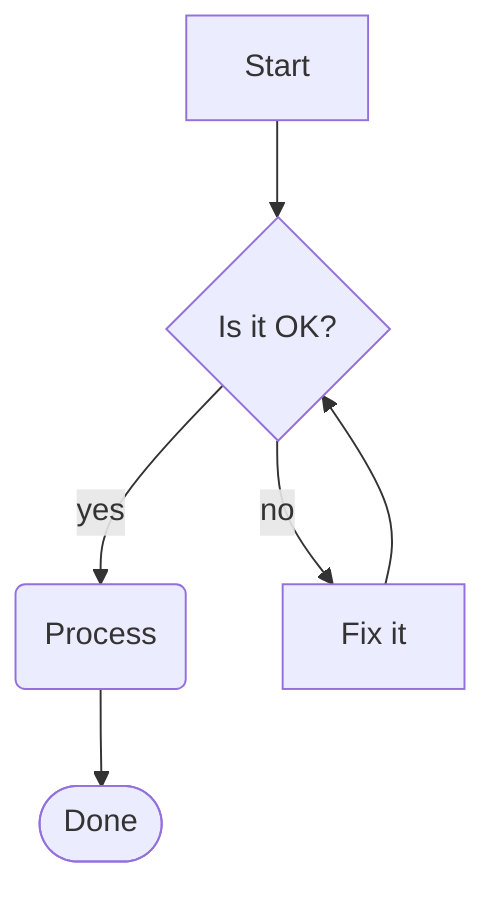
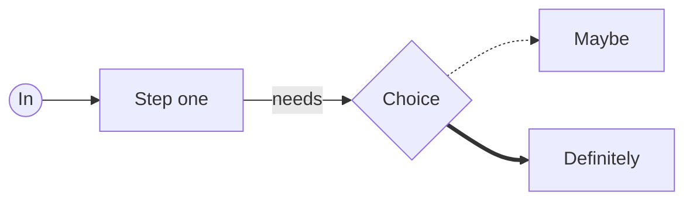
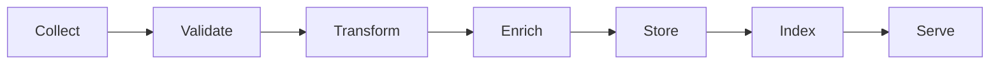
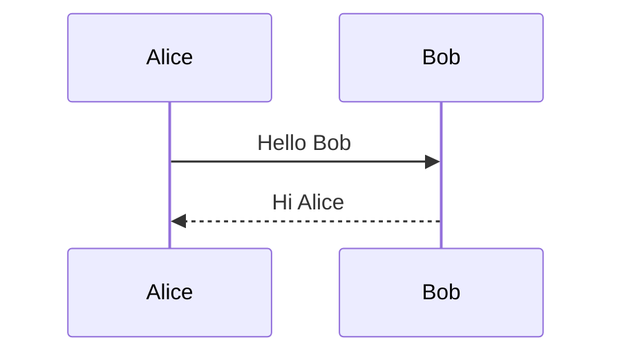

# Mermaid diagrams

A flowchart with shapes, labels and a loop:

Left-to-right with a dotted and a thick link:

A wider graph (scroll it horizontally — drag the scrollbar, pan with the
mouse, or Shift+wheel):

An unsupported type renders as a labelled card (not raw code):

